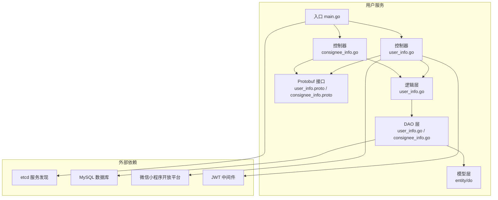
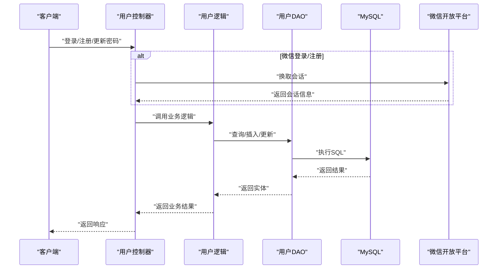
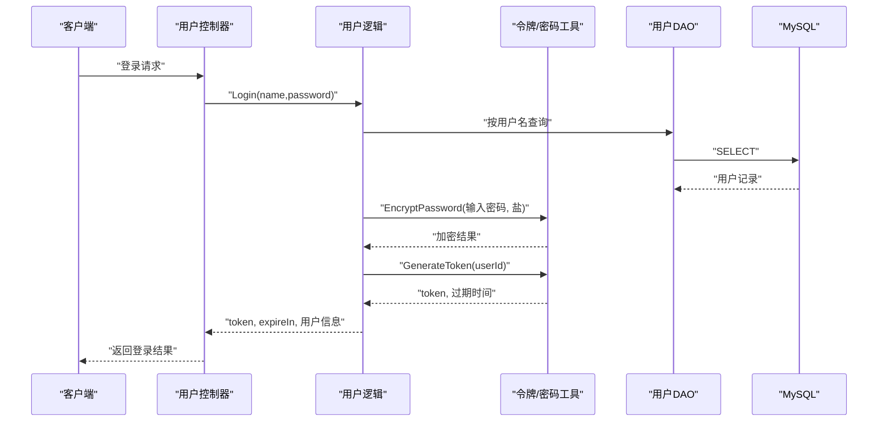
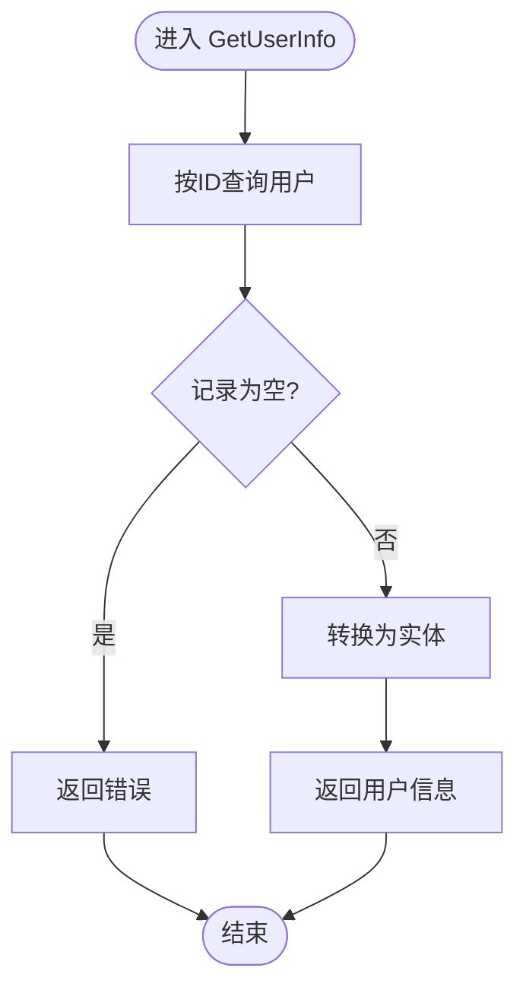
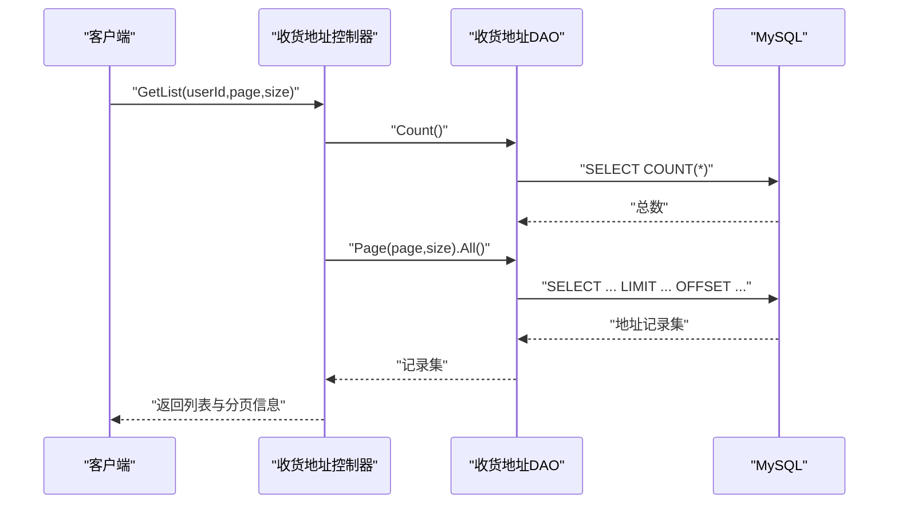
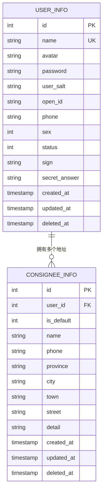
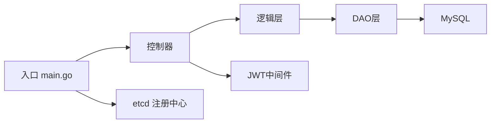

# 用户服务模块

<cite>
**本文引用的文件**
- [main.go](file://app/user/main.go)
- [user_info.go](file://app/user/internal/controller/user_info/user_info.go)
- [consignee_info.go](file://app/user/internal/controller/consignee_info/consignee_info.go)
- [user_info.go](file://app/user/internal/dao/user_info.go)
- [user_info.go](file://app/user/internal/dao/internal/user_info.go)
- [consignee_info.go](file://app/user/internal/dao/consignee_info.go)
- [consignee_info.go](file://app/user/internal/dao/internal/consignee_info.go)
- [user_info.go](file://app/user/internal/model/entity/user_info.go)
- [user_info.go](file://app/user/internal/model/do/user_info.go)
- [consignee_info.go](file://app/user/internal/model/entity/consignee_info.go)
- [user_info.go](file://app/user/internal/logic/user_info/user_info.go)
- [jwt.go](file://utility/middleware/jwt.go)
- [token.go](file://utility/token.go)
- [user_info.proto](file://app/user/manifest/protobuf/user_info/v1/user_info.proto)
- [consignee_info.proto](file://app/user/manifest/protobuf/consignee_info/v1/consignee_info.proto)
</cite>

## 目录
1. [简介](#简介)
2. [项目结构](#项目结构)
3. [核心组件](#核心组件)
4. [架构总览](#架构总览)
5. [详细组件分析](#详细组件分析)
6. [依赖关系分析](#依赖关系分析)
7. [性能考虑](#性能考虑)
8. [故障排查指南](#故障排查指南)
9. [结论](#结论)
10. [附录](#附录)

## 简介
本文件面向“用户服务模块”，系统化阐述其设计架构、核心功能与实现细节。重点覆盖以下方面：
- 用户注册与登录机制（传统账号密码、微信小程序登录）
- 用户信息管理（查询、更新）
- 收货地址管理（分页列表、新增、更新、删除）
- 权限控制与安全措施（JWT认证、密码加密策略、用户状态管理）
- 数据模型设计、DAO层实现、业务逻辑处理与API接口规范
- 与其他服务的交互关系与数据流转过程

## 项目结构
用户服务采用GoFrame微服务框架，遵循“controller-logic-dao-model”分层架构，并通过gRPC暴露服务接口。关键目录与职责如下：
- app/user/main.go：服务入口，注册etcd解析器并启动命令行入口
- internal/controller：gRPC控制器，负责请求接入、参数校验、调用logic层并返回响应
- internal/logic：业务逻辑层，封装用户与收货地址的核心业务规则
- internal/dao：数据访问对象，基于GoFrame ORM封装数据库操作
- internal/model：数据模型，包含实体结构与DAO查询条件结构
- manifest/protobuf：定义gRPC接口契约与消息格式
- utility：通用工具，包括JWT中间件与令牌/密码加密工具

图表来源
- [main.go](file://app/user/main.go#L1-L25)
- [user_info.go](file://app/user/internal/controller/user_info/user_info.go#L1-L268)
- [consignee_info.go](file://app/user/internal/controller/consignee_info/consignee_info.go#L1-L122)
- [user_info.go](file://app/user/internal/dao/user_info.go#L1-L23)
- [consignee_info.go](file://app/user/internal/dao/consignee_info.go#L1-L23)
- [user_info.go](file://app/user/internal/model/entity/user_info.go#L1-L28)
- [consignee_info.go](file://app/user/internal/model/entity/consignee_info.go#L1-L27)
- [user_info.proto](file://app/user/manifest/protobuf/user_info/v1/user_info.proto#L1-L123)
- [consignee_info.proto](file://app/user/manifest/protobuf/consignee_info/v1/consignee_info.proto#L1-L73)

章节来源
- [main.go](file://app/user/main.go#L1-L25)

## 核心组件
- 控制器层
  - 用户控制器：提供登录、注册、密码修改、用户信息查询、微信登录/注册等接口
  - 收货地址控制器：提供地址列表、新增、更新、删除接口
- 逻辑层
  - 用户逻辑：登录校验、注册流程、密码修改、用户信息查询、微信登录/注册
  - 收货地址逻辑：地址列表分页、新增、更新、删除
- DAO层
  - 用户DAO：封装用户表的查询、插入、更新、事务
  - 收货地址DAO：封装地址表的查询、插入、更新、删除、事务
- 模型层
  - 实体结构：用户表、收货地址表的ORM映射
  - 查询条件结构：用于Where条件与批量查询
- 工具与中间件
  - JWT中间件：鉴权拦截、提取用户ID
  - 令牌与密码工具：生成随机盐、双重MD5加密、JWT签发与解析

章节来源
- [user_info.go](file://app/user/internal/controller/user_info/user_info.go#L1-L268)
- [consignee_info.go](file://app/user/internal/controller/consignee_info/consignee_info.go#L1-L122)
- [user_info.go](file://app/user/internal/logic/user_info/user_info.go#L1-L235)
- [user_info.go](file://app/user/internal/dao/user_info.go#L1-L23)
- [consignee_info.go](file://app/user/internal/dao/consignee_info.go#L1-L23)
- [user_info.go](file://app/user/internal/model/entity/user_info.go#L1-L28)
- [consignee_info.go](file://app/user/internal/model/entity/consignee_info.go#L1-L27)
- [jwt.go](file://utility/middleware/jwt.go#L1-L39)
- [token.go](file://utility/token.go#L1-L65)

## 架构总览
用户服务以gRPC为核心接口，结合GoFrame ORM与DAO模式实现数据持久化；通过JWT中间件实现统一鉴权；微信登录/注册流程对接微信开放平台。

图表来源
- [user_info.go](file://app/user/internal/controller/user_info/user_info.go#L37-L187)
- [user_info.go](file://app/user/internal/logic/user_info/user_info.go#L15-L51)
- [user_info.go](file://app/user/internal/dao/internal/user_info.go#L88-L95)
- [user_info.proto](file://app/user/manifest/protobuf/user_info/v1/user_info.proto#L8-L23)

## 详细组件分析

### 用户登录与注册流程
- 传统登录
  - 输入：用户名、密码
  - 步骤：参数校验 → 查询用户 → 校验密码（双重MD5） → 生成JWT → 返回token与用户信息
- 注册
  - 输入：用户名、密码、头像、性别、签名、密保答案
  - 步骤：参数校验 → 检查用户名重复 → 生成盐值 → 双重MD5加密 → 插入数据库 → 返回用户ID
- 微信登录/注册
  - 登录：通过code换取会话，若无绑定则返回“新用户”标记；若有则生成JWT
  - 注册：解密encryptedData填充用户资料，插入用户表并生成JWT

图表来源
- [user_info.go](file://app/user/internal/controller/user_info/user_info.go#L37-L69)
- [user_info.go](file://app/user/internal/logic/user_info/user_info.go#L15-L51)
- [token.go](file://utility/token.go#L25-L50)
- [user_info.go](file://app/user/internal/dao/internal/user_info.go#L88-L95)

章节来源
- [user_info.go](file://app/user/internal/controller/user_info/user_info.go#L37-L187)
- [user_info.go](file://app/user/internal/logic/user_info/user_info.go#L15-L93)
- [token.go](file://utility/token.go#L25-L50)

### 用户信息管理
- 查询用户信息
  - 输入：用户ID
  - 步骤：查询用户 → 结构体转换 → 返回用户信息
- 更新用户信息
  - 输入：用户ID、昵称、头像
  - 步骤：按ID更新 → 返回更新后的ID

图表来源
- [user_info.go](file://app/user/internal/logic/user_info/user_info.go#L133-L152)
- [user_info.go](file://app/user/internal/dao/internal/user_info.go#L88-L95)

章节来源
- [user_info.go](file://app/user/internal/controller/user_info/user_info.go#L112-L134)
- [user_info.go](file://app/user/internal/logic/user_info/user_info.go#L133-L152)

### 收货地址管理
- 列表分页
  - 输入：用户ID、页码、每页大小
  - 步骤：统计总数 → 分页查询地址 → 结构转换 → 返回列表与分页信息
- 新增地址
  - 输入：用户ID、默认标志、姓名、电话、省市区、详情
  - 步骤：插入地址 → 返回新增ID
- 更新/删除地址
  - 输入：地址ID
  - 步骤：按ID更新/删除 → 返回结果

图表来源
- [consignee_info.go](file://app/user/internal/controller/consignee_info/consignee_info.go#L28-L78)
- [consignee_info.go](file://app/user/internal/dao/internal/consignee_info.go#L86-L93)

章节来源
- [consignee_info.go](file://app/user/internal/controller/consignee_info/consignee_info.go#L28-L122)
- [consignee_info.go](file://app/user/internal/dao/internal/consignee_info.go#L86-L103)

### 数据模型设计
- 用户表（user_info）
  - 关键字段：用户名、头像、密码、盐值、OpenID、手机号、性别、状态、签名、密保答案、时间戳
  - 约束：用户名唯一；状态枚举（正常/冻结）
- 收货地址表（consignee_info）
  - 关键字段：用户ID、默认标志、姓名、电话、省市区、详情、时间戳
  - 约束：默认地址逻辑由业务层维护

图表来源
- [user_info.go](file://app/user/internal/model/entity/user_info.go#L11-L27)
- [consignee_info.go](file://app/user/internal/model/entity/consignee_info.go#L11-L26)

章节来源
- [user_info.go](file://app/user/internal/model/entity/user_info.go#L11-L27)
- [consignee_info.go](file://app/user/internal/model/entity/consignee_info.go#L11-L26)

### DAO层实现
- 用户DAO
  - 提供Ctx上下文模型、事务封装、常用查询方法
- 收货地址DAO
  - 提供Ctx上下文模型、事务封装、常用查询方法

章节来源
- [user_info.go](file://app/user/internal/dao/user_info.go#L11-L20)
- [user_info.go](file://app/user/internal/dao/internal/user_info.go#L14-L106)
- [consignee_info.go](file://app/user/internal/dao/consignee_info.go#L11-L20)
- [consignee_info.go](file://app/user/internal/dao/internal/consignee_info.go#L14-L104)

### API接口规范
- 用户服务接口（gRPC）
  - 登录、微信登录、微信注册、注册、修改密码、更新信息、获取用户信息
- 收货地址服务接口（gRPC）
  - 地址列表、新增、更新、删除

章节来源
- [user_info.proto](file://app/user/manifest/protobuf/user_info/v1/user_info.proto#L8-L23)
- [consignee_info.proto](file://app/user/manifest/protobuf/consignee_info/v1/consignee_info.proto#L9-L14)

## 依赖关系分析
- 控制器依赖逻辑层，逻辑层依赖DAO层，DAO层依赖数据库
- 控制器通过gRPC协议对外提供服务
- 入口通过etcd注册服务发现
- JWT中间件在控制器层进行鉴权

图表来源
- [main.go](file://app/user/main.go#L13-L24)
- [user_info.go](file://app/user/internal/controller/user_info/user_info.go#L33-L35)
- [jwt.go](file://utility/middleware/jwt.go#L16-L38)

章节来源
- [main.go](file://app/user/main.go#L13-L24)
- [jwt.go](file://utility/middleware/jwt.go#L16-L38)

## 性能考虑
- 数据库连接与事务
  - DAO层提供Transaction封装，避免重复事务样板代码
- 分页查询
  - 收货地址列表使用分页查询，降低单次查询负载
- 缓存策略
  - 可在逻辑层引入轻量缓存（如内存缓存）减少热点用户查询压力
- 并发与异步
  - 注册事件发布使用goroutine异步处理，避免阻塞主流程
- 日志与监控
  - 对关键路径增加日志与指标埋点，便于定位性能瓶颈

## 故障排查指南
- 登录失败
  - 检查用户名是否存在、密码是否正确（双重MD5匹配）、用户状态是否正常
- 注册失败
  - 检查用户名是否重复、密码长度是否满足要求、盐值生成与加密流程
- JWT鉴权失败
  - 检查请求头Authorization格式、Token是否过期、签名密钥是否一致
- 微信登录异常
  - 检查code是否有效、会话换取是否成功、encryptedData解密是否正确
- 数据库异常
  - 检查DAO层查询条件、事务提交/回滚逻辑、连接池配置

章节来源
- [user_info.go](file://app/user/internal/logic/user_info/user_info.go#L15-L51)
- [jwt.go](file://utility/middleware/jwt.go#L16-L38)
- [user_info.go](file://app/user/internal/controller/user_info/user_info.go#L136-L187)

## 结论
用户服务模块以清晰的分层架构实现了用户与收货地址的完整生命周期管理，结合JWT与微信生态提供了灵活的登录方式。通过DAO层抽象与事务封装，保证了数据一致性与可维护性。建议在后续迭代中进一步完善缓存策略、监控告警与安全加固（如动态密钥轮换、接口限流）。

## 附录
- 安全措施
  - 密码加密：双重MD5 + 随机盐
  - JWT：HS256签名、固定密钥、24小时有效期
  - 用户状态：正常/冻结状态控制
- 配置项
  - etcd地址：服务发现
  - 微信小程序配置：AppID、Secret
- 最佳实践
  - 严格参数校验与错误码封装
  - 使用事务保证关键业务一致性
  - 异步处理非关键流程（如注册事件）