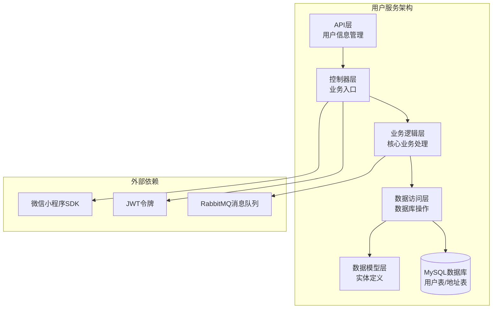
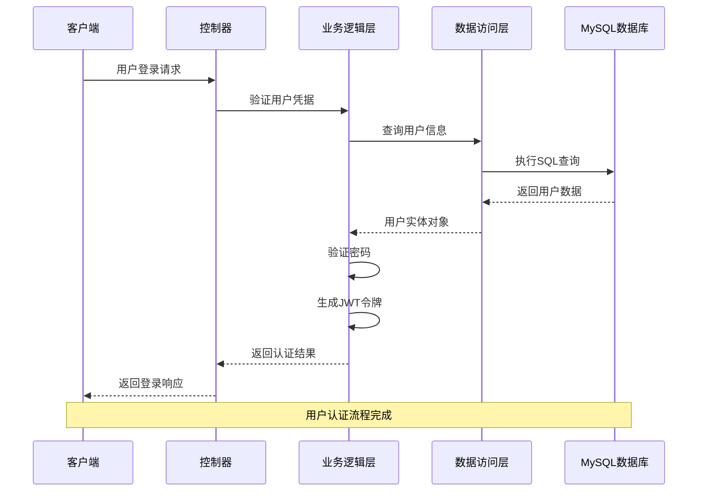
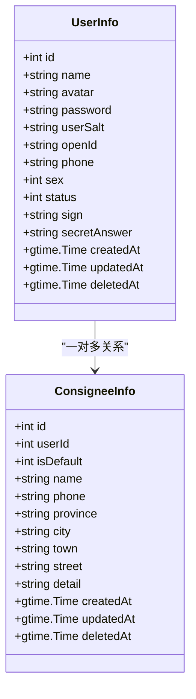
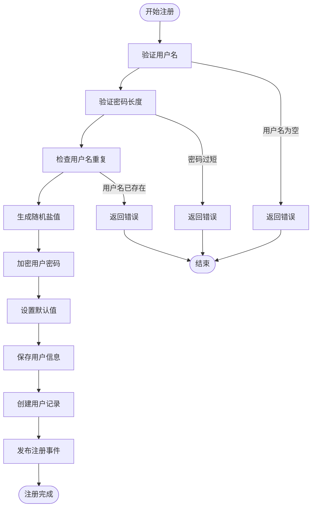
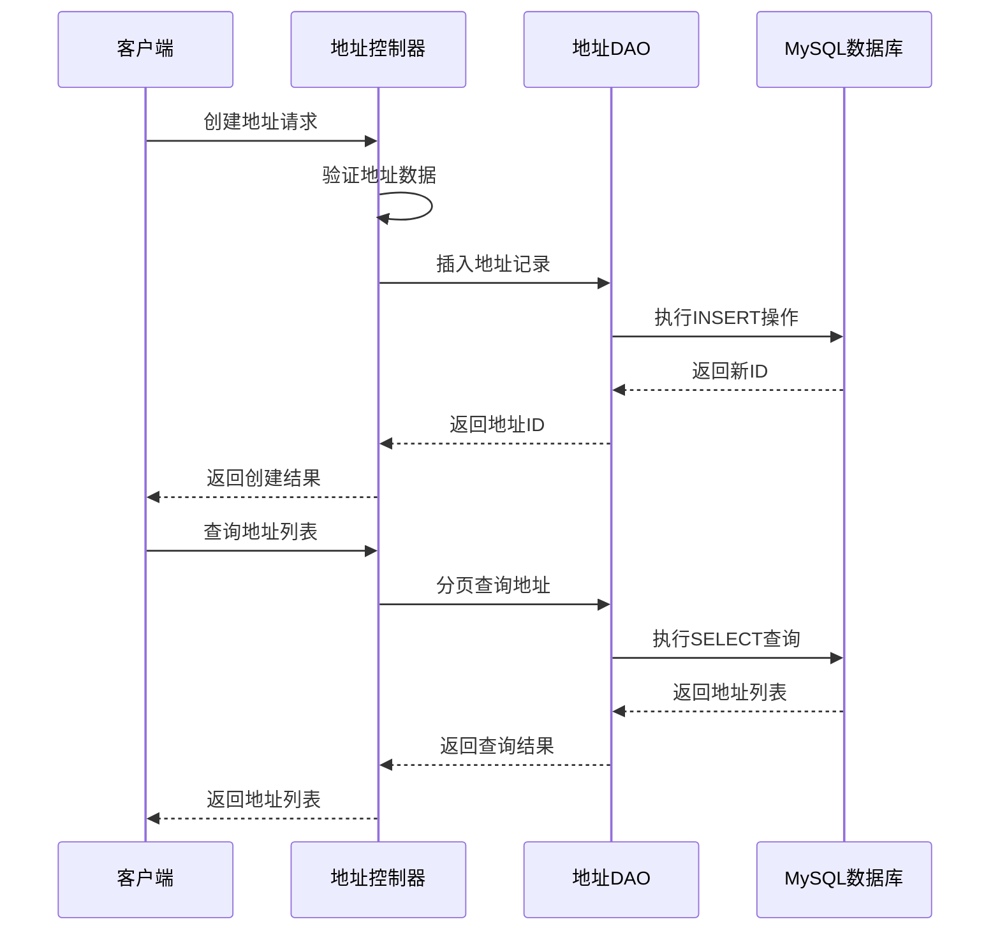
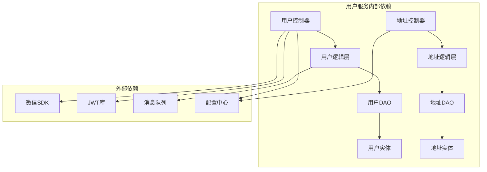

# 用户管理功能

<cite>
**本文档引用的文件**
- [app/user/internal/controller/user_info/user_info.go](file://app/user/internal/controller/user_info/user_info.go)
- [app/user/internal/controller/consignee_info/consignee_info.go](file://app/user/internal/controller/consignee_info/consignee_info.go)
- [app/user/internal/dao/user_info.go](file://app/user/internal/dao/user_info.go)
- [app/user/internal/dao/consignee_info.go](file://app/user/internal/dao/consignee_info.go)
- [app/user/internal/dao/internal/user_info.go](file://app/user/internal/dao/internal/user_info.go)
- [app/user/internal/dao/internal/consignee_info.go](file://app/user/internal/dao/internal/consignee_info.go)
- [app/user/internal/model/entity/user_info.go](file://app/user/internal/model/entity/user_info.go)
- [app/user/internal/model/entity/consignee_info.go](file://app/user/internal/model/entity/consignee_info.go)
- [app/user/internal/logic/user_info/user_info.go](file://app/user/internal/logic/user_info/user_info.go)
- [app/user/manifest/protobuf/user_info/v1/user_info.proto](file://app/user/manifest/protobuf/user_info/v1/user_info.proto)
- [app/user/manifest/protobuf/consignee_info/v1/consignee_info.proto](file://app/user/manifest/protobuf/consignee_info/v1/consignee_info.proto)
- [app/user/hack/user_info.sql](file://app/user/hack/user_info.sql)
- [init-db/01_init.sql](file://init-db/01_init.sql)
</cite>

## 目录
1. [简介](#简介)
2. [项目结构](#项目结构)
3. [核心组件](#核心组件)
4. [架构概览](#架构概览)
5. [详细组件分析](#详细组件分析)
6. [依赖关系分析](#依赖关系分析)
7. [性能考虑](#性能考虑)
8. [故障排除指南](#故障排除指南)
9. [结论](#结论)

## 简介
本文档全面介绍了微服务架构中的用户管理功能，涵盖用户基本信息管理、收货地址管理、用户状态控制等核心功能。详细解释了用户注册流程、信息修改机制、头像上传处理。深入说明了收货地址的增删改查操作、默认地址设置规则、地址验证逻辑。包含用户数据模型设计、DAO层实现细节、业务逻辑处理流程。提供具体的API接口文档、参数说明、返回值格式和错误处理机制。

## 项目结构
用户管理功能采用GoFrame微服务架构，按照功能模块化组织：

**图表来源**
- [app/user/internal/controller/user_info/user_info.go](file://app/user/internal/controller/user_info/user_info.go#L1-L268)
- [app/user/internal/controller/consignee_info/consignee_info.go](file://app/user/internal/controller/consignee_info/consignee_info.go#L1-L122)

**章节来源**
- [app/user/internal/controller/user_info/user_info.go](file://app/user/internal/controller/user_info/user_info.go#L1-L268)
- [app/user/internal/controller/consignee_info/consignee_info.go](file://app/user/internal/controller/consignee_info/consignee_info.go#L1-L122)

## 核心组件

### 用户信息服务
用户信息服务提供了完整的用户生命周期管理功能，包括：

- **用户认证**：用户名密码登录、微信小程序登录
- **用户注册**：用户名密码注册、微信小程序注册
- **信息管理**：用户信息查询、密码修改、头像上传
- **状态控制**：用户状态管理、账户安全

### 收货地址服务
收货地址服务专注于地址管理的完整生命周期：

- **地址CRUD**：创建、查询、更新、删除收货地址
- **默认地址**：默认地址设置与管理
- **分页查询**：支持分页的地址列表查询
- **地址验证**：地址信息的完整性验证

**章节来源**
- [app/user/internal/logic/user_info/user_info.go](file://app/user/internal/logic/user_info/user_info.go#L1-L235)
- [app/user/internal/model/entity/user_info.go](file://app/user/internal/model/entity/user_info.go#L1-L28)

## 架构概览

**图表来源**
- [app/user/internal/controller/user_info/user_info.go](file://app/user/internal/controller/user_info/user_info.go#L37-L69)
- [app/user/internal/logic/user_info/user_info.go](file://app/user/internal/logic/user_info/user_info.go#L15-L51)

## 详细组件分析

### 用户信息管理组件

#### 数据模型设计
用户数据模型采用结构化设计，包含完整的用户信息字段：

**图表来源**
- [app/user/internal/model/entity/user_info.go](file://app/user/internal/model/entity/user_info.go#L12-L27)
- [app/user/internal/model/entity/consignee_info.go](file://app/user/internal/model/entity/consignee_info.go#L12-L26)

#### 用户注册流程
用户注册流程包含多重验证和安全措施：

**图表来源**
- [app/user/internal/logic/user_info/user_info.go](file://app/user/internal/logic/user_info/user_info.go#L53-L93)

#### 用户认证机制
支持多种认证方式，确保系统的安全性：

**章节来源**
- [app/user/internal/logic/user_info/user_info.go](file://app/user/internal/logic/user_info/user_info.go#L15-L51)
- [app/user/internal/logic/user_info/user_info.go](file://app/user/internal/logic/user_info/user_info.go#L154-L190)

### 收货地址管理组件

#### 地址管理流程
收货地址管理提供完整的CRUD操作：

**图表来源**
- [app/user/internal/controller/consignee_info/consignee_info.go](file://app/user/internal/controller/consignee_info/consignee_info.go#L80-L121)
- [app/user/internal/controller/consignee_info/consignee_info.go](file://app/user/internal/controller/consignee_info/consignee_info.go#L27-L78)

#### 默认地址设置规则
系统支持默认地址设置，确保用户下单时的地址选择：

**章节来源**
- [app/user/internal/controller/consignee_info/consignee_info.go](file://app/user/internal/controller/consignee_info/consignee_info.go#L80-L121)
- [app/user/internal/model/entity/consignee_info.go](file://app/user/internal/model/entity/consignee_info.go#L15)

### API接口文档

#### 用户信息服务接口

| 接口名称 | HTTP方法 | 请求路径 | 功能描述 |
|---------|---------|---------|---------|
| Login | POST | `/user/info/login` | 用户名密码登录 |
| Register | POST | `/user/info/register` | 用户注册 |
| UpdatePassword | PUT | `/user/info/update/password` | 修改密码 |
| GetUserInfo | GET | `/user/info/{id}` | 获取用户信息 |
| WxMiniLogin | POST | `/user/info/wx/mini/login` | 微信小程序登录 |
| WxMiniRegister | POST | `/user/info/wx/mini/register` | 微信小程序注册 |

#### 收货地址服务接口

| 接口名称 | HTTP方法 | 请求路径 | 功能描述 |
|---------|---------|---------|---------|
| GetList | GET | `/user/consignee/list` | 获取地址列表 |
| Create | POST | `/user/consignee/create` | 创建地址 |
| Update | PUT | `/user/consignee/update` | 更新地址 |
| Delete | DELETE | `/user/consignee/delete/{id}` | 删除地址 |

**章节来源**
- [app/user/manifest/protobuf/user_info/v1/user_info.proto](file://app/user/manifest/protobuf/user_info/v1/user_info.proto#L8-L23)
- [app/user/manifest/protobuf/consignee_info/v1/consignee_info.proto](file://app/user/manifest/protobuf/consignee_info/v1/consignee_info.proto#L9-L14)

## 依赖关系分析

**图表来源**
- [app/user/internal/controller/user_info/user_info.go](file://app/user/internal/controller/user_info/user_info.go#L1-L268)
- [app/user/internal/controller/consignee_info/consignee_info.go](file://app/user/internal/controller/consignee_info/consignee_info.go#L1-L122)

**章节来源**
- [app/user/internal/dao/user_info.go](file://app/user/internal/dao/user_info.go#L1-L23)
- [app/user/internal/dao/consignee_info.go](file://app/user/internal/dao/consignee_info.go#L1-L23)

## 性能考虑

### 数据库优化
- **索引设计**：用户表使用复合索引优化查询性能
- **分页查询**：地址列表查询支持分页，避免大数据量查询
- **连接池**：合理配置数据库连接池大小

### 缓存策略
- **用户信息缓存**：热点用户信息缓存减少数据库压力
- **令牌缓存**：JWT令牌黑名单缓存提升验证效率

### 异步处理
- **注册事件**：用户注册后异步处理相关业务逻辑
- **消息队列**：使用RabbitMQ处理异步任务

## 故障排除指南

### 常见错误及解决方案

| 错误类型 | 错误代码 | 描述 | 解决方案 |
|---------|---------|------|---------|
| 用户名错误 | 1001 | 用户名为空 | 验证用户名输入 |
| 密码错误 | 1002 | 密码为空或错误 | 检查密码输入和加密 |
| 用户不存在 | 1003 | 查询不到用户 | 确认用户是否存在 |
| 密码过短 | 1004 | 密码长度小于6位 | 提示用户修改密码 |
| 用户已存在 | 1005 | 注册用户名重复 | 更换用户名重新注册 |
| 地址无效 | 2001 | 地址信息不完整 | 验证地址字段完整性 |

### 日志记录
系统提供详细的日志记录机制，便于问题排查：

**章节来源**
- [app/user/internal/controller/user_info/user_info.go](file://app/user/internal/controller/user_info/user_info.go#L42-L46)
- [app/user/internal/controller/consignee_info/consignee_info.go](file://app/user/internal/controller/consignee_info/consignee_info.go#L41-L44)

## 结论

用户管理功能采用微服务架构设计，具有以下特点：

1. **模块化设计**：清晰的分层架构，职责分离明确
2. **安全性保障**：多重验证机制，密码加密存储
3. **扩展性强**：支持多种认证方式和业务扩展
4. **性能优化**：合理的数据库设计和缓存策略
5. **易于维护**：清晰的代码结构和完善的错误处理

该系统为后续的功能扩展和业务发展奠定了坚实的基础，能够满足电商场景下的用户管理需求。