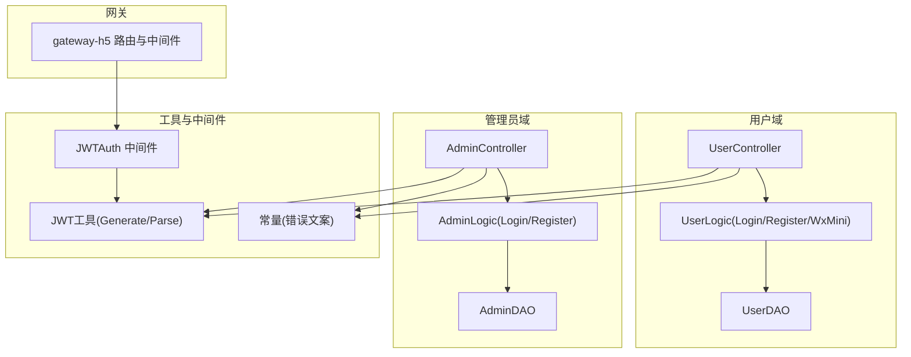
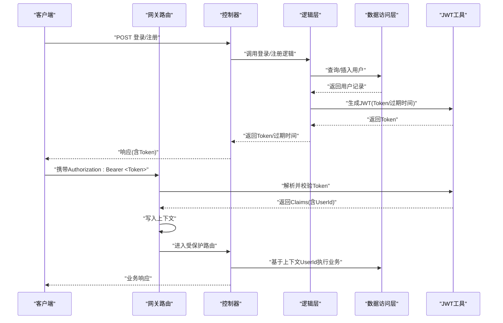
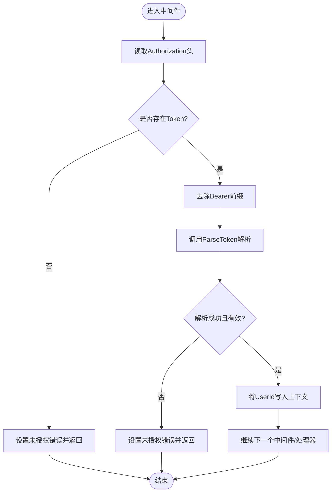
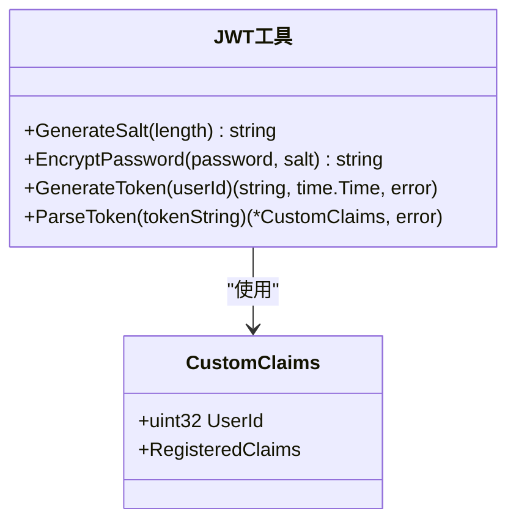
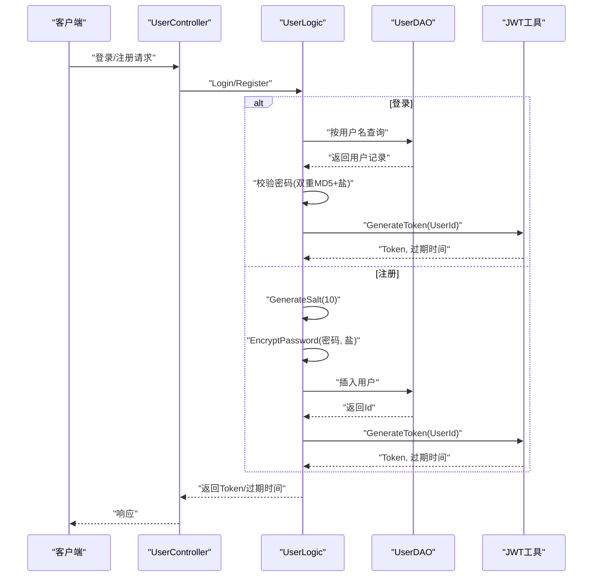
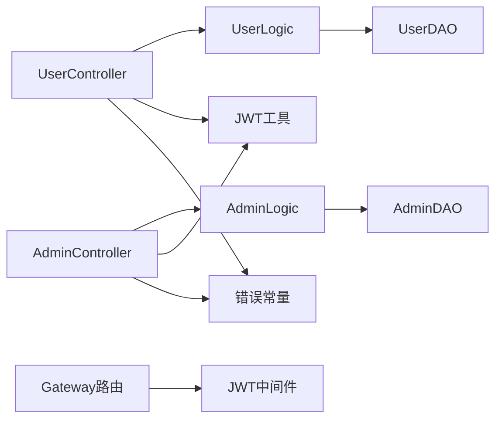

# 用户认证系统

<cite>
**本文引用的文件**
- [utility/middleware/jwt.go](file://utility/middleware/jwt.go)
- [utility/token.go](file://utility/token.go)
- [app/user/internal/logic/user_info/user_info.go](file://app/user/internal/logic/user_info/user_info.go)
- [app/admin/internal/logic/admin_info/admin_info.go](file://app/admin/internal/logic/admin_info/admin_info.go)
- [app/user/internal/controller/user_info/user_info.go](file://app/user/internal/controller/user_info/user_info.go)
- [app/admin/internal/controller/admin_info/admin_info.go](file://app/admin/internal/controller/admin_info/admin_info.go)
- [app/gateway-h5/internal/cmd/cmd.go](file://app/gateway-h5/internal/cmd/cmd.go)
- [utility/middleware/middleware.go](file://utility/middleware/middleware.go)
- [utility/consts/consts.go](file://utility/consts/consts.go)
- [app/user/hack/user_info.sql](file://app/user/hack/user_info.sql)
- [app/admin/hack/admin.sql](file://app/admin/hack/admin.sql)
</cite>

## 目录
1. [简介](#简介)
2. [项目结构](#项目结构)
3. [核心组件](#核心组件)
4. [架构总览](#架构总览)
5. [组件详细分析](#组件详细分析)
6. [依赖关系分析](#依赖关系分析)
7. [性能考量](#性能考量)
8. [故障排查指南](#故障排查指南)
9. [结论](#结论)
10. [附录](#附录)

## 简介
本文件系统化梳理了该微服务项目中的用户认证体系，覆盖以下关键主题：
- JWT认证机制的实现原理与Token生成/验证流程
- 用户登录与注册的安全策略（密码加密、盐值机制）
- 认证中间件工作原理与路由绑定方式
- Token过期与刷新策略（当前实现与改进建议）
- 权限验证流程与上下文传递
- 控制器中使用认证中间件的实践与认证失败处理
- Session管理现状与建议
- 配置项、安全最佳实践与常见问题解决方案

## 项目结构
认证相关代码主要分布在如下模块：
- 工具与中间件：utility/middleware（JWT中间件）、utility（JWT工具、常量）
- 用户域：app/user（控制器、逻辑层、DAO、SQL）
- 管理员域：app/admin（控制器、逻辑层、DAO、SQL）
- 网关：app/gateway-h5（HTTP路由与中间件绑定）

图表来源
- [app/gateway-h5/internal/cmd/cmd.go](file://app/gateway-h5/internal/cmd/cmd.go#L33-L90)
- [utility/middleware/jwt.go](file://utility/middleware/jwt.go#L16-L38)
- [utility/token.go](file://utility/token.go#L32-L64)
- [app/user/internal/controller/user_info/user_info.go](file://app/user/internal/controller/user_info/user_info.go#L37-L69)
- [app/admin/internal/controller/admin_info/admin_info.go](file://app/admin/internal/controller/admin_info/admin_info.go#L23-L44)

章节来源
- [app/gateway-h5/internal/cmd/cmd.go](file://app/gateway-h5/internal/cmd/cmd.go#L33-L90)

## 核心组件
- JWT中间件：负责从请求头提取Token、去除Bearer前缀、解析并校验Token、将用户ID写入上下文，供后续业务使用。
- JWT工具：提供自定义声明结构、生成随机盐值、双重MD5密码加密、签发与解析JWT。
- 用户逻辑层：实现用户名密码登录、注册、微信小程序登录/注册，并在成功后签发JWT。
- 管理员逻辑层：实现管理员登录/注册，成功后签发JWT。
- 控制器：封装RPC/HTTP响应，统一错误包装与日志记录。
- 网关路由：对公开接口与需认证接口进行分组绑定，将JWT中间件应用于受保护路由。

章节来源
- [utility/middleware/jwt.go](file://utility/middleware/jwt.go#L16-L38)
- [utility/token.go](file://utility/token.go#L11-L64)
- [app/user/internal/logic/user_info/user_info.go](file://app/user/internal/logic/user_info/user_info.go#L15-L51)
- [app/admin/internal/logic/admin_info/admin_info.go](file://app/admin/internal/logic/admin_info/admin_info.go#L15-L46)
- [app/user/internal/controller/user_info/user_info.go](file://app/user/internal/controller/user_info/user_info.go#L37-L69)
- [app/admin/internal/controller/admin_info/admin_info.go](file://app/admin/internal/controller/admin_info/admin_info.go#L23-L44)

## 架构总览
下图展示了从客户端到服务端的典型认证流程，包括登录、Token发放、中间件校验与业务处理。

图表来源
- [app/user/internal/controller/user_info/user_info.go](file://app/user/internal/controller/user_info/user_info.go#L37-L69)
- [app/user/internal/logic/user_info/user_info.go](file://app/user/internal/logic/user_info/user_info.go#L15-L51)
- [utility/token.go](file://utility/token.go#L32-L64)
- [utility/middleware/jwt.go](file://utility/middleware/jwt.go#L16-L38)
- [app/gateway-h5/internal/cmd/cmd.go](file://app/gateway-h5/internal/cmd/cmd.go#L55-L89)

## 组件详细分析

### JWT中间件
- 功能要点
  - 从请求头读取Authorization字段
  - 去除“Bearer ”前缀
  - 调用工具层解析Token，校验有效性
  - 将UserId写入请求上下文，便于后续业务使用
  - 未提供Token或Token无效时，设置未授权错误并中断后续处理

图表来源
- [utility/middleware/jwt.go](file://utility/middleware/jwt.go#L16-L38)
- [utility/token.go](file://utility/token.go#L52-L64)

章节来源
- [utility/middleware/jwt.go](file://utility/middleware/jwt.go#L16-L38)

### JWT工具与声明
- 自定义声明结构包含UserId及标准声明（过期、签发、生效时间）
- SecretKey固定存储于工具包内
- 提供生成随机盐值、双重MD5密码加密、签发与解析JWT的方法

图表来源
- [utility/token.go](file://utility/token.go#L11-L64)

章节来源
- [utility/token.go](file://utility/token.go#L11-L64)

### 用户登录与注册
- 登录流程
  - 参数校验
  - 查询用户记录
  - 校验密码（双重MD5 + 盐值）
  - 生成JWT并返回Token与过期时间
- 注册流程
  - 参数校验
  - 检查用户名唯一性
  - 生成10位随机盐值
  - 使用双重MD5加密密码
  - 写入默认字段并入库
- 微信小程序登录/注册
  - 通过微信授权换取OpenID
  - 若用户不存在则注册并生成Token；若已存在则直接登录并生成Token

图表来源
- [app/user/internal/logic/user_info/user_info.go](file://app/user/internal/logic/user_info/user_info.go#L15-L51)
- [app/user/internal/logic/user_info/user_info.go](file://app/user/internal/logic/user_info/user_info.go#L53-L95)
- [app/user/internal/logic/user_info/user_info.go](file://app/user/internal/logic/user_info/user_info.go#L168-L190)
- [app/user/internal/logic/user_info/user_info.go](file://app/user/internal/logic/user_info/user_info.go#L192-L214)
- [utility/token.go](file://utility/token.go#L21-L29)
- [utility/token.go](file://utility/token.go#L32-L64)

章节来源
- [app/user/internal/logic/user_info/user_info.go](file://app/user/internal/logic/user_info/user_info.go#L15-L51)
- [app/user/internal/logic/user_info/user_info.go](file://app/user/internal/logic/user_info/user_info.go#L53-L95)
- [app/user/internal/logic/user_info/user_info.go](file://app/user/internal/logic/user_info/user_info.go#L168-L190)
- [app/user/internal/logic/user_info/user_info.go](file://app/user/internal/logic/user_info/user_info.go#L192-L214)

### 管理员登录与注册
- 登录：校验用户名与密码（双重MD5+盐），成功后签发JWT
- 注册：校验参数与唯一性，生成盐与加密密码，写入默认角色与时间戳后入库

章节来源
- [app/admin/internal/logic/admin_info/admin_info.go](file://app/admin/internal/logic/admin_info/admin_info.go#L15-L46)
- [app/admin/internal/logic/admin_info/admin_info.go](file://app/admin/internal/logic/admin_info/admin_info.go#L48-L95)

### 控制器与错误处理
- 控制器统一调用逻辑层，捕获错误并使用统一错误包装与日志记录
- 登录/注册响应中包含Token类型、Token字符串、过期时间（秒）以及用户基础信息

章节来源
- [app/user/internal/controller/user_info/user_info.go](file://app/user/internal/controller/user_info/user_info.go#L37-L69)
- [app/admin/internal/controller/admin_info/admin_info.go](file://app/admin/internal/controller/admin_info/admin_info.go#L23-L44)
- [utility/consts/consts.go](file://utility/consts/consts.go#L14-L18)

### 网关路由与中间件绑定
- 公开接口组：无需认证
- 受保护接口组：绑定JWTAuth中间件，所有请求必须携带有效Token
- CORS与gRPC超时拦截器作为辅助中间件

章节来源
- [app/gateway-h5/internal/cmd/cmd.go](file://app/gateway-h5/internal/cmd/cmd.go#L33-L90)
- [utility/middleware/middleware.go](file://utility/middleware/middleware.go#L10-L34)

## 依赖关系分析
- 控制器依赖逻辑层，逻辑层依赖DAO与JWT工具
- 网关路由依赖JWT中间件
- 错误包装与日志依赖统一常量与错误码

图表来源
- [app/user/internal/controller/user_info/user_info.go](file://app/user/internal/controller/user_info/user_info.go#L37-L69)
- [app/admin/internal/controller/admin_info/admin_info.go](file://app/admin/internal/controller/admin_info/admin_info.go#L23-L44)
- [app/user/internal/logic/user_info/user_info.go](file://app/user/internal/logic/user_info/user_info.go#L15-L51)
- [app/admin/internal/logic/admin_info/admin_info.go](file://app/admin/internal/logic/admin_info/admin_info.go#L15-L46)
- [app/gateway-h5/internal/cmd/cmd.go](file://app/gateway-h5/internal/cmd/cmd.go#L55-L89)
- [utility/middleware/jwt.go](file://utility/middleware/jwt.go#L16-L38)
- [utility/consts/consts.go](file://utility/consts/consts.go#L14-L18)

章节来源
- [app/user/internal/controller/user_info/user_info.go](file://app/user/internal/controller/user_info/user_info.go#L37-L69)
- [app/admin/internal/controller/admin_info/admin_info.go](file://app/admin/internal/controller/admin_info/admin_info.go#L23-L44)
- [app/user/internal/logic/user_info/user_info.go](file://app/user/internal/logic/user_info/user_info.go#L15-L51)
- [app/admin/internal/logic/admin_info/admin_info.go](file://app/admin/internal/logic/admin_info/admin_info.go#L15-L46)
- [app/gateway-h5/internal/cmd/cmd.go](file://app/gateway-h5/internal/cmd/cmd.go#L55-L89)
- [utility/middleware/jwt.go](file://utility/middleware/jwt.go#L16-L38)
- [utility/consts/consts.go](file://utility/consts/consts.go#L14-L18)

## 性能考量
- Token有效期固定为24小时，建议结合刷新令牌机制降低频繁登录成本
- 密码加密采用双重MD5，建议升级为现代密码哈希算法（如bcrypt/scrypt/argon2）
- 中间件解析Token为O(1)，整体认证路径轻量，瓶颈通常在数据库查询与网络延迟
- 对高并发场景建议引入Token缓存与限流策略

## 故障排查指南
- 未提供Token或Token为空
  - 现象：中间件直接返回未授权错误
  - 处理：确保前端正确携带Authorization头，格式为“Bearer <Token>”
- Token无效或已过期
  - 现象：解析失败或Claims为空
  - 处理：提示用户重新登录；检查服务器时间同步与SecretKey一致性
- 登录失败
  - 现象：用户名不存在、密码错误
  - 处理：核对用户名与密码；确认盐值与加密方式一致
- 注册失败
  - 现象：用户名重复、参数非法
  - 处理：检查唯一性约束与输入校验
- CORS跨域问题
  - 现象：浏览器阻止跨域请求
  - 处理：确认CORS中间件已启用并允许相应方法与头部

章节来源
- [utility/middleware/jwt.go](file://utility/middleware/jwt.go#L18-L31)
- [app/user/internal/logic/user_info/user_info.go](file://app/user/internal/logic/user_info/user_info.go#L17-L29)
- [app/user/internal/logic/user_info/user_info.go](file://app/user/internal/logic/user_info/user_info.go#L55-L69)
- [utility/middleware/middleware.go](file://utility/middleware/middleware.go#L10-L23)

## 结论
本认证体系以JWT为核心，结合中间件与逻辑层实现了完整的登录/注册流程，并通过网关路由对受保护接口进行统一鉴权。当前实现简洁可靠，具备进一步优化空间：引入刷新令牌、升级密码哈希算法、完善会话管理与审计日志等。

## 附录

### Token生成与验证流程（代码级）
- 生成Token：调用工具层生成方法，设置过期时间与签发时间
- 解析Token：根据固定SecretKey解析并校验有效性
- 中间件：从请求头读取Token，去除前缀，解析并写入上下文

章节来源
- [utility/token.go](file://utility/token.go#L32-L64)
- [utility/middleware/jwt.go](file://utility/middleware/jwt.go#L16-L38)

### 密码加密存储策略
- 盐值：注册时生成固定长度随机盐
- 加密：双重MD5（密码+盐）后入库
- 登录校验：使用相同盐对输入密码进行双重MD5比对

章节来源
- [utility/token.go](file://utility/token.go#L21-L29)
- [app/user/internal/logic/user_info/user_info.go](file://app/user/internal/logic/user_info/user_info.go#L71-L75)
- [app/admin/internal/logic/admin_info/admin_info.go](file://app/admin/internal/logic/admin_info/admin_info.go#L67-L71)

### Session管理机制
- 当前实现为无状态JWT，不涉及服务端Session
- 建议：对高安全场景引入服务端Session与黑名单机制，或采用短期Token+刷新Token策略

### 认证中间件使用示例（控制器）
- 在网关路由中对受保护接口组绑定JWTAuth中间件
- 控制器可通过上下文读取UserId，实现权限控制与业务逻辑

章节来源
- [app/gateway-h5/internal/cmd/cmd.go](file://app/gateway-h5/internal/cmd/cmd.go#L55-L89)
- [utility/middleware/jwt.go](file://utility/middleware/jwt.go#L34-L36)

### 认证失败处理
- 中间件：未提供或无效Token时返回未授权错误
- 控制器：捕获逻辑层错误并统一包装，记录日志

章节来源
- [utility/middleware/jwt.go](file://utility/middleware/jwt.go#L18-L31)
- [app/user/internal/controller/user_info/user_info.go](file://app/user/internal/controller/user_info/user_info.go#L42-L46)
- [app/admin/internal/controller/admin_info/admin_info.go](file://app/admin/internal/controller/admin_info/admin_info.go#L28-L32)

### 数据模型与初始化
- 用户表与管理员表结构包含密码、盐值、唯一索引等字段，支持认证流程

章节来源
- [app/user/hack/user_info.sql](file://app/user/hack/user_info.sql#L4-L21)
- [app/admin/hack/admin.sql](file://app/admin/hack/admin.sql#L4-L16)