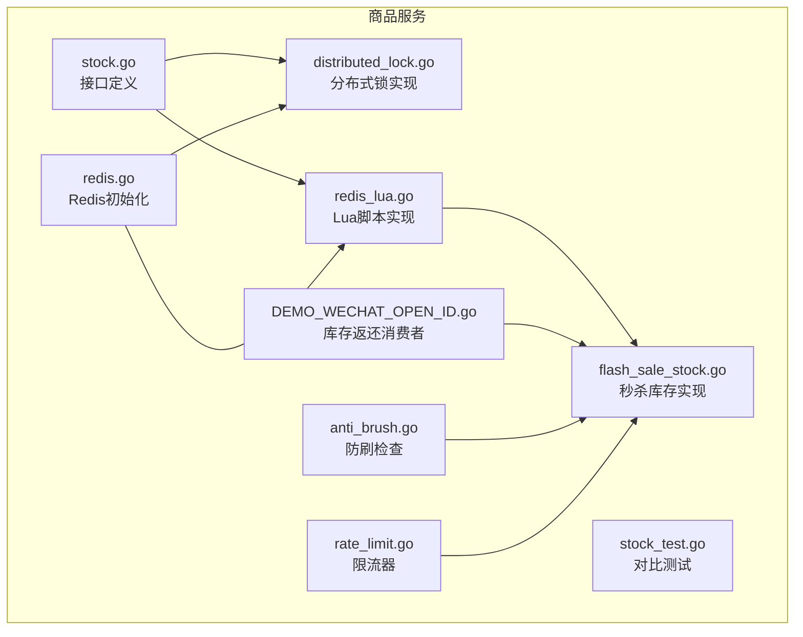
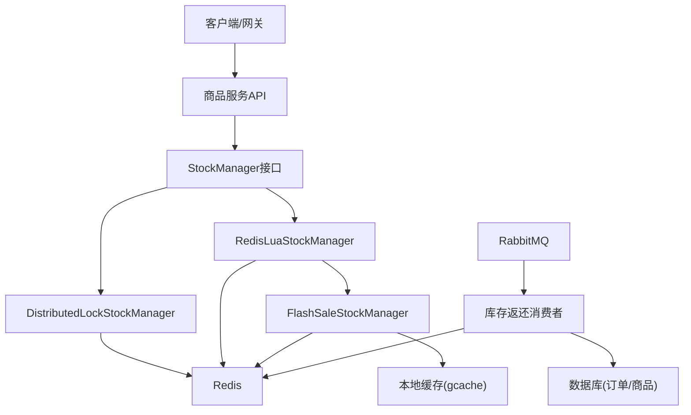
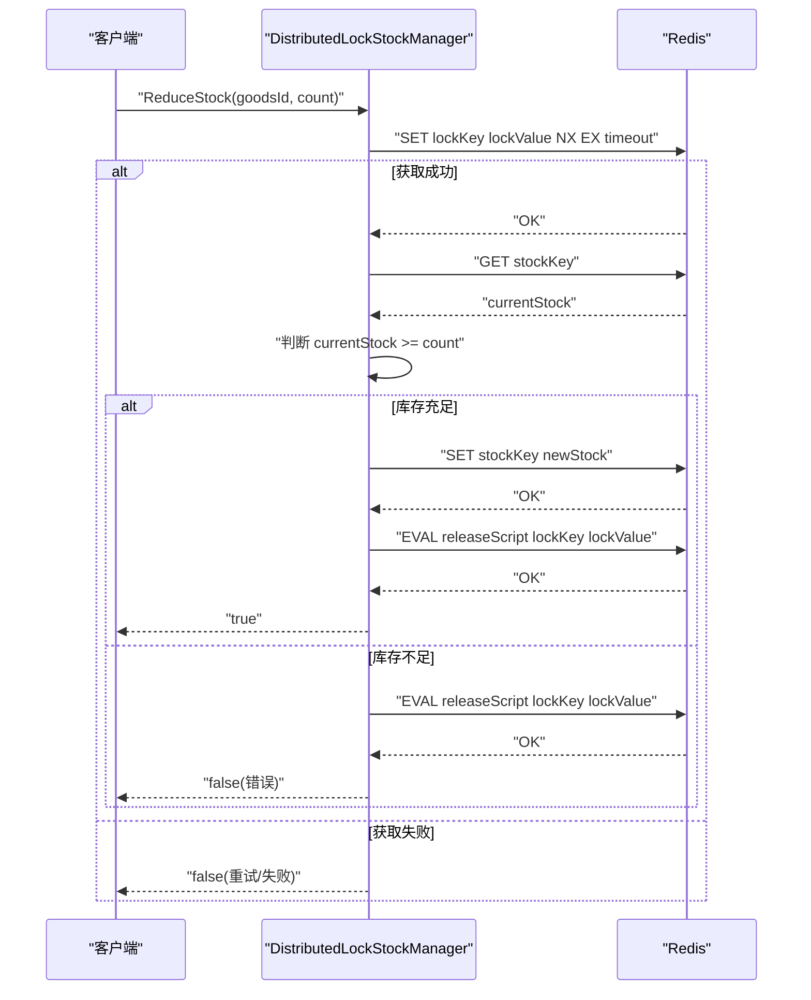
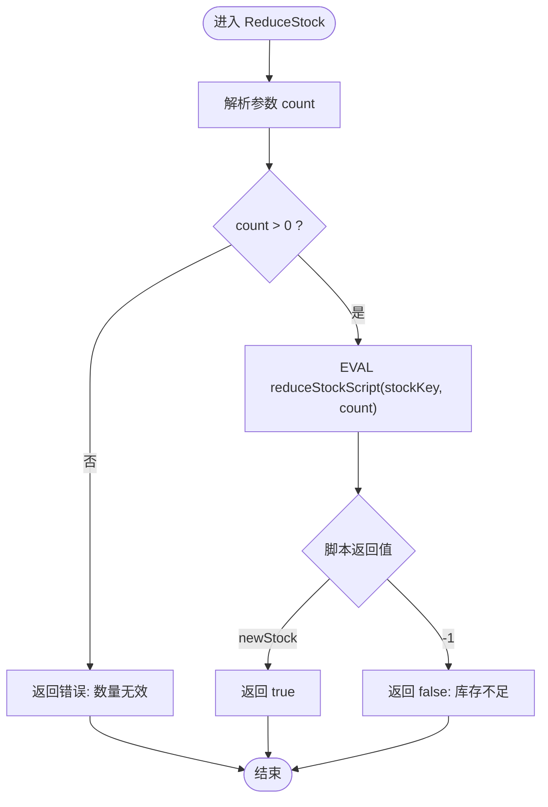
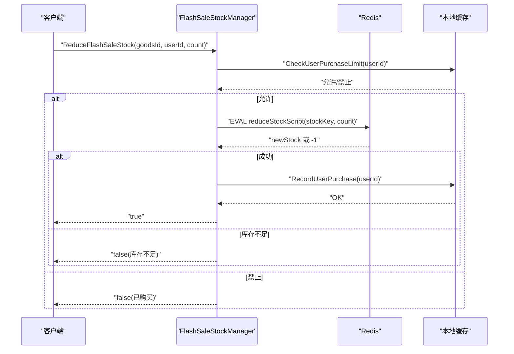
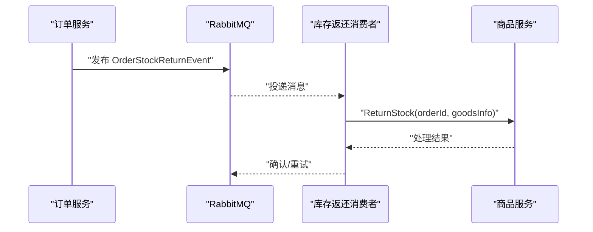
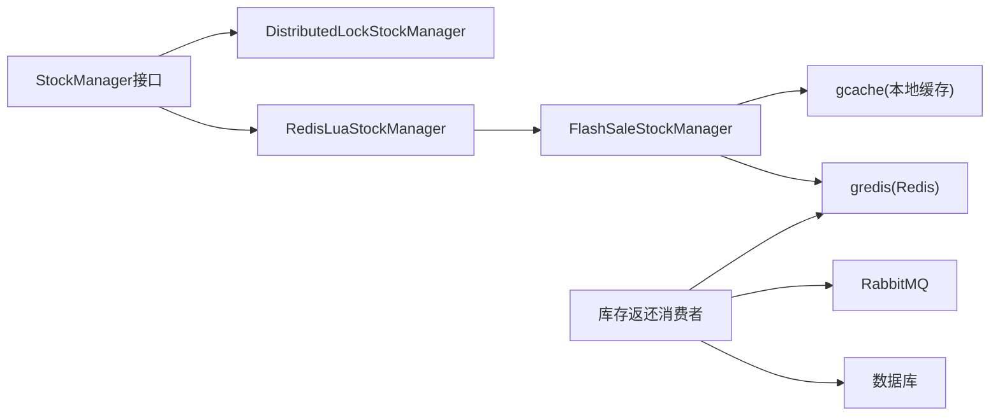

# 库存防超卖机制

<cite>
**本文档引用的文件**
- [distributed_lock.go](file://app/goods/utility/stock/distributed_lock.go)
- [redis_lua.go](file://app/goods/utility/stock/redis_lua.go)
- [flash_sale_stock.go](file://app/goods/utility/stock/flash_sale_stock.go)
- [stock.go](file://app/goods/utility/stock/stock.go)
- [stock_test.go](file://app/goods/utility/stock/stock_test.go)
- [redis.go](file://app/goods/utility/goodsRedis/redis.go)
- [DEMO_WECHAT_OPEN_ID.go](file://app/goods/utility/consumer/DEMO_WECHAT_OPEN_ID.go)
- [anti_brush.go](file://app/flash-sale/utility/anti_brush.go)
- [rate_limit.go](file://app/flash-sale/utility/rate_limit.go)
- [库存防超卖（Redis Lua+分布式锁对比实践）.md](file://doc/库存防超卖（Redis Lua+分布式锁对比实践）.md)
- [main.go](file://app/goods/main.go)
- [go.mod](file://go.mod)
</cite>

## 目录
1. [引言](#引言)
2. [项目结构](#项目结构)
3. [核心组件](#核心组件)
4. [架构概览](#架构概览)
5. [详细组件分析](#详细组件分析)
6. [依赖关系分析](#依赖关系分析)
7. [性能考量](#性能考量)
8. [故障排查指南](#故障排查指南)
9. [结论](#结论)
10. [附录](#附录)

## 引言
本文件系统性阐述本项目中的库存防超卖机制，重点覆盖基于Redis分布式锁与Redis Lua脚本两种实现方案。文档围绕分布式锁的获取与释放、Lua脚本原子性、库存检查与扣减的原子操作、一致性保障、并发控制与性能优化等方面展开，并提供最佳实践与常见问题解决方案，帮助读者在高并发场景下（如秒杀）实现稳定可靠的库存扣减。

## 项目结构
库存相关代码集中在商品服务的utility/stock目录，采用接口抽象与多实现策略，支持分布式锁与Lua脚本两种库存管理器；同时配套测试用例、Redis初始化、订单超时库存返还的异步消费者以及防刷与限流工具。

**图表来源**
- [stock.go](file://app/goods/utility/stock/stock.go#L1-L32)
- [distributed_lock.go](file://app/goods/utility/stock/distributed_lock.go#L1-L266)
- [redis_lua.go](file://app/goods/utility/stock/redis_lua.go#L1-L166)
- [flash_sale_stock.go](file://app/goods/utility/stock/flash_sale_stock.go#L1-L152)
- [stock_test.go](file://app/goods/utility/stock/stock_test.go#L1-L276)
- [redis.go](file://app/goods/utility/goodsRedis/redis.go#L1-L49)
- [DEMO_WECHAT_OPEN_ID.go](file://app/goods/utility/consumer/DEMO_WECHAT_OPEN_ID.go#L1-L58)
- [anti_brush.go](file://app/flash-sale/utility/anti_brush.go#L1-L81)
- [rate_limit.go](file://app/flash-sale/utility/rate_limit.go#L1-L161)

**章节来源**
- [stock.go](file://app/goods/utility/stock/stock.go#L1-L32)
- [distributed_lock.go](file://app/goods/utility/stock/distributed_lock.go#L1-L266)
- [redis_lua.go](file://app/goods/utility/stock/redis_lua.go#L1-L166)
- [flash_sale_stock.go](file://app/goods/utility/stock/flash_sale_stock.go#L1-L152)
- [stock_test.go](file://app/goods/utility/stock/stock_test.go#L1-L276)
- [redis.go](file://app/goods/utility/goodsRedis/redis.go#L1-L49)
- [DEMO_WECHAT_OPEN_ID.go](file://app/goods/utility/consumer/DEMO_WECHAT_OPEN_ID.go#L1-L58)
- [anti_brush.go](file://app/flash-sale/utility/anti_brush.go#L1-L81)
- [rate_limit.go](file://app/flash-sale/utility/rate_limit.go#L1-L161)

## 核心组件
- StockManager接口：定义库存管理的标准能力（扣减、返还、查询、初始化）。
- DistributedLockStockManager：基于Redis分布式锁的库存管理器，通过NX+EX的SET命令获取锁，使用Lua脚本原子释放锁。
- RedisLuaStockManager：基于Redis Lua脚本的库存管理器，将“查询-判断-扣减”封装为原子脚本，避免竞态。
- FlashSaleStockManager：秒杀场景的库存管理器，继承RedisLuaStockManager，增加用户购买限制与购买记录缓存。
- Redis初始化：在商品服务启动时初始化Redis连接与缓存适配器。
- 库存返还消费者：监听订单取消/超时事件，异步返还库存。
- 防刷与限流：在秒杀场景中对用户行为与请求频率进行限制，降低突发流量冲击。

**章节来源**
- [stock.go](file://app/goods/utility/stock/stock.go#L7-L31)
- [distributed_lock.go](file://app/goods/utility/stock/distributed_lock.go#L13-L29)
- [redis_lua.go](file://app/goods/utility/stock/redis_lua.go#L12-L23)
- [flash_sale_stock.go](file://app/goods/utility/stock/flash_sale_stock.go#L14-L40)
- [redis.go](file://app/goods/utility/goodsRedis/redis.go#L13-L48)
- [DEMO_WECHAT_OPEN_ID.go](file://app/goods/utility/consumer/DEMO_WECHAT_OPEN_ID.go#L12-L57)
- [anti_brush.go](file://app/flash-sale/utility/anti_brush.go#L12-L80)
- [rate_limit.go](file://app/flash-sale/utility/rate_limit.go#L13-L160)

## 架构概览
系统通过统一的StockManager接口屏蔽底层实现差异，Redis作为库存数据与分布式锁的载体。Lua脚本方案在Redis端原子执行库存检查与扣减，避免锁竞争；分布式锁方案在客户端侧加锁，适用于复杂业务流程。秒杀场景结合Lua脚本与本地缓存实现用户购买限制与购买记录，配合防刷与限流策略。

**图表来源**
- [stock.go](file://app/goods/utility/stock/stock.go#L7-L31)
- [distributed_lock.go](file://app/goods/utility/stock/distributed_lock.go#L46-L89)
- [redis_lua.go](file://app/goods/utility/stock/redis_lua.go#L75-L102)
- [flash_sale_stock.go](file://app/goods/utility/stock/flash_sale_stock.go#L52-L98)
- [DEMO_WECHAT_OPEN_ID.go](file://app/goods/utility/consumer/DEMO_WECHAT_OPEN_ID.go#L31-L56)

## 详细组件分析

### 分布式锁实现（DistributedLockStockManager）
- 锁获取：使用SET命令的NX+EX选项，value为随机字符串，避免误删他人持有的锁。
- 锁释放：使用Lua脚本判断锁值相等再DEL，确保原子性释放。
- 重试机制：获取锁失败时按固定次数与间隔重试，提升成功率。
- 库存操作：在持有锁期间读取当前库存，判断充足后扣减并写回，避免超卖。
- 锁超时：通过EX参数设置锁过期时间，防止死锁；结合Lua释放避免误删。

**图表来源**
- [distributed_lock.go](file://app/goods/utility/stock/distributed_lock.go#L46-L158)

**章节来源**
- [distributed_lock.go](file://app/goods/utility/stock/distributed_lock.go#L46-L158)

### Redis Lua脚本实现（RedisLuaStockManager）
- 原子性：将“获取库存-判断-扣减-写回”封装为Lua脚本，Redis单线程执行，天然避免竞态。
- 脚本设计：查询当前库存，判断是否足够，足够则扣减并返回新库存，否则返回失败标识。
- 返还库存：同样以原子脚本实现库存增加。
- 错误处理：解析脚本返回值，库存不足时返回明确错误。

**图表来源**
- [redis_lua.go](file://app/goods/utility/stock/redis_lua.go#L75-L102)

**章节来源**
- [redis_lua.go](file://app/goods/utility/stock/redis_lua.go#L30-L102)

### 秒杀库存实现（FlashSaleStockManager）
- 继承RedisLuaStockManager：复用原子扣减能力，保证高性能与强一致性。
- 用户购买限制：通过本地缓存检查用户是否已购买，避免重复购买。
- 购买记录：扣减成功后记录用户购买，设置24小时过期；若记录失败则回滚库存。
- 与防刷/限流协作：在上层服务中结合防刷检查与限流策略，降低异常流量冲击。

**图表来源**
- [flash_sale_stock.go](file://app/goods/utility/stock/flash_sale_stock.go#L52-L98)

**章节来源**
- [flash_sale_stock.go](file://app/goods/utility/stock/flash_sale_stock.go#L14-L152)

### 库存返还与一致性保障
- 异步返还：通过RabbitMQ事件驱动库存返还，避免阻塞主流程。
- 事件处理：消费者反序列化事件，调用库存返还逻辑，失败时可重试或告警。
- 与订单服务解耦：订单状态变更触发库存返还，保证最终一致性。

**图表来源**
- [DEMO_WECHAT_OPEN_ID.go](file://app/goods/utility/consumer/DEMO_WECHAT_OPEN_ID.go#L31-L56)

**章节来源**
- [DEMO_WECHAT_OPEN_ID.go](file://app/goods/utility/consumer/DEMO_WECHAT_OPEN_ID.go#L12-L57)

### Redis初始化与连接管理
- 初始化：从配置读取Redis配置，创建gredis实例，测试PING连通性。
- 缓存适配：将gredis适配为gcache的Redis适配器，统一缓存接口。
- 启动入口：在商品服务main函数中调用初始化，确保服务启动时Redis可用。

**章节来源**
- [redis.go](file://app/goods/utility/goodsRedis/redis.go#L13-L48)
- [main.go](file://app/goods/main.go#L15-L34)

## 依赖关系分析
- 接口与实现：StockManager抽象出统一能力，DistributedLockStockManager与RedisLuaStockManager分别实现。
- 外部依赖：使用gf框架的gredis与gcache，RabbitMQ进行事件传递。
- 版本与模块：go.mod声明了gogf、rabbitmq、etcd等依赖，确保运行时兼容性。

**图表来源**
- [stock.go](file://app/goods/utility/stock/stock.go#L7-L31)
- [distributed_lock.go](file://app/goods/utility/stock/distributed_lock.go#L13-L29)
- [redis_lua.go](file://app/goods/utility/stock/redis_lua.go#L12-L23)
- [flash_sale_stock.go](file://app/goods/utility/stock/flash_sale_stock.go#L28-L40)
- [DEMO_WECHAT_OPEN_ID.go](file://app/goods/utility/consumer/DEMO_WECHAT_OPEN_ID.go#L12-L29)

**章节来源**
- [go.mod](file://go.mod#L5-L22)

## 性能考量
- Lua脚本方案优势：单次EVAL完成查询-判断-扣减，网络交互少，吞吐量高，适合高并发场景。
- 分布式锁方案：需要多次Redis交互（加锁、查询、扣减、解锁），存在锁竞争与等待，性能随并发上升而下降。
- 秒杀场景：优先Lua脚本，结合本地缓存限制用户购买次数，配合防刷与限流，进一步削峰。
- 连接与缓存：使用gcache适配Redis，合理设置过期时间与抖动，避免缓存雪崩；消息队列异步处理库存返还，降低主流程压力。

[本节为通用性能讨论，无需具体文件分析]

## 故障排查指南
- 超卖现象：检查Lua脚本是否正确返回-1与newStock，确保Redis单线程原子性；分布式锁方案需确认Lua释放脚本与锁超时设置。
- 死锁与卡顿：分布式锁方案需关注锁超时时间与释放逻辑；Lua脚本方案无锁机制，避免死锁风险。
- 库存不一致：异步返还消费者需处理失败重试与告警；订单状态与库存状态需通过事件驱动保持最终一致。
- 并发峰值：结合防刷与限流策略，控制瞬时流量；必要时启用熔断降级，保护下游系统。

**章节来源**
- [distributed_lock.go](file://app/goods/utility/stock/distributed_lock.go#L66-L89)
- [redis_lua.go](file://app/goods/utility/stock/redis_lua.go#L75-L102)
- [DEMO_WECHAT_OPEN_ID.go](file://app/goods/utility/consumer/DEMO_WECHAT_OPEN_ID.go#L31-L56)
- [anti_brush.go](file://app/flash-sale/utility/anti_brush.go#L24-L80)
- [rate_limit.go](file://app/flash-sale/utility/rate_limit.go#L25-L160)

## 结论
- 在高并发、简单库存扣减场景（如秒杀），Redis Lua脚本方案具备更高的性能与更强的一致性保障。
- 在需要复杂业务流程与多资源协调的场景，分布式锁方案更合适，但需谨慎处理锁超时与释放。
- 结合本地缓存、防刷与限流策略，可显著提升系统在高峰期的稳定性与用户体验。
- 通过事件驱动的异步库存返还，实现与订单服务的解耦与最终一致性。

[本节为总结性内容，无需具体文件分析]

## 附录

### 最佳实践清单
- 选择方案：高并发简单扣减优先Lua脚本；复杂流程优先分布式锁。
- 锁与脚本：分布式锁使用NX+EX+Lua释放；Lua脚本严格返回-1与newStock。
- 缓存策略：合理设置过期时间与抖动，防止缓存雪崩；空值缓存防止穿透。
- 并发控制：API网关限流、RabbitMQ削峰、本地缓存预热。
- 监控告警：监控Redis性能、库存操作成功率与错误率，设置异常阈值。

**章节来源**
- [库存防超卖（Redis Lua+分布式锁对比实践）.md](file://doc/库存防超卖（Redis Lua+分布式锁对比实践）.md#L141-L224)

### 对比测试与验证
- 并发测试：模拟多goroutine同时扣减，统计成功/失败次数与最终库存，验证无超卖。
- 边界测试：库存为0扣减、负数扣减、返还库存等，确保错误处理正确。
- 回滚验证：秒杀场景记录购买失败时的库存回滚逻辑。

**章节来源**
- [stock_test.go](file://app/goods/utility/stock/stock_test.go#L32-L276)