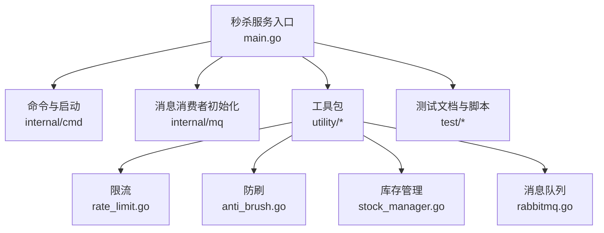
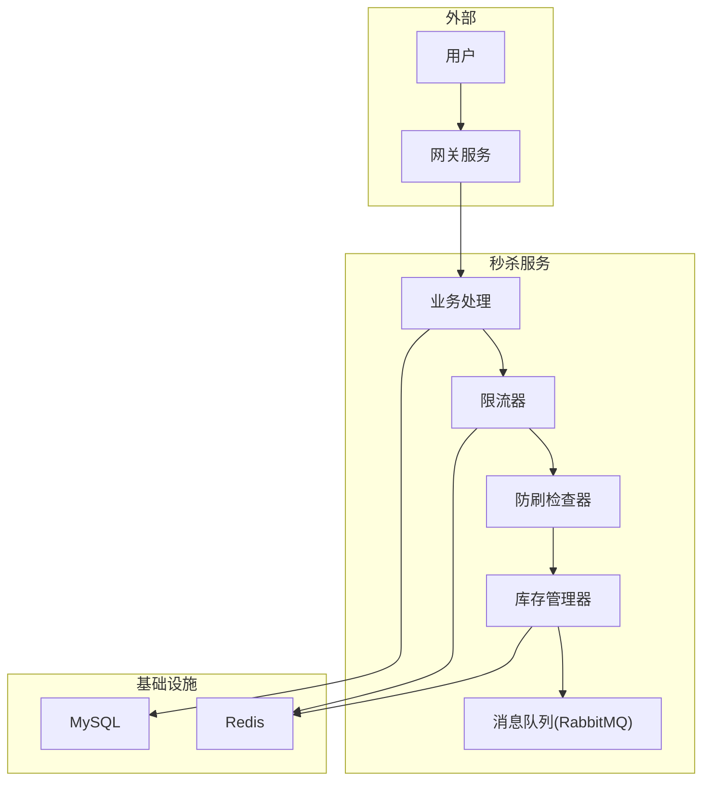
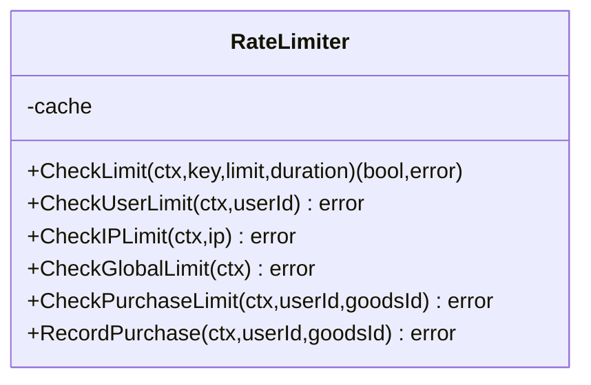
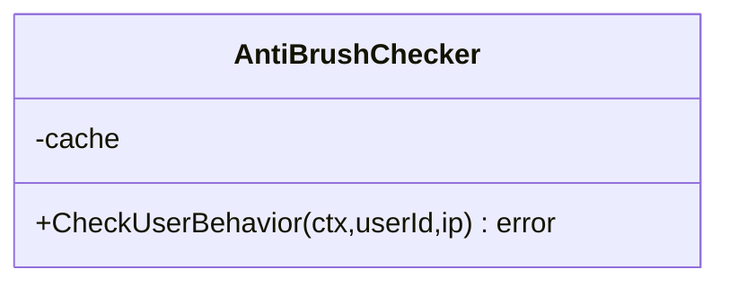
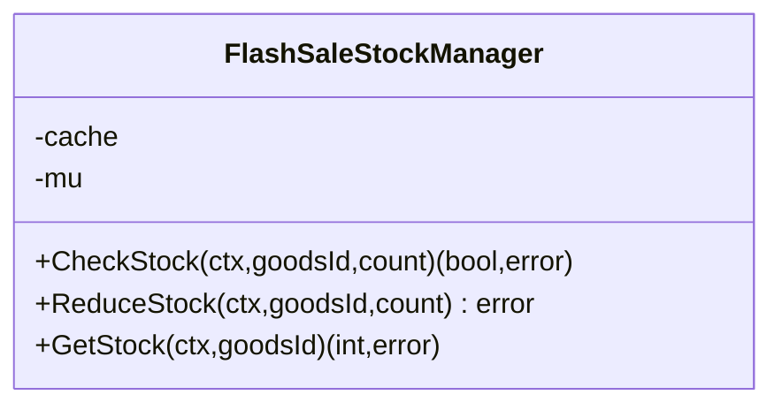
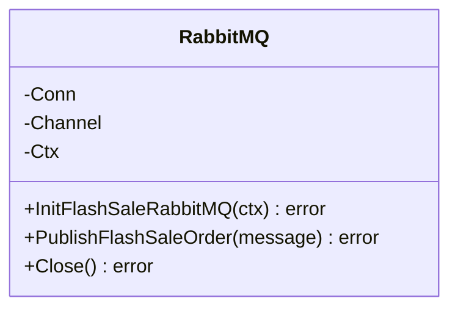
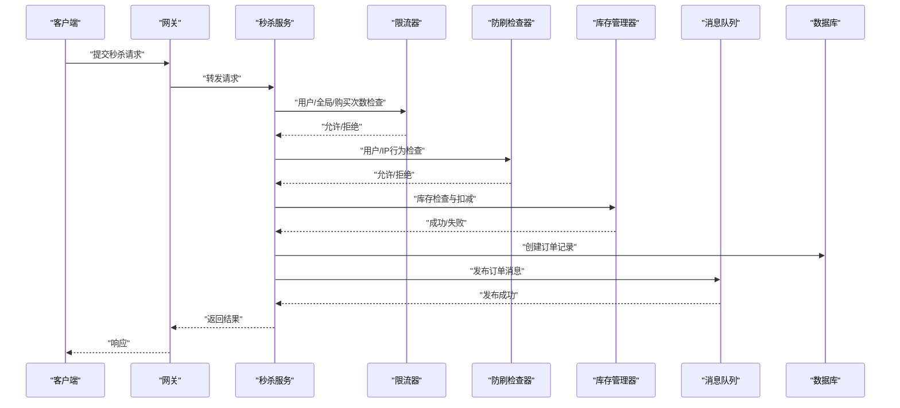
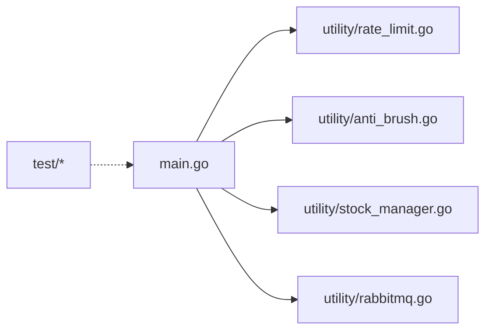

# 测试与部署

<cite>
**本文引用的文件**
- [app/flash-sale/test/TEST_DOCUMENTATION.md](file://app/flash-sale/test/TEST_DOCUMENTATION.md)
- [app/flash-sale/test/run_tests.bat](file://app/flash-sale/test/run_tests.bat)
- [app/flash-sale/DEPLOYMENT_TESTING_GUIDE.md](file://app/flash-sale/DEPLOYMENT_TESTING_GUIDE.md)
- [app/flash-sale/DEVELOPMENT_GUIDE.md](file://app/flash-sale/DEVELOPMENT_GUIDE.md)
- [app/flash-sale/main.go](file://app/flash-sale/main.go)
- [app/flash-sale/utility/rate_limit.go](file://app/flash-sale/utility/rate_limit.go)
- [app/flash-sale/utility/anti_brush.go](file://app/flash-sale/utility/anti_brush.go)
- [app/flash-sale/utility/stock_manager.go](file://app/flash-sale/utility/stock_manager.go)
- [app/flash-sale/utility/rabbitmq.go](file://app/flash-sale/utility/rabbitmq.go)
</cite>

## 目录
1. [简介](#简介)
2. [项目结构](#项目结构)
3. [核心组件](#核心组件)
4. [架构总览](#架构总览)
5. [详细组件分析](#详细组件分析)
6. [依赖关系分析](#依赖关系分析)
7. [性能考量](#性能考量)
8. [故障排查指南](#故障排查指南)
9. [结论](#结论)
10. [附录](#附录)

## 简介
本文件面向秒杀服务的测试与部署，系统化梳理测试策略（单元测试、集成测试、并发测试、性能基准）、测试环境与脚本、部署流程与配置、监控与验证、灰度与回滚、故障演练与运维最佳实践。内容以秒杀服务核心代码与配套文档为依据，辅以可视化图示帮助读者快速理解与落地。

## 项目结构
围绕秒杀服务的测试与部署，相关文件主要分布在以下位置：
- 测试文档与脚本：app/flash-sale/test
- 部署与测试指南：app/flash-sale/DEPLOYMENT_TESTING_GUIDE.md
- 开发与设计文档：app/flash-sale/DEVELOPMENT_GUIDE.md
- 服务入口与消息消费者初始化：app/flash-sale/main.go
- 核心能力工具：限流、防刷、库存、消息队列

**图示来源**
- [app/flash-sale/main.go](file://app/flash-sale/main.go#L1-L38)
- [app/flash-sale/utility/rate_limit.go](file://app/flash-sale/utility/rate_limit.go#L1-L161)
- [app/flash-sale/utility/anti_brush.go](file://app/flash-sale/utility/anti_brush.go#L1-L81)
- [app/flash-sale/utility/stock_manager.go](file://app/flash-sale/utility/stock_manager.go#L1-L90)
- [app/flash-sale/utility/rabbitmq.go](file://app/flash-sale/utility/rabbitmq.go#L1-L132)

**章节来源**
- [app/flash-sale/main.go](file://app/flash-sale/main.go#L1-L38)

## 核心组件
- 限流器：支持用户级、IP级、全局级与购买次数限制，基于内存缓存实现计数与过期控制。
- 防刷检查器：基于行为频率统计，对异常用户与IP进行拦截。
- 库存管理器：提供库存检查与扣减，保障不超卖。
- 消息队列：封装RabbitMQ连接、声明交换机/队列、发布消息与关闭连接。

**章节来源**
- [app/flash-sale/utility/rate_limit.go](file://app/flash-sale/utility/rate_limit.go#L1-L161)
- [app/flash-sale/utility/anti_brush.go](file://app/flash-sale/utility/anti_brush.go#L1-L81)
- [app/flash-sale/utility/stock_manager.go](file://app/flash-sale/utility/stock_manager.go#L1-L90)
- [app/flash-sale/utility/rabbitmq.go](file://app/flash-sale/utility/rabbitmq.go#L1-L132)

## 架构总览
秒杀服务采用“网关 + 微服务”的分层架构，核心链路为：用户请求经网关进入秒杀服务，依次经过参数校验、限流、防刷、库存检查与扣减、订单生成、消息投递，最终返回结果。Redis负责缓存与限流计数，RabbitMQ负责异步消息投递，MySQL承载订单与商品信息。

**图示来源**
- [app/flash-sale/DEVELOPMENT_GUIDE.md](file://app/flash-sale/DEVELOPMENT_GUIDE.md#L9-L29)
- [app/flash-sale/utility/rate_limit.go](file://app/flash-sale/utility/rate_limit.go#L1-L161)
- [app/flash-sale/utility/anti_brush.go](file://app/flash-sale/utility/anti_brush.go#L1-L81)
- [app/flash-sale/utility/stock_manager.go](file://app/flash-sale/utility/stock_manager.go#L1-L90)
- [app/flash-sale/utility/rabbitmq.go](file://app/flash-sale/utility/rabbitmq.go#L1-L132)

## 详细组件分析

### 限流组件（RateLimiter）
- 设计要点
  - 多级限流：用户级、IP级、全局级、购买次数限制。
  - 计数与过期：基于缓存计数，首次设置过期时间，后续更新保持过期时间不变。
  - 错误降级：初始化失败时服务以降级模式运行，不影响主流程。
- 关键路径
  - 用户限流：每秒请求阈值与分钟级阈值。
  - IP限流：每秒请求阈值与分钟级阈值。
  - 全局限流：每秒全局请求阈值。
  - 购买限制：每小时每位用户对某商品限购一次。

**图示来源**
- [app/flash-sale/utility/rate_limit.go](file://app/flash-sale/utility/rate_limit.go#L13-L161)

**章节来源**
- [app/flash-sale/utility/rate_limit.go](file://app/flash-sale/utility/rate_limit.go#L1-L161)

### 防刷组件（AntiBrushChecker）
- 设计要点
  - 行为频率监控：用户与IP每分钟请求数统计。
  - 异常拦截：超过阈值则拒绝请求。
  - 计数更新：每分钟过期，避免长期累积。
- 关键路径
  - 用户行为检查与计数更新。
  - IP行为检查与计数更新。

**图示来源**
- [app/flash-sale/utility/anti_brush.go](file://app/flash-sale/utility/anti_brush.go#L12-L81)

**章节来源**
- [app/flash-sale/utility/anti_brush.go](file://app/flash-sale/utility/anti_brush.go#L1-L81)

### 库存管理组件（StockManager）
- 设计要点
  - 原子性：通过缓存计数与互斥锁保障一致性。
  - 检查与扣减：提供库存检查与扣减接口。
  - 错误处理：库存不存在、不足等情况明确报错。
- 关键路径
  - 检查库存：判断可用库存是否满足需求。
  - 扣减库存：在满足条件下扣减并更新缓存。
  - 获取库存：查询当前库存数量。

**图示来源**
- [app/flash-sale/utility/stock_manager.go](file://app/flash-sale/utility/stock_manager.go#L12-L90)

**章节来源**
- [app/flash-sale/utility/stock_manager.go](file://app/flash-sale/utility/stock_manager.go#L1-L90)

### 消息队列组件（RabbitMQ）
- 设计要点
  - 连接与通道：集中管理连接与通道生命周期。
  - 交换机与队列：声明直连交换机与队列，并绑定路由键。
  - 消息发布：JSON序列化消息并持久化发布。
  - 关闭与容错：优雅关闭，初始化失败仅记录警告。
- 关键路径
  - 初始化：建立连接、创建通道、声明交换机与队列。
  - 发布消息：序列化与发布。
  - 关闭连接：关闭通道与连接。

**图示来源**
- [app/flash-sale/utility/rabbitmq.go](file://app/flash-sale/utility/rabbitmq.go#L15-L132)

**章节来源**
- [app/flash-sale/utility/rabbitmq.go](file://app/flash-sale/utility/rabbitmq.go#L1-L132)

### 秒杀流程时序（从请求到落库）

**图示来源**
- [app/flash-sale/DEVELOPMENT_GUIDE.md](file://app/flash-sale/DEVELOPMENT_GUIDE.md#L250-L299)

## 依赖关系分析
- 服务入口依赖工具包与内部逻辑，初始化RabbitMQ消费者并在失败时降级。
- 工具包之间低耦合，通过缓存与配置中心共享状态。
- 测试文档与脚本与服务代码解耦，通过命令行与HTTP接口驱动验证。

**图示来源**
- [app/flash-sale/main.go](file://app/flash-sale/main.go#L1-L38)
- [app/flash-sale/utility/rate_limit.go](file://app/flash-sale/utility/rate_limit.go#L1-L161)
- [app/flash-sale/utility/anti_brush.go](file://app/flash-sale/utility/anti_brush.go#L1-L81)
- [app/flash-sale/utility/stock_manager.go](file://app/flash-sale/utility/stock_manager.go#L1-L90)
- [app/flash-sale/utility/rabbitmq.go](file://app/flash-sale/utility/rabbitmq.go#L1-L132)

**章节来源**
- [app/flash-sale/main.go](file://app/flash-sale/main.go#L1-L38)

## 性能考量
- 测试策略
  - 单元测试：覆盖限流、防刷、库存、消息队列等核心逻辑。
  - 集成测试：验证完整秒杀流程与跨组件协作。
  - 并发测试：模拟高并发场景，验证无超卖与一致性。
  - 性能基准：评估QPS、响应时间、内存/CPU占用。
- 性能目标（参考测试文档）
  - QPS：≥ 1000（单实例）
  - P99响应时间：≤ 100ms
  - 内存使用：≤ 500MB
  - CPU使用：≤ 80%
- 基准与工具
  - Go测试基准：go test -bench=...
  - 性能剖析：go test -cpuprofile=cpu.prof -memprofile=mem.prof
  - 压力测试：Apache Bench、自定义并发脚本、JMeter
- 优化建议
  - 缓存预热、连接池、批量操作、对象复用、异步处理、算法优化

**章节来源**
- [app/flash-sale/test/TEST_DOCUMENTATION.md](file://app/flash-sale/test/TEST_DOCUMENTATION.md#L108-L191)
- [app/flash-sale/DEVELOPMENT_GUIDE.md](file://app/flash-sale/DEVELOPMENT_GUIDE.md#L410-L429)

## 故障排查指南
- 常见问题定位
  - 服务启动失败：检查端口占用、配置文件、依赖服务状态。
  - 数据库连接失败：检查MySQL服务、用户权限、网络连通。
  - Redis连接失败：检查Redis服务、bind/port、内存使用。
  - 性能问题：CPU/内存热点分析、goroutine泄漏、慢查询定位。
  - 业务问题：超卖排查、限流失效、库存与订单一致性核对。
- 排障工具与命令
  - 进程与端口：ps/netstat
  - 日志：tail -f、grep ERROR
  - Redis：info clients/memory/commandstats
  - RabbitMQ：list_queues/list_connections/list_channels
  - MySQL：SHOW STATUS、PROCESSLIST
  - pprof：CPU/内存/goroutine分析
- 回滚与降级
  - 自动降级：错误率阈值触发，降低流量与启用本地缓存。
  - 熔断器：半开/打开状态切换，避免级联故障。
  - 限流降级：在峰值时主动拒绝超出容量的请求。

**章节来源**
- [app/flash-sale/DEPLOYMENT_TESTING_GUIDE.md](file://app/flash-sale/DEPLOYMENT_TESTING_GUIDE.md#L256-L361)
- [app/flash-sale/DEVELOPMENT_GUIDE.md](file://app/flash-sale/DEVELOPMENT_GUIDE.md#L450-L497)

## 结论
通过完善的测试体系与严谨的部署流程，秒杀服务在高并发场景下具备良好的稳定性与一致性。建议在每次发布前执行全量测试套件，结合监控告警与故障演练，持续优化性能与可靠性。

## 附录

### 测试策略与执行
- 测试分类与目标
  - 单元测试：组件功能验证（限流、防刷、库存、消息队列）。
  - 集成测试：端到端流程验证（基本秒杀流程、限流/防刷集成）。
  - 并发测试：高并发一致性与无超卖验证。
  - 性能测试：基准与容量评估。
- 测试脚本与命令
  - Windows：run_tests.bat
  - Linux/macOS：go test -v ./test/... 与 go test -bench=...
  - 覆盖率：go test -coverprofile=coverage.out；生成HTML报告
- 测试数据准备
  - 商品与用户测试数据结构与字段说明

**章节来源**
- [app/flash-sale/test/TEST_DOCUMENTATION.md](file://app/flash-sale/test/TEST_DOCUMENTATION.md#L13-L150)
- [app/flash-sale/test/run_tests.bat](file://app/flash-sale/test/run_tests.bat#L1-L43)

### 部署流程与环境配置
- 环境检查：Go版本、Redis、RabbitMQ、MySQL
- 一键部署脚本：Windows与Linux/macOS
- 手动步骤：数据库初始化、Redis/RabbitMQ配置、编译与启动
- 配置文件：服务地址、数据库、Redis、RabbitMQ
- 监控与验证：服务状态、日志、Redis/RabbitMQ/MySQL指标、业务指标

**章节来源**
- [app/flash-sale/DEPLOYMENT_TESTING_GUIDE.md](file://app/flash-sale/DEPLOYMENT_TESTING_GUIDE.md#L3-L93)
- [app/flash-sale/DEVELOPMENT_GUIDE.md](file://app/flash-sale/DEVELOPMENT_GUIDE.md#L300-L384)

### 灰度发布与回滚
- 灰度策略
  - 金丝雀发布：按比例切流至新版本，观察指标与日志。
  - 服务网格/网关路由：基于用户ID或权重分流。
- 回滚机制
  - 快速回滚：切换路由回滚至上一稳定版本。
  - 数据回滚：必要时对订单/库存进行补偿或修复。
- 故障演练
  - 限流/熔断/降级演练：验证应急预案有效性。
  - 数据库/缓存/消息队列故障演练：提升容错能力。

**章节来源**
- [app/flash-sale/DEVELOPMENT_GUIDE.md](file://app/flash-sale/DEVELOPMENT_GUIDE.md#L475-L497)