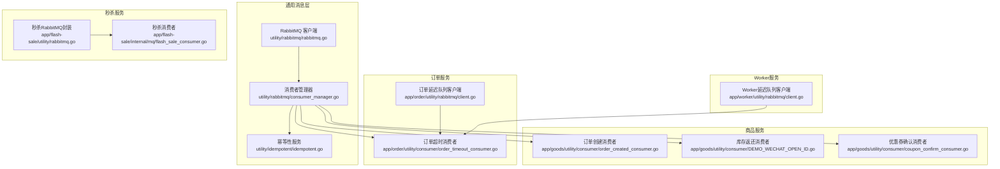
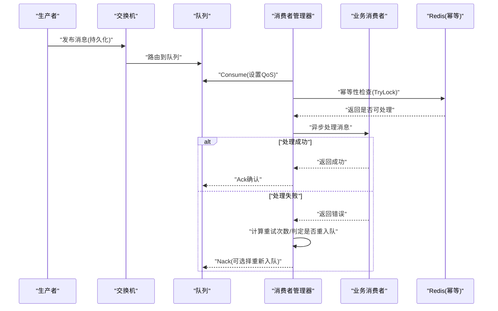
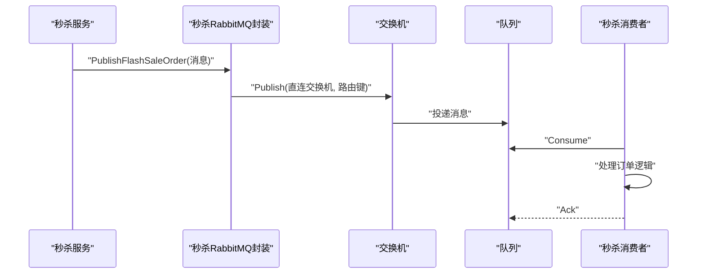
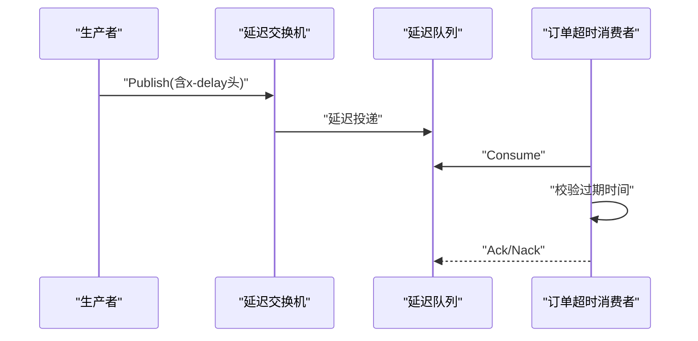
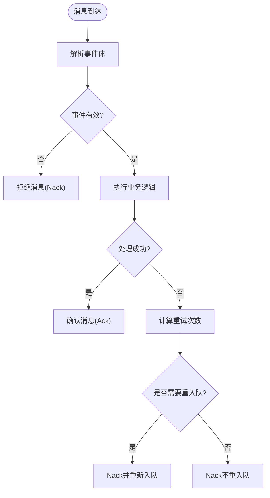
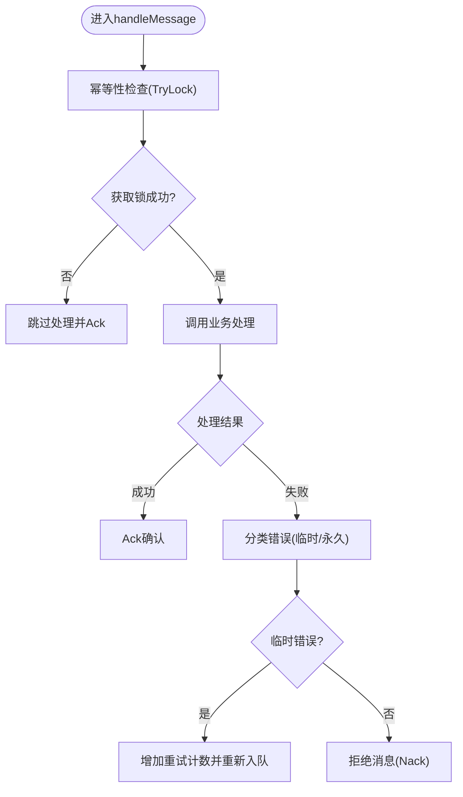
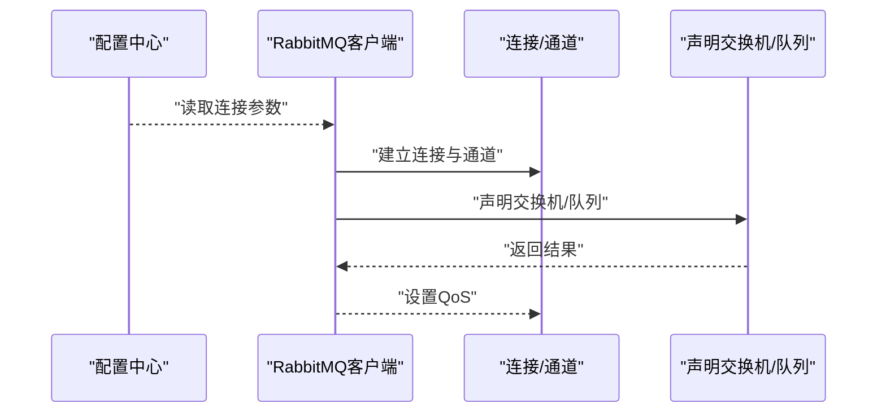
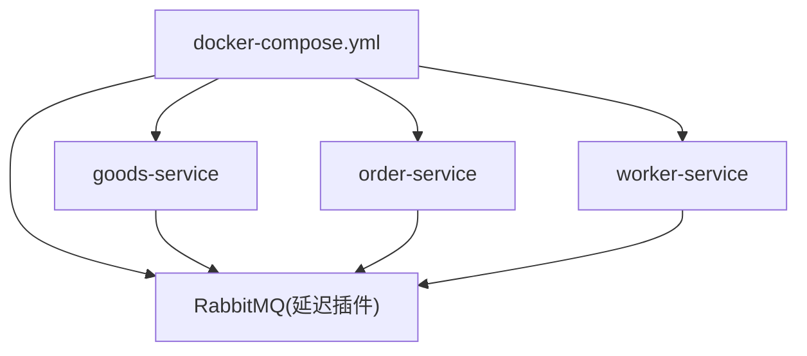

# 消息队列处理

<cite>
**本文档引用的文件**
- [rabbitmq.go](file://utility/rabbitmq/rabbitmq.go)
- [consumer_manager.go](file://utility/rabbitmq/consumer_manager.go)
- [idempotent.go](file://utility/idempotent/idempotent.go)
- [flash_sale_consumer.go](file://app/flash-sale/internal/mq/flash_sale_consumer.go)
- [rabbitmq.go](file://app/flash-sale/utility/rabbitmq.go)
- [client.go](file://app/order/utility/rabbitmq/client.go)
- [order_created_consumer.go](file://app/goods/utility/consumer/order_created_consumer.go)
- [DEMO_WECHAT_OPEN_ID.go](file://app/goods/utility/consumer/DEMO_WECHAT_OPEN_ID.go)
- [coupon_confirm_consumer.go](file://app/goods/utility/consumer/coupon_confirm_consumer.go)
- [order_timeout_consumer.go](file://app/order/utility/consumer/order_timeout_consumer.go)
- [client.go](file://app/worker/utility/rabbitmq/client.go)
- [docker-compose.yml](file://docker-compose.yml)
</cite>

## 目录
1. [简介](#简介)
2. [项目结构](#项目结构)
3. [核心组件](#核心组件)
4. [架构概览](#架构概览)
5. [详细组件分析](#详细组件分析)
6. [依赖关系分析](#依赖关系分析)
7. [性能考虑](#性能考虑)
8. [故障排查指南](#故障排查指南)
9. [结论](#结论)

## 简介
本文件系统性梳理了项目中基于 RabbitMQ 的消息队列处理方案，重点覆盖秒杀系统的消息生产与消费、持久化策略、幂等性保障、重试与死信队列处理、路由策略与负载均衡、高可用设计以及监控与性能优化。文档面向不同技术背景的读者，既提供高层架构视图，也包含代码级细节与可视化图表。

## 项目结构
消息队列相关代码分布在以下模块：
- 通用 RabbitMQ 客户端与消费者管理器：utility/rabbitmq
- 秒杀服务专用 RabbitMQ 封装：app/flash-sale/utility
- 各业务服务消费者实现：app/goods/utility/consumer、app/order/utility/consumer
- 订单超时延迟队列客户端：app/order/utility/rabbitmq
- Worker 服务延迟队列客户端：app/worker/utility/rabbitmq
- 幂等性服务：utility/idempotent
- 服务编排与依赖：docker-compose.yml



**图表来源**
- [rabbitmq.go](file://utility/rabbitmq/rabbitmq.go#L1-L196)
- [consumer_manager.go](file://utility/rabbitmq/consumer_manager.go#L1-L446)
- [idempotent.go](file://utility/idempotent/idempotent.go#L1-L153)
- [flash_sale_consumer.go](file://app/flash-sale/internal/mq/flash_sale_consumer.go#L1-L134)
- [rabbitmq.go](file://app/flash-sale/utility/rabbitmq.go#L1-L132)
- [client.go](file://app/order/utility/rabbitmq/client.go#L1-L253)
- [order_created_consumer.go](file://app/goods/utility/consumer/order_created_consumer.go#L1-L65)
- [DEMO_WECHAT_OPEN_ID.go](file://app/goods/utility/consumer/DEMO_WECHAT_OPEN_ID.go#L1-L58)
- [coupon_confirm_consumer.go](file://app/goods/utility/consumer/coupon_confirm_consumer.go#L1-L55)
- [order_timeout_consumer.go](file://app/order/utility/consumer/order_timeout_consumer.go#L1-L87)
- [client.go](file://app/worker/utility/rabbitmq/client.go#L1-L174)

**章节来源**
- [rabbitmq.go](file://utility/rabbitmq/rabbitmq.go#L1-L196)
- [consumer_manager.go](file://utility/rabbitmq/consumer_manager.go#L1-L446)
- [idempotent.go](file://utility/idempotent/idempotent.go#L1-L153)
- [flash_sale_consumer.go](file://app/flash-sale/internal/mq/flash_sale_consumer.go#L1-L134)
- [rabbitmq.go](file://app/flash-sale/utility/rabbitmq.go#L1-L132)
- [client.go](file://app/order/utility/rabbitmq/client.go#L1-L253)
- [order_created_consumer.go](file://app/goods/utility/consumer/order_created_consumer.go#L1-L65)
- [DEMO_WECHAT_OPEN_ID.go](file://app/goods/utility/consumer/DEMO_WECHAT_OPEN_ID.go#L1-L58)
- [coupon_confirm_consumer.go](file://app/goods/utility/consumer/coupon_confirm_consumer.go#L1-L55)
- [order_timeout_consumer.go](file://app/order/utility/consumer/order_timeout_consumer.go#L1-L87)
- [client.go](file://app/worker/utility/rabbitmq/client.go#L1-L174)
- [docker-compose.yml](file://docker-compose.yml#L54-L81)

## 核心组件
- 通用 RabbitMQ 客户端：提供连接、声明交换机/队列、发布/消费、QoS 设置等能力，并内置指数退避重试。
- 消费者管理器：统一管理消费者生命周期、队列声明与绑定、消息处理、幂等性检查、重试与死信策略。
- 幂等性服务：基于 Redis 的分布式幂等锁，确保消息不重复处理。
- 秒杀服务封装：针对秒杀场景的简化封装，支持声明直连交换机与队列、发布持久化消息。
- 业务消费者：订单创建、库存返还、优惠券确认、订单超时等事件消费者，均通过统一管理器启动。
- 延迟队列客户端：订单超时延迟队列与 Worker 延迟队列客户端，支持延迟消息发布。

**章节来源**
- [rabbitmq.go](file://utility/rabbitmq/rabbitmq.go#L1-L196)
- [consumer_manager.go](file://utility/rabbitmq/consumer_manager.go#L1-L446)
- [idempotent.go](file://utility/idempotent/idempotent.go#L1-L153)
- [flash_sale_consumer.go](file://app/flash-sale/internal/mq/flash_sale_consumer.go#L1-L134)
- [rabbitmq.go](file://app/flash-sale/utility/rabbitmq.go#L1-L132)
- [client.go](file://app/order/utility/rabbitmq/client.go#L1-L253)
- [order_created_consumer.go](file://app/goods/utility/consumer/order_created_consumer.go#L1-L65)
- [DEMO_WECHAT_OPEN_ID.go](file://app/goods/utility/consumer/DEMO_WECHAT_OPEN_ID.go#L1-L58)
- [coupon_confirm_consumer.go](file://app/goods/utility/consumer/coupon_confirm_consumer.go#L1-L55)
- [order_timeout_consumer.go](file://app/order/utility/consumer/order_timeout_consumer.go#L1-L87)
- [client.go](file://app/worker/utility/rabbitmq/client.go#L1-L174)

## 架构概览
下图展示了消息从生产到消费的完整路径，包括直连与延迟两种交换机类型、消费者管理器的统一调度、幂等性与重试策略。



**图表来源**
- [consumer_manager.go](file://utility/rabbitmq/consumer_manager.go#L196-L263)
- [idempotent.go](file://utility/idempotent/idempotent.go#L35-L58)

**章节来源**
- [consumer_manager.go](file://utility/rabbitmq/consumer_manager.go#L196-L263)
- [idempotent.go](file://utility/idempotent/idempotent.go#L35-L58)

## 详细组件分析

### 通用 RabbitMQ 客户端与消费者管理器
- 连接与重试：使用指数退避策略，初始间隔、最大间隔、最大总时长与随机化因子可配置，提升连接稳定性。
- 声明与绑定：支持直连与延迟交换机类型，自动声明交换机、队列并绑定，确保运行时基础设施就绪。
- QoS 与并发：通过 PrefetchCount 控制预取数量，实现消费者间的负载均衡与背压控制。
- 消息处理：统一处理流程包含幂等性检查、错误分类（临时/永久）、重试计数与重新入队策略。

```mermaid
classDiagram
class RabbitMQ {
-conn *amqp.Connection
-channel *amqp.Channel
-ctx context.Context
+Publish(exchange, routingKey, message) error
+PublishWithDelay(exchange, routingKey, message, delayMs) error
+Consume(queue, consumer, autoAck) <-chan Delivery, error
+DeclareExchange(name, kind) error
+DeclareQueue(name) Queue, error
+QueueBind(queue, key, exchange) error
+SetQoS(prefetchCount, prefetchSize, global) error
+Close()
}
class ConsumerManager {
-rb *RabbitMQ
-ctx context.Context
-consumers []Consumer
-done chan struct{}
+AddConsumer(consumer)
+Start() error
+Stop()
-setupQueue(config) error
-handleMessage(consumer, msg)
-checkIdempotency(consumer, msg) error
}
class Consumer {
<<interface>>
+GetName() string
+GetConfig() ConsumerConfig
+HandleMessage(ctx, msg) error
+GetBusinessID(data, event) string
}
class BaseConsumer {
-name string
-config ConsumerConfig
+GetName() string
+GetConfig() ConsumerConfig
+GetBusinessID(data, event) string
}
ConsumerManager --> RabbitMQ : "依赖"
ConsumerManager --> Consumer : "管理"
BaseConsumer ..|> Consumer
```

**图表来源**
- [rabbitmq.go](file://utility/rabbitmq/rabbitmq.go#L13-L196)
- [consumer_manager.go](file://utility/rabbitmq/consumer_manager.go#L19-L71)
- [consumer_manager.go](file://utility/rabbitmq/consumer_manager.go#L408-L445)

**章节来源**
- [rabbitmq.go](file://utility/rabbitmq/rabbitmq.go#L1-L196)
- [consumer_manager.go](file://utility/rabbitmq/consumer_manager.go#L1-L446)

### 秒杀系统消息处理
- 初始化：声明直连交换机与队列，支持持久化与自动确认配置。
- 生产：发布持久化消息到指定路由键，确保消息可靠到达。
- 消费：通过独立消费者监听队列，处理完成后确认消息。



**图表来源**
- [rabbitmq.go](file://app/flash-sale/utility/rabbitmq.go#L103-L120)
- [flash_sale_consumer.go](file://app/flash-sale/internal/mq/flash_sale_consumer.go#L28-L95)

**章节来源**
- [rabbitmq.go](file://app/flash-sale/utility/rabbitmq.go#L1-L132)
- [flash_sale_consumer.go](file://app/flash-sale/internal/mq/flash_sale_consumer.go#L1-L134)

### 订单超时延迟队列
- 延迟交换机：使用延迟插件交换机类型，支持毫秒级延迟。
- 消费：消费者按配置启动，解析事件并执行超时处理逻辑，必要时触发库存返还。



**图表来源**
- [client.go](file://app/order/utility/rabbitmq/client.go#L125-L187)
- [order_timeout_consumer.go](file://app/order/utility/consumer/order_timeout_consumer.go#L39-L86)

**章节来源**
- [client.go](file://app/order/utility/rabbitmq/client.go#L1-L253)
- [order_timeout_consumer.go](file://app/order/utility/consumer/order_timeout_consumer.go#L1-L87)

### 业务消费者实现
- 订单创建消费者：从购物车移除商品并扣减库存，异常时拒绝消息。
- 库存返还消费者：根据事件返还库存，异常时可触发重试事件。
- 优惠券确认消费者：处理优惠券确认事件，异常时拒绝消息。
- 订单超时消费者：校验事件时间与配置，执行超时处理并触发库存返还。



**图表来源**
- [order_created_consumer.go](file://app/goods/utility/consumer/order_created_consumer.go#L32-L64)
- [DEMO_WECHAT_OPEN_ID.go](file://app/goods/utility/consumer/DEMO_WECHAT_OPEN_ID.go#L31-L57)
- [coupon_confirm_consumer.go](file://app/goods/utility/consumer/coupon_confirm_consumer.go#L34-L54)
- [order_timeout_consumer.go](file://app/order/utility/consumer/order_timeout_consumer.go#L39-L86)

**章节来源**
- [order_created_consumer.go](file://app/goods/utility/consumer/order_created_consumer.go#L1-L65)
- [DEMO_WECHAT_OPEN_ID.go](file://app/goods/utility/consumer/DEMO_WECHAT_OPEN_ID.go#L1-L58)
- [coupon_confirm_consumer.go](file://app/goods/utility/consumer/coupon_confirm_consumer.go#L1-L55)
- [order_timeout_consumer.go](file://app/order/utility/consumer/order_timeout_consumer.go#L1-L87)

### 幂等性与重试机制
- 幂等键生成：结合消费者名、消息ID与业务ID生成唯一键，支持从消息头读取业务ID与TTL。
- 幂等锁：基于 Redis 的 TryLock，成功则处理，失败则跳过，避免重复处理。
- 重试策略：区分临时性与永久性错误，临时性错误按最大重试次数与指数退避策略重入队，永久性错误直接拒绝。



**图表来源**
- [consumer_manager.go](file://utility/rabbitmq/consumer_manager.go#L196-L263)
- [consumer_manager.go](file://utility/rabbitmq/consumer_manager.go#L265-L320)
- [consumer_manager.go](file://utility/rabbitmq/consumer_manager.go#L322-L406)

**章节来源**
- [consumer_manager.go](file://utility/rabbitmq/consumer_manager.go#L265-L320)
- [consumer_manager.go](file://utility/rabbitmq/consumer_manager.go#L322-L406)
- [idempotent.go](file://utility/idempotent/idempotent.go#L35-L58)

### 配置与初始化流程
- 通用客户端：从配置读取连接参数，创建连接与通道，声明交换机与队列，设置QoS。
- 秒杀服务：声明直连交换机与队列，发布持久化消息。
- 延迟队列：声明延迟交换机与队列，绑定路由键，支持延迟消息发布。



**图表来源**
- [rabbitmq.go](file://utility/rabbitmq/rabbitmq.go#L19-L82)
- [rabbitmq.go](file://utility/rabbitmq/rabbitmq.go#L149-L196)
- [flash_sale_consumer.go](file://app/flash-sale/internal/mq/flash_sale_consumer.go#L28-L55)

**章节来源**
- [rabbitmq.go](file://utility/rabbitmq/rabbitmq.go#L1-L196)
- [flash_sale_consumer.go](file://app/flash-sale/internal/mq/flash_sale_consumer.go#L1-L134)

## 依赖关系分析
- 服务编排：docker-compose 中启用 RabbitMQ 延迟插件，各服务通过依赖关系启动，确保消息中间件可用。
- 服务间耦合：消费者管理器解耦具体业务消费者，通过接口与配置驱动，降低耦合度。
- 外部依赖：Redis 用于幂等性，MySQL/业务服务用于实际业务处理。



**图表来源**
- [docker-compose.yml](file://docker-compose.yml#L54-L81)

**章节来源**
- [docker-compose.yml](file://docker-compose.yml#L1-L355)

## 性能考虑
- QoS 与并发：通过 PrefetchCount 控制每消费者预取数量，避免单消费者过载；多消费者水平扩展提升吞吐。
- 指数退避：连接失败时采用指数退避，减少雪崩效应，提升系统韧性。
- 持久化与压缩：消息持久化确保可靠性，结合压缩与批量发布可降低网络与磁盘压力。
- 缓存与幂等：Redis 幂等锁避免重复处理，减少无效计算；合理设置 TTL 降低内存占用。
- 监控与告警：结合 Prometheus/Grafana 指标埋点，监控队列长度、处理时延、重试率与错误率。

## 故障排查指南
- 连接失败：检查配置参数与网络连通性，查看指数退避日志定位重试原因。
- 无消息消费：确认交换机/队列声明与绑定是否正确，检查路由键与消费者标签。
- 消息堆积：检查消费者处理时延与并发度，适当增加消费者数量或优化处理逻辑。
- 重复消费：核查幂等键生成规则与 Redis 连通性，确保幂等锁获取成功。
- 死信与重试：区分临时与永久错误，调整最大重试次数与重试策略，避免无限循环。

**章节来源**
- [consumer_manager.go](file://utility/rabbitmq/consumer_manager.go#L322-L406)
- [idempotent.go](file://utility/idempotent/idempotent.go#L117-L124)

## 结论
本项目通过通用 RabbitMQ 客户端与消费者管理器，实现了秒杀与订单超时等关键场景的消息处理，具备完善的幂等性、重试与延迟队列能力。配合合理的 QoS、并发与监控策略，可在高并发场景下保持稳定与高性能。建议持续完善事件模型与错误分类策略，进一步提升系统的可观测性与可维护性。