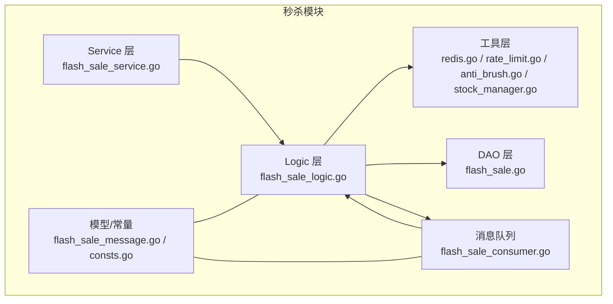
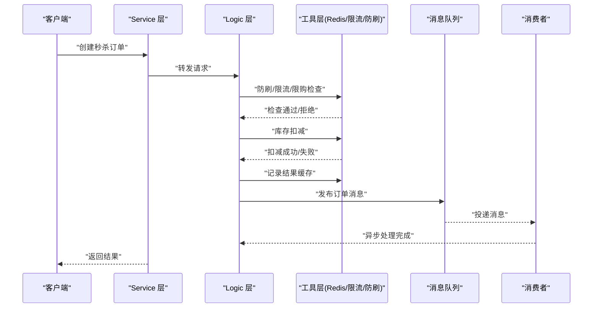
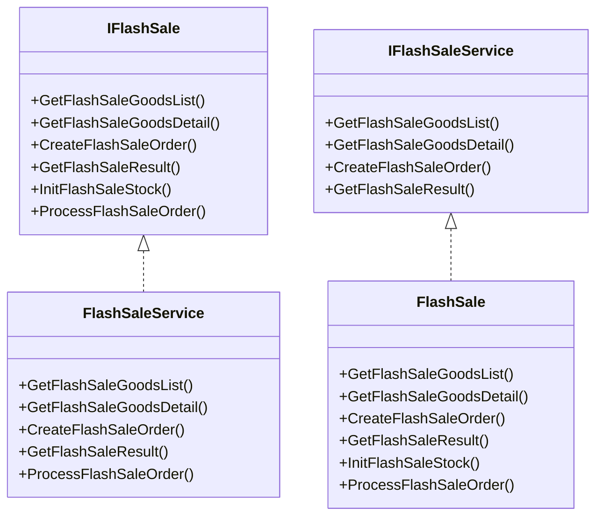
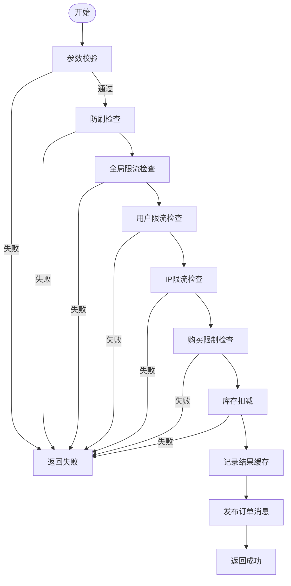
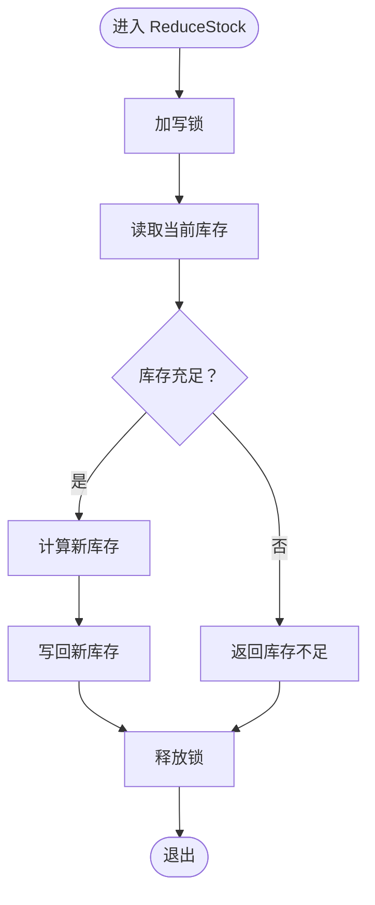
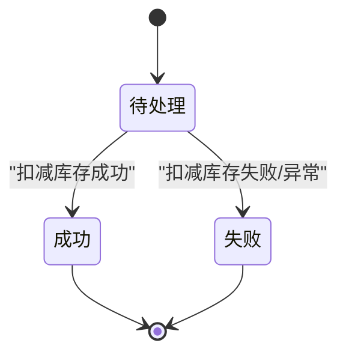
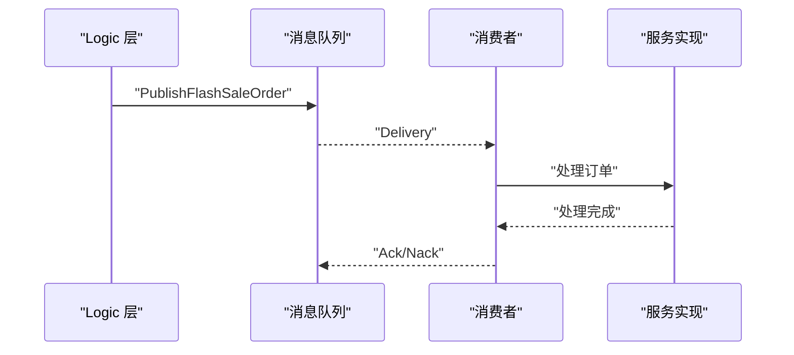
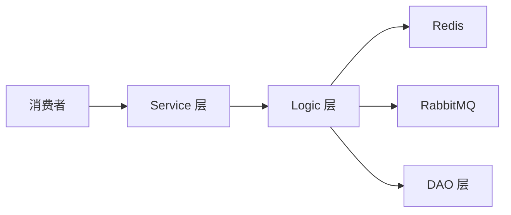

# 秒杀业务逻辑实现

<cite>
**本文引用的文件**
- [app/flash-sale/internal/service/flash_sale.go](file://app/flash-sale/internal/service/flash_sale.go)
- [app/flash-sale/internal/service/flash_sale_service.go](file://app/flash-sale/internal/service/flash_sale_service.go)
- [app/flash-sale/internal/logic/flash_sale.go](file://app/flash-sale/internal/logic/flash_sale.go)
- [app/flash-sale/internal/logic/flash_sale_logic.go](file://app/flash-sale/internal/logic/flash_sale_logic.go)
- [app/flash-sale/internal/dao/flash_sale.go](file://app/flash-sale/internal/dao/flash_sale.go)
- [app/flash-sale/internal/model/flash_sale_message.go](file://app/flash-sale/internal/model/flash_sale_message.go)
- [app/flash-sale/internal/mq/flash_sale_consumer.go](file://app/flash-sale/internal/mq/flash_sale_consumer.go)
- [app/flash-sale/utility/stock_manager.go](file://app/flash-sale/utility/stock_manager.go)
- [app/flash-sale/utility/redis.go](file://app/flash-sale/utility/redis.go)
- [app/flash-sale/utility/rate_limit.go](file://app/flash-sale/utility/rate_limit.go)
- [app/flash-sale/utility/anti_brush.go](file://app/flash-sale/utility/anti_brush.go)
- [app/flash-sale/utility/service.go](file://app/flash-sale/utility/service.go)
- [app/flash-sale/internal/consts/consts.go](file://app/flash-sale/internal/consts/consts.go)
- [doc/秒杀系统设计方案.md](file://doc/秒杀系统设计方案.md)
- [doc/延迟队列处理订单超时（RabbitMQ死信队列实战）.md](file://doc/延迟队列处理订单超时（RabbitMQ死信队列实战）.md)
- [doc/微信支付退款功能实现详解.md](file://doc/微信支付退款功能实现详解.md)
- [doc/数据库和缓存一致性问题&做到下单成功即代表可成功付款的体验.md](file://doc/数据库和缓存一致性问题&做到下单成功即代表可成功付款的体验.md)
</cite>

## 目录
1. [引言](#引言)
2. [项目结构](#项目结构)
3. [核心组件](#核心组件)
4. [架构总览](#架构总览)
5. [详细组件分析](#详细组件分析)
6. [依赖关系分析](#依赖关系分析)
7. [性能考虑](#性能考虑)
8. [故障排查指南](#故障排查指南)
9. [结论](#结论)
10. [附录](#附录)

## 引言
本文件面向秒杀业务逻辑的实现与落地，围绕“订单创建、库存扣减、用户限购检查”三大核心流程，系统阐述分层设计（Service 层、Logic 层）、状态管理、异常处理与事务控制策略，并给出关键流程图与时序图，帮助开发者快速理解与扩展秒杀系统。

## 项目结构
秒杀模块位于 app/flash-sale 下，采用按职责分层的组织方式：
- service 层：对外暴露统一接口，负责请求转发与结果封装
- logic 层：实现核心业务逻辑，包含限流、防刷、库存扣减、结果缓存与消息发布
- utility 层：提供缓存、限流、防刷、库存管理等通用能力
- dao 层：数据库访问封装
- mq 层：消息队列发布与消费
- model/consts：消息体与常量定义

图表来源
- [app/flash-sale/internal/service/flash_sale_service.go](file://app/flash-sale/internal/service/flash_sale_service.go#L1-L100)
- [app/flash-sale/internal/logic/flash_sale_logic.go](file://app/flash-sale/internal/logic/flash_sale_logic.go#L1-L400)
- [app/flash-sale/internal/dao/flash_sale.go](file://app/flash-sale/internal/dao/flash_sale.go#L1-L98)
- [app/flash-sale/internal/mq/flash_sale_consumer.go](file://app/flash-sale/internal/mq/flash_sale_consumer.go#L1-L134)
- [app/flash-sale/utility/redis.go](file://app/flash-sale/utility/redis.go#L1-L56)
- [app/flash-sale/utility/rate_limit.go](file://app/flash-sale/utility/rate_limit.go#L1-L161)
- [app/flash-sale/utility/anti_brush.go](file://app/flash-sale/utility/anti_brush.go#L1-L81)
- [app/flash-sale/utility/stock_manager.go](file://app/flash-sale/utility/stock_manager.go#L1-L90)
- [app/flash-sale/internal/model/flash_sale_message.go](file://app/flash-sale/internal/model/flash_sale_message.go#L1-L16)
- [app/flash-sale/internal/consts/consts.go](file://app/flash-sale/internal/consts/consts.go#L1-L43)

章节来源
- [app/flash-sale/internal/service/flash_sale.go](file://app/flash-sale/internal/service/flash_sale.go#L1-L28)
- [app/flash-sale/internal/service/flash_sale_service.go](file://app/flash-sale/internal/service/flash_sale_service.go#L1-L100)
- [app/flash-sale/internal/logic/flash_sale.go](file://app/flash-sale/internal/logic/flash_sale.go#L1-L59)
- [app/flash-sale/internal/logic/flash_sale_logic.go](file://app/flash-sale/internal/logic/flash_sale_logic.go#L1-L400)
- [app/flash-sale/internal/dao/flash_sale.go](file://app/flash-sale/internal/dao/flash_sale.go#L1-L98)
- [app/flash-sale/internal/mq/flash_sale_consumer.go](file://app/flash-sale/internal/mq/flash_sale_consumer.go#L1-L134)
- [app/flash-sale/utility/redis.go](file://app/flash-sale/utility/redis.go#L1-L56)
- [app/flash-sale/utility/rate_limit.go](file://app/flash-sale/utility/rate_limit.go#L1-L161)
- [app/flash-sale/utility/anti_brush.go](file://app/flash-sale/utility/anti_brush.go#L1-L81)
- [app/flash-sale/utility/stock_manager.go](file://app/flash-sale/utility/stock_manager.go#L1-L90)
- [app/flash-sale/internal/model/flash_sale_message.go](file://app/flash-sale/internal/model/flash_sale_message.go#L1-L16)
- [app/flash-sale/internal/consts/consts.go](file://app/flash-sale/internal/consts/consts.go#L1-L43)

## 核心组件
- 服务接口与实现
  - IFlashSale：定义秒杀服务对外接口（列表、详情、创建订单、查询结果、初始化库存、异步处理）
  - FlashSaleService：Service 层实现，负责请求转发与结果封装
  - IFlashSaleService（utility）：Logic 层注册与获取服务的接口，避免循环依赖
- 业务逻辑实现
  - FlashSale：Logic 层核心实现，包含参数校验、限流/防刷、库存扣减、结果缓存、消息发布、异步处理入口
- 缓存与限流
  - Redis 初始化与缓存适配
  - RateLimiter：全局限流、用户限流、IP 限流、购买限制
  - AntiBrushChecker：用户/IP 行为频率检查
- 库存管理
  - FlashSaleStockManager：库存检查与扣减（带互斥锁）
- DAO 与消息
  - FlashSaleGoodsDao/FlashSaleOrderDao：商品与订单数据访问
  - FlashSaleOrderConsumer：订单消息消费与本地兜底处理
- 模型与常量
  - FlashSaleOrderMessage：订单消息结构
  - consts：缓存键、状态码、限流阈值等常量

章节来源
- [app/flash-sale/internal/service/flash_sale.go](file://app/flash-sale/internal/service/flash_sale.go#L8-L27)
- [app/flash-sale/internal/service/flash_sale_service.go](file://app/flash-sale/internal/service/flash_sale_service.go#L14-L20)
- [app/flash-sale/internal/logic/flash_sale.go](file://app/flash-sale/internal/logic/flash_sale.go#L16-L22)
- [app/flash-sale/internal/logic/flash_sale_logic.go](file://app/flash-sale/internal/logic/flash_sale_logic.go#L20-L26)
- [app/flash-sale/utility/redis.go](file://app/flash-sale/utility/redis.go#L16-L55)
- [app/flash-sale/utility/rate_limit.go](file://app/flash-sale/utility/rate_limit.go#L13-L23)
- [app/flash-sale/utility/anti_brush.go](file://app/flash-sale/utility/anti_brush.go#L12-L22)
- [app/flash-sale/utility/stock_manager.go](file://app/flash-sale/utility/stock_manager.go#L12-L16)
- [app/flash-sale/internal/dao/flash_sale.go](file://app/flash-sale/internal/dao/flash_sale.go#L14-L26)
- [app/flash-sale/internal/mq/flash_sale_consumer.go](file://app/flash-sale/internal/mq/flash_sale_consumer.go#L16-L26)
- [app/flash-sale/internal/model/flash_sale_message.go](file://app/flash-sale/internal/model/flash_sale_message.go#L5-L16)
- [app/flash-sale/internal/consts/consts.go](file://app/flash-sale/internal/consts/consts.go#L3-L42)

## 架构总览
秒杀系统采用“同步校验 + 异步处理”的模式：
- 请求进入 Service 层，由 Logic 层执行业务校验与核心操作
- 库存扣减与结果缓存在 Logic 层完成，随后发布订单消息至消息队列
- 消费者异步处理订单（创建订单、更新状态、通知等），实现削峰填谷与最终一致性

图表来源
- [app/flash-sale/internal/service/flash_sale_service.go](file://app/flash-sale/internal/service/flash_sale_service.go#L53-L69)
- [app/flash-sale/internal/logic/flash_sale_logic.go](file://app/flash-sale/internal/logic/flash_sale_logic.go#L102-L254)
- [app/flash-sale/internal/mq/flash_sale_consumer.go](file://app/flash-sale/internal/mq/flash_sale_consumer.go#L97-L119)

## 详细组件分析

### Service 层与 Logic 层分层设计
- Service 层职责
  - 统一接口定义与请求/响应封装
  - 将请求转交给 Logic 层处理
- Logic 层职责
  - 参数校验与业务规则验证
  - 调用工具层完成限流、防刷、库存扣减
  - 结果缓存与消息发布
  - 异步处理入口（ProcessFlashSaleOrder）

图表来源
- [app/flash-sale/internal/service/flash_sale.go](file://app/flash-sale/internal/service/flash_sale.go#L8-L27)
- [app/flash-sale/internal/service/flash_sale_service.go](file://app/flash-sale/internal/service/flash_sale_service.go#L14-L20)
- [app/flash-sale/internal/logic/flash_sale.go](file://app/flash-sale/internal/logic/flash_sale.go#L16-L22)
- [app/flash-sale/internal/logic/flash_sale_logic.go](file://app/flash-sale/internal/logic/flash_sale_logic.go#L20-L26)

章节来源
- [app/flash-sale/internal/service/flash_sale.go](file://app/flash-sale/internal/service/flash_sale.go#L8-L27)
- [app/flash-sale/internal/service/flash_sale_service.go](file://app/flash-sale/internal/service/flash_sale_service.go#L14-L20)
- [app/flash-sale/internal/logic/flash_sale.go](file://app/flash-sale/internal/logic/flash_sale.go#L16-L22)
- [app/flash-sale/internal/logic/flash_sale_logic.go](file://app/flash-sale/internal/logic/flash_sale_logic.go#L20-L26)

### 订单创建流程与业务规则
- 参数校验：用户ID、商品ID、数量必须有效
- 防刷检查：基于用户与IP的行为频率阈值
- 全局限流/用户限流/IP限流：防止突发流量冲击
- 购买限制：同一用户/商品每小时仅允许一次
- 库存扣减：使用 FlashSaleStockManager 执行原子性扣减
- 结果缓存：记录查询结果，支持轮询查询
- 消息发布：将订单消息投递至队列，异步处理

图表来源
- [app/flash-sale/internal/logic/flash_sale_logic.go](file://app/flash-sale/internal/logic/flash_sale_logic.go#L102-L254)
- [app/flash-sale/utility/rate_limit.go](file://app/flash-sale/utility/rate_limit.go#L104-L160)
- [app/flash-sale/utility/anti_brush.go](file://app/flash-sale/utility/anti_brush.go#L24-L80)
- [app/flash-sale/utility/stock_manager.go](file://app/flash-sale/utility/stock_manager.go#L50-L73)

章节来源
- [app/flash-sale/internal/logic/flash_sale_logic.go](file://app/flash-sale/internal/logic/flash_sale_logic.go#L102-L254)
- [app/flash-sale/utility/rate_limit.go](file://app/flash-sale/utility/rate_limit.go#L104-L160)
- [app/flash-sale/utility/anti_brush.go](file://app/flash-sale/utility/anti_brush.go#L24-L80)
- [app/flash-sale/utility/stock_manager.go](file://app/flash-sale/utility/stock_manager.go#L50-L73)

### 库存扣减与并发安全
- 互斥锁保护：FlashSaleStockManager 使用 RWMutex 保证扣减过程的线程安全
- 原子性：先读取库存，再判断与扣减，最后写回新库存
- 错误处理：库存不足、缓存异常均返回明确错误

图表来源
- [app/flash-sale/utility/stock_manager.go](file://app/flash-sale/utility/stock_manager.go#L50-L73)

章节来源
- [app/flash-sale/utility/stock_manager.go](file://app/flash-sale/utility/stock_manager.go#L50-L73)

### 订单状态管理与查询
- 状态定义：pending/success/failed
- 结果缓存：以 ResultId 为键，缓存订单状态、订单号、金额等
- 查询流程：根据 ResultId 从缓存读取，若无则返回“处理中”

图表来源
- [app/flash-sale/internal/logic/flash_sale_logic.go](file://app/flash-sale/internal/logic/flash_sale_logic.go#L256-L297)
- [app/flash-sale/internal/consts/consts.go](file://app/flash-sale/internal/consts/consts.go#L23-L27)

章节来源
- [app/flash-sale/internal/logic/flash_sale_logic.go](file://app/flash-sale/internal/logic/flash_sale_logic.go#L256-L297)
- [app/flash-sale/internal/consts/consts.go](file://app/flash-sale/internal/consts/consts.go#L23-L27)

### 异步处理与消息队列
- 发布消息：CreateFlashSaleOrder 成功后发布订单消息
- 消费处理：消费者从队列拉取消息，调用服务处理订单
- 兜底策略：当 RabbitMQ 未初始化时，本地处理订单

图表来源
- [app/flash-sale/internal/logic/flash_sale_logic.go](file://app/flash-sale/internal/logic/flash_sale_logic.go#L229-L246)
- [app/flash-sale/internal/mq/flash_sale_consumer.go](file://app/flash-sale/internal/mq/flash_sale_consumer.go#L97-L119)
- [app/flash-sale/internal/mq/flash_sale_consumer.go](file://app/flash-sale/internal/mq/flash_sale_consumer.go#L57-L95)

章节来源
- [app/flash-sale/internal/mq/flash_sale_consumer.go](file://app/flash-sale/internal/mq/flash_sale_consumer.go#L97-L119)
- [app/flash-sale/internal/mq/flash_sale_consumer.go](file://app/flash-sale/internal/mq/flash_sale_consumer.go#L57-L95)

### 事务控制策略与数据一致性
- 当前实现：库存扣减在缓存层完成，订单创建与状态更新在异步消费者中处理
- 建议策略（参考文档）：
  - 使用数据库事务包裹订单创建与库存扣减，确保强一致
  - 对于超时未支付订单，定时任务恢复库存并更新状态
  - 通过死信队列保障消息可靠投递与重试

章节来源
- [doc/秒杀系统设计方案.md](file://doc/秒杀系统设计方案.md#L1993-L2130)
- [doc/延迟队列处理订单超时（RabbitMQ死信队列实战）.md](file://doc/延迟队列处理订单超时（RabbitMQ死信队列实战）.md)
- [doc/数据库和缓存一致性问题&做到下单成功即代表可成功付款的体验.md](file://doc/数据库和缓存一致性问题&做到下单成功即代表可成功付款的体验.md)

## 依赖关系分析
- 组件耦合
  - Logic 层依赖 utility（缓存、限流、防刷、库存）
  - Service 层依赖 Logic 层
  - MQ 层与 Logic 层松耦合，通过消息契约交互
- 外部依赖
  - Redis：缓存与限流计数
  - RabbitMQ：订单异步处理通道
  - 数据库：DAO 层访问订单与商品数据

图表来源
- [app/flash-sale/internal/logic/flash_sale_logic.go](file://app/flash-sale/internal/logic/flash_sale_logic.go#L102-L254)
- [app/flash-sale/internal/mq/flash_sale_consumer.go](file://app/flash-sale/internal/mq/flash_sale_consumer.go#L97-L119)
- [app/flash-sale/internal/dao/flash_sale.go](file://app/flash-sale/internal/dao/flash_sale.go#L14-L26)

章节来源
- [app/flash-sale/internal/logic/flash_sale_logic.go](file://app/flash-sale/internal/logic/flash_sale_logic.go#L102-L254)
- [app/flash-sale/internal/mq/flash_sale_consumer.go](file://app/flash-sale/internal/mq/flash_sale_consumer.go#L97-L119)
- [app/flash-sale/internal/dao/flash_sale.go](file://app/flash-sale/internal/dao/flash_sale.go#L14-L26)

## 性能考虑
- 缓存优先：库存与限流均基于 Redis，降低数据库压力
- 并发控制：库存扣减使用互斥锁，避免超卖
- 异步削峰：订单创建立即返回，后续异步处理
- 限流策略：全局限流、用户限流、IP 限流、购买限制四重保障

## 故障排查指南
- 常见问题定位
  - Redis 未初始化：检查 Redis 配置与连接测试
  - 限流触发：核对用户/IP 的限流键与 TTL
  - 库存不足：确认库存缓存键与当前值
  - 消息未达：检查 RabbitMQ 是否可用，消费者是否启动
- 日志与告警
  - 关键路径均有日志输出，便于追踪
  - 建议结合监控与告警体系，关注成功率、耗时与异常峰值

章节来源
- [app/flash-sale/utility/redis.go](file://app/flash-sale/utility/redis.go#L16-L55)
- [app/flash-sale/utility/rate_limit.go](file://app/flash-sale/utility/rate_limit.go#L104-L160)
- [app/flash-sale/internal/mq/flash_sale_consumer.go](file://app/flash-sale/internal/mq/flash_sale_consumer.go#L97-L119)

## 结论
本秒杀实现以“同步校验 + 异步处理”为核心，结合 Redis 缓存与多级限流策略，在保证高并发下的稳定性同时，通过消息队列实现削峰填谷与最终一致性。建议在生产环境中进一步完善数据库事务、超时恢复与消息可靠性保障，以达到更强的一致性与可观测性。

## 附录
- 常量与键名
  - 缓存键：商品、库存、结果
  - 交换机/队列/路由键：消息队列契约
  - 状态码：pending/success/failed
- 相关文档
  - 秒杀系统设计方案
  - 延迟队列与死信队列
  - 微信支付退款
  - 数据库与缓存一致性

章节来源
- [app/flash-sale/internal/consts/consts.go](file://app/flash-sale/internal/consts/consts.go#L3-L42)
- [doc/秒杀系统设计方案.md](file://doc/秒杀系统设计方案.md#L1993-L2130)
- [doc/延迟队列处理订单超时（RabbitMQ死信队列实战）.md](file://doc/延迟队列处理订单超时（RabbitMQ死信队列实战）.md)
- [doc/微信支付退款功能实现详解.md](file://doc/微信支付退款功能实现详解.md)
- [doc/数据库和缓存一致性问题&做到下单成功即代表可成功付款的体验.md](file://doc/数据库和缓存一致性问题&做到下单成功即代表可成功付款的体验.md)