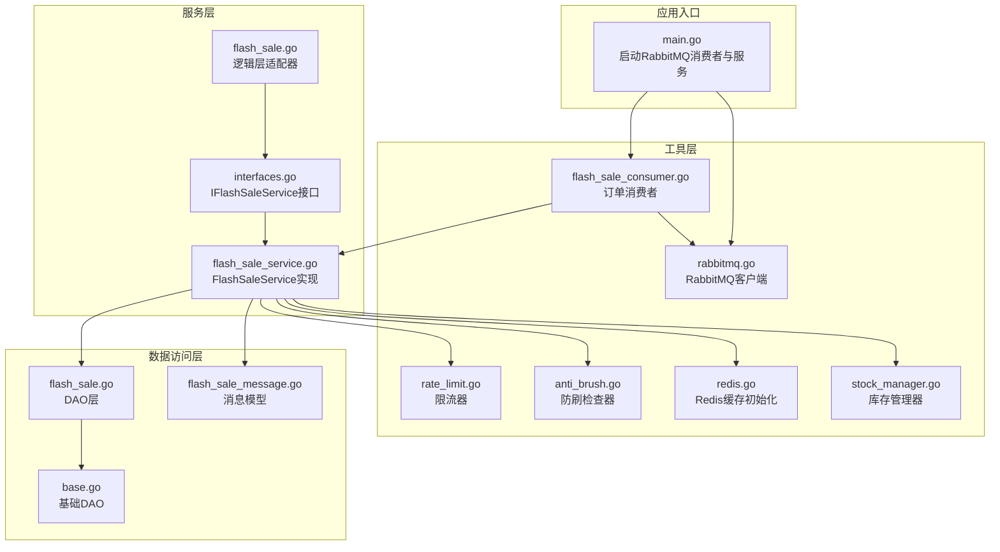
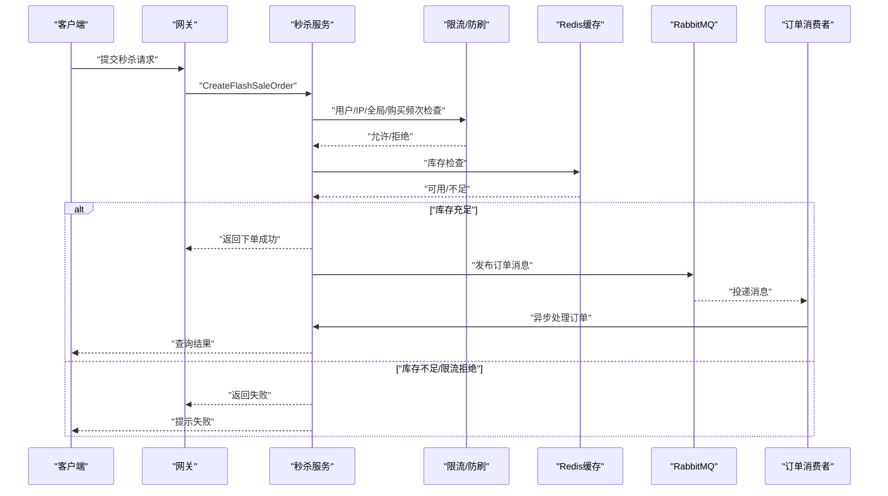
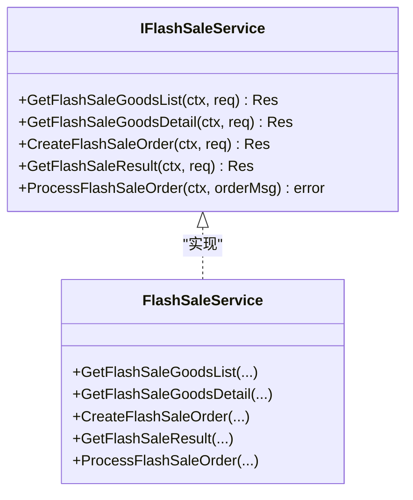
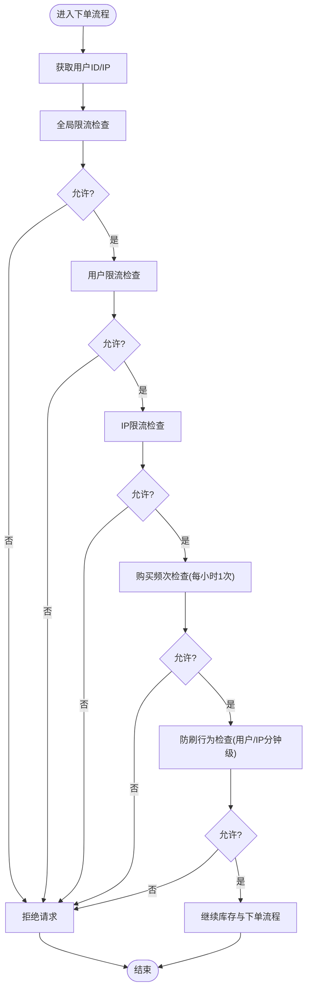
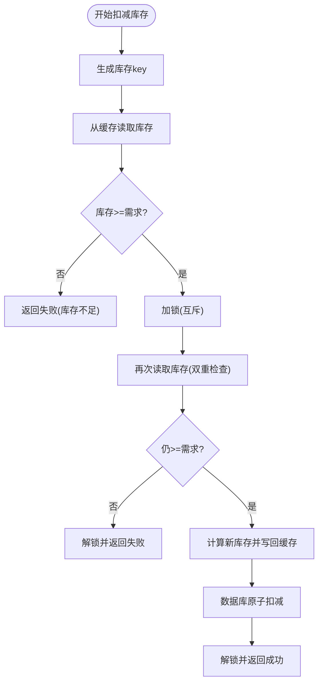
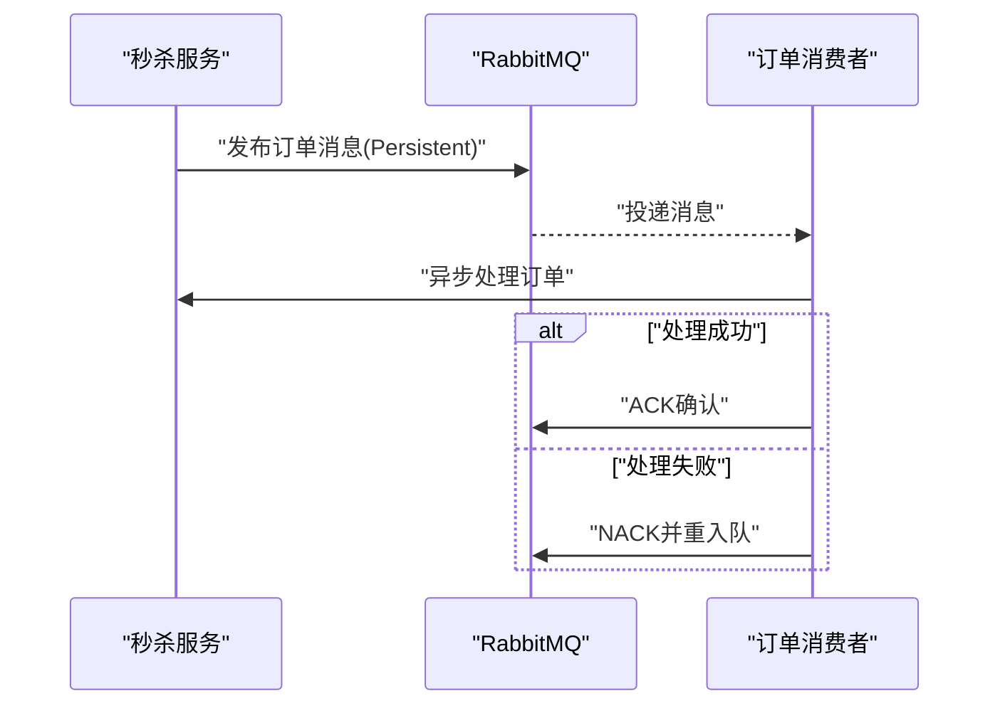
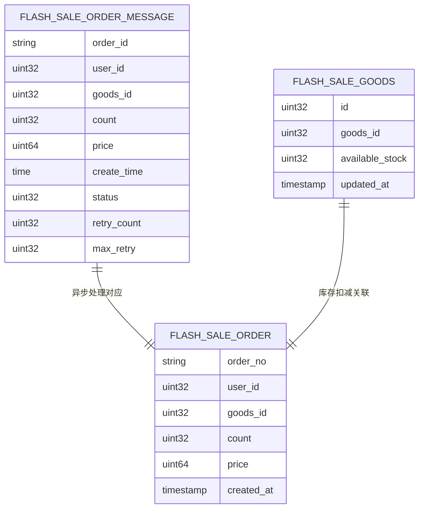
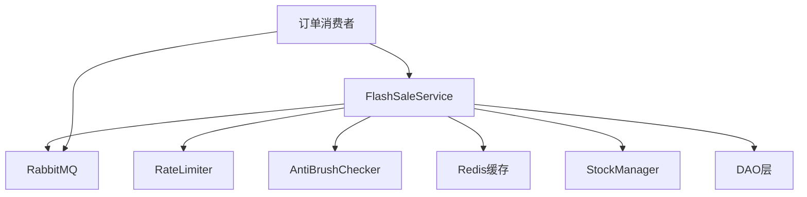

# 秒杀服务模块

<cite>
**本文档引用的文件**
- [main.go](file://app/flash-sale/main.go)
- [flash_sale.go](file://app/flash-sale/internal/service/flash_sale.go)
- [interfaces.go](file://app/flash-sale/internal/service/interfaces.go)
- [flash_sale_service.go](file://app/flash-sale/internal/service/flash_sale_service.go)
- [flash_sale.go](file://app/flash-sale/internal/logic/flash_sale.go)
- [anti_brush.go](file://app/flash-sale/utility/anti_brush.go)
- [rate_limit.go](file://app/flash-sale/utility/rate_limit.go)
- [redis.go](file://app/flash-sale/utility/redis.go)
- [stock_manager.go](file://app/flash-sale/utility/stock_manager.go)
- [flash_sale_consumer.go](file://app/flash-sale/internal/mq/flash_sale_consumer.go)
- [rabbitmq.go](file://app/flash-sale/utility/rabbitmq.go)
- [flash_sale_message.go](file://app/flash-sale/internal/model/flash_sale_message.go)
- [flash_sale.go](file://app/flash-sale/internal/dao/flash_sale.go)
- [base.go](file://app/flash-sale/internal/model/base.go)
</cite>

## 目录
1. [简介](#简介)
2. [项目结构](#项目结构)
3. [核心组件](#核心组件)
4. [架构总览](#架构总览)
5. [详细组件分析](#详细组件分析)
6. [依赖关系分析](#依赖关系分析)
7. [性能考虑](#性能考虑)
8. [故障排查指南](#故障排查指南)
9. [结论](#结论)

## 简介
本文件面向秒杀服务模块，系统性阐述其高并发架构与防刷机制，覆盖秒杀活动管理、库存防超卖、限流控制、异步消息处理等核心能力，并解释Redis分布式锁、Lua脚本优化、消息队列处理等关键技术实现。同时提供用户限购控制、刷单检测、流量削峰等安全策略，以及性能优化方案、监控指标与故障处理机制。

## 项目结构
秒杀服务采用分层清晰的GoFrame微服务结构：
- 应用入口负责RabbitMQ初始化与消费者启动，随后启动命令行服务。
- 业务逻辑层封装接口与实现，协调限流、库存、消息等子系统。
- 工具层提供Redis缓存、限流、防刷、RabbitMQ等基础设施能力。
- DAO层负责数据库访问，支持库存扣减与订单持久化。
- MQ层提供消息发布/订阅与消费者处理。

图表来源
- [main.go](file://app/flash-sale/main.go#L18-L37)
- [interfaces.go](file://app/flash-sale/internal/service/interfaces.go#L9-L25)
- [flash_sale_service.go](file://app/flash-sale/internal/service/flash_sale_service.go#L14-L99)
- [flash_sale.go](file://app/flash-sale/internal/logic/flash_sale.go#L11-L22)
- [rate_limit.go](file://app/flash-sale/utility/rate_limit.go#L13-L160)
- [anti_brush.go](file://app/flash-sale/utility/anti_brush.go#L12-L80)
- [redis.go](file://app/flash-sale/utility/redis.go#L16-L55)
- [stock_manager.go](file://app/flash-sale/utility/stock_manager.go#L12-L89)
- [rabbitmq.go](file://app/flash-sale/utility/rabbitmq.go#L21-L131)
- [flash_sale_consumer.go](file://app/flash-sale/internal/mq/flash_sale_consumer.go#L16-L133)
- [flash_sale.go](file://app/flash-sale/internal/dao/flash_sale.go#L14-L97)
- [flash_sale_message.go](file://app/flash-sale/internal/model/flash_sale_message.go#L5-L16)
- [base.go](file://app/flash-sale/internal/model/base.go#L3-L13)

章节来源
- [main.go](file://app/flash-sale/main.go#L1-L38)
- [interfaces.go](file://app/flash-sale/internal/service/interfaces.go#L1-L26)
- [flash_sale_service.go](file://app/flash-sale/internal/service/flash_sale_service.go#L1-L100)
- [flash_sale.go](file://app/flash-sale/internal/logic/flash_sale.go#L1-L59)

## 核心组件
- 接口与实现
  - IFlashSaleService：定义秒杀服务统一接口，包括商品列表/详情查询、下单、结果查询、异步订单处理等。
  - FlashSaleService：接口的具体实现，提供日志记录与占位逻辑，后续接入库存、限流、消息等子系统。
- 限流与防刷
  - RateLimiter：基于内存缓存的滑动/固定窗口限流器，支持全局、用户、IP、购买频次等维度。
  - AntiBrushChecker：基于gcache的用户与IP行为统计，防止高频请求与刷单。
- 缓存与库存
  - Redis缓存初始化：统一配置与连接，提供高性能读写。
  - StockManager：基于gcache的库存检查与扣减，带互斥保护。
- 消息队列
  - RabbitMQ客户端：声明交换机/队列，发布持久化消息。
  - 订单消费者：消费队列消息，异步处理订单，失败自动重试。
- 数据访问
  - DAO层：提供商品与订单的查询与写入能力，支持库存扣减与订单落库。

章节来源
- [interfaces.go](file://app/flash-sale/internal/service/interfaces.go#L9-L25)
- [flash_sale_service.go](file://app/flash-sale/internal/service/flash_sale_service.go#L14-L99)
- [rate_limit.go](file://app/flash-sale/utility/rate_limit.go#L13-L160)
- [anti_brush.go](file://app/flash-sale/utility/anti_brush.go#L12-L80)
- [redis.go](file://app/flash-sale/utility/redis.go#L16-L55)
- [stock_manager.go](file://app/flash-sale/utility/stock_manager.go#L12-L89)
- [rabbitmq.go](file://app/flash-sale/utility/rabbitmq.go#L21-L131)
- [flash_sale_consumer.go](file://app/flash-sale/internal/mq/flash_sale_consumer.go#L16-L133)
- [flash_sale.go](file://app/flash-sale/internal/dao/flash_sale.go#L14-L97)

## 架构总览
秒杀服务采用“同步请求快速返回 + 异步消息处理”的高并发架构：
- 请求入口：网关接收用户请求，调用秒杀服务接口。
- 防刷与限流：在逻辑层进行用户行为与请求频率校验。
- 库存校验：通过Redis缓存快速判断可用库存。
- 下单与消息：创建订单后发布消息至RabbitMQ，消费者异步落库与后续处理。
- 降级策略：RabbitMQ不可用时本地兜底处理，保证服务可用性。

图表来源
- [flash_sale_service.go](file://app/flash-sale/internal/service/flash_sale_service.go#L53-L69)
- [rate_limit.go](file://app/flash-sale/utility/rate_limit.go#L51-L83)
- [anti_brush.go](file://app/flash-sale/utility/anti_brush.go#L24-L80)
- [redis.go](file://app/flash-sale/utility/redis.go#L16-L55)
- [flash_sale_consumer.go](file://app/flash-sale/internal/mq/flash_sale_consumer.go#L97-L133)
- [rabbitmq.go](file://app/flash-sale/utility/rabbitmq.go#L103-L120)

## 详细组件分析

### 服务接口与实现
- IFlashSaleService定义了秒杀服务的核心能力，包括商品查询、下单、结果查询与异步订单处理。
- FlashSaleService作为实现类，目前提供日志输出与占位逻辑，后续将接入库存、限流、消息等子系统。

图表来源
- [interfaces.go](file://app/flash-sale/internal/service/interfaces.go#L9-L25)
- [flash_sale_service.go](file://app/flash-sale/internal/service/flash_sale_service.go#L14-L99)

章节来源
- [interfaces.go](file://app/flash-sale/internal/service/interfaces.go#L9-L25)
- [flash_sale_service.go](file://app/flash-sale/internal/service/flash_sale_service.go#L14-L99)

### 限流与防刷机制
- RateLimiter
  - 支持全局、用户、IP、购买频次等多维限流，基于gcache实现计数与过期控制。
  - 提供每秒N次的限流策略，避免瞬时洪峰。
- AntiBrushChecker
  - 基于用户ID与IP分别统计请求次数，设定分钟级阈值，防止刷单与异常行为。
  - 对用户与IP分别维护独立计数器，提升风控精度。

图表来源
- [rate_limit.go](file://app/flash-sale/utility/rate_limit.go#L51-L160)
- [anti_brush.go](file://app/flash-sale/utility/anti_brush.go#L24-L80)

章节来源
- [rate_limit.go](file://app/flash-sale/utility/rate_limit.go#L13-L160)
- [anti_brush.go](file://app/flash-sale/utility/anti_brush.go#L12-L80)

### 库存防超卖与扣减
- Redis缓存库存：通过gcache适配Redis，提供高并发下的库存读取与扣减。
- StockManager
  - CheckStock：原子性判断可用库存是否满足需求。
  - ReduceStock：带互斥锁的扣减操作，确保并发安全。
- DAO层库存扣减：最终落库时使用数据库原子操作，保证一致性。

图表来源
- [stock_manager.go](file://app/flash-sale/utility/stock_manager.go#L33-L73)
- [redis.go](file://app/flash-sale/utility/redis.go#L16-L55)
- [flash_sale.go](file://app/flash-sale/internal/dao/flash_sale.go#L58-L67)

章节来源
- [stock_manager.go](file://app/flash-sale/utility/stock_manager.go#L12-L89)
- [redis.go](file://app/flash-sale/utility/redis.go#L16-L55)
- [flash_sale.go](file://app/flash-sale/internal/dao/flash_sale.go#L58-L67)

### 异步消息处理与降级
- RabbitMQ初始化与声明：建立连接、声明交换机与队列，绑定路由键。
- 消息发布：将订单消息以持久化方式发布到交换机，确保消息不丢失。
- 消费者：启动goroutine循环消费，失败消息自动重入队；成功则确认。
- 降级策略：若RabbitMQ未初始化，订单消息本地处理，保证服务可用性。

图表来源
- [rabbitmq.go](file://app/flash-sale/utility/rabbitmq.go#L21-L131)
- [flash_sale_consumer.go](file://app/flash-sale/internal/mq/flash_sale_consumer.go#L28-L95)

章节来源
- [rabbitmq.go](file://app/flash-sale/utility/rabbitmq.go#L21-L131)
- [flash_sale_consumer.go](file://app/flash-sale/internal/mq/flash_sale_consumer.go#L16-L133)

### 数据模型与DAO
- FlashSaleOrderMessage：订单消息结构体，包含订单ID、用户ID、商品ID、数量、价格、状态、重试次数等字段。
- DAO层：提供商品与订单的查询、插入与库存扣减等操作，支持数据库原子更新。

图表来源
- [flash_sale_message.go](file://app/flash-sale/internal/model/flash_sale_message.go#L5-L16)
- [flash_sale.go](file://app/flash-sale/internal/dao/flash_sale.go#L14-L97)

章节来源
- [flash_sale_message.go](file://app/flash-sale/internal/model/flash_sale_message.go#L1-L16)
- [flash_sale.go](file://app/flash-sale/internal/dao/flash_sale.go#L14-L97)
- [base.go](file://app/flash-sale/internal/model/base.go#L3-L13)

## 依赖关系分析
- 组件耦合
  - 服务层对限流、防刷、缓存、消息队列存在直接依赖，需注意在扩展时保持接口稳定。
  - DAO层与模型层解耦良好，便于替换存储实现。
- 外部依赖
  - Redis：用于高并发缓存与计数。
  - RabbitMQ：用于异步削峰与解耦。
- 潜在风险
  - 消费者处理逻辑尚未完全实现，需补齐具体业务处理与错误恢复策略。
  - 接口定义与实现之间存在方法差异（如ProcessFlashSaleOrder），需统一。

图表来源
- [flash_sale_service.go](file://app/flash-sale/internal/service/flash_sale_service.go#L14-L99)
- [rate_limit.go](file://app/flash-sale/utility/rate_limit.go#L13-L160)
- [anti_brush.go](file://app/flash-sale/utility/anti_brush.go#L12-L80)
- [redis.go](file://app/flash-sale/utility/redis.go#L16-L55)
- [stock_manager.go](file://app/flash-sale/utility/stock_manager.go#L12-L89)
- [flash_sale_consumer.go](file://app/flash-sale/internal/mq/flash_sale_consumer.go#L16-L133)

章节来源
- [flash_sale_service.go](file://app/flash-sale/internal/service/flash_sale_service.go#L14-L99)
- [flash_sale_consumer.go](file://app/flash-sale/internal/mq/flash_sale_consumer.go#L16-L133)

## 性能考虑
- 缓存优先策略：尽量从Redis读取库存与限流计数，减少数据库压力。
- 批量与合并：对高频请求进行合并与去重，降低重复计算。
- 并发控制：库存扣减使用互斥锁，避免竞态条件；消费者并发度按资源合理配置。
- 消息持久化：RabbitMQ消息持久化，结合ACK/NACK实现可靠投递。
- 降级策略：RabbitMQ不可用时本地兜底，保障核心链路可用。
- 监控与告警：结合Prometheus/Grafana埋点与仪表盘，关注QPS、P99延迟、失败率与重试次数。

## 故障排查指南
- RabbitMQ初始化失败
  - 现象：服务以降级模式运行，消费者未启动。
  - 排查：检查配置项、网络连通性与凭证；查看日志中的错误信息。
- 消息消费异常
  - 现象：消息反复重试或堆积。
  - 排查：确认消费者处理逻辑是否抛出异常；检查ACK/NACK路径；核对消息格式与反序列化。
- 库存扣减异常
  - 现象：库存为负或超卖。
  - 排查：检查ReduceStock加锁逻辑与双重检查；核对数据库原子扣减是否生效。
- 限流与防刷误伤
  - 现象：正常用户被限流。
  - 排查：调整阈值与过期时间；区分用户与IP维度；增加白名单与灰名单策略。

章节来源
- [main.go](file://app/flash-sale/main.go#L21-L33)
- [flash_sale_consumer.go](file://app/flash-sale/internal/mq/flash_sale_consumer.go#L57-L95)
- [stock_manager.go](file://app/flash-sale/utility/stock_manager.go#L50-L73)
- [rate_limit.go](file://app/flash-sale/utility/rate_limit.go#L25-L49)
- [anti_brush.go](file://app/flash-sale/utility/anti_brush.go#L24-L80)

## 结论
秒杀服务模块通过“接口抽象 + 缓存优先 + 异步削峰 + 多维限流与防刷”的组合，实现了高并发场景下的稳定性与安全性。建议后续重点补齐消费者处理逻辑、统一接口定义、引入Redis Lua脚本优化库存扣减、完善监控与压测体系，持续提升系统可靠性与性能表现。