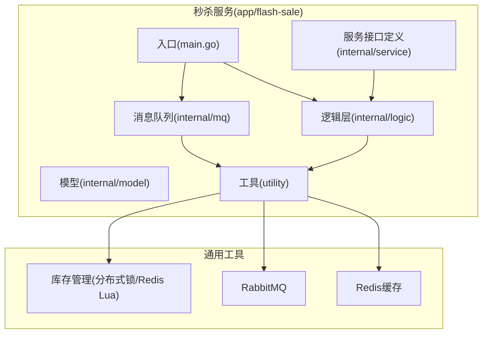
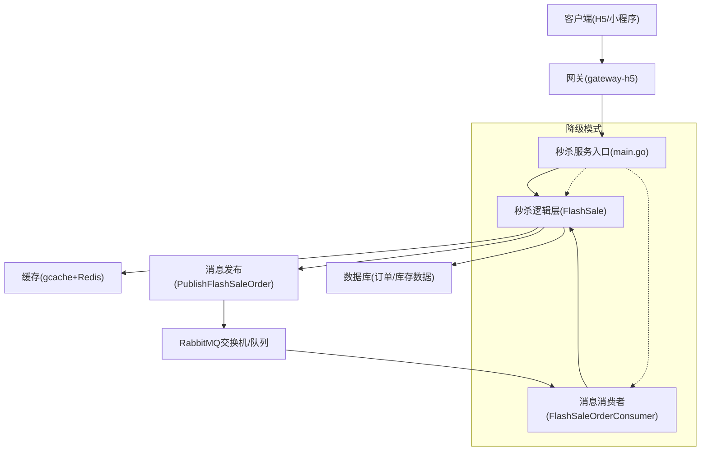
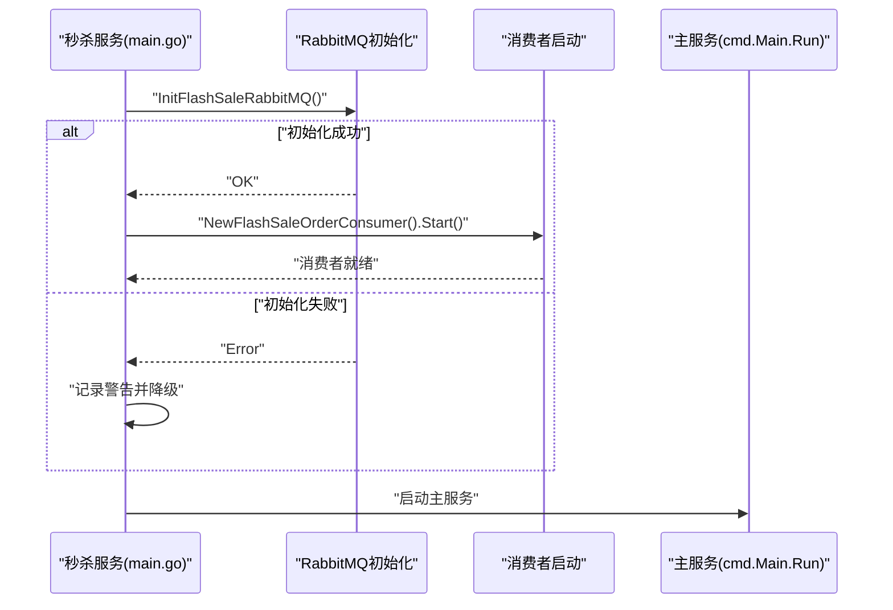
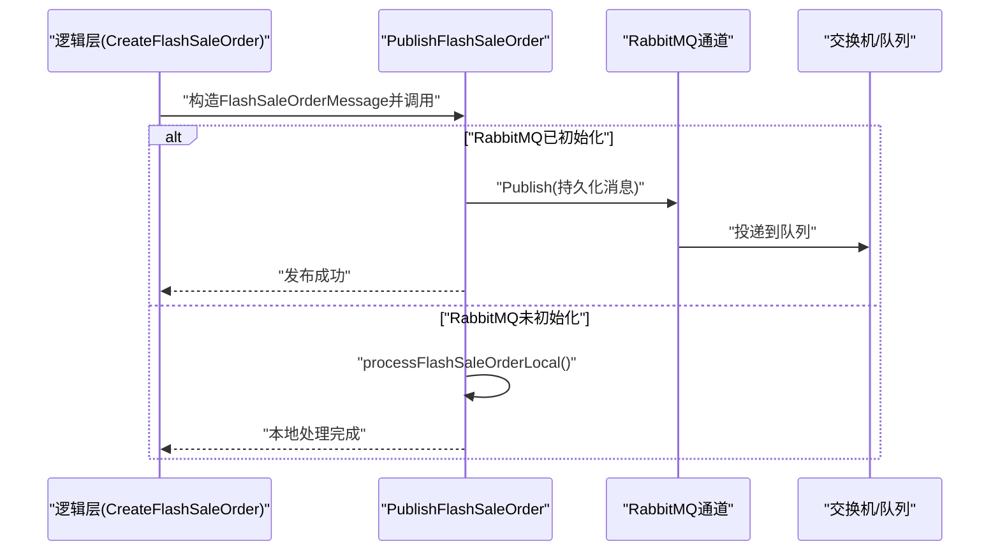
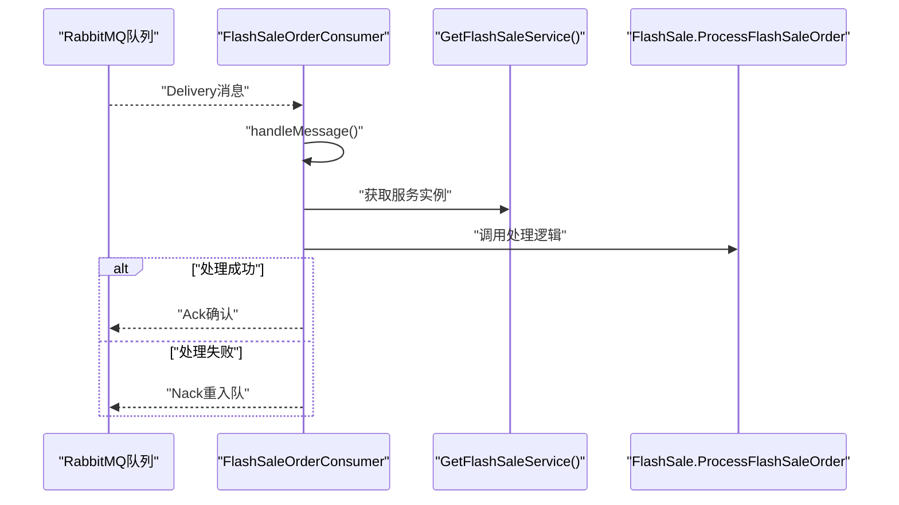
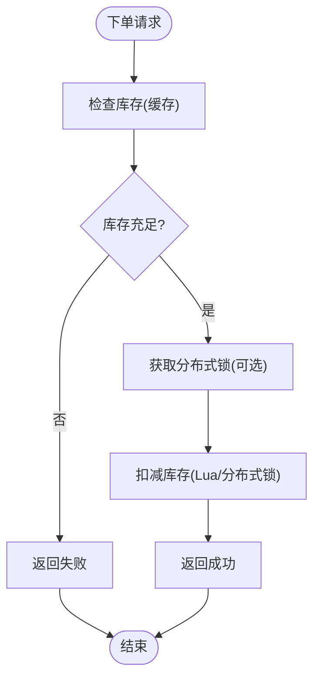
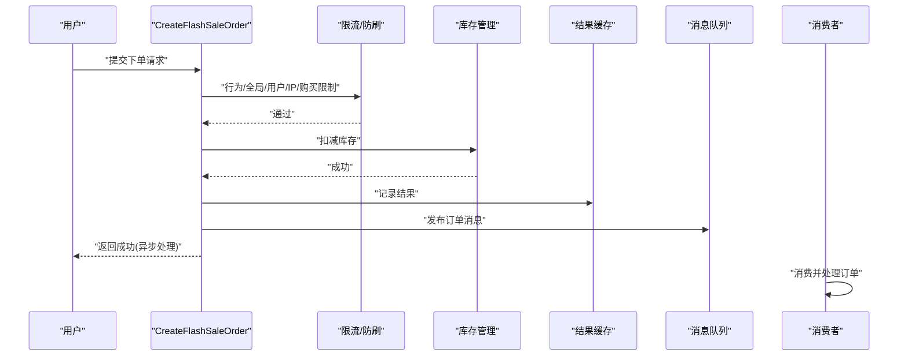
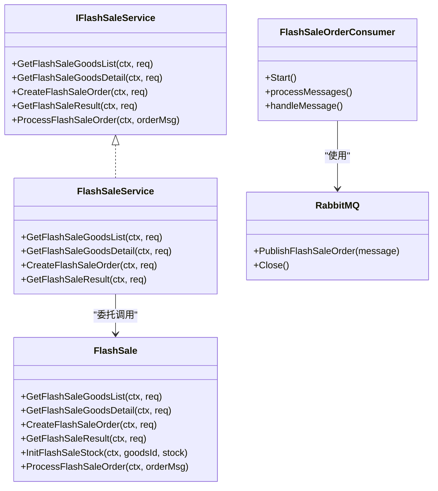
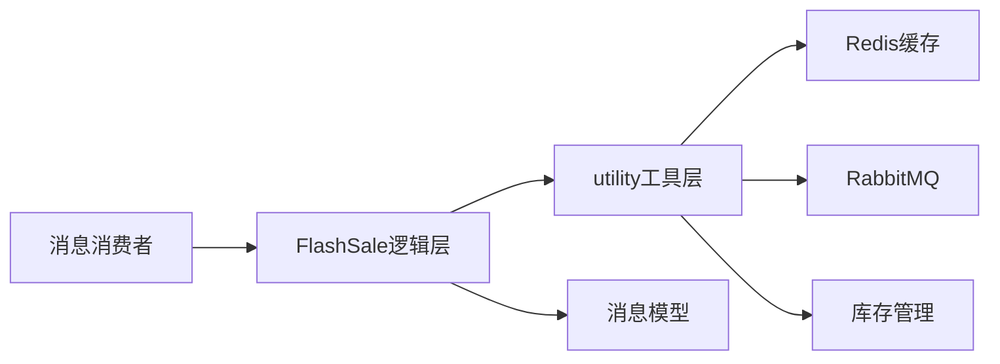

# 秒杀系统架构设计

<cite>
**本文档引用的文件**
- [app/flash-sale/main.go](file://app/flash-sale/main.go)
- [app/flash-sale/internal/service/flash_sale.go](file://app/flash-sale/internal/service/flash_sale.go)
- [app/flash-sale/internal/service/interfaces.go](file://app/flash-sale/internal/service/interfaces.go)
- [app/flash-sale/internal/logic/flash_sale.go](file://app/flash-sale/internal/logic/flash_sale.go)
- [app/flash-sale/internal/logic/flash_sale_logic.go](file://app/flash-sale/internal/logic/flash_sale_logic.go)
- [app/flash-sale/internal/mq/flash_sale_consumer.go](file://app/flash-sale/internal/mq/flash_sale_consumer.go)
- [app/flash-sale/internal/model/flash_sale_message.go](file://app/flash-sale/internal/model/flash_sale_message.go)
- [app/flash-sale/utility/rabbitmq.go](file://app/flash-sale/utility/rabbitmq.go)
- [app/flash-sale/utility/redis.go](file://app/flash-sale/utility/redis.go)
- [app/flash-sale/utility/stock_manager.go](file://app/flash-sale/utility/stock_manager.go)
- [app/flash-sale/utility/service.go](file://app/flash-sale/utility/service.go)
- [app/goods/utility/stock/distributed_lock.go](file://app/goods/utility/stock/distributed_lock.go)
- [app/goods/utility/stock/redis_lua.go](file://app/goods/utility/stock/redis_lua.go)
</cite>

## 目录
1. [引言](#引言)
2. [项目结构](#项目结构)
3. [核心组件](#核心组件)
4. [架构总览](#架构总览)
5. [详细组件分析](#详细组件分析)
6. [依赖关系分析](#依赖关系分析)
7. [性能考量](#性能考量)
8. [故障排查指南](#故障排查指南)
9. [结论](#结论)
10. [附录](#附录)

## 引言
本文件面向秒杀系统架构设计，围绕高并发处理、异步消息处理、分布式锁与缓存一致性等核心技术展开，系统性阐述服务启动流程、RabbitMQ集成方式、消费者启动机制，并重点解释降级模式运行、非阻塞初始化等容错策略。同时提供系统拓扑图、组件交互关系与数据流向图，给出扩展性考虑与性能瓶颈分析，帮助读者快速理解并落地该架构。

## 项目结构
秒杀服务位于独立模块中，采用分层架构：入口程序负责初始化与启动；逻辑层封装业务规则；工具层提供缓存、消息、库存管理等通用能力；MQ层负责消息发布与消费。

图表来源
- [app/flash-sale/main.go](file://app/flash-sale/main.go#L18-L37)
- [app/flash-sale/internal/logic/flash_sale.go](file://app/flash-sale/internal/logic/flash_sale.go#L11-L22)
- [app/flash-sale/internal/mq/flash_sale_consumer.go](file://app/flash-sale/internal/mq/flash_sale_consumer.go#L28-L55)
- [app/flash-sale/utility/rabbitmq.go](file://app/flash-sale/utility/rabbitmq.go#L21-L55)
- [app/flash-sale/utility/redis.go](file://app/flash-sale/utility/redis.go#L16-L50)
- [app/goods/utility/stock/distributed_lock.go](file://app/goods/utility/stock/distributed_lock.go#L13-L29)
- [app/goods/utility/stock/redis_lua.go](file://app/goods/utility/stock/redis_lua.go#L12-L23)

章节来源
- [app/flash-sale/main.go](file://app/flash-sale/main.go#L1-L38)
- [app/flash-sale/internal/service/flash_sale.go](file://app/flash-sale/internal/service/flash_sale.go#L1-L28)
- [app/flash-sale/internal/service/interfaces.go](file://app/flash-sale/internal/service/interfaces.go#L1-L26)

## 核心组件
- 服务入口与启动控制：负责非阻塞初始化外部依赖（如RabbitMQ），在失败时进入降级模式，保证主服务可用。
- 业务逻辑层：提供商品列表/详情查询、下单、结果查询、库存初始化与异步订单处理等核心能力。
- 消息中间件：基于RabbitMQ实现订单消息的发布与消费，支持持久化与自动重试。
- 缓存与库存：基于gcache+Redis实现高并发下的库存检查与扣减，提供两种库存实现策略（本地锁+Redis Lua）。
- 服务注册与发现：通过utility包统一注册与获取服务实例，避免循环依赖。

章节来源
- [app/flash-sale/main.go](file://app/flash-sale/main.go#L18-L37)
- [app/flash-sale/internal/logic/flash_sale_logic.go](file://app/flash-sale/internal/logic/flash_sale_logic.go#L102-L254)
- [app/flash-sale/internal/mq/flash_sale_consumer.go](file://app/flash-sale/internal/mq/flash_sale_consumer.go#L16-L95)
- [app/flash-sale/utility/redis.go](file://app/flash-sale/utility/redis.go#L16-L50)
- [app/flash-sale/utility/stock_manager.go](file://app/flash-sale/utility/stock_manager.go#L12-L90)
- [app/flash-sale/utility/service.go](file://app/flash-sale/utility/service.go#L8-L37)

## 架构总览
下图展示秒杀系统整体架构与组件交互关系：

图表来源
- [app/flash-sale/main.go](file://app/flash-sale/main.go#L21-L33)
- [app/flash-sale/internal/logic/flash_sale_logic.go](file://app/flash-sale/internal/logic/flash_sale_logic.go#L229-L245)
- [app/flash-sale/internal/mq/flash_sale_consumer.go](file://app/flash-sale/internal/mq/flash_sale_consumer.go#L97-L119)
- [app/flash-sale/utility/rabbitmq.go](file://app/flash-sale/utility/rabbitmq.go#L103-L120)

## 详细组件分析

### 服务启动与容错策略
- 非阻塞初始化RabbitMQ：若初始化失败，记录警告并以降级模式运行（无消息队列功能），主服务仍可提供查询与下单接口。
- 消费者启动条件：仅在RabbitMQ初始化成功后启动消费者；消费者启动失败不影响主服务。
- 降级路径：当RabbitMQ不可用时，消息发布走本地处理分支，确保下单流程不中断。

图表来源
- [app/flash-sale/main.go](file://app/flash-sale/main.go#L21-L36)

章节来源
- [app/flash-sale/main.go](file://app/flash-sale/main.go#L18-L37)

### RabbitMQ集成与消息发布
- 连接与声明：初始化时建立连接、创建通道，并声明交换机与队列，绑定路由键。
- 发布消息：将订单消息序列化后发布到指定交换机与路由键，启用持久化。
- 本地回退：当RabbitMQ未初始化时，直接本地处理订单，记录日志并模拟处理结果。

图表来源
- [app/flash-sale/internal/logic/flash_sale_logic.go](file://app/flash-sale/internal/logic/flash_sale_logic.go#L229-L245)
- [app/flash-sale/internal/mq/flash_sale_consumer.go](file://app/flash-sale/internal/mq/flash_sale_consumer.go#L97-L119)
- [app/flash-sale/utility/rabbitmq.go](file://app/flash-sale/utility/rabbitmq.go#L103-L120)

章节来源
- [app/flash-sale/utility/rabbitmq.go](file://app/flash-sale/utility/rabbitmq.go#L21-L55)
- [app/flash-sale/internal/mq/flash_sale_consumer.go](file://app/flash-sale/internal/mq/flash_sale_consumer.go#L97-L119)

### 消息消费者与处理流程
- 消费者启动：从指定队列拉取消息，关闭自动确认，开启goroutine循环处理。
- 消息处理：反序列化为订单消息，调用服务层处理；失败时Nack并重入队，成功时Ack确认。
- 服务层对接：当前实现中通过服务注册器获取服务实例，后续可直接调用ProcessFlashSaleOrder方法。

图表来源
- [app/flash-sale/internal/mq/flash_sale_consumer.go](file://app/flash-sale/internal/mq/flash_sale_consumer.go#L28-L95)
- [app/flash-sale/internal/service/interfaces.go](file://app/flash-sale/internal/service/interfaces.go#L23-L25)
- [app/flash-sale/utility/service.go](file://app/flash-sale/utility/service.go#L33-L36)

章节来源
- [app/flash-sale/internal/mq/flash_sale_consumer.go](file://app/flash-sale/internal/mq/flash_sale_consumer.go#L16-L95)
- [app/flash-sale/utility/service.go](file://app/flash-sale/utility/service.go#L28-L36)

### 库存管理与防超卖
- 缓存库存管理：基于gcache+Redis实现库存检查与扣减，提供线程安全的读写锁。
- 分布式锁库存：基于Redis SET NX EX + Lua脚本安全释放，保障原子性与一致性。
- Redis Lua库存：通过Lua脚本在服务端完成“检查-扣减”原子操作，避免竞态。

图表来源
- [app/flash-sale/utility/stock_manager.go](file://app/flash-sale/utility/stock_manager.go#L33-L73)
- [app/goods/utility/stock/distributed_lock.go](file://app/goods/utility/stock/distributed_lock.go#L91-L159)
- [app/goods/utility/stock/redis_lua.go](file://app/goods/utility/stock/redis_lua.go#L75-L102)

章节来源
- [app/flash-sale/utility/stock_manager.go](file://app/flash-sale/utility/stock_manager.go#L12-L90)
- [app/goods/utility/stock/distributed_lock.go](file://app/goods/utility/stock/distributed_lock.go#L13-L266)
- [app/goods/utility/stock/redis_lua.go](file://app/goods/utility/stock/redis_lua.go#L12-L166)

### 业务流程与数据流向
- 下单流程：参数校验 → 防刷/限流 → 库存扣减 → 记录结果 → 发布消息 → 返回结果。
- 结果查询：根据ResultId从缓存读取处理状态与订单号。
- 异步处理：消费者接收消息后调用服务层处理订单。

图表来源
- [app/flash-sale/internal/logic/flash_sale_logic.go](file://app/flash-sale/internal/logic/flash_sale_logic.go#L102-L254)
- [app/flash-sale/internal/mq/flash_sale_consumer.go](file://app/flash-sale/internal/mq/flash_sale_consumer.go#L70-L95)

章节来源
- [app/flash-sale/internal/logic/flash_sale_logic.go](file://app/flash-sale/internal/logic/flash_sale_logic.go#L102-L297)

### 类与接口关系

图表来源
- [app/flash-sale/internal/service/interfaces.go](file://app/flash-sale/internal/service/interfaces.go#L9-L25)
- [app/flash-sale/internal/logic/flash_sale.go](file://app/flash-sale/internal/logic/flash_sale.go#L16-L59)
- [app/flash-sale/internal/mq/flash_sale_consumer.go](file://app/flash-sale/internal/mq/flash_sale_consumer.go#L16-L26)
- [app/flash-sale/utility/rabbitmq.go](file://app/flash-sale/utility/rabbitmq.go#L15-L19)

章节来源
- [app/flash-sale/internal/service/flash_sale.go](file://app/flash-sale/internal/service/flash_sale.go#L8-L27)
- [app/flash-sale/internal/logic/flash_sale.go](file://app/flash-sale/internal/logic/flash_sale.go#L16-L59)

## 依赖关系分析
- 组件耦合：逻辑层依赖工具层（缓存、消息、库存），工具层依赖配置中心与外部组件（Redis、RabbitMQ）。
- 服务注册：通过utility包统一注册与获取服务实例，避免内部逻辑层与服务层之间的循环依赖。
- 消息解耦：下单成功后立即返回，异步处理通过消息队列实现，降低主流程延迟。

图表来源
- [app/flash-sale/internal/logic/flash_sale_logic.go](file://app/flash-sale/internal/logic/flash_sale_logic.go#L10-L12)
- [app/flash-sale/internal/mq/flash_sale_consumer.go](file://app/flash-sale/internal/mq/flash_sale_consumer.go#L3-L10)
- [app/flash-sale/utility/service.go](file://app/flash-sale/utility/service.go#L28-L36)

章节来源
- [app/flash-sale/utility/service.go](file://app/flash-sale/utility/service.go#L23-L36)
- [app/flash-sale/internal/logic/flash_sale.go](file://app/flash-sale/internal/logic/flash_sale.go#L11-L14)

## 性能考量
- 缓存优先：库存与结果均使用缓存，减少数据库压力；结合Redis持久化与合理TTL控制。
- 异步削峰：下单成功后异步处理订单，避免瞬时高并发冲击数据库。
- 原子操作：库存扣减采用Lua脚本或分布式锁，避免超卖与竞态。
- 限流与防刷：多维度限流（全局、用户、IP、购买次数）降低恶意请求影响。
- 连接池与非阻塞：RabbitMQ初始化非阻塞，失败降级，保证主服务可用性。

## 故障排查指南
- RabbitMQ初始化失败：查看日志警告，确认凭证与网络连通性；确认交换机/队列声明是否成功。
- 消费者启动失败：检查队列是否存在、权限是否正确；观察消费者日志中的Nack重试情况。
- 库存异常：核对库存初始化值与扣减逻辑；关注Lua脚本执行结果与分布式锁释放。
- 结果查询为空：确认ResultId格式与缓存键命名；检查缓存过期时间。
- 降级模式：当RabbitMQ不可用时，下单仍可成功，但需人工核查本地处理结果与数据库一致性。

章节来源
- [app/flash-sale/main.go](file://app/flash-sale/main.go#L21-L33)
- [app/flash-sale/internal/mq/flash_sale_consumer.go](file://app/flash-sale/internal/mq/flash_sale_consumer.go#L57-L95)
- [app/flash-sale/internal/logic/flash_sale_logic.go](file://app/flash-sale/internal/logic/flash_sale_logic.go#L229-L245)

## 结论
该秒杀系统通过“缓存+异步+限流+分布式锁/Lua”的组合，在高并发场景下实现了高性能与强一致性的平衡。非阻塞初始化与降级模式提升了系统韧性，消息队列解耦了主流程与后台处理，为后续扩展提供了清晰边界。建议在生产环境中进一步完善监控与告警、引入死信队列与重试策略，并持续优化热点商品的缓存命中率与库存预热策略。

## 附录
- 关键配置项：RabbitMQ连接参数、Redis缓存配置、库存键命名规范、消息持久化开关。
- 扩展建议：引入延迟队列处理超时订单、增加库存预热与热点检测、优化Lua脚本与锁粒度、实施灰度发布与A/B测试。