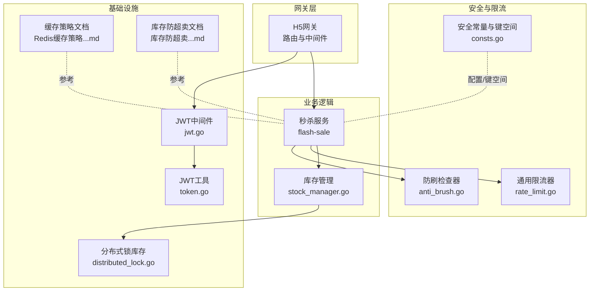
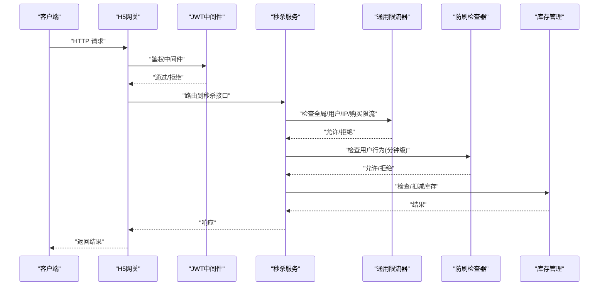
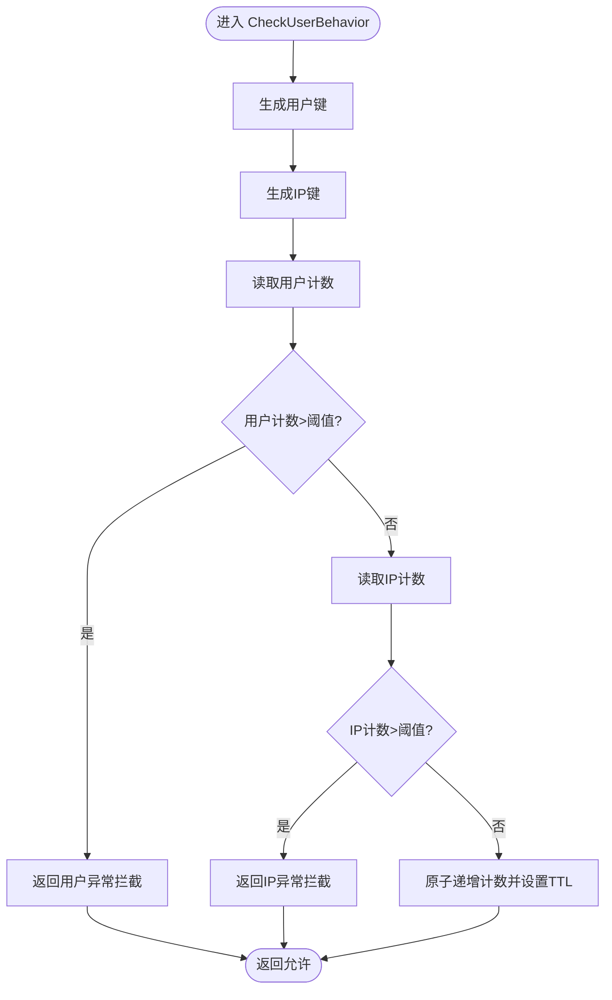
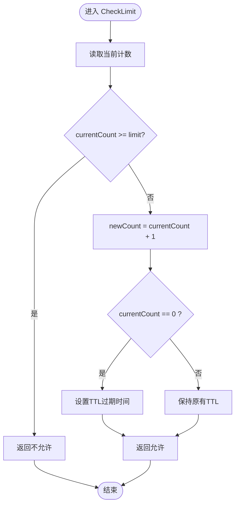
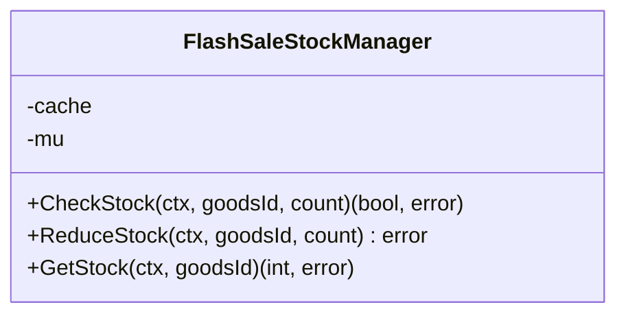
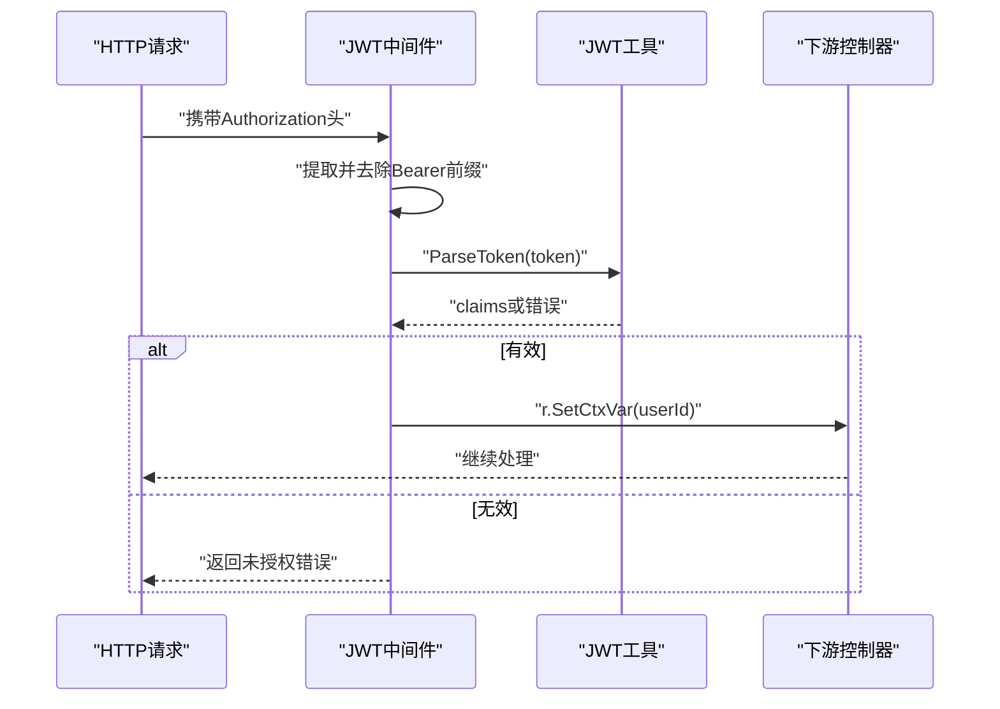
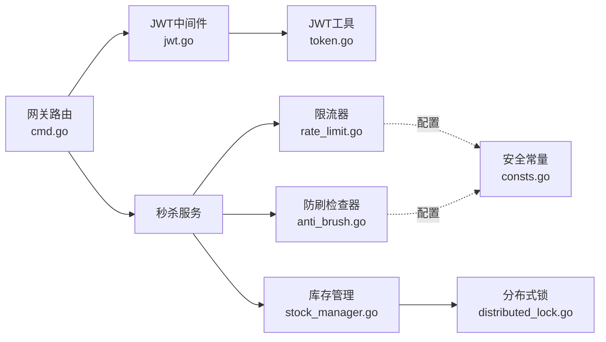

# 防刷安全机制

<cite>
**本文引用的文件**
- [anti_brush.go](file://app/flash-sale/utility/anti_brush.go)
- [rate_limit.go](file://app/flash-sale/utility/rate_limit.go)
- [consts.go](file://app/flash-sale/internal/consts/consts.go)
- [stock_manager.go](file://app/flash-sale/utility/stock_manager.go)
- [distributed_lock.go](file://app/goods/utility/stock/distributed_lock.go)
- [jwt.go](file://utility/middleware/jwt.go)
- [token.go](file://utility/token.go)
- [middleware.go](file://utility/middleware/middleware.go)
- [Redis缓存策略-穿透-击穿-雪崩全解决方案.md](file://doc/Redis缓存策略-穿透-击穿-雪崩全解决方案.md)
- [库存防超卖（Redis Lua+分布式锁对比实践）.md](file://doc/库存防超卖（Redis Lua+分布式锁对比实践）.md)
- [cmd.go](file://app/gateway-h5/internal/cmd/cmd.go)
</cite>

## 目录
1. [简介](#简介)
2. [项目结构](#项目结构)
3. [核心组件](#核心组件)
4. [架构总览](#架构总览)
5. [详细组件分析](#详细组件分析)
6. [依赖关系分析](#依赖关系分析)
7. [性能考量](#性能考量)
8. [故障排查指南](#故障排查指南)
9. [结论](#结论)
10. [附录](#附录)

## 简介
本文件系统化梳理并阐述本仓库中的防刷安全机制，覆盖用户行为监控、刷单检测、限流控制、异常检测、IP黑名单、设备指纹识别与行为画像等高级技术，并结合秒杀场景给出限流策略实现原理（令牌桶思想）、安全策略配置指南与攻击防护最佳实践。内容以代码为依据，辅以可视化图示帮助不同背景读者理解。

## 项目结构
围绕防刷与安全的关键目录与文件分布如下：
- 秒杀模块安全工具：app/flash-sale/utility 下的防刷与限流实现
- 安全常量与键空间：app/flash-sale/internal/consts/consts.go
- 库存与并发安全：app/goods/.../stock 下的分布式锁与Lua库存管理
- 认证与中间件：utility/middleware 与 utility/token.go
- 网关路由与鉴权绑定：app/gateway-h5/internal/cmd/cmd.go
- 文档参考：doc 目录下的缓存与库存防超卖实践文档

图表来源
- [anti_brush.go](file://app/flash-sale/utility/anti_brush.go#L1-L81)
- [rate_limit.go](file://app/flash-sale/utility/rate_limit.go#L1-L161)
- [consts.go](file://app/flash-sale/internal/consts/consts.go#L1-L43)
- [stock_manager.go](file://app/flash-sale/utility/stock_manager.go#L1-L90)
- [distributed_lock.go](file://app/goods/utility/stock/distributed_lock.go#L1-L90)
- [jwt.go](file://utility/middleware/jwt.go#L1-L39)
- [token.go](file://utility/token.go#L1-L65)
- [cmd.go](file://app/gateway-h5/internal/cmd/cmd.go#L35-L72)

章节来源
- [anti_brush.go](file://app/flash-sale/utility/anti_brush.go#L1-L81)
- [rate_limit.go](file://app/flash-sale/utility/rate_limit.go#L1-L161)
- [consts.go](file://app/flash-sale/internal/consts/consts.go#L1-L43)
- [stock_manager.go](file://app/flash-sale/utility/stock_manager.go#L1-L90)
- [distributed_lock.go](file://app/goods/utility/stock/distributed_lock.go#L1-L90)
- [jwt.go](file://utility/middleware/jwt.go#L1-L39)
- [token.go](file://utility/token.go#L1-L65)
- [cmd.go](file://app/gateway-h5/internal/cmd/cmd.go#L35-L72)

## 核心组件
- 防刷检查器 AntiBrushChecker：基于内存缓存对用户与IP进行分钟级请求频次统计与阈值判断，支持异常拦截与计数累加。
- 通用限流器 RateLimiter：提供全局、用户、IP、购买等多维度限流能力，采用“先检查再原子递增”的计数模型。
- 安全常量与键空间：集中定义缓存键前缀、限流阈值、防刷阈值与黑名单过期时间等。
- 秒杀库存管理：提供库存检查与减少的线程安全封装，配合分布式锁与Lua脚本保障高并发一致性。
- JWT认证与中间件：统一鉴权入口，提取并校验Token，注入用户上下文。
- 网关路由：对公开接口与需要鉴权的接口进行分组绑定，确保安全策略生效。

章节来源
- [anti_brush.go](file://app/flash-sale/utility/anti_brush.go#L12-L80)
- [rate_limit.go](file://app/flash-sale/utility/rate_limit.go#L13-L161)
- [consts.go](file://app/flash-sale/internal/consts/consts.go#L3-L42)
- [stock_manager.go](file://app/flash-sale/utility/stock_manager.go#L12-L90)
- [jwt.go](file://utility/middleware/jwt.go#L16-L38)
- [token.go](file://utility/token.go#L10-L65)
- [cmd.go](file://app/gateway-h5/internal/cmd/cmd.go#L35-L72)

## 架构总览
下图展示从网关到业务服务的安全与防刷路径，以及关键组件交互：

图表来源
- [cmd.go](file://app/gateway-h5/internal/cmd/cmd.go#L35-L72)
- [jwt.go](file://utility/middleware/jwt.go#L16-L38)
- [rate_limit.go](file://app/flash-sale/utility/rate_limit.go#L25-L161)
- [anti_brush.go](file://app/flash-sale/utility/anti_brush.go#L24-L80)
- [stock_manager.go](file://app/flash-sale/utility/stock_manager.go#L33-L89)

## 详细组件分析

### 防刷检查器 AntiBrushChecker
- 功能要点
  - 对用户与IP分别维护分钟级计数，超过阈值则拦截。
  - 使用缓存原子递增计数，设置TTL保证过期清理。
  - 返回明确的异常提示，便于上层统一处理。
- 关键参数
  - 用户每分钟最大请求数、IP每分钟最大请求数由安全常量统一管理。
- 适用场景
  - 预防刷单、异常爬虫、暴力请求等。

图表来源
- [anti_brush.go](file://app/flash-sale/utility/anti_brush.go#L24-L80)
- [consts.go](file://app/flash-sale/internal/consts/consts.go#L37-L41)

章节来源
- [anti_brush.go](file://app/flash-sale/utility/anti_brush.go#L24-L80)
- [consts.go](file://app/flash-sale/internal/consts/consts.go#L37-L41)

### 通用限流器 RateLimiter
- 功能要点
  - 提供全局、用户、IP、购买等多维限流。
  - 采用“先检查再递增”的原子计数模型，首次设置TTL，后续仅更新计数。
  - 支持获取客户端真实IP（考虑代理头）。
- 限流策略说明
  - 令牌桶思想：以固定周期（如每秒）为单位，累计请求计数，超过阈值则拒绝，体现“突发受限、长期平均”的特性。
  - 全局限流：保护系统整体压力。
  - 用户/IP限流：区分身份与来源，降低恶意来源影响。
  - 购买限流：按用户-商品维度限制购买频次，防止刷单。
- 异常处理
  - 检查失败与超过阈值均返回明确错误，便于上层统一处理。

图表来源
- [rate_limit.go](file://app/flash-sale/utility/rate_limit.go#L25-L49)

章节来源
- [rate_limit.go](file://app/flash-sale/utility/rate_limit.go#L13-L161)

### 安全常量与键空间
- 作用
  - 统一管理缓存键前缀、限流阈值、防刷阈值与黑名单过期时间。
  - 保证各模块配置一致，便于运维与审计。
- 关键项
  - 缓存键：商品、库存、结果等。
  - 限流键：用户、IP等。
  - 防刷键：用户行为、黑名单等。
  - 业务限制：每用户限购数量、每秒限流等。
  - 防刷配置：每分钟最大请求数、可疑阈值、黑名单过期时间等。

章节来源
- [consts.go](file://app/flash-sale/internal/consts/consts.go#L3-L42)

### 秒杀库存管理与并发安全
- 作用
  - 在高并发场景下提供库存检查与扣减的线程安全封装。
  - 结合分布式锁与Lua脚本，避免超卖与竞态条件。
- 并发控制
  - 内部使用互斥锁保护关键路径，确保同一时刻只有一个线程修改库存。
  - 结合分布式锁与Lua脚本，实现跨节点的一致性与原子性。

图表来源
- [stock_manager.go](file://app/flash-sale/utility/stock_manager.go#L12-L90)

章节来源
- [stock_manager.go](file://app/flash-sale/utility/stock_manager.go#L12-L90)
- [distributed_lock.go](file://app/goods/utility/stock/distributed_lock.go#L13-L90)

### 认证与中间件
- JWT中间件
  - 从请求头提取Token，去除Bearer前缀后进行解析与校验。
  - 校验失败直接返回未授权错误；成功则将用户ID写入上下文。
- JWT工具
  - 提供自定义声明、签发与解析能力，使用固定密钥签名。
- 网关路由
  - 对公开接口与需要鉴权的接口进行分组绑定，确保安全策略生效。

图表来源
- [jwt.go](file://utility/middleware/jwt.go#L16-L38)
- [token.go](file://utility/token.go#L52-L65)
- [cmd.go](file://app/gateway-h5/internal/cmd/cmd.go#L35-L72)

章节来源
- [jwt.go](file://utility/middleware/jwt.go#L16-L38)
- [token.go](file://utility/token.go#L52-L65)
- [cmd.go](file://app/gateway-h5/internal/cmd/cmd.go#L35-L72)

### 高级防刷技术与策略
- IP黑名单
  - 通过安全常量定义黑名单键与过期时间，结合防刷检查器与限流器共同使用。
- 设备指纹识别与行为画像
  - 可扩展在网关或中间件层采集UA、语言、时区等特征，形成设备指纹；结合历史行为建立画像，动态调整阈值。
- 异常检测机制
  - 基于分钟级请求频次与全局峰值波动，设定可疑阈值，触发临时限流或加入黑名单。
- 限流策略实现原理
  - 令牌桶思想：以固定周期为单位累计请求，超过阈值拒绝，体现“突发受限、长期平均”。
  - 全局限流保护系统整体；用户/IP限流区分身份与来源；购买限流防止刷单。

章节来源
- [consts.go](file://app/flash-sale/internal/consts/consts.go#L13-L42)
- [anti_brush.go](file://app/flash-sale/utility/anti_brush.go#L24-L80)
- [rate_limit.go](file://app/flash-sale/utility/rate_limit.go#L104-L161)

## 依赖关系分析
- 组件耦合
  - 网关路由绑定JWT中间件，确保下游秒杀接口具备身份校验。
  - 秒杀服务依赖限流器与防刷检查器，保障请求质量与系统稳定。
  - 库存管理依赖分布式锁与Lua脚本，确保高并发一致性。
- 外部依赖
  - 缓存：gcache（用于计数与行为记录）。
  - JWT：标准库实现，密钥固定。
  - 网关：ghttp路由与中间件框架。

图表来源
- [cmd.go](file://app/gateway-h5/internal/cmd/cmd.go#L35-L72)
- [jwt.go](file://utility/middleware/jwt.go#L16-L38)
- [token.go](file://utility/token.go#L52-L65)
- [rate_limit.go](file://app/flash-sale/utility/rate_limit.go#L13-L161)
- [anti_brush.go](file://app/flash-sale/utility/anti_brush.go#L12-L80)
- [stock_manager.go](file://app/flash-sale/utility/stock_manager.go#L12-L90)
- [distributed_lock.go](file://app/goods/utility/stock/distributed_lock.go#L13-L90)
- [consts.go](file://app/flash-sale/internal/consts/consts.go#L3-L42)

章节来源
- [cmd.go](file://app/gateway-h5/internal/cmd/cmd.go#L35-L72)
- [jwt.go](file://utility/middleware/jwt.go#L16-L38)
- [token.go](file://utility/token.go#L52-L65)
- [rate_limit.go](file://app/flash-sale/utility/rate_limit.go#L13-L161)
- [anti_brush.go](file://app/flash-sale/utility/anti_brush.go#L12-L80)
- [stock_manager.go](file://app/flash-sale/utility/stock_manager.go#L12-L90)
- [distributed_lock.go](file://app/goods/utility/stock/distributed_lock.go#L13-L90)
- [consts.go](file://app/flash-sale/internal/consts/consts.go#L3-L42)

## 性能考量
- 缓存与计数
  - 使用gcache进行原子计数与TTL管理，避免数据库压力。
  - 可参考缓存策略文档中的“空值缓存、本地锁、抖动过期”等手段，进一步降低缓存穿透与雪崩风险。
- 并发与一致性
  - 秒杀库存管理采用互斥锁保护关键路径；结合分布式锁与Lua脚本，提升跨节点一致性与吞吐。
- 网络与代理
  - 限流器支持从代理头获取真实IP，避免被绕过。

章节来源
- [Redis缓存策略-穿透-击穿-雪崩全解决方案.md](file://doc/Redis缓存策略-穿透-击穿-雪崩全解决方案.md#L181-L354)
- [库存防超卖（Redis Lua+分布式锁对比实践）.md](file://doc/库存防超卖（Redis Lua+分布式锁对比实践）.md#L225-L614)
- [rate_limit.go](file://app/flash-sale/utility/rate_limit.go#L85-L102)

## 故障排查指南
- 常见问题定位
  - 限流频繁：检查全局/用户/IP/购买限流阈值是否合理，确认客户端是否复用IP或账户。
  - 防刷拦截：核对用户与IP分钟级计数是否异常，关注是否存在批量脚本或爬虫。
  - 库存超卖：确认库存管理是否使用分布式锁与Lua脚本，检查锁释放逻辑。
  - 鉴权失败：检查Authorization头格式与签名密钥，确认中间件是否正确绑定。
- 日志与告警
  - 在网关与业务服务增加限流/拦截日志，结合Prometheus/Grafana进行可视化监控。

章节来源
- [rate_limit.go](file://app/flash-sale/utility/rate_limit.go#L51-L83)
- [anti_brush.go](file://app/flash-sale/utility/anti_brush.go#L24-L80)
- [stock_manager.go](file://app/flash-sale/utility/stock_manager.go#L33-L89)
- [jwt.go](file://utility/middleware/jwt.go#L16-L38)

## 结论
本项目在秒杀场景下构建了多层次的防刷与安全体系：以JWT鉴权为基础，结合全局/用户/IP/购买多维限流与分钟级行为监控，辅以库存并发安全与缓存策略，形成从入口到业务的闭环防护。建议在生产环境中持续优化阈值、引入设备指纹与行为画像，并完善监控与告警体系，以应对更复杂的攻击形态。

## 附录
- 安全策略配置建议
  - 限流阈值：根据QPS与SLA设定全局、用户、IP与购买维度阈值，定期复盘调整。
  - 防刷阈值：分钟级请求阈值应结合业务峰谷动态调整，可疑阈值用于触发临时风控。
  - 黑名单：设置合理过期时间，支持快速封禁与灰度放行。
  - 认证：严格管理JWT密钥与过期策略，启用HTTPS与CORS白名单。
- 攻击防护最佳实践
  - 多因子限流：全局+用户+IP+购买组合限流，降低单一维度被绕过的风险。
  - 行为画像：采集设备指纹与访问模式，建立动态阈值与灰名单机制。
  - 缓存加固：空值缓存、抖动过期、本地锁，避免缓存穿透与雪崩。
  - 并发安全：分布式锁+Lua脚本，确保库存一致性与原子性。