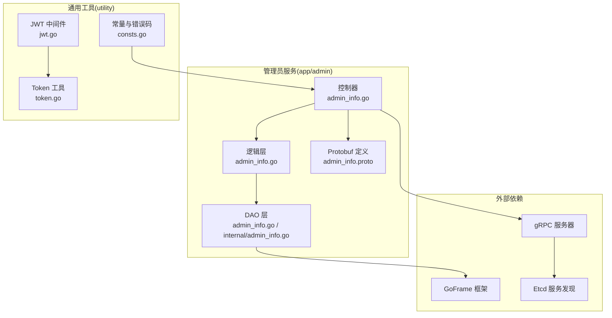
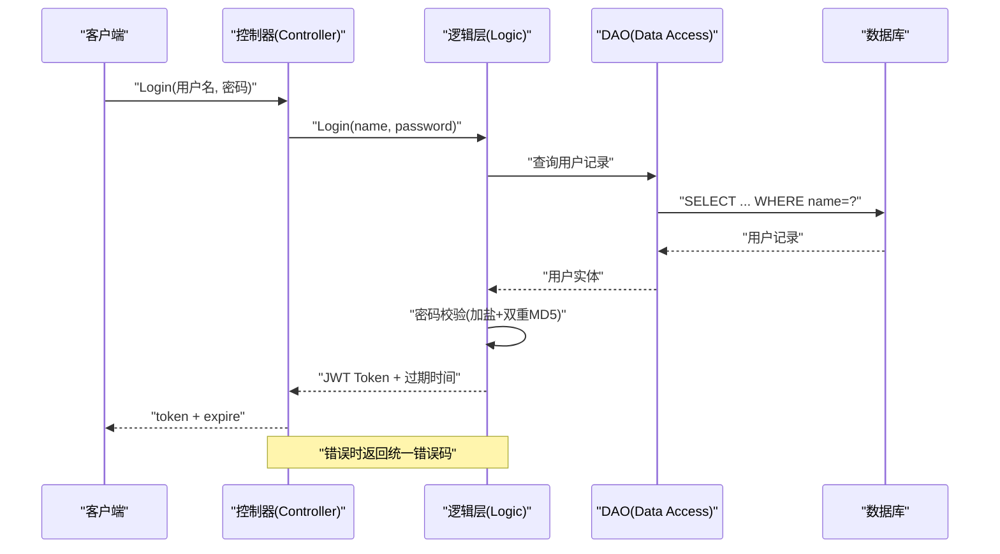
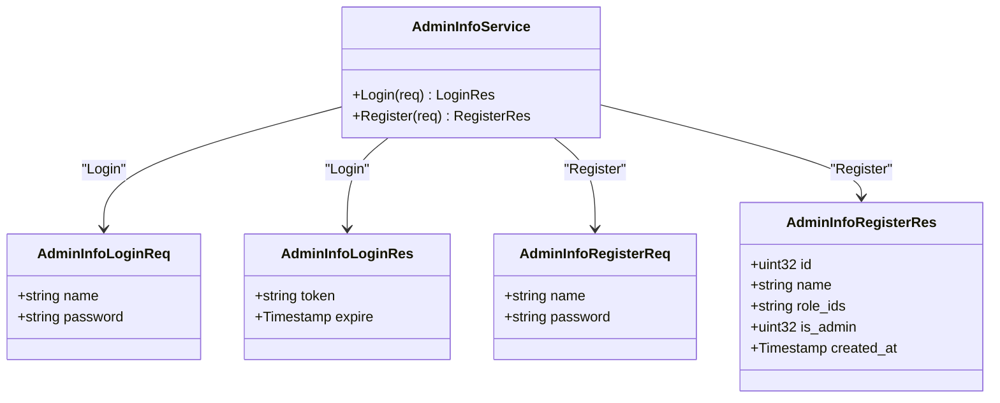
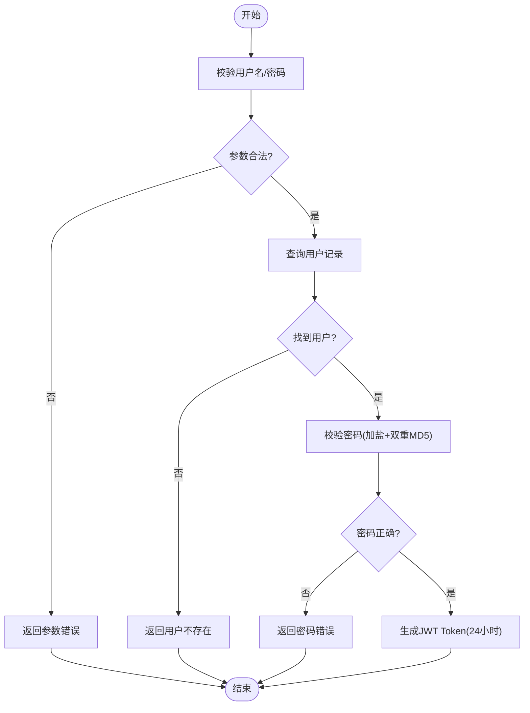
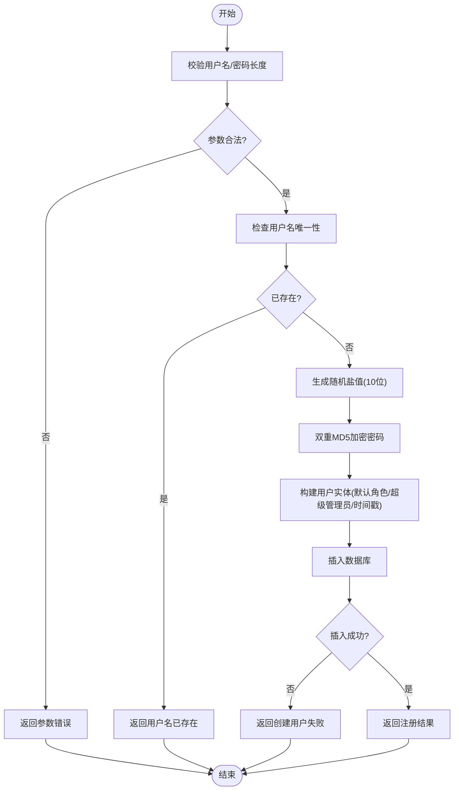
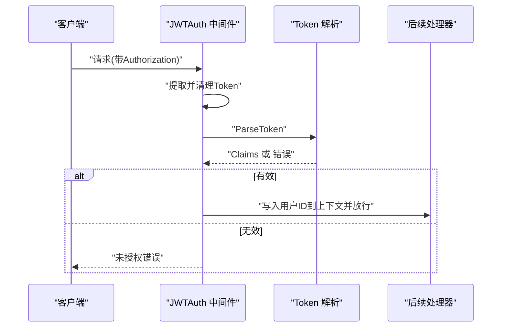
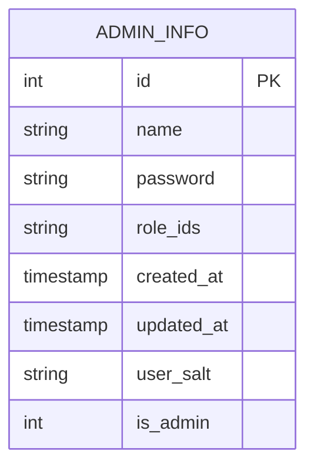
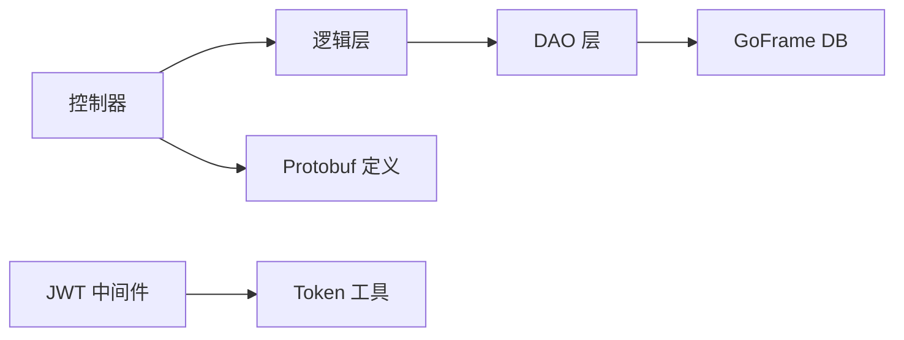

# 管理员API接口参考

<cite>
**本文引用的文件**
- [app/admin/main.go](file://app/admin/main.go)
- [app/admin/internal/controller/admin_info/admin_info.go](file://app/admin/internal/controller/admin_info/admin_info.go)
- [app/admin/internal/logic/admin_info/admin_info.go](file://app/admin/internal/logic/admin_info/admin_info.go)
- [app/admin/internal/dao/admin_info.go](file://app/admin/internal/dao/admin_info.go)
- [app/admin/internal/dao/internal/admin_info.go](file://app/admin/internal/dao/internal/admin_info.go)
- [app/admin/manifest/protobuf/admin_info/v1/admin_info.proto](file://app/admin/manifest/protobuf/admin_info/v1/admin_info.proto)
- [app/admin/manifest/protobuf/pbentity/admin_info.proto](file://app/admin/manifest/protobuf/pbentity/admin_info.proto)
- [app/admin/manifest/protobuf/pbentity/permission_info.proto](file://app/admin/manifest/protobuf/pbentity/permission_info.proto)
- [utility/middleware/jwt.go](file://utility/middleware/jwt.go)
- [utility/token.go](file://utility/token.go)
- [utility/consts/consts.go](file://utility/consts/consts.go)
- [init-db/01_init.sql](file://init-db/01_init.sql)
</cite>

## 目录
1. [简介](#简介)
2. [项目结构](#项目结构)
3. [核心组件](#核心组件)
4. [架构总览](#架构总览)
5. [详细组件分析](#详细组件分析)
6. [依赖关系分析](#依赖关系分析)
7. [性能考虑](#性能考虑)
8. [故障排查指南](#故障排查指南)
9. [结论](#结论)
10. [附录](#附录)

## 简介
本文件为管理员模块的完整接口参考文档，覆盖 gRPC 接口规范与认证机制，重点包括管理员登录、注册等核心能力。文档提供接口定义、请求/响应结构、认证方式、错误码说明、调用示例与集成指南，并对版本管理与兼容性进行说明。

## 项目结构
管理员模块采用 GoFrame 框架与 gRPC 架构，核心目录与职责如下：
- app/admin：管理员服务主体
  - internal/controller：gRPC 控制器层，负责请求接入与响应封装
  - internal/logic：业务逻辑层，处理登录、注册等核心流程
  - internal/dao：数据访问对象，封装数据库操作
  - manifest/protobuf：Protocol Buffers 定义，描述服务契约与实体模型
- utility：通用工具与中间件
  - middleware：JWT 中间件，提供鉴权能力
  - token.go：JWT 生成与解析、密码加盐与加密
  - consts：统一错误码与提示常量

**图表来源**
- [app/admin/internal/controller/admin_info/admin_info.go](file://app/admin/internal/controller/admin_info/admin_info.go#L1-L73)
- [app/admin/internal/logic/admin_info/admin_info.go](file://app/admin/internal/logic/admin_info/admin_info.go#L1-L96)
- [app/admin/internal/dao/admin_info.go](file://app/admin/internal/dao/admin_info.go#L1-L23)
- [app/admin/internal/dao/internal/admin_info.go](file://app/admin/internal/dao/internal/admin_info.go#L1-L94)
- [app/admin/manifest/protobuf/admin_info/v1/admin_info.proto](file://app/admin/manifest/protobuf/admin_info/v1/admin_info.proto#L1-L40)
- [utility/middleware/jwt.go](file://utility/middleware/jwt.go#L1-L39)
- [utility/token.go](file://utility/token.go#L1-L65)
- [utility/consts/consts.go](file://utility/consts/consts.go#L1-L47)

**章节来源**
- [app/admin/main.go](file://app/admin/main.go#L1-L25)
- [app/admin/internal/controller/admin_info/admin_info.go](file://app/admin/internal/controller/admin_info/admin_info.go#L1-L73)
- [app/admin/internal/logic/admin_info/admin_info.go](file://app/admin/internal/logic/admin_info/admin_info.go#L1-L96)
- [app/admin/internal/dao/admin_info.go](file://app/admin/internal/dao/admin_info.go#L1-L23)
- [app/admin/internal/dao/internal/admin_info.go](file://app/admin/internal/dao/internal/admin_info.go#L1-L94)
- [app/admin/manifest/protobuf/admin_info/v1/admin_info.proto](file://app/admin/manifest/protobuf/admin_info/v1/admin_info.proto#L1-L40)
- [utility/middleware/jwt.go](file://utility/middleware/jwt.go#L1-L39)
- [utility/token.go](file://utility/token.go#L1-L65)
- [utility/consts/consts.go](file://utility/consts/consts.go#L1-L47)

## 核心组件
- gRPC 服务与消息定义
  - 服务：AdminInfo
  - 方法：Login、Register
  - 请求/响应消息：AdminInfoLoginReq/LoginRes、AdminInfoRegisterReq/RegisterRes
- 控制器层
  - 实现 gRPC 服务接口，调用逻辑层，封装响应与错误
- 逻辑层
  - Login：参数校验、用户查询、密码校验、JWT 生成
  - Register：参数校验、用户名唯一性检查、加盐与双重 MD5 加密、默认角色与创建时间设置、入库
- DAO 层
  - 提供 Ctx、DB、Table、Columns、Group、Transaction 等通用能力
- JWT 中间件与 Token 工具
  - JWTAuth：从 Header 提取 Authorization，移除 Bearer 前缀，解析并校验 Token，注入用户上下文
  - GenerateToken/ParseToken：生成与解析 JWT，含过期时间与签名
- 常量与错误码
  - 统一错误提示前缀，便于定位模块与错误类型

**章节来源**
- [app/admin/manifest/protobuf/admin_info/v1/admin_info.proto](file://app/admin/manifest/protobuf/admin_info/v1/admin_info.proto#L9-L15)
- [app/admin/internal/controller/admin_info/admin_info.go](file://app/admin/internal/controller/admin_info/admin_info.go#L19-L72)
- [app/admin/internal/logic/admin_info/admin_info.go](file://app/admin/internal/logic/admin_info/admin_info.go#L15-L95)
- [app/admin/internal/dao/internal/admin_info.go](file://app/admin/internal/dao/internal/admin_info.go#L76-L93)
- [utility/middleware/jwt.go](file://utility/middleware/jwt.go#L16-L38)
- [utility/token.go](file://utility/token.go#L31-L64)
- [utility/consts/consts.go](file://utility/consts/consts.go#L44-L46)

## 架构总览
管理员服务通过 gRPC 对外提供登录与注册能力，内部以控制器-逻辑-DAO 分层组织，结合 JWT 中间件实现鉴权。

**图表来源**
- [app/admin/internal/controller/admin_info/admin_info.go](file://app/admin/internal/controller/admin_info/admin_info.go#L23-L44)
- [app/admin/internal/logic/admin_info/admin_info.go](file://app/admin/internal/logic/admin_info/admin_info.go#L15-L46)
- [app/admin/internal/dao/internal/admin_info.go](file://app/admin/internal/dao/internal/admin_info.go#L76-L83)

**章节来源**
- [app/admin/internal/controller/admin_info/admin_info.go](file://app/admin/internal/controller/admin_info/admin_info.go#L1-L73)
- [app/admin/internal/logic/admin_info/admin_info.go](file://app/admin/internal/logic/admin_info/admin_info.go#L1-L96)

## 详细组件分析

### gRPC 服务与消息定义
- 服务：AdminInfo
  - 方法：Login、Register
- 请求/响应消息
  - Login：请求包含用户名与密码；响应包含 JWT 令牌与过期时间
  - Register：请求包含用户名与密码；响应包含用户 ID、用户名、角色 IDs、是否超级管理员、创建时间

**图表来源**
- [app/admin/manifest/protobuf/admin_info/v1/admin_info.proto](file://app/admin/manifest/protobuf/admin_info/v1/admin_info.proto#L9-L40)

**章节来源**
- [app/admin/manifest/protobuf/admin_info/v1/admin_info.proto](file://app/admin/manifest/protobuf/admin_info/v1/admin_info.proto#L1-L40)

### 登录(Login)接口
- 功能概述
  - 输入：用户名、密码
  - 输出：JWT 令牌与过期时间
- 处理流程
  - 参数校验
  - 查询用户记录并转换为实体
  - 密码校验（加盐+双重 MD5）
  - 生成 JWT Token（24 小时过期）
- 错误处理
  - 账号密码为空、用户不存在、密码错误、系统错误
  - 统一错误码包装，便于前端识别与国际化

**图表来源**
- [app/admin/internal/logic/admin_info/admin_info.go](file://app/admin/internal/logic/admin_info/admin_info.go#L15-L46)

**章节来源**
- [app/admin/internal/controller/admin_info/admin_info.go](file://app/admin/internal/controller/admin_info/admin_info.go#L23-L44)
- [app/admin/internal/logic/admin_info/admin_info.go](file://app/admin/internal/logic/admin_info/admin_info.go#L15-L46)
- [utility/token.go](file://utility/token.go#L31-L50)
- [utility/consts/consts.go](file://utility/consts/consts.go#L14-L15)

### 注册(Register)接口
- 功能概述
  - 输入：用户名、密码
  - 输出：用户 ID、用户名、角色 IDs、是否超级管理员、创建时间
- 处理流程
  - 参数校验（用户名非空、密码长度≥6）
  - 检查用户名唯一性
  - 生成随机盐值（10 位），双重 MD5 加密密码
  - 设置默认角色 ID、是否超级管理员、创建/更新时间
  - 插入数据库并返回新用户
- 默认值与约束
  - 默认角色 ID：2
  - 默认是否超级管理员：0
  - 创建/更新时间：当前时间

**图表来源**
- [app/admin/internal/logic/admin_info/admin_info.go](file://app/admin/internal/logic/admin_info/admin_info.go#L48-L95)

**章节来源**
- [app/admin/internal/controller/admin_info/admin_info.go](file://app/admin/internal/controller/admin_info/admin_info.go#L46-L72)
- [app/admin/internal/logic/admin_info/admin_info.go](file://app/admin/internal/logic/admin_info/admin_info.go#L48-L95)

### JWT 认证与中间件
- 中间件行为
  - 从 Header 读取 Authorization
  - 移除 "Bearer " 前缀
  - 解析并校验 JWT，失败则返回未授权
  - 成功则将用户 ID 写入上下文，继续后续处理
- Token 结构
  - 自定义声明包含用户 ID
  - HS256 签名，24 小时过期
- 使用场景
  - 在需要鉴权的 gRPC 或 HTTP 接口上应用该中间件

**图表来源**
- [utility/middleware/jwt.go](file://utility/middleware/jwt.go#L16-L38)
- [utility/token.go](file://utility/token.go#L52-L64)

**章节来源**
- [utility/middleware/jwt.go](file://utility/middleware/jwt.go#L1-L39)
- [utility/token.go](file://utility/token.go#L10-L64)

### 数据模型与实体
- 表 admin_info 字段映射
  - id、name、password、role_ids、created_at、updated_at、user_salt、is_admin
- Protobuf 实体 AdminInfo
  - 字段与表字段一一对应，包含时间戳类型

**图表来源**
- [app/admin/internal/model/entity/admin_info.go](file://app/admin/internal/model/entity/admin_info.go#L11-L21)
- [app/admin/manifest/protobuf/pbentity/admin_info.proto](file://app/admin/manifest/protobuf/pbentity/admin_info.proto#L13-L22)

**章节来源**
- [app/admin/internal/model/entity/admin_info.go](file://app/admin/internal/model/entity/admin_info.go#L1-L22)
- [app/admin/manifest/protobuf/pbentity/admin_info.proto](file://app/admin/manifest/protobuf/pbentity/admin_info.proto#L1-L22)

### 权限模型与角色
- 角色表 sys_role 初始化数据包含多种角色，如“超级管理员”、“普通管理员”等
- 管理员实体中 role_ids 用于存储角色集合，注册时默认赋予普通管理员角色

**章节来源**
- [init-db/01_init.sql](file://init-db/01_init.sql#L1416-L1425)
- [app/admin/internal/logic/admin_info/admin_info.go](file://app/admin/internal/logic/admin_info/admin_info.go#L74-L83)

## 依赖关系分析
- 控制器依赖逻辑层，逻辑层依赖 DAO 层与工具类
- gRPC 服务由控制器实现，消息定义位于 protobuf
- JWT 中间件独立于业务，可复用在其他接口
- DAO 层基于 GoFrame 的 gdb.Model，提供事务与上下文支持

**图表来源**
- [app/admin/internal/controller/admin_info/admin_info.go](file://app/admin/internal/controller/admin_info/admin_info.go#L1-L17)
- [app/admin/internal/logic/admin_info/admin_info.go](file://app/admin/internal/logic/admin_info/admin_info.go#L1-L13)
- [app/admin/internal/dao/internal/admin_info.go](file://app/admin/internal/dao/internal/admin_info.go#L56-L93)
- [utility/middleware/jwt.go](file://utility/middleware/jwt.go#L1-L10)
- [utility/token.go](file://utility/token.go#L1-L8)

**章节来源**
- [app/admin/internal/controller/admin_info/admin_info.go](file://app/admin/internal/controller/admin_info/admin_info.go#L1-L17)
- [app/admin/internal/logic/admin_info/admin_info.go](file://app/admin/internal/logic/admin_info/admin_info.go#L1-L13)
- [app/admin/internal/dao/internal/admin_info.go](file://app/admin/internal/dao/internal/admin_info.go#L1-L94)
- [utility/middleware/jwt.go](file://utility/middleware/jwt.go#L1-L39)
- [utility/token.go](file://utility/token.go#L1-L65)

## 性能考虑
- 登录与注册均为单表查询/写入，复杂度 O(1)+DB，建议在 DB 层为 name 字段建立索引
- 密码加盐与双重 MD5 加密成本低，对性能影响可忽略
- JWT 生成与解析为轻量计算，建议启用连接池与合理的超时配置
- gRPC 服务端应合理设置并发与资源限制，避免突发流量导致抖动

## 故障排查指南
- 常见错误与定位
  - 未提供 Token 或无效 Token：检查 Authorization 头是否包含 Bearer 前缀
  - 用户名或密码为空：确认请求体参数是否正确传递
  - 用户不存在或密码错误：核对数据库中是否存在该用户名，以及密码加密规则
  - 用户名已存在：注册时重复用户名导致
  - 创建用户失败：数据库异常或唯一键冲突
- 统一错误码
  - 登录失败、注册失败等错误码前缀统一，便于前端识别与国际化展示

**章节来源**
- [utility/middleware/jwt.go](file://utility/middleware/jwt.go#L16-L38)
- [utility/consts/consts.go](file://utility/consts/consts.go#L14-L15)
- [app/admin/internal/logic/admin_info/admin_info.go](file://app/admin/internal/logic/admin_info/admin_info.go#L17-L28)
- [app/admin/internal/logic/admin_info/admin_info.go](file://app/admin/internal/logic/admin_info/admin_info.go#L54-L65)
- [app/admin/internal/logic/admin_info/admin_info.go](file://app/admin/internal/logic/admin_info/admin_info.go#L87-L90)

## 结论
管理员模块提供了简洁稳定的 gRPC 接口，结合 JWT 鉴权与统一错误码，满足后台管理系统的登录与注册需求。通过分层设计与 Protobuf 定义，具备良好的扩展性与跨语言互操作性。建议在生产环境中完善日志与监控，确保接口可用性与安全性。

## 附录

### 接口清单与规范
- 服务：AdminInfo
  - 方法：Login、Register
- 请求/响应消息
  - Login
    - 请求：AdminInfoLoginReq
      - 字段：name、password
    - 响应：AdminInfoLoginRes
      - 字段：token、expire
  - Register
    - 请求：AdminInfoRegisterReq
      - 字段：name、password
    - 响应：AdminInfoRegisterRes
      - 字段：id、name、role_ids、is_admin、created_at

**章节来源**
- [app/admin/manifest/protobuf/admin_info/v1/admin_info.proto](file://app/admin/manifest/protobuf/admin_info/v1/admin_info.proto#L9-L40)

### 认证与权限
- 认证方式：JWT
  - Header：Authorization: Bearer <token>
  - 令牌签名：HS256，24 小时过期
- 权限级别
  - 默认注册用户角色 ID：2（普通管理员）
  - 是否超级管理员：0（非超级管理员）

**章节来源**
- [utility/middleware/jwt.go](file://utility/middleware/jwt.go#L16-L38)
- [utility/token.go](file://utility/token.go#L31-L50)
- [app/admin/internal/logic/admin_info/admin_info.go](file://app/admin/internal/logic/admin_info/admin_info.go#L74-L83)

### 错误码与提示
- 统一错误提示前缀：模块名 + “失败”
- 示例
  - 登录失败
  - 注册失败
- 建议
  - 前端根据错误码进行本地化提示

**章节来源**
- [utility/consts/consts.go](file://utility/consts/consts.go#L14-L15)
- [utility/consts/consts.go](file://utility/consts/consts.go#L44-L46)

### 版本管理与兼容性
- 当前服务版本：v1
- 兼容性建议
  - 新增字段建议向后兼容，避免破坏既有客户端
  - 若需变更现有字段，建议引入新版本并保留旧版本一段时间
- 废弃接口处理
  - 旧版本接口停止维护后，应在文档中标注废弃时间与替代方案

**章节来源**
- [app/admin/manifest/protobuf/admin_info/v1/admin_info.proto](file://app/admin/manifest/protobuf/admin_info/v1/admin_info.proto#L3)

### 集成指南
- gRPC 客户端
  - 使用 admin_info/v1 下的 .proto 文件生成客户端代码
  - 调用 Login/ Register 方法，按消息定义构造请求
- HTTP 集成（如需）
  - 可在网关层将 HTTP 请求转换为 gRPC 调用
  - 使用 JWT 中间件对请求进行鉴权
- 数据库初始化
  - 使用 init-db/01_init.sql 初始化角色与基础数据

**章节来源**
- [app/admin/manifest/protobuf/admin_info/v1/admin_info.proto](file://app/admin/manifest/protobuf/admin_info/v1/admin_info.proto#L1-L40)
- [init-db/01_init.sql](file://init-db/01_init.sql#L1416-L1425)