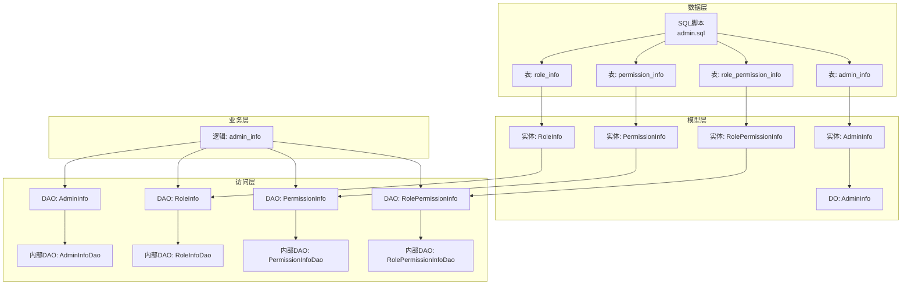
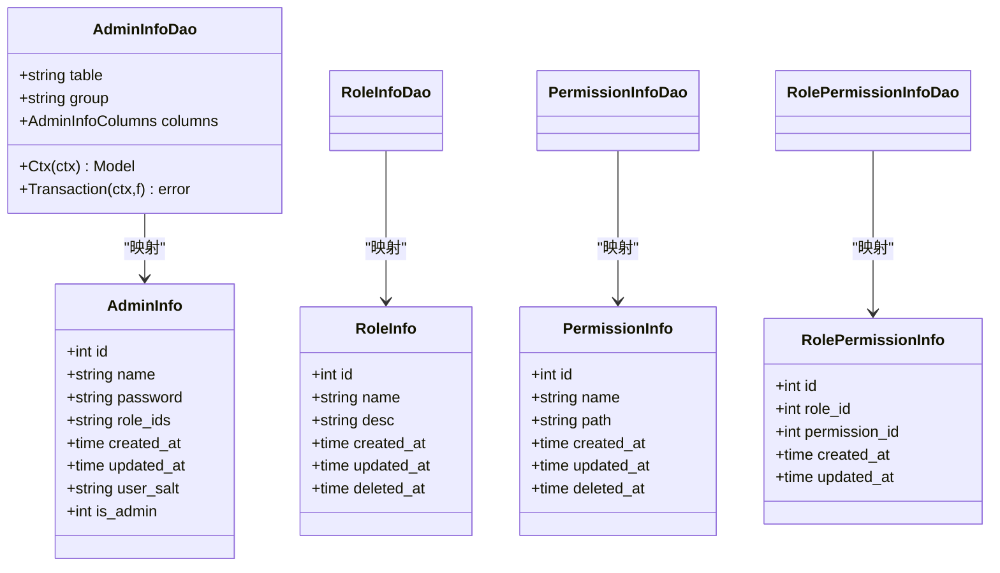
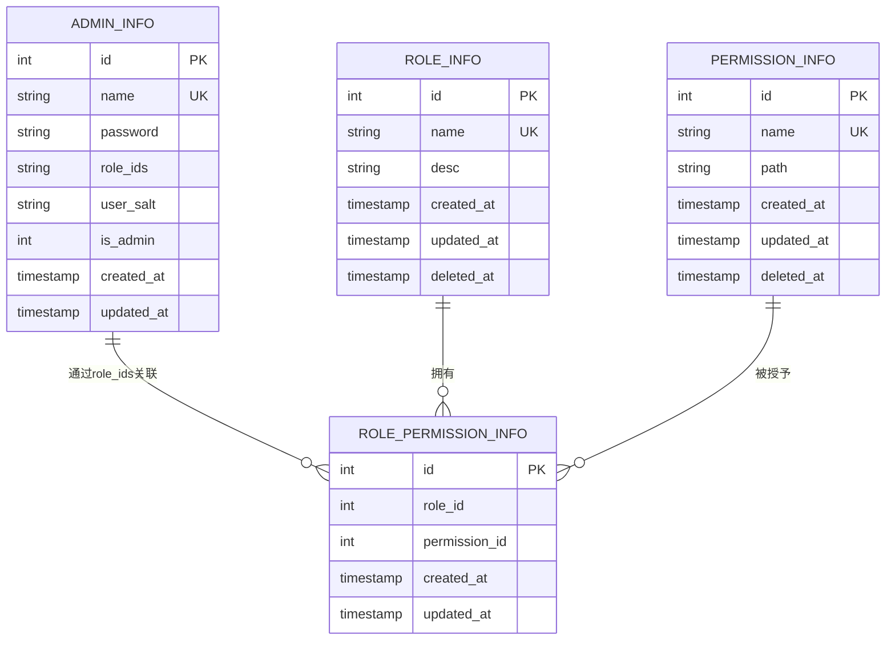
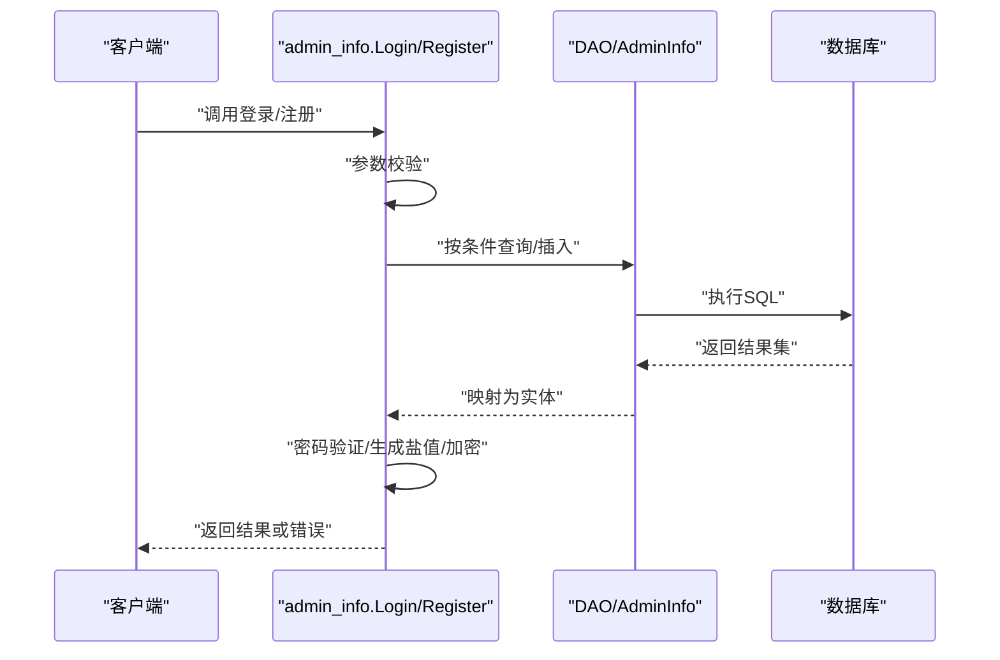
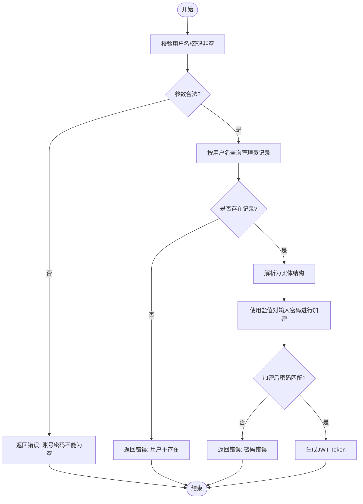
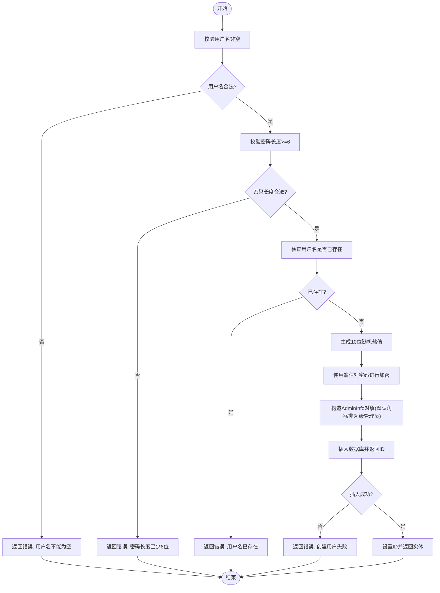
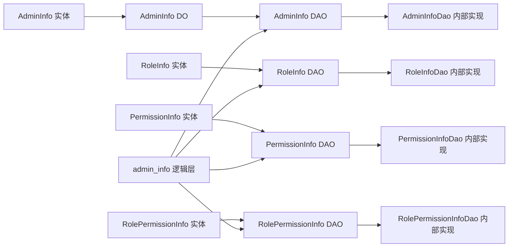

# 管理员数据模型

<cite>
**本文档引用的文件**
- [app/admin/hack/admin.sql](file://app/admin/hack/admin.sql)
- [app/admin/internal/model/entity/admin_info.go](file://app/admin/internal/model/entity/admin_info.go)
- [app/admin/internal/model/entity/permission_info.go](file://app/admin/internal/model/entity/permission_info.go)
- [app/admin/internal/model/entity/role_info.go](file://app/admin/internal/model/entity/role_info.go)
- [app/admin/internal/model/entity/role_permission_info.go](file://app/admin/internal/model/entity/role_permission_info.go)
- [app/admin/internal/model/do/admin_info.go](file://app/admin/internal/model/do/admin_info.go)
- [app/admin/internal/dao/admin_info.go](file://app/admin/internal/dao/admin_info.go)
- [app/admin/internal/dao/permission_info.go](file://app/admin/internal/dao/permission_info.go)
- [app/admin/internal/dao/role_info.go](file://app/admin/internal/dao/role_info.go)
- [app/admin/internal/dao/role_permission_info.go](file://app/admin/internal/dao/role_permission_info.go)
- [app/admin/internal/dao/internal/admin_info.go](file://app/admin/internal/dao/internal/admin_info.go)
- [app/admin/internal/dao/internal/permission_info.go](file://app/admin/internal/dao/internal/permission_info.go)
- [app/admin/internal/dao/internal/role_info.go](file://app/admin/internal/dao/internal/role_info.go)
- [app/admin/internal/dao/internal/role_permission_info.go](file://app/admin/internal/dao/internal/role_permission_info.go)
- [app/admin/internal/logic/admin_info/admin_info.go](file://app/admin/internal/logic/admin_info/admin_info.go)
</cite>

## 目录
1. [简介](#简介)
2. [项目结构](#项目结构)
3. [核心组件](#核心组件)
4. [架构总览](#架构总览)
5. [详细组件分析](#详细组件分析)
6. [依赖关系分析](#依赖关系分析)
7. [性能考虑](#性能考虑)
8. [故障排查指南](#故障排查指南)
9. [结论](#结论)
10. [附录](#附录)

## 简介
本文件系统化梳理“管理员数据模型”的完整设计与实现，覆盖以下方面：
- 数据表结构设计：字段定义、约束规则、索引策略
- 实体模型与DAO/DO模型：ORM映射、查询条件封装
- 关系模型：管理员、角色、权限三者及中间表的设计与关联
- 增删改查操作：典型流程、事务边界、错误处理
- 数据验证与业务约束：登录、注册、密码安全策略
- 使用示例与最佳实践：如何在业务中正确使用该模型

## 项目结构
管理员模块采用分层架构，按职责划分为：
- 表结构与初始化：SQL脚本定义表结构、索引与初始数据
- 实体模型：Go 结构体映射数据库表字段
- DO 模型：DAO 查询条件封装
- DAO 层：对底层数据库访问对象的轻量封装
- 内部 DAO 实现：具体表的DAO实现、列名常量、事务封装
- 逻辑层：业务流程编排（如登录、注册）

图表来源
- [app/admin/hack/admin.sql](file://app/admin/hack/admin.sql#L1-L83)
- [app/admin/internal/model/entity/admin_info.go](file://app/admin/internal/model/entity/admin_info.go#L11-L21)
- [app/admin/internal/model/entity/role_info.go](file://app/admin/internal/model/entity/role_info.go#L11-L19)
- [app/admin/internal/model/entity/permission_info.go](file://app/admin/internal/model/entity/permission_info.go#L11-L19)
- [app/admin/internal/model/entity/role_permission_info.go](file://app/admin/internal/model/entity/role_permission_info.go#L11-L18)
- [app/admin/internal/model/do/admin_info.go](file://app/admin/internal/model/do/admin_info.go#L12-L23)
- [app/admin/internal/dao/admin_info.go](file://app/admin/internal/dao/admin_info.go#L11-L22)
- [app/admin/internal/dao/role_info.go](file://app/admin/internal/dao/role_info.go#L11-L22)
- [app/admin/internal/dao/permission_info.go](file://app/admin/internal/dao/permission_info.go#L11-L22)
- [app/admin/internal/dao/role_permission_info.go](file://app/admin/internal/dao/role_permission_info.go#L11-L22)
- [app/admin/internal/dao/internal/admin_info.go](file://app/admin/internal/dao/internal/admin_info.go#L14-L94)
- [app/admin/internal/dao/internal/role_info.go](file://app/admin/internal/dao/internal/role_info.go#L14-L90)
- [app/admin/internal/dao/internal/permission_info.go](file://app/admin/internal/dao/internal/permission_info.go#L14-L90)
- [app/admin/internal/dao/internal/role_permission_info.go](file://app/admin/internal/dao/internal/role_permission_info.go#L14-L88)
- [app/admin/internal/logic/admin_info/admin_info.go](file://app/admin/internal/logic/admin_info/admin_info.go#L15-L95)

章节来源
- [app/admin/hack/admin.sql](file://app/admin/hack/admin.sql#L1-L83)
- [app/admin/internal/model/entity/admin_info.go](file://app/admin/internal/model/entity/admin_info.go#L11-L21)
- [app/admin/internal/model/entity/role_info.go](file://app/admin/internal/model/entity/role_info.go#L11-L19)
- [app/admin/internal/model/entity/permission_info.go](file://app/admin/internal/model/entity/permission_info.go#L11-L19)
- [app/admin/internal/model/entity/role_permission_info.go](file://app/admin/internal/model/entity/role_permission_info.go#L11-L18)
- [app/admin/internal/model/do/admin_info.go](file://app/admin/internal/model/do/admin_info.go#L12-L23)
- [app/admin/internal/dao/admin_info.go](file://app/admin/internal/dao/admin_info.go#L11-L22)
- [app/admin/internal/dao/role_info.go](file://app/admin/internal/dao/role_info.go#L11-L22)
- [app/admin/internal/dao/permission_info.go](file://app/admin/internal/dao/permission_info.go#L11-L22)
- [app/admin/internal/dao/role_permission_info.go](file://app/admin/internal/dao/role_permission_info.go#L11-L22)
- [app/admin/internal/dao/internal/admin_info.go](file://app/admin/internal/dao/internal/admin_info.go#L14-L94)
- [app/admin/internal/dao/internal/role_info.go](file://app/admin/internal/dao/internal/role_info.go#L14-L90)
- [app/admin/internal/dao/internal/permission_info.go](file://app/admin/internal/dao/internal/permission_info.go#L14-L90)
- [app/admin/internal/dao/internal/role_permission_info.go](file://app/admin/internal/dao/internal/role_permission_info.go#L14-L88)
- [app/admin/internal/logic/admin_info/admin_info.go](file://app/admin/internal/logic/admin_info/admin_info.go#L15-L95)

## 核心组件
- 管理员实体模型：映射 admin_info 表，包含主键、用户名、密码、盐值、角色集合、是否超级管理员、时间戳等字段
- 角色实体模型：映射 role_info 表，包含主键、名称、描述、时间戳等字段
- 权限实体模型：映射 permission_info 表，包含主键、名称、路径、时间戳等字段
- 角色-权限中间表实体模型：映射 role_permission_info 表，包含主键、角色ID、权限ID、时间戳等字段
- DO 模型：用于DAO查询条件封装，支持 Where/Fields/Data 等操作
- DAO 层：对外暴露统一的 AdminInfo/RoleInfo/PermissionInfo/RolePermissionInfo 访问对象
- 内部 DAO 实现：提供列名常量、上下文模型、事务封装、表名与分组配置
- 逻辑层：登录、注册等业务流程，包含参数校验、密码加密、JWT签发等

章节来源
- [app/admin/internal/model/entity/admin_info.go](file://app/admin/internal/model/entity/admin_info.go#L11-L21)
- [app/admin/internal/model/entity/role_info.go](file://app/admin/internal/model/entity/role_info.go#L11-L19)
- [app/admin/internal/model/entity/permission_info.go](file://app/admin/internal/model/entity/permission_info.go#L11-L19)
- [app/admin/internal/model/entity/role_permission_info.go](file://app/admin/internal/model/entity/role_permission_info.go#L11-L18)
- [app/admin/internal/model/do/admin_info.go](file://app/admin/internal/model/do/admin_info.go#L12-L23)
- [app/admin/internal/dao/admin_info.go](file://app/admin/internal/dao/admin_info.go#L11-L22)
- [app/admin/internal/dao/role_info.go](file://app/admin/internal/dao/role_info.go#L11-L22)
- [app/admin/internal/dao/permission_info.go](file://app/admin/internal/dao/permission_info.go#L11-L22)
- [app/admin/internal/dao/role_permission_info.go](file://app/admin/internal/dao/role_permission_info.go#L11-L22)
- [app/admin/internal/dao/internal/admin_info.go](file://app/admin/internal/dao/internal/admin_info.go#L14-L94)
- [app/admin/internal/dao/internal/role_info.go](file://app/admin/internal/dao/internal/role_info.go#L14-L90)
- [app/admin/internal/dao/internal/permission_info.go](file://app/admin/internal/dao/internal/permission_info.go#L14-L90)
- [app/admin/internal/dao/internal/role_permission_info.go](file://app/admin/internal/dao/internal/role_permission_info.go#L14-L88)
- [app/admin/internal/logic/admin_info/admin_info.go](file://app/admin/internal/logic/admin_info/admin_info.go#L15-L95)

## 架构总览
管理员数据模型遵循“表 → 实体 → DO → DAO → 业务逻辑”的分层设计，通过内部DAO实现统一的数据库访问能力，并在逻辑层完成业务编排。

图表来源
- [app/admin/internal/model/entity/admin_info.go](file://app/admin/internal/model/entity/admin_info.go#L11-L21)
- [app/admin/internal/model/entity/role_info.go](file://app/admin/internal/model/entity/role_info.go#L11-L19)
- [app/admin/internal/model/entity/permission_info.go](file://app/admin/internal/model/entity/permission_info.go#L11-L19)
- [app/admin/internal/model/entity/role_permission_info.go](file://app/admin/internal/model/entity/role_permission_info.go#L11-L18)
- [app/admin/internal/dao/internal/admin_info.go](file://app/admin/internal/dao/internal/admin_info.go#L14-L94)
- [app/admin/internal/dao/internal/role_info.go](file://app/admin/internal/dao/internal/role_info.go#L14-L90)
- [app/admin/internal/dao/internal/permission_info.go](file://app/admin/internal/dao/internal/permission_info.go#L14-L90)
- [app/admin/internal/dao/internal/role_permission_info.go](file://app/admin/internal/dao/internal/role_permission_info.go#L14-L88)

## 详细组件分析

### 数据表结构与字段定义
- admin_info
  - 主键：id（自增）
  - 唯一索引：name_unique（用户名唯一）
  - 字段：id、name、password、role_ids、created_at、updated_at、user_salt、is_admin
- role_info
  - 主键：id（自增）
  - 唯一索引：unique_index（角色名唯一）
  - 字段：id、name、desc、created_at、updated_at、deleted_at
- permission_info
  - 主键：id（自增）
  - 唯一索引：unique_name（权限名唯一）
  - 字段：id、name、path、created_at、updated_at、deleted_at
- role_permission_info
  - 主键：id（自增）
  - 唯一索引：unique_index（role_id, permission_id 组合唯一）
  - 字段：id、role_id、permission_id、created_at、updated_at

章节来源
- [app/admin/hack/admin.sql](file://app/admin/hack/admin.sql#L4-L16)
- [app/admin/hack/admin.sql](file://app/admin/hack/admin.sql#L29-L39)
- [app/admin/hack/admin.sql](file://app/admin/hack/admin.sql#L64-L74)
- [app/admin/hack/admin.sql](file://app/admin/hack/admin.sql#L50-L59)

### 实体模型与ORM映射
- AdminInfo：映射 admin_info 表，字段与表结构一一对应，包含时间戳与布尔型字段
- RoleInfo：映射 role_info 表，含软删除字段 deleted_at
- PermissionInfo：映射 permission_info 表，含软删除字段 deleted_at
- RolePermissionInfo：映射 role_permission_info 表，表示角色与权限的多对多关系

章节来源
- [app/admin/internal/model/entity/admin_info.go](file://app/admin/internal/model/entity/admin_info.go#L11-L21)
- [app/admin/internal/model/entity/role_info.go](file://app/admin/internal/model/entity/role_info.go#L11-L19)
- [app/admin/internal/model/entity/permission_info.go](file://app/admin/internal/model/entity/permission_info.go#L11-L19)
- [app/admin/internal/model/entity/role_permission_info.go](file://app/admin/internal/model/entity/role_permission_info.go#L11-L18)

### DO 模型与查询封装
- AdminInfo DO：用于 Where/Fields/Data 等查询条件封装，支持接口类型字段以便灵活传参
- 列名常量：在内部DAO中集中维护，避免硬编码，提升可维护性

章节来源
- [app/admin/internal/model/do/admin_info.go](file://app/admin/internal/model/do/admin_info.go#L12-L23)
- [app/admin/internal/dao/internal/admin_info.go](file://app/admin/internal/dao/internal/admin_info.go#L22-L44)

### DAO 层与内部 DAO 实现
- 外层 DAO：AdminInfo、RoleInfo、PermissionInfo、RolePermissionInfo，作为全局访问入口
- 内部 DAO：AdminInfoDao、RoleInfoDao、PermissionInfoDao、RolePermissionInfoDao，提供：
  - 表名与分组配置
  - 列名常量
  - Ctx(ctx) 返回带上下文的安全模型
  - Transaction(ctx, f) 封装事务，自动提交或回滚

章节来源
- [app/admin/internal/dao/admin_info.go](file://app/admin/internal/dao/admin_info.go#L11-L22)
- [app/admin/internal/dao/role_info.go](file://app/admin/internal/dao/role_info.go#L11-L22)
- [app/admin/internal/dao/permission_info.go](file://app/admin/internal/dao/permission_info.go#L11-L22)
- [app/admin/internal/dao/role_permission_info.go](file://app/admin/internal/dao/role_permission_info.go#L11-L22)
- [app/admin/internal/dao/internal/admin_info.go](file://app/admin/internal/dao/internal/admin_info.go#L14-L94)
- [app/admin/internal/dao/internal/role_info.go](file://app/admin/internal/dao/internal/role_info.go#L14-L90)
- [app/admin/internal/dao/internal/permission_info.go](file://app/admin/internal/dao/internal/permission_info.go#L14-L90)
- [app/admin/internal/dao/internal/role_permission_info.go](file://app/admin/internal/dao/internal/role_permission_info.go#L14-L88)

### 关系模型与外键关联
- admin_info 与 role_info：通过 admin_info.role_ids 存储角色ID集合（字符串），未建立外键约束
- role_info 与 permission_info：通过 role_permission_info 中间表建立多对多关系，唯一索引保证组合唯一性

图表来源
- [app/admin/hack/admin.sql](file://app/admin/hack/admin.sql#L4-L16)
- [app/admin/hack/admin.sql](file://app/admin/hack/admin.sql#L29-L39)
- [app/admin/hack/admin.sql](file://app/admin/hack/admin.sql#L64-L74)
- [app/admin/hack/admin.sql](file://app/admin/hack/admin.sql#L50-L59)

### 登录与注册流程（序列图）

图表来源
- [app/admin/internal/logic/admin_info/admin_info.go](file://app/admin/internal/logic/admin_info/admin_info.go#L15-L95)
- [app/admin/internal/dao/internal/admin_info.go](file://app/admin/internal/dao/internal/admin_info.go#L76-L83)

### 登录流程（算法流程图）

图表来源
- [app/admin/internal/logic/admin_info/admin_info.go](file://app/admin/internal/logic/admin_info/admin_info.go#L15-L46)

### 注册流程（算法流程图）

图表来源
- [app/admin/internal/logic/admin_info/admin_info.go](file://app/admin/internal/logic/admin_info/admin_info.go#L48-L95)

## 依赖关系分析
- DAO 层依赖内部 DAO 实现，提供统一的访问入口
- 实体模型与表结构强绑定，确保ORM映射准确
- DO 模型仅用于查询条件封装，不直接参与业务逻辑
- 逻辑层协调DAO与工具函数，完成业务编排

图表来源
- [app/admin/internal/model/entity/admin_info.go](file://app/admin/internal/model/entity/admin_info.go#L11-L21)
- [app/admin/internal/model/do/admin_info.go](file://app/admin/internal/model/do/admin_info.go#L12-L23)
- [app/admin/internal/dao/admin_info.go](file://app/admin/internal/dao/admin_info.go#L11-L22)
- [app/admin/internal/dao/internal/admin_info.go](file://app/admin/internal/dao/internal/admin_info.go#L14-L94)
- [app/admin/internal/dao/role_info.go](file://app/admin/internal/dao/role_info.go#L11-L22)
- [app/admin/internal/dao/internal/role_info.go](file://app/admin/internal/dao/internal/role_info.go#L14-L90)
- [app/admin/internal/dao/permission_info.go](file://app/admin/internal/dao/permission_info.go#L11-L22)
- [app/admin/internal/dao/internal/permission_info.go](file://app/admin/internal/dao/internal/permission_info.go#L14-L90)
- [app/admin/internal/dao/role_permission_info.go](file://app/admin/internal/dao/role_permission_info.go#L11-L22)
- [app/admin/internal/dao/internal/role_permission_info.go](file://app/admin/internal/dao/internal/role_permission_info.go#L14-L88)
- [app/admin/internal/logic/admin_info/admin_info.go](file://app/admin/internal/logic/admin_info/admin_info.go#L15-L95)

## 性能考虑
- 索引策略
  - admin_info.name 唯一索引：保障登录与查询效率
  - role_info.name 唯一索引：保障角色检索效率
  - permission_info.name 唯一索引：保障权限检索效率
  - role_permission_info(role_id, permission_id) 唯一索引：避免重复授权
- 查询优化
  - 使用 DO 模型进行条件封装，避免硬编码
  - 在高频查询场景下，优先使用唯一索引字段（如 name）
- 事务与并发
  - 使用内部 DAO 的 Transaction 封装，确保业务原子性
  - 登录/注册流程中，注意并发下的唯一性校验与插入顺序

## 故障排查指南
- 登录失败
  - 检查用户名/密码是否为空
  - 核对数据库中是否存在该用户名
  - 确认盐值与加密方式一致
- 注册失败
  - 检查用户名是否已存在
  - 校验密码长度是否满足要求
  - 查看数据库唯一索引冲突日志
- 权限/角色异常
  - 确认 role_ids 格式与中间表关联是否正确
  - 检查 role_permission_info 的唯一索引是否被破坏

章节来源
- [app/admin/internal/logic/admin_info/admin_info.go](file://app/admin/internal/logic/admin_info/admin_info.go#L15-L95)
- [app/admin/hack/admin.sql](file://app/admin/hack/admin.sql#L4-L16)
- [app/admin/hack/admin.sql](file://app/admin/hack/admin.sql#L29-L39)
- [app/admin/hack/admin.sql](file://app/admin/hack/admin.sql#L64-L74)
- [app/admin/hack/admin.sql](file://app/admin/hack/admin.sql#L50-L59)

## 结论
管理员数据模型通过清晰的分层设计与严格的索引约束，实现了管理员、角色、权限的解耦管理。实体与DAO映射明确，逻辑层封装了关键业务流程，具备良好的扩展性与可维护性。建议在后续迭代中：
- 对 admin_info.role_ids 进行规范化存储（如JSON数组或独立关联表），以提升查询与维护性
- 引入统一的鉴权中间件与权限缓存，降低频繁查询成本
- 增加审计日志与变更追踪，完善合规与可追溯性

## 附录
- 使用示例
  - 登录：调用逻辑层 Login，传入用户名与密码，返回JWT与过期时间
  - 注册：调用逻辑层 Register，传入用户名与密码，返回新创建的管理员实体
- 最佳实践
  - 所有查询均通过 DO 模型进行条件封装
  - 重要业务（如登录、注册）使用事务封装，确保原子性
  - 严格遵守唯一索引约束，避免重复数据
  - 对敏感字段（密码、盐值）进行加密与最小化暴露