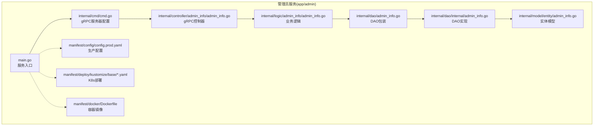
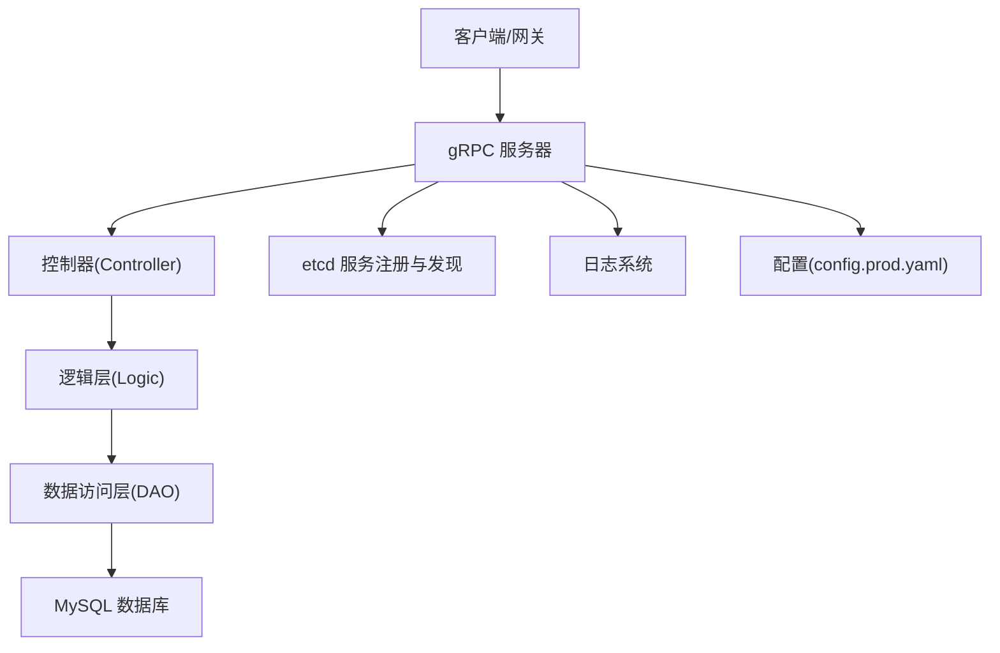
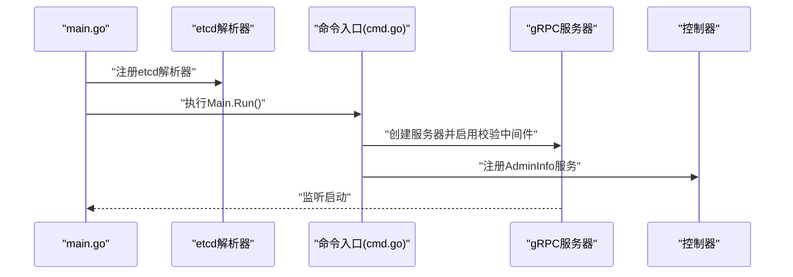
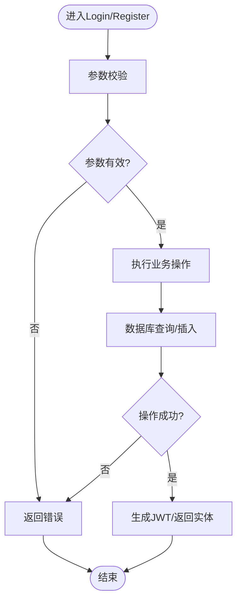
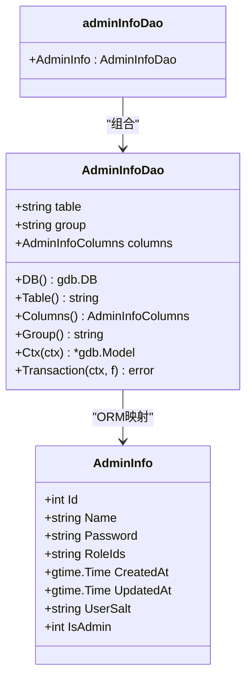
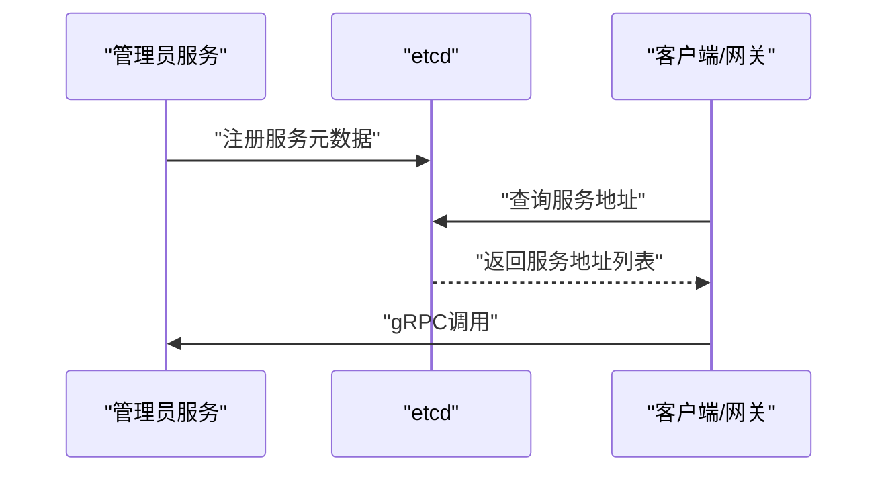
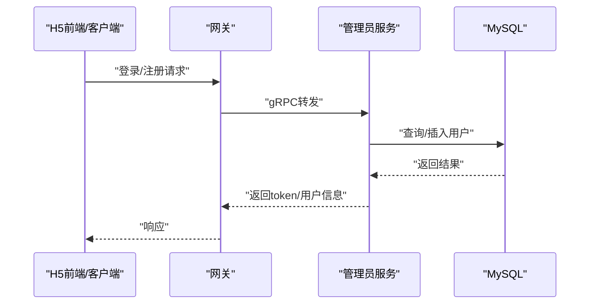
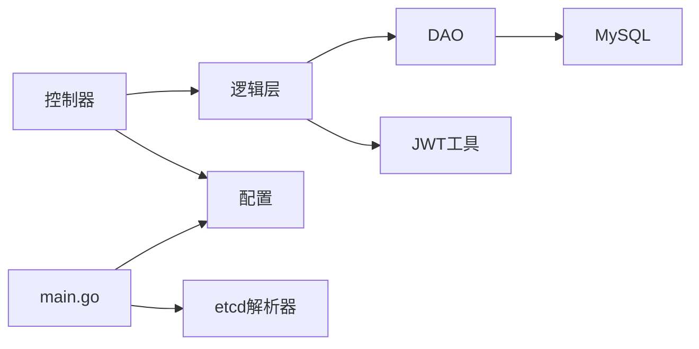

# 管理员服务概览

<cite>
**本文档引用的文件**
- [app/admin/main.go](file://app/admin/main.go)
- [app/admin/internal/cmd/cmd.go](file://app/admin/internal/cmd/cmd.go)
- [app/admin/manifest/config/config.prod.yaml](file://app/admin/manifest/config/config.prod.yaml)
- [app/admin/internal/controller/admin_info/admin_info.go](file://app/admin/internal/controller/admin_info/admin_info.go)
- [app/admin/internal/dao/admin_info.go](file://app/admin/internal/dao/admin_info.go)
- [app/admin/internal/dao/internal/admin_info.go](file://app/admin/internal/dao/internal/admin_info.go)
- [app/admin/internal/logic/admin_info/admin_info.go](file://app/admin/internal/logic/admin_info/admin_info.go)
- [app/admin/internal/model/entity/admin_info.go](file://app/admin/internal/model/entity/admin_info.go)
- [app/admin/manifest/deploy/kustomize/base/deployment.yaml](file://app/admin/manifest/deploy/kustomize/base/deployment.yaml)
- [app/admin/manifest/deploy/kustomize/base/service.yaml](file://app/admin/manifest/deploy/kustomize/base/service.yaml)
- [app/admin/manifest/docker/Dockerfile](file://app/admin/manifest/docker/Dockerfile)
- [utility/token.go](file://utility/token.go)
- [utility/middleware/jwt.go](file://utility/middleware/jwt.go)
</cite>

## 目录
1. [简介](#简介)
2. [项目结构](#项目结构)
3. [核心组件](#核心组件)
4. [架构总览](#架构总览)
5. [详细组件分析](#详细组件分析)
6. [依赖关系分析](#依赖关系分析)
7. [性能考虑](#性能考虑)
8. [故障排除指南](#故障排除指南)
9. [结论](#结论)
10. [附录](#附录)

## 简介
管理员服务是一个基于 GoFrame 框架构建的微服务模块，专注于后台管理用户的认证与授权能力。该服务通过 gRPC 提供登录与注册接口，采用 JWT 进行身份令牌签发，并通过 etcd 实现服务注册与发现。服务采用分层架构（控制器、逻辑层、数据访问层、实体模型），结合 Kustomize 进行 Kubernetes 部署，支持容器化与云原生编排。

## 项目结构
管理员服务遵循典型的 GoFrame 单体仓库风格，按功能域划分目录：
- app/admin：服务主体代码
  - api：gRPC 接口定义与生成代码
  - internal：内部实现
    - cmd：命令入口与 gRPC 服务器配置
    - controller：gRPC 控制器，负责请求处理与响应封装
    - dao：数据访问对象，封装数据库操作
    - logic：业务逻辑层，处理登录、注册等核心业务
    - model：实体模型与 DO 结构
    - packed：打包资源
  - manifest：部署与配置
    - config：生产配置（gRPC、数据库、etcd）
    - deploy/kustomize：Kubernetes 部署清单
    - docker：Dockerfile
  - hack：辅助脚本与 SQL 初始化
  - main.go：服务启动入口
  - Makefile、README.MD、go.mod 等

**图表来源**
- [app/admin/main.go](file://app/admin/main.go#L1-L25)
- [app/admin/internal/cmd/cmd.go](file://app/admin/internal/cmd/cmd.go#L1-L30)
- [app/admin/internal/controller/admin_info/admin_info.go](file://app/admin/internal/controller/admin_info/admin_info.go#L1-L73)
- [app/admin/internal/logic/admin_info/admin_info.go](file://app/admin/internal/logic/admin_info/admin_info.go#L1-L96)
- [app/admin/internal/dao/admin_info.go](file://app/admin/internal/dao/admin_info.go#L1-L23)
- [app/admin/internal/dao/internal/admin_info.go](file://app/admin/internal/dao/internal/admin_info.go#L1-L94)
- [app/admin/internal/model/entity/admin_info.go](file://app/admin/internal/model/entity/admin_info.go#L1-L22)
- [app/admin/manifest/config/config.prod.yaml](file://app/admin/manifest/config/config.prod.yaml#L1-L22)
- [app/admin/manifest/deploy/kustomize/base/deployment.yaml](file://app/admin/manifest/deploy/kustomize/base/deployment.yaml#L1-L22)
- [app/admin/manifest/deploy/kustomize/base/service.yaml](file://app/admin/manifest/deploy/kustomize/base/service.yaml#L1-L13)
- [app/admin/manifest/docker/Dockerfile](file://app/admin/manifest/docker/Dockerfile#L1-L17)

**章节来源**
- [app/admin/main.go](file://app/admin/main.go#L1-L25)
- [app/admin/internal/cmd/cmd.go](file://app/admin/internal/cmd/cmd.go#L1-L30)
- [app/admin/manifest/config/config.prod.yaml](file://app/admin/manifest/config/config.prod.yaml#L1-L22)

## 核心组件
- 服务入口与注册发现
  - main.go 读取 etcd 地址并注册 etcd 作为 gRPC 解析器，随后启动命令入口
  - 命令入口初始化 gRPC 服务器，启用统一的请求校验中间件，注册控制器并启动监听
- 控制器层
  - 提供 Login 与 Register 两个 gRPC 方法，调用逻辑层完成业务处理，并进行错误包装与响应构造
- 逻辑层
  - Login：参数校验、查询用户、密码验证、JWT 签发
  - Register：参数校验、用户名重复检查、盐值生成与双重 MD5 加密、持久化并返回实体
- 数据访问层
  - DAO 包装与内部 DAO 实现，提供表级操作、事务封装、列名常量等
- 实体模型
  - 定义 admin_info 表对应的结构体，包含字段映射与注释
- 配置与部署
  - 生产配置包含 gRPC 名称、地址、日志、数据库连接与 etcd 地址
  - Kustomize 部署清单定义 Deployment 与 Service，Dockerfile 定义容器镜像构建

**章节来源**
- [app/admin/main.go](file://app/admin/main.go#L13-L24)
- [app/admin/internal/cmd/cmd.go](file://app/admin/internal/cmd/cmd.go#L16-L27)
- [app/admin/internal/controller/admin_info/admin_info.go](file://app/admin/internal/controller/admin_info/admin_info.go#L23-L72)
- [app/admin/internal/logic/admin_info/admin_info.go](file://app/admin/internal/logic/admin_info/admin_info.go#L15-L95)
- [app/admin/internal/dao/admin_info.go](file://app/admin/internal/dao/admin_info.go#L11-L22)
- [app/admin/internal/dao/internal/admin_info.go](file://app/admin/internal/dao/internal/admin_info.go#L14-L93)
- [app/admin/internal/model/entity/admin_info.go](file://app/admin/internal/model/entity/admin_info.go#L11-L21)
- [app/admin/manifest/config/config.prod.yaml](file://app/admin/manifest/config/config.prod.yaml#L1-L22)

## 架构总览
管理员服务采用分层架构与微服务设计理念：
- 控制器层负责 gRPC 接口暴露与请求/响应转换
- 逻辑层封装业务规则与安全策略（密码加密、JWT 签发）
- DAO 层抽象数据库访问，提供事务与上下文支持
- 配置驱动：通过 YAML 配置 gRPC、数据库与 etcd
- 注册发现：通过 etcd 作为服务解析器，实现服务间通信
- 部署：Kubernetes + Kustomize，容器化运行

**图表来源**
- [app/admin/internal/cmd/cmd.go](file://app/admin/internal/cmd/cmd.go#L16-L27)
- [app/admin/internal/controller/admin_info/admin_info.go](file://app/admin/internal/controller/admin_info/admin_info.go#L19-L21)
- [app/admin/internal/logic/admin_info/admin_info.go](file://app/admin/internal/logic/admin_info/admin_info.go#L15-L46)
- [app/admin/internal/dao/internal/admin_info.go](file://app/admin/internal/dao/internal/admin_info.go#L76-L83)
- [app/admin/manifest/config/config.prod.yaml](file://app/admin/manifest/config/config.prod.yaml#L15-L21)
- [app/admin/main.go](file://app/admin/main.go#L21-L21)

## 详细组件分析

### 组件A：服务启动流程与配置管理
- 启动流程
  - main.go 读取 etcd 地址，注册 etcd 为 gRPC 解析器
  - 调用命令入口 Main.Run，初始化 gRPC 服务器配置，启用统一校验中间件，注册控制器并启动
- 配置管理
  - gRPC：名称、监听地址、日志路径与级别、stdout 输出、轮转大小与备份数、上下文键、时间格式
  - 数据库：默认连接组，MySQL 连接串，调试开关
  - etcd：服务解析地址

**图表来源**
- [app/admin/main.go](file://app/admin/main.go#L13-L24)
- [app/admin/internal/cmd/cmd.go](file://app/admin/internal/cmd/cmd.go#L16-L27)
- [app/admin/internal/controller/admin_info/admin_info.go](file://app/admin/internal/controller/admin_info/admin_info.go#L19-L21)

**章节来源**
- [app/admin/main.go](file://app/admin/main.go#L13-L24)
- [app/admin/internal/cmd/cmd.go](file://app/admin/internal/cmd/cmd.go#L16-L27)
- [app/admin/manifest/config/config.prod.yaml](file://app/admin/manifest/config/config.prod.yaml#L1-L22)

### 组件B：登录与注册流程
- 登录(Login)
  - 参数校验 → 查询用户 → 密码验证（双重MD5 + 盐值）→ 生成JWT（含过期时间）→ 返回token与过期时间
- 注册(Register)
  - 参数校验 → 检查用户名重复 → 生成盐值 → 双重MD5加密 → 插入数据库 → 返回实体信息

**图表来源**
- [app/admin/internal/logic/admin_info/admin_info.go](file://app/admin/internal/logic/admin_info/admin_info.go#L15-L95)

**章节来源**
- [app/admin/internal/controller/admin_info/admin_info.go](file://app/admin/internal/controller/admin_info/admin_info.go#L23-L72)
- [app/admin/internal/logic/admin_info/admin_info.go](file://app/admin/internal/logic/admin_info/admin_info.go#L15-L95)
- [utility/token.go](file://utility/token.go#L20-L50)

### 组件C：数据访问层与实体模型
- DAO 包装
  - adminInfoDao 对 internal.AdminInfoDao 进行封装，提供全局实例 AdminInfo
- DAO 实现
  - AdminInfoDao 提供表名、列名常量、上下文模型、事务封装等
- 实体模型
  - AdminInfo 映射 admin_info 表字段，包含用户名、密码、盐值、角色ID、创建/更新时间等

**图表来源**
- [app/admin/internal/dao/internal/admin_info.go](file://app/admin/internal/dao/internal/admin_info.go#L14-L93)
- [app/admin/internal/dao/admin_info.go](file://app/admin/internal/dao/admin_info.go#L11-L22)
- [app/admin/internal/model/entity/admin_info.go](file://app/admin/internal/model/entity/admin_info.go#L11-L21)

**章节来源**
- [app/admin/internal/dao/admin_info.go](file://app/admin/internal/dao/admin_info.go#L11-L22)
- [app/admin/internal/dao/internal/admin_info.go](file://app/admin/internal/dao/internal/admin_info.go#L14-L93)
- [app/admin/internal/model/entity/admin_info.go](file://app/admin/internal/model/entity/admin_info.go#L11-L21)

### 组件D：服务注册与发现机制
- 通过 etcd 作为 gRPC 解析器，main.go 在启动时读取配置中的 etcd 地址并注册解析器
- 服务端通过 gRPC 服务器暴露服务，客户端通过 etcd 解析服务地址进行调用

**图表来源**
- [app/admin/main.go](file://app/admin/main.go#L15-L21)

**章节来源**
- [app/admin/main.go](file://app/admin/main.go#L15-L21)
- [app/admin/manifest/config/config.prod.yaml](file://app/admin/manifest/config/config.prod.yaml#L20-L21)

### 组件E：与微服务模块的交互关系与数据流转
- 与网关的关系
  - 管理员服务通过 gRPC 对外提供登录与注册能力，网关可作为统一入口转发请求
- 与用户服务的关系
  - 用户服务提供用户相关接口，管理员服务关注后台管理用户；两者通过独立的服务边界协作
- 数据流转
  - 登录：客户端 → 网关 → 管理员服务 → 数据库查询 → JWT 返回
  - 注册：客户端 → 网关 → 管理员服务 → 生成盐值与加密 → 写入数据库 → 返回实体

**图表来源**
- [app/admin/internal/controller/admin_info/admin_info.go](file://app/admin/internal/controller/admin_info/admin_info.go#L23-L72)
- [app/admin/internal/logic/admin_info/admin_info.go](file://app/admin/internal/logic/admin_info/admin_info.go#L15-L95)
- [app/admin/internal/dao/internal/admin_info.go](file://app/admin/internal/dao/internal/admin_info.go#L76-L83)

**章节来源**
- [app/admin/internal/controller/admin_info/admin_info.go](file://app/admin/internal/controller/admin_info/admin_info.go#L23-L72)
- [app/admin/internal/logic/admin_info/admin_info.go](file://app/admin/internal/logic/admin_info/admin_info.go#L15-L95)

## 依赖关系分析
- 组件耦合
  - 控制器依赖逻辑层；逻辑层依赖 DAO；DAO 依赖数据库；控制器与逻辑层均依赖配置与工具函数
- 外部依赖
  - etcd：服务注册与发现
  - MySQL：持久化存储
  - JWT：身份令牌
- 潜在循环依赖
  - 当前结构清晰，未见循环导入

**图表来源**
- [app/admin/internal/controller/admin_info/admin_info.go](file://app/admin/internal/controller/admin_info/admin_info.go#L1-L13)
- [app/admin/internal/logic/admin_info/admin_info.go](file://app/admin/internal/logic/admin_info/admin_info.go#L1-L13)
- [app/admin/internal/dao/internal/admin_info.go](file://app/admin/internal/dao/internal/admin_info.go#L1-L12)
- [app/admin/main.go](file://app/admin/main.go#L1-L11)
- [utility/token.go](file://utility/token.go#L1-L8)

**章节来源**
- [app/admin/internal/controller/admin_info/admin_info.go](file://app/admin/internal/controller/admin_info/admin_info.go#L1-L13)
- [app/admin/internal/logic/admin_info/admin_info.go](file://app/admin/internal/logic/admin_info/admin_info.go#L1-L13)
- [app/admin/internal/dao/internal/admin_info.go](file://app/admin/internal/dao/internal/admin_info.go#L1-L12)
- [app/admin/main.go](file://app/admin/main.go#L1-L11)
- [utility/token.go](file://utility/token.go#L1-L8)

## 性能考虑
- 日志轮转与输出
  - 配置中设置日志轮转大小与备份数量，避免单文件过大影响性能
- 数据库连接
  - 使用连接池与事务封装，减少连接开销；注意高并发下的锁竞争
- JWT 签发
  - 本地签发，避免额外网络调用；建议在网关层集中鉴权以减少重复计算
- etcd 解析
  - 合理设置解析器与客户端缓存，降低服务发现延迟

[本节为通用指导，无需具体文件分析]

## 故障排除指南
- 登录失败
  - 检查用户名是否存在、密码是否正确（双重MD5 + 盐值）、数据库连接是否正常
- 注册失败
  - 检查用户名是否重复、密码长度是否满足要求、盐值生成与加密流程是否异常
- JWT 无效
  - 检查签名密钥、过期时间、客户端是否携带正确的 Authorization 头
- 服务无法发现
  - 检查 etcd 地址配置、服务是否正确注册、客户端解析器是否启用

**章节来源**
- [app/admin/internal/logic/admin_info/admin_info.go](file://app/admin/internal/logic/admin_info/admin_info.go#L15-L95)
- [utility/token.go](file://utility/token.go#L52-L64)
- [utility/middleware/jwt.go](file://utility/middleware/jwt.go#L16-L38)

## 结论
管理员服务通过清晰的分层架构与配置驱动，提供了稳定的后台管理用户认证能力。结合 etcd 的服务注册与发现、Kubernetes 的容器化部署以及 JWT 的轻量鉴权，能够满足微服务场景下的安全与可扩展需求。建议在生产环境中进一步完善监控与告警体系，并对数据库与 etcd 进行高可用部署。

[本节为总结性内容，无需具体文件分析]

## 附录

### 部署架构与运行环境要求
- 运行环境
  - 支持容器化运行，镜像由 Dockerfile 定义
  - 依赖 etcd 与 MySQL，需确保网络连通
- 部署方式
  - 使用 Kustomize 管理 Kubernetes 清单，定义 Deployment 与 Service
  - 通过 overlays/develop 或其他环境覆盖进行差异化配置

**章节来源**
- [app/admin/manifest/docker/Dockerfile](file://app/admin/manifest/docker/Dockerfile#L1-L17)
- [app/admin/manifest/deploy/kustomize/base/deployment.yaml](file://app/admin/manifest/deploy/kustomize/base/deployment.yaml#L1-L22)
- [app/admin/manifest/deploy/kustomize/base/service.yaml](file://app/admin/manifest/deploy/kustomize/base/service.yaml#L1-L13)

### 基本使用指南
- 启动服务
  - 确保 etcd 与 MySQL 正常运行
  - 执行命令入口，服务将根据配置启动 gRPC 服务器
- 调用接口
  - 通过 gRPC 客户端调用 Login 与 Register 接口
  - 登录成功后使用返回的 token 进行后续鉴权

**章节来源**
- [app/admin/internal/cmd/cmd.go](file://app/admin/internal/cmd/cmd.go#L16-L27)
- [app/admin/internal/controller/admin_info/admin_info.go](file://app/admin/internal/controller/admin_info/admin_info.go#L23-L72)