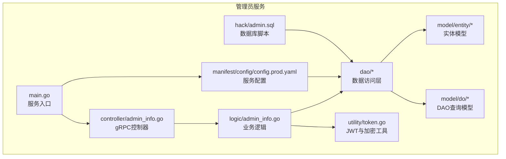
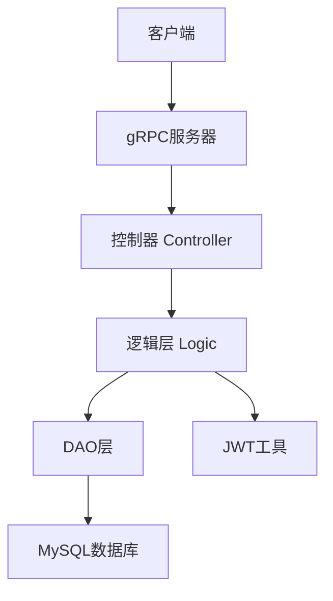
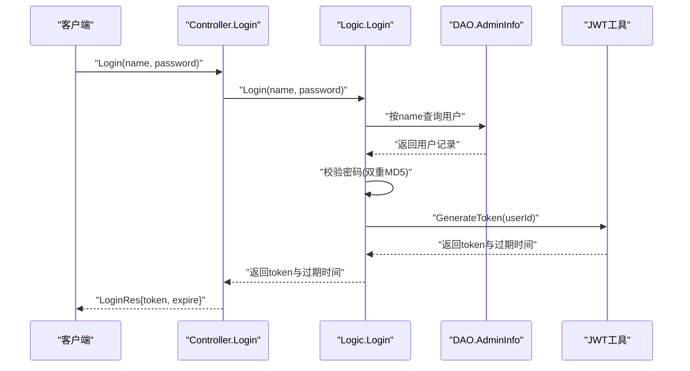
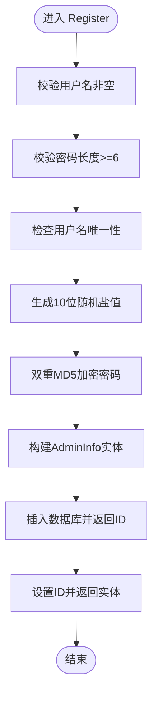
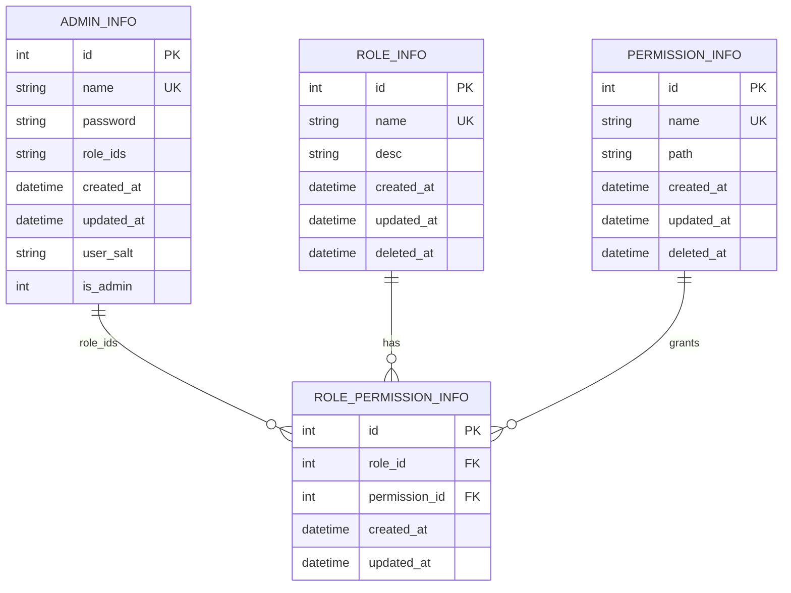
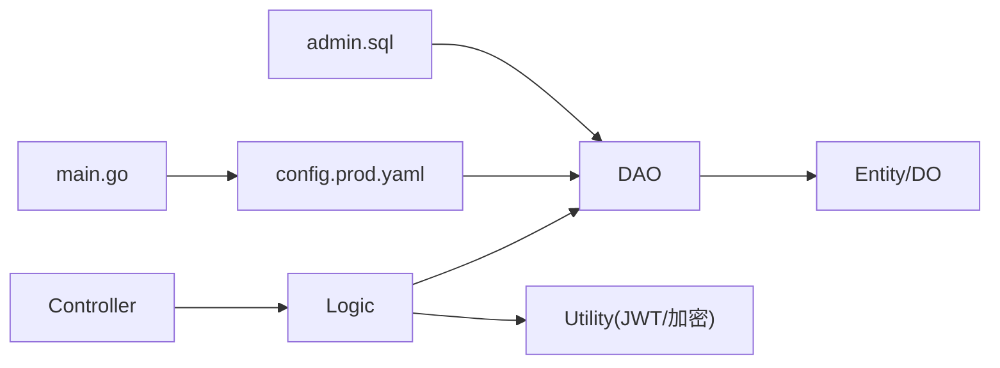

# 管理员服务模块

<cite>
**本文档引用的文件**
- [app/admin/main.go](file://app/admin/main.go)
- [app/admin/README.MD](file://app/admin/README.MD)
- [app/admin/internal/controller/admin_info/admin_info.go](file://app/admin/internal/controller/admin_info/admin_info.go)
- [app/admin/internal/logic/admin_info/admin_info.go](file://app/admin/internal/logic/admin_info/admin_info.go)
- [app/admin/internal/model/entity/admin_info.go](file://app/admin/internal/model/entity/admin_info.go)
- [app/admin/internal/model/do/admin_info.go](file://app/admin/internal/model/do/admin_info.go)
- [app/admin/internal/dao/admin_info.go](file://app/admin/internal/dao/admin_info.go)
- [app/admin/internal/dao/internal/admin_info.go](file://app/admin/internal/dao/internal/admin_info.go)
- [app/admin/internal/dao/internal/permission_info.go](file://app/admin/internal/dao/internal/permission_info.go)
- [app/admin/internal/dao/internal/role_info.go](file://app/admin/internal/dao/internal/role_info.go)
- [app/admin/internal/dao/internal/role_permission_info.go](file://app/admin/internal/dao/internal/role_permission_info.go)
- [utility/token.go](file://utility/token.go)
- [utility/consts/consts.go](file://utility/consts/consts.go)
- [app/admin/manifest/config/config.prod.yaml](file://app/admin/manifest/config/config.prod.yaml)
- [app/admin/hack/admin.sql](file://app/admin/hack/admin.sql)
</cite>

## 目录
1. [简介](#简介)
2. [项目结构](#项目结构)
3. [核心组件](#核心组件)
4. [架构总览](#架构总览)
5. [详细组件分析](#详细组件分析)
6. [依赖关系分析](#依赖关系分析)
7. [性能考虑](#性能考虑)
8. [故障排除指南](#故障排除指南)
9. [结论](#结论)
10. [附录](#附录)

## 简介
本文件面向管理员服务模块，系统化阐述其架构设计与管理功能实现，重点覆盖管理员账户管理、权限控制、角色管理等核心能力；同时解释数据模型设计、权限验证机制、操作日志记录等技术实现，并提供管理员服务的API接口规范、安全策略与配置选项。该服务基于GoFrame框架与gRPC，采用分层架构：控制器(Controller)、逻辑层(Logic)、数据访问对象(DAO)与实体(Entity)，并通过JWT进行认证授权。

## 项目结构
管理员服务位于独立的应用目录中，遵循“单体仓库”下的微服务拆分方式。核心目录与职责如下：
- app/admin/main.go：服务入口，初始化etcd注册中心与gRPC服务器。
- app/admin/internal/controller/admin_info/admin_info.go：gRPC控制器，暴露登录、注册等接口。
- app/admin/internal/logic/admin_info/admin_info.go：业务逻辑层，实现登录、注册、密码加密与JWT签发。
- app/admin/internal/dao/*：DAO层，封装数据库访问与事务处理。
- app/admin/internal/model/entity/* 与 app/admin/internal/model/do/*：数据模型与DAO查询结构。
- utility/token.go：JWT工具，提供签名、解析、盐值生成与密码双重MD5加密。
- app/admin/manifest/config/config.prod.yaml：服务配置，包括gRPC地址、日志、数据库连接与etcd地址。
- app/admin/hack/admin.sql：数据库初始化脚本，包含管理员表、角色表、权限表及关联表。

**图表来源**
- [app/admin/main.go](file://app/admin/main.go#L1-L25)
- [app/admin/internal/controller/admin_info/admin_info.go](file://app/admin/internal/controller/admin_info/admin_info.go#L1-L73)
- [app/admin/internal/logic/admin_info/admin_info.go](file://app/admin/internal/logic/admin_info/admin_info.go#L1-L96)
- [app/admin/internal/dao/admin_info.go](file://app/admin/internal/dao/admin_info.go#L1-L23)
- [app/admin/internal/model/entity/admin_info.go](file://app/admin/internal/model/entity/admin_info.go#L1-L22)
- [app/admin/internal/model/do/admin_info.go](file://app/admin/internal/model/do/admin_info.go#L1-L24)
- [utility/token.go](file://utility/token.go#L1-L65)
- [app/admin/manifest/config/config.prod.yaml](file://app/admin/manifest/config/config.prod.yaml#L1-L22)
- [app/admin/hack/admin.sql](file://app/admin/hack/admin.sql#L1-L83)

**章节来源**
- [app/admin/main.go](file://app/admin/main.go#L1-L25)
- [app/admin/README.MD](file://app/admin/README.MD#L1-L4)
- [app/admin/manifest/config/config.prod.yaml](file://app/admin/manifest/config/config.prod.yaml#L1-L22)

## 核心组件
- 控制器(Controller)：负责接收gRPC请求，调用逻辑层并组装响应，同时进行基础参数校验与错误包装。
- 逻辑层(Logic)：实现核心业务规则，如登录验证、注册流程、密码加密、JWT签发与过期时间设置。
- DAO层：封装数据库访问、事务处理与上下文传递，提供统一的数据操作接口。
- 实体与查询模型：定义表结构映射与DAO查询条件，确保类型安全与可维护性。
- JWT与加密工具：提供盐值生成、双重MD5密码加密、JWT签发与解析，保障认证与数据安全。
- 配置与脚本：通过配置文件定义gRPC、日志、数据库与etcd，通过SQL脚本初始化表结构与初始数据。

**章节来源**
- [app/admin/internal/controller/admin_info/admin_info.go](file://app/admin/internal/controller/admin_info/admin_info.go#L1-L73)
- [app/admin/internal/logic/admin_info/admin_info.go](file://app/admin/internal/logic/admin_info/admin_info.go#L1-L96)
- [app/admin/internal/dao/admin_info.go](file://app/admin/internal/dao/admin_info.go#L1-L23)
- [app/admin/internal/model/entity/admin_info.go](file://app/admin/internal/model/entity/admin_info.go#L1-L22)
- [app/admin/internal/model/do/admin_info.go](file://app/admin/internal/model/do/admin_info.go#L1-L24)
- [utility/token.go](file://utility/token.go#L1-L65)

## 架构总览
管理员服务采用典型的三层架构与gRPC通信：
- 表现层：gRPC控制器，提供登录、注册等接口。
- 业务层：逻辑层处理业务规则与安全策略。
- 数据层：DAO层抽象数据库访问，实体与查询模型保证类型安全。

**图表来源**
- [app/admin/internal/controller/admin_info/admin_info.go](file://app/admin/internal/controller/admin_info/admin_info.go#L1-L73)
- [app/admin/internal/logic/admin_info/admin_info.go](file://app/admin/internal/logic/admin_info/admin_info.go#L1-L96)
- [app/admin/internal/dao/internal/admin_info.go](file://app/admin/internal/dao/internal/admin_info.go#L1-L94)
- [utility/token.go](file://utility/token.go#L1-L65)

## 详细组件分析

### 登录认证流程
管理员登录流程包含参数校验、用户查询、密码验证与JWT签发，最终返回token与过期时间。

**图表来源**
- [app/admin/internal/controller/admin_info/admin_info.go](file://app/admin/internal/controller/admin_info/admin_info.go#L23-L44)
- [app/admin/internal/logic/admin_info/admin_info.go](file://app/admin/internal/logic/admin_info/admin_info.go#L15-L46)
- [app/admin/internal/dao/internal/admin_info.go](file://app/admin/internal/dao/internal/admin_info.go#L76-L83)
- [utility/token.go](file://utility/token.go#L32-L50)

**章节来源**
- [app/admin/internal/controller/admin_info/admin_info.go](file://app/admin/internal/controller/admin_info/admin_info.go#L23-L44)
- [app/admin/internal/logic/admin_info/admin_info.go](file://app/admin/internal/logic/admin_info/admin_info.go#L15-L46)

### 注册流程
管理员注册流程包含参数校验、用户名唯一性检查、盐值生成、双重MD5加密与持久化。

**图表来源**
- [app/admin/internal/logic/admin_info/admin_info.go](file://app/admin/internal/logic/admin_info/admin_info.go#L48-L95)

**章节来源**
- [app/admin/internal/logic/admin_info/admin_info.go](file://app/admin/internal/logic/admin_info/admin_info.go#L48-L95)

### 数据模型与DAO层
管理员服务涉及四个核心表：管理员表、角色表、权限表与角色-权限关联表。DAO层提供统一的上下文模型与事务封装。

**图表来源**
- [app/admin/hack/admin.sql](file://app/admin/hack/admin.sql#L4-L83)
- [app/admin/internal/model/entity/admin_info.go](file://app/admin/internal/model/entity/admin_info.go#L12-L21)
- [app/admin/internal/dao/internal/role_info.go](file://app/admin/internal/dao/internal/role_info.go#L14-L40)
- [app/admin/internal/dao/internal/permission_info.go](file://app/admin/internal/dao/internal/permission_info.go#L14-L40)
- [app/admin/internal/dao/internal/role_permission_info.go](file://app/admin/internal/dao/internal/role_permission_info.go#L14-L38)

**章节来源**
- [app/admin/hack/admin.sql](file://app/admin/hack/admin.sql#L1-L83)
- [app/admin/internal/model/entity/admin_info.go](file://app/admin/internal/model/entity/admin_info.go#L1-L22)
- [app/admin/internal/dao/internal/admin_info.go](file://app/admin/internal/dao/internal/admin_info.go#L1-L94)
- [app/admin/internal/dao/internal/role_info.go](file://app/admin/internal/dao/internal/role_info.go#L1-L90)
- [app/admin/internal/dao/internal/permission_info.go](file://app/admin/internal/dao/internal/permission_info.go#L1-L90)
- [app/admin/internal/dao/internal/role_permission_info.go](file://app/admin/internal/dao/internal/role_permission_info.go#L1-L88)

### 权限验证与角色管理
当前代码主要实现了管理员登录与注册，以及基础的实体与DAO层。权限验证与角色管理在DAO层已有基础表结构支持，但具体业务逻辑（如根据角色加载权限、鉴权中间件等）尚未在控制器或逻辑层体现。建议后续扩展：
- 在逻辑层增加角色与权限查询方法，结合JWT中的用户标识进行权限匹配。
- 在控制器层增加鉴权中间件，拦截未授权请求。
- 提供角色与权限的增删改查接口，完善RBAC体系。

**章节来源**
- [app/admin/internal/dao/internal/role_info.go](file://app/admin/internal/dao/internal/role_info.go#L1-L90)
- [app/admin/internal/dao/internal/permission_info.go](file://app/admin/internal/dao/internal/permission_info.go#L1-L90)
- [app/admin/internal/dao/internal/role_permission_info.go](file://app/admin/internal/dao/internal/role_permission_info.go#L1-L88)

## 依赖关系分析
管理员服务模块的依赖关系清晰，遵循分层解耦原则：
- 控制器依赖逻辑层；逻辑层依赖DAO与工具库；DAO依赖数据库配置与实体模型。
- 配置文件驱动数据库连接与日志输出；SQL脚本提供初始数据与表结构。

**图表来源**
- [app/admin/internal/controller/admin_info/admin_info.go](file://app/admin/internal/controller/admin_info/admin_info.go#L1-L73)
- [app/admin/internal/logic/admin_info/admin_info.go](file://app/admin/internal/logic/admin_info/admin_info.go#L1-L96)
- [app/admin/internal/dao/admin_info.go](file://app/admin/internal/dao/admin_info.go#L1-L23)
- [utility/token.go](file://utility/token.go#L1-L65)
- [app/admin/manifest/config/config.prod.yaml](file://app/admin/manifest/config/config.prod.yaml#L1-L22)
- [app/admin/hack/admin.sql](file://app/admin/hack/admin.sql#L1-L83)

**章节来源**
- [app/admin/internal/controller/admin_info/admin_info.go](file://app/admin/internal/controller/admin_info/admin_info.go#L1-L73)
- [app/admin/internal/logic/admin_info/admin_info.go](file://app/admin/internal/logic/admin_info/admin_info.go#L1-L96)
- [app/admin/internal/dao/admin_info.go](file://app/admin/internal/dao/admin_info.go#L1-L23)
- [utility/token.go](file://utility/token.go#L1-L65)
- [app/admin/manifest/config/config.prod.yaml](file://app/admin/manifest/config/config.prod.yaml#L1-L22)
- [app/admin/hack/admin.sql](file://app/admin/hack/admin.sql#L1-L83)

## 性能考虑
- 数据库连接：通过配置文件集中管理数据库连接，建议开启连接池与慢查询日志，避免长事务与阻塞。
- JWT开销：签发与解析JWT为轻量操作，建议在高并发场景下缓存热点用户信息，减少重复查询。
- 日志级别：生产环境建议调整日志级别与轮转策略，避免磁盘IO瓶颈。
- 网络与注册中心：gRPC与etcd的连接应具备重试与熔断策略，提升可用性。

[本节为通用指导，无需列出具体文件来源]

## 故障排除指南
- 登录失败：检查用户名是否存在、密码是否正确（双重MD5加密）、数据库连接是否正常。
- 注册失败：确认用户名唯一性、密码长度校验、盐值生成与加密流程是否正确。
- JWT解析异常：核对签名密钥、过期时间与客户端时间同步。
- 数据库错误：查看配置文件中的连接串、日志路径与备份限制，定位具体SQL错误。

**章节来源**
- [app/admin/internal/logic/admin_info/admin_info.go](file://app/admin/internal/logic/admin_info/admin_info.go#L15-L46)
- [app/admin/internal/logic/admin_info/admin_info.go](file://app/admin/internal/logic/admin_info/admin_info.go#L48-L95)
- [utility/token.go](file://utility/token.go#L52-L64)
- [app/admin/manifest/config/config.prod.yaml](file://app/admin/manifest/config/config.prod.yaml#L15-L21)

## 结论
管理员服务模块以清晰的分层架构实现了登录与注册两大核心功能，并提供了完善的实体与DAO层支撑。通过JWT实现认证与授权，配合配置文件与SQL脚本，能够快速部署与扩展。建议后续补充角色与权限的完整RBAC实现，增强系统的安全性与可维护性。

[本节为总结性内容，无需列出具体文件来源]

## 附录

### API接口规范（基于现有实现）
- 登录接口
  - 方法：POST /admin_info.v1.AdminInfo/Login
  - 请求：AdminInfoLoginReq{name, password}
  - 响应：AdminInfoLoginRes{token, expire}
  - 错误：包装统一错误码与错误信息
- 注册接口
  - 方法：POST /admin_info.v1.AdminInfo/Register
  - 请求：AdminInfoRegisterReq{name, password}
  - 响应：AdminInfoRegisterRes{id, name, roleIds, isAdmin, createdAt}
  - 错误：包装统一错误码与错误信息

**章节来源**
- [app/admin/internal/controller/admin_info/admin_info.go](file://app/admin/internal/controller/admin_info/admin_info.go#L19-L72)

### 安全策略
- 密码安全：采用10位随机盐值与双重MD5加密，降低明文泄露风险。
- 令牌安全：使用JWT，24小时有效期，密钥固定于工具库，建议在生产环境替换为安全存储。
- 日志安全：生产环境建议脱敏敏感字段，限制日志输出级别与保留周期。

**章节来源**
- [app/admin/internal/logic/admin_info/admin_info.go](file://app/admin/internal/logic/admin_info/admin_info.go#L67-L71)
- [utility/token.go](file://utility/token.go#L25-L29)
- [utility/token.go](file://utility/token.go#L32-L50)
- [app/admin/manifest/config/config.prod.yaml](file://app/admin/manifest/config/config.prod.yaml#L4-L13)

### 配置选项
- gRPC配置：服务名、监听地址、日志路径与级别、stdout输出、日志轮转大小与备份数、上下文键、时间格式。
- 数据库配置：默认连接组、MySQL连接串、调试开关。
- etcd配置：注册中心地址。

**章节来源**
- [app/admin/manifest/config/config.prod.yaml](file://app/admin/manifest/config/config.prod.yaml#L1-L22)