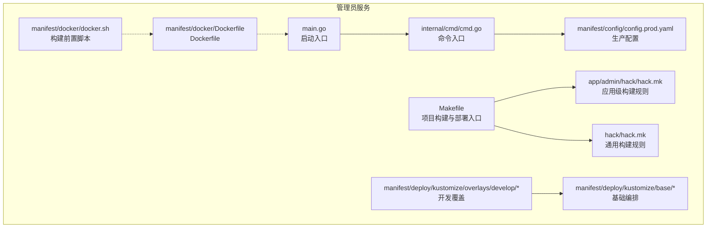
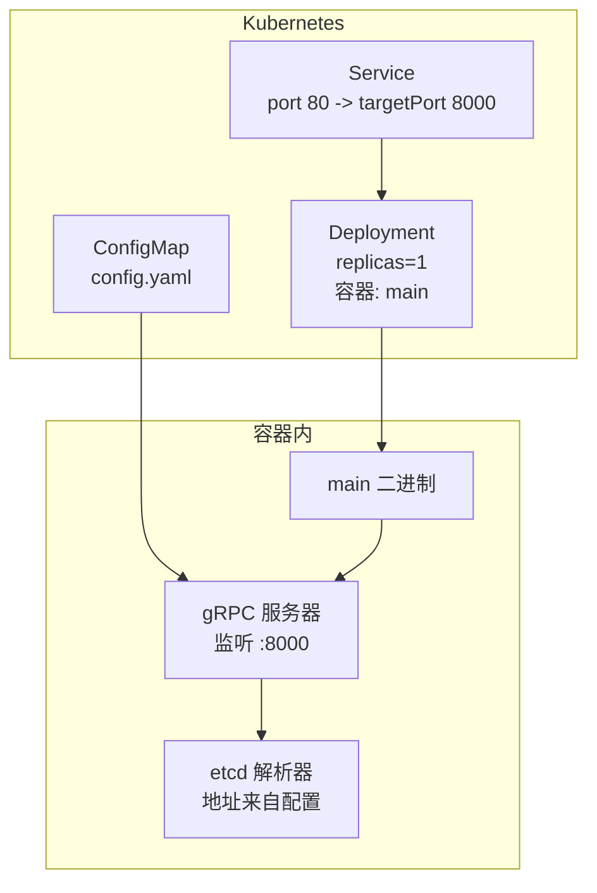
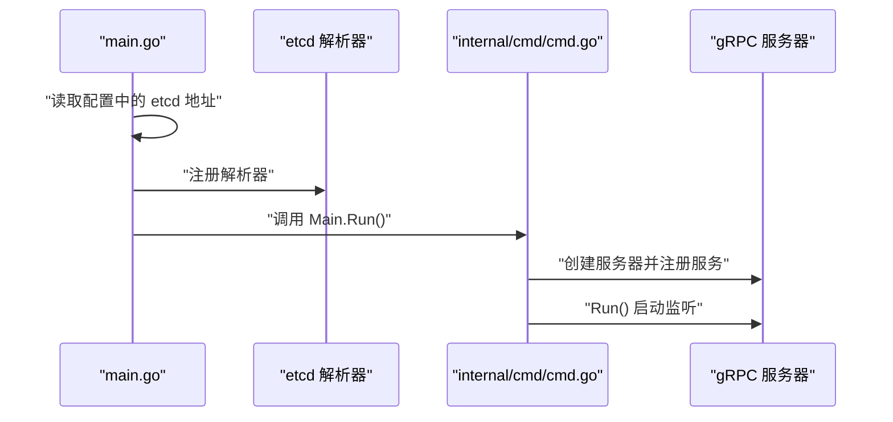
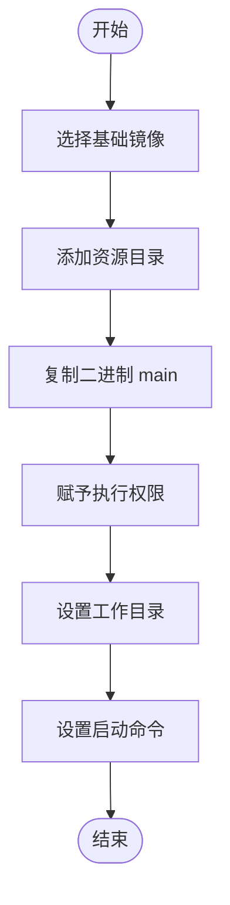
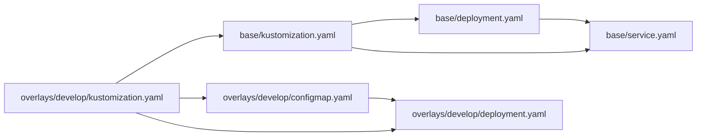
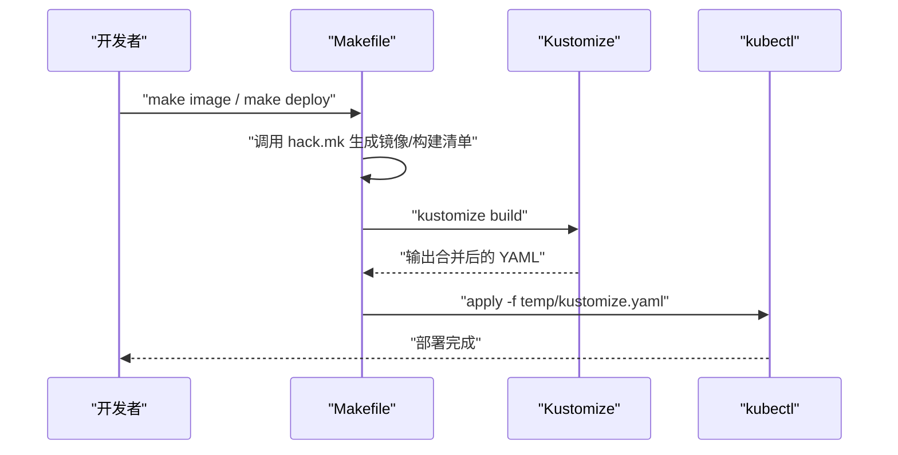
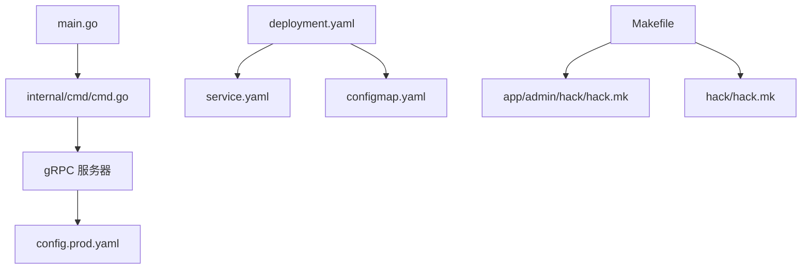

# 管理员服务部署

<cite>
**本文引用的文件**
- [app/admin/main.go](file://app/admin/main.go)
- [app/admin/internal/cmd/cmd.go](file://app/admin/internal/cmd/cmd.go)
- [app/admin/manifest/config/config.prod.yaml](file://app/admin/manifest/config/config.prod.yaml)
- [app/admin/manifest/docker/Dockerfile](file://app/admin/manifest/docker/Dockerfile)
- [app/admin/manifest/docker/docker.sh](file://app/admin/manifest/docker/docker.sh)
- [app/admin/manifest/deploy/kustomize/base/deployment.yaml](file://app/admin/manifest/deploy/kustomize/base/deployment.yaml)
- [app/admin/manifest/deploy/kustomize/base/service.yaml](file://app/admin/manifest/deploy/kustomize/base/service.yaml)
- [app/admin/manifest/deploy/kustomize/base/kustomization.yaml](file://app/admin/manifest/deploy/kustomize/base/kustomization.yaml)
- [app/admin/manifest/deploy/kustomize/overlays/develop/kustomization.yaml](file://app/admin/manifest/deploy/kustomize/overlays/develop/kustomization.yaml)
- [app/admin/manifest/deploy/kustomize/overlays/develop/configmap.yaml](file://app/admin/manifest/deploy/kustomize/overlays/develop/configmap.yaml)
- [app/admin/manifest/deploy/kustomize/overlays/develop/deployment.yaml](file://app/admin/manifest/deploy/kustomize/overlays/develop/deployment.yaml)
- [app/admin/Makefile](file://app/admin/Makefile)
- [app/admin/hack/hack.mk](file://app/admin/hack/hack.mk)
- [hack/hack.mk](file://hack/hack.mk)
</cite>

## 目录
1. [简介](#简介)
2. [项目结构](#项目结构)
3. [核心组件](#核心组件)
4. [架构总览](#架构总览)
5. [详细组件分析](#详细组件分析)
6. [依赖关系分析](#依赖关系分析)
7. [性能考虑](#性能考虑)
8. [故障排除指南](#故障排除指南)
9. [结论](#结论)
10. [附录](#附录)

## 简介
本指南面向运维与开发团队，提供管理员服务的完整部署方案，覆盖容器化打包、Kubernetes 编排与生产环境部署流程。内容包括：Docker 镜像构建、服务配置文件与环境变量、服务发现与负载均衡、健康检查、部署前准备、部署步骤、验证方法以及常见问题排查。同时给出不同环境的配置示例与最佳实践。

## 项目结构
管理员服务采用模块化组织，关键部署相关目录如下：
- 配置：位于 manifest/config，包含生产配置文件
- 容器化：位于 manifest/docker，包含 Dockerfile 与构建脚本
- 编排：位于 manifest/deploy/kustomize，包含 base 与 overlays
- 启动入口：位于 main.go，负责读取 etcd 地址并注册服务解析器
- 命令入口：位于 internal/cmd/cmd.go，负责初始化 gRPC 服务器并注册服务

图表来源
- [app/admin/main.go](file://app/admin/main.go#L1-L25)
- [app/admin/internal/cmd/cmd.go](file://app/admin/internal/cmd/cmd.go#L1-L30)
- [app/admin/manifest/config/config.prod.yaml](file://app/admin/manifest/config/config.prod.yaml#L1-L22)
- [app/admin/manifest/docker/Dockerfile](file://app/admin/manifest/docker/Dockerfile#L1-L17)
- [app/admin/manifest/docker/docker.sh](file://app/admin/manifest/docker/docker.sh#L1-L9)
- [app/admin/manifest/deploy/kustomize/base/deployment.yaml](file://app/admin/manifest/deploy/kustomize/base/deployment.yaml#L1-L22)
- [app/admin/manifest/deploy/kustomize/base/service.yaml](file://app/admin/manifest/deploy/kustomize/base/service.yaml#L1-L13)
- [app/admin/manifest/deploy/kustomize/overlays/develop/kustomization.yaml](file://app/admin/manifest/deploy/kustomize/overlays/develop/kustomization.yaml#L1-L15)
- [app/admin/Makefile](file://app/admin/Makefile#L1-L7)
- [app/admin/hack/hack.mk](file://app/admin/hack/hack.mk#L1-L75)
- [hack/hack.mk](file://hack/hack.mk#L1-L77)

章节来源
- [app/admin/main.go](file://app/admin/main.go#L1-L25)
- [app/admin/internal/cmd/cmd.go](file://app/admin/internal/cmd/cmd.go#L1-L30)
- [app/admin/manifest/config/config.prod.yaml](file://app/admin/manifest/config/config.prod.yaml#L1-L22)
- [app/admin/manifest/docker/Dockerfile](file://app/admin/manifest/docker/Dockerfile#L1-L17)
- [app/admin/manifest/docker/docker.sh](file://app/admin/manifest/docker/docker.sh#L1-L9)
- [app/admin/manifest/deploy/kustomize/base/deployment.yaml](file://app/admin/manifest/deploy/kustomize/base/deployment.yaml#L1-L22)
- [app/admin/manifest/deploy/kustomize/base/service.yaml](file://app/admin/manifest/deploy/kustomize/base/service.yaml#L1-L13)
- [app/admin/manifest/deploy/kustomize/base/kustomization.yaml](file://app/admin/manifest/deploy/kustomize/base/kustomization.yaml#L1-L9)
- [app/admin/manifest/deploy/kustomize/overlays/develop/kustomization.yaml](file://app/admin/manifest/deploy/kustomize/overlays/develop/kustomization.yaml#L1-L15)
- [app/admin/manifest/deploy/kustomize/overlays/develop/configmap.yaml](file://app/admin/manifest/deploy/kustomize/overlays/develop/configmap.yaml#L1-L15)
- [app/admin/manifest/deploy/kustomize/overlays/develop/deployment.yaml](file://app/admin/manifest/deploy/kustomize/overlays/develop/deployment.yaml#L1-L10)
- [app/admin/Makefile](file://app/admin/Makefile#L1-L7)
- [app/admin/hack/hack.mk](file://app/admin/hack/hack.mk#L1-L75)
- [hack/hack.mk](file://hack/hack.mk#L1-L77)

## 核心组件
- 启动入口：负责读取 etcd 地址并注册 gRPC 服务解析器，随后启动命令入口
- 命令入口：初始化 gRPC 服务器，注册业务服务并运行
- 生产配置：定义 gRPC 服务监听地址、日志路径与级别、数据库连接、etcd 地址等
- Docker 化：基于 Alpine 的多阶段构建，复制二进制并设置可执行权限
- Kustomize 编排：base 提供通用资源，overlays 覆盖命名空间、镜像标签与配置映射

章节来源
- [app/admin/main.go](file://app/admin/main.go#L13-L24)
- [app/admin/internal/cmd/cmd.go](file://app/admin/internal/cmd/cmd.go#L11-L29)
- [app/admin/manifest/config/config.prod.yaml](file://app/admin/manifest/config/config.prod.yaml#L1-L22)
- [app/admin/manifest/docker/Dockerfile](file://app/admin/manifest/docker/Dockerfile#L1-L17)
- [app/admin/manifest/deploy/kustomize/base/deployment.yaml](file://app/admin/manifest/deploy/kustomize/base/deployment.yaml#L1-L22)
- [app/admin/manifest/deploy/kustomize/overlays/develop/deployment.yaml](file://app/admin/manifest/deploy/kustomize/overlays/develop/deployment.yaml#L1-L10)

## 架构总览
管理员服务在 Kubernetes 中通过 Kustomize 进行编排，使用 ConfigMap 注入配置，Deployment 控制副本数与滚动更新，Service 暴露端口。服务启动后通过 etcd 进行服务发现与解析。

图表来源
- [app/admin/manifest/deploy/kustomize/base/service.yaml](file://app/admin/manifest/deploy/kustomize/base/service.yaml#L1-L13)
- [app/admin/manifest/deploy/kustomize/base/deployment.yaml](file://app/admin/manifest/deploy/kustomize/base/deployment.yaml#L1-L22)
- [app/admin/manifest/deploy/kustomize/overlays/develop/configmap.yaml](file://app/admin/manifest/deploy/kustomize/overlays/develop/configmap.yaml#L1-L15)
- [app/admin/main.go](file://app/admin/main.go#L13-L24)

## 详细组件分析

### 启动与服务注册流程
管理员服务启动时会：
- 从配置中心读取 etcd 地址
- 注册 gRPC 服务解析器
- 初始化命令入口，创建 gRPC 服务器并注册业务服务
- 启动服务器监听

图表来源
- [app/admin/main.go](file://app/admin/main.go#L13-L24)
- [app/admin/internal/cmd/cmd.go](file://app/admin/internal/cmd/cmd.go#L11-L29)

章节来源
- [app/admin/main.go](file://app/admin/main.go#L13-L24)
- [app/admin/internal/cmd/cmd.go](file://app/admin/internal/cmd/cmd.go#L11-L29)

### Docker 镜像构建
- 基础镜像：Alpine
- 构建步骤：复制资源与二进制，赋予执行权限
- 启动命令：直接运行二进制

图表来源
- [app/admin/manifest/docker/Dockerfile](file://app/admin/manifest/docker/Dockerfile#L1-L17)

章节来源
- [app/admin/manifest/docker/Dockerfile](file://app/admin/manifest/docker/Dockerfile#L1-L17)
- [app/admin/manifest/docker/docker.sh](file://app/admin/manifest/docker/docker.sh#L1-L9)

### Kubernetes 编排与配置
- base：定义通用 Deployment 与 Service；Service 将端口 80 映射到容器的 8000
- overlays/develop：覆盖命名空间、镜像标签，并注入 ConfigMap
- ConfigMap：包含服务器监听地址、Swagger 路径等配置项

图表来源
- [app/admin/manifest/deploy/kustomize/base/kustomization.yaml](file://app/admin/manifest/deploy/kustomize/base/kustomization.yaml#L1-L9)
- [app/admin/manifest/deploy/kustomize/base/deployment.yaml](file://app/admin/manifest/deploy/kustomize/base/deployment.yaml#L1-L22)
- [app/admin/manifest/deploy/kustomize/base/service.yaml](file://app/admin/manifest/deploy/kustomize/base/service.yaml#L1-L13)
- [app/admin/manifest/deploy/kustomize/overlays/develop/kustomization.yaml](file://app/admin/manifest/deploy/kustomize/overlays/develop/kustomization.yaml#L1-L15)
- [app/admin/manifest/deploy/kustomize/overlays/develop/configmap.yaml](file://app/admin/manifest/deploy/kustomize/overlays/develop/configmap.yaml#L1-L15)
- [app/admin/manifest/deploy/kustomize/overlays/develop/deployment.yaml](file://app/admin/manifest/deploy/kustomize/overlays/develop/deployment.yaml#L1-L10)

章节来源
- [app/admin/manifest/deploy/kustomize/base/kustomization.yaml](file://app/admin/manifest/deploy/kustomize/base/kustomization.yaml#L1-L9)
- [app/admin/manifest/deploy/kustomize/base/deployment.yaml](file://app/admin/manifest/deploy/kustomize/base/deployment.yaml#L1-L22)
- [app/admin/manifest/deploy/kustomize/base/service.yaml](file://app/admin/manifest/deploy/kustomize/base/service.yaml#L1-L13)
- [app/admin/manifest/deploy/kustomize/overlays/develop/kustomization.yaml](file://app/admin/manifest/deploy/kustomize/overlays/develop/kustomization.yaml#L1-L15)
- [app/admin/manifest/deploy/kustomize/overlays/develop/configmap.yaml](file://app/admin/manifest/deploy/kustomize/overlays/develop/configmap.yaml#L1-L15)
- [app/admin/manifest/deploy/kustomize/overlays/develop/deployment.yaml](file://app/admin/manifest/deploy/kustomize/overlays/develop/deployment.yaml#L1-L10)

### 部署前准备
- 环境要求：安装并配置 kubectl、Git、GoFrame CLI
- 准备镜像仓库：确保可推送镜像
- 准备 etcd：确保 etcd 地址可达且可用
- 准备数据库：确保 MySQL 地址与凭据正确

章节来源
- [hack/hack.mk](file://hack/hack.mk#L14-L20)
- [app/admin/hack/hack.mk](file://app/admin/hack/hack.mk#L14-L20)
- [app/admin/manifest/config/config.prod.yaml](file://app/admin/manifest/config/config.prod.yaml#L15-L22)

### 部署步骤
- 构建二进制与镜像：使用 Makefile 触发构建与镜像生成
- 生成编排清单：使用 Kustomize 在 overlays 环境下构建最终清单
- 应用清单：kubectl 应用生成的清单并触发滚动更新

图表来源
- [app/admin/Makefile](file://app/admin/Makefile#L1-L7)
- [app/admin/hack/hack.mk](file://app/admin/hack/hack.mk#L52-L66)
- [hack/hack.mk](file://hack/hack.mk#L52-L66)

章节来源
- [app/admin/Makefile](file://app/admin/Makefile#L1-L7)
- [app/admin/hack/hack.mk](file://app/admin/hack/hack.mk#L34-L66)
- [hack/hack.mk](file://hack/hack.mk#L34-L66)

### 验证方法
- Pod 状态：确认 Pod 处于 Running 并 Ready
- 日志检查：查看容器日志，确认 gRPC 服务器已启动并监听指定端口
- 服务连通性：通过 Service IP 或外部网关访问 Swagger 页面与 API 文档
- etcd 解析：确认服务注册与发现正常

章节来源
- [app/admin/manifest/deploy/kustomize/overlays/develop/configmap.yaml](file://app/admin/manifest/deploy/kustomize/overlays/develop/configmap.yaml#L6-L14)
- [app/admin/manifest/deploy/kustomize/base/service.yaml](file://app/admin/manifest/deploy/kustomize/base/service.yaml#L6-L11)

### 不同环境的配置示例
- 开发环境（develop）：覆盖镜像标签为 develop，注入 ConfigMap，命名空间默认
- 生产环境（prod）：建议新增 overlays/prod，覆盖镜像标签、副本数、资源限制与安全策略

章节来源
- [app/admin/manifest/deploy/kustomize/overlays/develop/kustomization.yaml](file://app/admin/manifest/deploy/kustomize/overlays/develop/kustomization.yaml#L1-L15)
- [app/admin/manifest/deploy/kustomize/overlays/develop/deployment.yaml](file://app/admin/manifest/deploy/kustomize/overlays/develop/deployment.yaml#L1-L10)

### 最佳实践
- 镜像版本管理：使用 Git commit 作为镜像标签，dirty 标记用于未提交变更
- 滚动更新：通过 Patch 触发滚动更新，确保平滑升级
- 配置分离：通过 ConfigMap 注入配置，避免硬编码
- 健康检查：建议在 Deployment 中增加 liveness/readiness 探针
- 安全：生产环境启用资源限制、只读根文件系统与最小权限

章节来源
- [app/admin/hack/hack.mk](file://app/admin/hack/hack.mk#L34-L50)
- [app/admin/hack/hack.mk](file://app/admin/hack/hack.mk#L52-L66)
- [app/admin/manifest/deploy/kustomize/overlays/develop/configmap.yaml](file://app/admin/manifest/deploy/kustomize/overlays/develop/configmap.yaml#L1-L15)

## 依赖关系分析
管理员服务的关键依赖链：
- main.go 依赖 etcd 解析器与命令入口
- 命令入口依赖 gRPC 服务器与业务控制器
- 编排依赖 Kustomize 与 ConfigMap
- 构建依赖 Makefile 与 hack.mk

图表来源
- [app/admin/main.go](file://app/admin/main.go#L13-L24)
- [app/admin/internal/cmd/cmd.go](file://app/admin/internal/cmd/cmd.go#L11-L29)
- [app/admin/manifest/config/config.prod.yaml](file://app/admin/manifest/config/config.prod.yaml#L1-L22)
- [app/admin/manifest/deploy/kustomize/base/deployment.yaml](file://app/admin/manifest/deploy/kustomize/base/deployment.yaml#L1-L22)
- [app/admin/manifest/deploy/kustomize/base/service.yaml](file://app/admin/manifest/deploy/kustomize/base/service.yaml#L1-L13)
- [app/admin/manifest/deploy/kustomize/overlays/develop/configmap.yaml](file://app/admin/manifest/deploy/kustomize/overlays/develop/configmap.yaml#L1-L15)
- [app/admin/Makefile](file://app/admin/Makefile#L1-L7)
- [app/admin/hack/hack.mk](file://app/admin/hack/hack.mk#L1-L75)
- [hack/hack.mk](file://hack/hack.mk#L1-L77)

章节来源
- [app/admin/main.go](file://app/admin/main.go#L13-L24)
- [app/admin/internal/cmd/cmd.go](file://app/admin/internal/cmd/cmd.go#L11-L29)
- [app/admin/manifest/config/config.prod.yaml](file://app/admin/manifest/config/config.prod.yaml#L1-L22)
- [app/admin/manifest/deploy/kustomize/base/deployment.yaml](file://app/admin/manifest/deploy/kustomize/base/deployment.yaml#L1-L22)
- [app/admin/manifest/deploy/kustomize/base/service.yaml](file://app/admin/manifest/deploy/kustomize/base/service.yaml#L1-L13)
- [app/admin/manifest/deploy/kustomize/overlays/develop/configmap.yaml](file://app/admin/manifest/deploy/kustomize/overlays/develop/configmap.yaml#L1-L15)
- [app/admin/Makefile](file://app/admin/Makefile#L1-L7)
- [app/admin/hack/hack.mk](file://app/admin/hack/hack.mk#L1-L75)
- [hack/hack.mk](file://hack/hack.mk#L1-L77)

## 性能考虑
- 资源配额：为生产环境设置 CPU/内存请求与限制
- 副本数：根据流量峰值设置副本数，结合 HPA 实现自动扩缩容
- 网络：Service 使用 ClusterIP 或 Ingress，合理设置超时与重试
- 存储：日志与临时文件使用持久化存储或本地卷，避免磁盘 IO 抖动

## 故障排除指南
- 无法连接 etcd：检查 etcd 地址是否正确、网络连通性与证书
- 服务未注册：确认 gRPC 服务器监听端口与 Service 端口一致
- 镜像拉取失败：检查镜像标签、私有仓库凭证与镜像仓库可达性
- 升级不生效：确认 Kustomize 覆盖是否正确、Deployment 标签是否更新
- 日志异常：检查 ConfigMap 中日志级别与输出路径

章节来源
- [app/admin/main.go](file://app/admin/main.go#L15-L21)
- [app/admin/manifest/deploy/kustomize/base/service.yaml](file://app/admin/manifest/deploy/kustomize/base/service.yaml#L6-L11)
- [app/admin/manifest/deploy/kustomize/overlays/develop/configmap.yaml](file://app/admin/manifest/deploy/kustomize/overlays/develop/configmap.yaml#L6-L14)
- [app/admin/hack/hack.mk](file://app/admin/hack/hack.mk#L52-L66)

## 结论
管理员服务的部署以 Kustomize 为核心，结合 ConfigMap 注入配置与 Makefile 自动化构建与部署，具备良好的可维护性与可扩展性。建议在生产环境中完善健康检查、资源限制与安全策略，并通过 overlays 支持多环境差异化配置。

## 附录
- 环境变量与配置映射：通过 ConfigMap 注入，避免在镜像中硬编码
- 服务发现：通过 etcd 解析器实现 gRPC 服务发现
- 负载均衡：由 Kubernetes Service 实现，支持多副本横向扩展
- 健康检查：建议在 Deployment 中增加探针以提升可用性