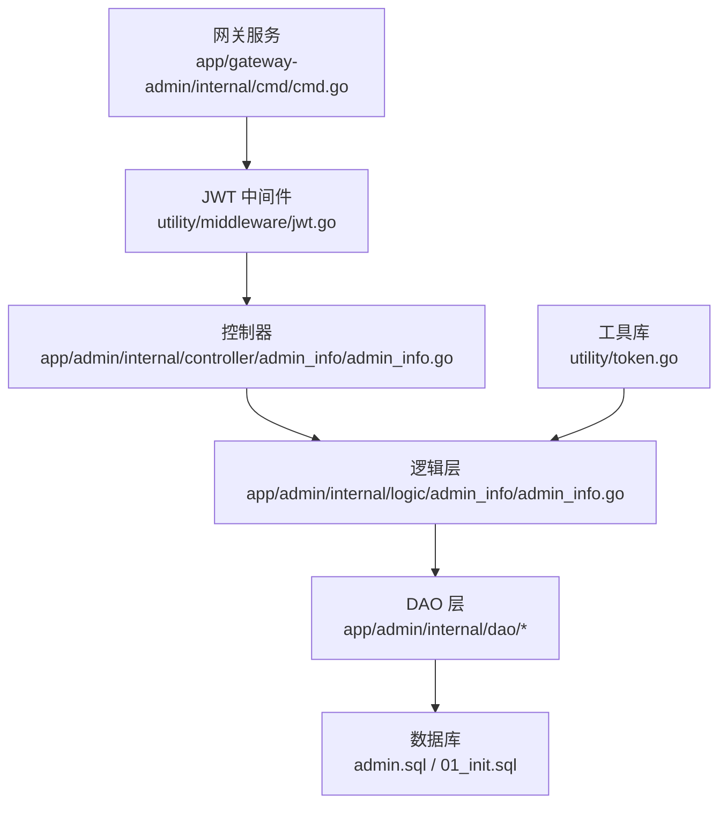
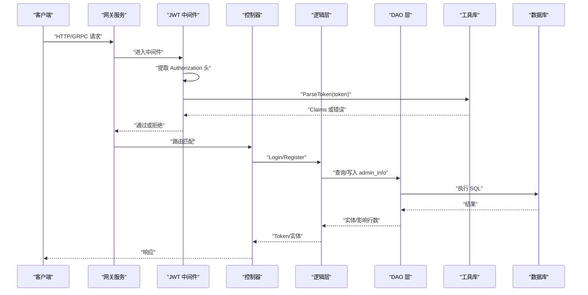
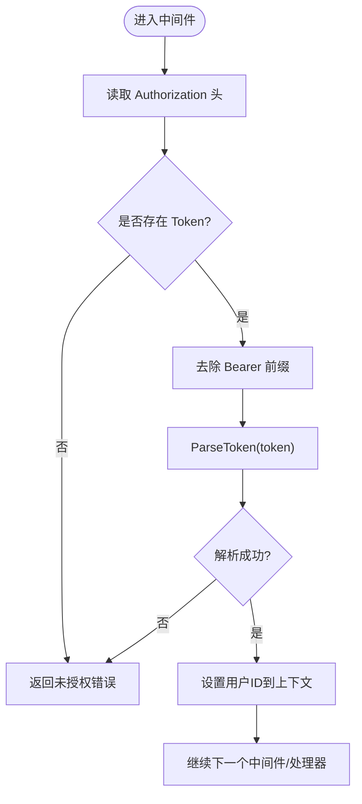
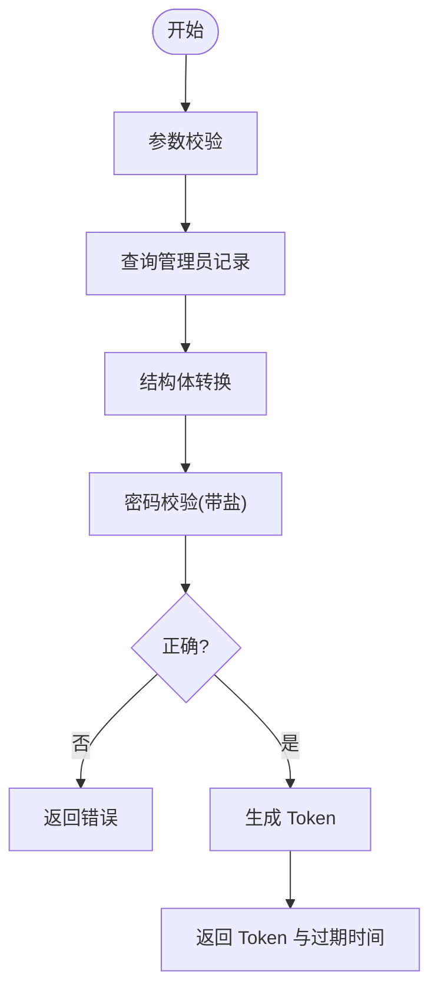
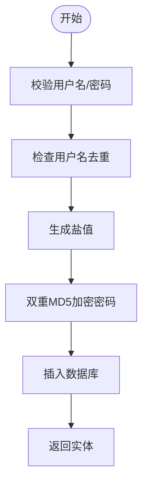
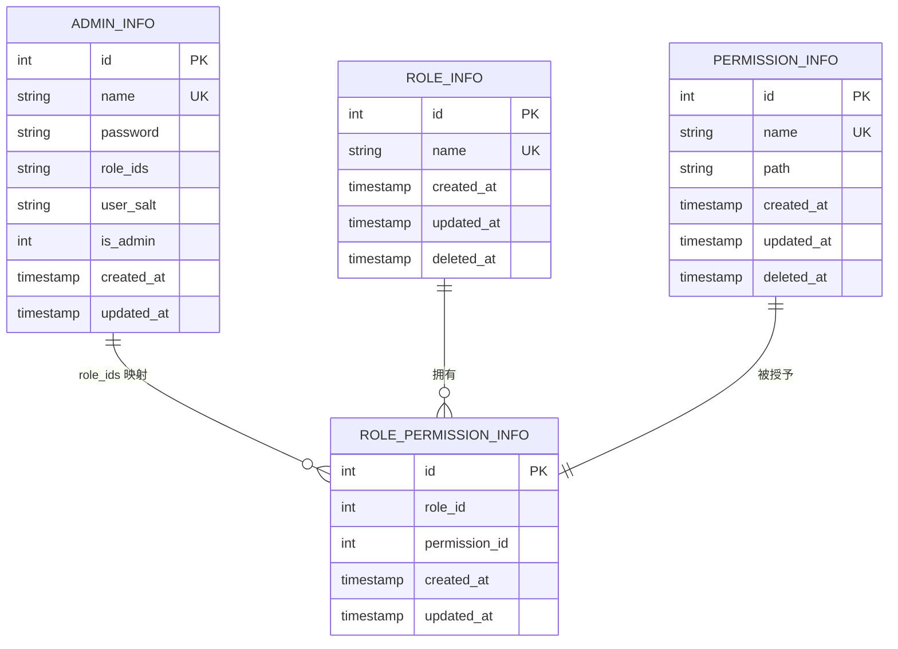
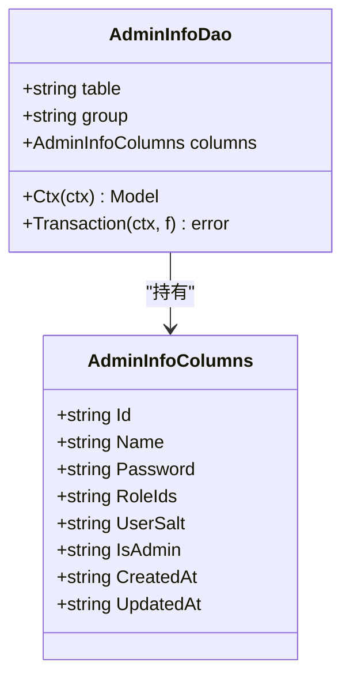
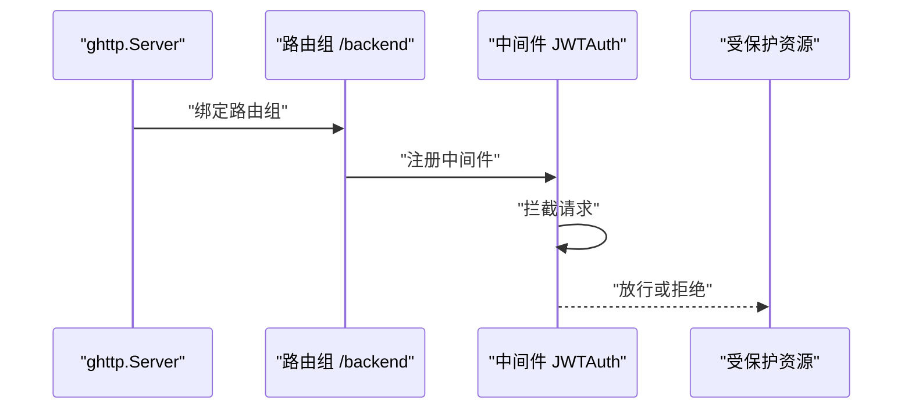
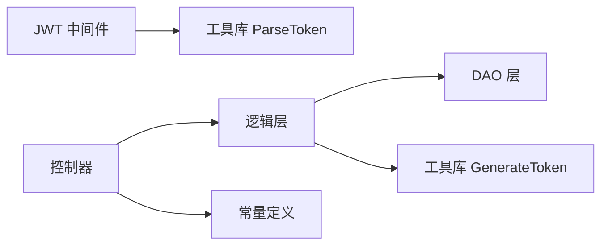

# 管理员认证与授权

<cite>
**本文档引用的文件**
- [utility/middleware/jwt.go](file://utility/middleware/jwt.go)
- [utility/token.go](file://utility/token.go)
- [app/admin/internal/logic/admin_info/admin_info.go](file://app/admin/internal/logic/admin_info/admin_info.go)
- [app/admin/internal/controller/admin_info/admin_info.go](file://app/admin/internal/controller/admin_info/admin_info.go)
- [app/admin/internal/dao/admin_info.go](file://app/admin/internal/dao/admin_info.go)
- [app/admin/internal/dao/internal/admin_info.go](file://app/admin/internal/dao/internal/admin_info.go)
- [app/admin/internal/model/entity/admin_info.go](file://app/admin/internal/model/entity/admin_info.go)
- [app/admin/hack/admin.sql](file://app/admin/hack/admin.sql)
- [app/admin/internal/dao/permission_info.go](file://app/admin/internal/dao/permission_info.go)
- [app/admin/internal/dao/internal/permission_info.go](file://app/admin/internal/dao/internal/permission_info.go)
- [app/admin/internal/dao/role_info.go](file://app/admin/internal/dao/role_info.go)
- [app/admin/internal/dao/role_permission_info.go](file://app/admin/internal/dao/role_permission_info.go)
- [app/admin/internal/dao/internal/role_permission_info.go](file://app/admin/internal/dao/internal/role_permission_info.go)
- [app/gateway-admin/internal/cmd/cmd.go](file://app/gateway-admin/internal/cmd/cmd.go)
- [utility/consts/consts.go](file://utility/consts/consts.go)
- [init-db/01_init.sql](file://init-db/01_init.sql)
</cite>

## 目录
1. [简介](#简介)
2. [项目结构](#项目结构)
3. [核心组件](#核心组件)
4. [架构总览](#架构总览)
5. [详细组件分析](#详细组件分析)
6. [依赖分析](#依赖分析)
7. [性能考虑](#性能考虑)
8. [故障排查指南](#故障排查指南)
9. [结论](#结论)
10. [附录](#附录)

## 简介
本文件面向管理员认证与授权系统，围绕以下目标展开：  
- 管理员登录认证机制与流程  
- JWT Token 的生成与验证  
- 权限校验与 RBAC 控制模型  
- 中间件配置与路由保护  
- Token 刷新策略与权限缓存机制  
- 接口使用示例与安全最佳实践  

系统采用 GoFrame 框架与 gRPC，结合自研 JWT 工具与 DAO 层访问数据库，形成“网关 -> 中间件 -> 业务逻辑 -> 数据访问”的清晰分层。

## 项目结构
管理员认证与授权涉及的关键模块如下：
- 网关服务：负责路由绑定与中间件装配
- 中间件：统一鉴权拦截
- 控制器：暴露登录/注册等 gRPC 接口
- 逻辑层：封装登录、注册等业务逻辑
- DAO/Model：访问 admin 数据库中的用户、角色、权限表
- 工具库：JWT 生成/解析、盐值与密码加密

**图表来源**
- [app/gateway-admin/internal/cmd/cmd.go](file://app/gateway-admin/internal/cmd/cmd.go#L20-L44)
- [utility/middleware/jwt.go](file://utility/middleware/jwt.go#L16-L38)
- [app/admin/internal/controller/admin_info/admin_info.go](file://app/admin/internal/controller/admin_info/admin_info.go#L19-L72)
- [app/admin/internal/logic/admin_info/admin_info.go](file://app/admin/internal/logic/admin_info/admin_info.go#L15-L46)
- [app/admin/internal/dao/admin_info.go](file://app/admin/internal/dao/admin_info.go#L13-L22)
- [utility/token.go](file://utility/token.go#L31-L64)
- [app/admin/hack/admin.sql](file://app/admin/hack/admin.sql#L1-L83)
- [init-db/01_init.sql](file://init-db/01_init.sql#L549-L682)

**章节来源**
- [app/gateway-admin/internal/cmd/cmd.go](file://app/gateway-admin/internal/cmd/cmd.go#L20-L44)
- [utility/middleware/jwt.go](file://utility/middleware/jwt.go#L16-L38)
- [app/admin/internal/controller/admin_info/admin_info.go](file://app/admin/internal/controller/admin_info/admin_info.go#L19-L72)
- [app/admin/internal/logic/admin_info/admin_info.go](file://app/admin/internal/logic/admin_info/admin_info.go#L15-L46)
- [app/admin/internal/dao/admin_info.go](file://app/admin/internal/dao/admin_info.go#L13-L22)
- [utility/token.go](file://utility/token.go#L31-L64)
- [app/admin/hack/admin.sql](file://app/admin/hack/admin.sql#L1-L83)
- [init-db/01_init.sql](file://init-db/01_init.sql#L549-L682)

## 核心组件
- JWT 中间件：从请求头提取 Authorization，去除 Bearer 前缀，调用工具库解析 Token，并将用户 ID 写入上下文
- 登录逻辑：参数校验 -> 查询管理员 -> 密码校验 -> 生成 Token
- 注册逻辑：参数校验 -> 去重 -> 生成盐值与加密密码 -> 写入数据库
- DAO 层：封装对 admin_info、role_info、permission_info、role_permission_info 的访问
- 权限模型：基于角色与权限映射，支持 Casbin 规则表（在 admin 数据库中）

**章节来源**
- [utility/middleware/jwt.go](file://utility/middleware/jwt.go#L16-L38)
- [app/admin/internal/logic/admin_info/admin_info.go](file://app/admin/internal/logic/admin_info/admin_info.go#L15-L46)
- [app/admin/internal/dao/admin_info.go](file://app/admin/internal/dao/admin_info.go#L13-L22)
- [app/admin/internal/dao/internal/admin_info.go](file://app/admin/internal/dao/internal/admin_info.go#L14-L94)
- [app/admin/hack/admin.sql](file://app/admin/hack/admin.sql#L1-L83)
- [init-db/01_init.sql](file://init-db/01_init.sql#L549-L682)

## 架构总览
下图展示从客户端到数据库的端到端流程，包括认证与权限校验位置：

**图表来源**
- [app/gateway-admin/internal/cmd/cmd.go](file://app/gateway-admin/internal/cmd/cmd.go#L20-L44)
- [utility/middleware/jwt.go](file://utility/middleware/jwt.go#L16-L38)
- [app/admin/internal/controller/admin_info/admin_info.go](file://app/admin/internal/controller/admin_info/admin_info.go#L23-L44)
- [app/admin/internal/logic/admin_info/admin_info.go](file://app/admin/internal/logic/admin_info/admin_info.go#L15-L46)
- [utility/token.go](file://utility/token.go#L52-L64)
- [app/admin/internal/dao/internal/admin_info.go](file://app/admin/internal/dao/internal/admin_info.go#L76-L83)

## 详细组件分析

### JWT 中间件
- 功能：从请求头读取 Authorization，去除 Bearer 前缀，调用 ParseToken 解析，失败则返回未授权错误；成功则将用户 ID 写入上下文供后续使用
- 关键点：错误码使用统一的未授权错误；上下文键名固定，便于下游获取

**图表来源**
- [utility/middleware/jwt.go](file://utility/middleware/jwt.go#L16-L38)
- [utility/token.go](file://utility/token.go#L52-L64)

**章节来源**
- [utility/middleware/jwt.go](file://utility/middleware/jwt.go#L16-L38)

### 登录流程
- 输入：用户名、密码
- 步骤：
  1) 参数校验
  2) 查询管理员记录
  3) 结构体转换
  4) 密码校验（使用盐值进行双重 MD5）
  5) 生成 Token（含过期时间）
- 输出：Token 与过期时间

**图表来源**
- [app/admin/internal/logic/admin_info/admin_info.go](file://app/admin/internal/logic/admin_info/admin_info.go#L15-L46)
- [utility/token.go](file://utility/token.go#L31-L50)

**章节来源**
- [app/admin/internal/logic/admin_info/admin_info.go](file://app/admin/internal/logic/admin_info/admin_info.go#L15-L46)
- [utility/token.go](file://utility/token.go#L25-L50)

### 注册流程
- 输入：用户名、密码
- 步骤：
  1) 参数校验（用户名非空、密码长度≥6）
  2) 去重检查
  3) 生成盐值
  4) 双重 MD5 加密密码
  5) 写入数据库
  6) 返回实体
- 默认角色与超级管理员标记见实体定义

**图表来源**
- [app/admin/internal/logic/admin_info/admin_info.go](file://app/admin/internal/logic/admin_info/admin_info.go#L48-L95)
- [utility/token.go](file://utility/token.go#L20-L29)
- [app/admin/internal/model/entity/admin_info.go](file://app/admin/internal/model/entity/admin_info.go#L12-L21)

**章节来源**
- [app/admin/internal/logic/admin_info/admin_info.go](file://app/admin/internal/logic/admin_info/admin_info.go#L48-L95)
- [app/admin/internal/model/entity/admin_info.go](file://app/admin/internal/model/entity/admin_info.go#L12-L21)

### 权限模型与 RBAC 实现
- 数据表：
  - admin_info：管理员基本信息、角色、盐值、是否超级管理员
  - role_info：角色信息
  - permission_info：权限信息（含路径）
  - role_permission_info：角色-权限映射
  - casbin_rule：Casbin 规则表（支持更细粒度的权限控制）
- 模型要点：
  - 管理员实体包含角色 ID 字段
  - 权限与角色通过映射表关联
  - 初始化脚本包含 Casbin 规则样例

**图表来源**
- [app/admin/hack/admin.sql](file://app/admin/hack/admin.sql#L1-L83)
- [init-db/01_init.sql](file://init-db/01_init.sql#L549-L682)

**章节来源**
- [app/admin/hack/admin.sql](file://app/admin/hack/admin.sql#L1-L83)
- [init-db/01_init.sql](file://init-db/01_init.sql#L549-L682)

### DAO 层与数据访问
- DAO 对象封装了表名、列名、事务与上下文模型
- AdminInfoDao 提供 Ctx、Transaction 等常用方法
- 其他 DAO（PermissionInfo、RoleInfo、RolePermissionInfo）遵循相同模式

**图表来源**
- [app/admin/internal/dao/internal/admin_info.go](file://app/admin/internal/dao/internal/admin_info.go#L14-L94)

**章节来源**
- [app/admin/internal/dao/admin_info.go](file://app/admin/internal/dao/admin_info.go#L13-L22)
- [app/admin/internal/dao/internal/admin_info.go](file://app/admin/internal/dao/internal/admin_info.go#L14-L94)

### 网关与中间件配置
- 网关服务在特定路由组上绑定中间件，所有受保护的接口均需通过 JWT 中间件
- 未提供 Token 或 Token 无效时，直接返回未授权错误

**图表来源**
- [app/gateway-admin/internal/cmd/cmd.go](file://app/gateway-admin/internal/cmd/cmd.go#L20-L44)
- [utility/middleware/jwt.go](file://utility/middleware/jwt.go#L16-L38)

**章节来源**
- [app/gateway-admin/internal/cmd/cmd.go](file://app/gateway-admin/internal/cmd/cmd.go#L20-L44)

## 依赖分析
- 中间件依赖工具库 ParseToken
- 登录逻辑依赖 DAO 查询与工具库 GenerateToken
- 控制器依赖逻辑层与常量定义
- DAO 依赖 GoFrame 数据库抽象层

**图表来源**
- [utility/middleware/jwt.go](file://utility/middleware/jwt.go#L28-L32)
- [app/admin/internal/controller/admin_info/admin_info.go](file://app/admin/internal/controller/admin_info/admin_info.go#L23-L44)
- [app/admin/internal/logic/admin_info/admin_info.go](file://app/admin/internal/logic/admin_info/admin_info.go#L15-L46)
- [utility/token.go](file://utility/token.go#L31-L64)
- [utility/consts/consts.go](file://utility/consts/consts.go#L44-L46)

**章节来源**
- [utility/middleware/jwt.go](file://utility/middleware/jwt.go#L28-L32)
- [app/admin/internal/controller/admin_info/admin_info.go](file://app/admin/internal/controller/admin_info/admin_info.go#L23-L44)
- [app/admin/internal/logic/admin_info/admin_info.go](file://app/admin/internal/logic/admin_info/admin_info.go#L15-L46)
- [utility/token.go](file://utility/token.go#L31-L64)
- [utility/consts/consts.go](file://utility/consts/consts.go#L44-L46)

## 性能考虑
- Token 过期时间固定为 24 小时，建议结合业务场景调整，避免频繁刷新导致的性能损耗
- 密码加密采用双重 MD5 与盐值，具备一定安全性，但建议升级为更强的密码哈希算法（如 bcrypt、scrypt）
- 中间件仅做 Token 解析与上下文注入，无复杂计算，性能开销较低
- 建议对热点用户信息与权限集合进行缓存，减少数据库访问频率

[本节为通用指导，无需列出具体文件来源]

## 故障排查指南
- 未提供 Token 或格式错误
  - 现象：中间件直接返回未授权错误
  - 排查：确认请求头 Authorization 是否包含 Bearer 前缀
  - 参考：[utility/middleware/jwt.go](file://utility/middleware/jwt.go#L16-L38)
- Token 无效或过期
  - 现象：解析失败，返回未授权错误
  - 排查：核对签名密钥、时间偏移、过期时间
  - 参考：[utility/token.go](file://utility/token.go#L52-L64)
- 登录失败
  - 现象：用户名不存在、密码错误、系统错误
  - 排查：检查用户名/密码、盐值与加密逻辑
  - 参考：[app/admin/internal/logic/admin_info/admin_info.go](file://app/admin/internal/logic/admin_info/admin_info.go#L15-L46)
- 注册失败
  - 现象：用户名重复、密码长度不足、插入失败
  - 排查：检查用户名唯一约束、密码长度校验、盐值生成
  - 参考：[app/admin/internal/logic/admin_info/admin_info.go](file://app/admin/internal/logic/admin_info/admin_info.go#L48-L95)
- 权限校验异常
  - 现象：受保护接口返回未授权
  - 排查：确认中间件是否正确挂载、Token 是否携带用户 ID
  - 参考：[app/gateway-admin/internal/cmd/cmd.go](file://app/gateway-admin/internal/cmd/cmd.go#L29-L38)

**章节来源**
- [utility/middleware/jwt.go](file://utility/middleware/jwt.go#L16-L38)
- [utility/token.go](file://utility/token.go#L52-L64)
- [app/admin/internal/logic/admin_info/admin_info.go](file://app/admin/internal/logic/admin_info/admin_info.go#L15-L46)
- [app/admin/internal/logic/admin_info/admin_info.go](file://app/admin/internal/logic/admin_info/admin_info.go#L48-L95)
- [app/gateway-admin/internal/cmd/cmd.go](file://app/gateway-admin/internal/cmd/cmd.go#L29-L38)

## 结论
本系统通过简洁的 JWT 中间件与完善的登录/注册逻辑，实现了基础的管理员认证能力；配合 DAO 层与权限模型，可进一步扩展为完整的 RBAC 授权体系。建议在生产环境中引入更强的密码哈希算法、Token 刷新策略与权限缓存机制，以提升安全性与性能。

[本节为总结性内容，无需列出具体文件来源]

## 附录

### 认证接口使用示例
- 登录
  - 方法：POST /backend/admin/login
  - 请求体：用户名、密码
  - 响应：Token、过期时间
  - 参考：[app/admin/internal/controller/admin_info/admin_info.go](file://app/admin/internal/controller/admin_info/admin_info.go#L23-L44)
- 注册
  - 方法：POST /backend/admin/register
  - 请求体：用户名、密码
  - 响应：管理员信息
  - 参考：[app/admin/internal/controller/admin_info/admin_info.go](file://app/admin/internal/controller/admin_info/admin_info.go#L47-L72)

**章节来源**
- [app/admin/internal/controller/admin_info/admin_info.go](file://app/admin/internal/controller/admin_info/admin_info.go#L23-L72)

### 安全最佳实践
- 使用 HTTPS 传输，防止 Token 泄露
- 合理设置 Token 过期时间，必要时引入刷新 Token
- 强化密码策略，采用更强的哈希算法
- 对敏感接口启用中间件保护
- 定期轮换签名密钥，限制密钥泄露范围
- 对权限校验进行审计与日志记录

[本节为通用指导，无需列出具体文件来源]