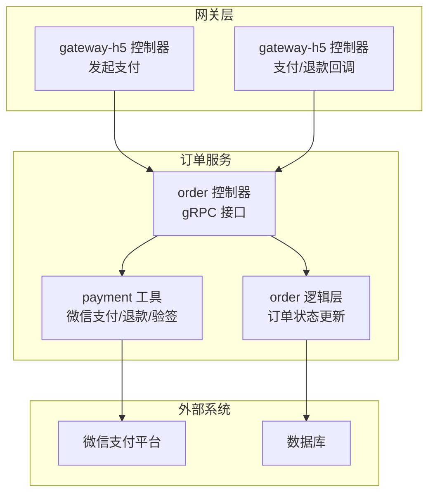
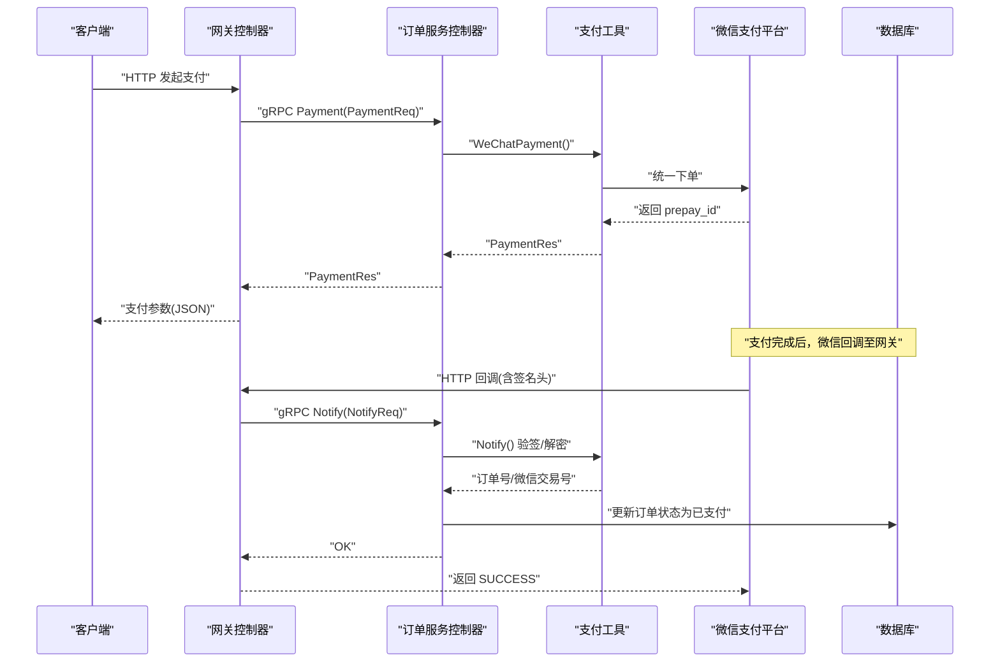
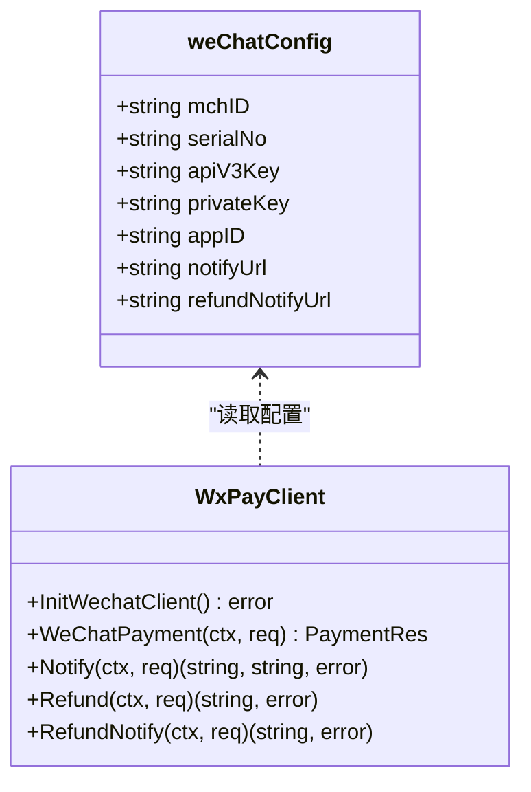
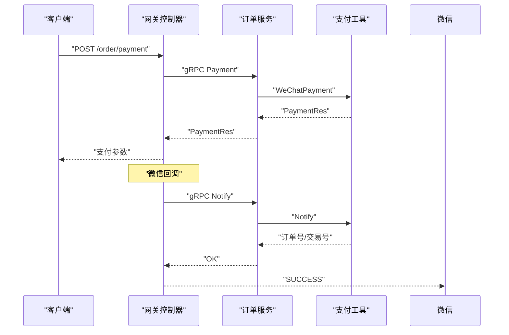
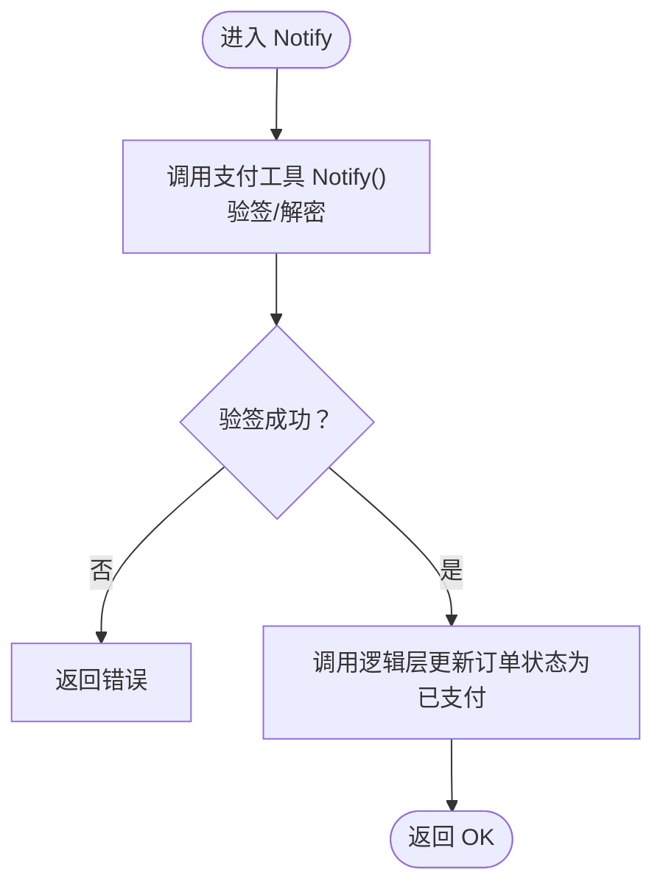
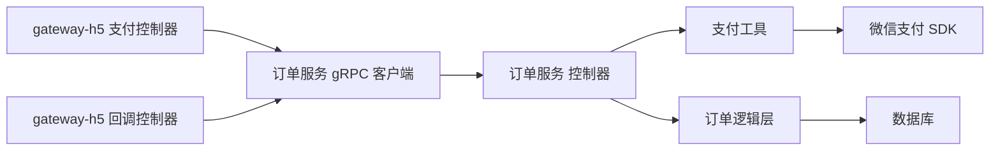

# 支付处理机制

<cite>
**本文引用的文件**
- [app/order/utility/payment/wxchat.go](file://app/order/utility/payment/wxchat.go)
- [app/order/utility/payment/wxchat_test.go](file://app/order/utility/payment/wxchat_test.go)
- [app/order/internal/controller/order_info/order_info.go](file://app/order/internal/controller/order_info/order_info.go)
- [app/gateway-h5/internal/controller/order/order_v1_payment.go](file://app/gateway-h5/internal/controller/order/order_v1_payment.go)
- [app/gateway-h5/internal/controller/order/order_v1_notify.go](file://app/gateway-h5/internal/controller/order/order_v1_notify.go)
- [app/order/api/order_info/v1/order_info.pb.go](file://app/order/api/order_info/v1/order_info.pb.go)
- [app/order/manifest/config/config.prod.yaml](file://app/order/manifest/config/config.prod.yaml)
- [app/order/internal/model/entity/order_info.go](file://app/order/internal/model/entity/order_info.go)
- [app/order/internal/consts/order_status.go](file://app/order/internal/consts/order_status.go)
- [app/order/internal/logic/order_info/order_info.go](file://app/order/internal/logic/order_info/order_info.go)
</cite>

## 目录
1. [简介](#简介)
2. [项目结构](#项目结构)
3. [核心组件](#核心组件)
4. [架构总览](#架构总览)
5. [详细组件分析](#详细组件分析)
6. [依赖关系分析](#依赖关系分析)
7. [性能考量](#性能考量)
8. [故障排查指南](#故障排查指南)
9. [结论](#结论)
10. [附录](#附录)

## 简介
本文件系统化梳理了本仓库中的支付处理机制，重点覆盖订单支付流程、微信支付集成、支付参数配置、支付请求生成、支付回调处理、签名验证、支付状态更新、退款流程与回调、支付超时与重试策略、金额校验与安全防护、配置与密钥管理、日志与风控策略，以及支付接口的API规范与错误码约定。目标是帮助开发者快速理解并正确扩展支付能力。

## 项目结构
支付相关代码主要分布在以下模块：
- 网关层（gateway-h5）：负责接收前端请求，转发到订单服务，并处理微信回调通知。
- 订单服务（order）：提供支付与回调gRPC接口，封装微信支付SDK调用与验签，驱动订单状态变更。
- 支付工具（order/utility/payment）：封装微信支付客户端初始化、统一下单、回调验签、退款与退款回调处理。
- 配置（order/manifest/config）：集中存放支付密钥、证书序列号、回调地址等敏感配置。
- 数据模型与常量：定义订单实体、状态常量及退款状态常量。

图表来源
- [app/gateway-h5/internal/controller/order/order_v1_payment.go](file://app/gateway-h5/internal/controller/order/order_v1_payment.go#L11-L33)
- [app/gateway-h5/internal/controller/order/order_v1_notify.go](file://app/gateway-h5/internal/controller/order/order_v1_notify.go#L13-L59)
- [app/order/internal/controller/order_info/order_info.go](file://app/order/internal/controller/order_info/order_info.go#L101-L118)
- [app/order/utility/payment/wxchat.go](file://app/order/utility/payment/wxchat.go#L64-L132)

章节来源
- [app/gateway-h5/internal/controller/order/order_v1_payment.go](file://app/gateway-h5/internal/controller/order/order_v1_payment.go#L1-L34)
- [app/gateway-h5/internal/controller/order/order_v1_notify.go](file://app/gateway-h5/internal/controller/order/order_v1_notify.go#L1-L61)
- [app/order/internal/controller/order_info/order_info.go](file://app/order/internal/controller/order_info/order_info.go#L1-L188)
- [app/order/utility/payment/wxchat.go](file://app/order/utility/payment/wxchat.go#L1-L328)

## 核心组件
- 支付工具（payment）：封装微信支付客户端初始化、统一下单、回调验签、退款与退款回调处理。
- 网关控制器（gateway-h5）：将HTTP请求转换为gRPC请求，转发到订单服务；处理微信回调并将回调内容转交给订单服务。
- 订单控制器（order）：提供gRPC Payment/Notify接口，调用支付工具完成支付与回调处理，并更新订单状态。
- 配置（config.prod.yaml）：集中存储支付密钥、证书序列号、AppID、回调URL等。
- 数据模型与常量：定义订单实体、状态常量及退款状态常量。

章节来源
- [app/order/utility/payment/wxchat.go](file://app/order/utility/payment/wxchat.go#L1-L328)
- [app/order/manifest/config/config.prod.yaml](file://app/order/manifest/config/config.prod.yaml#L49-L86)
- [app/order/internal/model/entity/order_info.go](file://app/order/internal/model/entity/order_info.go#L12-L29)
- [app/order/internal/consts/order_status.go](file://app/order/internal/consts/order_status.go#L6-L16)

## 架构总览
支付处理采用“网关转发 + 微服务gRPC + 支付SDK”的分层架构：
- 前端通过网关发起支付请求，网关将HTTP请求转换为gRPC请求并调用订单服务。
- 订单服务调用支付工具完成统一下单，返回前端所需的支付参数。
- 微信支付平台异步回调至网关，网关再调用订单服务进行验签与订单状态更新。
- 订单服务内部通过逻辑层更新数据库状态，并触发后续事件（如延迟取消订单）。

图表来源
- [app/gateway-h5/internal/controller/order/order_v1_payment.go](file://app/gateway-h5/internal/controller/order/order_v1_payment.go#L11-L33)
- [app/order/internal/controller/order_info/order_info.go](file://app/order/internal/controller/order_info/order_info.go#L101-L118)
- [app/order/utility/payment/wxchat.go](file://app/order/utility/payment/wxchat.go#L84-L132)
- [app/gateway-h5/internal/controller/order/order_v1_notify.go](file://app/gateway-h5/internal/controller/order/order_v1_notify.go#L13-L59)

## 详细组件分析

### 支付工具（payment）组件
- 客户端初始化：从配置加载商户号、证书序列号、APIv3密钥、私钥、AppID、回调URL，使用SDK自动鉴权cipher初始化微信客户端。
- 统一下单：构造PrepayRequest，调用JSAPI服务生成prepay_id，随后生成支付签名参数（时间戳、随机串、package、签名类型、paySign）返回给上层。
- 回调验签：根据回调headers与原始body构造HTTP请求，使用平台证书与APIv3密钥进行验签与解密，解析出商户订单号与微信交易号。
- 退款与退款回调：封装退款请求并调用退款API，处理不同状态；退款回调同样进行验签与解析，提取退款ID。

图表来源
- [app/order/utility/payment/wxchat.go](file://app/order/utility/payment/wxchat.go#L40-L81)
- [app/order/utility/payment/wxchat.go](file://app/order/utility/payment/wxchat.go#L84-L132)
- [app/order/utility/payment/wxchat.go](file://app/order/utility/payment/wxchat.go#L134-L171)
- [app/order/utility/payment/wxchat.go](file://app/order/utility/payment/wxchat.go#L184-L246)
- [app/order/utility/payment/wxchat.go](file://app/order/utility/payment/wxchat.go#L262-L313)

章节来源
- [app/order/utility/payment/wxchat.go](file://app/order/utility/payment/wxchat.go#L1-L328)

### 网关控制器（gateway-h5）组件
- 发起支付：将HTTP请求转换为gRPC请求，调用订单服务的Payment接口，返回支付参数。
- 支付回调：读取微信回调的原始body与必要headers，构造NotifyReq并调用订单服务的Notify接口；根据返回结果返回SUCCESS或错误。

图表来源
- [app/gateway-h5/internal/controller/order/order_v1_payment.go](file://app/gateway-h5/internal/controller/order/order_v1_payment.go#L11-L33)
- [app/gateway-h5/internal/controller/order/order_v1_notify.go](file://app/gateway-h5/internal/controller/order/order_v1_notify.go#L13-L59)
- [app/order/internal/controller/order_info/order_info.go](file://app/order/internal/controller/order_info/order_info.go#L101-L118)

章节来源
- [app/gateway-h5/internal/controller/order/order_v1_payment.go](file://app/gateway-h5/internal/controller/order/order_v1_payment.go#L1-L34)
- [app/gateway-h5/internal/controller/order/order_v1_notify.go](file://app/gateway-h5/internal/controller/order/order_v1_notify.go#L1-L61)

### 订单控制器（order）组件
- Payment接口：直接委托支付工具完成统一下单与签名参数生成。
- Notify接口：先调用支付工具进行回调验签与解密，解析出订单号与微信交易号，再调用逻辑层更新订单状态为“已支付”。

图表来源
- [app/order/internal/controller/order_info/order_info.go](file://app/order/internal/controller/order_info/order_info.go#L105-L118)
- [app/order/utility/payment/wxchat.go](file://app/order/utility/payment/wxchat.go#L134-L171)

章节来源
- [app/order/internal/controller/order_info/order_info.go](file://app/order/internal/controller/order_info/order_info.go#L101-L118)

### 支付配置与密钥管理
- 配置项：商户号、证书序列号、APIv3密钥、AppID、支付回调URL、退款回调URL、私钥。
- 存储位置：生产配置文件集中管理，避免硬编码在代码中。
- 安全建议：私钥与APIv3密钥仅在内存中使用，不落盘；回调URL需启用HTTPS；定期轮换APIv3密钥与证书。

章节来源
- [app/order/manifest/config/config.prod.yaml](file://app/order/manifest/config/config.prod.yaml#L49-L86)

### 支付参数与回调数据结构
- 支付请求体：包含用户openid、金额（分）、订单号。
- 支付响应体：包含时间戳、随机串、package（prepay_id）、签名类型、支付签名、商户订单号。
- 回调请求体：包含原始body与微信回调headers（签名、时间戳、随机串、证书序列号）。

章节来源
- [app/order/api/order_info/v1/order_info.pb.go](file://app/order/api/order_info/v1/order_info.pb.go#L733-L742)
- [app/order/api/order_info/v1/order_info.pb.go](file://app/order/api/order_info/v1/order_info.pb.go#L797-L809)
- [app/order/api/order_info/v1/order_info.pb.go](file://app/order/api/order_info/v1/order_info.pb.go#L885-L893)

### 订单状态与金额校验
- 订单状态：包含待支付、已支付待发货、已发货、已收货待评价、已评价、待确认、已取消、退款等。
- 金额校验：创建订单时对商品总价、优惠券金额、实付金额进行一致性校验，确保与商品明细一致。
- 订单实体：包含支付方式、支付时间、状态、第三方交易号、金额（单位分）等字段。

章节来源
- [app/order/internal/consts/order_status.go](file://app/order/internal/consts/order_status.go#L6-L16)
- [app/order/internal/logic/order_info/order_info.go](file://app/order/internal/logic/order_info/order_info.go#L27-L51)
- [app/order/internal/model/entity/order_info.go](file://app/order/internal/model/entity/order_info.go#L12-L29)

### 退款流程与回调
- 退款请求：包含原支付交易号、商户退款单号、退款原因、原订单金额（分）、退款金额（分）。
- 退款回调：解析回调中的退款ID，记录日志，后续由业务层决定是否进一步处理。

章节来源
- [app/order/utility/payment/wxchat.go](file://app/order/utility/payment/wxchat.go#L175-L182)
- [app/order/utility/payment/wxchat.go](file://app/order/utility/payment/wxchat.go#L262-L313)

## 依赖关系分析
- 网关控制器依赖订单服务的gRPC客户端，将HTTP请求映射为gRPC请求。
- 订单控制器依赖支付工具完成支付与回调处理。
- 支付工具依赖微信支付SDK与配置中心，完成统一下单、验签与退款。
- 订单逻辑层依赖DAO与数据库，完成状态更新与事件发布。

图表来源
- [app/gateway-h5/internal/controller/order/order_v1_payment.go](file://app/gateway-h5/internal/controller/order/order_v1_payment.go#L11-L33)
- [app/gateway-h5/internal/controller/order/order_v1_notify.go](file://app/gateway-h5/internal/controller/order/order_v1_notify.go#L13-L59)
- [app/order/internal/controller/order_info/order_info.go](file://app/order/internal/controller/order_info/order_info.go#L101-L118)
- [app/order/utility/payment/wxchat.go](file://app/order/utility/payment/wxchat.go#L64-L81)

章节来源
- [app/gateway-h5/internal/controller/order/order_v1_payment.go](file://app/gateway-h5/internal/controller/order/order_v1_payment.go#L1-L34)
- [app/gateway-h5/internal/controller/order/order_v1_notify.go](file://app/gateway-h5/internal/controller/order/order_v1_notify.go#L1-L61)
- [app/order/internal/controller/order_info/order_info.go](file://app/order/internal/controller/order_info/order_info.go#L1-L188)
- [app/order/utility/payment/wxchat.go](file://app/order/utility/payment/wxchat.go#L1-L328)

## 性能考量
- 异步处理：回调处理应尽快返回SUCCESS，耗时逻辑放入后台任务或消息队列。
- 幂等性：回调处理需具备幂等校验，避免重复更新订单状态。
- 超时与重试：统一下单与回调验签应设置合理超时与重试策略，避免阻塞请求线程。
- 日志与监控：对支付关键路径增加埋点与日志，便于追踪与定位问题。
- 缓存与限流：对高并发场景下的统一下单接口进行限流与缓存优化。

## 故障排查指南
- 回调验签失败：检查回调headers是否完整、平台证书是否正确、APIv3密钥是否匹配。
- prepay_id为空：检查商户号、AppID、回调URL、金额单位（分）是否正确。
- 支付签名错误：确认签名参数顺序与SDK要求一致，私钥加载是否成功。
- 退款状态异常：关注回调中的退款状态，必要时通过微信支付平台查询退款单状态。
- 订单状态未更新：确认回调已成功到达订单服务且逻辑层更新成功。

章节来源
- [app/order/utility/payment/wxchat.go](file://app/order/utility/payment/wxchat.go#L134-L171)
- [app/order/utility/payment/wxchat.go](file://app/order/utility/payment/wxchat.go#L184-L246)
- [app/order/internal/controller/order_info/order_info.go](file://app/order/internal/controller/order_info/order_info.go#L105-L118)

## 结论
本支付处理机制基于gRPC与微信支付SDK实现了从统一下单、签名生成、回调验签到订单状态更新的完整闭环。通过清晰的模块划分与严格的配置管理，系统具备良好的可维护性与安全性。建议在生产环境中强化幂等性、超时与重试策略、日志与监控，并持续完善风控与合规措施。

## 附录

### 支付接口API规范
- 发起支付
  - 方法：POST
  - 路径：/order/payment
  - 请求体字段：openId（用户openid）、amount（金额，单位分）、number（订单号）
  - 响应体字段：timeStamp（时间戳）、nonceStr（随机串）、package（格式为prepay_id=...）、signType（签名类型）、paySign（支付签名）、outTradeNo（商户订单号）

- 支付回调
  - 方法：POST
  - 路径：由配置指定（支付回调URL）
  - 请求头：Wechatpay-Signature、Wechatpay-Timestamp、Wechatpay-Nonce、Wechatpay-Serial
  - 请求体：原始JSON（包含交易信息）

- 退款回调
  - 方法：POST
  - 路径：由配置指定（退款回调URL）
  - 请求头：同上
  - 请求体：原始JSON（包含退款信息）

章节来源
- [app/order/api/order_info/v1/order_info.pb.go](file://app/order/api/order_info/v1/order_info.pb.go#L733-L742)
- [app/order/api/order_info/v1/order_info.pb.go](file://app/order/api/order_info/v1/order_info.pb.go#L797-L809)
- [app/order/api/order_info/v1/order_info.pb.go](file://app/order/api/order_info/v1/order_info.pb.go#L885-L893)
- [app/order/manifest/config/config.prod.yaml](file://app/order/manifest/config/config.prod.yaml#L56-L57)

### 错误码与异常处理
- 通用错误码：参考gRPC状态码与框架错误码，统一包装为业务错误。
- 支付工具错误：客户端未初始化、加载私钥失败、向微信发送请求失败、验签/解密失败等。
- 回调处理：解析失败、回调有误、退款ID为空等。

章节来源
- [app/order/utility/payment/wxchat.go](file://app/order/utility/payment/wxchat.go#L65-L81)
- [app/order/utility/payment/wxchat.go](file://app/order/utility/payment/wxchat.go#L105-L111)
- [app/order/utility/payment/wxchat.go](file://app/order/utility/payment/wxchat.go#L161-L168)
- [app/order/utility/payment/wxchat.go](file://app/order/utility/payment/wxchat.go#L208-L216)

### 支付安全与风控要点
- 参数校验：金额单位、订单号、openid等必填参数严格校验。
- 签名与验签：使用微信官方SDK进行签名与验签，确保回调真实性。
- 幂等处理：回调处理需具备幂等校验，避免重复更新。
- 敏感信息保护：私钥与APIv3密钥仅在内存中使用，不落盘；回调URL启用HTTPS。
- 日志审计：对关键路径增加日志，便于审计与追踪。

章节来源
- [app/order/utility/payment/wxchat.go](file://app/order/utility/payment/wxchat.go#L134-L171)
- [app/order/utility/payment/wxchat.go](file://app/order/utility/payment/wxchat.go#L262-L313)
- [app/order/manifest/config/config.prod.yaml](file://app/order/manifest/config/config.prod.yaml#L49-L86)