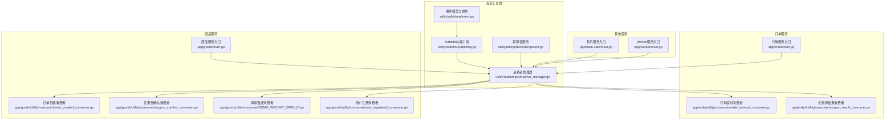
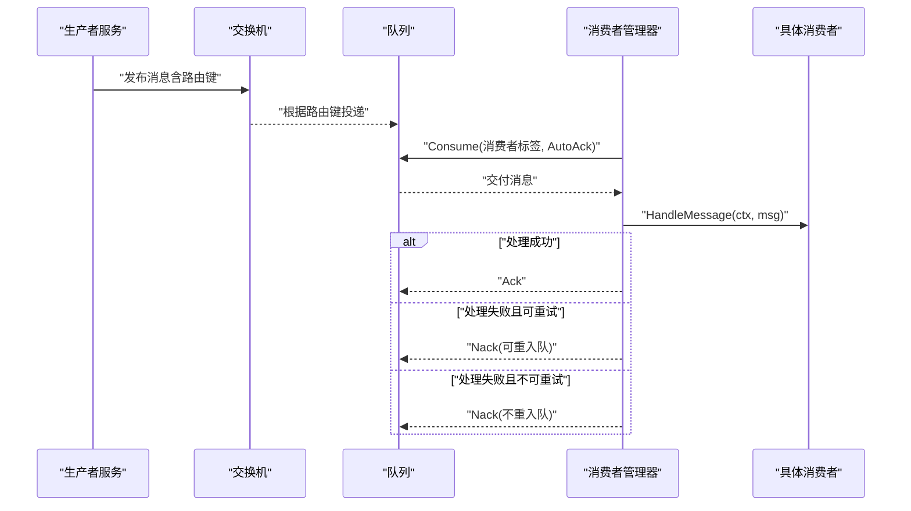
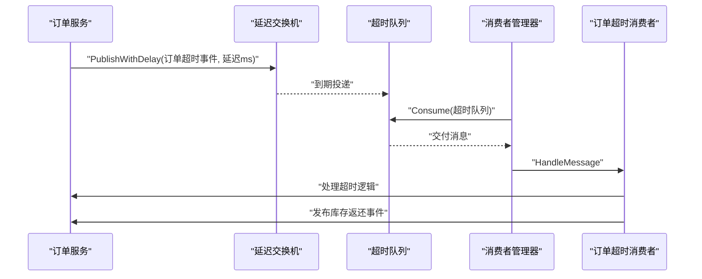
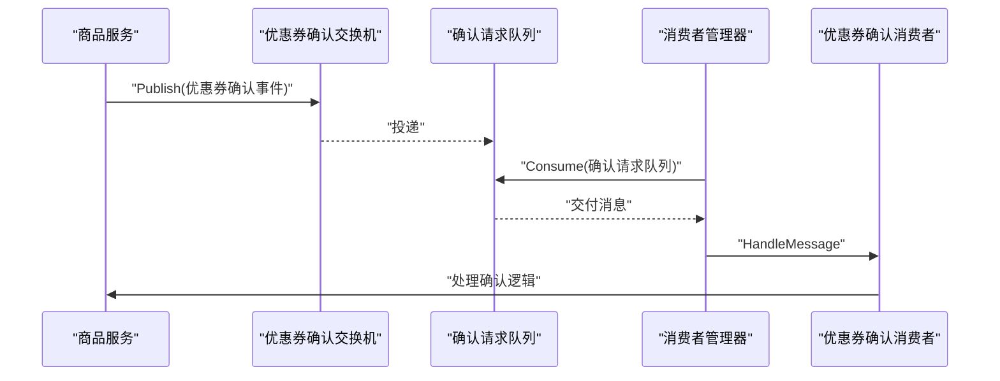
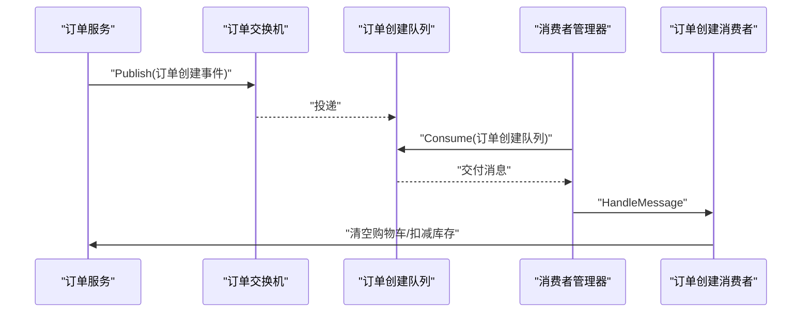
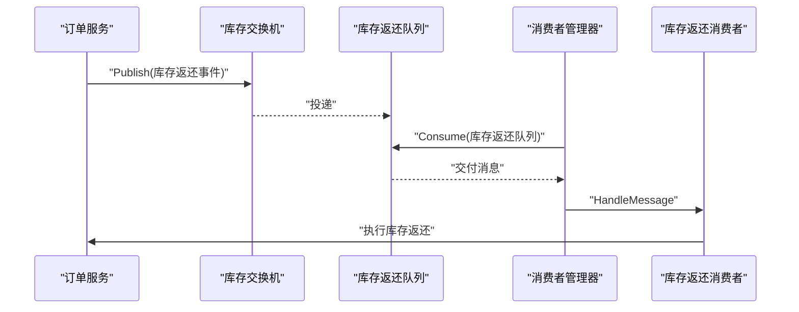
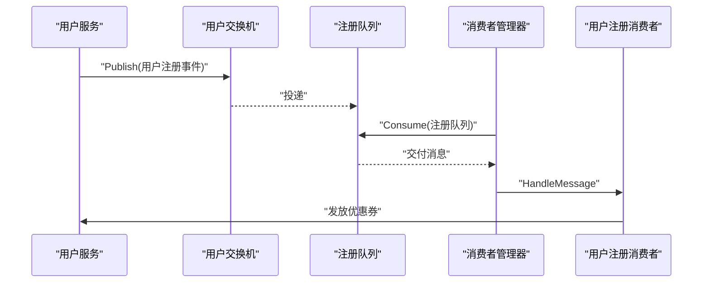
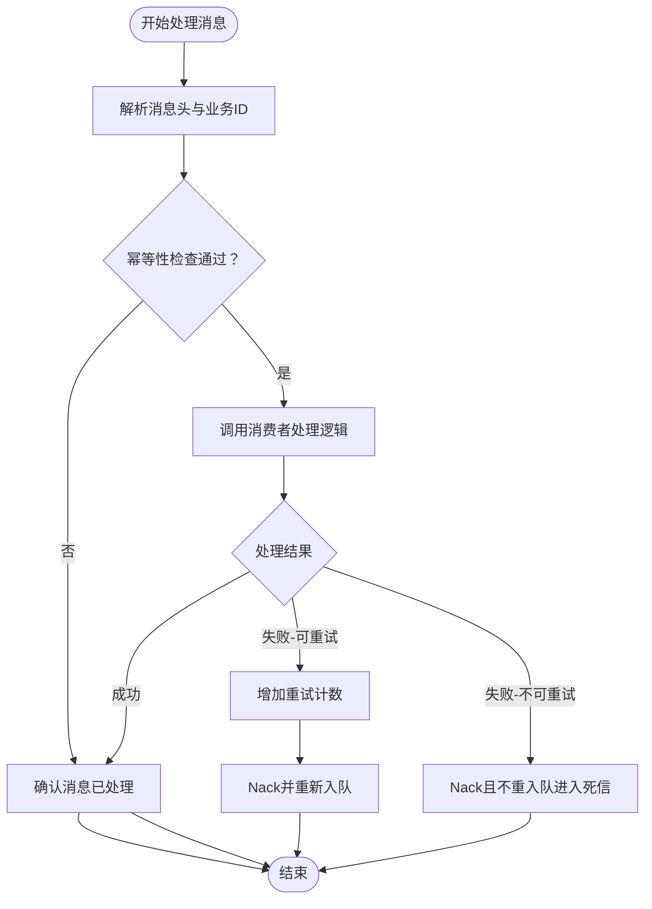
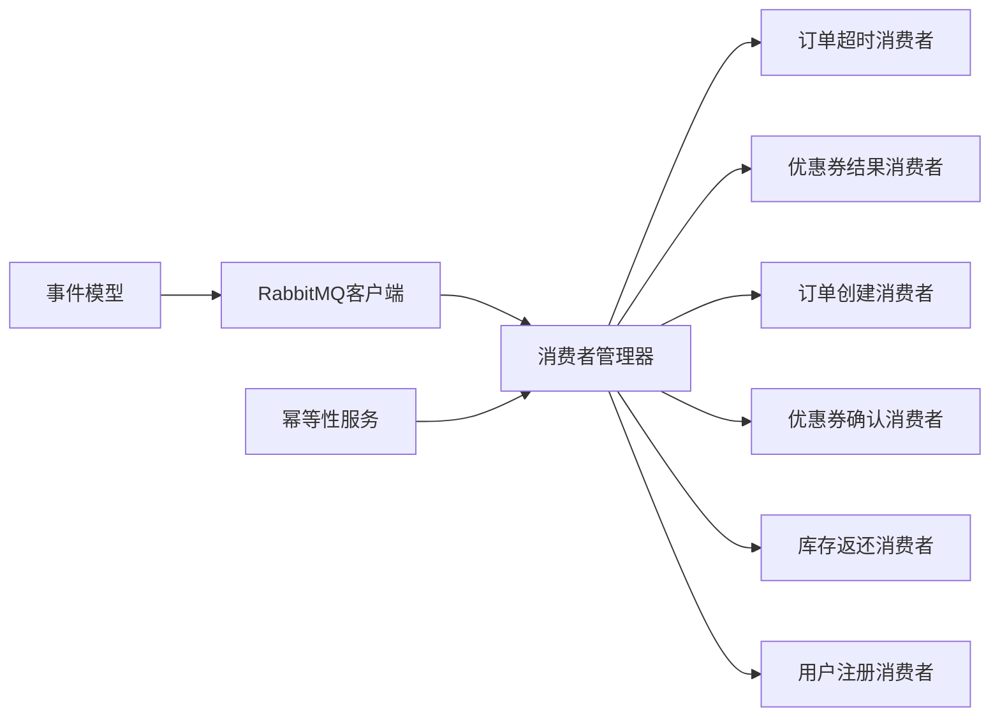

# 消息队列集成

<cite>
**本文引用的文件**
- [utility/rabbitmq/rabbitmq.go](file://utility/rabbitmq/rabbitmq.go)
- [utility/rabbitmq/consumer_manager.go](file://utility/rabbitmq/consumer_manager.go)
- [utility/rabbitmq/event.go](file://utility/rabbitmq/event.go)
- [utility/idempotent/idempotent.go](file://utility/idempotent/idempotent.go)
- [app/order/utility/consumer/order_timeout_consumer.go](file://app/order/utility/consumer/order_timeout_consumer.go)
- [app/order/utility/consumer/coupon_result_consumer.go](file://app/order/utility/consumer/coupon_result_consumer.go)
- [app/goods/utility/consumer/order_created_consumer.go](file://app/goods/utility/consumer/order_created_consumer.go)
- [app/goods/utility/consumer/coupon_confirm_consumer.go](file://app/goods/utility/consumer/coupon_confirm_consumer.go)
- [app/goods/utility/consumer/DEMO_WECHAT_OPEN_ID.go](file://app/goods/utility/consumer/DEMO_WECHAT_OPEN_ID.go)
- [app/goods/utility/consumer/user_registered_consumer.go](file://app/goods/utility/consumer/user_registered_consumer.go)
- [app/order/main.go](file://app/order/main.go)
- [app/goods/main.go](file://app/goods/main.go)
- [app/flash-sale/main.go](file://app/flash-sale/main.go)
- [app/worker/main.go](file://app/worker/main.go)
</cite>

## 目录
1. [简介](#简介)
2. [项目结构](#项目结构)
3. [核心组件](#核心组件)
4. [架构总览](#架构总览)
5. [详细组件分析](#详细组件分析)
6. [依赖关系分析](#依赖关系分析)
7. [性能考虑](#性能考虑)
8. [故障排查指南](#故障排查指南)
9. [结论](#结论)
10. [附录](#附录)

## 简介
本文件系统性梳理订单服务中消息队列的集成方案，覆盖订单超时处理、优惠券结果通知、订单状态同步等异步处理流程。内容包括消息生产者配置、消费者管理、路由策略、持久化机制、幂等性设计、重试与死信处理、监控告警以及RabbitMQ客户端配置、消费者组管理、序列化与分布式事务处理等技术要点，并给出架构设计、性能优化与故障处理建议。

## 项目结构
消息队列能力由统一的工具层提供，各业务服务通过事件发布/订阅的方式解耦协作。核心目录与职责如下：
- utility/rabbitmq：RabbitMQ客户端封装、消费者管理器、事件模型与发布函数
- utility/idempotent：幂等性服务（基于Redis）
- app/order/utility/consumer：订单侧消费者（超时、优惠券结果）
- app/goods/utility/consumer：商品侧消费者（订单创建、优惠券确认、库存返还、用户注册）
- app/flash-sale、app/worker：其他服务对消息队列的使用示例

图表来源
- [utility/rabbitmq/rabbitmq.go](file://utility/rabbitmq/rabbitmq.go#L1-L196)
- [utility/rabbitmq/consumer_manager.go](file://utility/rabbitmq/consumer_manager.go#L1-L446)
- [utility/rabbitmq/event.go](file://utility/rabbitmq/event.go#L1-L269)
- [utility/idempotent/idempotent.go](file://utility/idempotent/idempotent.go#L1-L153)
- [app/order/utility/consumer/order_timeout_consumer.go](file://app/order/utility/consumer/order_timeout_consumer.go#L1-L87)
- [app/order/utility/consumer/coupon_result_consumer.go](file://app/order/utility/consumer/coupon_result_consumer.go#L1-L54)
- [app/goods/utility/consumer/order_created_consumer.go](file://app/goods/utility/consumer/order_created_consumer.go#L1-L65)
- [app/goods/utility/consumer/coupon_confirm_consumer.go](file://app/goods/utility/consumer/coupon_confirm_consumer.go#L1-L55)
- [app/goods/utility/consumer/DEMO_WECHAT_OPEN_ID.go](file://app/goods/utility/consumer/DEMO_WECHAT_OPEN_ID.go#L1-L58)
- [app/goods/utility/consumer/user_registered_consumer.go](file://app/goods/utility/consumer/user_registered_consumer.go#L1-L55)
- [app/order/main.go](file://app/order/main.go#L1-L23)
- [app/goods/main.go](file://app/goods/main.go#L1-L35)
- [app/flash-sale/main.go](file://app/flash-sale/main.go#L1-L38)
- [app/worker/main.go](file://app/worker/main.go#L1-L48)

章节来源
- [utility/rabbitmq/rabbitmq.go](file://utility/rabbitmq/rabbitmq.go#L1-L196)
- [utility/rabbitmq/consumer_manager.go](file://utility/rabbitmq/consumer_manager.go#L1-L446)
- [utility/rabbitmq/event.go](file://utility/rabbitmq/event.go#L1-L269)
- [utility/idempotent/idempotent.go](file://utility/idempotent/idempotent.go#L1-L153)
- [app/order/utility/consumer/order_timeout_consumer.go](file://app/order/utility/consumer/order_timeout_consumer.go#L1-L87)
- [app/order/utility/consumer/coupon_result_consumer.go](file://app/order/utility/consumer/coupon_result_consumer.go#L1-L54)
- [app/goods/utility/consumer/order_created_consumer.go](file://app/goods/utility/consumer/order_created_consumer.go#L1-L65)
- [app/goods/utility/consumer/coupon_confirm_consumer.go](file://app/goods/utility/consumer/coupon_confirm_consumer.go#L1-L55)
- [app/goods/utility/consumer/DEMO_WECHAT_OPEN_ID.go](file://app/goods/utility/consumer/DEMO_WECHAT_OPEN_ID.go#L1-L58)
- [app/goods/utility/consumer/user_registered_consumer.go](file://app/goods/utility/consumer/user_registered_consumer.go#L1-L55)
- [app/order/main.go](file://app/order/main.go#L1-L23)
- [app/goods/main.go](file://app/goods/main.go#L1-L35)
- [app/flash-sale/main.go](file://app/flash-sale/main.go#L1-L38)
- [app/worker/main.go](file://app/worker/main.go#L1-L48)

## 核心组件
- RabbitMQ客户端封装：提供连接、声明交换机/队列、绑定、发布（含延迟）、消费、QoS设置与关闭等能力，并内置指数退避重连策略。
- 消费者管理器：统一管理消费者生命周期、队列初始化、并发与重试、幂等性检查、错误分类与重入队策略。
- 事件模型与发布：定义订单超时、订单创建、库存返还、优惠券确认/结果、用户注册等事件及对应的发布函数。
- 幂等性服务：基于Redis的分布式幂等锁，支持生成幂等键、尝试加锁、释放锁与检查加锁。

章节来源
- [utility/rabbitmq/rabbitmq.go](file://utility/rabbitmq/rabbitmq.go#L1-L196)
- [utility/rabbitmq/consumer_manager.go](file://utility/rabbitmq/consumer_manager.go#L1-L446)
- [utility/rabbitmq/event.go](file://utility/rabbitmq/event.go#L1-L269)
- [utility/idempotent/idempotent.go](file://utility/idempotent/idempotent.go#L1-L153)

## 架构总览
消息在服务间通过“交换机-队列-路由键”的拓扑进行传递，消费者管理器负责声明与绑定，消费者按配置拉取消息并处理。延迟消息通过延迟交换机实现，重试与死信通过消息头与策略控制。

图表来源
- [utility/rabbitmq/rabbitmq.go](file://utility/rabbitmq/rabbitmq.go#L84-L137)
- [utility/rabbitmq/consumer_manager.go](file://utility/rabbitmq/consumer_manager.go#L196-L263)

## 详细组件分析

### 订单超时处理（延迟队列）
- 场景：订单创建后启动定时任务，到期触发延迟消息，订单服务消费者处理超时未支付并返还库存。
- 关键点：
  - 延迟交换机：使用延迟类型交换机，发布时携带延迟毫秒数。
  - 消费者：校验事件类型与时间戳，调用订单逻辑处理并异步发布库存返还事件。
  - 重试：消费者内部未显式重试，依赖上层定时/补偿机制。

图表来源
- [utility/rabbitmq/event.go](file://utility/rabbitmq/event.go#L152-L186)
- [utility/rabbitmq/rabbitmq.go](file://utility/rabbitmq/rabbitmq.go#L103-L124)
- [app/order/utility/consumer/order_timeout_consumer.go](file://app/order/utility/consumer/order_timeout_consumer.go#L39-L86)

章节来源
- [utility/rabbitmq/event.go](file://utility/rabbitmq/event.go#L146-L186)
- [utility/rabbitmq/rabbitmq.go](file://utility/rabbitmq/rabbitmq.go#L103-L124)
- [app/order/utility/consumer/order_timeout_consumer.go](file://app/order/utility/consumer/order_timeout_consumer.go#L1-L87)

### 优惠券结果通知（异步回调）
- 场景：商品服务发起优惠券确认请求，订单服务异步返回结果，订单服务据此更新订单状态。
- 关键点：
  - 生产者：发布优惠券确认事件。
  - 消费者：解析事件，调用订单逻辑处理结果。
  - 幂等：消费者管理器统一做幂等检查，避免重复处理。

图表来源
- [utility/rabbitmq/event.go](file://utility/rabbitmq/event.go#L72-L107)
- [app/goods/utility/consumer/coupon_confirm_consumer.go](file://app/goods/utility/consumer/coupon_confirm_consumer.go#L34-L54)

章节来源
- [utility/rabbitmq/event.go](file://utility/rabbitmq/event.go#L58-L107)
- [app/goods/utility/consumer/coupon_confirm_consumer.go](file://app/goods/utility/consumer/coupon_confirm_consumer.go#L1-L55)

### 订单状态同步（跨服务）
- 场景：订单创建后，商品服务消费订单创建事件，执行清空购物车与扣减库存等操作。
- 关键点：
  - 路由：Topic交换机+路由键，确保精准投递。
  - 幂等：消费者管理器统一幂等检查。
  - 错误处理：失败时拒绝消息，交由重试或死信处理。

图表来源
- [utility/rabbitmq/event.go](file://utility/rabbitmq/event.go#L196-L224)
- [app/goods/utility/consumer/order_created_consumer.go](file://app/goods/utility/consumer/order_created_consumer.go#L32-L64)

章节来源
- [utility/rabbitmq/event.go](file://utility/rabbitmq/event.go#L188-L224)
- [app/goods/utility/consumer/order_created_consumer.go](file://app/goods/utility/consumer/order_created_consumer.go#L1-L65)

### 库存返还（补偿与重试）
- 场景：订单超时或异常导致库存未扣减，通过库存返还事件进行补偿。
- 关键点：
  - 事件：订单号与商品明细。
  - 消费者：执行库存返还逻辑，失败时可结合重试策略或人工介入。

图表来源
- [utility/rabbitmq/event.go](file://utility/rabbitmq/event.go#L238-L268)
- [app/goods/utility/consumer/DEMO_WECHAT_OPEN_ID.go](file://app/goods/utility/consumer/DEMO_WECHAT_OPEN_ID.go#L31-L57)

章节来源
- [utility/rabbitmq/event.go](file://utility/rabbitmq/event.go#L226-L268)
- [app/goods/utility/consumer/DEMO_WECHAT_OPEN_ID.go](file://app/goods/utility/consumer/DEMO_WECHAT_OPEN_ID.go#L1-L58)

### 用户注册联动（营销）
- 场景：用户注册后，商品服务发放优惠券。
- 关键点：
  - Topic路由，精准匹配用户注册事件。
  - 幂等保障，避免重复发券。

图表来源
- [utility/rabbitmq/event.go](file://utility/rabbitmq/event.go#L23-L56)
- [app/goods/utility/consumer/user_registered_consumer.go](file://app/goods/utility/consumer/user_registered_consumer.go#L34-L54)

章节来源
- [utility/rabbitmq/event.go](file://utility/rabbitmq/event.go#L13-L56)
- [app/goods/utility/consumer/user_registered_consumer.go](file://app/goods/utility/consumer/user_registered_consumer.go#L1-L55)

### 消费者管理器与重试/死信策略
- 幂等性：基于消息ID、业务ID与消费者名生成幂等键，使用Redis SetNX实现分布式锁。
- 重试：根据错误类型与消息头重试计数决定是否重新入队；支持临时性/永久性错误分类。
- 死信：超过最大重试次数或永久性错误时拒绝消息且不重入队，进入死信队列（需配合RabbitMQ死信交换机配置）。
- 并发：通过QoS PrefetchCount控制并发度，避免过载。

图表来源
- [utility/rabbitmq/consumer_manager.go](file://utility/rabbitmq/consumer_manager.go#L196-L263)
- [utility/idempotent/idempotent.go](file://utility/idempotent/idempotent.go#L41-L79)

章节来源
- [utility/rabbitmq/consumer_manager.go](file://utility/rabbitmq/consumer_manager.go#L1-L446)
- [utility/idempotent/idempotent.go](file://utility/idempotent/idempotent.go#L1-L153)

### RabbitMQ客户端与连接重试
- 连接：从配置读取主机、端口、用户名、密码、虚拟主机，构造AMQP URL并建立连接。
- 重试：指数退避（初始间隔、最大间隔、最大重试时间、随机化因子），避免雪崩效应。
- 发布：JSON序列化消息体，支持持久化与延迟（x-delay）。
- 声明：交换机（含延迟交换机类型）、队列、绑定；QoS设置。

章节来源
- [utility/rabbitmq/rabbitmq.go](file://utility/rabbitmq/rabbitmq.go#L19-L82)
- [utility/rabbitmq/rabbitmq.go](file://utility/rabbitmq/rabbitmq.go#L149-L196)

### 事件模型与序列化
- 事件类型：用户注册、优惠券确认/结果、订单创建、订单超时、库存返还等。
- 序列化：统一使用JSON；消费者侧提供通用事件解析辅助函数。
- 路由：Topic交换机+路由键，确保事件精准投递。

章节来源
- [utility/rabbitmq/event.go](file://utility/rabbitmq/event.go#L1-L269)

## 依赖关系分析
- 低耦合：各服务通过事件解耦，仅依赖消息契约与配置。
- 一致性：幂等性服务与消费者管理器共同保证消息处理的最终一致性。
- 可观测性：日志记录消息ID、路由键、处理耗时与重试情况，便于追踪与审计。

图表来源
- [utility/rabbitmq/rabbitmq.go](file://utility/rabbitmq/rabbitmq.go#L1-L196)
- [utility/rabbitmq/consumer_manager.go](file://utility/rabbitmq/consumer_manager.go#L1-L446)
- [utility/rabbitmq/event.go](file://utility/rabbitmq/event.go#L1-L269)
- [utility/idempotent/idempotent.go](file://utility/idempotent/idempotent.go#L1-L153)

## 性能考虑
- 并发控制：合理设置PrefetchCount，避免消费者过载；根据CPU/IO特性调整。
- 序列化开销：保持事件体简洁，避免冗余字段；必要时启用压缩（如Gzip）。
- 连接池与复用：客户端复用Channel与连接，减少频繁建连成本。
- 持久化权衡：持久化提升可靠性但降低吞吐，可根据业务SLA选择DeliveryMode。
- 延迟策略：批量延迟或合并事件，减少队列压力。
- 监控指标：消息积压、处理时延、重试率、死信率、连接数与内存占用。

## 故障排查指南
- 连接失败：检查RabbitMQ地址、凭证与vhost；查看指数退避日志与重试次数。
- 消息堆积：检查消费者处理耗时、并发度与资源瓶颈；必要时扩容消费者。
- 重复消费：确认幂等键生成规则与Redis可用性；核对消息头business_id与消息ID。
- 死信堆积：核查最大重试次数与死信交换机配置；定位不可恢复错误类型。
- 事件未达：核对交换机/队列/路由键配置；检查消息头与RoutingKey匹配。

章节来源
- [utility/rabbitmq/rabbitmq.go](file://utility/rabbitmq/rabbitmq.go#L19-L82)
- [utility/rabbitmq/consumer_manager.go](file://utility/rabbitmq/consumer_manager.go#L196-L263)
- [utility/idempotent/idempotent.go](file://utility/idempotent/idempotent.go#L117-L152)

## 结论
该消息队列集成方案通过统一的客户端与消费者管理器，实现了订单超时、优惠券结果、订单状态同步与库存补偿等关键业务的异步解耦。结合幂等性、重试与死信策略，有效提升了系统的可靠性与可维护性。建议在生产环境中完善监控告警、死信治理与容量规划，并持续优化事件模型与消费者并发策略。

## 附录
- 启动入口参考：
  - 订单服务：[app/order/main.go](file://app/order/main.go#L1-L23)
  - 商品服务：[app/goods/main.go](file://app/goods/main.go#L1-L35)
  - 秒杀服务：[app/flash-sale/main.go](file://app/flash-sale/main.go#L1-L38)
  - Worker服务：[app/worker/main.go](file://app/worker/main.go#L1-L48)