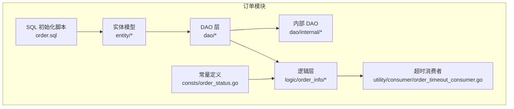
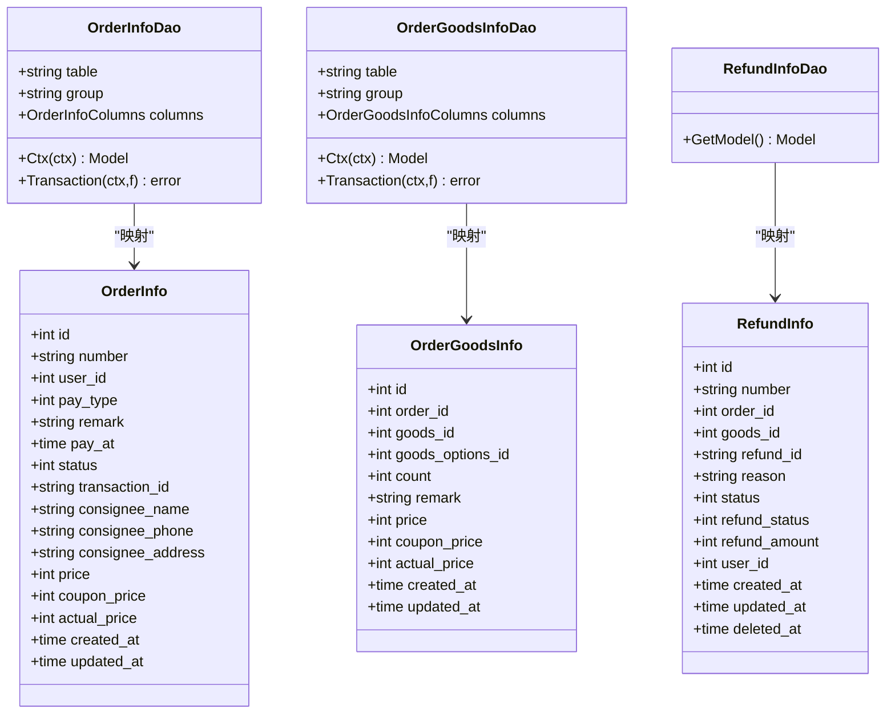
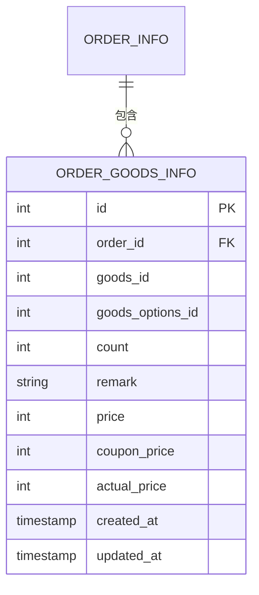
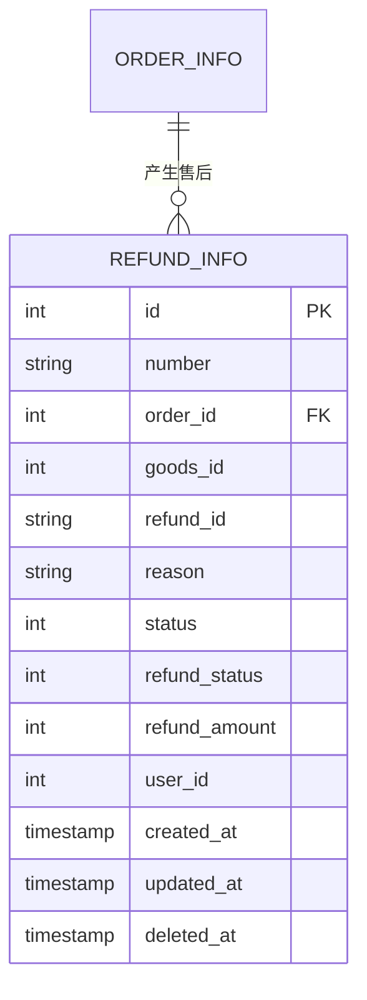
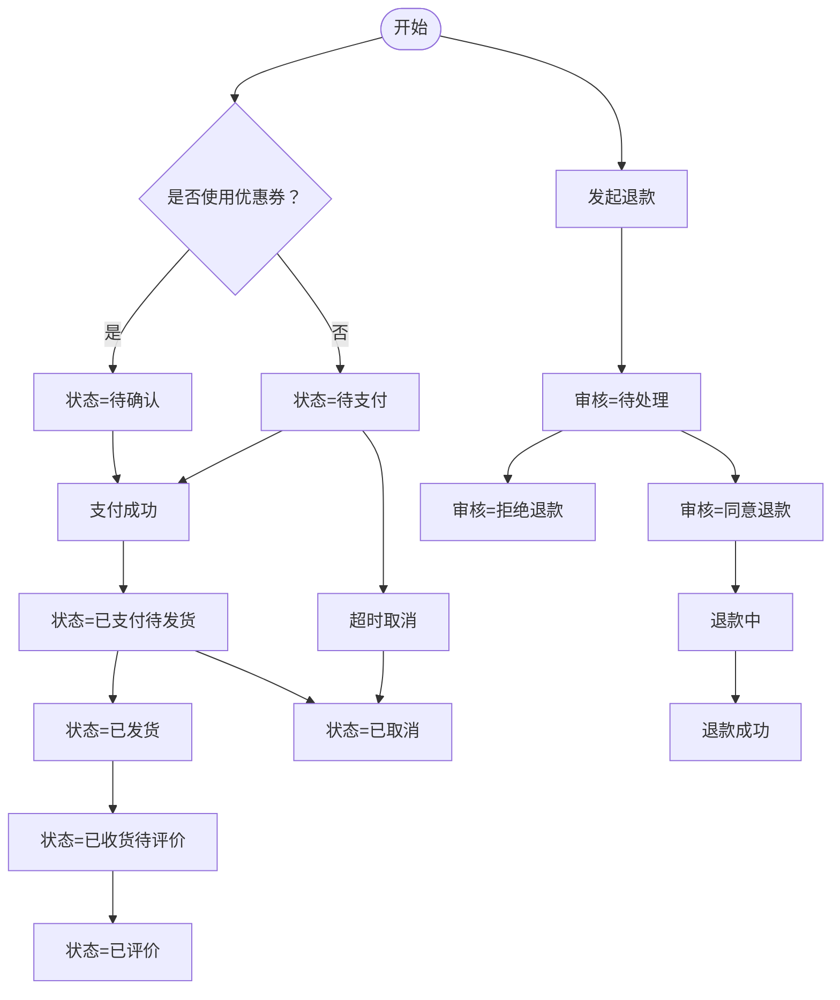
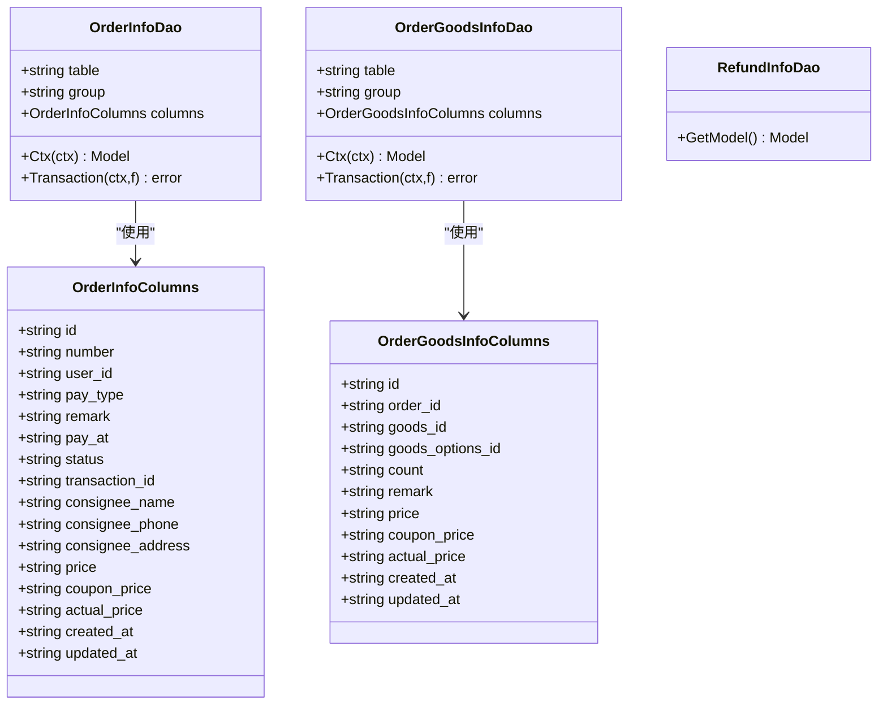
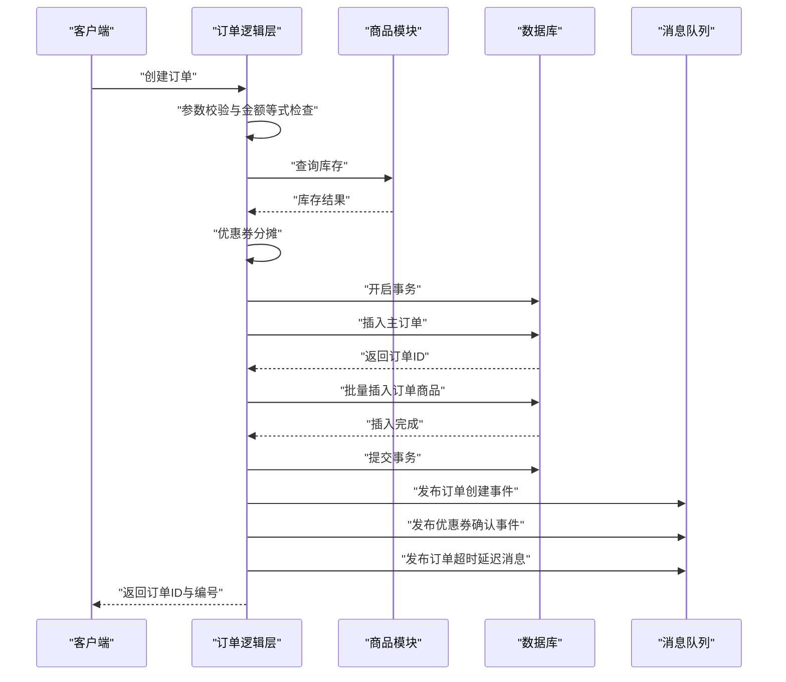
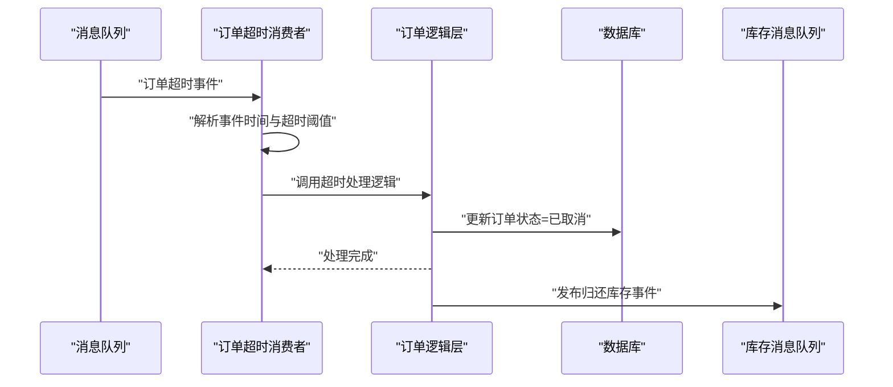
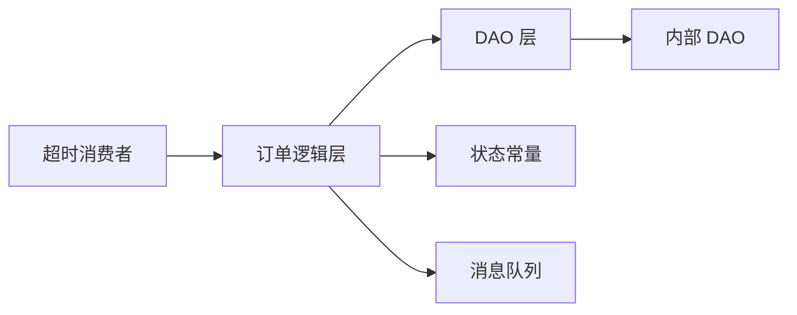

# 订单数据模型设计

<cite>
**本文档引用的文件**
- [app/order/hack/order.sql](file://app/order/hack/order.sql)
- [app/order/internal/model/entity/order_info.go](file://app/order/internal/model/entity/order_info.go)
- [app/order/internal/model/entity/order_goods_info.go](file://app/order/internal/model/entity/order_goods_info.go)
- [app/order/internal/model/entity/refund_info.go](file://app/order/internal/model/entity/refund_info.go)
- [app/order/internal/consts/order_status.go](file://app/order/internal/consts/order_status.go)
- [app/order/internal/dao/order_info.go](file://app/order/internal/dao/order_info.go)
- [app/order/internal/dao/order_goods_info.go](file://app/order/internal/dao/order_goods_info.go)
- [app/order/internal/dao/refund_info.go](file://app/order/internal/dao/refund_info.go)
- [app/order/internal/dao/internal/order_info.go](file://app/order/internal/dao/internal/order_info.go)
- [app/order/internal/dao/internal/order_goods_info.go](file://app/order/internal/dao/internal/order_goods_info.go)
- [app/order/internal/logic/order_info/order_info.go](file://app/order/internal/logic/order_info/order_info.go)
- [app/order/utility/consumer/order_timeout_consumer.go](file://app/order/utility/consumer/order_timeout_consumer.go)
</cite>

## 目录
1. [简介](#简介)
2. [项目结构](#项目结构)
3. [核心组件](#核心组件)
4. [架构总览](#架构总览)
5. [详细组件分析](#详细组件分析)
6. [依赖分析](#依赖分析)
7. [性能考虑](#性能考虑)
8. [故障排查指南](#故障排查指南)
9. [结论](#结论)
10. [附录](#附录)

## 简介
本文件系统化梳理订单相关数据模型设计，覆盖订单主表、订单商品明细表、售后退款表的核心结构与业务规则，明确字段定义、数据类型、约束条件、索引设计、字段注释与业务含义；解释订单与商品的关联关系、订单状态的存储方式、订单金额的计算逻辑；给出数据完整性约束、外键关系设计、查询性能优化、数据迁移策略等技术要点，并提供数据模型的ER图、字段说明与数据库设计最佳实践。

## 项目结构
围绕订单模块的数据模型，代码组织遵循“DAO 层 + 内部 DAO + 实体模型 + 逻辑层 + 常量与消费端”的分层设计：
- 表结构定义位于 SQL 文件中，对应实体模型位于 internal/model/entity 下；
- DAO 层封装数据库访问，内部 DAO 提供列名常量与事务支持；
- 逻辑层实现订单创建、状态变更、超时处理等业务流程；
- 常量文件集中管理订单状态与退款状态枚举；
- 消费者负责处理订单超时等异步事件。



**图表来源**
- [app/order/hack/order.sql](file://app/order/hack/order.sql#L1-L96)
- [app/order/internal/model/entity/order_info.go](file://app/order/internal/model/entity/order_info.go#L1-L30)
- [app/order/internal/dao/order_info.go](file://app/order/internal/dao/order_info.go#L1-L23)
- [app/order/internal/dao/internal/order_info.go](file://app/order/internal/dao/internal/order_info.go#L1-L110)
- [app/order/internal/logic/order_info/order_info.go](file://app/order/internal/logic/order_info/order_info.go#L1-L502)
- [app/order/internal/consts/order_status.go](file://app/order/internal/consts/order_status.go#L1-L38)
- [app/order/utility/consumer/order_timeout_consumer.go](file://app/order/utility/consumer/order_timeout_consumer.go#L1-L87)

**章节来源**
- [app/order/hack/order.sql](file://app/order/hack/order.sql#L1-L96)
- [app/order/internal/model/entity/order_info.go](file://app/order/internal/model/entity/order_info.go#L1-L30)
- [app/order/internal/dao/order_info.go](file://app/order/internal/dao/order_info.go#L1-L23)
- [app/order/internal/dao/internal/order_info.go](file://app/order/internal/dao/internal/order_info.go#L1-L110)
- [app/order/internal/logic/order_info/order_info.go](file://app/order/internal/logic/order_info/order_info.go#L1-L502)
- [app/order/internal/consts/order_status.go](file://app/order/internal/consts/order_status.go#L1-L38)
- [app/order/utility/consumer/order_timeout_consumer.go](file://app/order/utility/consumer/order_timeout_consumer.go#L1-L87)

## 核心组件
本节聚焦订单相关的核心数据模型与业务规则，包括：
- 订单主表：存储订单基础信息、金额与状态
- 订单商品明细表：记录每笔订单中的具体商品及优惠分摊
- 售后退款表：记录退款申请、审核与退款状态
- 订单状态与退款状态枚举：统一状态语义
- DAO 与内部 DAO：提供列名常量、事务封装与模型构造
- 逻辑层：订单创建、状态更新、超时处理、优惠券结果处理等

**章节来源**
- [app/order/hack/order.sql](file://app/order/hack/order.sql#L35-L52)
- [app/order/hack/order.sql](file://app/order/hack/order.sql#L5-L18)
- [app/order/hack/order.sql](file://app/order/hack/order.sql)
- [app/order/internal/model/entity/order_info.go](file://app/order/internal/model/entity/order_info.go#L11-L29)
- [app/order/internal/model/entity/order_goods_info.go](file://app/order/internal/model/entity/order_goods_info.go#L11-L24)
- [app/order/internal/model/entity/refund_info.go](file://app/order/internal/model/entity/refund_info.go#L11-L26)
- [app/order/internal/consts/order_status.go](file://app/order/internal/consts/order_status.go#L3-L37)
- [app/order/internal/dao/internal/order_info.go](file://app/order/internal/dao/internal/order_info.go#L22-L60)
- [app/order/internal/dao/internal/order_goods_info.go](file://app/order/internal/dao/internal/order_goods_info.go#L22-L50)

## 架构总览
订单数据模型采用“表结构 + 实体 + DAO + 逻辑 + 消费”的分层架构，确保职责清晰、扩展性强。下图展示关键对象之间的关系与交互：



**图表来源**
- [app/order/internal/model/entity/order_info.go](file://app/order/internal/model/entity/order_info.go#L11-L29)
- [app/order/internal/model/entity/order_goods_info.go](file://app/order/internal/model/entity/order_goods_info.go#L11-L24)
- [app/order/internal/model/entity/refund_info.go](file://app/order/internal/model/entity/refund_info.go#L11-L26)
- [app/order/internal/dao/internal/order_info.go](file://app/order/internal/dao/internal/order_info.go#L14-L109)
- [app/order/internal/dao/internal/order_goods_info.go](file://app/order/internal/dao/internal/order_goods_info.go#L14-L99)
- [app/order/internal/dao/refund_info.go](file://app/order/internal/dao/refund_info.go#L12-L29)

## 详细组件分析

### 订单主表（order_info）
- 字段定义与业务含义
  - 编号、用户ID、支付方式、备注、支付时间、状态、收货人信息、订单金额、优惠券金额、实付金额、创建/更新时间
- 数据类型与约束
  - 主键自增整型；状态字段为小整型；金额字段统一以“分”为单位存储，便于精确计算与避免浮点误差
- 索引设计建议
  - 建议在 user_id、number、status、pay_at 上建立合适索引，以支撑按用户、按单号、按状态、按支付时间的查询
- 金额计算逻辑
  - 实付金额 = 订单总金额 - 优惠券金额；逻辑层在创建订单时会校验该等式
- 状态存储与流转
  - 状态枚举由常量文件统一定义，涵盖待支付、已支付待发货、已发货、已收货待评价、已评价、待确认、已取消、发起退款等

```mermaid
erDiagram
ORDER_INFO {
int id PK
string number UK
int user_id IDX_USER
int pay_type
string remark
timestamp pay_at IDX_PAY_TIME
int status IDX_STATUS
string transaction_id
string consignee_name
string consignee_phone
string consignee_address
int price
int coupon_price
int actual_price
timestamp created_at
timestamp updated_at
}
```

**图表来源**
- [app/order/hack/order.sql](file://app/order/hack/order.sql#L35-L52)
- [app/order/internal/model/entity/order_info.go](file://app/order/internal/model/entity/order_info.go#L12-L29)
- [app/order/internal/consts/order_status.go](file://app/order/internal/consts/order_status.go#L6-L16)

**章节来源**
- [app/order/hack/order.sql](file://app/order/hack/order.sql#L35-L52)
- [app/order/internal/model/entity/order_info.go](file://app/order/internal/model/entity/order_info.go#L11-L29)
- [app/order/internal/consts/order_status.go](file://app/order/internal/consts/order_status.go#L3-L16)

### 订单商品明细表（order_goods_info）
- 字段定义与业务含义
  - 订单商品明细记录，包含商品ID、规格ID、购买数量、商品单价、优惠分摊、实付金额、创建/更新时间
- 数据类型与约束
  - 主键自增整型；金额字段同样以“分”为单位存储
- 关系设计
  - 通过 order_id 关联到订单主表，形成一对多关系
- 金额计算逻辑
  - 明细实付金额 = 明细单价 - 明细优惠分摊；逻辑层在创建订单时对优惠券进行合理分摊



**图表来源**
- [app/order/hack/order.sql](file://app/order/hack/order.sql#L5-L18)
- [app/order/internal/model/entity/order_goods_info.go](file://app/order/internal/model/entity/order_goods_info.go#L11-L24)

**章节来源**
- [app/order/hack/order.sql](file://app/order/hack/order.sql#L5-L18)
- [app/order/internal/model/entity/order_goods_info.go](file://app/order/internal/model/entity/order_goods_info.go#L11-L24)

### 售后退款表（refund_info）
- 字段定义与业务含义
  - 包含售后单号、订单ID、商品ID、退款原因、审核状态、退款状态、退款金额、用户ID、创建/更新/删除时间
- 状态设计
  - 审核状态：待处理、同意退款、拒绝退款
  - 退款状态：未退款、退款中、退款成功、退款失败
- 与订单的关系
  - 通过 order_id 关联订单主表，便于按订单维度追踪售后



**图表来源**
- [app/order/hack/order.sql](file://app/order/hack/order.sql#L77-L90)
- [app/order/internal/model/entity/refund_info.go](file://app/order/internal/model/entity/refund_info.go#L11-L26)

**章节来源**
- [app/order/hack/order.sql](file://app/order/hack/order.sql#L77-L90)
- [app/order/internal/model/entity/refund_info.go](file://app/order/internal/model/entity/refund_info.go#L11-L26)

### 订单状态与退款状态枚举
- 订单状态
  - 待支付、已支付待发货、已发货、已收货待评价、已评价、待确认（使用优惠券）、已取消、发起退款
- 退款状态
  - 审核状态：待处理、同意退款、拒绝退款
  - 退款状态：未退款、退款中、退款成功、退款失败



**图表来源**
- [app/order/internal/consts/order_status.go](file://app/order/internal/consts/order_status.go#L6-L37)

**章节来源**
- [app/order/internal/consts/order_status.go](file://app/order/internal/consts/order_status.go#L3-L37)

### DAO 与内部 DAO
- 内部 DAO
  - 统一维护表名、列名常量、上下文模型构造、事务封装
- DAO 封装
  - 对外暴露全局单例，简化上层调用；内部 DAO 提供列名与事务能力



**图表来源**
- [app/order/internal/dao/internal/order_info.go](file://app/order/internal/dao/internal/order_info.go#L14-L109)
- [app/order/internal/dao/internal/order_goods_info.go](file://app/order/internal/dao/internal/order_goods_info.go#L14-L99)
- [app/order/internal/dao/order_info.go](file://app/order/internal/dao/order_info.go#L13-L20)
- [app/order/internal/dao/order_goods_info.go](file://app/order/internal/dao/order_goods_info.go#L13-L20)
- [app/order/internal/dao/refund_info.go](file://app/order/internal/dao/refund_info.go#L12-L29)

**章节来源**
- [app/order/internal/dao/internal/order_info.go](file://app/order/internal/dao/internal/order_info.go#L1-L110)
- [app/order/internal/dao/internal/order_goods_info.go](file://app/order/internal/dao/internal/order_goods_info.go#L1-L100)
- [app/order/internal/dao/order_info.go](file://app/order/internal/dao/order_info.go#L1-L23)
- [app/order/internal/dao/order_goods_info.go](file://app/order/internal/dao/order_goods_info.go#L1-L23)
- [app/order/internal/dao/refund_info.go](file://app/order/internal/dao/refund_info.go#L1-L30)

### 逻辑层：订单创建与状态管理
- 订单创建流程
  - 参数校验（至少一个商品、订单总价与明细总价一致、实付金额等式、优惠券上限）
  - 库存校验（调用商品模块获取库存）
  - 优惠券分摊（预设优惠优先，剩余按单价比例分摊）
  - 事务内写入主订单与订单商品明细
  - 成功后发布事件（订单创建、优惠券确认、订单超时延迟消息）
- 订单状态更新
  - 支付成功时设置支付时间与状态
  - 超时取消仅对“待支付”状态生效
- 退款处理
  - 审核状态与退款状态分别管理
  - 退款成功后可触发后续业务动作



**图表来源**
- [app/order/internal/logic/order_info/order_info.go](file://app/order/internal/logic/order_info/order_info.go#L27-L212)

**章节来源**
- [app/order/internal/logic/order_info/order_info.go](file://app/order/internal/logic/order_info/order_info.go#L27-L212)

### 超时取消流程
- 消费者监听订单超时队列，解析事件时间与配置的超时阈值
- 若到达取消时间，则调用逻辑层更新订单状态为“已取消”，并发布“归还库存”事件



**图表来源**
- [app/order/utility/consumer/order_timeout_consumer.go](file://app/order/utility/consumer/order_timeout_consumer.go#L39-L86)
- [app/order/internal/logic/order_info/order_info.go](file://app/order/internal/logic/order_info/order_info.go#L451-L471)

**章节来源**
- [app/order/utility/consumer/order_timeout_consumer.go](file://app/order/utility/consumer/order_timeout_consumer.go#L1-L87)
- [app/order/internal/logic/order_info/order_info.go](file://app/order/internal/logic/order_info/order_info.go#L451-L471)

## 依赖分析
- 组件耦合
  - 逻辑层依赖 DAO 层与内部 DAO，DAO 层依赖内部 DAO 的列名与事务封装
  - 常量文件被逻辑层用于状态判断与更新
  - 消费者依赖逻辑层提供的状态更新与事件发布能力
- 外部依赖
  - 数据库 ORM（GoFrame gdb）
  - 消息队列（RabbitMQ）



**图表来源**
- [app/order/internal/logic/order_info/order_info.go](file://app/order/internal/logic/order_info/order_info.go#L1-L502)
- [app/order/internal/dao/order_info.go](file://app/order/internal/dao/order_info.go#L1-L23)
- [app/order/internal/dao/internal/order_info.go](file://app/order/internal/dao/internal/order_info.go#L1-L110)
- [app/order/internal/consts/order_status.go](file://app/order/internal/consts/order_status.go#L1-L38)
- [app/order/utility/consumer/order_timeout_consumer.go](file://app/order/utility/consumer/order_timeout_consumer.go#L1-L87)

**章节来源**
- [app/order/internal/logic/order_info/order_info.go](file://app/order/internal/logic/order_info/order_info.go#L1-L502)
- [app/order/internal/dao/order_info.go](file://app/order/internal/dao/order_info.go#L1-L23)
- [app/order/internal/dao/internal/order_info.go](file://app/order/internal/dao/internal/order_info.go#L1-L110)
- [app/order/internal/consts/order_status.go](file://app/order/internal/consts/order_status.go#L1-L38)
- [app/order/utility/consumer/order_timeout_consumer.go](file://app/order/utility/consumer/order_timeout_consumer.go#L1-L87)

## 性能考虑
- 存储精度
  - 金额统一以“分”为单位存储，避免浮点误差与精度问题
- 事务与批量写入
  - 订单与订单商品明细在事务内批量写入，保证一致性与吞吐
- 查询优化
  - 建议在 user_id、number、status、pay_at 等高频查询字段上建立索引
  - 分页查询与聚合统计（如按状态计数）需结合索引与必要时物化视图或缓存
- 异步解耦
  - 订单创建、优惠券确认、超时取消、库存归还等通过消息队列异步处理，降低主流程阻塞

[本节为通用性能建议，不直接分析具体文件]

## 故障排查指南
- 订单创建失败
  - 检查参数校验与金额等式是否满足；查看事务开启、提交与回滚日志
  - 关注库存查询异常与优惠券分摊逻辑
- 订单状态更新异常
  - 确认状态枚举与更新条件；注意仅对“待支付”状态允许超时取消
- 超时取消未生效
  - 核对消息队列配置、事件时间戳解析与超时阈值；确认事件类型匹配
- 退款状态不一致
  - 校验审核状态与退款状态的流转逻辑；关注退款金额与订单金额的一致性

**章节来源**
- [app/order/internal/logic/order_info/order_info.go](file://app/order/internal/logic/order_info/order_info.go#L27-L212)
- [app/order/utility/consumer/order_timeout_consumer.go](file://app/order/utility/consumer/order_timeout_consumer.go#L39-L86)

## 结论
本设计以“分”为单位存储金额、在事务内完成订单与明细写入、通过消息队列实现异步解耦，配合完善的订单状态与退款状态枚举，形成高可用、易扩展的订单数据模型。建议在生产环境中补充必要的索引、监控与告警，并持续优化超时阈值与库存归还策略。

[本节为总结性内容，不直接分析具体文件]

## 附录

### 字段说明与业务含义对照
- 订单主表（order_info）
  - number：订单编号，唯一标识
  - user_id：下单用户ID
  - pay_type：支付方式（微信/支付宝/云闪付）
  - remark：订单备注
  - pay_at：支付完成时间
  - status：订单状态（枚举）
  - transaction_id：第三方支付交易号
  - consignee_*：收货人信息
  - price/coupon_price/actual_price：订单总金额、优惠券抵扣、实付金额（单位：分）
- 订单商品明细（order_goods_info）
  - order_id：所属订单
  - goods_id/goods_options_id：商品与规格ID
  - count：购买数量
  - price/coupon_price/actual_price：单价、优惠分摊、实付单价（单位：分）
- 售后退款（refund_info）
  - order_id/goods_id：关联订单与商品
  - reason：退款原因
  - status/refund_status：审核状态与退款状态
  - refund_amount：退款金额（单位：分）

**章节来源**
- [app/order/hack/order.sql](file://app/order/hack/order.sql#L5-L18)
- [app/order/hack/order.sql](file://app/order/hack/order.sql#L35-L52)
- [app/order/hack/order.sql](file://app/order/hack/order.sql#L77-L90)
- [app/order/internal/model/entity/order_info.go](file://app/order/internal/model/entity/order_info.go#L11-L29)
- [app/order/internal/model/entity/order_goods_info.go](file://app/order/internal/model/entity/order_goods_info.go#L11-L24)
- [app/order/internal/model/entity/refund_info.go](file://app/order/internal/model/entity/refund_info.go#L11-L26)

### 数据完整性与外键关系
- 外键关系
  - order_goods_info.order_id → order_info.id（一对多）
  - refund_info.order_id → order_info.id（一对多）
- 完整性约束
  - 主键约束：各表主键自增
  - 唯一约束：订单编号（建议在数据库层面添加唯一索引）
  - 非空约束：金额与数量字段在业务层已做默认值与校验

**章节来源**
- [app/order/hack/order.sql](file://app/order/hack/order.sql#L5-L18)
- [app/order/hack/order.sql](file://app/order/hack/order.sql#L35-L52)
- [app/order/hack/order.sql](file://app/order/hack/order.sql#L77-L90)

### 查询性能优化建议
- 常见查询场景
  - 按用户ID与状态分页查询订单列表
  - 按订单编号查询订单详情
  - 按状态统计订单数量
- 索引建议
  - user_id、status：支撑按用户与状态过滤
  - number：支撑按订单编号快速定位
  - pay_at：支撑按支付时间范围查询
- 其他
  - 对高频统计场景可引入缓存或物化视图
  - 批量写入与事务控制确保一致性

**章节来源**
- [app/order/internal/logic/order_info/order_info.go](file://app/order/internal/logic/order_info/order_info.go#L274-L336)
- [app/order/internal/logic/order_info/order_info.go](file://app/order/internal/logic/order_info/order_info.go#L416-L449)

### 数据迁移策略
- 版本演进
  - 新增字段建议使用非空默认值或分阶段上线，避免影响存量数据
  - 对历史订单补齐缺失字段（如新增的交易号）可通过后台任务批量补全
- 金额字段
  - 保持“分”为单位不变，迁移过程中避免除法与浮点运算
- 状态迁移
  - 通过状态枚举映射与兼容逻辑，逐步替换旧状态值

[本节为通用迁移建议，不直接分析具体文件]