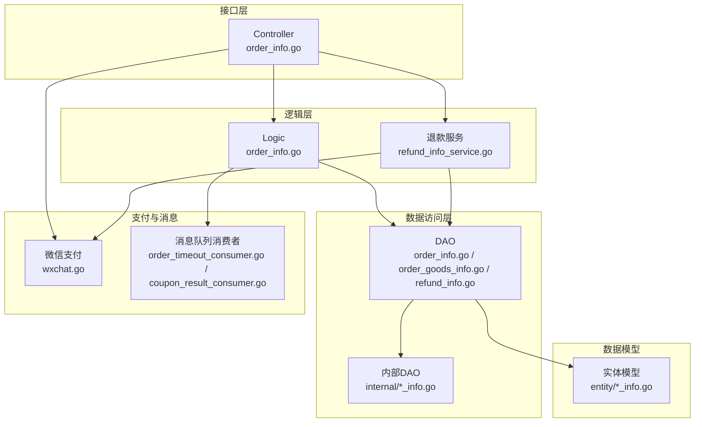
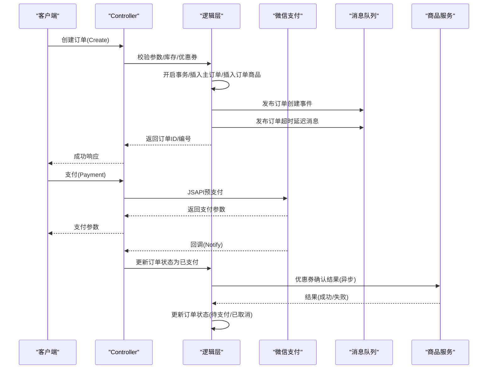
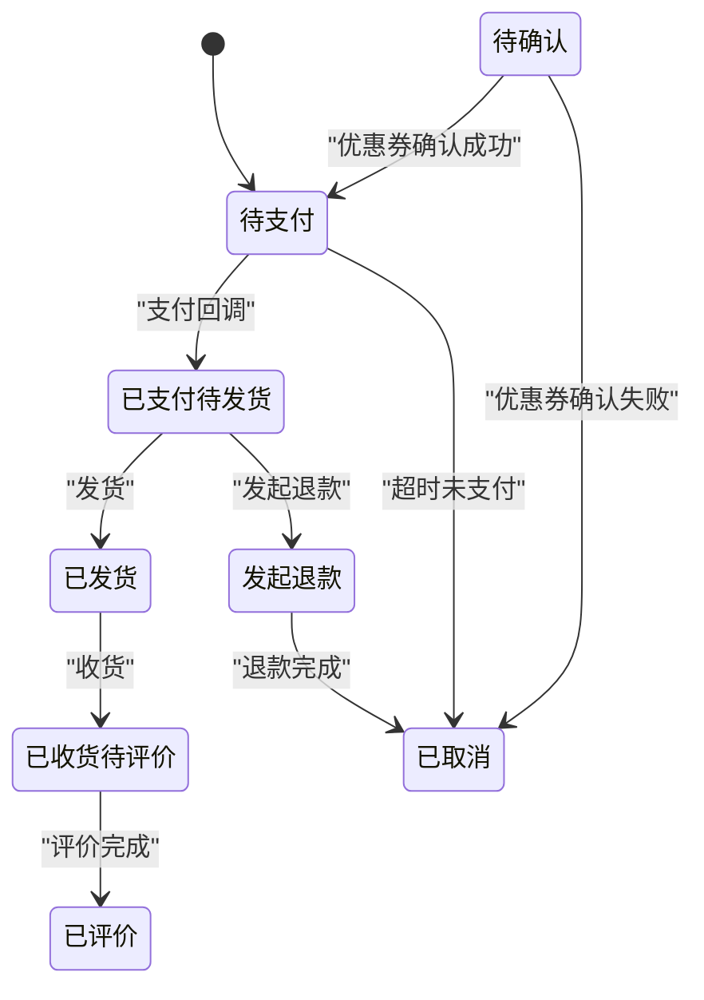
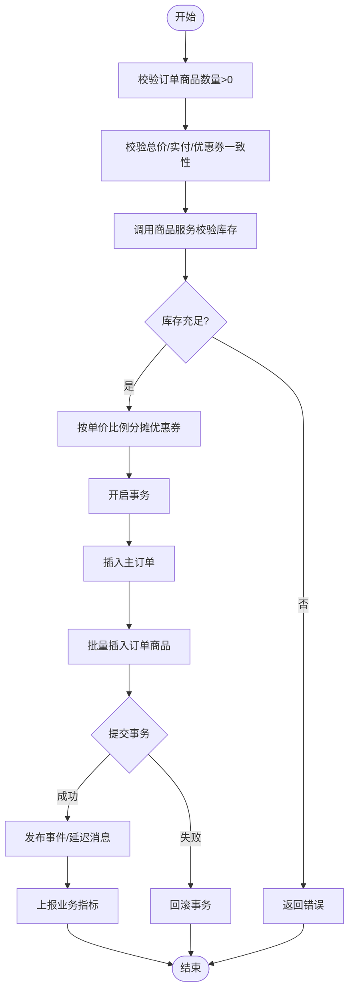
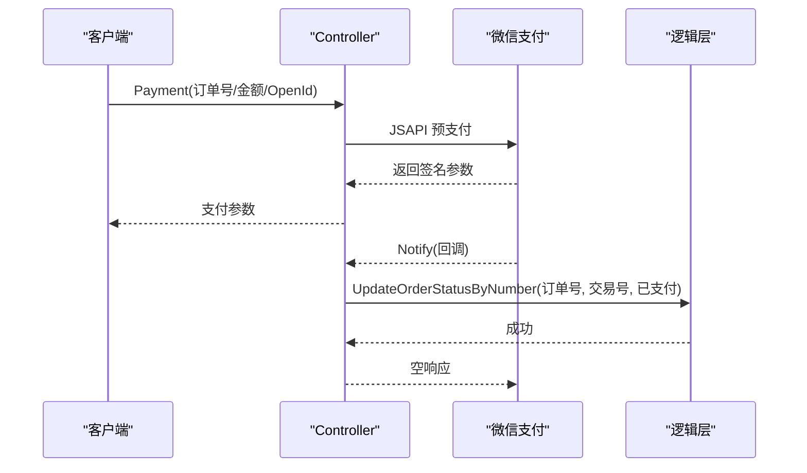
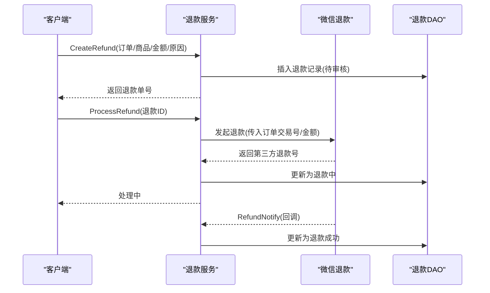
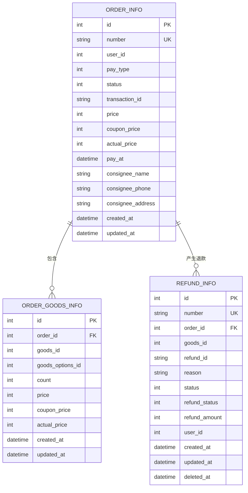
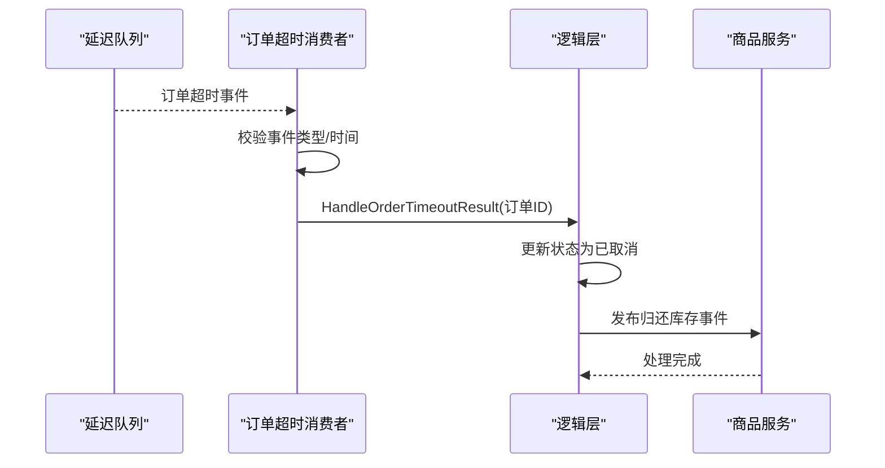
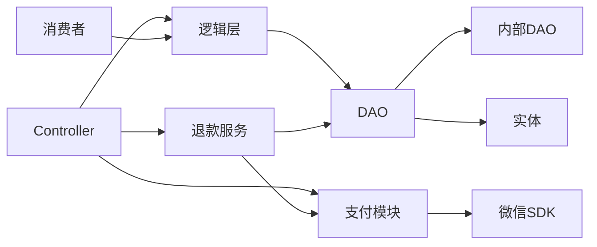

# 订单服务模块

<cite>
**本文引用的文件**
- [app/order/internal/controller/order_info/order_info.go](file://app/order/internal/controller/order_info/order_info.go)
- [app/order/internal/logic/order_info/order_info.go](file://app/order/internal/logic/order_info/order_info.go)
- [app/order/internal/consts/order_status.go](file://app/order/internal/consts/order_status.go)
- [app/order/internal/dao/order_info.go](file://app/order/internal/dao/order_info.go)
- [app/order/internal/dao/order_goods_info.go](file://app/order/internal/dao/order_goods_info.go)
- [app/order/internal/dao/refund_info.go](file://app/order/internal/dao/refund_info.go)
- [app/order/internal/dao/internal/order_info.go](file://app/order/internal/dao/internal/order_info.go)
- [app/order/internal/dao/internal/order_goods_info.go](file://app/order/internal/dao/internal/order_goods_info.go)
- [app/order/internal/dao/internal/refund_info.go](file://app/order/internal/dao/internal/refund_info.go)
- [app/order/internal/model/entity/order_info.go](file://app/order/internal/model/entity/order_info.go)
- [app/order/internal/model/entity/order_goods_info.go](file://app/order/internal/model/entity/order_goods_info.go)
- [app/order/internal/model/entity/refund_info.go](file://app/order/internal/model/entity/refund_info.go)
- [app/order/utility/payment/wxchat.go](file://app/order/utility/payment/wxchat.go)
- [app/order/utility/consumer/order_timeout_consumer.go](file://app/order/utility/consumer/order_timeout_consumer.go)
- [app/order/utility/consumer/coupon_result_consumer.go](file://app/order/utility/consumer/coupon_result_consumer.go)
- [app/order/internal/service/refund_info/refund_info_service.go](file://app/order/internal/service/refund_info/refund_info_service.go)
</cite>

## 目录
1. [简介](#简介)
2. [项目结构](#项目结构)
3. [核心组件](#核心组件)
4. [架构总览](#架构总览)
5. [详细组件分析](#详细组件分析)
6. [依赖关系分析](#依赖关系分析)
7. [性能考虑](#性能考虑)
8. [故障排查指南](#故障排查指南)
9. [结论](#结论)
10. [附录](#附录)

## 简介
本文件面向订单服务模块，系统化阐述其架构设计、订单生命周期管理、支付处理流程、退款管理流程、数据模型设计、订单与商品关联、状态同步机制、微信支付集成、订单超时处理以及通知机制，并提供API接口规范、错误处理策略与性能优化建议。目标是帮助开发者与运维人员快速理解并高效维护该模块。

## 项目结构
订单服务采用典型的分层架构：控制器(Controller)负责接收RPC请求、转发到逻辑层；逻辑层(OrderInfo)封装业务规则与事务控制；DAO层负责数据库访问；实体(Entity)定义数据模型；工具层(utility)提供支付、消息队列、消费者等能力；退款服务(refund_info)独立封装退款流程。

图表来源
- [app/order/internal/controller/order_info/order_info.go](file://app/order/internal/controller/order_info/order_info.go#L20-L188)
- [app/order/internal/logic/order_info/order_info.go](file://app/order/internal/logic/order_info/order_info.go#L27-L502)
- [app/order/internal/dao/order_info.go](file://app/order/internal/dao/order_info.go#L11-L23)
- [app/order/internal/dao/order_goods_info.go](file://app/order/internal/dao/order_goods_info.go#L11-L23)
- [app/order/internal/dao/refund_info.go](file://app/order/internal/dao/refund_info.go#L12-L30)
- [app/order/internal/dao/internal/order_info.go](file://app/order/internal/dao/internal/order_info.go#L14-L110)
- [app/order/internal/dao/internal/order_goods_info.go](file://app/order/internal/dao/internal/order_goods_info.go#L14-L100)
- [app/order/internal/dao/internal/refund_info.go](file://app/order/internal/dao/internal/refund_info.go#L14-L104)
- [app/order/utility/payment/wxchat.go](file://app/order/utility/payment/wxchat.go#L83-L171)
- [app/order/utility/consumer/order_timeout_consumer.go](file://app/order/utility/consumer/order_timeout_consumer.go#L39-L86)
- [app/order/utility/consumer/coupon_result_consumer.go](file://app/order/utility/consumer/coupon_result_consumer.go#L34-L54)

章节来源
- [app/order/internal/controller/order_info/order_info.go](file://app/order/internal/controller/order_info/order_info.go#L20-L188)
- [app/order/internal/logic/order_info/order_info.go](file://app/order/internal/logic/order_info/order_info.go#L27-L502)

## 核心组件
- 控制器层：提供订单创建、详情查询、列表查询、支付、回调、取消、计数等RPC接口；负责参数校验、错误包装与调用逻辑层。
- 逻辑层：封装订单创建事务、库存校验、优惠券分摊、订单状态流转、超时处理、优惠券结果处理等核心业务。
- DAO层：提供订单、订单商品、退款记录的增删改查能力，支持事务与延迟初始化。
- 实体层：定义订单、订单商品、退款记录的数据结构与字段含义。
- 支付与退款：集成微信支付JSAPI预支付、回调验签、退款申请与回调处理。
- 消息与消费者：基于RabbitMQ的延迟队列处理订单超时未支付；处理优惠券确认结果与订单创建事件。

章节来源
- [app/order/internal/controller/order_info/order_info.go](file://app/order/internal/controller/order_info/order_info.go#L28-L188)
- [app/order/internal/logic/order_info/order_info.go](file://app/order/internal/logic/order_info/order_info.go#L27-L502)
- [app/order/internal/consts/order_status.go](file://app/order/internal/consts/order_status.go#L6-L16)
- [app/order/internal/dao/order_info.go](file://app/order/internal/dao/order_info.go#L11-L23)
- [app/order/internal/dao/order_goods_info.go](file://app/order/internal/dao/order_goods_info.go#L11-L23)
- [app/order/internal/dao/refund_info.go](file://app/order/internal/dao/refund_info.go#L12-L30)
- [app/order/internal/model/entity/order_info.go](file://app/order/internal/model/entity/order_info.go#L11-L30)
- [app/order/internal/model/entity/order_goods_info.go](file://app/order/internal/model/entity/order_goods_info.go#L11-L25)
- [app/order/internal/model/entity/refund_info.go](file://app/order/internal/model/entity/refund_info.go#L11-L27)
- [app/order/utility/payment/wxchat.go](file://app/order/utility/payment/wxchat.go#L83-L171)
- [app/order/utility/consumer/order_timeout_consumer.go](file://app/order/utility/consumer/order_timeout_consumer.go#L39-L86)
- [app/order/utility/consumer/coupon_result_consumer.go](file://app/order/utility/consumer/coupon_result_consumer.go#L34-L54)
- [app/order/internal/service/refund_info/refund_info_service.go](file://app/order/internal/service/refund_info/refund_info_service.go#L57-L137)

## 架构总览
订单服务遵循“控制器-逻辑-数据访问-实体-支付/消息”的分层设计，通过事务保证订单创建的一致性，通过消息队列实现异步解耦与可靠性保障。

图表来源
- [app/order/internal/controller/order_info/order_info.go](file://app/order/internal/controller/order_info/order_info.go#L28-L118)
- [app/order/internal/logic/order_info/order_info.go](file://app/order/internal/logic/order_info/order_info.go#L27-L212)
- [app/order/utility/payment/wxchat.go](file://app/order/utility/payment/wxchat.go#L83-L132)
- [app/order/utility/consumer/order_timeout_consumer.go](file://app/order/utility/consumer/order_timeout_consumer.go#L39-L86)
- [app/order/utility/consumer/coupon_result_consumer.go](file://app/order/utility/consumer/coupon_result_consumer.go#L34-L54)

## 详细组件分析

### 订单生命周期与状态管理
- 订单状态枚举：待支付、已支付待发货、已发货、已收货待评价、已评价、待确认（使用优惠券）、已取消、发起退款。
- 状态流转：
  - 创建订单：若使用优惠券则进入“待确认”，否则进入“待支付”。
  - 支付回调：若订单仍为“待支付”，更新为“已支付待发货”，并写入第三方交易号与支付时间。
  - 超时未支付：延迟消息触发后，仅对“待支付”订单执行取消。
  - 优惠券确认：根据结果将订单置为“待支付”或“已取消”。

图表来源
- [app/order/internal/consts/order_status.go](file://app/order/internal/consts/order_status.go#L6-L16)
- [app/order/internal/logic/order_info/order_info.go](file://app/order/internal/logic/order_info/order_info.go#L338-L387)
- [app/order/internal/logic/order_info/order_info.go](file://app/order/internal/logic/order_info/order_info.go#L451-L471)
- [app/order/internal/logic/order_info/order_info.go](file://app/order/internal/logic/order_info/order_info.go#L389-L414)

章节来源
- [app/order/internal/consts/order_status.go](file://app/order/internal/consts/order_status.go#L6-L16)
- [app/order/internal/logic/order_info/order_info.go](file://app/order/internal/logic/order_info/order_info.go#L338-L387)
- [app/order/internal/logic/order_info/order_info.go](file://app/order/internal/logic/order_info/order_info.go#L451-L471)
- [app/order/internal/logic/order_info/order_info.go](file://app/order/internal/logic/order_info/order_info.go#L389-L414)

### 订单创建逻辑与事务处理
- 参数校验：订单商品数量>0、总价与优惠券校验、实付金额一致性。
- 库存校验：调用商品服务获取库存，逐项校验。
- 优惠券分摊：对未预设优惠券的商品按单价比例分摊，确保总优惠不超过订单总优惠。
- 事务：主订单与订单商品批量插入在单事务内完成，失败回滚。
- 事件发布：订单创建成功后发布“订单创建事件”和“订单超时延迟消息”，并上报业务指标。

图表来源
- [app/order/internal/logic/order_info/order_info.go](file://app/order/internal/logic/order_info/order_info.go#L27-L212)

章节来源
- [app/order/internal/logic/order_info/order_info.go](file://app/order/internal/logic/order_info/order_info.go#L27-L212)

### 支付处理机制（微信JSAPI）
- 预支付：构造PrepayRequest，调用微信JSAPI服务，生成prepay_id并签名返回给前端。
- 回调验签：使用平台证书与APIv3密钥初始化通知处理器，解析并验签回调，提取商户订单号与第三方交易号。
- 状态更新：回调中仅当订单非“已支付”时才更新状态，避免重复修改。

图表来源
- [app/order/internal/controller/order_info/order_info.go](file://app/order/internal/controller/order_info/order_info.go#L101-L118)
- [app/order/utility/payment/wxchat.go](file://app/order/utility/payment/wxchat.go#L83-L132)
- [app/order/utility/payment/wxchat.go](file://app/order/utility/payment/wxchat.go#L134-L171)
- [app/order/internal/logic/order_info/order_info.go](file://app/order/internal/logic/order_info/order_info.go#L360-L387)

章节来源
- [app/order/internal/controller/order_info/order_info.go](file://app/order/internal/controller/order_info/order_info.go#L101-L118)
- [app/order/utility/payment/wxchat.go](file://app/order/utility/payment/wxchat.go#L83-L132)
- [app/order/utility/payment/wxchat.go](file://app/order/utility/payment/wxchat.go#L134-L171)
- [app/order/internal/logic/order_info/order_info.go](file://app/order/internal/logic/order_info/order_info.go#L360-L387)

### 退款管理流程
- 申请退款：校验订单是否存在退款记录，创建退款申请并设置状态为“待审核”，退款单号自动生成。
- 处理退款：调用微信退款接口，更新退款状态为“退款中”，记录第三方退款号。
- 退款回调：解析回调，幂等判断后更新退款状态为“退款成功”。

图表来源
- [app/order/internal/service/refund_info/refund_info_service.go](file://app/order/internal/service/refund_info/refund_info_service.go#L57-L99)
- [app/order/internal/service/refund_info/refund_info_service.go](file://app/order/internal/service/refund_info/refund_info_service.go#L101-L137)
- [app/order/internal/service/refund_info/refund_info_service.go](file://app/order/internal/service/refund_info/refund_info_service.go#L228-L238)
- [app/order/utility/payment/wxchat.go](file://app/order/utility/payment/wxchat.go#L184-L246)

章节来源
- [app/order/internal/service/refund_info/refund_info_service.go](file://app/order/internal/service/refund_info/refund_info_service.go#L57-L137)
- [app/order/utility/payment/wxchat.go](file://app/order/utility/payment/wxchat.go#L184-L246)

### 订单数据模型设计与关联
- 订单表：包含订单编号、用户ID、支付方式、收货信息、金额、状态、第三方交易号、支付时间等。
- 订单商品表：记录每个商品维度的价格、优惠分摊、实际支付金额与数量。
- 退款表：记录退款单号、订单ID、商品ID、退款原因、审核状态、退款状态、金额与用户ID等。

图表来源
- [app/order/internal/model/entity/order_info.go](file://app/order/internal/model/entity/order_info.go#L11-L30)
- [app/order/internal/model/entity/order_goods_info.go](file://app/order/internal/model/entity/order_goods_info.go#L11-L25)
- [app/order/internal/model/entity/refund_info.go](file://app/order/internal/model/entity/refund_info.go#L11-L27)

章节来源
- [app/order/internal/model/entity/order_info.go](file://app/order/internal/model/entity/order_info.go#L11-L30)
- [app/order/internal/model/entity/order_goods_info.go](file://app/order/internal/model/entity/order_goods_info.go#L11-L25)
- [app/order/internal/model/entity/refund_info.go](file://app/order/internal/model/entity/refund_info.go#L11-L27)

### 订单超时处理与通知机制
- 超时消费者：订阅延迟交换机，解析事件时间与配置的超时阈值，仅对“待支付”订单执行取消。
- 库存释放：取消订单后异步发布“归还库存”事件，供商品服务处理。
- 通知：支付回调与退款回调均通过微信平台异步通知，服务端进行验签与幂等处理。

图表来源
- [app/order/utility/consumer/order_timeout_consumer.go](file://app/order/utility/consumer/order_timeout_consumer.go#L39-L86)
- [app/order/internal/logic/order_info/order_info.go](file://app/order/internal/logic/order_info/order_info.go#L451-L471)

章节来源
- [app/order/utility/consumer/order_timeout_consumer.go](file://app/order/utility/consumer/order_timeout_consumer.go#L39-L86)
- [app/order/internal/logic/order_info/order_info.go](file://app/order/internal/logic/order_info/order_info.go#L451-L471)

### 取消订单与权限校验
- 校验：订单存在性、状态必须为“待支付”、用户ID匹配。
- 执行：将状态更新为“已取消”，返回统一结构化响应。

章节来源
- [app/order/internal/controller/order_info/order_info.go](file://app/order/internal/controller/order_info/order_info.go#L130-L188)

### API 接口规范
- 创建订单
  - 方法：POST
  - 路径：/order_info.Create
  - 请求体：包含用户ID、收货信息、订单商品明细、价格与优惠信息
  - 响应：订单ID与订单编号
- 获取订单详情
  - 方法：GET
  - 路径：/order_info.GetDetail
  - 请求体：订单ID、用户ID
  - 响应：订单信息与订单商品列表
- 获取订单列表
  - 方法：GET
  - 路径：/order_info.GetList
  - 请求体：用户ID、状态、分页参数
  - 响应：订单列表与总数
- 订单支付
  - 方法：POST
  - 路径：/order_info.Payment
  - 请求体：订单编号、金额、OpenId
  - 响应：支付签名参数
- 支付回调
  - 方法：POST
  - 路径：/order_info.Notify
  - 请求体：回调原始报文与头部
  - 响应：空（服务端内部处理）
- 取消订单
  - 方法：POST
  - 路径：/order_info.CancelOrder
  - 请求体：订单ID、用户ID
  - 响应：统一状态码与消息
- 订单数量统计
  - 方法：GET
  - 路径：/order_info.GetCount
  - 请求体：用户ID
  - 响应：各类状态的数量统计

章节来源
- [app/order/internal/controller/order_info/order_info.go](file://app/order/internal/controller/order_info/order_info.go#L28-L188)

## 依赖关系分析
- 控制器依赖逻辑层与支付模块；逻辑层依赖DAO与消息工具；DAO依赖内部DAO与数据库；实体作为数据载体被DAO与逻辑层使用。
- 退款服务依赖支付模块与DAO；消费者依赖配置与逻辑层；支付模块依赖微信SDK与配置。

图表来源
- [app/order/internal/controller/order_info/order_info.go](file://app/order/internal/controller/order_info/order_info.go#L24-L118)
- [app/order/internal/logic/order_info/order_info.go](file://app/order/internal/logic/order_info/order_info.go#L27-L502)
- [app/order/internal/dao/order_info.go](file://app/order/internal/dao/order_info.go#L11-L23)
- [app/order/internal/dao/order_goods_info.go](file://app/order/internal/dao/order_goods_info.go#L11-L23)
- [app/order/internal/dao/refund_info.go](file://app/order/internal/dao/refund_info.go#L12-L30)
- [app/order/internal/dao/internal/order_info.go](file://app/order/internal/dao/internal/order_info.go#L14-L110)
- [app/order/internal/dao/internal/order_goods_info.go](file://app/order/internal/dao/internal/order_goods_info.go#L14-L100)
- [app/order/internal/dao/internal/refund_info.go](file://app/order/internal/dao/internal/refund_info.go#L14-L104)
- [app/order/utility/payment/wxchat.go](file://app/order/utility/payment/wxchat.go#L83-L132)
- [app/order/utility/consumer/order_timeout_consumer.go](file://app/order/utility/consumer/order_timeout_consumer.go#L39-L86)
- [app/order/utility/consumer/coupon_result_consumer.go](file://app/order/utility/consumer/coupon_result_consumer.go#L34-L54)

## 性能考虑
- 事务批处理：订单与订单商品批量插入减少往返开销。
- 异步事件：订单创建后发布事件，避免阻塞主流程。
- 指标埋点：订单创建成功/失败均记录业务指标，便于容量规划与告警。
- 缓存与限流：库存校验建议结合缓存与限流，降低数据库压力。
- 消息幂等：回调与消费者均做幂等判断，避免重复处理。
- 连接池与超时：DAO层使用框架连接池，合理设置SQL超时与重试策略。

## 故障排查指南
- 订单创建失败
  - 检查参数校验与事务日志；查看业务指标是否上报失败。
  - 关键路径：[app/order/internal/logic/order_info/order_info.go](file://app/order/internal/logic/order_info/order_info.go#L27-L212)
- 支付回调验签失败
  - 核对平台证书、APIv3密钥与回调头；确认回调URL一致。
  - 关键路径：[app/order/utility/payment/wxchat.go](file://app/order/utility/payment/wxchat.go#L134-L171)
- 订单超时未支付未取消
  - 检查延迟队列配置、消费者是否启动、事件时间与阈值。
  - 关键路径：[app/order/utility/consumer/order_timeout_consumer.go](file://app/order/utility/consumer/order_timeout_consumer.go#L39-L86)
- 退款处理异常
  - 查看第三方退款号与回调状态；重试策略与指数退避。
  - 关键路径：[app/order/internal/service/refund_info/refund_info_service.go](file://app/order/internal/service/refund_info/refund_info_service.go#L101-L137)

章节来源
- [app/order/internal/logic/order_info/order_info.go](file://app/order/internal/logic/order_info/order_info.go#L27-L212)
- [app/order/utility/payment/wxchat.go](file://app/order/utility/payment/wxchat.go#L134-L171)
- [app/order/utility/consumer/order_timeout_consumer.go](file://app/order/utility/consumer/order_timeout_consumer.go#L39-L86)
- [app/order/internal/service/refund_info/refund_info_service.go](file://app/order/internal/service/refund_info/refund_info_service.go#L101-L137)

## 结论
订单服务模块通过清晰的分层设计、严格的事务控制、完善的异步解耦与幂等处理，实现了从下单、支付到退款的完整闭环。配合微信支付与消息队列，具备良好的扩展性与可靠性。建议持续完善退款状态监控与重试策略，加强缓存与限流以提升吞吐。

## 附录
- 订单状态枚举与退款状态定义参考：[app/order/internal/consts/order_status.go](file://app/order/internal/consts/order_status.go#L6-L38)
- DAO与内部DAO定义参考：
  - [app/order/internal/dao/order_info.go](file://app/order/internal/dao/order_info.go#L11-L23)
  - [app/order/internal/dao/internal/order_info.go](file://app/order/internal/dao/internal/order_info.go#L14-L110)
  - [app/order/internal/dao/order_goods_info.go](file://app/order/internal/dao/order_goods_info.go#L11-L23)
  - [app/order/internal/dao/internal/order_goods_info.go](file://app/order/internal/dao/internal/order_goods_info.go#L14-L100)
  - [app/order/internal/dao/refund_info.go](file://app/order/internal/dao/refund_info.go#L12-L30)
  - [app/order/internal/dao/internal/refund_info.go](file://app/order/internal/dao/internal/refund_info.go#L14-L104)
- 实体模型定义参考：
  - [app/order/internal/model/entity/order_info.go](file://app/order/internal/model/entity/order_info.go#L11-L30)
  - [app/order/internal/model/entity/order_goods_info.go](file://app/order/internal/model/entity/order_goods_info.go#L11-L25)
  - [app/order/internal/model/entity/refund_info.go](file://app/order/internal/model/entity/refund_info.go#L11-L27)