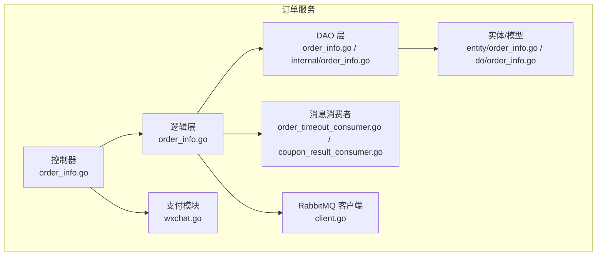
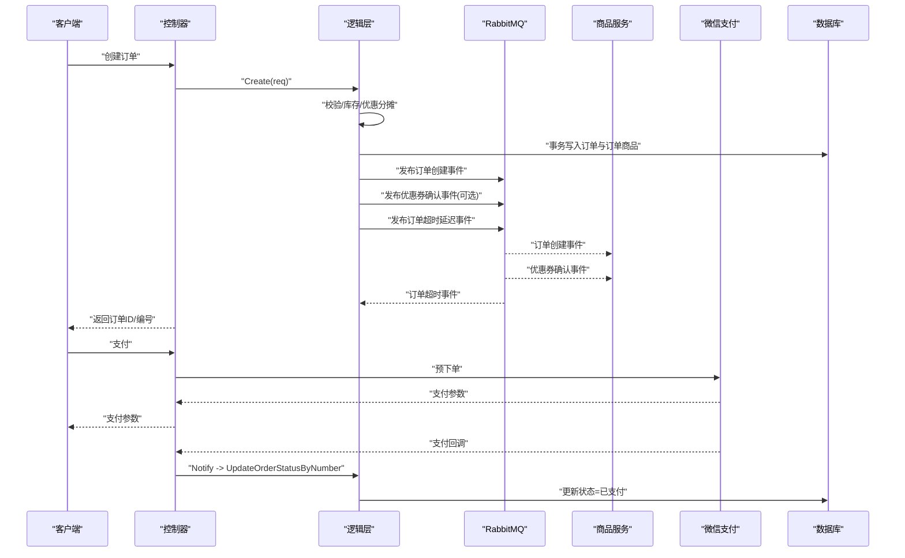
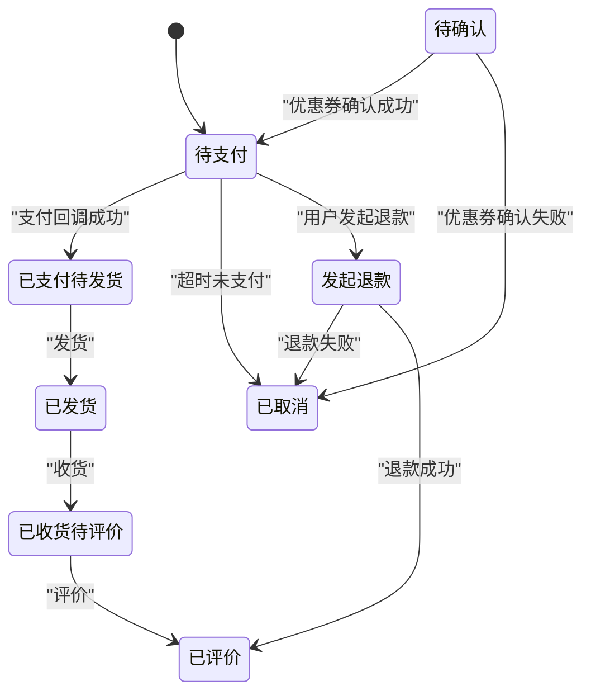
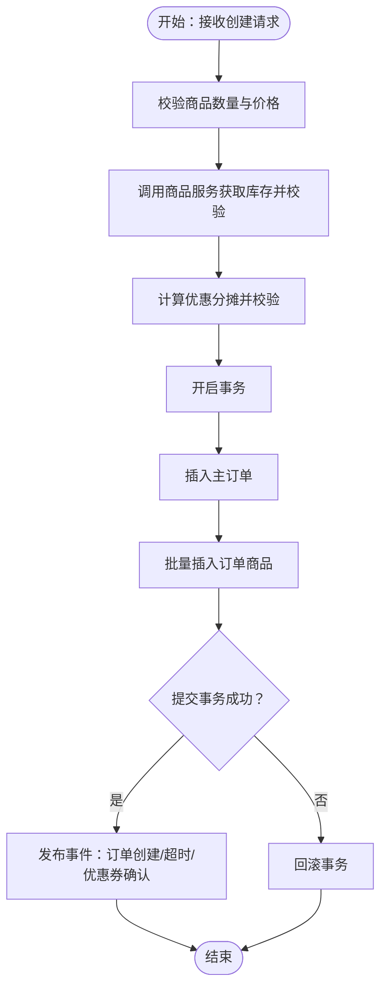
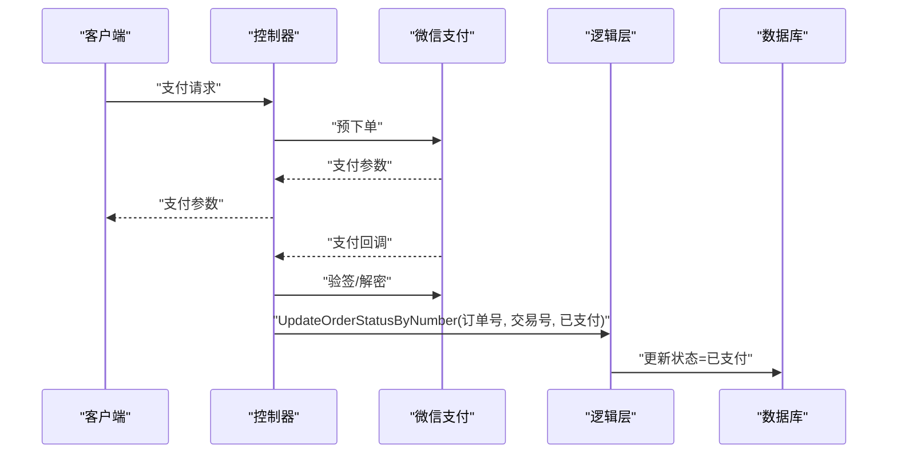
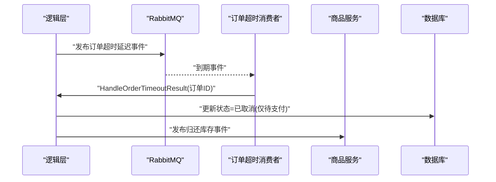
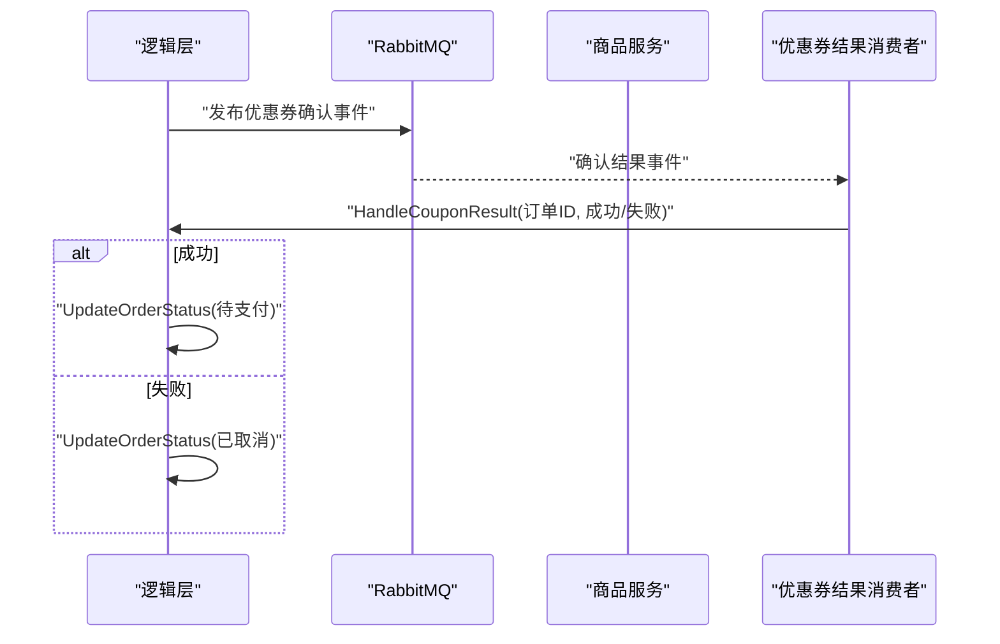
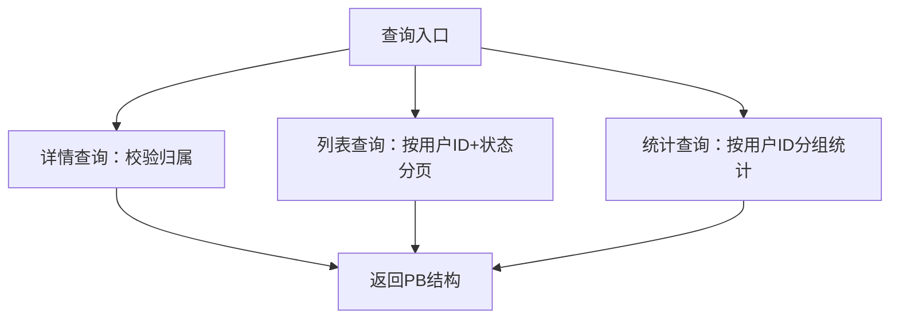
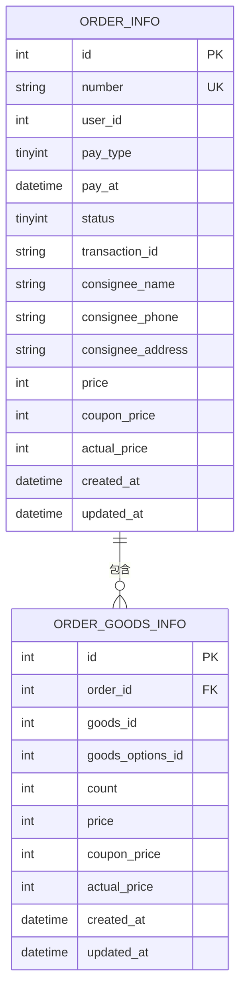
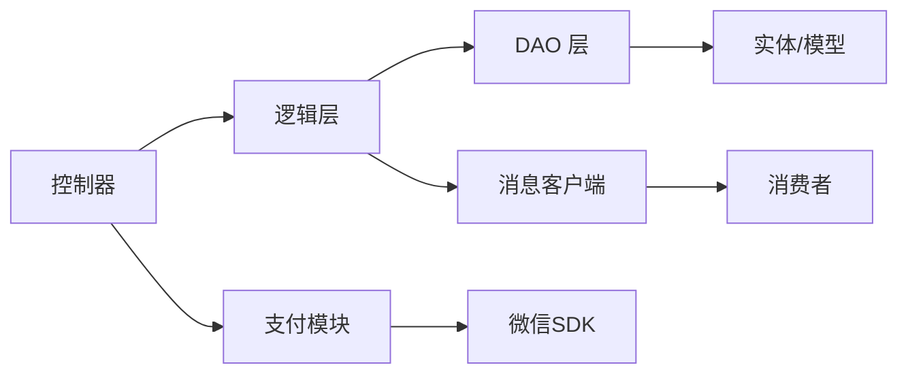

# 订单生命周期管理

<cite>
**本文引用的文件**
- [app/order/internal/consts/order_status.go](file://app/order/internal/consts/order_status.go)
- [app/order/internal/model/entity/order_info.go](file://app/order/internal/model/entity/order_info.go)
- [app/order/internal/controller/order_info/order_info.go](file://app/order/internal/controller/order_info/order_info.go)
- [app/order/internal/logic/order_info/order_info.go](file://app/order/internal/logic/order_info/order_info.go)
- [app/order/internal/dao/order_info.go](file://app/order/internal/dao/order_info.go)
- [app/order/internal/dao/internal/order_info.go](file://app/order/internal/dao/internal/order_info.go)
- [app/order/internal/model/do/order_info.go](file://app/order/internal/model/do/order_info.go)
- [app/order/utility/consumer/order_timeout_consumer.go](file://app/order/utility/consumer/order_timeout_consumer.go)
- [app/order/utility/consumer/coupon_result_consumer.go](file://app/order/utility/consumer/coupon_result_consumer.go)
- [app/order/utility/rabbitmq/client.go](file://app/order/utility/rabbitmq/client.go)
- [app/order/utility/payment/wxchat.go](file://app/order/utility/payment/wxchat.go)
- [app/order/hack/order.sql](file://app/order/hack/order.sql)
- [init-db/01_init.sql](file://init-db/01_init.sql)
</cite>

## 目录
1. [简介](#简介)
2. [项目结构](#项目结构)
3. [核心组件](#核心组件)
4. [架构总览](#架构总览)
5. [详细组件分析](#详细组件分析)
6. [依赖分析](#依赖分析)
7. [性能考虑](#性能考虑)
8. [故障排查指南](#故障排查指南)
9. [结论](#结论)
10. [附录](#附录)

## 简介
本文件系统化阐述订单生命周期管理的设计与实现，覆盖从订单创建、状态流转、状态变更触发条件，到状态查询、批量更新与状态同步策略。文档基于仓库中的订单服务源码与数据库结构，提供状态机设计、业务规则、异常处理与数据一致性保障方案，并给出可视化流程与时序图，帮助开发者与运维人员快速理解与落地。

## 项目结构
订单服务位于 app/order 模块，采用典型的分层架构：
- 控制器层：对外暴露 gRPC 接口，负责请求接入与错误包装
- 逻辑层：封装业务规则与状态机，协调 DAO 与消息队列
- DAO 层：抽象数据库访问，提供事务与模型封装
- 实体与模型：定义表结构与 PB 结构映射
- 消费者：处理超时与优惠券确认等异步事件
- 支付与 MQ 客户端：封装微信支付回调与 RabbitMQ 交互

**图表来源**
- [app/order/internal/controller/order_info/order_info.go](file://app/order/internal/controller/order_info/order_info.go#L1-L188)
- [app/order/internal/logic/order_info/order_info.go](file://app/order/internal/logic/order_info/order_info.go#L1-L502)
- [app/order/internal/dao/order_info.go](file://app/order/internal/dao/order_info.go#L1-L23)
- [app/order/internal/dao/internal/order_info.go](file://app/order/internal/dao/internal/order_info.go#L1-L110)
- [app/order/internal/model/entity/order_info.go](file://app/order/internal/model/entity/order_info.go#L1-L30)
- [app/order/internal/model/do/order_info.go](file://app/order/internal/model/do/order_info.go#L1-L32)
- [app/order/utility/consumer/order_timeout_consumer.go](file://app/order/utility/consumer/order_timeout_consumer.go#L1-L87)
- [app/order/utility/consumer/coupon_result_consumer.go](file://app/order/utility/consumer/coupon_result_consumer.go#L1-L54)
- [app/order/utility/rabbitmq/client.go](file://app/order/utility/rabbitmq/client.go#L1-L253)
- [app/order/utility/payment/wxchat.go](file://app/order/utility/payment/wxchat.go#L1-L328)

**章节来源**
- [app/order/internal/controller/order_info/order_info.go](file://app/order/internal/controller/order_info/order_info.go#L1-L188)
- [app/order/internal/logic/order_info/order_info.go](file://app/order/internal/logic/order_info/order_info.go#L1-L502)
- [app/order/internal/dao/order_info.go](file://app/order/internal/dao/order_info.go#L1-L23)
- [app/order/internal/dao/internal/order_info.go](file://app/order/internal/dao/internal/order_info.go#L1-L110)
- [app/order/internal/model/entity/order_info.go](file://app/order/internal/model/entity/order_info.go#L1-L30)
- [app/order/internal/model/do/order_info.go](file://app/order/internal/model/do/order_info.go#L1-L32)
- [app/order/utility/consumer/order_timeout_consumer.go](file://app/order/utility/consumer/order_timeout_consumer.go#L1-L87)
- [app/order/utility/consumer/coupon_result_consumer.go](file://app/order/utility/consumer/coupon_result_consumer.go#L1-L54)
- [app/order/utility/rabbitmq/client.go](file://app/order/utility/rabbitmq/client.go#L1-L253)
- [app/order/utility/payment/wxchat.go](file://app/order/utility/payment/wxchat.go#L1-L328)

## 核心组件
- 订单状态枚举与退款状态：定义订单状态、退款审核状态与退款执行状态，确保跨模块一致
- 订单实体与模型：映射数据库表结构，提供 PB 转换与时间字段安全处理
- 控制器：提供创建、详情、列表、支付、回调、取消等接口；封装错误码与日志
- 逻辑层：订单创建事务、状态更新、超时处理、优惠券结果处理、支付回调处理
- DAO 层：统一表访问、列常量、事务封装
- 消费者：处理订单超时未支付与优惠券确认结果
- 支付与 MQ：微信支付预下单、回调验签、异步通知；RabbitMQ 延迟队列与交换机声明

**章节来源**
- [app/order/internal/consts/order_status.go](file://app/order/internal/consts/order_status.go#L1-L38)
- [app/order/internal/model/entity/order_info.go](file://app/order/internal/model/entity/order_info.go#L1-L30)
- [app/order/internal/controller/order_info/order_info.go](file://app/order/internal/controller/order_info/order_info.go#L1-L188)
- [app/order/internal/logic/order_info/order_info.go](file://app/order/internal/logic/order_info/order_info.go#L1-L502)
- [app/order/internal/dao/internal/order_info.go](file://app/order/internal/dao/internal/order_info.go#L1-L110)
- [app/order/utility/consumer/order_timeout_consumer.go](file://app/order/utility/consumer/order_timeout_consumer.go#L1-L87)
- [app/order/utility/consumer/coupon_result_consumer.go](file://app/order/utility/consumer/coupon_result_consumer.go#L1-L54)
- [app/order/utility/payment/wxchat.go](file://app/order/utility/payment/wxchat.go#L1-L328)
- [app/order/utility/rabbitmq/client.go](file://app/order/utility/rabbitmq/client.go#L1-L253)

## 架构总览
订单生命周期围绕“状态机 + 异步事件 + 事务一致性”展开：
- 创建阶段：校验商品与库存、计算优惠分摊、开启事务写入主订单与订单商品、发布事件
- 支付阶段：微信回调验签，按订单号更新状态为已支付并记录第三方交易号
- 超时阶段：延迟队列到期后消费，仅对未支付订单执行取消并释放库存
- 优惠券阶段：使用优惠券时先发确认事件，结果回调决定订单状态（待支付或已取消）
- 查询与统计：提供详情、列表、按状态聚合统计

**图表来源**
- [app/order/internal/controller/order_info/order_info.go](file://app/order/internal/controller/order_info/order_info.go#L28-L118)
- [app/order/internal/logic/order_info/order_info.go](file://app/order/internal/logic/order_info/order_info.go#L27-L212)
- [app/order/utility/consumer/order_timeout_consumer.go](file://app/order/utility/consumer/order_timeout_consumer.go#L39-L86)
- [app/order/utility/consumer/coupon_result_consumer.go](file://app/order/utility/consumer/coupon_result_consumer.go#L34-L54)
- [app/order/utility/payment/wxchat.go](file://app/order/utility/payment/wxchat.go#L84-L171)
- [app/order/utility/rabbitmq/client.go](file://app/order/utility/rabbitmq/client.go#L190-L242)

## 详细组件分析

### 订单状态机与状态流转
- 状态枚举定义：待支付、已支付待发货、已发货、已收货待评价、已评价、待确认（使用优惠券）、已取消、发起退款
- 状态转换规则：
  - 创建：若使用优惠券则进入“待确认”，否则进入“待支付”
  - 支付：回调成功后置为“已支付待发货”，并记录支付时间
  - 超时：仅对“待支付”订单执行取消
  - 优惠券：成功则“待支付”，失败则“已取消”
  - 其他：发货、收货、评价、退款等状态在当前代码中主要通过外部流程驱动（如发货、收货、评价由前端/其他服务驱动）

**图表来源**
- [app/order/internal/consts/order_status.go](file://app/order/internal/consts/order_status.go#L3-L38)
- [app/order/internal/logic/order_info/order_info.go](file://app/order/internal/logic/order_info/order_info.go#L338-L414)
- [app/order/internal/logic/order_info/order_info.go](file://app/order/internal/logic/order_info/order_info.go#L451-L471)

**章节来源**
- [app/order/internal/consts/order_status.go](file://app/order/internal/consts/order_status.go#L1-L38)
- [app/order/internal/logic/order_info/order_info.go](file://app/order/internal/logic/order_info/order_info.go#L338-L414)
- [app/order/internal/logic/order_info/order_info.go](file://app/order/internal/logic/order_info/order_info.go#L451-L471)

### 订单创建逻辑与事务一致性
- 输入校验：订单至少含一个商品；总价与优惠核对；优惠券价格不得小于单项优惠累加
- 库存校验：调用商品服务获取库存，逐项校验
- 优惠分摊：对未预设优惠的商品按单价比例分摊剩余优惠，避免溢出
- 事务处理：主订单与订单商品批量写入在一个事务内，失败回滚
- 事件发布：订单创建事件用于后续流程（如删除购物车、库存扣减等）
- 延迟事件：发布订单超时延迟事件，超时后自动取消并释放库存

**图表来源**
- [app/order/internal/logic/order_info/order_info.go](file://app/order/internal/logic/order_info/order_info.go#L27-L212)

**章节来源**
- [app/order/internal/logic/order_info/order_info.go](file://app/order/internal/logic/order_info/order_info.go#L27-L212)

### 支付与回调处理
- 预下单：构造微信 JSAPI 预下单请求，返回客户端支付参数
- 回调验签：使用平台证书与 APIv3 Key 验签并解密回调数据
- 状态更新：根据订单号与期望状态进行幂等更新，避免重复处理

**图表来源**
- [app/order/internal/controller/order_info/order_info.go](file://app/order/internal/controller/order_info/order_info.go#L101-L118)
- [app/order/utility/payment/wxchat.go](file://app/order/utility/payment/wxchat.go#L84-L171)
- [app/order/internal/logic/order_info/order_info.go](file://app/order/internal/logic/order_info/order_info.go#L360-L387)

**章节来源**
- [app/order/internal/controller/order_info/order_info.go](file://app/order/internal/controller/order_info/order_info.go#L101-L118)
- [app/order/utility/payment/wxchat.go](file://app/order/utility/payment/wxchat.go#L84-L171)
- [app/order/internal/logic/order_info/order_info.go](file://app/order/internal/logic/order_info/order_info.go#L360-L387)

### 超时取消与库存释放
- 延迟队列：订单创建时发布带延迟时间的消息
- 消费者：到期后消费，判断是否到达取消时间阈值，仅对“待支付”订单执行取消
- 库存释放：取消后发布“归还库存”事件，供商品服务处理

**图表来源**
- [app/order/internal/logic/order_info/order_info.go](file://app/order/internal/logic/order_info/order_info.go#L451-L471)
- [app/order/utility/consumer/order_timeout_consumer.go](file://app/order/utility/consumer/order_timeout_consumer.go#L39-L86)
- [app/order/utility/rabbitmq/client.go](file://app/order/utility/rabbitmq/client.go#L233-L242)

**章节来源**
- [app/order/internal/logic/order_info/order_info.go](file://app/order/internal/logic/order_info/order_info.go#L451-L471)
- [app/order/utility/consumer/order_timeout_consumer.go](file://app/order/utility/consumer/order_timeout_consumer.go#L39-L86)
- [app/order/utility/rabbitmq/client.go](file://app/order/utility/rabbitmq/client.go#L233-L242)

### 优惠券确认与状态联动
- 使用优惠券：订单创建时若存在优惠券 ID，则进入“待确认”
- 确认结果：商品服务返回成功则置为“待支付”，失败则置为“已取消”

**图表来源**
- [app/order/internal/logic/order_info/order_info.go](file://app/order/internal/logic/order_info/order_info.go#L389-L414)
- [app/order/utility/consumer/coupon_result_consumer.go](file://app/order/utility/consumer/coupon_result_consumer.go#L34-L54)

**章节来源**
- [app/order/internal/logic/order_info/order_info.go](file://app/order/internal/logic/order_info/order_info.go#L389-L414)
- [app/order/utility/consumer/coupon_result_consumer.go](file://app/order/utility/consumer/coupon_result_consumer.go#L34-L54)

### 订单状态查询与统计
- 详情查询：按订单 ID 与用户 ID 校验归属，返回主订单与订单商品列表
- 列表查询：按用户 ID 与状态分页查询
- 统计查询：按用户 ID 汇总各状态数量

**图表来源**
- [app/order/internal/controller/order_info/order_info.go](file://app/order/internal/controller/order_info/order_info.go#L39-L99)
- [app/order/internal/logic/order_info/order_info.go](file://app/order/internal/logic/order_info/order_info.go#L226-L336)
- [app/order/internal/logic/order_info/order_info.go](file://app/order/internal/logic/order_info/order_info.go#L416-L449)

**章节来源**
- [app/order/internal/controller/order_info/order_info.go](file://app/order/internal/controller/order_info/order_info.go#L39-L99)
- [app/order/internal/logic/order_info/order_info.go](file://app/order/internal/logic/order_info/order_info.go#L226-L336)
- [app/order/internal/logic/order_info/order_info.go](file://app/order/internal/logic/order_info/order_info.go#L416-L449)

### 数据模型与一致性
- 主表：order_info，包含订单编号、用户ID、支付方式、收货信息、金额、状态、第三方交易号、支付时间等
- 明细表：order_goods_info，记录每个商品的单价、优惠、实际支付金额与购买数量
- 事务：订单创建在单事务内写入主表与明细表，失败回滚
- 幂等：支付回调按订单号与期望状态进行存在性检查，避免重复更新

**图表来源**
- [app/order/hack/order.sql](file://app/order/hack/order.sql#L32-L52)
- [app/order/internal/model/entity/order_info.go](file://app/order/internal/model/entity/order_info.go#L11-L29)
- [app/order/internal/model/do/order_info.go](file://app/order/internal/model/do/order_info.go#L12-L31)

**章节来源**
- [app/order/hack/order.sql](file://app/order/hack/order.sql#L32-L52)
- [app/order/internal/model/entity/order_info.go](file://app/order/internal/model/entity/order_info.go#L11-L29)
- [app/order/internal/model/do/order_info.go](file://app/order/internal/model/do/order_info.go#L12-L31)
- [init-db/01_init.sql](file://init-db/01_init.sql#L408-L451)

## 依赖分析
- 控制器依赖逻辑层与支付模块，向上提供 gRPC 接口
- 逻辑层依赖 DAO、实体模型、消息客户端与支付模块
- DAO 层依赖框架模型与列常量，提供事务封装
- 消费者依赖配置与通用消费者基类，处理延迟与主题消息
- 支付模块依赖微信 SDK 与配置，提供验签与回调处理
- MQ 客户端负责延迟交换机与队列声明，提供延迟消息能力

**图表来源**
- [app/order/internal/controller/order_info/order_info.go](file://app/order/internal/controller/order_info/order_info.go#L1-L188)
- [app/order/internal/logic/order_info/order_info.go](file://app/order/internal/logic/order_info/order_info.go#L1-L502)
- [app/order/internal/dao/internal/order_info.go](file://app/order/internal/dao/internal/order_info.go#L1-L110)
- [app/order/utility/consumer/order_timeout_consumer.go](file://app/order/utility/consumer/order_timeout_consumer.go#L1-L87)
- [app/order/utility/consumer/coupon_result_consumer.go](file://app/order/utility/consumer/coupon_result_consumer.go#L1-L54)
- [app/order/utility/payment/wxchat.go](file://app/order/utility/payment/wxchat.go#L1-L328)
- [app/order/utility/rabbitmq/client.go](file://app/order/utility/rabbitmq/client.go#L1-L253)

**章节来源**
- [app/order/internal/controller/order_info/order_info.go](file://app/order/internal/controller/order_info/order_info.go#L1-L188)
- [app/order/internal/logic/order_info/order_info.go](file://app/order/internal/logic/order_info/order_info.go#L1-L502)
- [app/order/internal/dao/internal/order_info.go](file://app/order/internal/dao/internal/order_info.go#L1-L110)
- [app/order/utility/consumer/order_timeout_consumer.go](file://app/order/utility/consumer/order_timeout_consumer.go#L1-L87)
- [app/order/utility/consumer/coupon_result_consumer.go](file://app/order/utility/consumer/coupon_result_consumer.go#L1-L54)
- [app/order/utility/payment/wxchat.go](file://app/order/utility/payment/wxchat.go#L1-L328)
- [app/order/utility/rabbitmq/client.go](file://app/order/utility/rabbitmq/client.go#L1-L253)

## 性能考虑
- 事务批处理：订单创建时批量插入订单商品，减少往返开销
- 幂等更新：支付回调按订单号与期望状态检查，避免重复写入
- 异步解耦：超时与优惠券确认通过消息队列异步处理，降低主流程阻塞
- 缓存与索引：建议在商品库存查询与订单状态查询上建立合适索引，结合缓存策略提升读性能
- MQ 并发：消费者 PrefetchCount 与并发度需结合业务峰值合理配置

## 故障排查指南
- 创建失败：检查商品数量与价格校验、库存校验、事务提交与回滚日志
- 支付回调：确认验签参数、回调头与原始报文，关注重复回调幂等处理
- 超时未支付：检查延迟时间配置、消费者到期判断逻辑、仅对“待支付”订单取消
- 优惠券确认：确认事件发布与结果回调，失败路径会直接取消订单
- 数据一致性：核对事务边界、状态更新条件与幂等检查

**章节来源**
- [app/order/internal/logic/order_info/order_info.go](file://app/order/internal/logic/order_info/order_info.go#L104-L174)
- [app/order/internal/logic/order_info/order_info.go](file://app/order/internal/logic/order_info/order_info.go#L360-L387)
- [app/order/utility/consumer/order_timeout_consumer.go](file://app/order/utility/consumer/order_timeout_consumer.go#L57-L76)
- [app/order/utility/consumer/coupon_result_consumer.go](file://app/order/utility/consumer/coupon_result_consumer.go#L45-L53)

## 结论
订单生命周期管理通过清晰的状态机、严格的事务与幂等控制、以及异步事件解耦，实现了从创建到完成的关键路径闭环。建议在生产环境中完善监控与告警、优化 MQ 并发与索引策略，并持续演进状态机以覆盖更多业务场景（如发货、收货、评价、退款等）。

## 附录
- 状态枚举与退款状态定义参考：[app/order/internal/consts/order_status.go](file://app/order/internal/consts/order_status.go#L1-L38)
- 订单实体与模型定义参考：[app/order/internal/model/entity/order_info.go](file://app/order/internal/model/entity/order_info.go#L11-L29)，[app/order/internal/model/do/order_info.go](file://app/order/internal/model/do/order_info.go#L12-L31)
- 数据库表结构参考：[app/order/hack/order.sql](file://app/order/hack/order.sql#L32-L52)，[init-db/01_init.sql](file://init-db/01_init.sql#L408-L451)