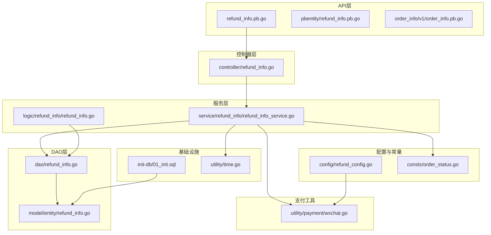
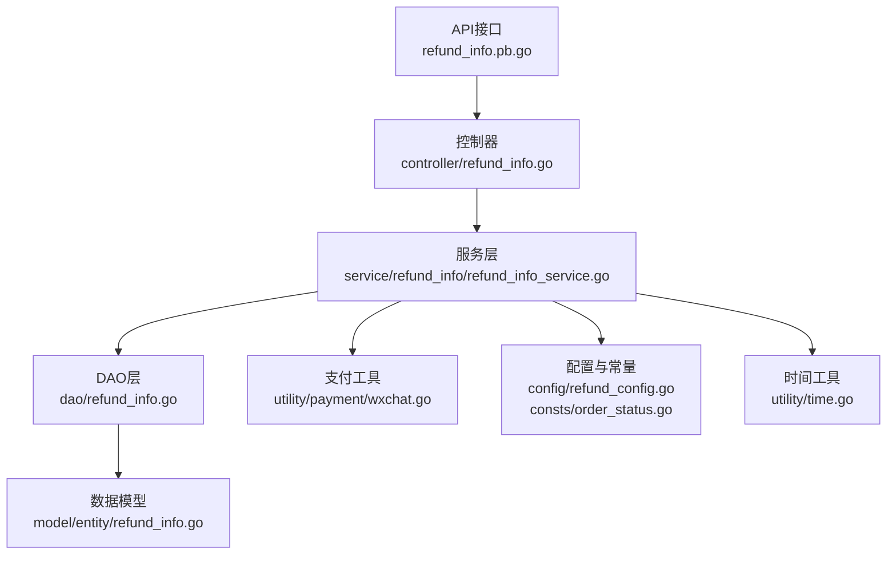
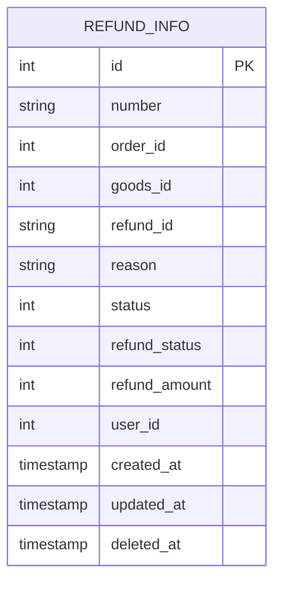
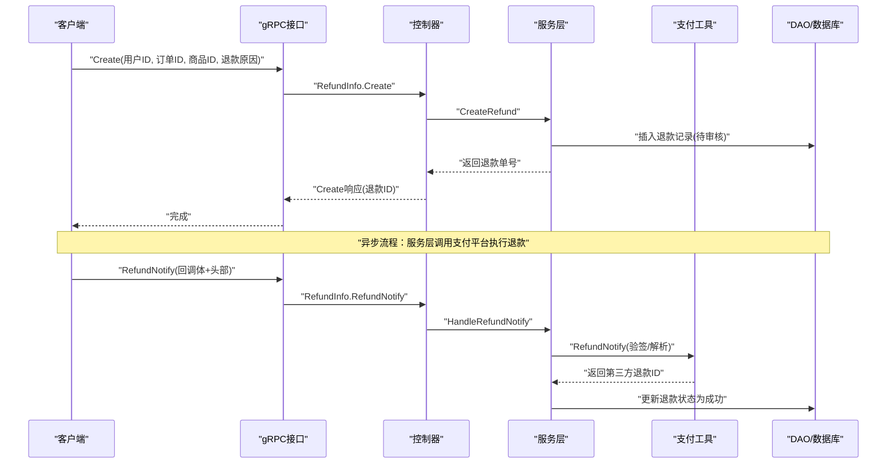
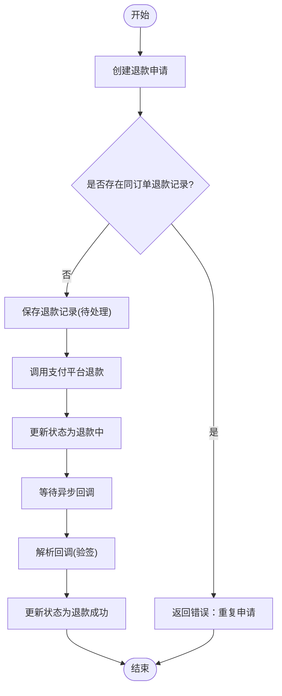
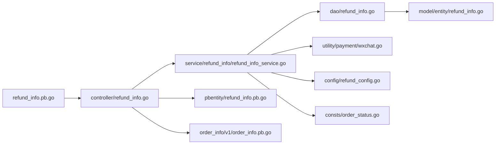

# 退款管理流程

<cite>
**本文档引用的文件**
- [app/order/api/refund_info/v1/refund_info.pb.go](file://app/order/api/refund_info/v1/refund_info.pb.go)
- [app/order/internal/controller/refund_info/refund_info.go](file://app/order/internal/controller/refund_info/refund_info.go)
- [app/order/internal/dao/refund_info.go](file://app/order/internal/dao/refund_info.go)
- [app/order/internal/model/entity/refund_info.go](file://app/order/internal/model/entity/refund_info.go)
- [app/order/internal/logic/refund_info/refund_info.go](file://app/order/internal/logic/refund_info/refund_info.go)
- [app/order/internal/config/refund_config.go](file://app/order/internal/config/refund_config.go)
- [app/order/internal/consts/order_status.go](file://app/order/internal/consts/order_status.go)
- [app/order/internal/service/refund_info/refund_info_service.go](file://app/order/internal/service/refund_info/refund_info_service.go)
- [app/order/utility/payment/wxchat.go](file://app/order/utility/payment/wxchat.go)
- [app/order/api/pbentity/refund_info.pb.go](file://app/order/api/pbentity/refund_info.pb.go)
- [app/order/api/order_info/v1/order_info.pb.go](file://app/order/api/order_info/v1/order_info.pb.go)
- [init-db/01_init.sql](file://init-db/01_init.sql)
- [utility/time.go](file://utility/time.go)
</cite>

## 目录
1. [简介](#简介)
2. [项目结构](#项目结构)
3. [核心组件](#核心组件)
4. [架构总览](#架构总览)
5. [详细组件分析](#详细组件分析)
6. [依赖关系分析](#依赖关系分析)
7. [性能考虑](#性能考虑)
8. [故障排查指南](#故障排查指南)
9. [结论](#结论)
10. [附录](#附录)

## 简介
本文件系统化梳理订单退款管理的完整流程与实现细节，覆盖退款申请、审核、执行、状态跟踪、规则定义、金额计算、方式选择、时间限制、状态管理、进度查询、异常处理、通知机制、数据模型、流水记录、风控策略与对账机制等。同时提供退款接口的API规范、流程控制、异常处理与性能优化方案，帮助开发者快速理解与扩展退款能力。

## 项目结构
围绕退款管理的关键目录与文件如下：
- API层：定义退款相关gRPC接口与消息结构
- 控制器层：承接gRPC请求，编排DAO与服务层
- DAO层：封装数据库模型与查询
- 业务逻辑层：封装退款状态更新等逻辑
- 服务层：对外暴露退款服务接口，实现退款创建、处理、回调处理等
- 支付工具：封装微信支付与退款相关能力
- 配置与常量：退款状态、原因、微信退款配置等
- 数据模型：退款记录的实体结构
- 初始化SQL：退款表结构与示例数据

**图表来源**
- [app/order/api/refund_info/v1/refund_info.pb.go](file://app/order/api/refund_info/v1/refund_info.pb.go#L1-L771)
- [app/order/internal/controller/refund_info/refund_info.go](file://app/order/internal/controller/refund_info/refund_info.go#L1-L156)
- [app/order/internal/service/refund_info/refund_info_service.go](file://app/order/internal/service/refund_info/refund_info_service.go#L1-L272)
- [app/order/internal/dao/refund_info.go](file://app/order/internal/dao/refund_info.go#L1-L30)
- [app/order/internal/model/entity/refund_info.go](file://app/order/internal/model/entity/refund_info.go#L1-L27)
- [app/order/utility/payment/wxchat.go](file://app/order/utility/payment/wxchat.go#L1-L328)
- [app/order/internal/config/refund_config.go](file://app/order/internal/config/refund_config.go#L1-L105)
- [app/order/internal/consts/order_status.go](file://app/order/internal/consts/order_status.go#L1-L38)
- [init-db/01_init.sql](file://init-db/01_init.sql#L454-L481)
- [utility/time.go](file://utility/time.go#L1-L54)

**章节来源**
- [app/order/api/refund_info/v1/refund_info.pb.go](file://app/order/api/refund_info/v1/refund_info.pb.go#L1-L771)
- [app/order/internal/controller/refund_info/refund_info.go](file://app/order/internal/controller/refund_info/refund_info.go#L1-L156)
- [app/order/internal/service/refund_info/refund_info_service.go](file://app/order/internal/service/refund_info/refund_info_service.go#L1-L272)
- [app/order/internal/dao/refund_info.go](file://app/order/internal/dao/refund_info.go#L1-L30)
- [app/order/internal/model/entity/refund_info.go](file://app/order/internal/model/entity/refund_info.go#L1-L27)
- [app/order/utility/payment/wxchat.go](file://app/order/utility/payment/wxchat.go#L1-L328)
- [app/order/internal/config/refund_config.go](file://app/order/internal/config/refund_config.go#L1-L105)
- [app/order/internal/consts/order_status.go](file://app/order/internal/consts/order_status.go#L1-L38)
- [init-db/01_init.sql](file://init-db/01_init.sql#L454-L481)
- [utility/time.go](file://utility/time.go#L1-L54)

## 核心组件
- API接口与消息定义：定义退款申请、详情、列表、回调等接口与消息结构
- 控制器：接收gRPC请求，调用服务层，返回标准响应
- 服务层：实现退款创建、处理、状态更新、回调处理等核心逻辑
- DAO与模型：封装退款表的数据库访问与实体映射
- 支付工具：封装微信退款请求、回调解析与状态处理
- 配置与常量：退款状态、原因、微信退款配置等
- 时间工具：生成退款单号等辅助功能

**章节来源**
- [app/order/api/refund_info/v1/refund_info.pb.go](file://app/order/api/refund_info/v1/refund_info.pb.go#L1-L771)
- [app/order/internal/controller/refund_info/refund_info.go](file://app/order/internal/controller/refund_info/refund_info.go#L1-L156)
- [app/order/internal/service/refund_info/refund_info_service.go](file://app/order/internal/service/refund_info/refund_info_service.go#L1-L272)
- [app/order/internal/dao/refund_info.go](file://app/order/internal/dao/refund_info.go#L1-L30)
- [app/order/internal/model/entity/refund_info.go](file://app/order/internal/model/entity/refund_info.go#L1-L27)
- [app/order/utility/payment/wxchat.go](file://app/order/utility/payment/wxchat.go#L1-L328)
- [app/order/internal/config/refund_config.go](file://app/order/internal/config/refund_config.go#L1-L105)
- [utility/time.go](file://utility/time.go#L1-L54)

## 架构总览
退款管理采用分层架构：API层负责协议与消息定义；控制器层编排业务；服务层实现核心逻辑；DAO层访问数据库；支付工具对接第三方支付平台；配置与常量提供运行参数与状态枚举。

**图表来源**
- [app/order/api/refund_info/v1/refund_info.pb.go](file://app/order/api/refund_info/v1/refund_info.pb.go#L1-L771)
- [app/order/internal/controller/refund_info/refund_info.go](file://app/order/internal/controller/refund_info/refund_info.go#L1-L156)
- [app/order/internal/service/refund_info/refund_info_service.go](file://app/order/internal/service/refund_info/refund_info_service.go#L1-L272)
- [app/order/internal/dao/refund_info.go](file://app/order/internal/dao/refund_info.go#L1-L30)
- [app/order/internal/model/entity/refund_info.go](file://app/order/internal/model/entity/refund_info.go#L1-L27)
- [app/order/utility/payment/wxchat.go](file://app/order/utility/payment/wxchat.go#L1-L328)
- [app/order/internal/config/refund_config.go](file://app/order/internal/config/refund_config.go#L1-L105)
- [app/order/internal/consts/order_status.go](file://app/order/internal/consts/order_status.go#L1-L38)
- [utility/time.go](file://utility/time.go#L1-L54)

## 详细组件分析

### 退款数据模型设计
退款记录对应数据库表 refund_info，包含以下关键字段：
- 主键与编号：自增ID、售后订单号
- 关联信息：订单ID、商品ID、用户ID
- 退款标识：第三方退款编号
- 审核状态：待处理、同意退款、拒绝退款
- 退款状态：未退款、退款中、退款成功、退款失败
- 金额与时间：退款金额（分）、创建/更新时间

**图表来源**
- [app/order/internal/model/entity/refund_info.go](file://app/order/internal/model/entity/refund_info.go#L11-L26)
- [init-db/01_init.sql](file://init-db/01_init.sql#L454-L472)

**章节来源**
- [app/order/internal/model/entity/refund_info.go](file://app/order/internal/model/entity/refund_info.go#L1-L27)
- [init-db/01_init.sql](file://init-db/01_init.sql#L454-L481)

### 退款状态与规则
- 审核状态（refund_info.status）
  - 待处理（1）
  - 同意退款（2）
  - 拒绝退款（3）
- 退款状态（refund_info.refund_status）
  - 未退款（1）
  - 退款中（2）
  - 退款成功（3）
  - 退款失败（4）

退款状态常量与文案映射：
- 状态常量：待处理、处理中、成功、失败、关闭、异常
- 状态校验：提供有效性校验与文案映射函数

**章节来源**
- [app/order/internal/consts/order_status.go](file://app/order/internal/consts/order_status.go#L1-L38)
- [app/order/internal/config/refund_config.go](file://app/order/internal/config/refund_config.go#L1-L105)

### 退款接口API规范
- GetList：分页查询退款列表
- GetDetail：按ID查询退款详情
- Create：创建退款申请
- RefundNotify：处理微信退款回调

消息结构要点：
- Create请求：用户ID、订单ID、商品ID、退款原因
- Create响应：退款记录ID
- Detail响应：退款实体（含时间戳安全转换）
- RefundNotify请求：原始回调体与HTTP头（含签名等）

**图表来源**
- [app/order/api/refund_info/v1/refund_info.pb.go](file://app/order/api/refund_info/v1/refund_info.pb.go#L26-L135)
- [app/order/internal/controller/refund_info/refund_info.go](file://app/order/internal/controller/refund_info/refund_info.go#L102-L155)
- [app/order/internal/service/refund_info/refund_info_service.go](file://app/order/internal/service/refund_info/refund_info_service.go#L57-L99)
- [app/order/utility/payment/wxchat.go](file://app/order/utility/payment/wxchat.go#L262-L313)

**章节来源**
- [app/order/api/refund_info/v1/refund_info.pb.go](file://app/order/api/refund_info/v1/refund_info.pb.go#L1-L771)
- [app/order/internal/controller/refund_info/refund_info.go](file://app/order/internal/controller/refund_info/refund_info.go#L1-L156)

### 退款流程控制
- 申请阶段：校验订单是否存在退款记录，生成售后单号，初始状态为“待处理”
- 审核阶段：服务层可扩展审核逻辑（当前MVP简化处理）
- 执行阶段：调用支付平台退款接口，更新状态为“退款中”
- 回调阶段：支付平台异步回调，服务层解析并更新为“退款成功”

**图表来源**
- [app/order/internal/service/refund_info/refund_info_service.go](file://app/order/internal/service/refund_info/refund_info_service.go#L57-L99)
- [app/order/internal/service/refund_info/refund_info_service.go](file://app/order/internal/service/refund_info/refund_info_service.go#L101-L137)
- [app/order/utility/payment/wxchat.go](file://app/order/utility/payment/wxchat.go#L262-L313)

**章节来源**
- [app/order/internal/service/refund_info/refund_info_service.go](file://app/order/internal/service/refund_info/refund_info_service.go#L1-L272)

### 退款金额计算与方式选择
- 金额计算：以订单实际支付金额与商品单价为依据，退款金额以分为单位
- 方式选择：当前实现基于微信支付退款接口，后续可扩展其他支付渠道
- 时间限制：微信退款配置包含超时时间、查询间隔与最大查询次数

**章节来源**
- [app/order/internal/service/refund_info/refund_info_service.go](file://app/order/internal/service/refund_info/refund_info_service.go#L101-L137)
- [app/order/internal/config/refund_config.go](file://app/order/internal/config/refund_config.go#L38-L75)

### 退款状态跟踪与进度查询
- 列表查询：支持分页、总数返回
- 详情查询：返回退款实体，时间字段安全转换
- 状态更新：幂等更新，避免重复修改

**章节来源**
- [app/order/internal/controller/refund_info/refund_info.go](file://app/order/internal/controller/refund_info/refund_info.go#L26-L100)
- [app/order/internal/logic/refund_info/refund_info.go](file://app/order/internal/logic/refund_info/refund_info.go#L13-L40)

### 退款通知机制与回调处理
- 回调请求：包含原始回调体与HTTP头（签名、时间戳、随机串、序列号等）
- 回调处理：验签与解密，提取第三方退款ID，更新退款状态
- 异步通知：微信支付平台异步推送退款结果

**章节来源**
- [app/order/api/refund_info/v1/refund_info.pb.go](file://app/order/api/refund_info/v1/refund_info.pb.go#L411-L466)
- [app/order/utility/payment/wxchat.go](file://app/order/utility/payment/wxchat.go#L262-L313)
- [app/order/internal/controller/refund_info/refund_info.go](file://app/order/internal/controller/refund_info/refund_info.go#L136-L155)

### 退款风控策略与异常处理
- 幂等性：通过退款单号避免重复退款
- 重试机制：指数退避重试，最多3次
- 状态监控：对未知/异常状态进行日志记录与告警
- 错误处理：统一错误码与错误包装，便于定位问题

**章节来源**
- [app/order/internal/service/refund_info/refund_info_service.go](file://app/order/internal/service/refund_info/refund_info_service.go#L139-L172)
- [app/order/utility/payment/wxchat.go](file://app/order/utility/payment/wxchat.go#L298-L313)

### 退款对账机制
- 退款单号：用于与第三方平台对账
- 状态一致性：回调完成后更新状态，确保与第三方一致
- 日志审计：关键操作均有日志，便于对账与追踪

**章节来源**
- [app/order/internal/service/refund_info/refund_info_service.go](file://app/order/internal/service/refund_info/refund_info_service.go#L228-L238)
- [app/order/utility/payment/wxchat.go](file://app/order/utility/payment/wxchat.go#L218-L246)

## 依赖关系分析
- 控制器依赖服务层与支付工具
- 服务层依赖DAO、支付工具、常量与配置
- DAO依赖数据库模型
- 支付工具依赖微信SDK与配置
- API层依赖消息定义与PB实体

**图表来源**
- [app/order/api/refund_info/v1/refund_info.pb.go](file://app/order/api/refund_info/v1/refund_info.pb.go#L1-L771)
- [app/order/internal/controller/refund_info/refund_info.go](file://app/order/internal/controller/refund_info/refund_info.go#L1-L156)
- [app/order/internal/service/refund_info/refund_info_service.go](file://app/order/internal/service/refund_info/refund_info_service.go#L1-L272)
- [app/order/internal/dao/refund_info.go](file://app/order/internal/dao/refund_info.go#L1-L30)
- [app/order/utility/payment/wxchat.go](file://app/order/utility/payment/wxchat.go#L1-L328)
- [app/order/internal/config/refund_config.go](file://app/order/internal/config/refund_config.go#L1-L105)
- [app/order/internal/consts/order_status.go](file://app/order/internal/consts/order_status.go#L1-L38)
- [app/order/api/pbentity/refund_info.pb.go](file://app/order/api/pbentity/refund_info.pb.go#L1-L120)
- [app/order/api/order_info/v1/order_info.pb.go](file://app/order/api/order_info/v1/order_info.pb.go#L1-L200)

**章节来源**
- [app/order/internal/controller/refund_info/refund_info.go](file://app/order/internal/controller/refund_info/refund_info.go#L1-L156)
- [app/order/internal/service/refund_info/refund_info_service.go](file://app/order/internal/service/refund_info/refund_info_service.go#L1-L272)

## 性能考虑
- 异步处理：退款创建后异步执行，提升接口响应速度
- 指数退避重试：降低瞬时故障对成功率的影响
- 幂等设计：通过退款单号避免重复处理
- 安全验证：回调验签确保数据完整性
- 分页查询：列表接口支持分页，减少一次性数据传输

[本节为通用指导，无需特定文件引用]

## 故障排查指南
- 回调验签失败：检查回调头与签名算法、平台证书下载与配置
- 退款状态异常：查看日志与第三方状态，必要时触发重试
- 重复申请：前端/业务侧需避免同一订单重复提交
- 数据库错误：检查DAO层错误码与事务处理
- 配置缺失：确认支付配置项与退款通知URL

**章节来源**
- [app/order/utility/payment/wxchat.go](file://app/order/utility/payment/wxchat.go#L134-L171)
- [app/order/internal/service/refund_info/refund_info_service.go](file://app/order/internal/service/refund_info/refund_info_service.go#L139-L172)

## 结论
本退款管理流程以清晰的分层架构实现，结合微信支付退款能力与完善的错误处理、幂等与重试机制，满足订单退款的核心需求。通过标准化的API、严谨的数据模型与状态管理，能够支撑后续扩展与对账需求。

[本节为总结性内容，无需特定文件引用]

## 附录

### 退款API定义摘要
- GetList：分页查询退款列表
- GetDetail：按ID查询退款详情
- Create：创建退款申请
- RefundNotify：处理微信退款回调

**章节来源**
- [app/order/api/refund_info/v1/refund_info.pb.go](file://app/order/api/refund_info/v1/refund_info.pb.go#L560-L583)

### 退款单号生成
- 使用时间戳与随机数生成唯一退款单号，格式为“REF+时间戳+四位随机数”

**章节来源**
- [utility/time.go](file://utility/time.go#L27-L30)