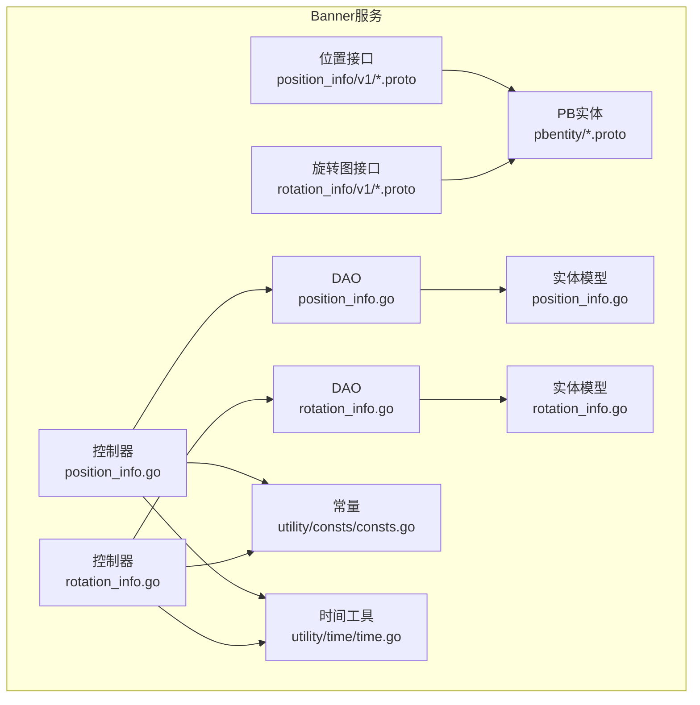
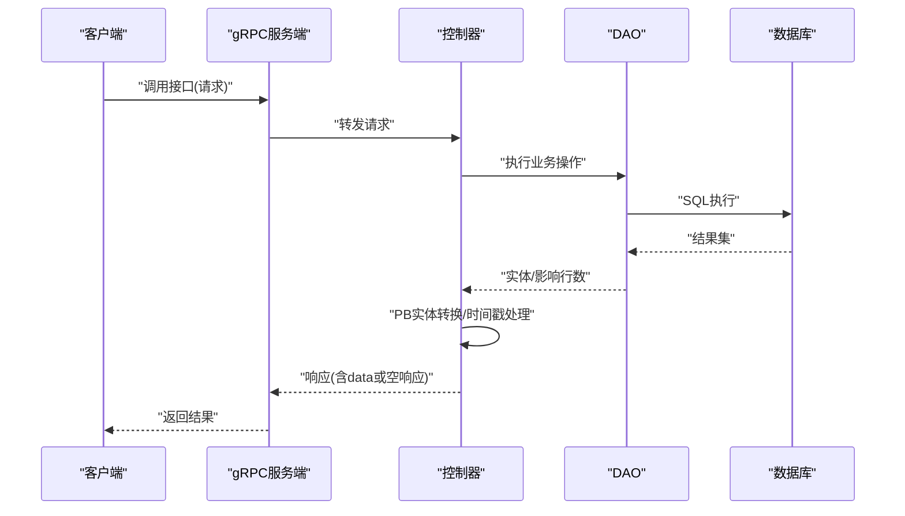
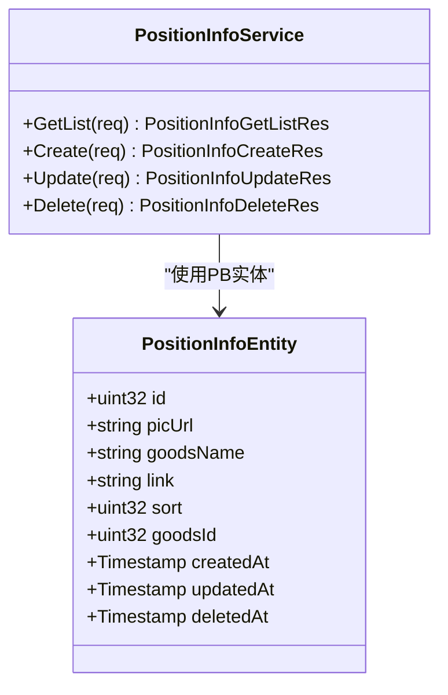
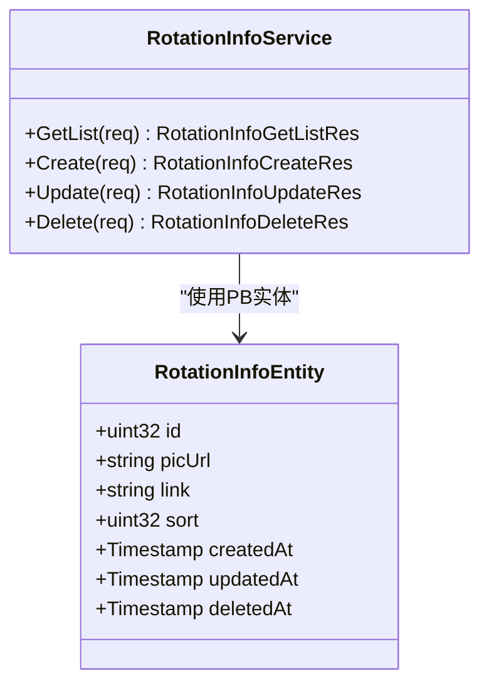
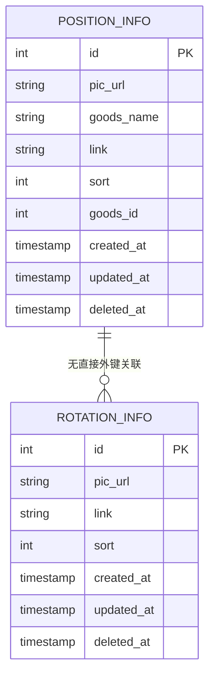
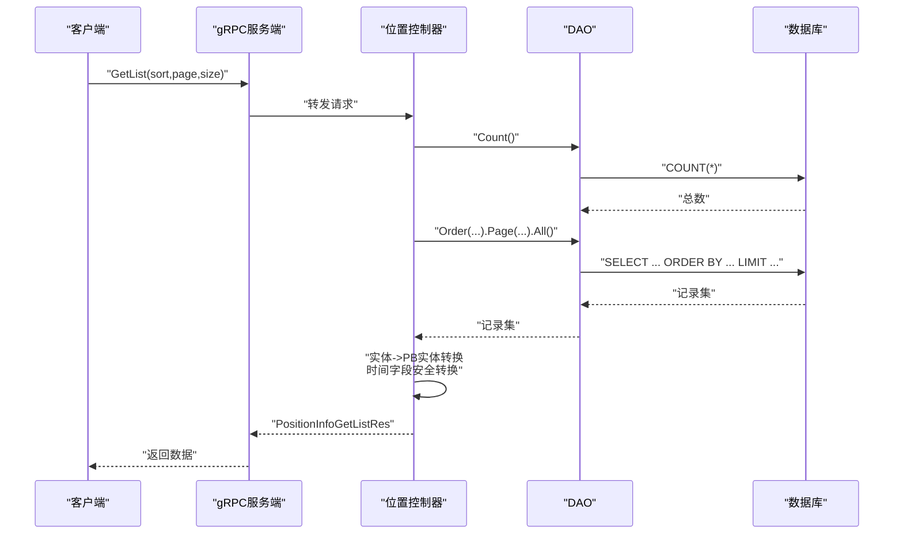
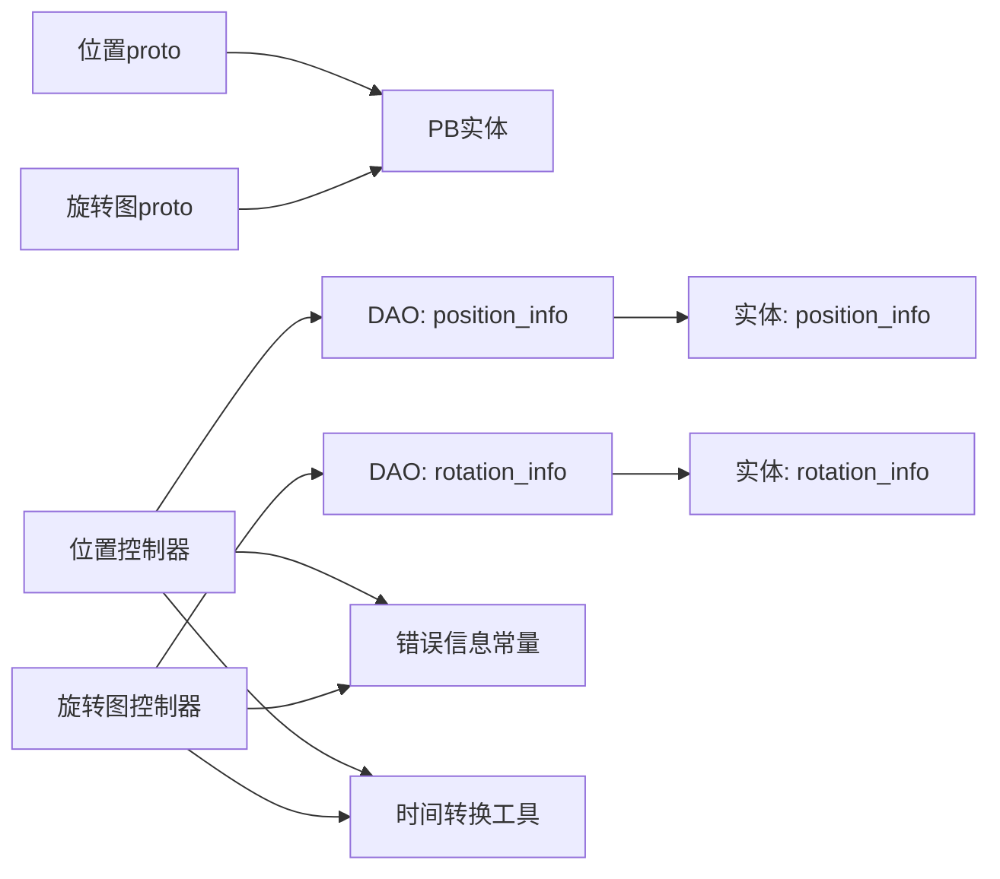

# API接口参考

<cite>
**本文引用的文件**
- [position_info.proto](file://app/banner/manifest/protobuf/position_info/v1/position_info.proto)
- [rotation_info.proto](file://app/banner/manifest/protobuf/rotation_info/v1/rotation_info.proto)
- [position_info.go](file://app/banner/internal/controller/position_info/position_info.go)
- [rotation_info.go](file://app/banner/internal/controller/rotation_info/rotation_info.go)
- [position_info.go](file://app/banner/internal/model/entity/position_info.go)
- [rotation_info.go](file://app/banner/internal/model/entity/rotation_info.go)
- [position_info.proto](file://app/banner/manifest/protobuf/pbentity/position_info.proto)
- [rotation_info.proto](file://app/banner/manifest/protobuf/pbentity/rotation_info.proto)
- [consts.go](file://app/banner/internal/consts/consts.go)
- [consts.go](file://utility/consts/consts.go)
- [time.go](file://utility/time/time.go)
</cite>

## 目录
1. [简介](#简介)
2. [项目结构](#项目结构)
3. [核心组件](#核心组件)
4. [架构总览](#架构总览)
5. [详细组件分析](#详细组件分析)
6. [依赖关系分析](#依赖关系分析)
7. [性能考虑](#性能考虑)
8. [故障排查指南](#故障排查指南)
9. [结论](#结论)
10. [附录](#附录)

## 简介
本文件为轮播图服务的gRPC接口参考文档，覆盖以下内容：
- 位置管理相关接口：列表查询、创建、更新、删除
- 旋转图管理相关接口：列表查询、创建、更新、删除
- 请求参数、响应格式、错误码与通用约定
- 接口版本管理、兼容性说明与最佳实践

## 项目结构
轮播图服务位于 app/banner 子模块，采用分层架构：
- Protobuf 定义：位于 manifest/protobuf 下，分别定义了位置与旋转图的v1服务接口与实体消息
- 控制器层：位于 internal/controller，实现gRPC服务端逻辑
- 实体与DAO：位于 internal/model/entity 与 internal/dao，提供数据库访问能力
- 工具与常量：位于 utility 与 internal/consts，提供时间转换与业务错误信息拼接

**图表来源**
- [position_info.proto](file://app/banner/manifest/protobuf/position_info/v1/position_info.proto#L1-L66)
- [rotation_info.proto](file://app/banner/manifest/protobuf/rotation_info/v1/rotation_info.proto#L1-L62)
- [position_info.go](file://app/banner/internal/controller/position_info/position_info.go#L1-L123)
- [rotation_info.go](file://app/banner/internal/controller/rotation_info/rotation_info.go#L1-L122)
- [position_info.go](file://app/banner/internal/model/entity/position_info.go#L1-L23)
- [rotation_info.go](file://app/banner/internal/model/entity/rotation_info.go#L1-L21)
- [consts.go](file://utility/consts/consts.go#L1-L47)
- [time.go](file://utility/time/time.go#L1-L18)

**章节来源**
- [position_info.proto](file://app/banner/manifest/protobuf/position_info/v1/position_info.proto#L1-L66)
- [rotation_info.proto](file://app/banner/manifest/protobuf/rotation_info/v1/rotation_info.proto#L1-L62)
- [position_info.go](file://app/banner/internal/controller/position_info/position_info.go#L1-L123)
- [rotation_info.go](file://app/banner/internal/controller/rotation_info/rotation_info.go#L1-L122)

## 核心组件
- 位置信息服务：提供位置列表查询、创建、更新、删除接口
- 旋转图信息服务：提供旋转图列表查询、创建、更新、删除接口
- PB实体：统一gRPC传输对象，包含标准时间戳字段
- 控制器：封装gRPC服务端逻辑，负责参数校验、DAO调用、结果转换与错误包装
- DAO与实体：映射数据库表结构，提供插入、查询、更新、删除能力
- 工具与常量：提供错误信息拼接与时间戳安全转换

**章节来源**
- [position_info.proto](file://app/banner/manifest/protobuf/position_info/v1/position_info.proto#L9-L14)
- [rotation_info.proto](file://app/banner/manifest/protobuf/rotation_info/v1/rotation_info.proto#L9-L14)
- [position_info.go](file://app/banner/internal/controller/position_info/position_info.go#L19-L25)
- [rotation_info.go](file://app/banner/internal/controller/rotation_info/rotation_info.go#L19-L25)
- [position_info.go](file://app/banner/internal/model/entity/position_info.go#L11-L22)
- [rotation_info.go](file://app/banner/internal/model/entity/rotation_info.go#L11-L20)
- [consts.go](file://utility/consts/consts.go#L3-L46)
- [time.go](file://utility/time/time.go#L9-L17)

## 架构总览
gRPC服务通过控制器层对接DAO层，DAO层基于ORM访问数据库；PB实体用于跨语言传输，时间字段统一为标准时间戳。

**图表来源**
- [position_info.go](file://app/banner/internal/controller/position_info/position_info.go#L27-L79)
- [rotation_info.go](file://app/banner/internal/controller/rotation_info/rotation_info.go#L27-L78)
- [position_info.go](file://app/banner/internal/dao/position_info.go#L13-L20)
- [rotation_info.go](file://app/banner/internal/dao/rotation_info.go#L13-L20)

## 详细组件分析

### 位置信息服务 API 规范

- 服务名：position_info.v1.position_info
- 方法：
  - GetList：获取位置列表
  - Create：创建位置
  - Update：更新位置
  - Delete：删除位置

**图表来源**
- [position_info.proto](file://app/banner/manifest/protobuf/position_info/v1/position_info.proto#L9-L14)
- [position_info.proto](file://app/banner/manifest/protobuf/pbentity/position_info.proto#L13-L23)

- 请求与响应定义（节选）
  - GetList
    - 请求：PositionInfoGetListReq
      - sort: uint32（排序方式，2表示降序，默认升序）
      - page: uint32（页码）
      - size: uint32（每页条数）
    - 响应：PositionInfoGetListRes.data.PositionInfoListResponse
      - list: pbentity.PositionInfo[]
      - page: uint32
      - size: uint32
      - total: uint32
  - Create
    - 请求：PositionInfoCreateReq
      - picUrl: string（图片链接）
      - goodsName: string（商品名称）
      - link: string（跳转链接）
      - sort: uint32（排序）
      - goodsId: uint32（商品id）
    - 响应：PositionInfoCreateRes
      - id: uint32（新创建记录ID）
  - Update
    - 请求：PositionInfoUpdateReq
      - id: uint32（主键）
      - picUrl: string
      - goodsName: string
      - link: string
      - sort: uint32
      - goodsId: uint32
    - 响应：PositionInfoUpdateRes
      - id: uint32（更新记录ID）
  - Delete
    - 请求：PositionInfoDeleteReq
      - id: uint32（主键）
    - 响应：PositionInfoDeleteRes（空）

- 参数说明与约束
  - sort 字段：2 表示按 sort 降序，其他值默认升序
  - page/size：分页参数，需满足业务分页规则
  - 时间字段：CreatedAt/UpdatedAt/DeletedAt 统一为标准时间戳

- 错误码与错误信息
  - 数据库操作异常：gcode.CodeDbOperationError
  - 错误信息拼接：由 utility/consts 提供，格式为“模块名 + 失败描述”
  - 示例错误信息片段：GetListFail、CreateFail、UpdateFail、DeleteFail

- 调用流程与注意事项
  - GetList：先统计总数，再按排序与分页查询，最后进行实体到PB的转换并安全处理时间字段
  - Create/Update/Delete：直接委托DAO执行，返回ID或空响应
  - 时间字段转换：使用工具函数确保PB时间戳正确

**章节来源**
- [position_info.proto](file://app/banner/manifest/protobuf/position_info/v1/position_info.proto#L9-L66)
- [position_info.go](file://app/banner/internal/controller/position_info/position_info.go#L27-L122)
- [position_info.go](file://app/banner/internal/model/entity/position_info.go#L11-L22)
- [position_info.proto](file://app/banner/manifest/protobuf/pbentity/position_info.proto#L13-L23)
- [consts.go](file://utility/consts/consts.go#L3-L46)
- [time.go](file://utility/time/time.go#L9-L17)

### 旋转图信息服务 API 规范

- 服务名：rotation_info.v1.rotation_info
- 方法：
  - GetList：获取旋转图列表
  - Create：创建旋转图
  - Update：更新旋转图
  - Delete：删除旋转图

**图表来源**
- [rotation_info.proto](file://app/banner/manifest/protobuf/rotation_info/v1/rotation_info.proto#L9-L14)
- [rotation_info.proto](file://app/banner/manifest/protobuf/pbentity/rotation_info.proto#L13-L21)

- 请求与响应定义（节选）
  - GetList
    - 请求：RotationInfoGetListReq
      - sort: uint32（排序方式，2表示降序，默认升序）
      - page: uint32（页码）
      - size: uint32（每页条数）
    - 响应：RotationInfoGetListRes.data.RotationInfoListResponse
      - list: pbentity.RotationInfo[]
      - page: uint32
      - size: uint32
      - total: uint32
  - Create
    - 请求：RotationInfoCreateReq
      - picUrl: string（轮播图片）
      - link: string（跳转链接）
      - sort: uint32（排序字段）
    - 响应：RotationInfoCreateRes
      - id: uint32（新创建记录ID）
  - Update
    - 请求：RotationInfoUpdateReq
      - id: uint32（主键）
      - picUrl: string
      - link: string
      - sort: uint32
    - 响应：RotationInfoUpdateRes
      - id: uint32（更新记录ID）
  - Delete
    - 请求：RotationInfoDeleteReq
      - id: uint32（主键）
    - 响应：RotationInfoDeleteRes（空）

- 参数说明与约束
  - sort 字段：2 表示按 sort 降序，其他值默认升序
  - page/size：分页参数，需满足业务分页规则
  - 时间字段：CreatedAt/UpdatedAt/DeletedAt 统一为标准时间戳

- 错误码与错误信息
  - 数据库操作异常：gcode.CodeDbOperationError
  - 错误信息拼接：由 utility/consts 提供，格式为“模块名 + 失败描述”
  - 示例错误信息片段：GetListFail、CreateFail、UpdateFail、DeleteFail

- 调用流程与注意事项
  - GetList：先统计总数，再按排序与分页查询，最后进行实体到PB的转换并安全处理时间字段
  - Create/Update/Delete：直接委托DAO执行，返回ID或空响应
  - 时间字段转换：使用工具函数确保PB时间戳正确

**章节来源**
- [rotation_info.proto](file://app/banner/manifest/protobuf/rotation_info/v1/rotation_info.proto#L9-L62)
- [rotation_info.go](file://app/banner/internal/controller/rotation_info/rotation_info.go#L27-L122)
- [rotation_info.go](file://app/banner/internal/model/entity/rotation_info.go#L11-L20)
- [rotation_info.proto](file://app/banner/manifest/protobuf/pbentity/rotation_info.proto#L13-L21)
- [consts.go](file://utility/consts/consts.go#L3-L46)
- [time.go](file://utility/time/time.go#L9-L17)

### 数据模型与实体映射

**图表来源**
- [position_info.go](file://app/banner/internal/model/entity/position_info.go#L11-L22)
- [rotation_info.go](file://app/banner/internal/model/entity/rotation_info.go#L11-L20)

**章节来源**
- [position_info.go](file://app/banner/internal/model/entity/position_info.go#L11-L22)
- [rotation_info.go](file://app/banner/internal/model/entity/rotation_info.go#L11-L20)

### 接口调用序列示例

以“位置列表查询”为例：

**图表来源**
- [position_info.go](file://app/banner/internal/controller/position_info/position_info.go#L27-L79)
- [position_info.go](file://app/banner/internal/dao/position_info.go#L13-L20)

## 依赖关系分析

**图表来源**
- [position_info.proto](file://app/banner/manifest/protobuf/position_info/v1/position_info.proto#L1-L66)
- [rotation_info.proto](file://app/banner/manifest/protobuf/rotation_info/v1/rotation_info.proto#L1-L62)
- [position_info.go](file://app/banner/internal/controller/position_info/position_info.go#L1-L123)
- [rotation_info.go](file://app/banner/internal/controller/rotation_info/rotation_info.go#L1-L122)
- [position_info.go](file://app/banner/internal/dao/position_info.go#L1-L23)
- [rotation_info.go](file://app/banner/internal/dao/rotation_info.go#L1-L23)
- [position_info.go](file://app/banner/internal/model/entity/position_info.go#L1-L23)
- [rotation_info.go](file://app/banner/internal/model/entity/rotation_info.go#L1-L21)
- [consts.go](file://utility/consts/consts.go#L1-L47)
- [time.go](file://utility/time/time.go#L1-L18)

**章节来源**
- [position_info.go](file://app/banner/internal/controller/position_info/position_info.go#L1-L123)
- [rotation_info.go](file://app/banner/internal/controller/rotation_info/rotation_info.go#L1-L122)
- [position_info.go](file://app/banner/internal/dao/position_info.go#L1-L23)
- [rotation_info.go](file://app/banner/internal/dao/rotation_info.go#L1-L23)
- [consts.go](file://utility/consts/consts.go#L1-L47)

## 性能考虑
- 分页查询：GetList 支持分页参数，建议前端传入合理的 page/size，避免一次性拉取过多数据
- 排序策略：sort=2 表示降序，注意索引与排序字段的数据库优化
- 时间字段处理：控制器对时间字段进行安全转换，避免空指针导致的序列化问题
- 批量操作：当前接口未提供批量操作，如需批量导入/导出，请在客户端或网关层进行批量化处理

## 故障排查指南
- 常见错误
  - 数据库操作异常：gcode.CodeDbOperationError，错误信息由 utility/consts 拼接
  - GetList/Create/Update/Delete 失败：对应模块的失败描述
- 排查步骤
  - 检查请求参数合法性（id、sort、page、size）
  - 查看服务端日志中的错误堆栈
  - 确认数据库连接与表结构一致
  - 验证PB实体与数据库字段映射关系
- 建议
  - 对外暴露的接口尽量保持幂等性
  - 在网关层增加限流与熔断策略
  - 对关键路径增加链路追踪与指标埋点

**章节来源**
- [position_info.go](file://app/banner/internal/controller/position_info/position_info.go#L27-L122)
- [rotation_info.go](file://app/banner/internal/controller/rotation_info/rotation_info.go#L27-L122)
- [consts.go](file://utility/consts/consts.go#L3-L46)

## 结论
本文档梳理了轮播图服务的位置与旋转图管理接口，明确了请求/响应结构、参数约束、错误处理与调用流程，并提供了架构视图与排障建议。建议在实际接入时严格遵循接口规范与版本约定，确保前后端与网关的一致性。

## 附录

### 版本管理与兼容性
- 当前接口版本：v1
- 兼容性原则
  - 向后兼容：新增字段采用可选语义，不破坏既有客户端
  - 不破坏性变更：仅扩展字段或新增方法，不修改现有字段编号与语义
  - 迁移策略：若必须破坏性变更，建议引入新版本接口并逐步迁移

### 最佳实践
- 参数校验：在网关层与服务层均进行参数校验
- 错误处理：统一使用 gRPC 状态码与自定义错误信息
- 日志与监控：为每个接口埋点请求耗时、错误率与成功率
- 安全：对敏感字段进行脱敏与权限控制
- 文档同步：Protobuf 与接口文档保持同步更新