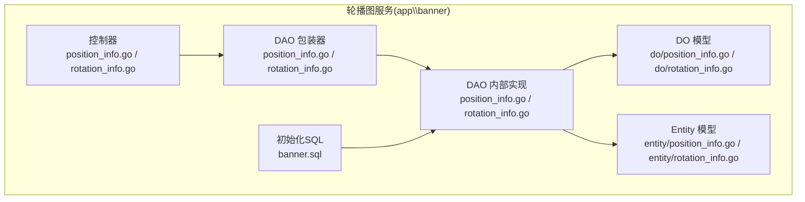
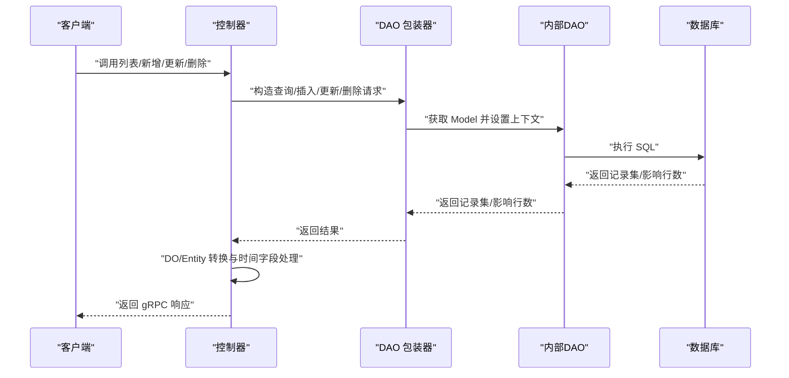
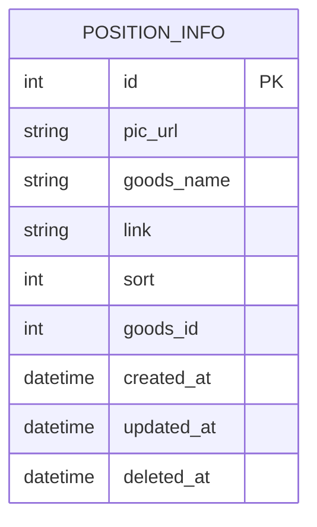
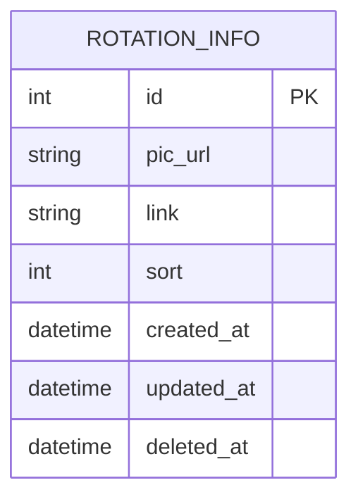
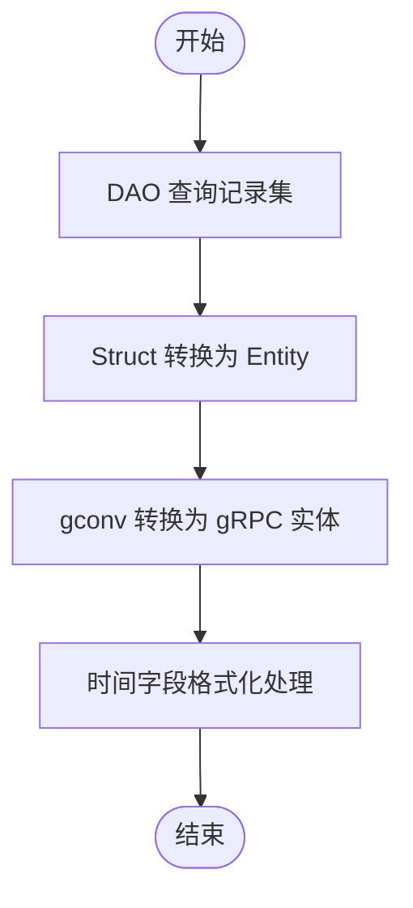
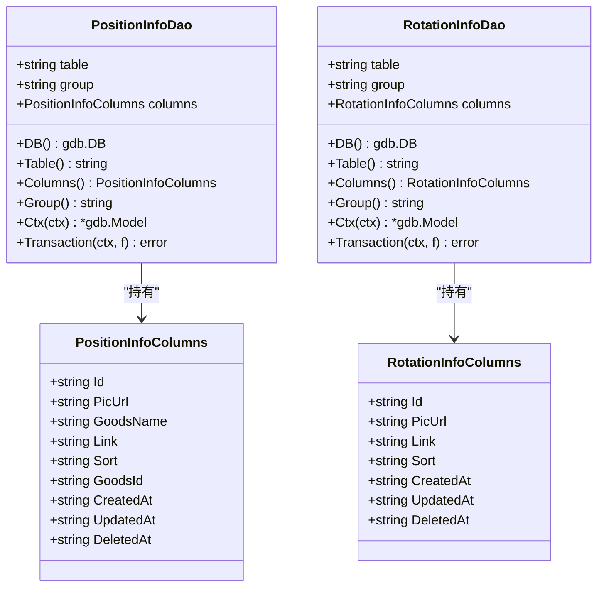
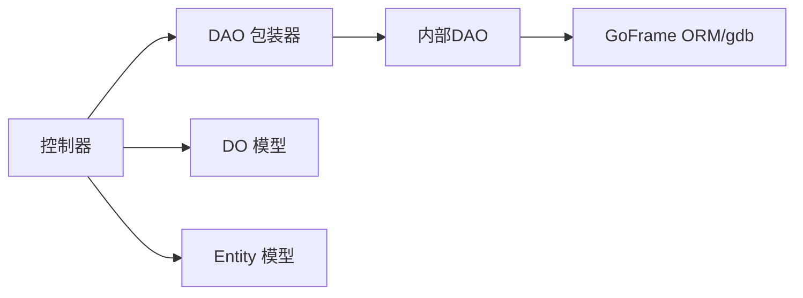
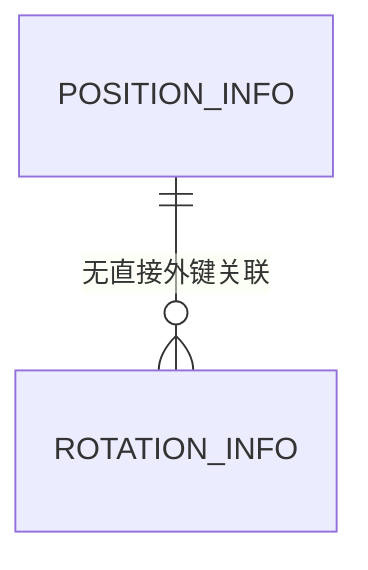

# 数据模型设计

<cite>
**本文引用的文件**
- [app\banner\hack\banner.sql](file://app/banner/hack/banner.sql)
- [app\banner\internal\model\do\position_info.go](file://app/banner/internal/model/do/position_info.go)
- [app\banner\internal\model\do\rotation_info.go](file://app/banner/internal/model/do/rotation_info.go)
- [app\banner\internal\model\entity\position_info.go](file://app/banner/internal/model/entity/position_info.go)
- [app\banner\internal\model\entity\rotation_info.go](file://app/banner/internal/model/entity/rotation_info.go)
- [app\banner\internal\dao\internal\position_info.go](file://app/banner/internal/dao/internal/position_info.go)
- [app\banner\internal\dao\internal\rotation_info.go](file://app/banner/internal/dao/internal/rotation_info.go)
- [app\banner\internal\dao\position_info.go](file://app/banner/internal/dao/position_info.go)
- [app\banner\internal\dao\rotation_info.go](file://app/banner/internal/dao/rotation_info.go)
- [app\banner\internal\controller\position_info\position_info.go](file://app/banner/internal/controller/position_info/position_info.go)
- [app\banner\internal\controller\rotation_info\rotation_info.go](file://app/banner/internal/controller/rotation_info/rotation_info.go)
</cite>

## 目录
1. [简介](#简介)
2. [项目结构](#项目结构)
3. [核心组件](#核心组件)
4. [架构总览](#架构总览)
5. [详细组件分析](#详细组件分析)
6. [依赖分析](#依赖分析)
7. [性能考虑](#性能考虑)
8. [故障排查指南](#故障排查指南)
9. [结论](#结论)
10. [附录](#附录)

## 简介
本文件聚焦于轮播图服务的数据模型设计，围绕“位置信息表”和“旋转图表”的表结构、实体映射、DO/Entity转换规则、设计原则与性能优化进行系统化梳理，并提供ER图与字段说明，帮助开发者快速理解与维护该模块。

## 项目结构
轮播图服务位于 app/banner 目录下，采用典型的分层结构：DAO 层负责数据库访问；model 层包含 DO（用于查询条件与批量数据）与 Entity（面向业务的持久化对象）；controller 层通过 gRPC 提供对外接口；SQL 初始化脚本位于 hack 目录。

**图示来源**
- [app\banner\internal\dao\internal\position_info.go](file://app/banner/internal/dao/internal/position_info.go#L1-L96)
- [app\banner\internal\dao\internal\rotation_info.go](file://app/banner/internal/dao/internal/rotation_info.go#L1-L92)
- [app\banner\internal\dao\position_info.go](file://app/banner/internal/dao/position_info.go#L1-L23)
- [app\banner\internal\dao\rotation_info.go](file://app/banner/internal/dao/rotation_info.go#L1-L23)
- [app\banner\internal\model\do\position_info.go](file://app/banner/internal/model/do/position_info.go#L1-L25)
- [app\banner\internal\model\do\rotation_info.go](file://app/banner/internal/model/do/rotation_info.go#L1-L23)
- [app\banner\internal\model\entity\position_info.go](file://app/banner/internal/model/entity/position_info.go#L1-L23)
- [app\banner\internal\model\entity\rotation_info.go](file://app/banner/internal/model/entity/rotation_info.go#L1-L21)
- [app\banner\internal\controller\position_info\position_info.go](file://app/banner/internal/controller/position_info/position_info.go#L1-L123)
- [app\banner\internal\controller\rotation_info\rotation_info.go](file://app/banner/internal/controller/rotation_info/rotation_info.go#L1-L122)
- [app\banner\hack\banner.sql](file://app/banner/hack/banner.sql#L1-L44)

**章节来源**
- [app\banner\internal\dao\internal\position_info.go](file://app/banner/internal/dao/internal/position_info.go#L1-L96)
- [app\banner\internal\dao\internal\rotation_info.go](file://app/banner/internal/dao/internal/rotation_info.go#L1-L92)
- [app\banner\internal\dao\position_info.go](file://app/banner/internal/dao/position_info.go#L1-L23)
- [app\banner\internal\dao\rotation_info.go](file://app/banner/internal/dao/rotation_info.go#L1-L23)
- [app\banner\internal\model\do\position_info.go](file://app/banner/internal/model/do/position_info.go#L1-L25)
- [app\banner\internal\model\do\rotation_info.go](file://app/banner/internal/model/do/rotation_info.go#L1-L23)
- [app\banner\internal\model\entity\position_info.go](file://app/banner/internal/model/entity/position_info.go#L1-L23)
- [app\banner\internal\model\entity\rotation_info.go](file://app/banner/internal/model/entity/rotation_info.go#L1-L21)
- [app\banner\internal\controller\position_info\position_info.go](file://app/banner/internal/controller/position_info/position_info.go#L1-L123)
- [app\banner\internal\controller\rotation_info\rotation_info.go](file://app/banner/internal/controller/rotation_info/rotation_info.go#L1-L122)
- [app\banner\hack\banner.sql](file://app/banner/hack/banner.sql#L1-L44)

## 核心组件
- 表结构与索引
  - 位置信息表 position_info：包含主键 id、图片链接 pic_url、商品名称 goods_name、跳转链接 link、排序 sort、商品 id goods_id、软删 deleted_at 等字段。
  - 旋转图表 rotation_info：包含主键 id、轮播图片 pic_url、跳转链接 link、排序 sort、软删 deleted_at 等字段。
- DO（Data Object）
  - 用于 DAO 查询条件与批量数据传输，字段类型多为 interface{}，便于灵活传参。
- Entity（领域实体）
  - 面向业务的强类型结构，字段具备明确的类型与标签，便于序列化与跨层传递。
- DAO 层
  - 内部 DAO 封装了表名、列名、事务、上下文 Model 等能力；包装器提供全局单例访问入口。
- 控制器层
  - 通过 gRPC 对外暴露 CRUD 接口，内部完成 DO/Entity 的转换与时间字段处理。

**章节来源**
- [app\banner\hack\banner.sql](file://app/banner/hack/banner.sql#L6-L16)
- [app\banner\hack\banner.sql](file://app/banner/hack/banner.sql#L26-L38)
- [app\banner\internal\model\do\position_info.go](file://app/banner/internal/model/do/position_info.go#L12-L24)
- [app\banner\internal\model\do\rotation_info.go](file://app/banner/internal/model/do/rotation_info.go#L12-L22)
- [app\banner\internal\model\entity\position_info.go](file://app/banner/internal/model/entity/position_info.go#L11-L22)
- [app\banner\internal\model\entity\rotation_info.go](file://app/banner/internal/model/entity/rotation_info.go#L11-L20)
- [app\banner\internal\dao\internal\position_info.go](file://app/banner/internal/dao/internal/position_info.go#L14-L56)
- [app\banner\internal\dao\internal\rotation_info.go](file://app/banner/internal/dao/internal/rotation_info.go#L14-L52)
- [app\banner\internal\dao\position_info.go](file://app/banner/internal/dao/position_info.go#L11-L20)
- [app\banner\internal\dao\rotation_info.go](file://app/banner/internal/dao/rotation_info.go#L11-L20)

## 架构总览
轮播图服务遵循“控制器 -> DAO -> 内部DAO/模型”的调用链，数据在 DO 与 Entity 之间按需转换，最终由 gRPC 返回给客户端。

**图示来源**
- [app\banner\internal\controller\position_info\position_info.go](file://app/banner/internal/controller/position_info/position_info.go#L27-L79)
- [app\banner\internal\controller\rotation_info\rotation_info.go](file://app/banner/internal/controller/rotation_info/rotation_info.go#L27-L79)
- [app\banner\internal\dao\position_info.go](file://app/banner/internal/dao/position_info.go#L11-L20)
- [app\banner\internal\dao\rotation_info.go](file://app/banner/internal/dao/rotation_info.go#L11-L20)
- [app\banner\internal\dao\internal\position_info.go](file://app/banner/internal/dao/internal/position_info.go#L78-L85)
- [app\banner\internal\dao\internal\rotation_info.go](file://app/banner/internal/dao/internal/rotation_info.go#L74-L81)

## 详细组件分析

### 位置信息表（position_info）
- 字段定义与约束
  - id：自增主键
  - pic_url：字符串，非空，默认空串
  - goods_name：字符串，非空，默认空串
  - link：字符串，非空，默认空串
  - sort：整型，非空，默认0
  - goods_id：整型，非空，默认0
  - created_at/updated_at/deleted_at：时间戳，支持软删
- 索引设计
  - 主键：id（隐式唯一）
  - 建议：如按 goods_id 查询频繁，可考虑添加索引
- 实体映射
  - DO：字段类型为 interface{}，便于 Where/Data 动态传参
  - Entity：字段为强类型，含 JSON 标签与 ORM 映射标签
- 控制器流程
  - 列表：统计总数、分页查询、记录转换为 Entity，再转换为 gRPC 实体
  - 新增/更新/删除：直接基于请求体写入或按 id 更新/删除

**图示来源**
- [app\banner\hack\banner.sql](file://app/banner/hack/banner.sql#L26-L38)
- [app\banner\internal\model\do\position_info.go](file://app/banner/internal/model/do/position_info.go#L12-L24)
- [app\banner\internal\model\entity\position_info.go](file://app/banner/internal/model/entity/position_info.go#L11-L22)

**章节来源**
- [app\banner\hack\banner.sql](file://app/banner/hack/banner.sql#L26-L38)
- [app\banner\internal\model\do\position_info.go](file://app/banner/internal/model/do/position_info.go#L12-L24)
- [app\banner\internal\model\entity\position_info.go](file://app/banner/internal/model/entity/position_info.go#L11-L22)
- [app\banner\internal\controller\position_info\position_info.go](file://app/banner/internal/controller/position_info/position_info.go#L27-L79)

### 旋转图表（rotation_info）
- 字段定义与约束
  - id：自增主键
  - pic_url：字符串，非空，默认空串
  - link：字符串，非空，默认空串
  - sort：整型，非空，默认0
  - created_at/updated_at/deleted_at：时间戳，支持软删
- 索引设计
  - 主键：id（隐式唯一）
  - 建议：如按 sort 排序展示，可考虑在 sort 上建立索引以优化排序
- 实体映射
  - DO：字段类型为 interface{}，便于 Where/Data 动态传参
  - Entity：字段为强类型，含 JSON 标签与 ORM 映射标签
- 控制器流程
  - 列表：统计总数、分页查询、记录转换为 Entity，再转换为 gRPC 实体
  - 新增/更新/删除：直接基于请求体写入或按 id 更新/删除

**图示来源**
- [app\banner\hack\banner.sql](file://app/banner/hack/banner.sql#L6-L16)
- [app\banner\internal\model\do\rotation_info.go](file://app/banner/internal/model/do/rotation_info.go#L12-L22)
- [app\banner\internal\model\entity\rotation_info.go](file://app/banner/internal/model/entity/rotation_info.go#L11-L20)

**章节来源**
- [app\banner\hack\banner.sql](file://app/banner/hack/banner.sql#L6-L16)
- [app\banner\internal\model\do\rotation_info.go](file://app/banner/internal/model/do/rotation_info.go#L12-L22)
- [app\banner\internal\model\entity\rotation_info.go](file://app/banner/internal/model/entity/rotation_info.go#L11-L20)
- [app\banner\internal\controller\rotation_info\rotation_info.go](file://app/banner/internal/controller/rotation_info/rotation_info.go#L27-L79)

### DO 与 Entity 的转换关系
- 转换路径
  - DAO 查询返回原始记录，先 Struct 转为 Entity，再通过 gconv 转为 gRPC 实体 pbentity
  - 时间字段单独处理，确保序列化一致
- 映射规则
  - DO 字段名与 Entity 字段名通过 ORM 标签映射到数据库列名
  - JSON 标签用于对外序列化，字段命名采用驼峰风格
- 示例流程（位置信息）

**图示来源**
- [app\banner\internal\controller\position_info\position_info.go](file://app/banner/internal/controller/position_info/position_info.go#L59-L78)
- [app\banner\internal\controller\rotation_info\rotation_info.go](file://app/banner/internal/controller/rotation_info/rotation_info.go#L58-L77)

**章节来源**
- [app\banner\internal\controller\position_info\position_info.go](file://app/banner/internal/controller/position_info/position_info.go#L59-L78)
- [app\banner\internal\controller\rotation_info\rotation_info.go](file://app/banner/internal/controller/rotation_info/rotation_info.go#L58-L77)

### 类关系图（代码级）

**图示来源**
- [app\banner\internal\dao\internal\position_info.go](file://app/banner/internal/dao/internal/position_info.go#L14-L56)
- [app\banner\internal\dao\internal\rotation_info.go](file://app/banner/internal/dao/internal/rotation_info.go#L14-L52)

**章节来源**
- [app\banner\internal\dao\internal\position_info.go](file://app/banner/internal/dao/internal/position_info.go#L14-L56)
- [app\banner\internal\dao\internal\rotation_info.go](file://app/banner/internal/dao/internal/rotation_info.go#L14-L52)

## 依赖分析
- 组件耦合
  - 控制器依赖 DAO 包装器；DAO 包装器依赖内部 DAO；内部 DAO 依赖 GoFrame gdb.Model
  - DO/Entity 仅作为数据载体，彼此无直接依赖，通过控制器进行转换
- 外部依赖
  - gRPC 服务注册与调用
  - GoFrame ORM 与 gdb
- 潜在风险
  - 若未正确设置上下文或事务，可能导致并发与一致性问题
  - 时间字段转换需统一处理，避免序列化差异

**图示来源**
- [app\banner\internal\controller\position_info\position_info.go](file://app/banner/internal/controller/position_info/position_info.go#L1-L123)
- [app\banner\internal\controller\rotation_info\rotation_info.go](file://app/banner/internal/controller/rotation_info/rotation_info.go#L1-L122)
- [app\banner\internal\dao\position_info.go](file://app/banner/internal/dao/position_info.go#L1-L23)
- [app\banner\internal\dao\rotation_info.go](file://app/banner/internal/dao/rotation_info.go#L1-L23)
- [app\banner\internal\dao\internal\position_info.go](file://app/banner/internal/dao/internal/position_info.go#L1-L96)
- [app\banner\internal\dao\internal\rotation_info.go](file://app/banner/internal/dao/internal/rotation_info.go#L1-L92)

**章节来源**
- [app\banner\internal\controller\position_info\position_info.go](file://app/banner/internal/controller/position_info/position_info.go#L1-L123)
- [app\banner\internal\controller\rotation_info\rotation_info.go](file://app/banner/internal/controller/rotation_info/rotation_info.go#L1-L122)
- [app\banner\internal\dao\position_info.go](file://app/banner/internal/dao/position_info.go#L1-L23)
- [app\banner\internal\dao\rotation_info.go](file://app/banner/internal/dao/rotation_info.go#L1-L23)
- [app\banner\internal\dao\internal\position_info.go](file://app/banner/internal/dao/internal/position_info.go#L1-L96)
- [app\banner\internal\dao\internal\rotation_info.go](file://app/banner/internal/dao/internal/rotation_info.go#L1-L92)

## 性能考虑
- 索引优化
  - position_info：若按 goods_id 过滤/关联频繁，建议在 goods_id 上建立索引
  - rotation_info：若按 sort 排序展示，建议在 sort 上建立索引以减少排序成本
- 分页与排序
  - 列表接口已支持按 sort 排序与分页，建议结合索引提升查询效率
- 软删策略
  - 通过 deleted_at 支持软删，查询时需注意过滤逻辑，避免误查
- 字段类型
  - sort 使用整型，有利于排序与比较；pic_url/link 使用字符串，建议控制长度以降低存储与索引开销

[本节为通用性能建议，无需特定文件引用]

## 故障排查指南
- 常见错误与定位
  - 数据库操作错误：控制器对 gerror 包装了统一错误码，便于前端识别
  - 结构转换错误：记录转换为 Entity 或 gRPC 实体时可能失败，需检查 ORM 标签与字段类型
  - 时间字段异常：需确保在转换链路中统一处理时间字段
- 关键检查点
  - DAO 查询是否正确设置上下文与事务
  - DO/Entity 字段映射是否与数据库列名一致
  - 控制器中时间字段的显式处理是否覆盖所有场景

**章节来源**
- [app\banner\internal\controller\position_info\position_info.go](file://app/banner/internal/controller/position_info/position_info.go#L40-L44)
- [app\banner\internal\controller\position_info\position_info.go](file://app/banner/internal/controller/position_info/position_info.go#L63-L65)
- [app\banner\internal\controller\position_info\position_info.go](file://app/banner/internal/controller/position_info/position_info.go#L73-L75)
- [app\banner\internal\controller\rotation_info\rotation_info.go](file://app/banner/internal/controller/rotation_info/rotation_info.go#L42-L44)
- [app\banner\internal\controller\rotation_info\rotation_info.go](file://app/banner/internal/controller/rotation_info/rotation_info.go#L63-L65)
- [app\banner\internal\controller\rotation_info\rotation_info.go](file://app/banner/internal/controller/rotation_info/rotation_info.go#L72-L74)

## 结论
轮播图服务的数据模型设计清晰地分离了 DO/Entity 与 DAO 层，配合 gRPC 控制器实现了稳定的对外接口。通过合理的字段命名、ORM 映射与转换链路，保证了数据的一致性与可维护性。建议后续根据实际查询热点补充索引，进一步提升性能与扩展性。

## 附录
- 设计原则
  - 字段命名：采用下划线风格（数据库列名），JSON 输出采用驼峰风格
  - 数据完整性：非空字段与默认值明确，软删字段统一管理
  - 性能优化：结合查询热点建立索引，合理使用分页与排序
- ER 图示例（位置信息与旋转图）

**图示来源**
- [app\banner\hack\banner.sql](file://app/banner/hack/banner.sql#L6-L16)
- [app\banner\hack\banner.sql](file://app/banner/hack/banner.sql#L26-L38)