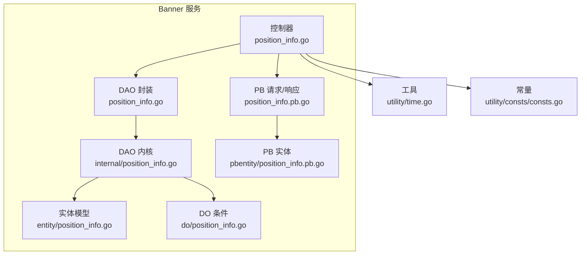
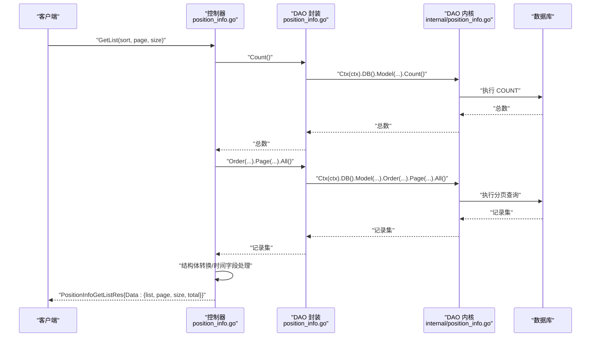
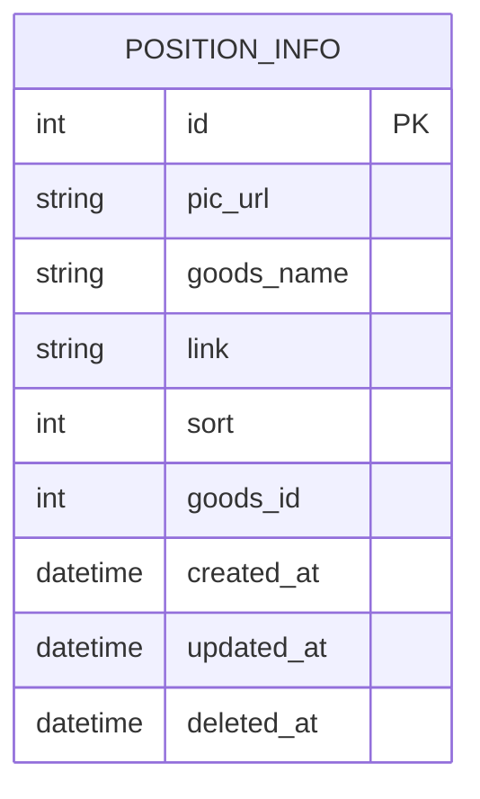
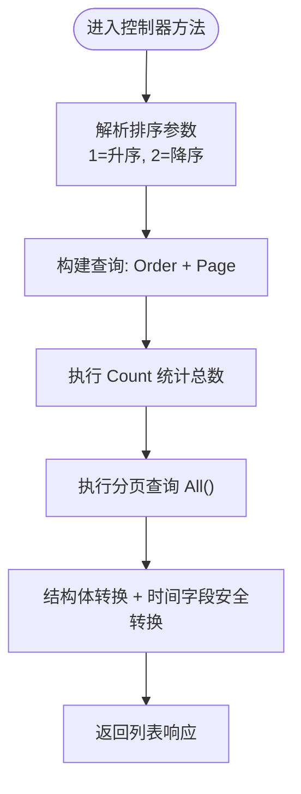
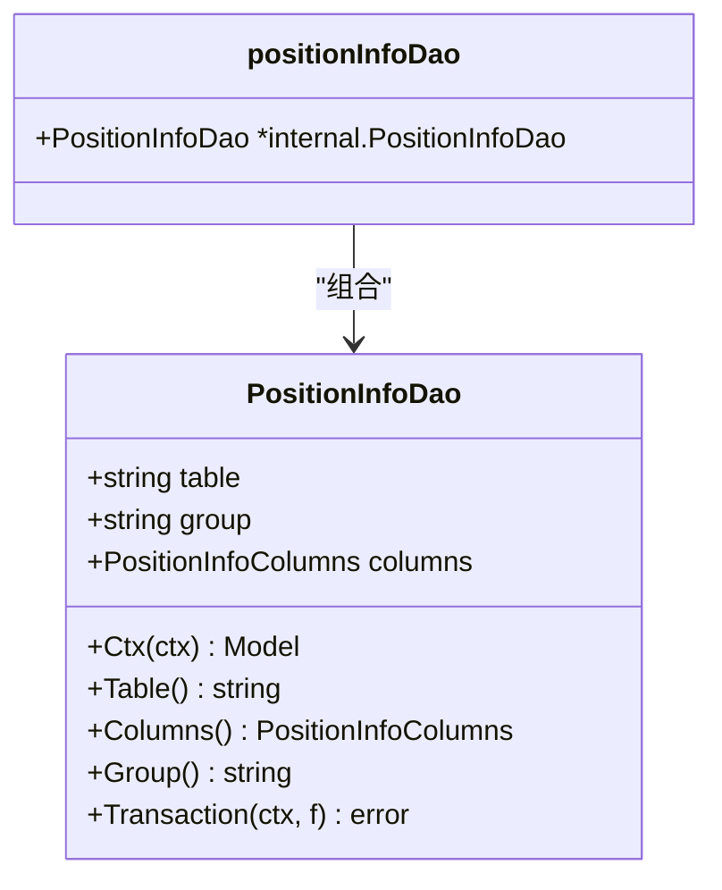
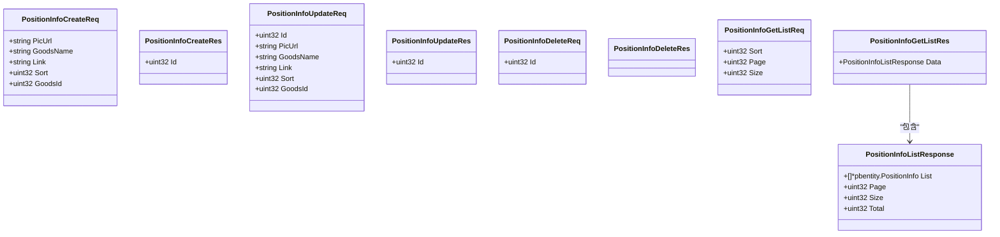
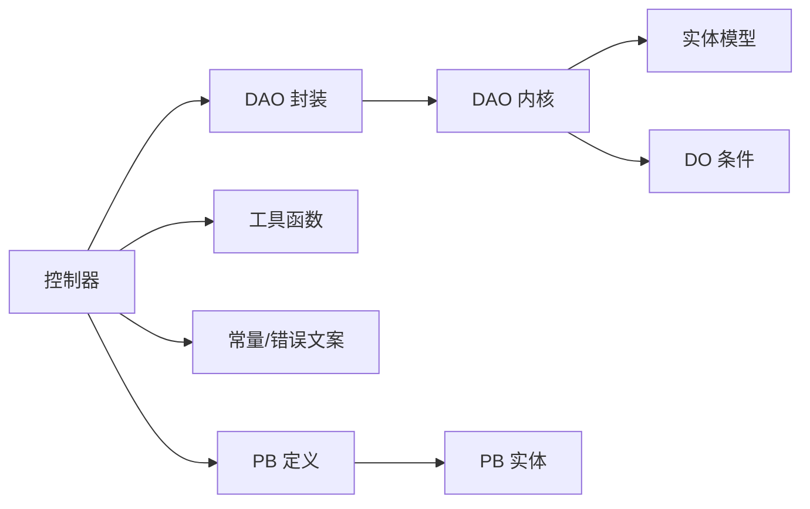

# 轮播图位置管理

<cite>
**本文引用的文件**
- [app/banner/internal/controller/position_info/position_info.go](file://app/banner/internal/controller/position_info/position_info.go)
- [app/banner/internal/dao/position_info.go](file://app/banner/internal/dao/position_info.go)
- [app/banner/internal/dao/internal/position_info.go](file://app/banner/internal/dao/internal/position_info.go)
- [app/banner/internal/model/entity/position_info.go](file://app/banner/internal/model/entity/position_info.go)
- [app/banner/internal/model/do/position_info.go](file://app/banner/internal/model/do/position_info.go)
- [app/banner/api/position_info/v1/position_info.pb.go](file://app/banner/api/position_info/v1/position_info.pb.go)
- [app/banner/api/pbentity/position_info.pb.go](file://app/banner/api/pbentity/position_info.pb.go)
- [app/banner/hack/banner.sql](file://app/banner/hack/banner.sql)
- [utility/time.go](file://utility/time.go)
- [utility/consts/consts.go](file://utility/consts/consts.go)
</cite>

## 目录
1. [简介](#简介)
2. [项目结构](#项目结构)
3. [核心组件](#核心组件)
4. [架构总览](#架构总览)
5. [详细组件分析](#详细组件分析)
6. [依赖关系分析](#依赖关系分析)
7. [性能考量](#性能考量)
8. [故障排查指南](#故障排查指南)
9. [结论](#结论)
10. [附录](#附录)

## 简介
本文件面向“轮播图位置管理”功能，系统化阐述其数据模型、控制层、DAO 层、PB 定义与 API 接口，并给出业务规则、调用流程、错误处理与优化建议。该功能围绕 position_info 表进行增删改查与分页列表查询，支持按排序字段升/降序排列。

## 项目结构
轮播图位置管理位于 banner 服务内，采用 GoFrame 的分层架构：
- 控制器层：处理 gRPC 请求，组装响应
- DAO 层：封装数据库访问，提供上下文安全的 Model
- PB 定义：定义请求/响应消息结构
- 实体与 DO：映射表结构与 DAO 查询条件
- 工具与常量：统一错误文案与时间转换

**图表来源**
- [app/banner/internal/controller/position_info/position_info.go](file://app/banner/internal/controller/position_info/position_info.go#L1-L123)
- [app/banner/internal/dao/position_info.go](file://app/banner/internal/dao/position_info.go#L1-L23)
- [app/banner/internal/dao/internal/position_info.go](file://app/banner/internal/dao/internal/position_info.go#L1-L96)
- [app/banner/internal/model/entity/position_info.go](file://app/banner/internal/model/entity/position_info.go#L1-L23)
- [app/banner/internal/model/do/position_info.go](file://app/banner/internal/model/do/position_info.go#L1-L25)
- [app/banner/api/position_info/v1/position_info.pb.go](file://app/banner/api/position_info/v1/position_info.pb.go#L1-L635)
- [app/banner/api/pbentity/position_info.pb.go](file://app/banner/api/pbentity/position_info.pb.go#L1-L205)
- [utility/time.go](file://utility/time.go#L1-L54)
- [utility/consts/consts.go](file://utility/consts/consts.go#L1-L47)

**章节来源**
- [app/banner/internal/controller/position_info/position_info.go](file://app/banner/internal/controller/position_info/position_info.go#L1-L123)
- [app/banner/internal/dao/position_info.go](file://app/banner/internal/dao/position_info.go#L1-L23)
- [app/banner/internal/dao/internal/position_info.go](file://app/banner/internal/dao/internal/position_info.go#L1-L96)
- [app/banner/internal/model/entity/position_info.go](file://app/banner/internal/model/entity/position_info.go#L1-L23)
- [app/banner/internal/model/do/position_info.go](file://app/banner/internal/model/do/position_info.go#L1-L25)
- [app/banner/api/position_info/v1/position_info.pb.go](file://app/banner/api/position_info/v1/position_info.pb.go#L1-L635)
- [app/banner/api/pbentity/position_info.pb.go](file://app/banner/api/pbentity/position_info.pb.go#L1-L205)
- [utility/time.go](file://utility/time.go#L1-L54)
- [utility/consts/consts.go](file://utility/consts/consts.go#L1-L47)

## 核心组件
- 控制器 Controller：提供 GetList/Create/Update/Delete 四个 gRPC 方法，负责参数校验、DAO 调用、结果转换与错误包装
- DAO 封装：对外暴露全局单例 PositionInfo，内部基于 GoFrame Model 提供上下文安全的查询与事务
- PB 定义：定义 Create/Update/Delete/GetList 请求与响应消息，以及列表响应中的实体集合
- 实体与 DO：实体用于 ORM 映射，DO 用于 Where/Data 等条件构造
- 工具与常量：统一错误文案、时间戳安全转换、排序规则

**章节来源**
- [app/banner/internal/controller/position_info/position_info.go](file://app/banner/internal/controller/position_info/position_info.go#L19-L123)
- [app/banner/internal/dao/position_info.go](file://app/banner/internal/dao/position_info.go#L11-L23)
- [app/banner/internal/dao/internal/position_info.go](file://app/banner/internal/dao/internal/position_info.go#L14-L96)
- [app/banner/api/position_info/v1/position_info.pb.go](file://app/banner/api/position_info/v1/position_info.pb.go#L27-L567)
- [app/banner/api/pbentity/position_info.pb.go](file://app/banner/api/pbentity/position_info.pb.go#L30-L136)
- [utility/time.go](file://utility/time.go#L15-L38)
- [utility/consts/consts.go](file://utility/consts/consts.go#L34-L46)

## 架构总览
下面以序列图展示一次“获取轮播图位置列表”的完整调用链。

**图表来源**
- [app/banner/internal/controller/position_info/position_info.go](file://app/banner/internal/controller/position_info/position_info.go#L27-L79)
- [app/banner/internal/dao/position_info.go](file://app/banner/internal/dao/position_info.go#L17-L20)
- [app/banner/internal/dao/internal/position_info.go](file://app/banner/internal/dao/internal/position_info.go#L78-L85)

## 详细组件分析

### 数据模型与表结构
- 表名：position_info
- 字段概览（对应实体与 PB）：
  - id：自增主键
  - pic_url：图片链接
  - goods_name：商品名称
  - link：跳转链接
  - sort：排序（数值越小越靠前；支持倒序）
  - goods_id：商品 id
  - created_at/updated_at/deleted_at：时间戳

**图表来源**
- [app/banner/hack/banner.sql](file://app/banner/hack/banner.sql#L24-L38)
- [app/banner/internal/model/entity/position_info.go](file://app/banner/internal/model/entity/position_info.go#L12-L22)
- [app/banner/api/pbentity/position_info.pb.go](file://app/banner/api/pbentity/position_info.pb.go#L30-L43)

**章节来源**
- [app/banner/hack/banner.sql](file://app/banner/hack/banner.sql#L24-L44)
- [app/banner/internal/model/entity/position_info.go](file://app/banner/internal/model/entity/position_info.go#L11-L22)
- [app/banner/api/pbentity/position_info.pb.go](file://app/banner/api/pbentity/position_info.pb.go#L30-L43)

### 控制器与业务逻辑
- GetList：统计总数，按 sort 升/降序与分页查询，将数据库记录转换为 PB 实体并安全转换时间字段
- Create：插入一条记录并返回自增 id
- Update：按 id 更新指定字段
- Delete：按 id 删除记录

**图表来源**
- [app/banner/internal/controller/position_info/position_info.go](file://app/banner/internal/controller/position_info/position_info.go#L27-L79)
- [utility/time.go](file://utility/time.go#L15-L20)

**章节来源**
- [app/banner/internal/controller/position_info/position_info.go](file://app/banner/internal/controller/position_info/position_info.go#L27-L122)
- [utility/time.go](file://utility/time.go#L15-L38)

### DAO 层设计
- 外部通过全局单例 PositionInfo 访问
- 内核 PositionInfoDao 提供 Ctx、Table、Columns、Transaction 等能力
- 列名映射在 Columns 结构体中集中维护，便于统一与扩展

**图表来源**
- [app/banner/internal/dao/internal/position_info.go](file://app/banner/internal/dao/internal/position_info.go#L14-L96)
- [app/banner/internal/dao/position_info.go](file://app/banner/internal/dao/position_info.go#L13-L20)

**章节来源**
- [app/banner/internal/dao/internal/position_info.go](file://app/banner/internal/dao/internal/position_info.go#L14-L96)
- [app/banner/internal/dao/position_info.go](file://app/banner/internal/dao/position_info.go#L11-L23)

### PB 接口定义与实体
- 请求/响应消息：CreateReq、CreateRes、UpdateReq、UpdateRes、DeleteReq、DeleteRes、GetListReq、ListResponse、GetListRes
- 列表响应中的实体为 pbentity.PositionInfo，包含时间戳字段

**图表来源**
- [app/banner/api/position_info/v1/position_info.pb.go](file://app/banner/api/position_info/v1/position_info.pb.go#L27-L567)
- [app/banner/api/pbentity/position_info.pb.go](file://app/banner/api/pbentity/position_info.pb.go#L30-L136)

**章节来源**
- [app/banner/api/position_info/v1/position_info.pb.go](file://app/banner/api/position_info/v1/position_info.pb.go#L27-L567)
- [app/banner/api/pbentity/position_info.pb.go](file://app/banner/api/pbentity/position_info.pb.go#L30-L136)

### API 接口文档

- 服务名：position_info（由 PB 文件定义）
- 方法一：GetList
  - 请求：PositionInfoGetListReq
    - sort：排序方式，1=升序，2=降序
    - page：页码（从1开始）
    - size：每页条数
  - 响应：PositionInfoGetListRes
    - data：PositionInfoListResponse
      - list：[]*pbentity.PositionInfo
      - page/size/total：分页信息
  - 业务规则：
    - 排序字段为 sort，数值越小越靠前
    - 支持升序/降序切换
    - 分页从第1页开始
  - 错误：数据库操作异常时返回统一错误文案

- 方法二：Create
  - 请求：PositionInfoCreateReq
    - pic_url/goods_name/link/sort/goods_id
  - 响应：PositionInfoCreateRes
    - id：新插入记录的自增 id
  - 错误：数据库插入失败时返回统一错误文案

- 方法三：Update
  - 请求：PositionInfoUpdateReq
    - id 必填；其余字段为要更新的字段
  - 响应：PositionInfoUpdateRes
    - id：更新成功的记录 id
  - 错误：数据库更新失败时返回统一错误文案

- 方法四：Delete
  - 请求：PositionInfoDeleteReq
    - id：要删除的记录 id
  - 响应：PositionInfoDeleteRes
  - 错误：数据库删除失败时返回统一错误文案

**章节来源**
- [app/banner/api/position_info/v1/position_info.pb.go](file://app/banner/api/position_info/v1/position_info.pb.go#L562-L567)
- [app/banner/internal/controller/position_info/position_info.go](file://app/banner/internal/controller/position_info/position_info.go#L27-L122)
- [utility/consts/consts.go](file://utility/consts/consts.go#L34-L46)

## 依赖关系分析
- 控制器依赖 DAO 封装与工具函数（排序、时间转换），并使用统一错误文案
- DAO 封装依赖 DAO 内核，后者提供 Model、事务与列名映射
- PB 定义与实体相互独立但通过控制器转换衔接
- 数据库表结构与实体/DO 保持一致，避免字段不匹配

**图表来源**
- [app/banner/internal/controller/position_info/position_info.go](file://app/banner/internal/controller/position_info/position_info.go#L1-L123)
- [app/banner/internal/dao/position_info.go](file://app/banner/internal/dao/position_info.go#L1-L23)
- [app/banner/internal/dao/internal/position_info.go](file://app/banner/internal/dao/internal/position_info.go#L1-L96)
- [app/banner/api/position_info/v1/position_info.pb.go](file://app/banner/api/position_info/v1/position_info.pb.go#L1-L635)
- [app/banner/api/pbentity/position_info.pb.go](file://app/banner/api/pbentity/position_info.pb.go#L1-L205)
- [utility/time.go](file://utility/time.go#L1-L54)
- [utility/consts/consts.go](file://utility/consts/consts.go#L1-L47)

**章节来源**
- [app/banner/internal/controller/position_info/position_info.go](file://app/banner/internal/controller/position_info/position_info.go#L1-L123)
- [app/banner/internal/dao/position_info.go](file://app/banner/internal/dao/position_info.go#L1-L23)
- [app/banner/internal/dao/internal/position_info.go](file://app/banner/internal/dao/internal/position_info.go#L1-L96)
- [app/banner/api/position_info/v1/position_info.pb.go](file://app/banner/api/position_info/v1/position_info.pb.go#L1-L635)
- [app/banner/api/pbentity/position_info.pb.go](file://app/banner/api/pbentity/position_info.pb.go#L1-L205)
- [utility/time.go](file://utility/time.go#L1-L54)
- [utility/consts/consts.go](file://utility/consts/consts.go#L1-L47)

## 性能考量
- 分页查询：使用 Page 接口限制每次查询数量，避免一次性加载过多数据
- 排序字段：仅使用 sort 字段，避免复杂索引导致的排序开销
- 时间字段：统一使用安全转换函数，避免空值与格式异常
- 事务：DAO 提供 Transaction 封装，可在批量操作时减少往返与提升一致性

[本节为通用性能建议，无需特定文件引用]

## 故障排查指南
- 常见错误来源
  - 数据库操作异常：控制器会记录错误日志并返回统一错误文案
  - 参数非法：建议在上层网关或服务端增加参数校验
  - 时间字段为空：使用安全转换函数避免空指针
- 定位步骤
  - 查看控制器日志输出
  - 核对请求参数与 PB 定义
  - 检查 DAO 查询条件与排序参数
  - 确认数据库表结构与实体字段一致

**章节来源**
- [app/banner/internal/controller/position_info/position_info.go](file://app/banner/internal/controller/position_info/position_info.go#L29-L44)
- [app/banner/internal/controller/position_info/position_info.go](file://app/banner/internal/controller/position_info/position_info.go#L85-L91)
- [app/banner/internal/controller/position_info/position_info.go](file://app/banner/internal/controller/position_info/position_info.go#L99-L105)
- [app/banner/internal/controller/position_info/position_info.go](file://app/banner/internal/controller/position_info/position_info.go#L113-L121)
- [utility/time.go](file://utility/time.go#L15-L20)
- [utility/consts/consts.go](file://utility/consts/consts.go#L3-L46)

## 结论
轮播图位置管理功能以清晰的分层架构实现，控制器负责业务编排与错误包装，DAO 层提供上下文安全与事务能力，PB 定义确保前后端契约稳定。通过统一的排序与分页机制，满足列表查询与运营配置需求；通过实体与 DO 的分离，兼顾 ORM 映射与查询条件构造。建议在上层网关增加参数校验与限流策略，进一步提升稳定性与安全性。

[本节为总结性内容，无需特定文件引用]

## 附录

### 字段说明与业务规则
- pic_url：轮播图片 URL
- goods_name：商品名称（用于展示）
- link：点击跳转链接
- sort：排序权重，数值越小越靠前；支持升/降序
- goods_id：关联商品 id
- created_at/updated_at/deleted_at：标准时间字段

**章节来源**
- [app/banner/internal/model/entity/position_info.go](file://app/banner/internal/model/entity/position_info.go#L12-L22)
- [app/banner/api/pbentity/position_info.pb.go](file://app/banner/api/pbentity/position_info.pb.go#L30-L43)
- [utility/time.go](file://utility/time.go#L32-L38)

### 示例调用路径
- 获取列表：调用 GetList，传入 sort/page/size
- 新增：调用 Create，传入 pic_url/goods_name/link/sort/goods_id
- 更新：调用 Update，传入 id 与其他要更新字段
- 删除：调用 Delete，传入 id

**章节来源**
- [app/banner/api/position_info/v1/position_info.pb.go](file://app/banner/api/position_info/v1/position_info.pb.go#L562-L567)
- [app/banner/internal/controller/position_info/position_info.go](file://app/banner/internal/controller/position_info/position_info.go#L27-L122)