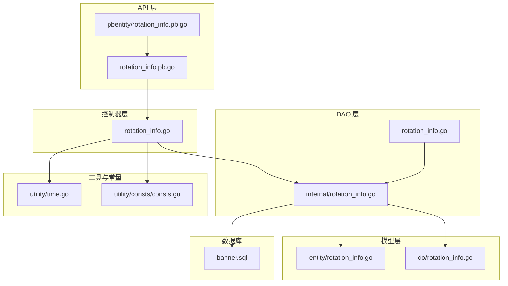
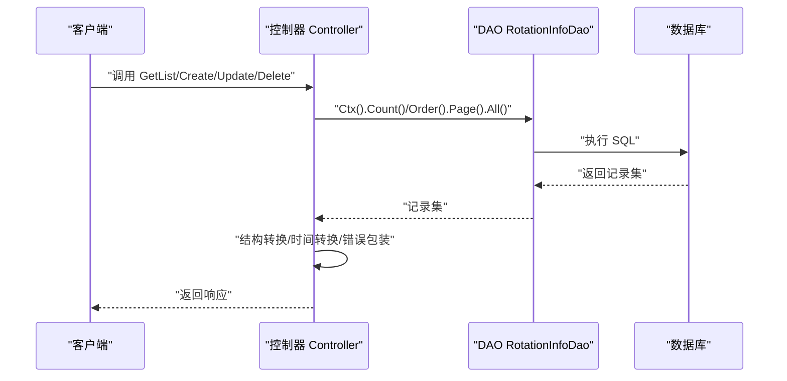
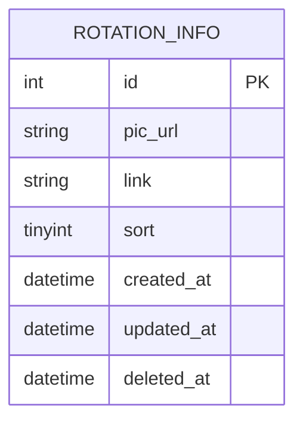
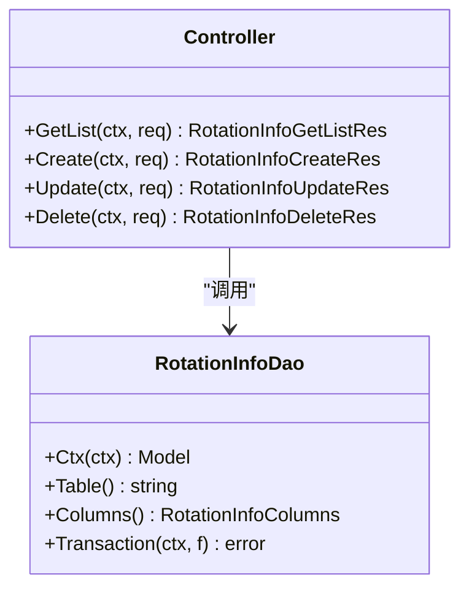
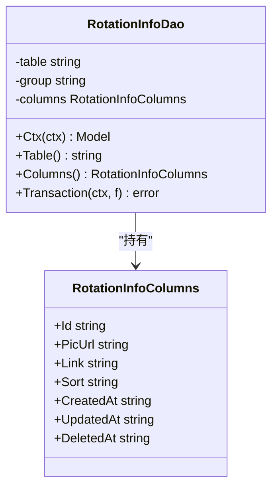
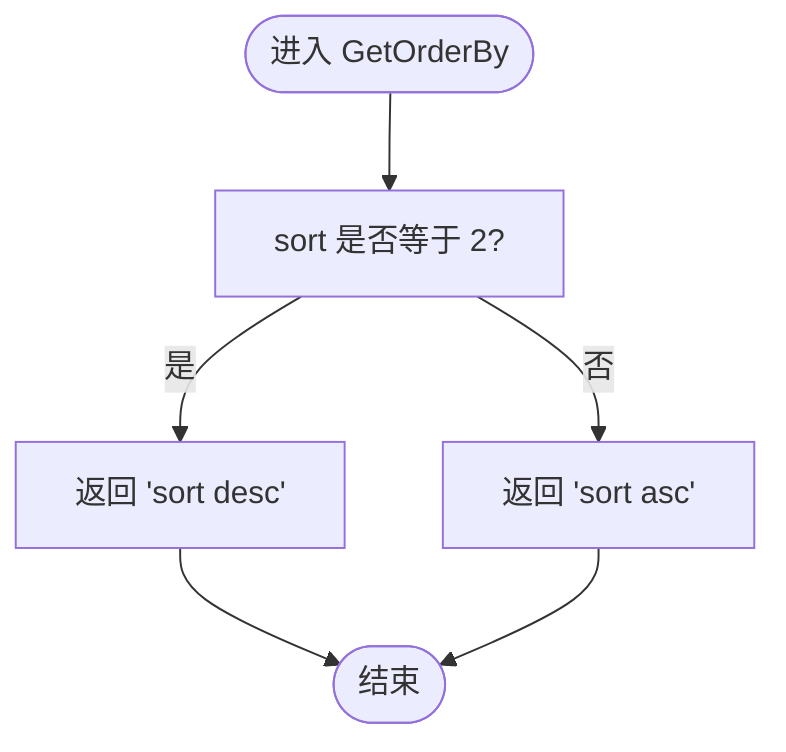
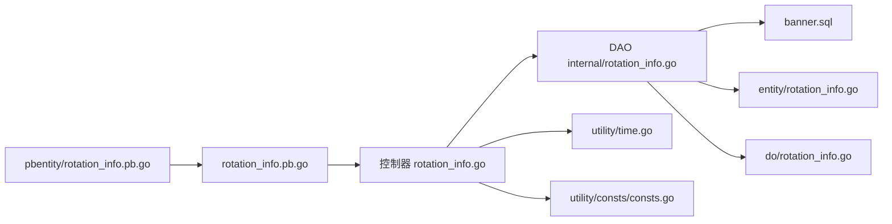

# 轮播图旋转管理

<cite>
**本文引用的文件**
- [app/banner/internal/controller/rotation_info/rotation_info.go](file://app/banner/internal/controller/rotation_info/rotation_info.go)
- [app/banner/internal/dao/rotation_info.go](file://app/banner/internal/dao/rotation_info.go)
- [app/banner/internal/dao/internal/rotation_info.go](file://app/banner/internal/dao/internal/rotation_info.go)
- [app/banner/internal/model/entity/rotation_info.go](file://app/banner/internal/model/entity/rotation_info.go)
- [app/banner/internal/model/do/rotation_info.go](file://app/banner/internal/model/do/rotation_info.go)
- [app/banner/api/rotation_info/v1/rotation_info.pb.go](file://app/banner/api/rotation_info/v1/rotation_info.pb.go)
- [app/banner/api/pbentity/rotation_info.pb.go](file://app/banner/api/pbentity/rotation_info.pb.go)
- [app/banner/hack/banner.sql](file://app/banner/hack/banner.sql)
- [utility/consts/consts.go](file://utility/consts/consts.go)
- [utility/time.go](file://utility/time.go)
- [app/gateway-h5/api/banner/v1/rotation_info.go](file://app/gateway-h5/api/banner/v1/rotation_info.go)
- [app/gateway-admin/api/banner/v1/rotation_info.go](file://app/gateway-admin/api/banner/v1/rotation_info.go)
</cite>

## 目录
1. [简介](#简介)
2. [项目结构](#项目结构)
3. [核心组件](#核心组件)
4. [架构总览](#架构总览)
5. [详细组件分析](#详细组件分析)
6. [依赖关系分析](#依赖关系分析)
7. [性能考虑](#性能考虑)
8. [故障排查指南](#故障排查指南)
9. [结论](#结论)
10. [附录](#附录)

## 简介
本文件面向“轮播图旋转管理”功能，系统化阐述其数据模型、业务逻辑、API 接口与实现细节。该功能围绕轮播图的图片资源、跳转链接、展示顺序等属性进行统一管理，并通过 gRPC 服务对外提供创建、查询、更新、删除能力；同时为前端网关提供分页查询与展示所需的数据结构。

## 项目结构
轮播图模块位于 app/banner 子域，采用典型的分层架构：
- API 层：定义 gRPC 服务与消息结构（rotation_info.pb.go、pbentity/rotation_info.pb.go）
- 控制器层：实现 gRPC 服务端逻辑（rotation_info.go）
- DAO 层：封装数据库访问（internal/rotation_info.go），并暴露全局单例（rotation_info.go）
- 模型层：实体与 DAO 数据对象（entity/rotation_info.go、do/rotation_info.go）
- 常量与工具：错误常量、排序规则、时间转换等（utility/consts/consts.go、utility/time.go）
- 数据库脚本：表结构与初始数据（banner.sql）

**图表来源**
- [app/banner/api/rotation_info/v1/rotation_info.pb.go](file://app/banner/api/rotation_info/v1/rotation_info.pb.go#L527-L531)
- [app/banner/internal/controller/rotation_info/rotation_info.go](file://app/banner/internal/controller/rotation_info/rotation_info.go#L23-L25)
- [app/banner/internal/dao/internal/rotation_info.go](file://app/banner/internal/dao/internal/rotation_info.go#L44-L52)
- [app/banner/internal/dao/rotation_info.go](file://app/banner/internal/dao/rotation_info.go#L17-L20)
- [app/banner/internal/model/entity/rotation_info.go](file://app/banner/internal/model/entity/rotation_info.go#L11-L20)
- [app/banner/internal/model/do/rotation_info.go](file://app/banner/internal/model/do/rotation_info.go#L12-L22)
- [utility/time.go](file://utility/time.go#L32-L38)
- [utility/consts/consts.go](file://utility/consts/consts.go#L34-L42)
- [app/banner/hack/banner.sql](file://app/banner/hack/banner.sql#L6-L16)

**章节来源**
- [app/banner/api/rotation_info/v1/rotation_info.pb.go](file://app/banner/api/rotation_info/v1/rotation_info.pb.go#L527-L531)
- [app/banner/internal/controller/rotation_info/rotation_info.go](file://app/banner/internal/controller/rotation_info/rotation_info.go#L19-L25)
- [app/banner/internal/dao/internal/rotation_info.go](file://app/banner/internal/dao/internal/rotation_info.go#L14-L52)
- [app/banner/internal/dao/rotation_info.go](file://app/banner/internal/dao/rotation_info.go#L13-L20)
- [app/banner/internal/model/entity/rotation_info.go](file://app/banner/internal/model/entity/rotation_info.go#L11-L20)
- [app/banner/internal/model/do/rotation_info.go](file://app/banner/internal/model/do/rotation_info.go#L12-L22)
- [utility/time.go](file://utility/time.go#L32-L38)
- [utility/consts/consts.go](file://utility/consts/consts.go#L34-L42)
- [app/banner/hack/banner.sql](file://app/banner/hack/banner.sql#L6-L16)

## 核心组件
- gRPC 服务与消息
  - 服务名：rotation_info
  - 方法：GetList、Create、Update、Delete
  - 请求/响应消息：RotationInfoGetListReq/Res、RotationInfoCreateReq/Res、RotationInfoUpdateReq/Res、RotationInfoDeleteReq/Res
- 控制器
  - 实现服务端接口，负责参数校验、调用 DAO、错误包装与响应构造
- DAO
  - 提供 Ctx、Table、Columns、Transaction 等通用能力
  - 通过全局单例 RotationInfo 暴露 CRUD 能力
- 实体与 DO
  - 实体用于业务层结构（entity/rotation_info.go）
  - DO 用于 DAO 查询条件与 Where/Data（do/rotation_info.go）
- 工具与常量
  - 排序规则：GetOrderBy，支持正序/倒序
  - 时间转换：SafeConvertTime，将 gtime.Time 转换为 Timestamp
  - 错误常量：统一错误信息模板

**章节来源**
- [app/banner/api/rotation_info/v1/rotation_info.pb.go](file://app/banner/api/rotation_info/v1/rotation_info.pb.go#L27-L34)
- [app/banner/api/rotation_info/v1/rotation_info.pb.go](file://app/banner/api/rotation_info/v1/rotation_info.pb.go#L131-L139)
- [app/banner/api/rotation_info/v1/rotation_info.pb.go](file://app/banner/api/rotation_info/v1/rotation_info.pb.go#L243-L248)
- [app/banner/api/rotation_info/v1/rotation_info.pb.go](file://app/banner/api/rotation_info/v1/rotation_info.pb.go#L323-L330)
- [app/banner/internal/controller/rotation_info/rotation_info.go](file://app/banner/internal/controller/rotation_info/rotation_info.go#L27-L79)
- [app/banner/internal/controller/rotation_info/rotation_info.go](file://app/banner/internal/controller/rotation_info/rotation_info.go#L81-L93)
- [app/banner/internal/controller/rotation_info/rotation_info.go](file://app/banner/internal/controller/rotation_info/rotation_info.go#L95-L107)
- [app/banner/internal/controller/rotation_info/rotation_info.go](file://app/banner/internal/controller/rotation_info/rotation_info.go#L109-L121)
- [app/banner/internal/dao/internal/rotation_info.go](file://app/banner/internal/dao/internal/rotation_info.go#L14-L92)
- [app/banner/internal/dao/rotation_info.go](file://app/banner/internal/dao/rotation_info.go#L13-L20)
- [app/banner/internal/model/entity/rotation_info.go](file://app/banner/internal/model/entity/rotation_info.go#L11-L20)
- [app/banner/internal/model/do/rotation_info.go](file://app/banner/internal/model/do/rotation_info.go#L12-L22)
- [utility/time.go](file://utility/time.go#L32-L38)
- [utility/time.go](file://utility/time.go#L15-L20)
- [utility/consts/consts.go](file://utility/consts/consts.go#L34-L42)

## 架构总览
轮播图管理采用“gRPC 服务 + DAO + 数据模型”的分层设计，控制器负责请求处理与错误包装，DAO 封装数据库操作，实体/DO 提供结构化数据。排序与时间转换由工具函数统一处理。

**图表来源**
- [app/banner/internal/controller/rotation_info/rotation_info.go](file://app/banner/internal/controller/rotation_info/rotation_info.go#L27-L79)
- [app/banner/internal/dao/internal/rotation_info.go](file://app/banner/internal/dao/internal/rotation_info.go#L74-L81)
- [app/banner/api/rotation_info/v1/rotation_info.pb.go](file://app/banner/api/rotation_info/v1/rotation_info.pb.go#L527-L531)

## 详细组件分析

### 数据模型与表结构
- 表名：rotation_info
- 字段
  - id：自增主键
  - pic_url：轮播图片 URL（varchar）
  - link：跳转链接（varchar）
  - sort：排序字段（tinyint）
  - created_at/updated_at/deleted_at：时间戳
- 初始数据示例：包含一条记录（id=1，pic_url='111'，link='11'，sort=10）

**图表来源**
- [app/banner/hack/banner.sql](file://app/banner/hack/banner.sql#L6-L16)

**章节来源**
- [app/banner/hack/banner.sql](file://app/banner/hack/banner.sql#L6-L16)
- [app/banner/internal/model/entity/rotation_info.go](file://app/banner/internal/model/entity/rotation_info.go#L11-L20)
- [app/banner/internal/model/do/rotation_info.go](file://app/banner/internal/model/do/rotation_info.go#L12-L22)

### 控制器与服务端实现
- GetList：分页查询，支持排序（正序/倒序），返回列表、页码、大小、总数
- Create：插入新记录并返回 id
- Update：按 id 更新记录
- Delete：按 id 删除记录
- 错误处理：统一使用 InfoError 模板与 gerror 包装数据库错误码

**图表来源**
- [app/banner/internal/controller/rotation_info/rotation_info.go](file://app/banner/internal/controller/rotation_info/rotation_info.go#L27-L121)
- [app/banner/internal/dao/internal/rotation_info.go](file://app/banner/internal/dao/internal/rotation_info.go#L14-L92)

**章节来源**
- [app/banner/internal/controller/rotation_info/rotation_info.go](file://app/banner/internal/controller/rotation_info/rotation_info.go#L27-L121)
- [utility/consts/consts.go](file://utility/consts/consts.go#L34-L42)

### DAO 与模型映射
- DAO 层提供 Columns 定义与 Ctx(Model) 封装，支持事务与上下文传递
- 实体与 DO 分离：实体用于业务层结构，DO 用于 Where/Data 条件构造
- 全局单例 RotationInfo 便于跨模块调用

**图表来源**
- [app/banner/internal/dao/internal/rotation_info.go](file://app/banner/internal/dao/internal/rotation_info.go#L22-L42)
- [app/banner/internal/dao/internal/rotation_info.go](file://app/banner/internal/dao/internal/rotation_info.go#L74-L92)

**章节来源**
- [app/banner/internal/dao/internal/rotation_info.go](file://app/banner/internal/dao/internal/rotation_info.go#L22-L92)
- [app/banner/internal/dao/rotation_info.go](file://app/banner/internal/dao/rotation_info.go#L13-L20)
- [app/banner/internal/model/entity/rotation_info.go](file://app/banner/internal/model/entity/rotation_info.go#L11-L20)
- [app/banner/internal/model/do/rotation_info.go](file://app/banner/internal/model/do/rotation_info.go#L12-L22)

### 排序与时间转换
- 排序规则：GetOrderBy
  - sort=2：按 sort 降序（数值越大越靠前）
  - 其他：按 sort 升序（数值越小越靠前）
- 时间转换：SafeConvertTime
  - 将 gtime.Time 转换为 Timestamp，空值或零值返回 nil

**图表来源**
- [utility/time.go](file://utility/time.go#L32-L38)

**章节来源**
- [utility/time.go](file://utility/time.go#L32-L38)
- [utility/time.go](file://utility/time.go#L15-L20)

### API 接口文档

- 服务：rotation_info
- 方法：
  - GetList：分页查询轮播图列表
  - Create：创建轮播图
  - Update：更新轮播图
  - Delete：删除轮播图

- 请求/响应消息
  - GetList
    - 请求：RotationInfoGetListReq（sort、page、size）
    - 响应：RotationInfoGetListRes（包含 RotationInfoListResponse）
  - Create
    - 请求：RotationInfoCreateReq（PicUrl、Link、Sort）
    - 响应：RotationInfoCreateRes（id）
  - Update
    - 请求：RotationInfoUpdateReq（Id、PicUrl、Link、Sort）
    - 响应：RotationInfoUpdateRes（id）
  - Delete
    - 请求：RotationInfoDeleteReq（id）
    - 响应：RotationInfoDeleteRes（空）

- 参数说明
  - sort：排序方式，1=正序，2=倒序
  - page：页码，最小 1
  - size：每页数量，最大 100
  - PicUrl：轮播图片 URL
  - Link：点击跳转链接
  - Sort：排序权重（数值越小越靠前/越小越靠后取决于 sort 参数）
  - Id：轮播图标识

- 示例路径
  - GetList：参见 [app/banner/api/rotation_info/v1/rotation_info.pb.go](file://app/banner/api/rotation_info/v1/rotation_info.pb.go#L323-L330)
  - Create：参见 [app/banner/api/rotation_info/v1/rotation_info.pb.go](file://app/banner/api/rotation_info/v1/rotation_info.pb.go#L27-L34)
  - Update：参见 [app/banner/api/rotation_info/v1/rotation_info.pb.go](file://app/banner/api/rotation_info/v1/rotation_info.pb.go#L131-L139)
  - Delete：参见 [app/banner/api/rotation_info/v1/rotation_info.pb.go](file://app/banner/api/rotation_info/v1/rotation_info.pb.go#L243-L248)

- 网关层接口（H5/Admin）
  - H5 网关：参见 [app/gateway-h5/api/banner/v1/rotation_info.go](file://app/gateway-h5/api/banner/v1/rotation_info.go#L8-L30)
  - 后台网关：参见 [app/gateway-admin/api/banner/v1/rotation_info.go](file://app/gateway-admin/api/banner/v1/rotation_info.go#L8-L35)

**章节来源**
- [app/banner/api/rotation_info/v1/rotation_info.pb.go](file://app/banner/api/rotation_info/v1/rotation_info.pb.go#L27-L34)
- [app/banner/api/rotation_info/v1/rotation_info.pb.go](file://app/banner/api/rotation_info/v1/rotation_info.pb.go#L131-L139)
- [app/banner/api/rotation_info/v1/rotation_info.pb.go](file://app/banner/api/rotation_info/v1/rotation_info.pb.go#L243-L248)
- [app/banner/api/rotation_info/v1/rotation_info.pb.go](file://app/banner/api/rotation_info/v1/rotation_info.pb.go#L323-L330)
- [app/gateway-h5/api/banner/v1/rotation_info.go](file://app/gateway-h5/api/banner/v1/rotation_info.go#L8-L30)
- [app/gateway-admin/api/banner/v1/rotation_info.go](file://app/gateway-admin/api/banner/v1/rotation_info.go#L8-L35)

## 依赖关系分析
- 控制器依赖 DAO 与工具函数
- DAO 依赖数据库连接与列定义
- 实体/DO 作为数据载体在控制器与 DAO 之间传递
- gRPC 消息与 pbentity 消息相互引用

**图表来源**
- [app/banner/internal/controller/rotation_info/rotation_info.go](file://app/banner/internal/controller/rotation_info/rotation_info.go#L1-L17)
- [app/banner/internal/dao/internal/rotation_info.go](file://app/banner/internal/dao/internal/rotation_info.go#L1-L12)
- [utility/time.go](file://utility/time.go#L1-L9)
- [utility/consts/consts.go](file://utility/consts/consts.go#L1-L2)
- [app/banner/hack/banner.sql](file://app/banner/hack/banner.sql#L6-L16)
- [app/banner/internal/model/entity/rotation_info.go](file://app/banner/internal/model/entity/rotation_info.go#L11-L20)
- [app/banner/internal/model/do/rotation_info.go](file://app/banner/internal/model/do/rotation_info.go#L12-L22)
- [app/banner/api/rotation_info/v1/rotation_info.pb.go](file://app/banner/api/rotation_info/v1/rotation_info.pb.go#L527-L531)
- [app/banner/api/pbentity/rotation_info.pb.go](file://app/banner/api/pbentity/rotation_info.pb.go#L124-L134)

**章节来源**
- [app/banner/internal/controller/rotation_info/rotation_info.go](file://app/banner/internal/controller/rotation_info/rotation_info.go#L1-L17)
- [app/banner/internal/dao/internal/rotation_info.go](file://app/banner/internal/dao/internal/rotation_info.go#L1-L12)
- [utility/time.go](file://utility/time.go#L1-L9)
- [utility/consts/consts.go](file://utility/consts/consts.go#L1-L2)
- [app/banner/hack/banner.sql](file://app/banner/hack/banner.sql#L6-L16)
- [app/banner/internal/model/entity/rotation_info.go](file://app/banner/internal/model/entity/rotation_info.go#L11-L20)
- [app/banner/internal/model/do/rotation_info.go](file://app/banner/internal/model/do/rotation_info.go#L12-L22)
- [app/banner/api/rotation_info/v1/rotation_info.pb.go](file://app/banner/api/rotation_info/v1/rotation_info.pb.go#L527-L531)
- [app/banner/api/pbentity/rotation_info.pb.go](file://app/banner/api/pbentity/rotation_info.pb.go#L124-L134)

## 性能考虑
- 分页查询：通过 Page 限制单次返回量，避免一次性加载过多数据
- 排序索引：建议在 sort 字段建立索引以提升排序性能
- 时间字段：统一转换为 Timestamp，减少序列化开销
- 错误包装：使用统一错误码与日志记录，便于定位慢查询与异常

## 故障排查指南
- 常见错误
  - 查询失败：GetListFail
  - 创建失败：CreateFail
  - 更新失败：UpdateFail
  - 删除失败：DeleteFail
- 处理建议
  - 检查数据库连接与表是否存在
  - 校验请求参数（sort、page、size、PicUrl、Link、Sort、Id）
  - 查看日志中的错误堆栈与 gerror 包装的错误码

**章节来源**
- [utility/consts/consts.go](file://utility/consts/consts.go#L3-L42)
- [app/banner/internal/controller/rotation_info/rotation_info.go](file://app/banner/internal/controller/rotation_info/rotation_info.go#L27-L121)

## 结论
轮播图旋转管理模块通过清晰的分层设计与标准的 gRPC 接口，实现了对轮播图的高效管理。实体/DO 的分离、DAO 的通用封装以及工具函数的统一处理，使得扩展与维护更加便捷。结合数据库索引与合理的分页策略，可在高并发场景下保持稳定性能。

## 附录
- 常用操作
  - 创建轮播图：调用 Create，传入 PicUrl、Link、Sort
  - 更新轮播图：调用 Update，传入 Id、PicUrl、Link、Sort
  - 删除轮播图：调用 Delete，传入 id
  - 查询轮播图：调用 GetList，传入 sort、page、size