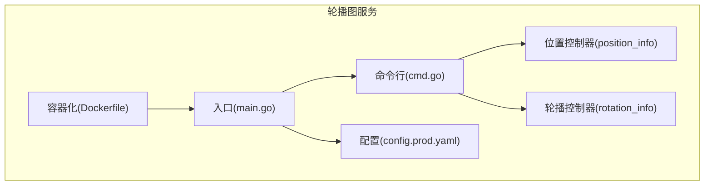
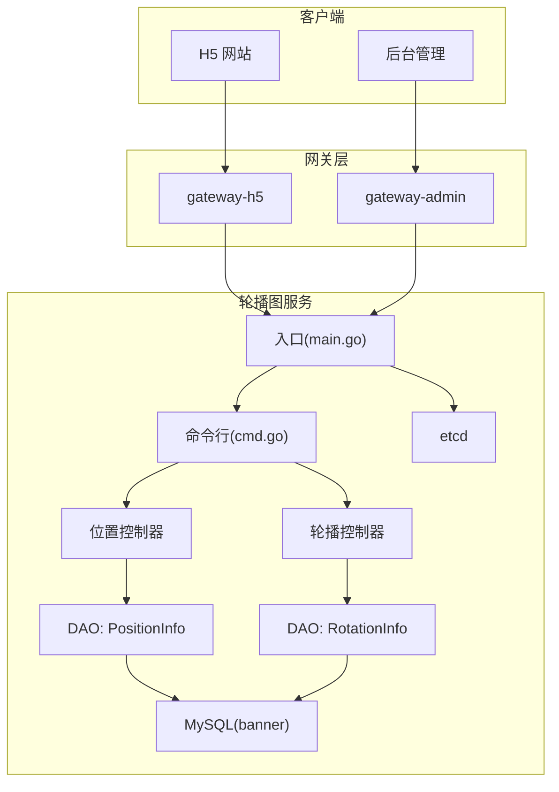
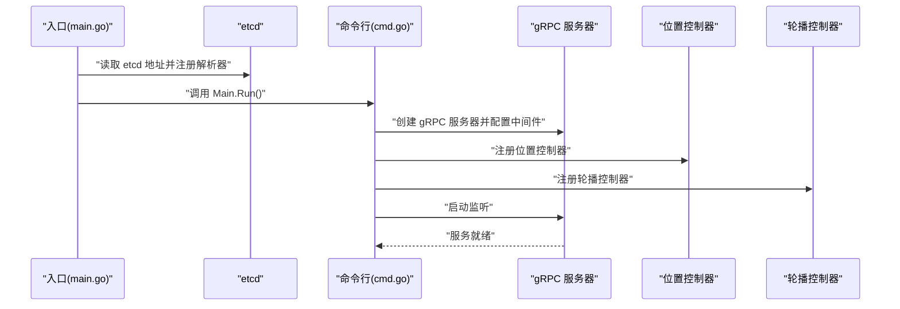
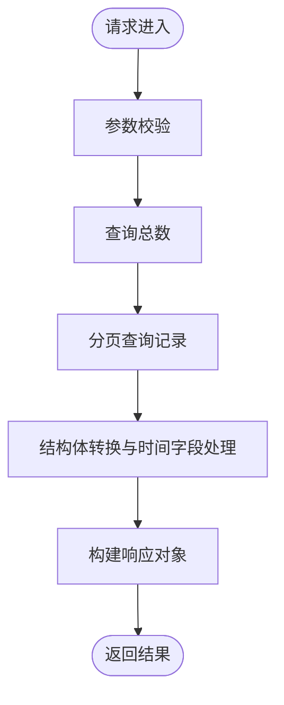
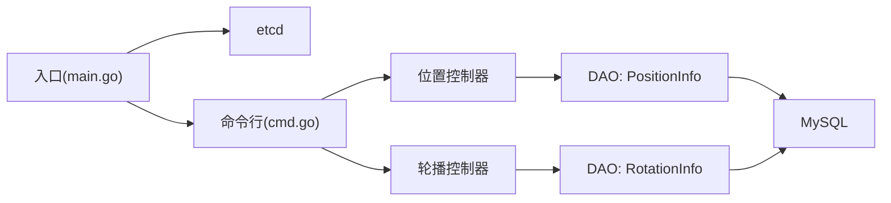

# 轮播图服务概览

<cite>
**本文档引用的文件**
- [app/banner/main.go](file://app/banner/main.go)
- [app/banner/internal/cmd/cmd.go](file://app/banner/internal/cmd/cmd.go)
- [app/banner/internal/controller/position_info/position_info.go](file://app/banner/internal/controller/position_info/position_info.go)
- [app/banner/internal/controller/rotation_info/rotation_info.go](file://app/banner/internal/controller/rotation_info/rotation_info.go)
- [app/banner/manifest/config/config.prod.yaml](file://app/banner/manifest/config/config.prod.yaml)
- [app/banner/Dockerfile](file://app/banner/Dockerfile)
- [app/banner/README.MD](file://app/banner/README.MD)
</cite>

## 目录
1. [简介](#简介)
2. [项目结构](#项目结构)
3. [核心组件](#核心组件)
4. [架构总览](#架构总览)
5. [详细组件分析](#详细组件分析)
6. [依赖关系分析](#依赖关系分析)
7. [性能考虑](#性能考虑)
8. [故障排除指南](#故障排除指南)
9. [结论](#结论)
10. [附录](#附录)

## 简介
轮播图服务是电商系统中的基础设施服务之一，负责首页轮播图位（位置）与轮播内容（旋转图）的统一管理与分发。该服务采用微服务架构，基于 GoFrame 框架与 gRPC 协议，结合 etcd 进行服务注册与发现，通过 MySQL 存储轮播相关数据，为前端 H5 网站与后台管理系统提供稳定、可扩展的轮播图能力。

在电商系统中的业务价值主要体现在：
- 首页展示：集中管理首页轮播位与轮播内容，提升用户首屏体验。
- 活动推广：支持活动专题页轮播，配合营销活动进行流量引导。
- 商品营销：通过轮播内容关联商品或优惠券，促进转化。

技术栈选择与架构设计原则：
- 技术栈：GoFrame 框架、gRPC、MySQL、etcd、Kubernetes。
- 设计原则：单一职责、清晰分层、接口稳定、可观测性优先、可演进的配置管理。

## 项目结构
轮播图服务遵循“应用级微服务”组织方式，包含入口、命令行启动、控制器、DAO 层、模型与配置等模块。整体结构如下：

图表来源
- [app/banner/main.go](file://app/banner/main.go#L1-L25)
- [app/banner/internal/cmd/cmd.go](file://app/banner/internal/cmd/cmd.go#L1-L32)
- [app/banner/internal/controller/position_info/position_info.go](file://app/banner/internal/controller/position_info/position_info.go#L1-L123)
- [app/banner/internal/controller/rotation_info/rotation_info.go](file://app/banner/internal/controller/rotation_info/rotation_info.go#L1-L122)
- [app/banner/manifest/config/config.prod.yaml](file://app/banner/manifest/config/config.prod.yaml#L1-L22)
- [app/banner/Dockerfile](file://app/banner/Dockerfile#L1-L39)

章节来源
- [app/banner/main.go](file://app/banner/main.go#L1-L25)
- [app/banner/internal/cmd/cmd.go](file://app/banner/internal/cmd/cmd.go#L1-L32)
- [app/banner/manifest/config/config.prod.yaml](file://app/banner/manifest/config/config.prod.yaml#L1-L22)
- [app/banner/Dockerfile](file://app/banner/Dockerfile#L1-L39)

## 核心组件
- 服务入口与注册发现
  - 通过入口读取 etcd 地址并注册 gRPC 解析器，确保服务发现可用。
  - 启动命令行入口，初始化 gRPC 服务器并注册业务控制器。
- 控制器层
  - 位置控制器：提供轮播位的增删改查与分页查询能力。
  - 轮播控制器：提供轮播内容的增删改查与分页查询能力。
- 数据访问层与模型
  - DAO 层封装数据库操作，控制器通过 DAO 与数据库交互。
  - 实体模型与 Protobuf 实体映射，保证前后端数据一致。
- 配置管理
  - 生产配置包含 gRPC 服务名、监听地址、日志路径与级别、数据库连接串、etcd 地址等。
- 容器化与部署
  - Docker 多阶段构建，最小化运行时镜像，支持 K8s 编排。

章节来源
- [app/banner/main.go](file://app/banner/main.go#L13-L24)
- [app/banner/internal/cmd/cmd.go](file://app/banner/internal/cmd/cmd.go#L17-L30)
- [app/banner/internal/controller/position_info/position_info.go](file://app/banner/internal/controller/position_info/position_info.go#L19-L25)
- [app/banner/internal/controller/rotation_info/rotation_info.go](file://app/banner/internal/controller/rotation_info/rotation_info.go#L19-L25)
- [app/banner/manifest/config/config.prod.yaml](file://app/banner/manifest/config/config.prod.yaml#L1-L22)

## 架构总览
轮播图服务采用“入口 -> 命令行 -> 控制器 -> DAO -> 数据库”的分层架构，结合 gRPC 提供稳定的远程调用能力，并通过 etcd 实现服务注册与发现。

图表来源
- [app/banner/main.go](file://app/banner/main.go#L15-L21)
- [app/banner/internal/cmd/cmd.go](file://app/banner/internal/cmd/cmd.go#L18-L27)
- [app/banner/internal/controller/position_info/position_info.go](file://app/banner/internal/controller/position_info/position_info.go#L23-L25)
- [app/banner/internal/controller/rotation_info/rotation_info.go](file://app/banner/internal/controller/rotation_info/rotation_info.go#L23-L25)
- [app/banner/manifest/config/config.prod.yaml](file://app/banner/manifest/config/config.prod.yaml#L20-L21)

## 详细组件分析

### 服务启动流程
服务启动流程由入口负责解析 etcd 地址并注册 gRPC 解析器，随后通过命令行入口初始化 gRPC 服务器，注册控制器并启动监听。

图表来源
- [app/banner/main.go](file://app/banner/main.go#L15-L24)
- [app/banner/internal/cmd/cmd.go](file://app/banner/internal/cmd/cmd.go#L17-L30)

章节来源
- [app/banner/main.go](file://app/banner/main.go#L13-L24)
- [app/banner/internal/cmd/cmd.go](file://app/banner/internal/cmd/cmd.go#L17-L30)

### 位置控制器（PositionInfo）
位置控制器提供轮播位的 CRUD 与分页查询能力，内部通过 DAO 层访问数据库，并对时间字段进行安全转换以适配 Protobuf 实体。

图表来源
- [app/banner/internal/controller/position_info/position_info.go](file://app/banner/internal/controller/position_info/position_info.go#L27-L79)

章节来源
- [app/banner/internal/controller/position_info/position_info.go](file://app/banner/internal/controller/position_info/position_info.go#L27-L123)

### 轮播控制器（RotationInfo）
轮播控制器提供轮播内容的 CRUD 与分页查询能力，逻辑与位置控制器类似，均通过 DAO 层访问数据库并进行实体转换。

图表来源
- [app/banner/internal/controller/rotation_info/rotation_info.go](file://app/banner/internal/controller/rotation_info/rotation_info.go#L27-L79)

章节来源
- [app/banner/internal/controller/rotation_info/rotation_info.go](file://app/banner/internal/controller/rotation_info/rotation_info.go#L27-L122)

### 数据模型与实体映射
- 控制器通过 DAO 层访问数据库表，返回的结果集经结构体转换后映射到 Protobuf 实体，确保前后端数据格式一致。
- 时间字段采用安全转换函数，避免 gconv 无法自动转换的问题。

章节来源
- [app/banner/internal/controller/position_info/position_info.go](file://app/banner/internal/controller/position_info/position_info.go#L60-L78)
- [app/banner/internal/controller/rotation_info/rotation_info.go](file://app/banner/internal/controller/rotation_info/rotation_info.go#L58-L77)

## 依赖关系分析
- 组件耦合
  - 控制器仅依赖 DAO 层，DAO 层依赖数据库连接，形成清晰的单向依赖。
  - 入口与命令行之间存在直接依赖，命令行负责 gRPC 服务器的初始化与控制器注册。
- 外部依赖
  - etcd：用于服务注册与发现。
  - MySQL：持久化存储轮播位与轮播内容。
  - gRPC：跨进程通信协议。
- 配置依赖
  - 生产配置集中管理 gRPC、数据库与 etcd 的连接参数，便于统一运维。

图表来源
- [app/banner/main.go](file://app/banner/main.go#L15-L21)
- [app/banner/internal/cmd/cmd.go](file://app/banner/internal/cmd/cmd.go#L18-L27)
- [app/banner/internal/controller/position_info/position_info.go](file://app/banner/internal/controller/position_info/position_info.go#L23-L25)
- [app/banner/internal/controller/rotation_info/rotation_info.go](file://app/banner/internal/controller/rotation_info/rotation_info.go#L23-L25)

章节来源
- [app/banner/main.go](file://app/banner/main.go#L15-L21)
- [app/banner/internal/cmd/cmd.go](file://app/banner/internal/cmd/cmd.go#L18-L27)

## 性能考虑
- 分页查询：控制器默认提供分页查询能力，建议前端按需加载，避免一次性传输大量数据。
- 时间字段处理：对时间字段进行显式转换，减少序列化开销并避免格式不一致。
- 日志配置：生产环境启用日志轮转与限制备份数量，降低磁盘占用与 IO 压力。
- 连接池与超时：建议在 DAO 层配置合理的连接池大小与请求超时，避免阻塞与资源耗尽。

## 故障排除指南
- 服务启动失败
  - 检查 etcd 地址是否正确且可达。
  - 确认 gRPC 监听端口未被占用。
- 数据库连接异常
  - 核对数据库连接串与凭据，确认 MySQL 服务正常。
- 控制器无响应
  - 查看日志输出，定位 DAO 查询错误或结构体转换异常。
- 配置未生效
  - 确认配置文件路径与键名正确，检查环境变量覆盖情况。

章节来源
- [app/banner/main.go](file://app/banner/main.go#L15-L21)
- [app/banner/manifest/config/config.prod.yaml](file://app/banner/manifest/config/config.prod.yaml#L1-L22)

## 结论
轮播图服务通过清晰的分层架构与稳定的 gRPC 接口，为电商系统的首页展示、活动推广与商品营销提供了可靠支撑。结合 etcd 与 MySQL 的组合，实现了高可用与易维护的服务形态。建议在后续迭代中进一步完善监控告警、限流熔断与灰度发布机制，持续提升服务稳定性与可观察性。

## 附录
- 快速开始
  - 参考服务根目录下的快速开始链接，了解本地开发与调试流程。
- 部署参考
  - 使用 Dockerfile 构建镜像，结合 Kustomize 或 Helm 在 Kubernetes 中部署。

章节来源
- [app/banner/README.MD](file://app/banner/README.MD#L1-L4)
- [app/banner/Dockerfile](file://app/banner/Dockerfile#L21-L39)