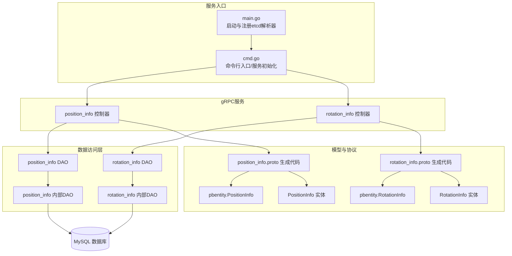
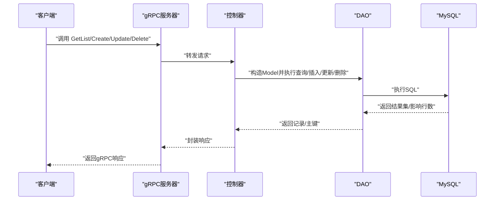
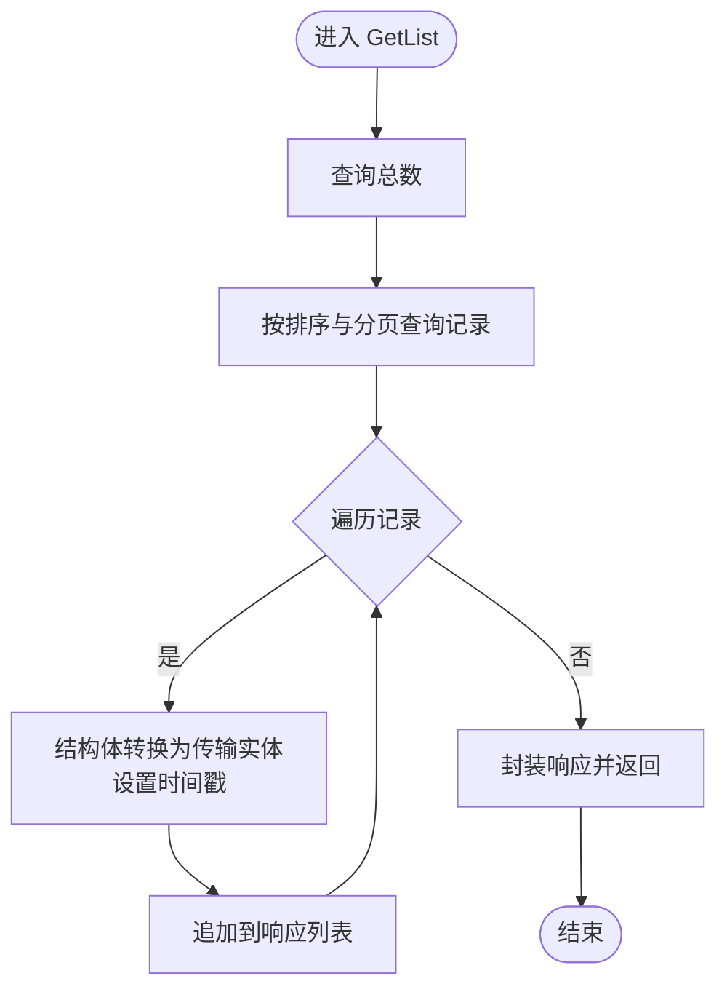
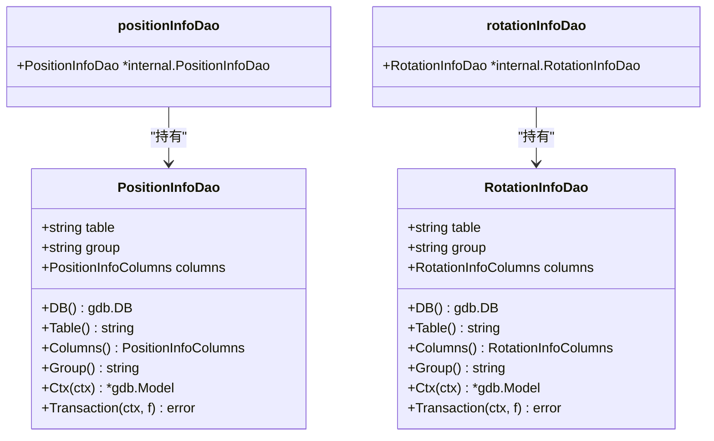
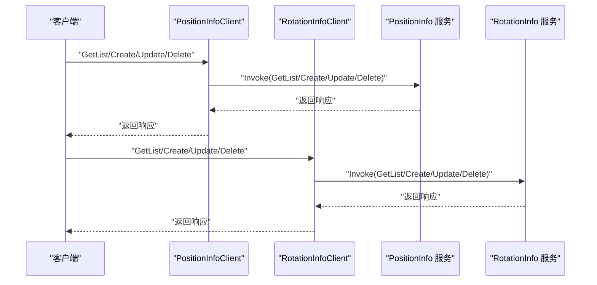
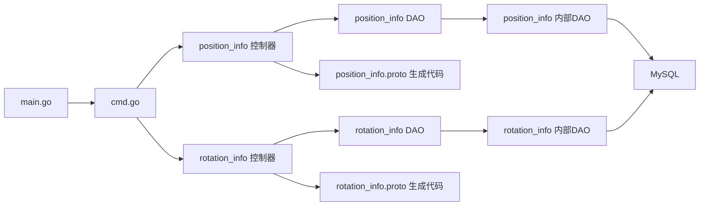

# 轮播图服务模块

<cite>
**本文档引用的文件**
- [app/banner/main.go](file://app/banner/main.go)
- [app/banner/internal/cmd/cmd.go](file://app/banner/internal/cmd/cmd.go)
- [app/banner/internal/controller/position_info/position_info.go](file://app/banner/internal/controller/position_info/position_info.go)
- [app/banner/internal/controller/rotation_info/rotation_info.go](file://app/banner/internal/controller/rotation_info/rotation_info.go)
- [app/banner/internal/dao/position_info.go](file://app/banner/internal/dao/position_info.go)
- [app/banner/internal/dao/rotation_info.go](file://app/banner/internal/dao/rotation_info.go)
- [app/banner/internal/dao/internal/position_info.go](file://app/banner/internal/dao/internal/position_info.go)
- [app/banner/internal/dao/internal/rotation_info.go](file://app/banner/internal/dao/internal/rotation_info.go)
- [app/banner/internal/model/entity/position_info.go](file://app/banner/internal/model/entity/position_info.go)
- [app/banner/internal/model/entity/rotation_info.go](file://app/banner/internal/model/entity/rotation_info.go)
- [app/banner/api/position_info/v1/position_info_grpc.pb.go](file://app/banner/api/position_info/v1/position_info_grpc.pb.go)
- [app/banner/api/rotation_info/v1/rotation_info_grpc.pb.go](file://app/banner/api/rotation_info/v1/rotation_info_grpc.pb.go)
- [app/banner/api/pbentity/position_info.pb.go](file://app/banner/api/pbentity/position_info.pb.go)
- [app/banner/api/pbentity/rotation_info.pb.go](file://app/banner/api/pbentity/rotation_info.pb.go)
- [app/banner/hack/banner.sql](file://app/banner/hack/banner.sql)
</cite>

## 目录
1. [简介](#简介)
2. [项目结构](#项目结构)
3. [核心组件](#核心组件)
4. [架构总览](#架构总览)
5. [详细组件分析](#详细组件分析)
6. [依赖关系分析](#依赖关系分析)
7. [性能考虑](#性能考虑)
8. [故障排查指南](#故障排查指南)
9. [结论](#结论)
10. [附录](#附录)

## 简介
本文件为轮播图服务模块的详细技术文档，覆盖轮播图管理、位置配置、旋转图管理等核心功能。文档从系统架构、组件关系、数据流、处理逻辑、集成点、错误处理与性能特性等方面进行深入解析，并提供API接口定义、配置参数说明与使用示例路径，帮助开发者快速理解与使用该模块。

## 项目结构
轮播图服务采用微服务架构，基于gRPC提供服务，内部遵循GoFrame框架的分层设计：命令入口、控制器、DAO、实体模型与API协议定义。服务通过etcd注册中心进行服务发现与路由。

**图表来源**
- [app/banner/main.go](file://app/banner/main.go#L13-L24)
- [app/banner/internal/cmd/cmd.go](file://app/banner/internal/cmd/cmd.go#L17-L30)
- [app/banner/internal/controller/position_info/position_info.go](file://app/banner/internal/controller/position_info/position_info.go#L23-L25)
- [app/banner/internal/controller/rotation_info/rotation_info.go](file://app/banner/internal/controller/rotation_info/rotation_info.go#L23-L25)
- [app/banner/internal/dao/position_info.go](file://app/banner/internal/dao/position_info.go#L17-L20)
- [app/banner/internal/dao/rotation_info.go](file://app/banner/internal/dao/rotation_info.go#L17-L20)
- [app/banner/internal/dao/internal/position_info.go](file://app/banner/internal/dao/internal/position_info.go#L48-L56)
- [app/banner/internal/dao/internal/rotation_info.go](file://app/banner/internal/dao/internal/rotation_info.go#L44-L52)
- [app/banner/api/position_info/v1/position_info_grpc.pb.go](file://app/banner/api/position_info/v1/position_info_grpc.pb.go#L22-L27)
- [app/banner/api/rotation_info/v1/rotation_info_grpc.pb.go](file://app/banner/api/rotation_info/v1/rotation_info_grpc.pb.go#L22-L27)
- [app/banner/api/pbentity/position_info.pb.go](file://app/banner/api/pbentity/position_info.pb.go#L30-L43)
- [app/banner/api/pbentity/rotation_info.pb.go](file://app/banner/api/pbentity/rotation_info.pb.go#L30-L41)

**章节来源**
- [app/banner/main.go](file://app/banner/main.go#L13-L24)
- [app/banner/internal/cmd/cmd.go](file://app/banner/internal/cmd/cmd.go#L17-L30)

## 核心组件
- 服务入口与注册
  - 启动时读取etcd地址并注册解析器，随后初始化gRPC服务器并注册两个服务。
- 控制器层
  - position_info 控制器：提供列表查询、创建、更新、删除接口。
  - rotation_info 控制器：提供列表查询、创建、更新、删除接口。
- DAO层
  - 外层DAO对象持有内部DAO实例，提供全局访问点。
  - 内部DAO封装表名、列名、事务与上下文模型操作。
- 模型与实体
  - PositionInfo/RotationInfo 定义数据库表结构与ORM映射。
  - pbentity中的PositionInfo/RotationInfo用于gRPC传输层序列化。
- 协议与客户端
  - position_info/rotation_info.proto 生成gRPC服务端与客户端桩代码。
  - pbentity.proto 定义传输层消息结构。

**章节来源**
- [app/banner/internal/controller/position_info/position_info.go](file://app/banner/internal/controller/position_info/position_info.go#L19-L25)
- [app/banner/internal/controller/rotation_info/rotation_info.go](file://app/banner/internal/controller/rotation_info/rotation_info.go#L19-L25)
- [app/banner/internal/dao/position_info.go](file://app/banner/internal/dao/position_info.go#L13-L20)
- [app/banner/internal/dao/rotation_info.go](file://app/banner/internal/dao/rotation_info.go#L13-L20)
- [app/banner/internal/dao/internal/position_info.go](file://app/banner/internal/dao/internal/position_info.go#L14-L20)
- [app/banner/internal/dao/internal/rotation_info.go](file://app/banner/internal/dao/internal/rotation_info.go#L14-L20)
- [app/banner/internal/model/entity/position_info.go](file://app/banner/internal/model/entity/position_info.go#L11-L22)
- [app/banner/internal/model/entity/rotation_info.go](file://app/banner/internal/model/entity/rotation_info.go#L11-L20)
- [app/banner/api/position_info/v1/position_info_grpc.pb.go](file://app/banner/api/position_info/v1/position_info_grpc.pb.go#L29-L37)
- [app/banner/api/rotation_info/v1/rotation_info_grpc.pb.go](file://app/banner/api/rotation_info/v1/rotation_info_grpc.pb.go#L29-L37)
- [app/banner/api/pbentity/position_info.pb.go](file://app/banner/api/pbentity/position_info.pb.go#L30-L43)
- [app/banner/api/pbentity/rotation_info.pb.go](file://app/banner/api/pbentity/rotation_info.pb.go#L30-L41)

## 架构总览
轮播图服务采用分层架构，控制器负责请求处理与错误包装，DAO负责数据库访问，实体模型承载数据结构，协议层负责跨进程通信。

**图表来源**
- [app/banner/internal/controller/position_info/position_info.go](file://app/banner/internal/controller/position_info/position_info.go#L27-L79)
- [app/banner/internal/controller/rotation_info/rotation_info.go](file://app/banner/internal/controller/rotation_info/rotation_info.go#L27-L79)
- [app/banner/internal/dao/internal/position_info.go](file://app/banner/internal/dao/internal/position_info.go#L78-L85)
- [app/banner/internal/dao/internal/rotation_info.go](file://app/banner/internal/dao/internal/rotation_info.go#L74-L81)

## 详细组件分析

### 位置信息管理（position_info）
- 功能概述
  - 支持位置信息的分页列表查询、创建、更新、删除。
  - 列表支持排序参数与分页参数，统一返回结构包含总数、页码、大小与列表。
- 数据模型
  - 字段包括标识、图片链接、商品名称、跳转链接、排序、商品ID及时间戳。
- 控制器流程
  - 查询总数后按排序与分页获取记录，逐条转换为传输层实体并设置时间戳。
  - 创建/更新/删除分别调用DAO执行插入、更新、删除，并进行错误包装。
- 错误处理
  - 所有数据库操作失败均记录日志并返回统一的数据库操作错误码。

**图表来源**
- [app/banner/internal/controller/position_info/position_info.go](file://app/banner/internal/controller/position_info/position_info.go#L27-L79)

**章节来源**
- [app/banner/internal/controller/position_info/position_info.go](file://app/banner/internal/controller/position_info/position_info.go#L27-L122)
- [app/banner/internal/model/entity/position_info.go](file://app/banner/internal/model/entity/position_info.go#L11-L22)
- [app/banner/api/pbentity/position_info.pb.go](file://app/banner/api/pbentity/position_info.pb.go#L30-L43)

### 旋转图管理（rotation_info）
- 功能概述
  - 提供轮播图的分页列表查询、创建、更新、删除。
  - 列表支持排序参数与分页参数，统一返回结构包含总数、页码、大小与列表。
- 数据模型
  - 字段包括标识、图片链接、跳转链接、排序字段及时间戳。
- 控制器流程
  - 查询总数后按排序与分页获取记录，逐条转换为传输层实体并设置时间戳。
  - 创建/更新/删除分别调用DAO执行插入、更新、删除，并进行错误包装。
- 错误处理
  - 所有数据库操作失败均记录日志并返回统一的数据库操作错误码。

**图表来源**
- [app/banner/internal/controller/rotation_info/rotation_info.go](file://app/banner/internal/controller/rotation_info/rotation_info.go#L27-L79)

**章节来源**
- [app/banner/internal/controller/rotation_info/rotation_info.go](file://app/banner/internal/controller/rotation_info/rotation_info.go#L27-L122)
- [app/banner/internal/model/entity/rotation_info.go](file://app/banner/internal/model/entity/rotation_info.go#L11-L20)
- [app/banner/api/pbentity/rotation_info.pb.go](file://app/banner/api/pbentity/rotation_info.pb.go#L30-L41)

### 数据访问层（DAO）
- 外层DAO
  - positionInfoDao/rotationInfoDao 持有内部DAO实例，提供全局单例访问。
- 内部DAO
  - 封装表名、列名、上下文模型、事务封装与数据库组配置。
  - 提供Ctx方法自动注入上下文，Transaction方法封装事务逻辑。

**图表来源**
- [app/banner/internal/dao/internal/position_info.go](file://app/banner/internal/dao/internal/position_info.go#L14-L20)
- [app/banner/internal/dao/internal/rotation_info.go](file://app/banner/internal/dao/internal/rotation_info.go#L14-L20)
- [app/banner/internal/dao/position_info.go](file://app/banner/internal/dao/position_info.go#L13-L20)
- [app/banner/internal/dao/rotation_info.go](file://app/banner/internal/dao/rotation_info.go#L13-L20)

**章节来源**
- [app/banner/internal/dao/position_info.go](file://app/banner/internal/dao/position_info.go#L13-L23)
- [app/banner/internal/dao/rotation_info.go](file://app/banner/internal/dao/rotation_info.go#L13-L23)
- [app/banner/internal/dao/internal/position_info.go](file://app/banner/internal/dao/internal/position_info.go#L48-L96)
- [app/banner/internal/dao/internal/rotation_info.go](file://app/banner/internal/dao/internal/rotation_info.go#L44-L92)

### 协议与API定义
- gRPC服务
  - position_info.v1：提供 GetList、Create、Update、Delete 四个方法。
  - rotation_info.v1：提供 GetList、Create、Update、Delete 四个方法。
- 客户端调用
  - 通过生成的客户端接口调用对应服务方法，传入请求结构并接收响应结构。
- 传输实体
  - pbentity.PositionInfo 与 pbentity.RotationInfo 作为gRPC消息载体，包含时间戳字段。

**图表来源**
- [app/banner/api/position_info/v1/position_info_grpc.pb.go](file://app/banner/api/position_info/v1/position_info_grpc.pb.go#L22-L27)
- [app/banner/api/rotation_info/v1/rotation_info_grpc.pb.go](file://app/banner/api/rotation_info/v1/rotation_info_grpc.pb.go#L22-L27)
- [app/banner/api/position_info/v1/position_info_grpc.pb.go](file://app/banner/api/position_info/v1/position_info_grpc.pb.go#L47-L85)
- [app/banner/api/rotation_info/v1/rotation_info_grpc.pb.go](file://app/banner/api/rotation_info/v1/rotation_info_grpc.pb.go#L47-L85)

**章节来源**
- [app/banner/api/position_info/v1/position_info_grpc.pb.go](file://app/banner/api/position_info/v1/position_info_grpc.pb.go#L29-L136)
- [app/banner/api/rotation_info/v1/rotation_info_grpc.pb.go](file://app/banner/api/rotation_info/v1/rotation_info_grpc.pb.go#L29-L136)
- [app/banner/api/pbentity/position_info.pb.go](file://app/banner/api/pbentity/position_info.pb.go#L30-L43)
- [app/banner/api/pbentity/rotation_info.pb.go](file://app/banner/api/pbentity/rotation_info.pb.go#L30-L41)

## 依赖关系分析
- 组件耦合
  - 控制器依赖DAO；DAO依赖内部DAO与数据库驱动；实体模型与协议层相互独立但通过gconv与protobuf绑定。
- 外部依赖
  - etcd服务发现、MySQL驱动、gRPC运行时、GoFrame ORM与工具库。
- 集成点
  - 服务启动时注册etcd解析器，gRPC服务器注册两个服务，统一走校验中间件链。

**图表来源**
- [app/banner/main.go](file://app/banner/main.go#L13-L24)
- [app/banner/internal/cmd/cmd.go](file://app/banner/internal/cmd/cmd.go#L17-L30)
- [app/banner/internal/controller/position_info/position_info.go](file://app/banner/internal/controller/position_info/position_info.go#L23-L25)
- [app/banner/internal/controller/rotation_info/rotation_info.go](file://app/banner/internal/controller/rotation_info/rotation_info.go#L23-L25)
- [app/banner/internal/dao/position_info.go](file://app/banner/internal/dao/position_info.go#L17-L20)
- [app/banner/internal/dao/rotation_info.go](file://app/banner/internal/dao/rotation_info.go#L17-L20)
- [app/banner/internal/dao/internal/position_info.go](file://app/banner/internal/dao/internal/position_info.go#L48-L56)
- [app/banner/internal/dao/internal/rotation_info.go](file://app/banner/internal/dao/internal/rotation_info.go#L44-L52)

**章节来源**
- [app/banner/main.go](file://app/banner/main.go#L13-L24)
- [app/banner/internal/cmd/cmd.go](file://app/banner/internal/cmd/cmd.go#L17-L30)

## 性能考虑
- 分页与排序
  - 列表查询支持分页与排序，建议在高并发场景下为排序字段建立索引以提升查询性能。
- 时间字段处理
  - 控制器层对时间字段进行安全转换，避免ORM转换异常导致的性能损耗。
- 事务与批量操作
  - DAO层提供Transaction封装，建议在批量写入或一致性要求高的场景使用事务。
- gRPC与序列化
  - 使用pbentity作为传输层消息，减少序列化开销；保持请求/响应结构简洁。

[本节为通用性能建议，无需特定文件引用]

## 故障排查指南
- 常见错误类型
  - 数据库操作错误：当DAO执行Count/All/Insert/Update/Delete失败时，控制器会记录错误日志并返回统一错误码。
- 排查步骤
  - 检查etcd连接与服务注册状态。
  - 查看gRPC服务端日志，定位具体失败方法与参数。
  - 核对数据库连接配置与表结构，确认字段类型与默认值。
  - 验证请求参数合法性（如排序、分页、主键存在性）。
- 相关实现参考
  - 错误包装与日志记录在控制器中统一处理，便于集中排查。

**章节来源**
- [app/banner/internal/controller/position_info/position_info.go](file://app/banner/internal/controller/position_info/position_info.go#L40-L44)
- [app/banner/internal/controller/position_info/position_info.go](file://app/banner/internal/controller/position_info/position_info.go#L53-L57)
- [app/banner/internal/controller/position_info/position_info.go](file://app/banner/internal/controller/position_info/position_info.go#L87-L91)
- [app/banner/internal/controller/position_info/position_info.go](file://app/banner/internal/controller/position_info/position_info.go#L101-L105)
- [app/banner/internal/controller/rotation_info/rotation_info.go](file://app/banner/internal/controller/rotation_info/rotation_info.go#L42-L44)
- [app/banner/internal/controller/rotation_info/rotation_info.go](file://app/banner/internal/controller/rotation_info/rotation_info.go#L52-L56)
- [app/banner/internal/controller/rotation_info/rotation_info.go](file://app/banner/internal/controller/rotation_info/rotation_info.go#L87-L91)
- [app/banner/internal/controller/rotation_info/rotation_info.go](file://app/banner/internal/controller/rotation_info/rotation_info.go#L101-L105)

## 结论
轮播图服务模块通过清晰的分层设计与gRPC协议实现了位置信息与旋转图的完整管理能力。控制器层负责业务编排与错误处理，DAO层提供稳定的数据库访问，实体与协议层确保跨进程数据一致与高效传输。结合分页、排序与事务封装，模块具备良好的扩展性与可维护性。

[本节为总结性内容，无需特定文件引用]

## 附录

### 数据库表结构
- 轮播图表（rotation_info）
  - 字段：id、pic_url、link、sort、created_at、updated_at、deleted_at
- 位置信息表（position_info）
  - 字段：id、pic_url、goods_name、link、sort、goods_id、created_at、updated_at、deleted_at

**章节来源**
- [app/banner/hack/banner.sql](file://app/banner/hack/banner.sql#L4-L16)
- [app/banner/hack/banner.sql](file://app/banner/hack/banner.sql#L24-L38)

### API接口定义与使用示例
- 位置信息服务（position_info.v1）
  - 方法：GetList、Create、Update、Delete
  - 请求/响应结构：参见生成的客户端与服务端桩代码
- 旋转图服务（rotation_info.v1）
  - 方法：GetList、Create、Update、Delete
  - 请求/响应结构：参见生成的客户端与服务端桩代码
- 使用示例路径
  - 客户端调用示例可参考生成的客户端方法调用链
  - 服务端注册与运行示例可参考命令入口与服务初始化

**章节来源**
- [app/banner/api/position_info/v1/position_info_grpc.pb.go](file://app/banner/api/position_info/v1/position_info_grpc.pb.go#L29-L136)
- [app/banner/api/rotation_info/v1/rotation_info_grpc.pb.go](file://app/banner/api/rotation_info/v1/rotation_info_grpc.pb.go#L29-L136)
- [app/banner/internal/cmd/cmd.go](file://app/banner/internal/cmd/cmd.go#L17-L30)