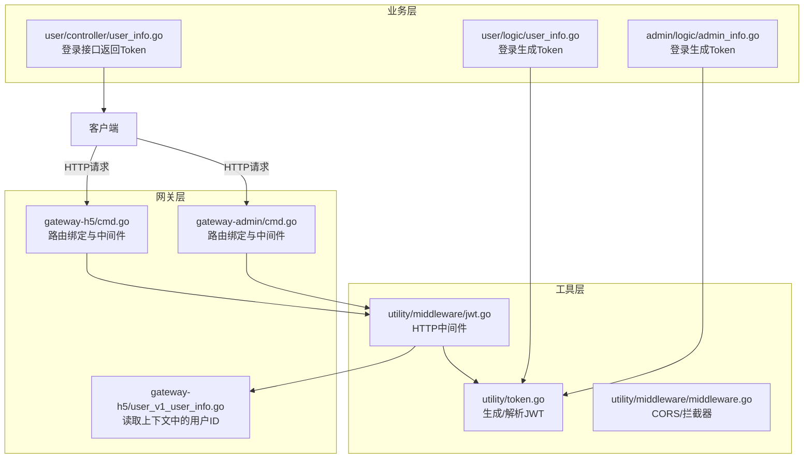
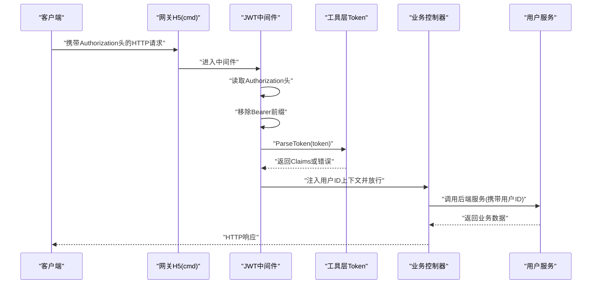
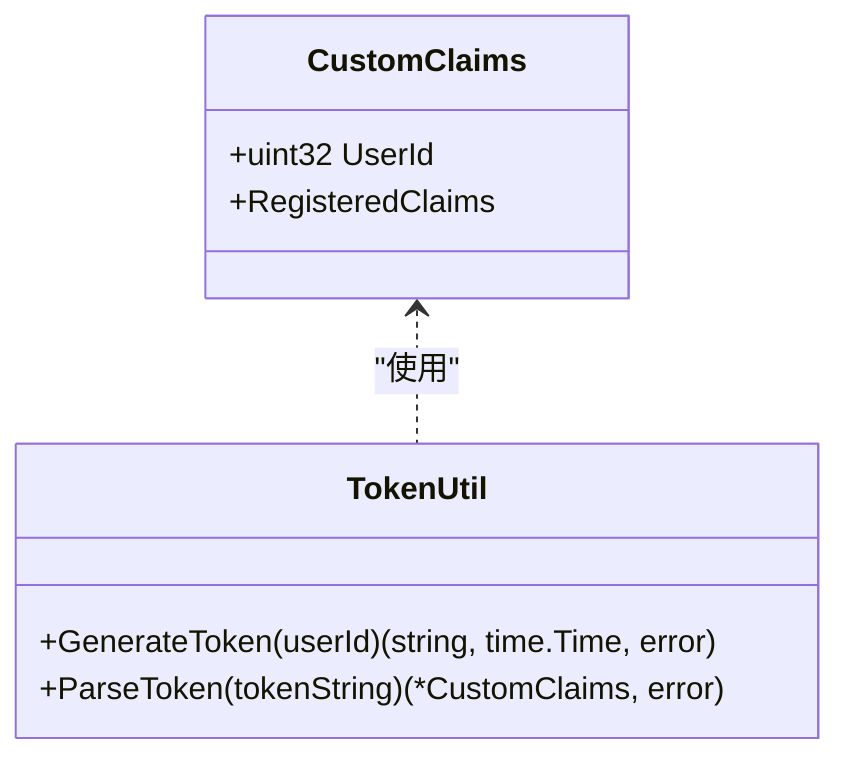
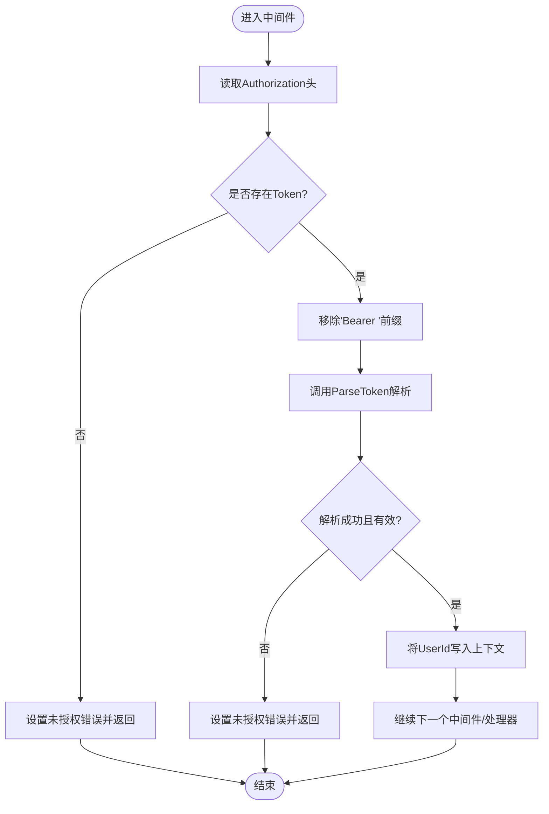
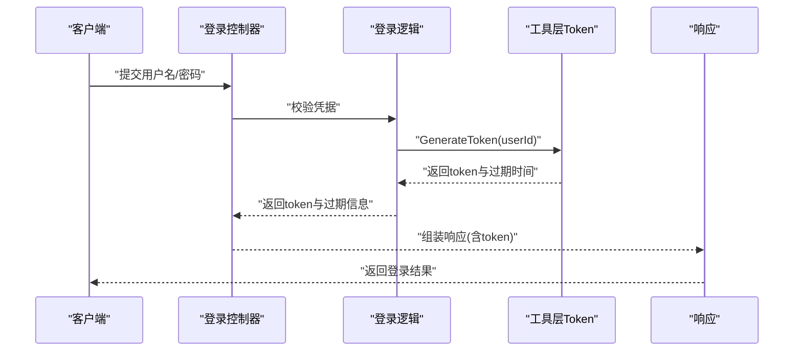
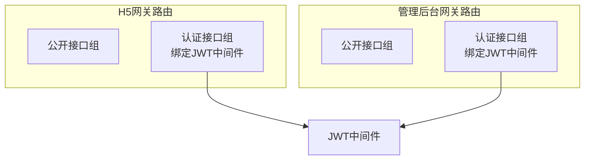
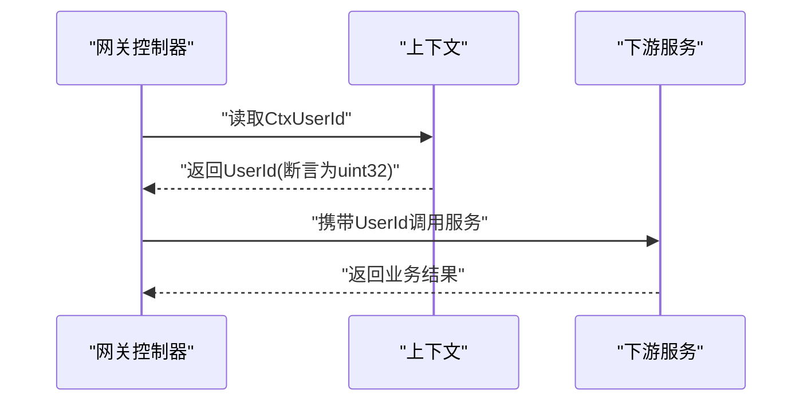
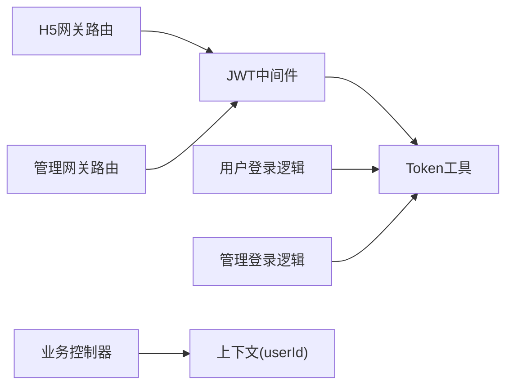

# JWT认证机制

<cite>
**本文档引用的文件**
- [utility/middleware/jwt.go](file://utility/middleware/jwt.go)
- [utility/token.go](file://utility/token.go)
- [app/gateway-h5/internal/cmd/cmd.go](file://app/gateway-h5/internal/cmd/cmd.go)
- [app/gateway-admin/internal/cmd/cmd.go](file://app/gateway-admin/internal/cmd/cmd.go)
- [app/gateway-h5/internal/controller/user/user_v1_user_info.go](file://app/gateway-h5/internal/controller/user/user_v1_user_info.go)
- [app/user/internal/controller/user_info/user_info.go](file://app/user/internal/controller/user_info/user_info.go)
- [app/user/internal/logic/user_info/user_info.go](file://app/user/internal/logic/user_info/user_info.go)
- [app/admin/internal/logic/admin_info/admin_info.go](file://app/admin/internal/logic/admin_info/admin_info.go)
- [utility/middleware/middleware.go](file://utility/middleware/middleware.go)
- [doc/双网关设计与实现详解.md](file://doc/双网关设计与实现详解.md)
</cite>

## 目录
1. [简介](#简介)
2. [项目结构](#项目结构)
3. [核心组件](#核心组件)
4. [架构总览](#架构总览)
5. [详细组件分析](#详细组件分析)
6. [依赖关系分析](#依赖关系分析)
7. [性能考量](#性能考量)
8. [故障排查指南](#故障排查指南)
9. [结论](#结论)
10. [附录](#附录)

## 简介
本文件系统化阐述项目中的JWT（JSON Web Token）认证机制，覆盖工作原理、实现细节、使用方式与安全注意事项。重点包括：
- Token生成流程与签名算法
- Claims结构设计与用户ID提取
- Authorization头处理与Bearer前缀移除
- 过期时间管理与刷新策略
- 网关间Token传递与验证流程
- 中间件使用示例与错误处理

## 项目结构
JWT认证相关代码分布于工具层与网关层：
- 工具层：通用JWT生成、解析与声明结构
- 网关层：HTTP中间件拦截Authorization头并注入用户上下文
- 业务层：登录接口生成Token并返回给客户端

**图表来源**
- [utility/token.go](file://utility/token.go#L1-L65)
- [utility/middleware/jwt.go](file://utility/middleware/jwt.go#L1-L39)
- [utility/middleware/middleware.go](file://utility/middleware/middleware.go#L1-L35)
- [app/gateway-h5/internal/cmd/cmd.go](file://app/gateway-h5/internal/cmd/cmd.go#L55-L90)
- [app/gateway-admin/internal/cmd/cmd.go](file://app/gateway-admin/internal/cmd/cmd.go#L25-L40)
- [app/gateway-h5/internal/controller/user/user_v1_user_info.go](file://app/gateway-h5/internal/controller/user/user_v1_user_info.go#L11-L37)
- [app/user/internal/logic/user_info/user_info.go](file://app/user/internal/logic/user_info/user_info.go#L15-L46)
- [app/admin/internal/logic/admin_info/admin_info.go](file://app/admin/internal/logic/admin_info/admin_info.go#L15-L46)
- [app/user/internal/controller/user_info/user_info.go](file://app/user/internal/controller/user_info/user_info.go#L37-L69)

**章节来源**
- [utility/middleware/jwt.go](file://utility/middleware/jwt.go#L1-L39)
- [utility/token.go](file://utility/token.go#L1-L65)
- [app/gateway-h5/internal/cmd/cmd.go](file://app/gateway-h5/internal/cmd/cmd.go#L55-L90)
- [app/gateway-admin/internal/cmd/cmd.go](file://app/gateway-admin/internal/cmd/cmd.go#L25-L40)
- [app/gateway-h5/internal/controller/user/user_v1_user_info.go](file://app/gateway-h5/internal/controller/user/user_v1_user_info.go#L11-L37)
- [app/user/internal/logic/user_info/user_info.go](file://app/user/internal/logic/user_info/user_info.go#L15-L46)
- [app/admin/internal/logic/admin_info/admin_info.go](file://app/admin/internal/logic/admin_info/admin_info.go#L15-L46)
- [app/user/internal/controller/user_info/user_info.go](file://app/user/internal/controller/user_info/user_info.go#L37-L69)
- [utility/middleware/middleware.go](file://utility/middleware/middleware.go#L1-L35)
- [doc/双网关设计与实现详解.md](file://doc/双网关设计与实现详解.md#L120-L214)

## 核心组件
- 自定义Claims结构：包含用户ID与标准声明（签发时间、生效时间、过期时间）
- Token生成函数：使用对称签名算法，设置24小时过期
- Token解析函数：验证签名与有效期，返回Claims
- JWT中间件：从Authorization头读取Token，移除Bearer前缀，解析并注入用户ID上下文
- 登录流程：业务层校验凭据后调用工具层生成Token并返回

**章节来源**
- [utility/token.go](file://utility/token.go#L10-L18)
- [utility/token.go](file://utility/token.go#L31-L50)
- [utility/token.go](file://utility/token.go#L52-L64)
- [utility/middleware/jwt.go](file://utility/middleware/jwt.go#L16-L38)
- [app/user/internal/logic/user_info/user_info.go](file://app/user/internal/logic/user_info/user_info.go#L15-L46)
- [app/admin/internal/logic/admin_info/admin_info.go](file://app/admin/internal/logic/admin_info/admin_info.go#L15-L46)

## 架构总览
下图展示了从客户端到网关再到业务服务的完整认证链路，以及网关间共享同一JWT中间件的结构。

**图表来源**
- [app/gateway-h5/internal/cmd/cmd.go](file://app/gateway-h5/internal/cmd/cmd.go#L55-L90)
- [utility/middleware/jwt.go](file://utility/middleware/jwt.go#L16-L38)
- [utility/token.go](file://utility/token.go#L52-L64)
- [app/gateway-h5/internal/controller/user/user_v1_user_info.go](file://app/gateway-h5/internal/controller/user/user_v1_user_info.go#L11-L37)
- [app/user/internal/controller/user_info/user_info.go](file://app/user/internal/controller/user_info/user_info.go#L112-L134)

## 详细组件分析

### JWT声明与数据模型
- Claims结构包含用户ID字段与标准声明（过期、签发、生效时间）
- 工具层提供生成与解析函数，使用对称密钥进行签名与验证

**图表来源**
- [utility/token.go](file://utility/token.go#L10-L18)
- [utility/token.go](file://utility/token.go#L31-L50)
- [utility/token.go](file://utility/token.go#L52-L64)

**章节来源**
- [utility/token.go](file://utility/token.go#L10-L18)
- [utility/token.go](file://utility/token.go#L31-L50)
- [utility/token.go](file://utility/token.go#L52-L64)

### JWT中间件处理流程
- 从请求头读取Authorization
- 移除Bearer前缀（若存在）
- 调用工具层解析Token
- 将用户ID写入上下文，继续后续处理器

**图表来源**
- [utility/middleware/jwt.go](file://utility/middleware/jwt.go#L16-L38)

**章节来源**
- [utility/middleware/jwt.go](file://utility/middleware/jwt.go#L16-L38)

### 登录与Token生成
- 用户登录与管理后台登录分别在各自逻辑层完成凭据校验
- 成功后调用工具层生成Token，返回给客户端

**图表来源**
- [app/user/internal/logic/user_info/user_info.go](file://app/user/internal/logic/user_info/user_info.go#L15-L46)
- [app/admin/internal/logic/admin_info/admin_info.go](file://app/admin/internal/logic/admin_info/admin_info.go#L15-L46)
- [utility/token.go](file://utility/token.go#L31-L50)

**章节来源**
- [app/user/internal/logic/user_info/user_info.go](file://app/user/internal/logic/user_info/user_info.go#L15-L46)
- [app/admin/internal/logic/admin_info/admin_info.go](file://app/admin/internal/logic/admin_info/admin_info.go#L15-L46)
- [utility/token.go](file://utility/token.go#L31-L50)

### 网关路由与中间件绑定
- H5网关与管理后台网关均在路由组上绑定JWT中间件
- 区分公开接口与需认证接口，提升用户体验与安全性

**图表来源**
- [app/gateway-h5/internal/cmd/cmd.go](file://app/gateway-h5/internal/cmd/cmd.go#L55-L90)
- [app/gateway-admin/internal/cmd/cmd.go](file://app/gateway-admin/internal/cmd/cmd.go#L25-L40)

**章节来源**
- [app/gateway-h5/internal/cmd/cmd.go](file://app/gateway-h5/internal/cmd/cmd.go#L55-L90)
- [app/gateway-admin/internal/cmd/cmd.go](file://app/gateway-admin/internal/cmd/cmd.go#L25-L40)
- [doc/双网关设计与实现详解.md](file://doc/双网关设计与实现详解.md#L120-L214)

### 业务控制器中提取用户ID
- 控制器从上下文中读取用户ID，构造下游gRPC请求参数
- 若类型不匹配则抛出异常，便于快速定位问题

**图表来源**
- [app/gateway-h5/internal/controller/user/user_v1_user_info.go](file://app/gateway-h5/internal/controller/user/user_v1_user_info.go#L11-L37)

**章节来源**
- [app/gateway-h5/internal/controller/user/user_v1_user_info.go](file://app/gateway-h5/internal/controller/user/user_v1_user_info.go#L11-L37)

## 依赖关系分析
- 中间件依赖工具层的Token解析能力
- 登录逻辑依赖工具层的Token生成能力
- 网关路由配置决定中间件生效范围
- 业务控制器依赖上下文中的用户ID

**图表来源**
- [utility/middleware/jwt.go](file://utility/middleware/jwt.go#L1-L39)
- [utility/token.go](file://utility/token.go#L1-L65)
- [app/gateway-h5/internal/cmd/cmd.go](file://app/gateway-h5/internal/cmd/cmd.go#L55-L90)
- [app/gateway-admin/internal/cmd/cmd.go](file://app/gateway-admin/internal/cmd/cmd.go#L25-L40)
- [app/gateway-h5/internal/controller/user/user_v1_user_info.go](file://app/gateway-h5/internal/controller/user/user_v1_user_info.go#L11-L37)

**章节来源**
- [utility/middleware/jwt.go](file://utility/middleware/jwt.go#L1-L39)
- [utility/token.go](file://utility/token.go#L1-L65)
- [app/gateway-h5/internal/cmd/cmd.go](file://app/gateway-h5/internal/cmd/cmd.go#L55-L90)
- [app/gateway-admin/internal/cmd/cmd.go](file://app/gateway-admin/internal/cmd/cmd.go#L25-L40)
- [app/gateway-h5/internal/controller/user/user_v1_user_info.go](file://app/gateway-h5/internal/controller/user/user_v1_user_info.go#L11-L37)

## 性能考量
- Token解析为纯内存计算，开销极低
- 建议在高并发场景下保持对称密钥一致，避免跨实例密钥同步成本
- 对于频繁认证的接口，可结合缓存策略减少重复解析（当前实现未采用）

## 故障排查指南
- 未提供Token：中间件返回未授权错误
- 无效Token：解析失败或Claims为空时返回未授权错误
- Bearer前缀缺失：中间件会尝试移除前缀，若仍失败请确认客户端是否正确添加
- 用户ID类型错误：控制器读取上下文时类型断言失败，需检查中间件注入逻辑
- CORS问题：如遇跨域，请检查CORS中间件配置

**章节来源**
- [utility/middleware/jwt.go](file://utility/middleware/jwt.go#L16-L38)
- [app/gateway-h5/internal/controller/user/user_v1_user_info.go](file://app/gateway-h5/internal/controller/user/user_v1_user_info.go#L17-L22)
- [utility/middleware/middleware.go](file://utility/middleware/middleware.go#L10-L23)

## 结论
本项目采用统一的JWT中间件与工具层实现，确保H5与管理后台网关在认证上的高度一致性。通过明确的Claims结构、严格的Authorization头处理与上下文注入机制，实现了简洁可靠的认证流程。建议在生产环境中进一步完善Token刷新策略与密钥轮换机制，并加强日志与监控以提升可观测性。

## 附录

### Authorization头处理与Bearer前缀
- 中间件从请求头读取Authorization
- 若以“Bearer ”开头则移除该前缀后再解析
- 解析失败或Claims为空则判定为无效Token

**章节来源**
- [utility/middleware/jwt.go](file://utility/middleware/jwt.go#L16-L38)

### Claims结构与用户ID提取
- Claims包含用户ID字段
- 中间件将用户ID写入上下文键值
- 控制器从上下文读取用户ID用于后续调用

**章节来源**
- [utility/token.go](file://utility/token.go#L10-L18)
- [utility/middleware/jwt.go](file://utility/middleware/jwt.go#L34-L36)
- [app/gateway-h5/internal/controller/user/user_v1_user_info.go](file://app/gateway-h5/internal/controller/user/user_v1_user_info.go#L17-L22)

### 过期时间管理与刷新策略
- Token默认24小时过期
- 当前实现未包含自动刷新逻辑，建议在客户端或网关层增加刷新流程以提升用户体验

**章节来源**
- [utility/token.go](file://utility/token.go#L31-L50)

### 网关间Token传递与验证
- 两个网关共享同一JWT中间件
- 登录接口返回的Token类型为Bearer，客户端在后续请求中携带该Token

**章节来源**
- [doc/双网关设计与实现详解.md](file://doc/双网关设计与实现详解.md#L225-L233)
- [app/user/internal/controller/user_info/user_info.go](file://app/user/internal/controller/user_info/user_info.go#L56-L68)
- [app/user/internal/logic/user_info/user_info.go](file://app/user/internal/logic/user_info/user_info.go#L183-L189)