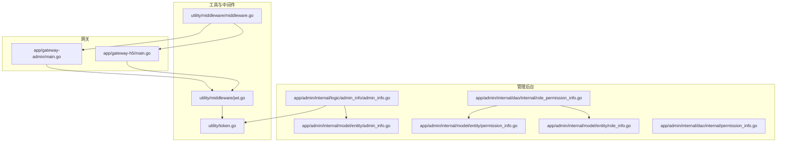
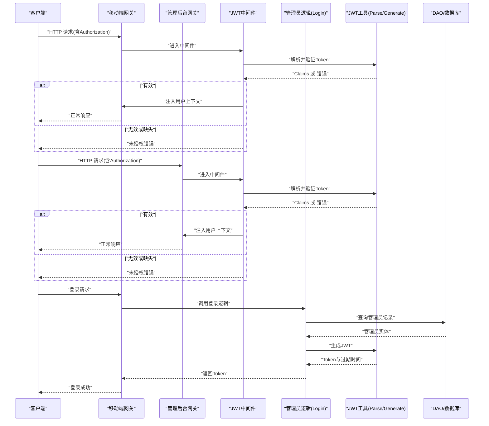
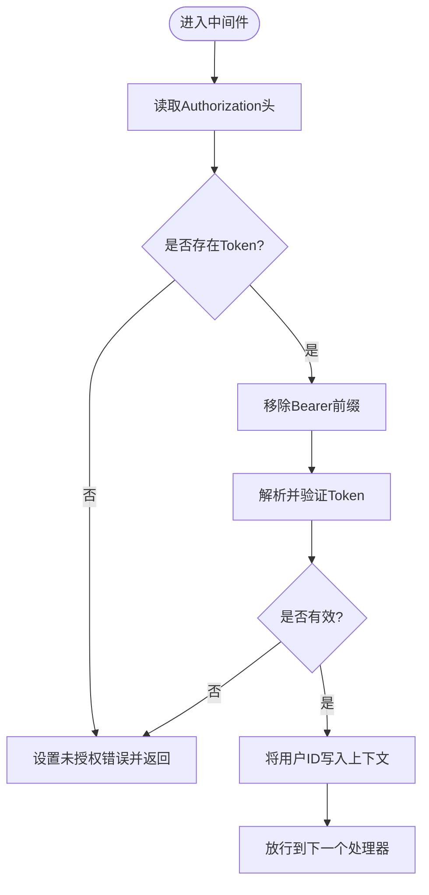
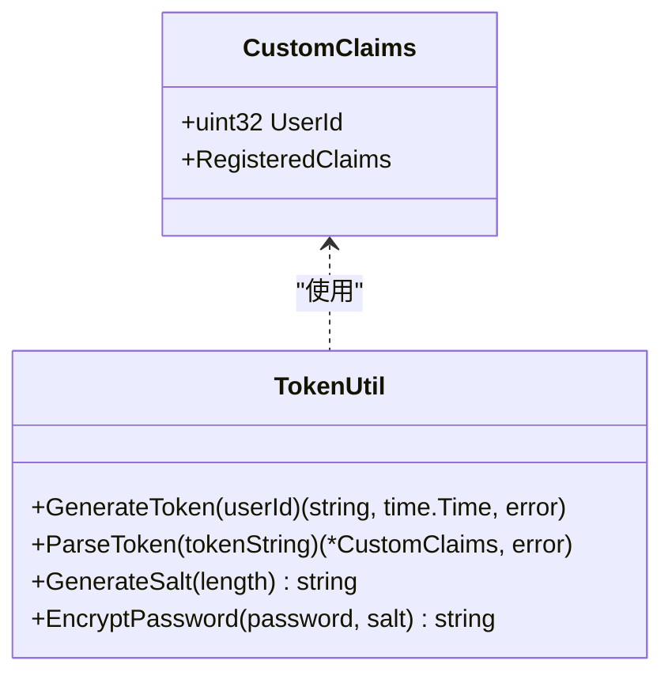
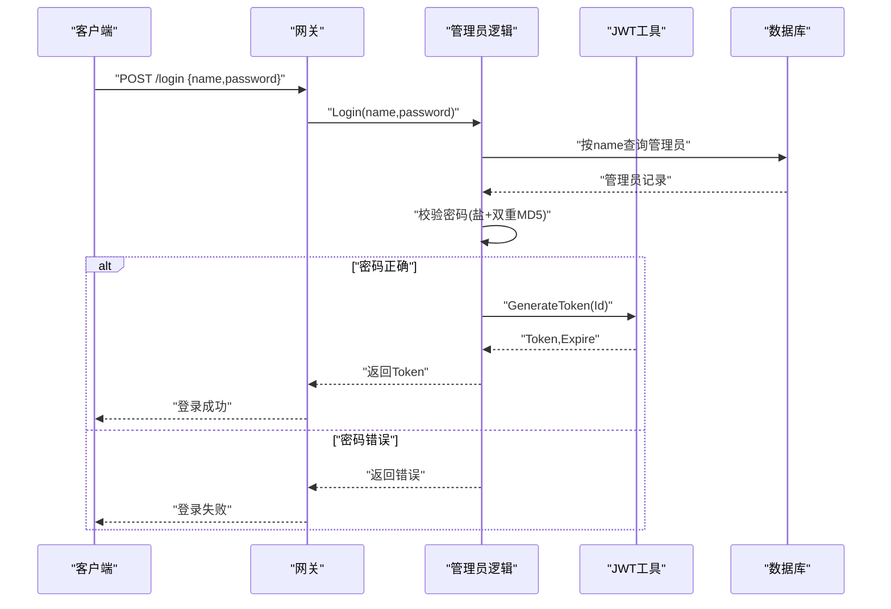
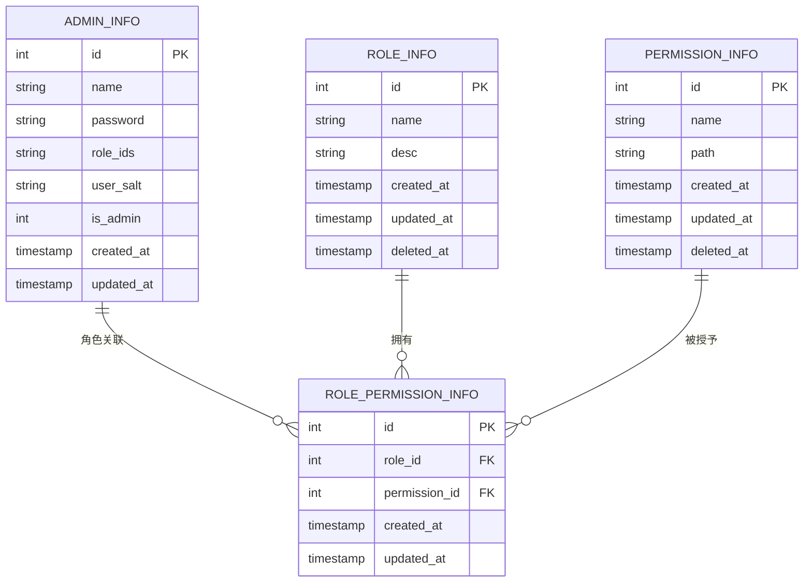
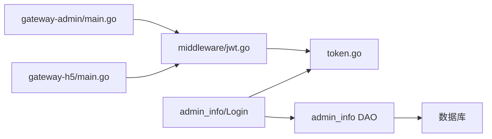

# 安全与认证

<cite>
**本文引用的文件**
- [utility/middleware/jwt.go](file://utility/middleware/jwt.go)
- [utility/token.go](file://utility/token.go)
- [app/admin/internal/logic/admin_info/admin_info.go](file://app/admin/internal/logic/admin_info/admin_info.go)
- [app/admin/internal/model/entity/admin_info.go](file://app/admin/internal/model/entity/admin_info.go)
- [app/admin/internal/model/entity/permission_info.go](file://app/admin/internal/model/entity/permission_info.go)
- [app/admin/internal/model/entity/role_info.go](file://app/admin/internal/model/entity/role_info.go)
- [app/admin/internal/dao/internal/role_permission_info.go](file://app/admin/internal/dao/internal/role_permission_info.go)
- [app/admin/internal/dao/internal/permission_info.go](file://app/admin/internal/dao/internal/permission_info.go)
- [app/gateway-admin/main.go](file://app/gateway-admin/main.go)
- [app/gateway-h5/main.go](file://app/gateway-h5/main.go)
- [doc/双网关设计与实现详解.md](file://doc/双网关设计与实现详解.md)
- [utility/middleware/middleware.go](file://utility/middleware/middleware.go)
</cite>

## 目录
1. [简介](#简介)
2. [项目结构](#项目结构)
3. [核心组件](#核心组件)
4. [架构总览](#架构总览)
5. [详细组件分析](#详细组件分析)
6. [依赖关系分析](#依赖关系分析)
7. [性能考量](#性能考量)
8. [故障排查指南](#故障排查指南)
9. [结论](#结论)
10. [附录](#附录)

## 简介
本文件聚焦于本仓库中的安全与认证体系，系统性阐述以下内容：
- JWT认证机制的实现原理与配置要点
- 权限控制系统设计（角色权限管理、接口访问控制、数据权限限制）
- 用户认证流程、token生成与验证、刷新策略
- 不同网关的认证策略差异与敏感接口保护
- 安全最佳实践、常见攻击防护与安全审计方案

## 项目结构
围绕安全与认证的关键目录与文件：
- 工具与中间件：utility/middleware（JWT中间件、CORS等）、utility/token.go（JWT声明、签发与解析）
- 管理后台认证与权限：app/admin/internal/logic/admin_info（登录/注册）、model/entity（实体模型）、dao/internal（DAO层）
- 网关入口：app/gateway-admin、app/gateway-h5（分别绑定路由与中间件）
- 文档：doc/双网关设计与实现详解.md（路由与认证策略）

图表来源
- [utility/middleware/jwt.go](file://utility/middleware/jwt.go#L16-L38)
- [utility/token.go](file://utility/token.go#L31-L64)
- [app/admin/internal/logic/admin_info/admin_info.go](file://app/admin/internal/logic/admin_info/admin_info.go#L15-L46)
- [app/admin/internal/model/entity/admin_info.go](file://app/admin/internal/model/entity/admin_info.go#L12-L21)
- [app/admin/internal/model/entity/permission_info.go](file://app/admin/internal/model/entity/permission_info.go#L11-L19)
- [app/admin/internal/model/entity/role_info.go](file://app/admin/internal/model/entity/role_info.go#L11-L19)
- [app/admin/internal/dao/internal/role_permission_info.go](file://app/admin/internal/dao/internal/role_permission_info.go#L40-L87)
- [app/admin/internal/dao/internal/permission_info.go](file://app/admin/internal/dao/internal/permission_info.go#L42-L80)
- [app/gateway-admin/main.go](file://app/gateway-admin/main.go#L13-L29)
- [app/gateway-h5/main.go](file://app/gateway-h5/main.go#L13-L37)
- [utility/middleware/middleware.go](file://utility/middleware/middleware.go#L10-L23)

章节来源
- [utility/middleware/jwt.go](file://utility/middleware/jwt.go#L16-L38)
- [utility/token.go](file://utility/token.go#L31-L64)
- [app/admin/internal/logic/admin_info/admin_info.go](file://app/admin/internal/logic/admin_info/admin_info.go#L15-L46)
- [app/admin/internal/model/entity/admin_info.go](file://app/admin/internal/model/entity/admin_info.go#L12-L21)
- [app/admin/internal/model/entity/permission_info.go](file://app/admin/internal/model/entity/permission_info.go#L11-L19)
- [app/admin/internal/model/entity/role_info.go](file://app/admin/internal/model/entity/role_info.go#L11-L19)
- [app/admin/internal/dao/internal/role_permission_info.go](file://app/admin/internal/dao/internal/role_permission_info.go#L40-L87)
- [app/admin/internal/dao/internal/permission_info.go](file://app/admin/internal/dao/internal/permission_info.go#L42-L80)
- [app/gateway-admin/main.go](file://app/gateway-admin/main.go#L13-L29)
- [app/gateway-h5/main.go](file://app/gateway-h5/main.go#L13-L37)
- [doc/双网关设计与实现详解.md](file://doc/双网关设计与实现详解.md#L105-L133)
- [utility/middleware/middleware.go](file://utility/middleware/middleware.go#L10-L23)

## 核心组件
- JWT中间件：从请求头提取并校验Authorization，解析自定义声明，注入用户上下文
- JWT工具：自定义声明结构、签发与解析、默认密钥常量
- 管理员逻辑：登录/注册流程，密码加密与盐值生成，成功后签发token
- 实体与DAO：管理员、角色、权限、角色-权限关联的表结构与DAO封装
- 网关入口：分别在管理后台与移动端网关中启用JWT中间件与CORS

章节来源
- [utility/middleware/jwt.go](file://utility/middleware/jwt.go#L16-L38)
- [utility/token.go](file://utility/token.go#L10-L18)
- [app/admin/internal/logic/admin_info/admin_info.go](file://app/admin/internal/logic/admin_info/admin_info.go#L15-L46)
- [app/admin/internal/model/entity/admin_info.go](file://app/admin/internal/model/entity/admin_info.go#L12-L21)
- [app/admin/internal/model/entity/permission_info.go](file://app/admin/internal/model/entity/permission_info.go#L11-L19)
- [app/admin/internal/model/entity/role_info.go](file://app/admin/internal/model/entity/role_info.go#L11-L19)
- [app/gateway-admin/main.go](file://app/gateway-admin/main.go#L26-L28)
- [app/gateway-h5/main.go](file://app/gateway-h5/main.go#L29-L31)

## 架构总览
下图展示了从网关到认证与权限控制的整体交互：

图表来源
- [app/gateway-h5/main.go](file://app/gateway-h5/main.go#L29-L31)
- [app/gateway-admin/main.go](file://app/gateway-admin/main.go#L26-L28)
- [utility/middleware/jwt.go](file://utility/middleware/jwt.go#L16-L38)
- [utility/token.go](file://utility/token.go#L52-L64)
- [app/admin/internal/logic/admin_info/admin_info.go](file://app/admin/internal/logic/admin_info/admin_info.go#L15-L46)

## 详细组件分析

### JWT认证中间件
- 功能要点
  - 从请求头读取Authorization，去除Bearer前缀
  - 调用工具函数解析并验证token，失败则返回未授权
  - 成功时将用户ID写入请求上下文，供后续控制器使用
- 关键行为
  - 缺失或无效token直接终止请求
  - 仅做基本的token有效性校验，不包含细粒度权限判断

图表来源
- [utility/middleware/jwt.go](file://utility/middleware/jwt.go#L16-L38)

章节来源
- [utility/middleware/jwt.go](file://utility/middleware/jwt.go#L16-L38)

### JWT工具与声明
- 自定义声明
  - 包含用户ID与标准声明（签发时间、生效时间、过期时间）
- 签发与解析
  - 使用对称签名算法与固定密钥常量
  - 登录成功后返回token与过期时间
- 密码与盐值
  - 注册/登录流程中使用随机盐值与双重MD5加密存储

图表来源
- [utility/token.go](file://utility/token.go#L10-L18)
- [utility/token.go](file://utility/token.go#L31-L64)

章节来源
- [utility/token.go](file://utility/token.go#L10-L18)
- [utility/token.go](file://utility/token.go#L31-L64)

### 管理员登录与注册流程
- 登录
  - 校验参数与用户存在性
  - 使用存储的盐值对输入密码进行加密比对
  - 通过后调用工具生成JWT并返回
- 注册
  - 校验用户名与密码长度
  - 生成随机盐值与双重MD5加密密码
  - 写入默认角色与时间戳，插入数据库

图表来源
- [app/admin/internal/logic/admin_info/admin_info.go](file://app/admin/internal/logic/admin_info/admin_info.go#L15-L46)
- [utility/token.go](file://utility/token.go#L31-L50)

章节来源
- [app/admin/internal/logic/admin_info/admin_info.go](file://app/admin/internal/logic/admin_info/admin_info.go#L15-L46)
- [utility/token.go](file://utility/token.go#L25-L29)
- [utility/token.go](file://utility/token.go#L31-L50)

### 权限控制设计（RBAC）
- 实体模型
  - 管理员实体包含角色ID集合字段
  - 角色与权限实体提供名称、路径等元信息
- 角色-权限关联
  - 通过角色-权限关联表建立多对多关系
  - DAO层提供通用的模型与事务封装
- 当前实现状态
  - 网关层仅执行JWT认证中间件
  - 权限校验与资源级访问控制需在各业务控制器内补充实现

图表来源
- [app/admin/internal/model/entity/admin_info.go](file://app/admin/internal/model/entity/admin_info.go#L12-L21)
- [app/admin/internal/model/entity/role_info.go](file://app/admin/internal/model/entity/role_info.go#L11-L19)
- [app/admin/internal/model/entity/permission_info.go](file://app/admin/internal/model/entity/permission_info.go#L11-L19)
- [app/admin/internal/dao/internal/role_permission_info.go](file://app/admin/internal/dao/internal/role_permission_info.go#L40-L87)

章节来源
- [app/admin/internal/model/entity/admin_info.go](file://app/admin/internal/model/entity/admin_info.go#L12-L21)
- [app/admin/internal/model/entity/role_info.go](file://app/admin/internal/model/entity/role_info.go#L11-L19)
- [app/admin/internal/model/entity/permission_info.go](file://app/admin/internal/model/entity/permission_info.go#L11-L19)
- [app/admin/internal/dao/internal/role_permission_info.go](file://app/admin/internal/dao/internal/role_permission_info.go#L40-L87)
- [app/admin/internal/dao/internal/permission_info.go](file://app/admin/internal/dao/internal/permission_info.go#L42-L80)

### 网关认证策略差异
- 管理后台网关
  - 所有业务路由组均启用JWT中间件
  - 仅开放登录等极少数无需认证的接口
- 移动端网关
  - 明确划分“无需认证”与“需要认证”的路由组
  - 在认证组内启用JWT中间件，提升用户体验与安全性平衡
- CORS
  - 两个网关均启用CORS中间件，移动端网关额外集成Prometheus指标中间件

章节来源
- [doc/双网关设计与实现详解.md](file://doc/双网关设计与实现详解.md#L105-L133)
- [doc/双网关设计与实现详解.md](file://doc/双网关设计与实现详解.md#L142-L214)
- [app/gateway-admin/main.go](file://app/gateway-admin/main.go#L26-L28)
- [app/gateway-h5/main.go](file://app/gateway-h5/main.go#L29-L35)
- [utility/middleware/middleware.go](file://utility/middleware/middleware.go#L10-L23)

### 刷新Token策略
- 当前实现
  - 登录成功返回token与过期时间
  - 未提供refresh token机制
- 建议
  - 引入短期access token与长期refresh token
  - refresh token单独存储与校验，降低泄露风险
  - 在网关或中间件层实现token续签与黑名单管理

章节来源
- [utility/token.go](file://utility/token.go#L31-L50)

## 依赖关系分析
- 组件耦合
  - 网关通过中间件依赖JWT工具完成认证
  - 管理员逻辑依赖JWT工具生成token与密码加密
  - 权限控制依赖实体与DAO层，当前在控制器侧补充
- 外部依赖
  - etcd服务发现（网关初始化）
  - gRPC调用（网关到后端服务）
  - Prometheus指标（移动端网关）

图表来源
- [app/gateway-admin/main.go](file://app/gateway-admin/main.go#L13-L29)
- [app/gateway-h5/main.go](file://app/gateway-h5/main.go#L13-L37)
- [utility/middleware/jwt.go](file://utility/middleware/jwt.go#L16-L38)
- [utility/token.go](file://utility/token.go#L31-L64)
- [app/admin/internal/logic/admin_info/admin_info.go](file://app/admin/internal/logic/admin_info/admin_info.go#L15-L46)

章节来源
- [app/gateway-admin/main.go](file://app/gateway-admin/main.go#L13-L29)
- [app/gateway-h5/main.go](file://app/gateway-h5/main.go#L13-L37)
- [utility/middleware/jwt.go](file://utility/middleware/jwt.go#L16-L38)
- [utility/token.go](file://utility/token.go#L31-L64)
- [app/admin/internal/logic/admin_info/admin_info.go](file://app/admin/internal/logic/admin_info/admin_info.go#L15-L46)

## 性能考量
- JWT解析成本低，适合高并发场景
- 建议
  - 将token解析结果缓存至进程内存（短时）
  - 控制中间件链路长度，避免重复解析
  - 对热点接口开启连接池与合理的超时设置

## 故障排查指南
- 常见问题
  - 未提供Authorization头：中间件直接返回未授权
  - Token格式错误或签名无效：解析失败返回未授权
  - 登录失败：检查用户名是否存在、密码加密是否一致
- 排查步骤
  - 确认网关已启用JWT中间件与CORS
  - 检查请求头是否包含正确的Bearer Token
  - 核对登录流程中盐值与双重MD5加密逻辑
  - 查看网关日志与后端服务日志定位异常

章节来源
- [utility/middleware/jwt.go](file://utility/middleware/jwt.go#L16-L38)
- [app/admin/internal/logic/admin_info/admin_info.go](file://app/admin/internal/logic/admin_info/admin_info.go#L15-L46)
- [utility/middleware/middleware.go](file://utility/middleware/middleware.go#L10-L23)

## 结论
本项目采用统一的JWT认证中间件与工具，结合双网关的路由策略，实现了基础而清晰的认证与权限入口。当前权限控制以JWT认证为基础，具体的角色与资源级权限校验需在控制器层面进一步完善。建议引入refresh token、细粒度权限校验与审计日志，以满足生产环境的安全要求。

## 附录
- 安全最佳实践
  - 使用HTTPS传输，避免明文泄露
  - 严格管理JWT密钥，定期轮换
  - 对高频接口增加限流与防刷策略
  - 审计登录、敏感操作与权限变更
- 常见攻击防护
  - XSS/CSRF：CORS与安全响应头配合
  - 爆破与撞库：登录失败次数限制与验证码
  - 重放攻击：短有效期与必要时加入nonce
- 安全审计
  - 记录登录、登出、权限变更、敏感操作
  - 定期审查token黑名单与异常登录IP/设备