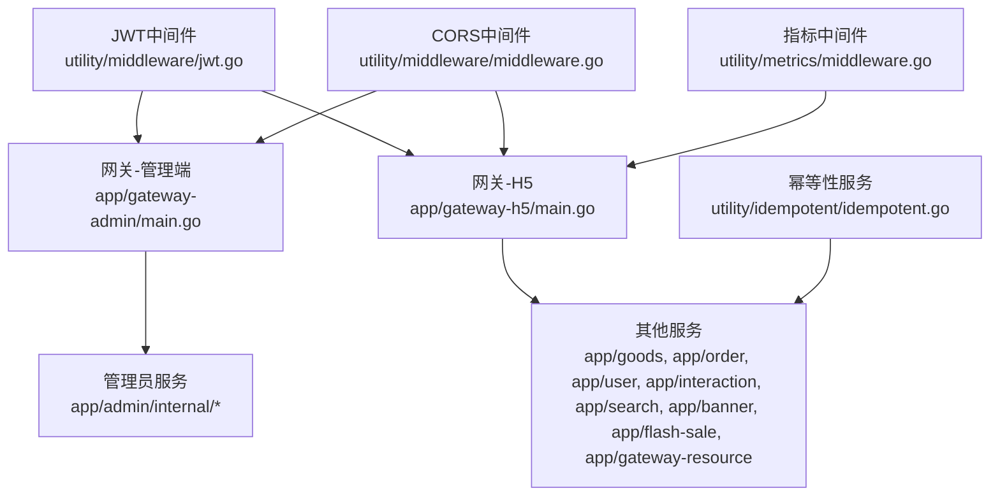
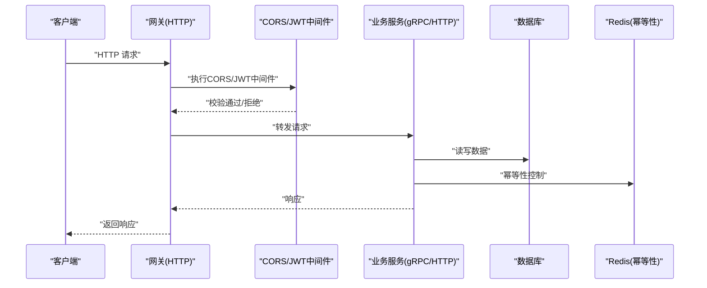
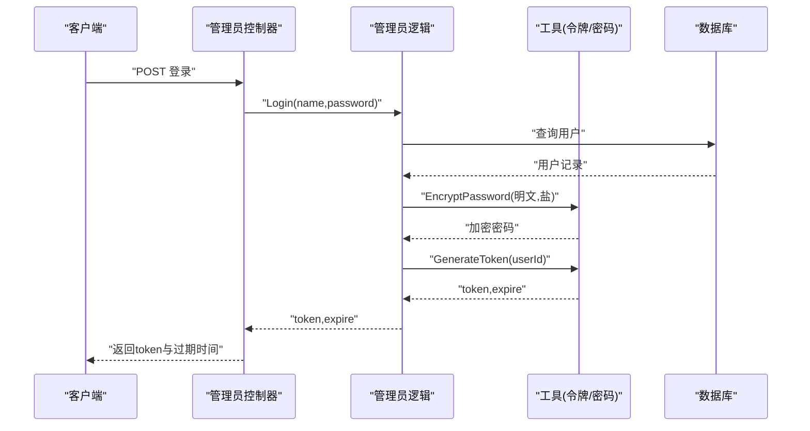
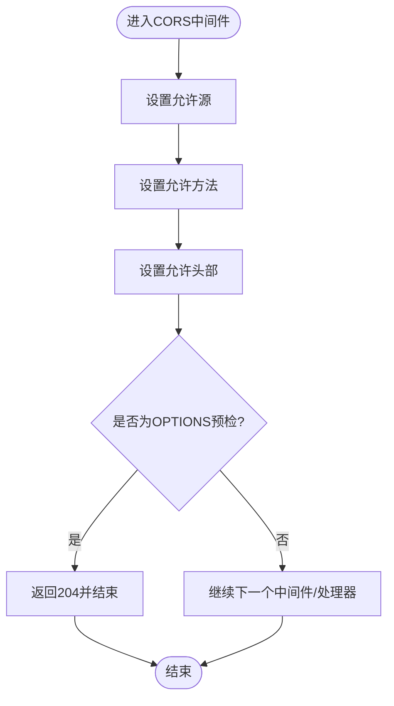
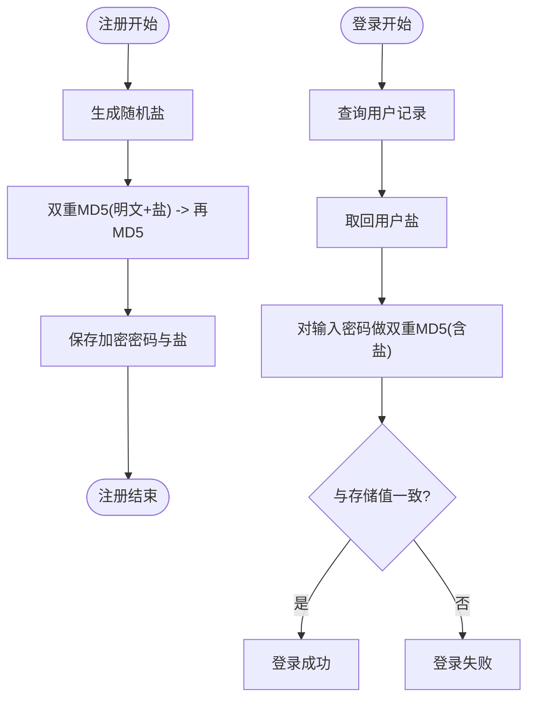
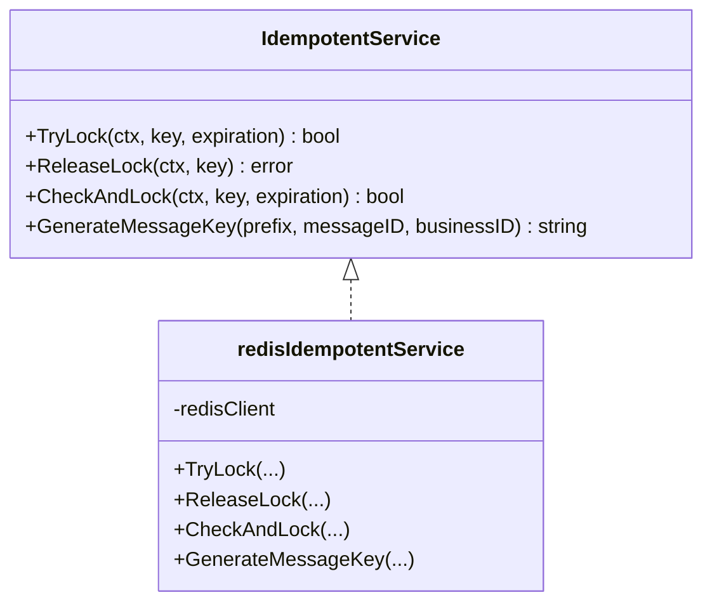
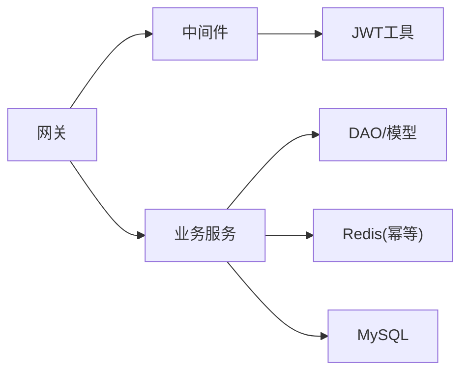

# 安全最佳实践

<cite>
**本文引用的文件**
- [app/admin/internal/controller/admin_info/admin_info.go](file://app/admin/internal/controller/admin_info/admin_info.go)
- [app/admin/internal/logic/admin_info/admin_info.go](file://app/admin/internal/logic/admin_info/admin_info.go)
- [utility/token.go](file://utility/token.go)
- [utility/middleware/jwt.go](file://utility/middleware/jwt.go)
- [utility/middleware/middleware.go](file://utility/middleware/middleware.go)
- [app/gateway-admin/main.go](file://app/gateway-admin/main.go)
- [app/gateway-h5/main.go](file://app/gateway-h5/main.go)
- [app/admin/manifest/config/config.prod.yaml](file://app/admin/manifest/config/config.prod.yaml)
- [app/gateway-admin/manifest/config/config.prod.yaml](file://app/gateway-admin/manifest/config/config.prod.yaml)
- [app/gateway-h5/manifest/config/config.prod.yaml](file://app/gateway-h5/manifest/config/config.prod.yaml)
- [utility/consts/consts.go](file://utility/consts/consts.go)
- [utility/idempotent/idempotent.go](file://utility/idempotent/idempotent.go)
- [utility/metrics/middleware.go](file://utility/metrics/middleware.go)
- [doc/微信支付退款功能实现详解.md](file://doc/微信支付退款功能实现详解.md)
</cite>

## 目录
1. [引言](#引言)
2. [项目结构](#项目结构)
3. [核心组件](#核心组件)
4. [架构总览](#架构总览)
5. [详细组件分析](#详细组件分析)
6. [依赖分析](#依赖分析)
7. [性能考虑](#性能考虑)
8. [故障排查指南](#故障排查指南)
9. [结论](#结论)
10. [附录](#附录)

## 引言
本文件聚焦于本仓库中的安全最佳实践，系统梳理并总结项目在密码安全存储、认证授权、跨域配置、日志审计与监控等方面的具体实现与改进建议。同时给出常见安全漏洞的预防措施、代码审查要点与安全测试方法，并提供应急响应流程与合规建议，帮助团队在开发与运维过程中持续提升整体安全性。

## 项目结构
本项目采用多微服务架构，结合网关层与业务服务层，配合中间件与工具模块实现统一的安全与可观测性能力：
- 网关层：负责统一入口、CORS、指标采集与路由转发
- 业务服务层：包含管理员、商品、订单、用户、搜索、资源等子系统
- 工具与中间件：JWT认证、CORS、幂等性、指标采集、常量与通用工具

图表来源
- [app/gateway-admin/main.go](file://app/gateway-admin/main.go#L13-L29)
- [app/gateway-h5/main.go](file://app/gateway-h5/main.go#L13-L37)
- [utility/middleware/jwt.go](file://utility/middleware/jwt.go#L16-L38)
- [utility/middleware/middleware.go](file://utility/middleware/middleware.go#L10-L23)
- [utility/idempotent/idempotent.go](file://utility/idempotent/idempotent.go#L11-L21)
- [utility/metrics/middleware.go](file://utility/metrics/middleware.go#L9-L34)

章节来源
- [app/gateway-admin/main.go](file://app/gateway-admin/main.go#L1-L30)
- [app/gateway-h5/main.go](file://app/gateway-h5/main.go#L1-L38)
- [utility/middleware/middleware.go](file://utility/middleware/middleware.go#L1-L35)

## 核心组件
- 认证与授权
  - JWT中间件：从请求头提取令牌并解析，将用户ID写入上下文
  - 令牌生成与解析：自定义声明、HS256签名、过期时间控制
- 跨域与传输安全
  - CORS中间件：允许特定方法与头部，处理预检请求
  - 网关层启用CORS中间件
- 密码安全存储
  - 双重MD5加盐：注册时生成随机盐，登录时按同样规则校验
- 日志与审计
  - 统一日志配置（文件轮转、上下文键、时间格式）
  - 常量模块统一错误描述
- 幂等性与安全
  - 基于Redis的幂等性服务，防止重复消费与重复提交
- 监控与告警
  - 指标中间件采集请求耗时、状态码与错误类型

章节来源
- [utility/middleware/jwt.go](file://utility/middleware/jwt.go#L16-L38)
- [utility/token.go](file://utility/token.go#L10-L64)
- [utility/middleware/middleware.go](file://utility/middleware/middleware.go#L10-L23)
- [app/gateway-admin/main.go](file://app/gateway-admin/main.go#L26-L28)
- [app/gateway-h5/main.go](file://app/gateway-h5/main.go#L29-L32)
- [app/admin/manifest/config/config.prod.yaml](file://app/admin/manifest/config/config.prod.yaml#L1-L22)
- [app/gateway-admin/manifest/config/config.prod.yaml](file://app/gateway-admin/manifest/config/config.prod.yaml#L1-L18)
- [app/gateway-h5/manifest/config/config.prod.yaml](file://app/gateway-h5/manifest/config/config.prod.yaml#L1-L18)
- [utility/consts/consts.go](file://utility/consts/consts.go#L1-L47)
- [utility/idempotent/idempotent.go](file://utility/idempotent/idempotent.go#L11-L21)
- [utility/metrics/middleware.go](file://utility/metrics/middleware.go#L9-L34)

## 架构总览
下图展示安全相关组件在请求链路中的位置与交互：

图表来源
- [app/gateway-admin/main.go](file://app/gateway-admin/main.go#L26-L28)
- [app/gateway-h5/main.go](file://app/gateway-h5/main.go#L29-L32)
- [utility/middleware/jwt.go](file://utility/middleware/jwt.go#L16-L38)
- [utility/middleware/middleware.go](file://utility/middleware/middleware.go#L10-L23)
- [utility/idempotent/idempotent.go](file://utility/idempotent/idempotent.go#L35-L79)

## 详细组件分析

### 认证与授权（JWT）
- 令牌生成：自定义声明包含用户ID与标准字段；使用HS256签名；有效期24小时
- 令牌解析：从请求头Authorization中提取Bearer令牌；解析失败直接拒绝
- 上下文注入：解析成功后将用户ID写入上下文，供后续逻辑使用
- 登录流程：参数校验、查询用户、密码校验（双MD5+盐）、生成令牌

图表来源
- [app/admin/internal/controller/admin_info/admin_info.go](file://app/admin/internal/controller/admin_info/admin_info.go#L23-L44)
- [app/admin/internal/logic/admin_info/admin_info.go](file://app/admin/internal/logic/admin_info/admin_info.go#L15-L46)
- [utility/token.go](file://utility/token.go#L31-L50)
- [utility/token.go](file://utility/token.go#L25-L29)

章节来源
- [utility/middleware/jwt.go](file://utility/middleware/jwt.go#L16-L38)
- [utility/token.go](file://utility/token.go#L10-L64)
- [app/admin/internal/controller/admin_info/admin_info.go](file://app/admin/internal/controller/admin_info/admin_info.go#L23-L44)
- [app/admin/internal/logic/admin_info/admin_info.go](file://app/admin/internal/logic/admin_info/admin_info.go#L15-L46)

### 跨域与传输安全（CORS）
- CORS中间件设置允许源、方法与头部；对OPTIONS预检请求直接返回
- 网关层在HTTP服务上启用CORS中间件
- 建议：生产环境将“允许源”从通配符调整为白名单域名，避免安全风险

图表来源
- [utility/middleware/middleware.go](file://utility/middleware/middleware.go#L10-L23)
- [app/gateway-admin/main.go](file://app/gateway-admin/main.go#L26-L28)
- [app/gateway-h5/main.go](file://app/gateway-h5/main.go#L29-L32)

章节来源
- [utility/middleware/middleware.go](file://utility/middleware/middleware.go#L10-L23)
- [app/gateway-admin/main.go](file://app/gateway-admin/main.go#L26-L28)
- [app/gateway-h5/main.go](file://app/gateway-h5/main.go#L29-L32)

### 密码安全存储
- 注册流程：生成10位随机盐；双重MD5（明文+盐）后再次MD5；保存盐与加密密码
- 登录流程：根据用户记录的盐对输入密码做相同双重MD5；与存储值比对
- 建议：采用更强的现代密码哈希算法（如bcrypt/scrypt/PBKDF2），并引入密码强度策略与历史密码检测

图表来源
- [app/admin/internal/logic/admin_info/admin_info.go](file://app/admin/internal/logic/admin_info/admin_info.go#L67-L71)
- [app/admin/internal/logic/admin_info/admin_info.go](file://app/admin/internal/logic/admin_info/admin_info.go#L38-L42)
- [utility/token.go](file://utility/token.go#L20-L29)

章节来源
- [app/admin/internal/logic/admin_info/admin_info.go](file://app/admin/internal/logic/admin_info/admin_info.go#L48-L95)
- [utility/token.go](file://utility/token.go#L20-L29)

### 日志审计与错误描述
- 日志配置：统一的日志路径、文件名模板、前缀、级别、stdout、轮转大小与备份数、上下文键、时间格式
- 错误描述：统一的错误信息前缀（模块+失败描述），便于审计与定位

章节来源
- [app/admin/manifest/config/config.prod.yaml](file://app/admin/manifest/config/config.prod.yaml#L4-L13)
- [app/gateway-admin/manifest/config/config.prod.yaml](file://app/gateway-admin/manifest/config/config.prod.yaml#L5-L14)
- [app/gateway-h5/manifest/config/config.prod.yaml](file://app/gateway-h5/manifest/config/config.prod.yaml#L5-L14)
- [utility/consts/consts.go](file://utility/consts/consts.go#L44-L46)

### 幂等性与安全
- 幂等性服务：基于Redis的SETNX实现分布式锁；支持尝试加锁、释放锁、检查并加锁与消息幂等键生成
- 适用场景：防止重复提交、消息重复消费、关键业务重试导致的副作用
- 建议：为每个业务主键生成唯一幂等键；设置合理过期时间；在业务失败时释放锁

图表来源
- [utility/idempotent/idempotent.go](file://utility/idempotent/idempotent.go#L11-L21)
- [utility/idempotent/idempotent.go](file://utility/idempotent/idempotent.go#L23-L33)

章节来源
- [utility/idempotent/idempotent.go](file://utility/idempotent/idempotent.go#L11-L21)
- [utility/idempotent/idempotent.go](file://utility/idempotent/idempotent.go#L35-L79)

### 监控与安全指标
- 指标中间件：记录请求耗时、方法、路径与状态码
- 错误中间件：根据状态码分类记录错误指标（客户端/服务端）
- 网关H5启用了Prometheus指标中间件与HTTP端点注册

章节来源
- [utility/metrics/middleware.go](file://utility/metrics/middleware.go#L9-L34)
- [utility/metrics/middleware.go](file://utility/metrics/middleware.go#L36-L61)
- [app/gateway-h5/main.go](file://app/gateway-h5/main.go#L23-L36)

### 输入验证与输出编码
- 输入验证：登录与注册逻辑包含基本参数校验（非空、长度等）
- 输出编码：当前未见显式的输出编码实现；建议在渲染HTML或构造JSON时进行严格转义与白名单过滤
- 建议：引入参数校验器与结构体标签约束；对所有外部输入进行白名单/黑名单校验

章节来源
- [app/admin/internal/logic/admin_info/admin_info.go](file://app/admin/internal/logic/admin_info/admin_info.go#L15-L19)
- [app/admin/internal/logic/admin_info/admin_info.go](file://app/admin/internal/logic/admin_info/admin_info.go#L48-L56)

### 会话安全管理
- 当前实现采用JWT无状态令牌，未使用服务端会话存储
- 建议：令牌应通过HTTPS传输；设置HttpOnly与SameSite属性（若以Cookie形式携带）；缩短令牌有效期并支持刷新机制

章节来源
- [utility/token.go](file://utility/token.go#L31-L50)
- [utility/middleware/jwt.go](file://utility/middleware/jwt.go#L16-L38)

### 安全头配置
- 当前未发现显式的安全头设置（如Content-Security-Policy、X-Frame-Options、X-Content-Type-Options等）
- 建议：在网关层统一添加安全头中间件，按需开启严格模式

章节来源
- [utility/middleware/middleware.go](file://utility/middleware/middleware.go#L10-L23)

### HTTPS与证书
- 项目未提供HTTPS配置示例；建议在网关层启用TLS终止，并配置强密码套件与协议版本
- 生产环境必须强制HTTPS重定向与HSTS

章节来源
- [app/gateway-admin/manifest/config/config.prod.yaml](file://app/gateway-admin/manifest/config/config.prod.yaml#L1-L18)
- [app/gateway-h5/manifest/config/config.prod.yaml](file://app/gateway-h5/manifest/config/config.prod.yaml#L1-L18)

### 微信支付退款的安全要点
- 回调验签：文档中强调对回调进行验签与数据解析，确保第三方通知的真实性
- 幂等性：通过退款单号保证重复回调不重复处理
- 异步处理与重试：采用异步与指数退避重试，降低瞬时故障影响

章节来源
- [doc/微信支付退款功能实现详解.md](file://doc/微信支付退款功能实现详解.md#L207-L231)
- [doc/微信支付退款功能实现详解.md](file://doc/微信支付退款功能实现详解.md#L294-L299)

## 依赖分析
- 组件耦合
  - 网关层仅依赖中间件与命令入口，耦合度低
  - 业务服务通过DAO与模型访问数据库，逻辑清晰
  - JWT中间件与令牌工具解耦，便于替换
- 外部依赖
  - etcd用于服务发现；MySQL用于持久化；Redis用于幂等性
- 潜在风险
  - CORS通配符允许源在生产环境存在风险
  - JWT密钥硬编码在源码中，建议迁移到密钥管理服务

图表来源
- [app/gateway-admin/main.go](file://app/gateway-admin/main.go#L26-L28)
- [utility/middleware/jwt.go](file://utility/middleware/jwt.go#L16-L38)
- [utility/idempotent/idempotent.go](file://utility/idempotent/idempotent.go#L91-L102)

章节来源
- [utility/token.go](file://utility/token.go#L16-L18)
- [utility/middleware/middleware.go](file://utility/middleware/middleware.go#L10-L23)

## 性能考虑
- 指标中间件对每个请求记录耗时与状态码，有助于识别慢接口与错误热点
- CORS中间件开销极小，但应避免不必要的预检请求
- JWT解析与数据库查询是登录路径的主要瓶颈，建议结合缓存与索引优化

章节来源
- [utility/metrics/middleware.go](file://utility/metrics/middleware.go#L9-L34)
- [app/admin/internal/logic/admin_info/admin_info.go](file://app/admin/internal/logic/admin_info/admin_info.go#L21-L29)

## 故障排查指南
- 认证失败
  - 检查Authorization头格式是否为Bearer
  - 核对令牌签名与密钥一致性
  - 查看日志中错误前缀与上下文键
- CORS问题
  - 确认允许源、方法与头部配置
  - 观察预检请求是否返回204
- 幂等性冲突
  - 检查Redis连接与键空间
  - 确认过期时间与释放逻辑
- 指标异常
  - 检查指标中间件是否正确注册
  - 核对服务名称与路径标签

章节来源
- [utility/middleware/jwt.go](file://utility/middleware/jwt.go#L16-L38)
- [utility/middleware/middleware.go](file://utility/middleware/middleware.go#L10-L23)
- [utility/idempotent/idempotent.go](file://utility/idempotent/idempotent.go#L35-L79)
- [utility/metrics/middleware.go](file://utility/metrics/middleware.go#L36-L61)

## 结论
本项目在认证授权、跨域处理、日志与监控方面具备基础能力，但在HTTPS、安全头、密码哈希算法与密钥管理等方面仍有改进空间。建议尽快引入更强的密码哈希、密钥管理、安全头与严格的CORS白名单策略，并完善输入验证与输出编码，以满足生产环境的安全要求。

## 附录

### 常见安全漏洞预防清单
- 注入攻击：参数校验、白名单过滤、ORM参数化查询
- 认证绕过：令牌签名验证、过期控制、HTTPS传输
- 跨域攻击：严格CORS白名单、预检最小化
- 会话劫持：短生命周期令牌、刷新机制、安全传输
- 重放攻击：请求时间戳、随机nonce、幂等键
- 敏感信息泄露：日志脱敏、密钥外置、最小暴露面

### 安全代码审查要点
- 密钥与敏感配置：禁止硬编码，使用密钥管理服务
- 输入与输出：统一校验与编码，避免XSS与注入
- 权限与鉴权：RBAC最小权限、接口鉴权与审计
- 日志与监控：敏感字段脱敏、异常指标告警

### 安全测试方法
- 渗透测试：模拟SQL注入、XSS、CSRF、暴力破解
- 单元测试：覆盖边界条件与异常分支
- 集成测试：跨域、鉴权、幂等性与指标采集
- 安全扫描：静态分析、依赖漏洞扫描、容器镜像扫描

### 安全事件应急响应流程
- 发现与分级：快速确认影响范围与严重等级
- 阻断与隔离：临时禁用可疑接口、撤销受影响令牌
- 修复与验证：修复漏洞、回归测试、灰度发布
- 通告与复盘：内部通告、用户沟通、流程优化