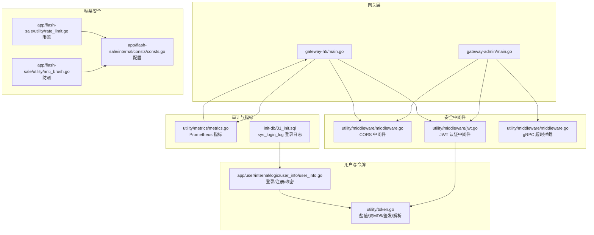
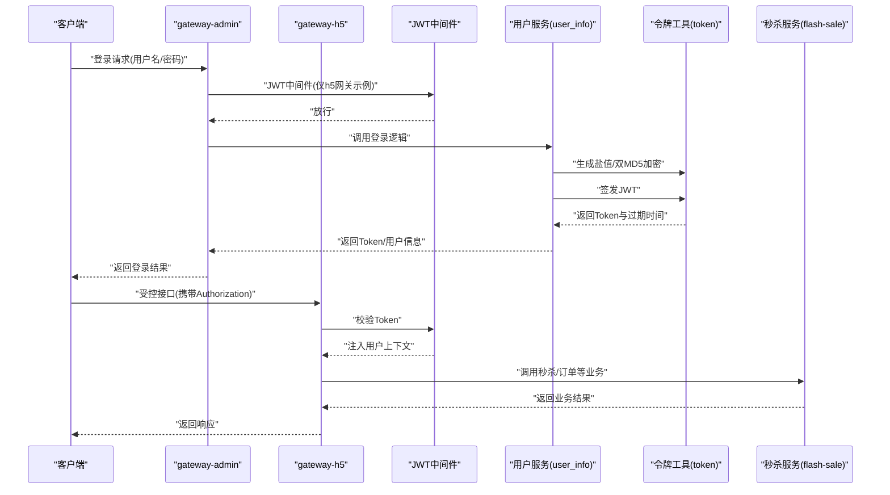
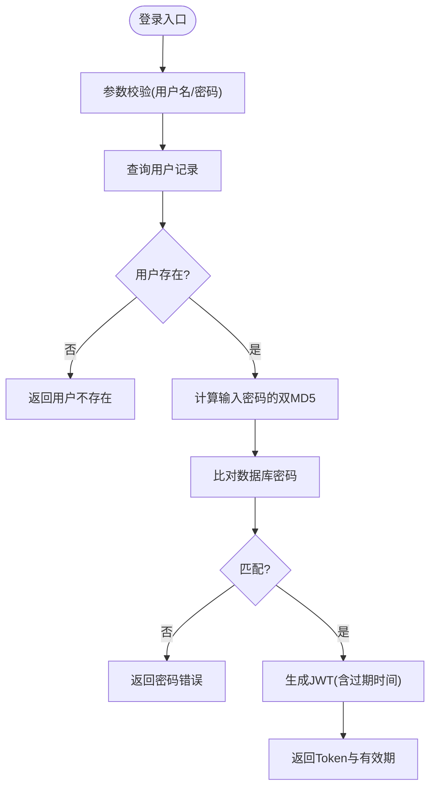
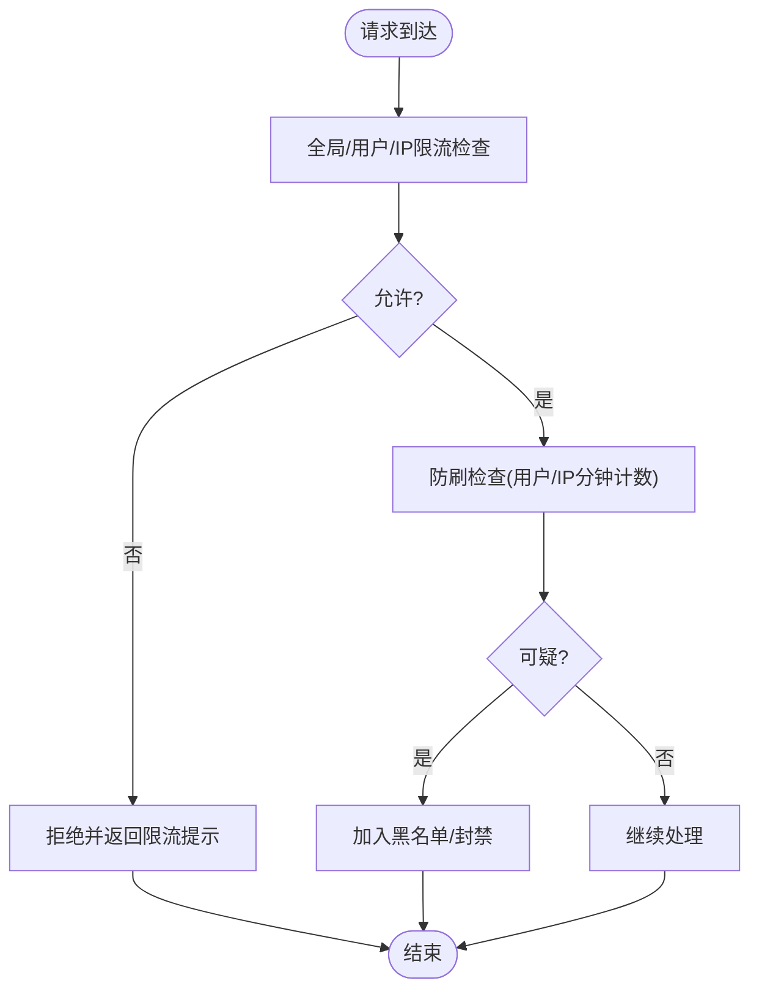
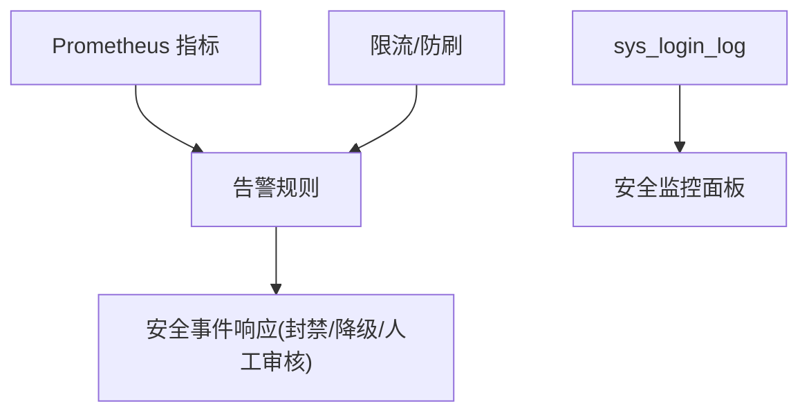
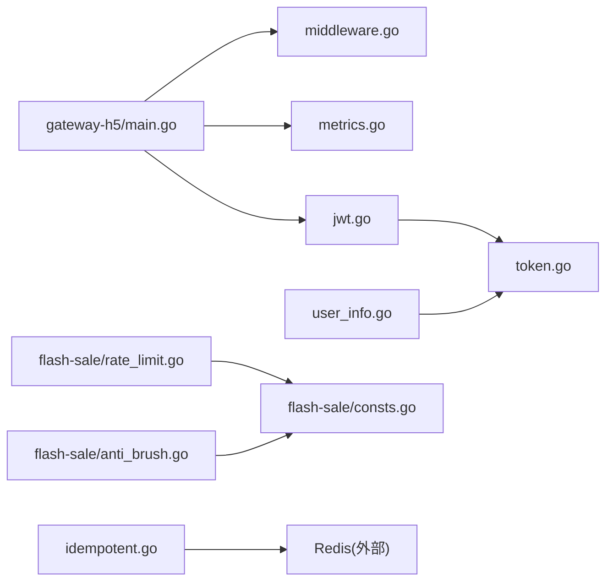

# 接口安全保护

<cite>
**本文引用的文件**
- [app/gateway-admin/main.go](file://app/gateway-admin/main.go)
- [app/gateway-h5/main.go](file://app/gateway-h5/main.go)
- [utility/middleware/middleware.go](file://utility/middleware/middleware.go)
- [utility/middleware/jwt.go](file://utility/middleware/jwt.go)
- [utility/token.go](file://utility/token.go)
- [app/user/internal/logic/user_info/user_info.go](file://app/user/internal/logic/user_info/user_info.go)
- [app/flash-sale/DEVELOPMENT_GUIDE.md](file://app/flash-sale/DEVELOPMENT_GUIDE.md)
- [app/flash-sale/utility/rate_limit.go](file://app/flash-sale/utility/rate_limit.go)
- [app/flash-sale/utility/anti_brush.go](file://app/flash-sale/utility/anti_brush.go)
- [app/flash-sale/internal/consts/consts.go](file://app/flash-sale/internal/consts/consts.go)
- [utility/idempotent/idempotent.go](file://utility/idempotent/idempotent.go)
- [utility/metrics/metrics.go](file://utility/metrics/metrics.go)
- [init-db/01_init.sql](file://init-db/01_init.sql)
</cite>

## 目录
1. [简介](#简介)
2. [项目结构](#项目结构)
3. [核心组件](#核心组件)
4. [架构总览](#架构总览)
5. [详细组件分析](#详细组件分析)
6. [依赖关系分析](#依赖关系分析)
7. [性能考量](#性能考量)
8. [故障排查指南](#故障排查指南)
9. [结论](#结论)
10. [附录](#附录)

## 简介
本文件聚焦于本仓库中“接口安全保护”的整体设计与实现，覆盖以下方面：
- 不同网关（admin、h5、resource、API）的接口安全策略与中间件接入方式
- 用户登录接口的安全设计、密码加密存储、令牌签发与校验
- 验证码机制与暴力破解防护（结合限流、防刷、黑名单）
- 接口参数验证、SQL注入防护、XSS与CSRF防护现状与建议
- 敏感接口访问控制、频率限制与IP白名单机制
- 接口安全审计、异常访问检测与安全事件响应流程

## 项目结构
围绕接口安全，关键位置包括：
- 网关服务入口：admin、h5 网关分别注册 CORS 中间件与指标中间件
- 安全中间件：CORS、JWT 认证、gRPC 超时拦截
- 用户登录与令牌：密码加密、JWT 签发与解析
- 秒杀安全：限流、防刷、幂等、黑名单、全局/用户/IP 限流
- 指标与审计：Prometheus 指标采集与 /metrics 端点
- 登录审计：sys_login_log 登录日志表

**图表来源**
- [app/gateway-admin/main.go](file://app/gateway-admin/main.go#L1-L30)
- [app/gateway-h5/main.go](file://app/gateway-h5/main.go#L1-L38)
- [utility/middleware/middleware.go](file://utility/middleware/middleware.go#L1-L35)
- [utility/middleware/jwt.go](file://utility/middleware/jwt.go#L1-L39)
- [utility/token.go](file://utility/token.go#L1-L65)
- [app/user/internal/logic/user_info/user_info.go](file://app/user/internal/logic/user_info/user_info.go#L1-L235)
- [app/flash-sale/utility/rate_limit.go](file://app/flash-sale/utility/rate_limit.go#L53-L160)
- [app/flash-sale/utility/anti_brush.go](file://app/flash-sale/utility/anti_brush.go#L1-L80)
- [app/flash-sale/internal/consts/consts.go](file://app/flash-sale/internal/consts/consts.go#L33-L42)
- [utility/metrics/metrics.go](file://utility/metrics/metrics.go#L1-L71)
- [init-db/01_init.sql](file://init-db/01_init.sql#L1268-L1507)

**章节来源**
- [app/gateway-admin/main.go](file://app/gateway-admin/main.go#L1-L30)
- [app/gateway-h5/main.go](file://app/gateway-h5/main.go#L1-L38)
- [utility/middleware/middleware.go](file://utility/middleware/middleware.go#L1-L35)
- [utility/middleware/jwt.go](file://utility/middleware/jwt.go#L1-L39)
- [utility/token.go](file://utility/token.go#L1-L65)
- [app/user/internal/logic/user_info/user_info.go](file://app/user/internal/logic/user_info/user_info.go#L1-L235)
- [app/flash-sale/DEVELOPMENT_GUIDE.md](file://app/flash-sale/DEVELOPMENT_GUIDE.md#L430-L449)
- [app/flash-sale/utility/rate_limit.go](file://app/flash-sale/utility/rate_limit.go#L53-L160)
- [app/flash-sale/utility/anti_brush.go](file://app/flash-sale/utility/anti_brush.go#L1-L80)
- [app/flash-sale/internal/consts/consts.go](file://app/flash-sale/internal/consts/consts.go#L33-L42)
- [utility/metrics/metrics.go](file://utility/metrics/metrics.go#L1-L71)
- [init-db/01_init.sql](file://init-db/01_init.sql#L1268-L1507)

## 核心组件
- 网关中间件接入
  - admin 网关：注册 CORS 中间件，用于跨域支持；通过命令行启动注册路由
  - h5 网关：注册 CORS、Prometheus 指标中间件与 /metrics 端点
- 安全中间件
  - CORS 中间件：统一设置允许来源、方法与头部，并处理 OPTIONS 预检
  - JWT 认证中间件：从 Header 的 Authorization 提取 Bearer Token，解析并注入用户上下文
  - gRPC 超时拦截：为下游 gRPC 调用设置统一超时
- 用户与令牌
  - 登录/注册/改密逻辑：参数校验、盐值生成、双MD5加密、JWT签发
  - 令牌工具：自定义 Claims、HS256 签名、解析与有效期控制
- 秒杀安全
  - 限流：用户级/IP级/全局级限流，令牌桶与计数器组合
  - 防刷：用户/IP分钟级请求计数、可疑阈值与黑名单
  - 幂等：Redis SetNX 实现幂等锁，防止重复消费与重复下单
- 审计与监控
  - Prometheus 指标：请求总量、延迟直方图、错误计数
  - 登录日志：sys_login_log 记录登录来源、IP、浏览器、状态与模块

**章节来源**
- [app/gateway-admin/main.go](file://app/gateway-admin/main.go#L23-L28)
- [app/gateway-h5/main.go](file://app/gateway-h5/main.go#L23-L36)
- [utility/middleware/middleware.go](file://utility/middleware/middleware.go#L10-L34)
- [utility/middleware/jwt.go](file://utility/middleware/jwt.go#L16-L38)
- [utility/token.go](file://utility/token.go#L10-L64)
- [app/user/internal/logic/user_info/user_info.go](file://app/user/internal/logic/user_info/user_info.go#L15-L51)
- [app/flash-sale/utility/rate_limit.go](file://app/flash-sale/utility/rate_limit.go#L53-L160)
- [app/flash-sale/utility/anti_brush.go](file://app/flash-sale/utility/anti_brush.go#L24-L80)
- [utility/idempotent/idempotent.go](file://utility/idempotent/idempotent.go#L11-L153)
- [utility/metrics/metrics.go](file://utility/metrics/metrics.go#L14-L71)
- [init-db/01_init.sql](file://init-db/01_init.sql#L1268-L1279)

## 架构总览
下图展示用户登录与访问受控接口的整体流程，以及安全组件的交互：

**图表来源**
- [app/gateway-admin/main.go](file://app/gateway-admin/main.go#L23-L28)
- [app/gateway-h5/main.go](file://app/gateway-h5/main.go#L23-L36)
- [utility/middleware/jwt.go](file://utility/middleware/jwt.go#L16-L38)
- [app/user/internal/logic/user_info/user_info.go](file://app/user/internal/logic/user_info/user_info.go#L15-L51)
- [utility/token.go](file://utility/token.go#L32-L50)
- [app/flash-sale/utility/rate_limit.go](file://app/flash-sale/utility/rate_limit.go#L53-L160)

## 详细组件分析

### 网关安全策略与实现
- admin 网关
  - 注册 CORS 中间件，允许跨域请求与常用头部
  - 通过命令行启动注册路由，未显式注册 JWT 中间件
- h5 网关
  - 注册 CORS 中间件
  - 注册 Prometheus 指标中间件与 /metrics 端点，便于安全监控与告警
  - 通过命令行启动注册路由

建议
- 对 admin 网关增加 JWT 中间件以统一鉴权
- 统一在各网关层启用 HTTPS 与安全响应头（如 X-Content-Type-Options、X-Frame-Options）

**章节来源**
- [app/gateway-admin/main.go](file://app/gateway-admin/main.go#L23-L28)
- [app/gateway-h5/main.go](file://app/gateway-h5/main.go#L23-L36)
- [utility/middleware/middleware.go](file://utility/middleware/middleware.go#L10-L23)

### 用户登录接口安全设计
- 参数验证
  - 登录：用户名/密码非空校验
  - 注册：用户名非空、密码长度不少于6位
- 密码加密存储
  - 生成10位随机盐值
  - 双重MD5：先对输入密码做MD5，再与盐值MD5拼接后二次MD5
  - 存储加密后的密码与盐值
- 令牌签发与校验
  - HS256 签名，Claims 包含 userId、签发/生效/过期时间
  - 登录成功返回Token与剩余有效期（秒）
  - JWT中间件从Header提取并校验Token，注入用户上下文

**图表来源**
- [app/user/internal/logic/user_info/user_info.go](file://app/user/internal/logic/user_info/user_info.go#L15-L51)
- [utility/token.go](file://utility/token.go#L20-L50)

**章节来源**
- [app/user/internal/logic/user_info/user_info.go](file://app/user/internal/logic/user_info/user_info.go#L15-L51)
- [utility/token.go](file://utility/token.go#L20-L50)

### 验证码机制与暴力破解防护
现状
- 未在用户登录接口发现显式的图形验证码/短信验证码相关实现
- 暴力破解防护通过“限流 + 防刷 + 黑名单”实现，主要集中在秒杀场景

实现要点
- 限流
  - 全局限流：每秒1000次
  - 用户限流：每秒10次、每分钟10次
  - IP限流：每秒50次、每分钟50次
- 防刷
  - 用户/IP分钟级请求计数，超过阈值触发异常
  - 可配置可疑阈值与黑名单过期时间
- 黑名单
  - 基于防刷检查器与配置常量实现

**图表来源**
- [app/flash-sale/utility/rate_limit.go](file://app/flash-sale/utility/rate_limit.go#L105-L141)
- [app/flash-sale/utility/anti_brush.go](file://app/flash-sale/utility/anti_brush.go#L24-L80)
- [app/flash-sale/internal/consts/consts.go](file://app/flash-sale/internal/consts/consts.go#L33-L42)

**章节来源**
- [app/flash-sale/DEVELOPMENT_GUIDE.md](file://app/flash-sale/DEVELOPMENT_GUIDE.md#L430-L449)
- [app/flash-sale/utility/rate_limit.go](file://app/flash-sale/utility/rate_limit.go#L53-L160)
- [app/flash-sale/utility/anti_brush.go](file://app/flash-sale/utility/anti_brush.go#L24-L80)
- [app/flash-sale/internal/consts/consts.go](file://app/flash-sale/internal/consts/consts.go#L33-L42)

### 接口参数验证、SQL注入防护、XSS与CSRF
- 参数验证
  - 登录/注册/改密等逻辑包含基础参数校验（非空、长度）
  - 秒杀场景包含更严格的参数校验与业务约束
- SQL注入防护
  - 使用 ORM 查询（如 Where/One/Count），默认参数化查询，降低注入风险
- XSS防护
  - 未发现专门的输出转义实现；建议在网关或模板层统一进行HTML/JS转义
- CSRF防护
  - 未发现CSRF Token机制；建议在受控接口引入CSRF Token并校验

**章节来源**
- [app/user/internal/logic/user_info/user_info.go](file://app/user/internal/logic/user_info/user_info.go#L53-L93)
- [app/flash-sale/DEVELOPMENT_GUIDE.md](file://app/flash-sale/DEVELOPMENT_GUIDE.md#L276-L291)

### 敏感接口访问控制、频率限制与IP白名单
- 访问控制
  - 通过 JWT 中间件实现基于 Token 的身份校验
  - 建议在网关层增加路由级别的权限控制（角色/资源授权）
- 频率限制
  - 已实现用户级/IP级/全局级限流，适用于高并发场景
- IP白名单
  - 未发现白名单实现；可在网关层或反向代理层增加IP白名单策略

**章节来源**
- [utility/middleware/jwt.go](file://utility/middleware/jwt.go#L16-L38)
- [app/flash-sale/utility/rate_limit.go](file://app/flash-sale/utility/rate_limit.go#L105-L141)

### 接口安全审计、异常访问检测与安全事件响应
- 登录审计
  - sys_login_log 表记录登录账号、IP、浏览器、OS、状态、消息、时间与模块
- 指标与监控
  - Prometheus 指标：http_requests_total、http_request_duration_seconds、service_errors_total
  - /metrics 端点暴露指标，便于安全告警与异常检测
- 安全事件响应
  - 建议结合指标与日志建立告警规则（错误率、延迟、异常IP/用户）
  - 配合防刷与限流策略，实现自动化封禁与降级

**图表来源**
- [utility/metrics/metrics.go](file://utility/metrics/metrics.go#L14-L71)
- [init-db/01_init.sql](file://init-db/01_init.sql#L1268-L1279)

**章节来源**
- [utility/metrics/metrics.go](file://utility/metrics/metrics.go#L14-L71)
- [init-db/01_init.sql](file://init-db/01_init.sql#L1268-L1279)

## 依赖关系分析
- 网关与中间件
  - 网关通过 ghttp.Server.Use 注册中间件，CORS 与 JWT 顺序影响跨域与鉴权
- 用户服务与令牌
  - 登录逻辑依赖令牌工具生成 Token；JWT 中间件依赖令牌工具解析 Token
- 秒杀安全
  - 限流与防刷依赖配置常量与缓存；幂等依赖 Redis
- 审计与监控
  - 指标中间件与 /metrics 端点由 h5 网关注册

**图表来源**
- [app/gateway-h5/main.go](file://app/gateway-h5/main.go#L23-L36)
- [utility/middleware/middleware.go](file://utility/middleware/middleware.go#L10-L23)
- [utility/middleware/jwt.go](file://utility/middleware/jwt.go#L16-L38)
- [utility/token.go](file://utility/token.go#L32-L50)
- [app/user/internal/logic/user_info/user_info.go](file://app/user/internal/logic/user_info/user_info.go#L15-L51)
- [app/flash-sale/utility/rate_limit.go](file://app/flash-sale/utility/rate_limit.go#L53-L160)
- [app/flash-sale/internal/consts/consts.go](file://app/flash-sale/internal/consts/consts.go#L33-L42)
- [app/flash-sale/utility/anti_brush.go](file://app/flash-sale/utility/anti_brush.go#L24-L80)
- [utility/idempotent/idempotent.go](file://utility/idempotent/idempotent.go#L23-L85)

**章节来源**
- [app/gateway-h5/main.go](file://app/gateway-h5/main.go#L23-L36)
- [utility/middleware/middleware.go](file://utility/middleware/middleware.go#L10-L23)
- [utility/middleware/jwt.go](file://utility/middleware/jwt.go#L16-L38)
- [utility/token.go](file://utility/token.go#L32-L50)
- [app/user/internal/logic/user_info/user_info.go](file://app/user/internal/logic/user_info/user_info.go#L15-L51)
- [app/flash-sale/utility/rate_limit.go](file://app/flash-sale/utility/rate_limit.go#L53-L160)
- [app/flash-sale/internal/consts/consts.go](file://app/flash-sale/internal/consts/consts.go#L33-L42)
- [app/flash-sale/utility/anti_brush.go](file://app/flash-sale/utility/anti_brush.go#L24-L80)
- [utility/idempotent/idempotent.go](file://utility/idempotent/idempotent.go#L23-L85)

## 性能考量
- 限流与防刷
  - 采用令牌桶与计数器组合，兼顾突发与长期速率控制
  - 用户/IP/全局三级限流，避免单点过载
- 幂等
  - Redis SetNX 实现幂等锁，避免重复消费与重复下单
- 指标监控
  - Prometheus 指标提供延迟、错误与总量统计，支撑容量规划与异常定位

**章节来源**
- [app/flash-sale/DEVELOPMENT_GUIDE.md](file://app/flash-sale/DEVELOPMENT_GUIDE.md#L33-L65)
- [utility/idempotent/idempotent.go](file://utility/idempotent/idempotent.go#L35-L79)
- [utility/metrics/metrics.go](file://utility/metrics/metrics.go#L14-L43)

## 故障排查指南
- 登录失败
  - 检查用户名是否存在、密码是否正确（双MD5匹配）、Token 是否过期
  - 查看 sys_login_log 登录日志与 Prometheus 错误指标
- 频繁限流
  - 检查用户/IP/全局限流阈值，确认是否触发防刷策略
  - 核对配置常量与缓存计数
- 幂等冲突
  - 检查幂等键是否重复，确认 Redis 键值与过期时间
- 监控告警
  - 结合 /metrics 端点与告警规则，定位高延迟、高错误率与异常流量

**章节来源**
- [app/user/internal/logic/user_info/user_info.go](file://app/user/internal/logic/user_info/user_info.go#L15-L51)
- [init-db/01_init.sql](file://init-db/01_init.sql#L1268-L1279)
- [app/flash-sale/utility/rate_limit.go](file://app/flash-sale/utility/rate_limit.go#L105-L141)
- [app/flash-sale/utility/anti_brush.go](file://app/flash-sale/utility/anti_brush.go#L24-L80)
- [utility/idempotent/idempotent.go](file://utility/idempotent/idempotent.go#L117-L142)
- [utility/metrics/metrics.go](file://utility/metrics/metrics.go#L45-L71)

## 结论
本项目在接口安全方面已具备较为完善的基础设施：
- 网关层统一 CORS 与指标监控
- JWT 认证与令牌工具链完善
- 秒杀场景的多级限流、防刷与幂等机制成熟
- 登录审计与 Prometheus 指标为安全运营提供支撑

建议进一步增强的方向：
- 在 admin 网关增加 JWT 中间件与权限控制
- 引入验证码与 CSRF Token 机制
- 在网关层增加 HTTPS 与安全响应头
- 增设 IP 白名单与精细化路由授权

## 附录
- 相关配置与常量
  - 秒杀限流与防刷阈值：参考内部常量文件
  - 登录日志表字段：账号、IP、浏览器、OS、状态、消息、时间、模块

**章节来源**
- [app/flash-sale/internal/consts/consts.go](file://app/flash-sale/internal/consts/consts.go#L33-L42)
- [init-db/01_init.sql](file://init-db/01_init.sql#L1268-L1279)