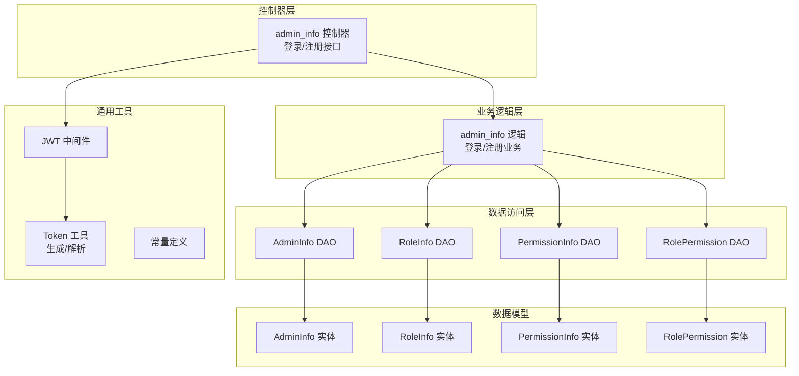
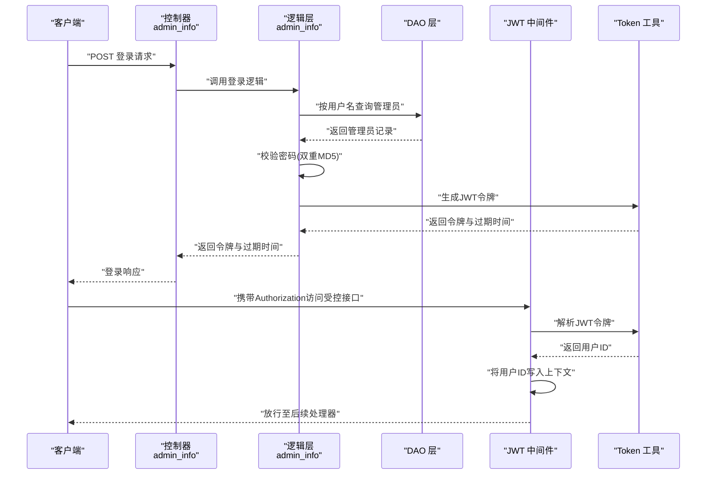
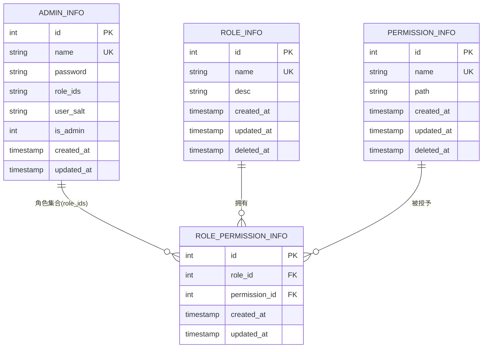
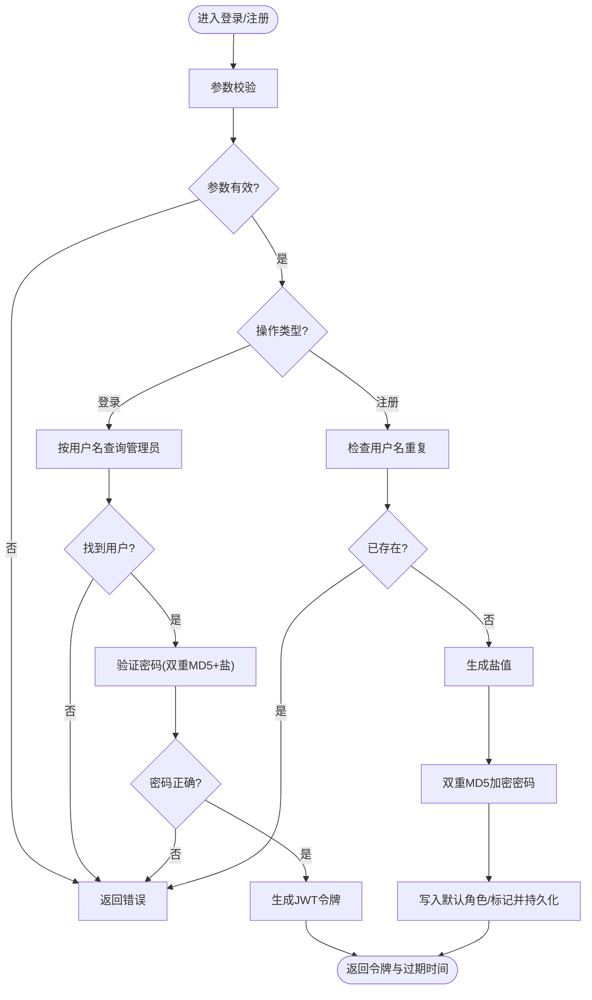
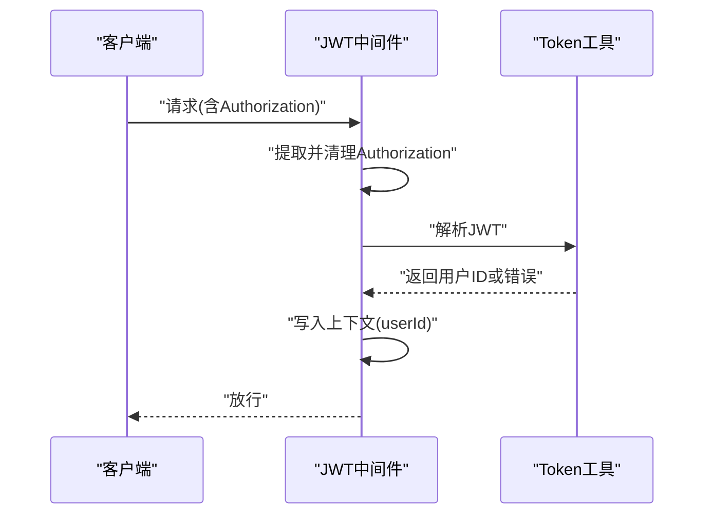
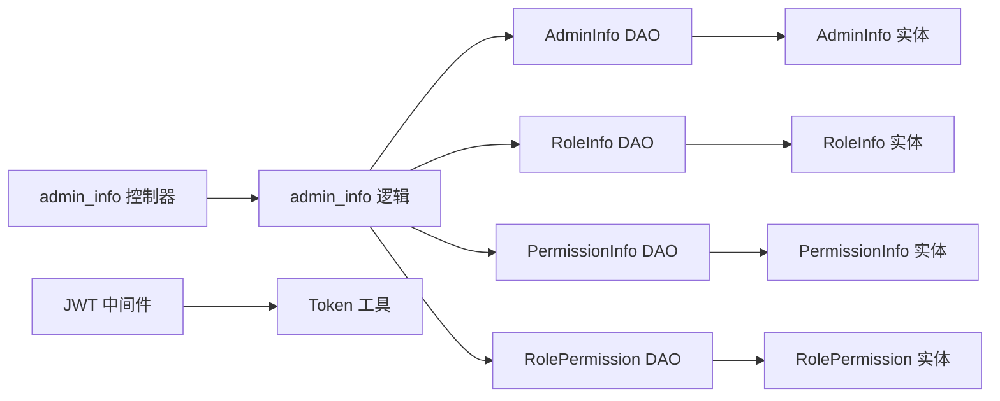

# 权限控制系统

<cite>
**本文档引用的文件**
- [app/admin/internal/model/entity/admin_info.go](file://app/admin/internal/model/entity/admin_info.go)
- [app/admin/internal/model/entity/role_info.go](file://app/admin/internal/model/entity/role_info.go)
- [app/admin/internal/model/entity/permission_info.go](file://app/admin/internal/model/entity/permission_info.go)
- [app/admin/internal/model/entity/role_permission_info.go](file://app/admin/internal/model/entity/role_permission_info.go)
- [app/admin/internal/controller/admin_info/admin_info.go](file://app/admin/internal/controller/admin_info/admin_info.go)
- [app/admin/internal/logic/admin_info/admin_info.go](file://app/admin/internal/logic/admin_info/admin_info.go)
- [app/admin/internal/dao/admin_info.go](file://app/admin/internal/dao/admin_info.go)
- [app/admin/internal/dao/role_info.go](file://app/admin/internal/dao/role_info.go)
- [app/admin/internal/dao/permission_info.go](file://app/admin/internal/dao/permission_info.go)
- [app/admin/internal/dao/role_permission_info.go](file://app/admin/internal/dao/role_permission_info.go)
- [utility/middleware/jwt.go](file://utility/middleware/jwt.go)
- [utility/token.go](file://utility/token.go)
- [utility/consts/consts.go](file://utility/consts/consts.go)
- [app/admin/hack/admin.sql](file://app/admin/hack/admin.sql)
</cite>

## 目录
1. [简介](#简介)
2. [项目结构](#项目结构)
3. [核心组件](#核心组件)
4. [架构总览](#架构总览)
5. [详细组件分析](#详细组件分析)
6. [依赖关系分析](#依赖关系分析)
7. [性能考虑](#性能考虑)
8. [故障排除指南](#故障排除指南)
9. [结论](#结论)
10. [附录](#附录)

## 简介
本文件系统化梳理并阐述该微服务项目中的权限控制系统，重点围绕基于角色的权限管理（RBAC）进行设计与实现说明。内容涵盖管理员权限模型、角色分配机制、接口访问控制、数据权限限制、权限验证流程、角色继承关系、权限缓存策略以及权限变更的实时生效机制，并提供权限配置示例、权限检查的实现路径、权限审计日志建议及不同用户角色的权限边界与安全访问控制最佳实践。

## 项目结构
权限控制涉及三层：控制器层（Controller）、业务逻辑层（Logic）、数据访问层（DAO），配合通用工具与中间件完成鉴权与授权。下图展示与权限相关的核心模块与文件映射：

图表来源
- [app/admin/internal/controller/admin_info/admin_info.go](file://app/admin/internal/controller/admin_info/admin_info.go#L1-L73)
- [app/admin/internal/logic/admin_info/admin_info.go](file://app/admin/internal/logic/admin_info/admin_info.go#L1-L96)
- [app/admin/internal/dao/admin_info.go](file://app/admin/internal/dao/admin_info.go#L1-L23)
- [app/admin/internal/dao/role_info.go](file://app/admin/internal/dao/role_info.go#L1-L23)
- [app/admin/internal/dao/permission_info.go](file://app/admin/internal/dao/permission_info.go#L1-L23)
- [app/admin/internal/dao/role_permission_info.go](file://app/admin/internal/dao/role_permission_info.go#L1-L22)
- [utility/middleware/jwt.go](file://utility/middleware/jwt.go#L1-L39)
- [utility/token.go](file://utility/token.go#L1-L65)
- [app/admin/internal/model/entity/admin_info.go](file://app/admin/internal/model/entity/admin_info.go#L1-L22)
- [app/admin/internal/model/entity/role_info.go](file://app/admin/internal/model/entity/role_info.go#L1-L20)
- [app/admin/internal/model/entity/permission_info.go](file://app/admin/internal/model/entity/permission_info.go#L1-L20)
- [app/admin/internal/model/entity/role_permission_info.go](file://app/admin/internal/model/entity/role_permission_info.go#L1-L19)

章节来源
- [app/admin/internal/controller/admin_info/admin_info.go](file://app/admin/internal/controller/admin_info/admin_info.go#L1-L73)
- [app/admin/internal/logic/admin_info/admin_info.go](file://app/admin/internal/logic/admin_info/admin_info.go#L1-L96)
- [utility/middleware/jwt.go](file://utility/middleware/jwt.go#L1-L39)
- [utility/token.go](file://utility/token.go#L1-L65)

## 核心组件
- 管理员实体与字段：包含用户标识、用户名、密码、角色集合、盐值、是否超级管理员等，用于登录认证与角色关联。
- 角色实体：角色标识、名称、描述及软删除字段。
- 权限实体：权限标识、名称、路径（用于接口或资源访问控制）及软删除字段。
- 角色-权限关联实体：建立角色与权限的多对多关系。
- 登录/注册控制器：提供登录与注册接口，返回令牌与过期时间。
- 登录/注册逻辑：执行参数校验、用户查询、密码验证、JWT签发、默认角色分配与持久化。
- DAO 层：封装对 admin_info、role_info、permission_info、role_permission_info 的数据访问。
- JWT 中间件：从请求头提取并校验令牌，将用户ID写入上下文。
- Token 工具：生成/解析JWT、盐值生成、密码双重MD5加密。
- 常量定义：统一错误信息前缀，便于审计日志输出。

章节来源
- [app/admin/internal/model/entity/admin_info.go](file://app/admin/internal/model/entity/admin_info.go#L11-L21)
- [app/admin/internal/model/entity/role_info.go](file://app/admin/internal/model/entity/role_info.go#L11-L19)
- [app/admin/internal/model/entity/permission_info.go](file://app/admin/internal/model/entity/permission_info.go#L11-L19)
- [app/admin/internal/model/entity/role_permission_info.go](file://app/admin/internal/model/entity/role_permission_info.go#L11-L18)
- [app/admin/internal/controller/admin_info/admin_info.go](file://app/admin/internal/controller/admin_info/admin_info.go#L19-L72)
- [app/admin/internal/logic/admin_info/admin_info.go](file://app/admin/internal/logic/admin_info/admin_info.go#L15-L95)
- [app/admin/internal/dao/admin_info.go](file://app/admin/internal/dao/admin_info.go#L11-L22)
- [app/admin/internal/dao/role_info.go](file://app/admin/internal/dao/role_info.go#L11-L22)
- [app/admin/internal/dao/permission_info.go](file://app/admin/internal/dao/permission_info.go#L11-L22)
- [app/admin/internal/dao/role_permission_info.go](file://app/admin/internal/dao/role_permission_info.go#L11-L22)
- [utility/middleware/jwt.go](file://utility/middleware/jwt.go#L16-L38)
- [utility/token.go](file://utility/token.go#L32-L64)
- [utility/consts/consts.go](file://utility/consts/consts.go#L33-L46)

## 架构总览
下图展示从客户端到服务端的典型鉴权与授权流程，包括登录、令牌校验与上下文注入：

图表来源
- [app/admin/internal/controller/admin_info/admin_info.go](file://app/admin/internal/controller/admin_info/admin_info.go#L23-L44)
- [app/admin/internal/logic/admin_info/admin_info.go](file://app/admin/internal/logic/admin_info/admin_info.go#L15-L46)
- [utility/middleware/jwt.go](file://utility/middleware/jwt.go#L16-L38)
- [utility/token.go](file://utility/token.go#L32-L64)

## 详细组件分析

### 管理员权限模型与实体关系
管理员权限模型采用RBAC三元组：管理员（Admin）-角色（Role）-权限（Permission），通过中间表（角色-权限）建立多对多关系。实体关系如下：

图表来源
- [app/admin/internal/model/entity/admin_info.go](file://app/admin/internal/model/entity/admin_info.go#L12-L21)
- [app/admin/internal/model/entity/role_info.go](file://app/admin/internal/model/entity/role_info.go#L12-L19)
- [app/admin/internal/model/entity/permission_info.go](file://app/admin/internal/model/entity/permission_info.go#L12-L19)
- [app/admin/internal/model/entity/role_permission_info.go](file://app/admin/internal/model/entity/role_permission_info.go#L12-L18)
- [app/admin/hack/admin.sql](file://app/admin/hack/admin.sql#L4-L83)

章节来源
- [app/admin/internal/model/entity/admin_info.go](file://app/admin/internal/model/entity/admin_info.go#L11-L21)
- [app/admin/internal/model/entity/role_info.go](file://app/admin/internal/model/entity/role_info.go#L11-L19)
- [app/admin/internal/model/entity/permission_info.go](file://app/admin/internal/model/entity/permission_info.go#L11-L19)
- [app/admin/internal/model/entity/role_permission_info.go](file://app/admin/internal/model/entity/role_permission_info.go#L11-L18)
- [app/admin/hack/admin.sql](file://app/admin/hack/admin.sql#L1-L83)

### 登录与注册流程
- 登录流程：参数校验 → 查询管理员 → 结构化实体 → 密码验证（双重MD5 + 盐）→ 生成JWT令牌。
- 注册流程：参数校验 → 唯一性检查 → 生成盐值 → 双重MD5加密 → 写入默认角色与超级管理员标记 → 持久化并返回。

图表来源
- [app/admin/internal/logic/admin_info/admin_info.go](file://app/admin/internal/logic/admin_info/admin_info.go#L15-L95)

章节来源
- [app/admin/internal/logic/admin_info/admin_info.go](file://app/admin/internal/logic/admin_info/admin_info.go#L15-L95)

### 接口访问控制与JWT中间件
- 中间件职责：从请求头提取Authorization，去除Bearer前缀，解析JWT，校验有效性，将用户ID写入上下文供后续处理器使用。
- 上下文键：userId，用于在后续业务中识别当前管理员身份。

图表来源
- [utility/middleware/jwt.go](file://utility/middleware/jwt.go#L16-L38)
- [utility/token.go](file://utility/token.go#L52-L64)

章节来源
- [utility/middleware/jwt.go](file://utility/middleware/jwt.go#L12-L38)
- [utility/token.go](file://utility/token.go#L10-L64)

### 角色分配机制与数据权限
- 角色集合：管理员实体包含角色集合字段，支持多角色关联。
- 角色-权限映射：通过角色-权限关联表建立角色与权限的多对多关系。
- 数据权限：当前实现以接口路径作为权限标识，结合中间件在请求入口处进行访问控制；如需更细粒度的数据权限，可在业务逻辑层根据角色动态拼接查询条件或使用视图/策略。

章节来源
- [app/admin/internal/model/entity/admin_info.go](file://app/admin/internal/model/entity/admin_info.go#L16-L16)
- [app/admin/internal/model/entity/role_permission_info.go](file://app/admin/internal/model/entity/role_permission_info.go#L14-L15)
- [app/admin/internal/model/entity/permission_info.go](file://app/admin/internal/model/entity/permission_info.go#L15-L15)

### 权限验证流程与实时生效机制
- 鉴权：JWT中间件在请求到达业务逻辑前完成令牌校验与用户上下文注入。
- 授权：当前仓库未提供统一的权限拦截器，建议在业务层或新增中间件中读取管理员的角色集合，查询其拥有的权限列表，再与请求路径进行匹配，实现“路径白名单”式授权。
- 实时生效：权限变更后，建议在登录或刷新令牌时重新加载管理员的完整权限集，确保新旧权限即时切换。

章节来源
- [utility/middleware/jwt.go](file://utility/middleware/jwt.go#L16-L38)
- [app/admin/internal/logic/admin_info/admin_info.go](file://app/admin/internal/logic/admin_info/admin_info.go#L15-L46)

### 权限缓存策略
- 缓存对象：管理员的权限集合（角色-权限映射）。
- 缓存位置：建议在内存或Redis中缓存，键可采用“admin:{userId}:permissions”。
- 失效策略：权限变更（角色调整、权限增删）时主动失效对应键；令牌刷新时可选择性更新缓存。
- 命中流程：中间件解析令牌后，先查缓存，命中则直接放行；未命中则回源数据库加载并写入缓存。

（本节为通用设计建议，不直接分析具体文件）

### 权限配置示例
- 示例数据（来自初始化SQL）：
  - 管理员：zhangsan（角色ID: 2）、李四（角色ID: 1，且is_admin为1）。
  - 角色：运营（ID: 3）、运营1（ID: 1）。
  - 权限：admin.article.index、admin/goods等。
  - 角色-权限：角色ID 1与若干权限ID绑定。
- 配置步骤建议：
  1) 在权限表中添加/编辑权限项（名称与路径）。
  2) 在角色表中创建角色。
  3) 通过角色-权限表建立角色与权限的关联。
  4) 在管理员表中设置管理员的角色集合字段（支持多角色）。
  5) 登录后，系统加载管理员的权限集合，用于后续授权判断。

章节来源
- [app/admin/hack/admin.sql](file://app/admin/hack/admin.sql#L1-L83)

### 权限检查的实现路径
- 登录接口：控制器调用逻辑层，逻辑层完成密码校验并生成令牌。
- 注册接口：控制器调用逻辑层，逻辑层完成参数校验、盐值生成、密码加密、默认角色分配与持久化。
- 中间件：从请求头解析令牌，将用户ID写入上下文，供后续处理器使用。

章节来源
- [app/admin/internal/controller/admin_info/admin_info.go](file://app/admin/internal/controller/admin_info/admin_info.go#L23-L72)
- [app/admin/internal/logic/admin_info/admin_info.go](file://app/admin/internal/logic/admin_info/admin_info.go#L15-L95)
- [utility/middleware/jwt.go](file://utility/middleware/jwt.go#L16-L38)

### 权限审计日志
- 日志建议：
  - 登录/登出事件：记录管理员ID、IP、UA、时间戳、结果（成功/失败）。
  - 权限变更事件：记录管理员ID、变更类型（角色/权限）、变更详情、操作人、时间戳。
  - 接口访问事件：记录管理员ID、请求路径、HTTP方法、响应状态、耗时、异常信息。
- 统一日志前缀：使用常量定义统一错误信息前缀，便于检索与聚合。

章节来源
- [utility/consts/consts.go](file://utility/consts/consts.go#L33-L46)
- [app/admin/internal/controller/admin_info/admin_info.go](file://app/admin/internal/controller/admin_info/admin_info.go#L27-L31)

## 依赖关系分析
- 控制器依赖逻辑层，逻辑层依赖DAO层与工具层。
- JWT中间件依赖Token工具进行令牌解析。
- DAO层封装底层数据库访问，向上提供统一接口。
- 实体模型定义了表结构与字段约束，支撑DAO与业务逻辑。

图表来源
- [app/admin/internal/controller/admin_info/admin_info.go](file://app/admin/internal/controller/admin_info/admin_info.go#L1-L17)
- [app/admin/internal/logic/admin_info/admin_info.go](file://app/admin/internal/logic/admin_info/admin_info.go#L1-L13)
- [utility/middleware/jwt.go](file://utility/middleware/jwt.go#L1-L14)
- [utility/token.go](file://utility/token.go#L1-L18)
- [app/admin/internal/dao/admin_info.go](file://app/admin/internal/dao/admin_info.go#L1-L23)
- [app/admin/internal/dao/role_info.go](file://app/admin/internal/dao/role_info.go#L1-L23)
- [app/admin/internal/dao/permission_info.go](file://app/admin/internal/dao/permission_info.go#L1-L23)
- [app/admin/internal/dao/role_permission_info.go](file://app/admin/internal/dao/role_permission_info.go#L1-L22)

章节来源
- [app/admin/internal/controller/admin_info/admin_info.go](file://app/admin/internal/controller/admin_info/admin_info.go#L1-L17)
- [app/admin/internal/logic/admin_info/admin_info.go](file://app/admin/internal/logic/admin_info/admin_info.go#L1-L13)
- [utility/middleware/jwt.go](file://utility/middleware/jwt.go#L1-L14)
- [utility/token.go](file://utility/token.go#L1-L18)
- [app/admin/internal/dao/admin_info.go](file://app/admin/internal/dao/admin_info.go#L1-L23)
- [app/admin/internal/dao/role_info.go](file://app/admin/internal/dao/role_info.go#L1-L23)
- [app/admin/internal/dao/permission_info.go](file://app/admin/internal/dao/permission_info.go#L1-L23)
- [app/admin/internal/dao/role_permission_info.go](file://app/admin/internal/dao/role_permission_info.go#L1-L22)

## 性能考虑
- 令牌解析：JWT解析为O(1)，成本极低；建议在高并发场景下复用解析结果（如缓存短期会话摘要）。
- 数据访问：DAO层使用ORM模型，注意在批量查询与关联查询时使用合适的索引与分页。
- 缓存策略：权限集合建议缓存，减少频繁数据库查询；结合失效策略保证一致性。
- 密码加密：双重MD5在性能上较轻量，但需确保盐值随机性与存储安全。

（本节提供通用指导，不直接分析具体文件）

## 故障排除指南
- 未提供Token或无效Token：中间件返回未授权错误，检查请求头Authorization格式与签名。
- 登录失败：检查用户名是否存在、密码是否正确（双重MD5+盐），查看系统日志定位错误。
- 注册失败：检查用户名唯一性、密码长度与盐值生成，确认数据库插入是否成功。
- 审计日志：统一使用常量前缀输出错误信息，便于排查与统计。

章节来源
- [utility/middleware/jwt.go](file://utility/middleware/jwt.go#L18-L31)
- [app/admin/internal/logic/admin_info/admin_info.go](file://app/admin/internal/logic/admin_info/admin_info.go#L23-L42)
- [utility/consts/consts.go](file://utility/consts/consts.go#L33-L46)

## 结论
本权限控制系统以RBAC为核心，结合JWT实现鉴权与授权基础能力。当前实现完成了管理员登录、注册与令牌下发，以及JWT中间件的接入。为进一步完善，建议补充统一的权限拦截器、权限缓存与失效策略、细粒度数据权限控制以及完善的审计日志体系，从而满足生产级的安全与运维需求。

## 附录
- 关键实现路径参考：
  - 登录接口：[app/admin/internal/controller/admin_info/admin_info.go](file://app/admin/internal/controller/admin_info/admin_info.go#L23-L44)
  - 注册接口：[app/admin/internal/controller/admin_info/admin_info.go](file://app/admin/internal/controller/admin_info/admin_info.go#L47-L72)
  - 登录逻辑：[app/admin/internal/logic/admin_info/admin_info.go](file://app/admin/internal/logic/admin_info/admin_info.go#L15-L46)
  - 注册逻辑：[app/admin/internal/logic/admin_info/admin_info.go](file://app/admin/internal/logic/admin_info/admin_info.go#L49-L95)
  - JWT中间件：[utility/middleware/jwt.go](file://utility/middleware/jwt.go#L16-L38)
  - Token工具：[utility/token.go](file://utility/token.go#L32-L64)
  - 初始化SQL：[app/admin/hack/admin.sql](file://app/admin/hack/admin.sql#L1-L83)