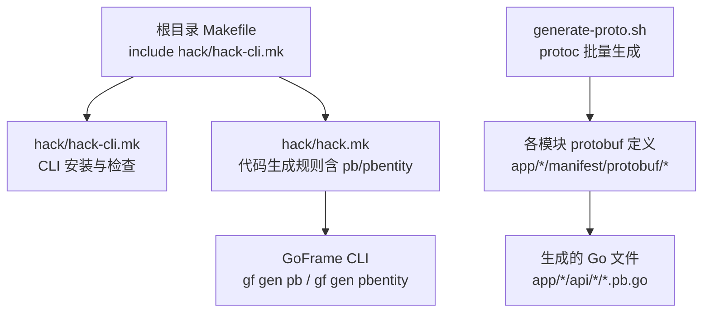
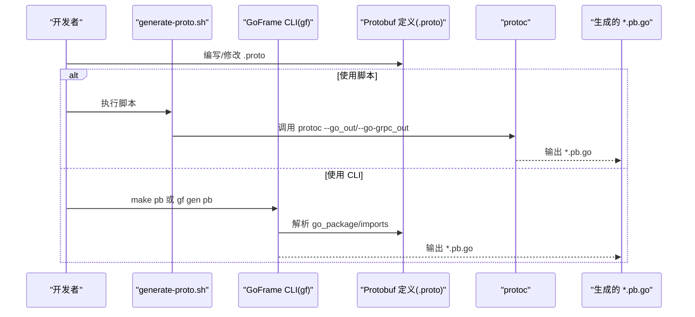
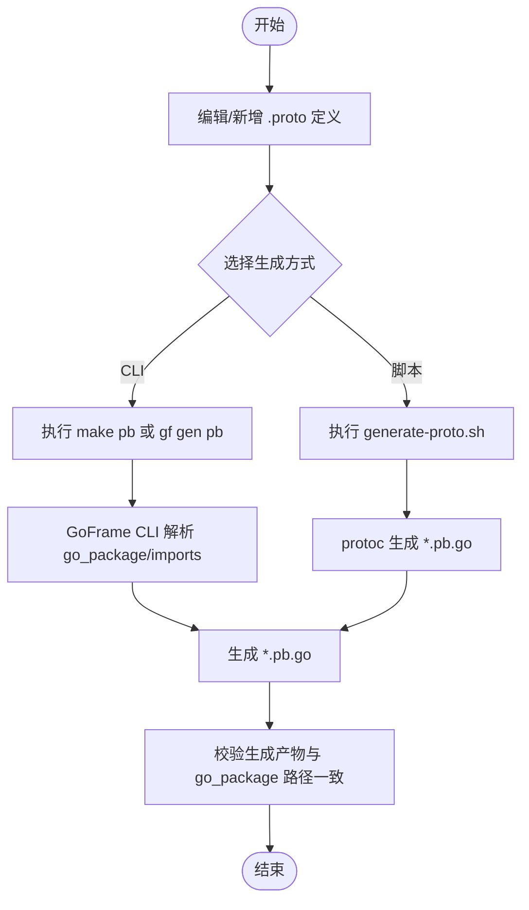
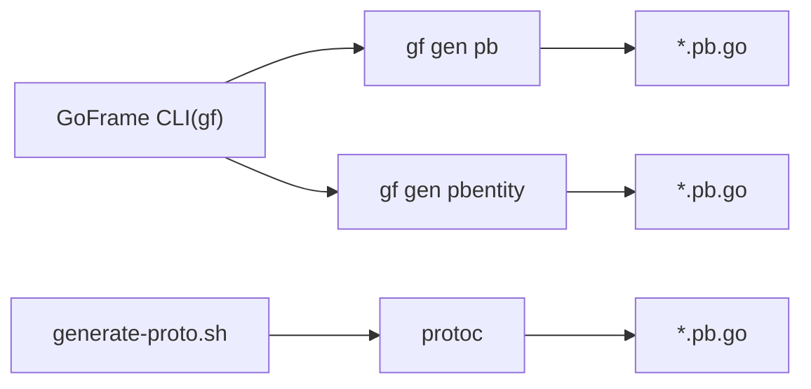

# 代码生成工具

<cite>
**本文引用的文件**
- [generate-proto.sh](file://generate-proto.sh)
- [hack.mk](file://hack/hack.mk)
- [hack-cli.mk](file://hack/hack-cli.mk)
- [admin_info.proto（管理端）](file://app/admin/manifest/protobuf/admin_info/v1/admin_info.proto)
- [admin_info.proto（实体）](file://app/admin/manifest/protobuf/pbentity/admin_info.proto)
- [goods_info.proto（商品服务）](file://app/goods/manifest/protobuf/goods_info/v1/goods_info.proto)
- [goods_info.proto（实体）](file://app/goods/manifest/protobuf/pbentity/goods_info.proto)
- [order_info.proto（订单服务）](file://app/order/manifest/protobuf/order_info/v1/order_info.proto)
- [user_info.proto（用户服务）](file://app/user/manifest/protobuf/user_info/v1/user_info.proto)
- [Makefile（根目录）](file://Makefile)
- [Makefile（管理端应用）](file://app/admin/Makefile)
</cite>

## 目录
1. [简介](#简介)
2. [项目结构](#项目结构)
3. [核心组件](#核心组件)
4. [架构总览](#架构总览)
5. [详细组件分析](#详细组件分析)
6. [依赖分析](#依赖分析)
7. [性能考量](#性能考量)
8. [故障排查指南](#故障排查指南)
9. [结论](#结论)
10. [附录](#附录)

## 简介
本指南面向使用 Protobuf 定义接口并进行代码自动生成的场景，结合本仓库中现有的脚本与构建规则，系统讲解以下内容：
- 如何编写与组织 Protobuf 接口定义文件
- 如何使用 generate-proto.sh 脚本批量生成 Go 语言代码
- 如何通过 hack.mk 中的代码生成规则与 GoFrame CLI 工具协同工作
- 如何为新服务或接口添加 Protobuf 定义并纳入构建流程
- 代码生成的最佳实践（命名规范、版本管理、兼容性）
- 常见失败问题与解决方法

## 项目结构
本项目采用“按模块划分”的组织方式，每个业务模块（如 admin、goods、order、user 等）均包含独立的 protobuf 定义与生成产物目录。通用的代码生成脚本与构建规则位于根目录与 hack 子目录。

图表来源
- [Makefile（根目录）](file://Makefile#L1-L1)
- [hack-cli.mk](file://hack/hack-cli.mk#L1-L20)
- [hack.mk](file://hack/hack.mk#L1-L77)
- [generate-proto.sh](file://generate-proto.sh#L1-L18)

章节来源
- [Makefile（根目录）](file://Makefile#L1-L1)
- [hack-cli.mk](file://hack/hack-cli.mk#L1-L20)
- [hack.mk](file://hack/hack.mk#L1-L77)
- [generate-proto.sh](file://generate-proto.sh#L1-L18)

## 核心组件
- 通用生成脚本：generate-proto.sh
  - 功能：遍历项目中所有 .proto 文件，使用 protoc 生成 Go 与 gRPC 对应的 .pb.go 文件
  - 适用范围：适用于直接使用 protoc 的场景；适合快速批量生成
- 构建与生成规则：hack.mk
  - 功能：通过 GoFrame CLI 提供的 gf gen pb 与 gf gen pbentity 命令，统一生成 protobuf 相关代码
  - 适用范围：推荐在本仓库中作为主要生成入口，便于与项目结构、包路径、go_package 约定保持一致
- CLI 自动化：hack-cli.mk
  - 功能：检测并自动安装/更新 GoFrame CLI（gf），确保生成命令可用
  - 适用范围：所有需要使用 gf 生成器的模块均可复用

章节来源
- [generate-proto.sh](file://generate-proto.sh#L1-L18)
- [hack.mk](file://hack/hack.mk#L69-L77)
- [hack-cli.mk](file://hack/hack-cli.mk#L1-L20)

## 架构总览
下图展示了从 Protobuf 定义到生成代码的整体流程，以及两种生成路径（脚本 vs CLI）的关系：

图表来源
- [generate-proto.sh](file://generate-proto.sh#L13-L16)
- [hack.mk](file://hack/hack.mk#L69-L72)

## 详细组件分析

### 生成脚本：generate-proto.sh
- 作用：对项目中所有 .proto 文件执行 protoc 生成，覆盖 Go 与 gRPC 代码
- 行为要点：
  - 检查 protoc 是否安装，未安装则报错退出
  - 使用 find 遍历 .proto 并逐个调用 protoc 生成
  - 生成输出目录与 .proto 文件同目录，便于维护
- 使用建议：
  - 适合一次性批量生成或 CI 场景
  - 若需遵循 go_package 与模块化包路径，优先使用 CLI 方式

章节来源
- [generate-proto.sh](file://generate-proto.sh#L1-L18)

### 构建规则：hack.mk 中的代码生成目标
- pb 目标：gf gen pb
  - 作用：解析项目中的 protobuf 定义，生成对应的 Go 代码
  - 依赖：通过 cli.install 确保 gf CLI 可用
- pbentity 目标：gf gen pbentity
  - 作用：根据数据库表结构生成 pbentity 消息定义
  - 依赖：同样通过 cli.install 确保 gf CLI 可用
- 其他常用目标（与生成相关）：
  - ctrl：生成控制器
  - dao：生成 DAO/DO/Entity
  - service：生成服务层代码
- 注意事项：
  - 目标均依赖 cli.install，确保 gf CLI 可用
  - 生成产物通常位于 app/*/api/* 下，与 go_package 路径一致

章节来源
- [hack.mk](file://hack/hack.mk#L69-L77)
- [hack-cli.mk](file://hack/hack-cli.mk#L13-L20)

### CLI 自动化：hack-cli.mk
- 作用：检测 gf 是否存在，不存在则自动下载并安装最新版本
- 机制：
  - cli：下载对应平台的 gf 二进制并安装
  - cli.install：检查 gf 版本，若缺失则触发 cli 安装
- 价值：保证团队统一使用最新 CLI，减少环境差异导致的生成不一致

章节来源
- [hack-cli.mk](file://hack/hack-cli.mk#L1-L20)

### Protobuf 定义文件示例与约定
- 管理端服务（admin_info）
  - 服务定义与消息：参见 [admin_info.proto（管理端）](file://app/admin/manifest/protobuf/admin_info/v1/admin_info.proto#L1-L40)
  - 实体定义：参见 [admin_info.proto（实体）](file://app/admin/manifest/protobuf/pbentity/admin_info.proto#L1-L22)
- 商品服务（goods_info）
  - 服务定义与消息：参见 [goods_info.proto（商品服务）](file://app/goods/manifest/protobuf/goods_info/v1/goods_info.proto#L1-L108)
  - 实体定义：参见 [goods_info.proto（实体）](file://app/goods/manifest/protobuf/pbentity/goods_info.proto#L1-L33)
- 订单服务（order_info）
  - 服务定义与消息：参见 [order_info.proto（订单服务）](file://app/order/manifest/protobuf/order_info/v1/order_info.proto#L1-L162)
- 用户服务（user_info）
  - 服务定义与消息：参见 [user_info.proto（用户服务）](file://app/user/manifest/protobuf/user_info/v1/user_info.proto#L1-L123)

章节来源
- [admin_info.proto（管理端）](file://app/admin/manifest/protobuf/admin_info/v1/admin_info.proto#L1-L40)
- [admin_info.proto（实体）](file://app/admin/manifest/protobuf/pbentity/admin_info.proto#L1-L22)
- [goods_info.proto（商品服务）](file://app/goods/manifest/protobuf/goods_info/v1/goods_info.proto#L1-L108)
- [goods_info.proto（实体）](file://app/goods/manifest/protobuf/pbentity/goods_info.proto#L1-L33)
- [order_info.proto（订单服务）](file://app/order/manifest/protobuf/order_info/v1/order_info.proto#L1-L162)
- [user_info.proto（用户服务）](file://app/user/manifest/protobuf/user_info/v1/user_info.proto#L1-L123)

### 代码生成流程（以商品服务为例）

图表来源
- [generate-proto.sh](file://generate-proto.sh#L13-L16)
- [hack.mk](file://hack/hack.mk#L69-L72)

## 依赖分析
- 组件耦合关系
  - hack-cli.mk 与 hack.mk：前者负责 CLI 安装，后者提供生成目标
  - generate-proto.sh 与 protoc：脚本直接依赖 protoc
  - hack.mk 与 GoFrame CLI：通过 gf gen pb/pbentity 间接依赖项目中的 .proto 定义
- 依赖可视化

图表来源
- [hack.mk](file://hack/hack.mk#L69-L77)
- [generate-proto.sh](file://generate-proto.sh#L13-L16)

章节来源
- [hack.mk](file://hack/hack.mk#L69-L77)
- [hack-cli.mk](file://hack/hack-cli.mk#L1-L20)
- [generate-proto.sh](file://generate-proto.sh#L1-L18)

## 性能考量
- 批量生成效率
  - 使用 generate-proto.sh 时，建议在 CI 中缓存 protoc 与依赖，避免重复下载
  - 在大型项目中，优先使用 hack.mk 的 gf gen pb，借助 CLI 的索引与缓存提升稳定性
- 生成产物体积与编译时间
  - 合理拆分 .proto 文件，避免单文件过大
  - 将公共实体（如 pbentity）抽取为独立 .proto，减少重复生成与导入开销

## 故障排查指南
- protoc 未安装
  - 现象：脚本报错提示未找到 protoc
  - 处理：安装 protoc，并确保其在 PATH 中可用
  - 参考：[generate-proto.sh](file://generate-proto.sh#L7-L10)
- GoFrame CLI 未安装或版本过低
  - 现象：执行 make pb 或 gf gen pb 报错
  - 处理：运行 make cli.install，自动安装最新 gf CLI
  - 参考：[hack-cli.mk](file://hack/hack-cli.mk#L13-L20)
- 生成产物路径与 go_package 不一致
  - 现象：生成的 *.pb.go 未放入预期包路径
  - 处理：确保 .proto 中的 option go_package 与模块包路径一致；或调整生成脚本输出目录
  - 参考：示例 .proto 中的 go_package 设置
    - [admin_info.proto（管理端）](file://app/admin/manifest/protobuf/admin_info/v1/admin_info.proto#L5-L5)
    - [goods_info.proto（商品服务）](file://app/goods/manifest/protobuf/goods_info/v1/goods_info.proto#L5-L5)
    - [order_info.proto（订单服务）](file://app/order/manifest/protobuf/order_info/v1/order_info.proto#L5-L5)
    - [user_info.proto（用户服务）](file://app/user/manifest/protobuf/user_info/v1/user_info.proto#L5-L5)
- 导入路径错误
  - 现象：protoc 报找不到 import 的 .proto
  - 处理：确保 import 路径正确，且 protoc 能找到 pbentity 等共享目录
  - 参考：示例 import
    - [goods_info.proto（商品服务）](file://app/goods/manifest/protobuf/goods_info/v1/goods_info.proto#L7-L7)
    - [order_info.proto（订单服务）](file://app/order/manifest/protobuf/order_info/v1/order_info.proto#L7-L8)
- 生成后未被编译
  - 现象：新增的 *.pb.go 未参与编译
  - 处理：确认 go.mod/go.sum 与模块路径一致；清理并重新生成；必要时执行 go mod tidy
- 权限问题（Windows）
  - 现象：脚本无法执行
  - 处理：在 PowerShell 中执行或调整执行策略；或使用 Git Bash/WSL

章节来源
- [generate-proto.sh](file://generate-proto.sh#L7-L10)
- [hack-cli.mk](file://hack/hack-cli.mk#L13-L20)
- [admin_info.proto（管理端）](file://app/admin/manifest/protobuf/admin_info/v1/admin_info.proto#L5-L5)
- [goods_info.proto（商品服务）](file://app/goods/manifest/protobuf/goods_info/v1/goods_info.proto#L5-L7)
- [order_info.proto（订单服务）](file://app/order/manifest/protobuf/order_info/v1/order_info.proto#L5-L8)
- [user_info.proto（用户服务）](file://app/user/manifest/protobuf/user_info/v1/user_info.proto#L5-L5)

## 结论
- 本项目推荐优先使用 hack.mk 中的 pb 与 pbentity 目标，配合 GoFrame CLI，确保生成产物与模块包路径一致
- generate-proto.sh 适合快速批量生成或 CI 场景，但需自行保证 protoc 与 go_package 约定
- 新增服务或接口时，应同步维护 .proto 定义与 go_package，确保生成产物可被正确编译与导入

## 附录

### 为新服务或接口添加 Protobuf 定义的步骤
- 步骤概览
  1) 在 app/<服务>/manifest/protobuf 下创建或定位 .proto 文件
  2) 在 .proto 中设置正确的 package 与 option go_package
  3) 如需共享实体，新建或复用 pbentity 下的消息定义，并在服务 .proto 中 import
  4) 生成代码
     - 使用 CLI：在服务目录执行 make pb 或 gf gen pb
     - 使用脚本：在根目录执行 generate-proto.sh
  5) 校验生成产物路径与 go_package 一致，确保可编译
- 参考文件
  - [admin_info.proto（管理端）](file://app/admin/manifest/protobuf/admin_info/v1/admin_info.proto#L1-L40)
  - [admin_info.proto（实体）](file://app/admin/manifest/protobuf/pbentity/admin_info.proto#L1-L22)
  - [goods_info.proto（商品服务）](file://app/goods/manifest/protobuf/goods_info/v1/goods_info.proto#L1-L108)
  - [goods_info.proto（实体）](file://app/goods/manifest/protobuf/pbentity/goods_info.proto#L1-L33)
  - [order_info.proto（订单服务）](file://app/order/manifest/protobuf/order_info/v1/order_info.proto#L1-L162)
  - [user_info.proto（用户服务）](file://app/user/manifest/protobuf/user_info/v1/user_info.proto#L1-L123)

章节来源
- [admin_info.proto（管理端）](file://app/admin/manifest/protobuf/admin_info/v1/admin_info.proto#L1-L40)
- [admin_info.proto（实体）](file://app/admin/manifest/protobuf/pbentity/admin_info.proto#L1-L22)
- [goods_info.proto（商品服务）](file://app/goods/manifest/protobuf/goods_info/v1/goods_info.proto#L1-L108)
- [goods_info.proto（实体）](file://app/goods/manifest/protobuf/pbentity/goods_info.proto#L1-L33)
- [order_info.proto（订单服务）](file://app/order/manifest/protobuf/order_info/v1/order_info.proto#L1-L162)
- [user_info.proto（用户服务）](file://app/user/manifest/protobuf/user_info/v1/user_info.proto#L1-L123)

### 最佳实践
- 命名规范
  - package 与 go_package 保持一致，且与模块路径一致
  - 服务名使用小驼峰或与领域一致的命名风格
  - 消息名使用大驼峰，字段编号连续且从 1 开始递增
- 版本管理
  - 服务版本置于 package 名称中（如 v1），便于演进与兼容
  - 引入新版本时保留旧版本，逐步迁移
- 兼容性
  - 字段删除时使用占位编号，避免破坏序列化兼容
  - 新增字段时保持默认值语义，避免破坏旧客户端
- 生成与构建
  - 优先使用 gf gen pb/pbentity，确保与模块结构一致
  - 在 CI 中缓存 CLI 与 protoc，提升生成速度
  - 生成后执行 gofmt/goimports，保持代码风格一致