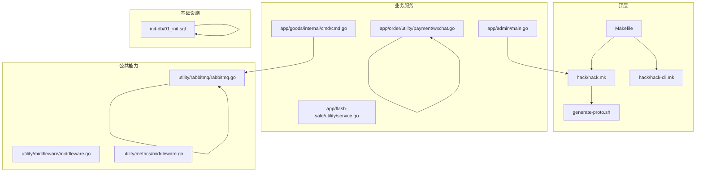
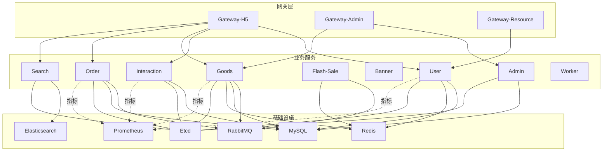
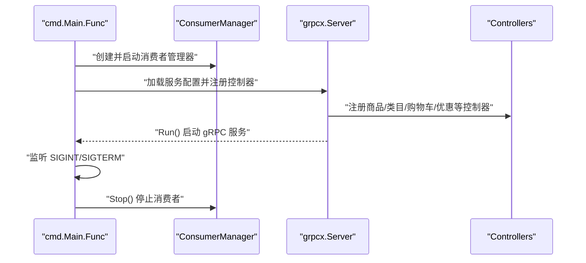
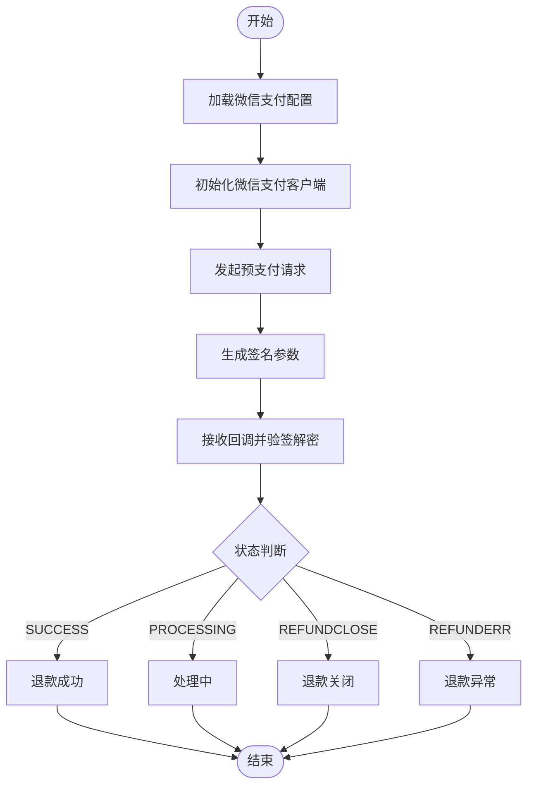
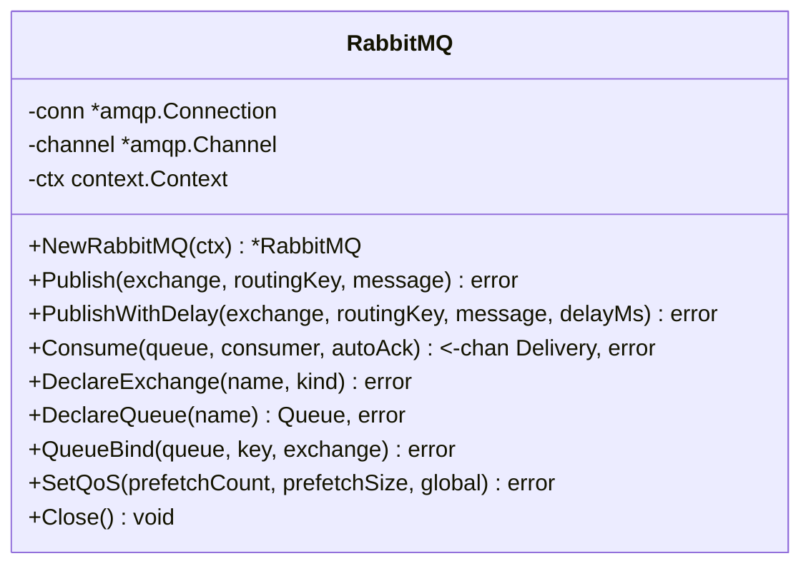
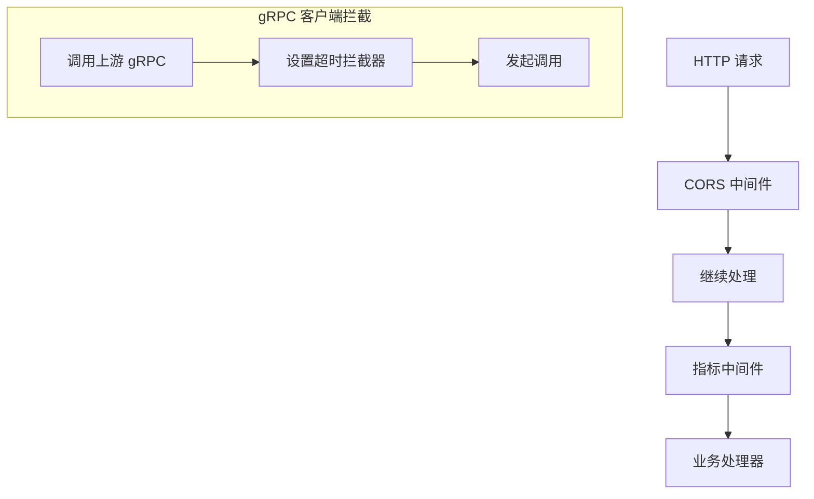
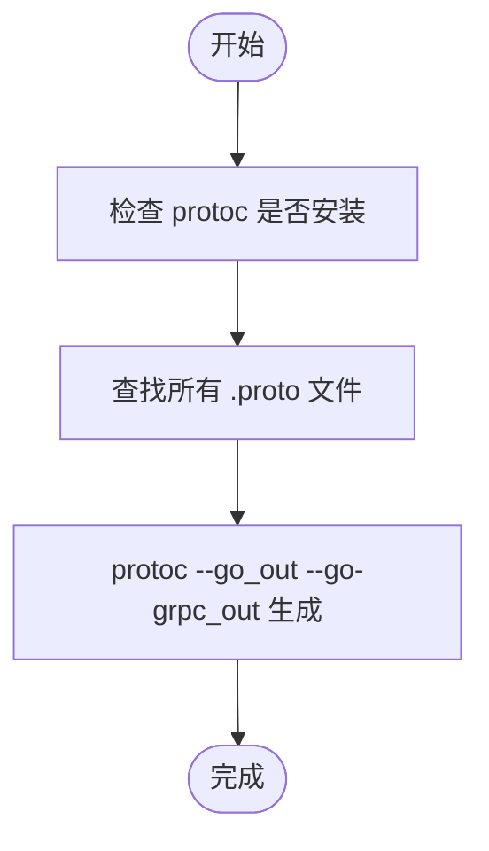
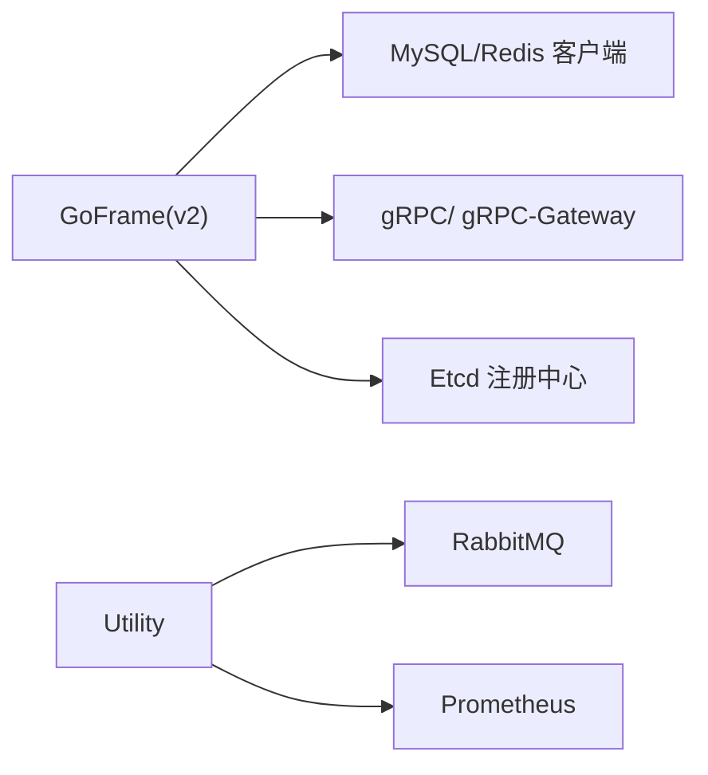

# 开发指南

<cite>
**本文引用的文件**   
- [README.MD](file://README.MD)
- [go.mod](file://go.mod)
- [Makefile](file://Makefile)
- [generate-proto.sh](file://generate-proto.sh)
- [hack/hack.mk](file://hack/hack.mk)
- [hack/hack-cli.mk](file://hack/hack-cli.mk)
- [utility/middleware/middleware.go](file://utility/middleware/middleware.go)
- [utility/metrics/middleware.go](file://utility/metrics/middleware.go)
- [init-db/01_init.sql](file://init-db/01_init.sql)
- [app/admin/main.go](file://app/admin/main.go)
- [app/goods/internal/cmd/cmd.go](file://app/goods/internal/cmd/cmd.go)
- [app/flash-sale/utility/service.go](file://app/flash-sale/utility/service.go)
- [app/order/utility/payment/wxchat.go](file://app/order/utility/payment/wxchat.go)
- [utility/rabbitmq/rabbitmq.go](file://utility/rabbitmq/rabbitmq.go)
</cite>

## 目录
1. [简介](#简介)
2. [项目结构](#项目结构)
3. [核心组件](#核心组件)
4. [架构总览](#架构总览)
5. [详细组件分析](#详细组件分析)
6. [依赖关系分析](#依赖关系分析)
7. [性能考虑](#性能考虑)
8. [故障排查指南](#故障排查指南)
9. [结论](#结论)
10. [附录](#附录)

## 简介
本指南面向参与本 GoFrame 微服务电商项目开发的工程师，覆盖开发环境搭建、代码规范、开发流程、GoFrame 框架使用、项目结构组织与模块开发规范、代码生成工具与 Protobuf 接口定义及自动生成流程、Git 工作流与代码评审规范、调试技巧、单元测试与集成测试方法，以及 IDE 配置与开发工具推荐。项目采用多服务架构，服务通过 gRPC 提供接口，并结合 RabbitMQ 实现异步消息处理；Prometheus 指标中间件用于运行时可观测性。

## 项目结构
项目采用按业务域划分的多模块结构，每个业务域（如 admin、goods、order、user、gateway-* 等）独立为一个子目录，内部遵循 internal/cmd、internal/controller、internal/dao、internal/model、internal/logic、internal/service 等层次化组织。公共能力集中在 utility 与 doc 目录，配置与部署通过 manifest/docker/compose 文件管理。

- 顶层入口与构建
  - 顶层 Makefile 引用 hack/hack-cli.mk，统一提供 CLI 安装、构建、打包、Docker 构建与部署等命令。
  - hack/hack.mk 提供 gf CLI 的生成器任务：ctrl、dao、enums、service、pb、pbentity 等，便于一键生成控制器、DAO、实体、服务与 Protobuf 文件。
  - generate-proto.sh 提供手动批量生成 Protobuf 的脚本，确保本地与 CI 环境一致。

- 服务示例
  - app/admin/main.go 展示了基于 etcd 服务注册与 gRPC 服务启动的典型入口。
  - app/goods/internal/cmd/cmd.go 展示了 gRPC 服务聚合注册与 RabbitMQ 消费者管理器的启动流程。

- 公共中间件与工具
  - utility/middleware/middleware.go 提供 CORS 与 gRPC 超时拦截器。
  - utility/metrics/middleware.go 提供 HTTP 请求与错误指标中间件。
  - utility/rabbitmq/rabbitmq.go 提供带指数退避重试的 AMQP 客户端封装。

- 初始化数据库
  - init-db/01_init.sql 包含各业务库与核心表的初始化脚本，涵盖 goods、user、interaction、order、resource、banner、admin 等库。

**图表来源**
- [Makefile](file://Makefile#L1-L1)
- [hack/hack.mk](file://hack/hack.mk#L1-L77)
- [hack/hack-cli.mk](file://hack/hack-cli.mk#L1-L20)
- [generate-proto.sh](file://generate-proto.sh#L1-L18)
- [app/admin/main.go](file://app/admin/main.go#L1-L25)
- [app/goods/internal/cmd/cmd.go](file://app/goods/internal/cmd/cmd.go#L1-L104)
- [app/flash-sale/utility/service.go](file://app/flash-sale/utility/service.go#L1-L37)
- [app/order/utility/payment/wxchat.go](file://app/order/utility/payment/wxchat.go#L1-L328)
- [utility/middleware/middleware.go](file://utility/middleware/middleware.go#L1-L35)
- [utility/metrics/middleware.go](file://utility/metrics/middleware.go#L1-L62)
- [utility/rabbitmq/rabbitmq.go](file://utility/rabbitmq/rabbitmq.go#L1-L196)
- [init-db/01_init.sql](file://init-db/01_init.sql#L1-L1815)

**章节来源**
- [README.MD](file://README.MD#L1-L41)
- [Makefile](file://Makefile#L1-L1)
- [hack/hack.mk](file://hack/hack.mk#L1-L77)
- [hack/hack-cli.mk](file://hack/hack-cli.mk#L1-L20)
- [generate-proto.sh](file://generate-proto.sh#L1-L18)
- [app/admin/main.go](file://app/admin/main.go#L1-L25)
- [app/goods/internal/cmd/cmd.go](file://app/goods/internal/cmd/cmd.go#L1-L104)
- [utility/middleware/middleware.go](file://utility/middleware/middleware.go#L1-L35)
- [utility/metrics/middleware.go](file://utility/metrics/middleware.go#L1-L62)
- [utility/rabbitmq/rabbitmq.go](file://utility/rabbitmq/rabbitmq.go#L1-L196)
- [init-db/01_init.sql](file://init-db/01_init.sql#L1-L1815)

## 核心组件
- 代码生成与 Protobuf
  - 使用 gf CLI 的生成器任务生成控制器、DAO、实体、服务与 Protobuf 文件，提升开发效率与一致性。
  - generate-proto.sh 提供手动生成脚本，遍历工程内所有 .proto 文件并生成 Go 与 gRPC 代码。

- 中间件与可观测性
  - CORS 与 gRPC 超时中间件保障跨域与调用稳定性。
  - Prometheus 指标中间件采集请求耗时与错误指标，便于监控告警。

- 消息队列与异步处理
  - RabbitMQ 客户端封装支持持久化、延迟消息与指数退避重试，保证消息可靠投递与消费。

- 支付与退款
  - 微信支付与退款封装，支持验签、解密、回调处理与幂等校验。

**章节来源**
- [hack/hack.mk](file://hack/hack.mk#L13-L77)
- [generate-proto.sh](file://generate-proto.sh#L1-L18)
- [utility/middleware/middleware.go](file://utility/middleware/middleware.go#L10-L34)
- [utility/metrics/middleware.go](file://utility/metrics/middleware.go#L9-L61)
- [utility/rabbitmq/rabbitmq.go](file://utility/rabbitmq/rabbitmq.go#L19-L54)
- [app/order/utility/payment/wxchat.go](file://app/order/utility/payment/wxchat.go#L64-L81)

## 架构总览
系统由多个业务服务组成，通过 gRPC 提供接口，部分服务通过 RabbitMQ 实现事件驱动的异步处理。服务发现采用 etcd，Prometheus 指标中间件提供运行时观测。

**图表来源**
- [README.MD](file://README.MD#L1-L41)
- [app/admin/main.go](file://app/admin/main.go#L13-L24)
- [app/goods/internal/cmd/cmd.go](file://app/goods/internal/cmd/cmd.go#L59-L76)
- [utility/rabbitmq/rabbitmq.go](file://utility/rabbitmq/rabbitmq.go#L139-L196)
- [utility/metrics/middleware.go](file://utility/metrics/middleware.go#L9-L61)

## 详细组件分析

### 组件A：gRPC 服务启动与消费者管理
- 功能概述
  - goods 服务通过 gRPC 暴露多个业务接口，同时启动 RabbitMQ 消费者管理器，订阅并处理订单、优惠券、用户注册等事件。
  - 优雅关闭：监听系统信号，确保消费者在服务退出前正确停止。

**图表来源**
- [app/goods/internal/cmd/cmd.go](file://app/goods/internal/cmd/cmd.go#L27-L79)
- [utility/rabbitmq/rabbitmq.go](file://utility/rabbitmq/rabbitmq.go#L139-L196)

**章节来源**
- [app/goods/internal/cmd/cmd.go](file://app/goods/internal/cmd/cmd.go#L27-L104)
- [utility/rabbitmq/rabbitmq.go](file://utility/rabbitmq/rabbitmq.go#L1-L196)

### 组件B：微信支付与退款（幂等与验签）
- 功能概述
  - 初始化微信支付客户端，支持 JSAPI 预支付、签名与回调验签。
  - 退款流程支持回调验签与状态处理，结合幂等校验函数避免重复处理。

**图表来源**
- [app/order/utility/payment/wxchat.go](file://app/order/utility/payment/wxchat.go#L50-L81)
- [app/order/utility/payment/wxchat.go](file://app/order/utility/payment/wxchat.go#L84-L132)
- [app/order/utility/payment/wxchat.go](file://app/order/utility/payment/wxchat.go#L134-L171)
- [app/order/utility/payment/wxchat.go](file://app/order/utility/payment/wxchat.go#L184-L246)
- [app/order/utility/payment/wxchat.go](file://app/order/utility/payment/wxchat.go#L262-L313)

**章节来源**
- [app/order/utility/payment/wxchat.go](file://app/order/utility/payment/wxchat.go#L1-L328)

### 组件C：RabbitMQ 客户端与延迟消息
- 功能概述
  - 提供带指数退避重试的连接创建、交换机/队列声明、绑定、发布与消费。
  - 支持延迟消息（毫秒级），持久化消息，QoS 控制。

**图表来源**
- [utility/rabbitmq/rabbitmq.go](file://utility/rabbitmq/rabbitmq.go#L13-L196)

**章节来源**
- [utility/rabbitmq/rabbitmq.go](file://utility/rabbitmq/rabbitmq.go#L1-L196)

### 组件D：HTTP 中间件与 gRPC 拦截器
- 功能概述
  - CORS 中间件允许跨域请求并通过 OPTIONS 预检。
  - gRPC 客户端拦截器设置统一超时，避免下游调用阻塞。

**图表来源**
- [utility/middleware/middleware.go](file://utility/middleware/middleware.go#L10-L34)
- [utility/metrics/middleware.go](file://utility/metrics/middleware.go#L9-L61)

**章节来源**
- [utility/middleware/middleware.go](file://utility/middleware/middleware.go#L1-L35)
- [utility/metrics/middleware.go](file://utility/metrics/middleware.go#L1-L62)

### 组件E：代码生成与 Protobuf 流程
- 功能概述
  - hack/hack.mk 提供 gf gen ctrl/dao/enums/service/pb/pbentity 任务。
  - generate-proto.sh 遍历工程内 .proto 文件并生成 Go 与 gRPC 代码。

**图表来源**
- [generate-proto.sh](file://generate-proto.sh#L6-L16)
- [hack/hack.mk](file://hack/hack.mk#L69-L77)

**章节来源**
- [generate-proto.sh](file://generate-proto.sh#L1-L18)
- [hack/hack.mk](file://hack/hack.mk#L1-L77)

## 依赖关系分析
- 语言与框架
  - Go 版本与依赖通过 go.mod 管理，包含 gRPC、gRPC 生态、MySQL/Redis 客户端、Prometheus 客户端、RabbitMQ 客户端、微信支付 SDK、Elasticsearch 客户端等。

- 服务发现与注册
  - 通过 etcd 作为服务注册中心，admin 服务入口展示了如何注册 etcd Resolver。

**图表来源**
- [go.mod](file://go.mod#L1-L107)
- [app/admin/main.go](file://app/admin/main.go#L13-L24)

**章节来源**
- [go.mod](file://go.mod#L1-L107)
- [app/admin/main.go](file://app/admin/main.go#L1-L25)

## 性能考虑
- 指标采集
  - 在 HTTP 中间件中记录请求耗时与状态，避免高基数路径导致指标膨胀，建议使用路由模板而非具体路径。
- 消息可靠性
  - RabbitMQ 消息持久化、延迟队列与指数退避重试，降低网络抖动与下游压力峰值影响。
- gRPC 超时控制
  - 客户端统一超时拦截，防止下游慢调用拖垮上游。
- 缓存与限流
  - 结合 Redis 与限流策略（如令牌桶/漏桶）控制突发流量，避免数据库与下游雪崩。

[本节为通用指导，无需特定文件引用]

## 故障排查指南
- 启动失败（etcd 解析器）
  - 确认 etcd 地址配置正确，服务已注册并可解析。
  - 参考 admin 服务入口的 etcd Resolver 注册流程。

- gRPC 调用超时
  - 检查客户端拦截器超时设置与服务端处理耗时，必要时调整超时阈值或优化服务逻辑。

- RabbitMQ 连接失败
  - 指数退避重试会自动重试，若长时间失败，检查凭证、vhost 与网络连通性。

- 微信支付/退款回调验签失败
  - 确认平台证书下载器可用、APIv3 Key 正确、回调头与体格式符合要求；测试模式下可使用 X-Bypass-Verify 头跳过验签。

**章节来源**
- [app/admin/main.go](file://app/admin/main.go#L13-L24)
- [utility/middleware/middleware.go](file://utility/middleware/middleware.go#L25-L34)
- [utility/rabbitmq/rabbitmq.go](file://utility/rabbitmq/rabbitmq.go#L19-L54)
- [app/order/utility/payment/wxchat.go](file://app/order/utility/payment/wxchat.go#L134-L171)
- [app/order/utility/payment/wxchat.go](file://app/order/utility/payment/wxchat.go#L262-L313)

## 结论
本指南围绕 GoFrame 微服务项目提供了从环境搭建、代码规范、开发流程到可观测性与消息处理的完整实践路径。通过 gf CLI 与 Protobuf 自动生成、中间件与指标采集、RabbitMQ 可靠投递与 gRPC 超时控制，以及微信支付/退款的幂等与验签机制，能够有效支撑高并发与复杂业务场景下的稳定交付。

[本节为总结性内容，无需特定文件引用]

## 附录

### A. 开发环境搭建步骤
- 安装 Go（版本见 go.mod）
- 安装 protoc（用于 Protobuf 生成）
- 安装 etcd、RabbitMQ、MySQL、Redis、Elasticsearch 等依赖服务
- 初始化数据库：执行 init-db/01_init.sql
- 安装并使用 gf CLI（Makefile 已内置安装与升级任务）

**章节来源**
- [go.mod](file://go.mod#L3-L3)
- [generate-proto.sh](file://generate-proto.sh#L6-L10)
- [init-db/01_init.sql](file://init-db/01_init.sql#L1-L14)
- [Makefile](file://Makefile#L1-L1)
- [hack/hack-cli.mk](file://hack/hack-cli.mk#L2-L20)

### B. 代码规范与开发流程
- 目录结构
  - 每个服务内部按 internal/cmd、internal/controller、internal/dao、internal/model、internal/logic、internal/service 分层组织。
- 生成器使用
  - 使用 make ctrl/dao/enums/service/pb/pbentity 快速生成代码骨架。
- Protobuf
  - 在 app/*/manifest/protobuf 下维护 .proto 文件，使用 make pb 或 generate-proto.sh 生成 Go 与 gRPC 代码。

**章节来源**
- [hack/hack.mk](file://hack/hack.mk#L13-L77)
- [generate-proto.sh](file://generate-proto.sh#L12-L16)

### C. Git 工作流与代码评审
- 分支策略
  - 主分支保护，特性分支开发，hotfix 分支修复线上问题。
- 提交规范
  - 类似 feat/fix/docs/chore 等类型前缀 + 冒号 + 简洁描述，必要时补充 Jira/Issue 编号。
- 代码评审
  - PR 至目标分支，至少一名 reviewer 通过，CI 通过后方可合并。

[本节为通用流程建议，无需特定文件引用]

### D. 调试技巧
- 使用指标中间件定位慢接口与错误率异常。
- gRPC 调用增加超时拦截器，快速暴露下游瓶颈。
- RabbitMQ 消费端开启 QoS，避免一次性拉取过多消息导致内存压力。

**章节来源**
- [utility/metrics/middleware.go](file://utility/metrics/middleware.go#L9-L61)
- [utility/middleware/middleware.go](file://utility/middleware/middleware.go#L25-L34)
- [utility/rabbitmq/rabbitmq.go](file://utility/rabbitmq/rabbitmq.go#L192-L196)

### E. 单元测试与集成测试
- 单测
  - 在各模块内部编写单元测试，覆盖关键逻辑与边界条件。
- 集成测试
  - 通过 docker-compose 启动依赖服务，对服务间调用进行端到端验证。
- 压测
  - 可参考 doc 目录中的压测方案与监控实践，制定阶段性压测计划。

[本节为通用指导，无需特定文件引用]

### F. IDE 配置与开发工具推荐
- IDE
  - VS Code 或 GoLand，启用 Go vet、gofmt、gci、goimports 等格式化与静态检查。
- 插件
  - Go、C/C++、Protobuf、YAML、Docker、Kubernetes 等插件。
- 工具
  - 使用 Makefile 提供的一键安装与构建命令，配合 gf CLI 提升开发效率。

[本节为通用建议，无需特定文件引用]