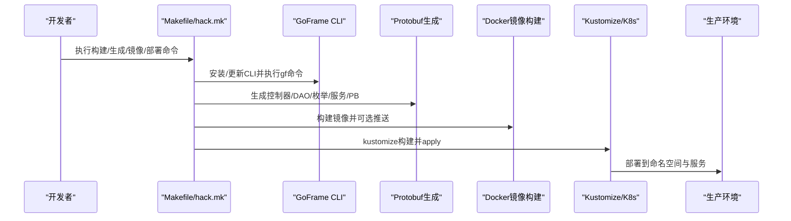
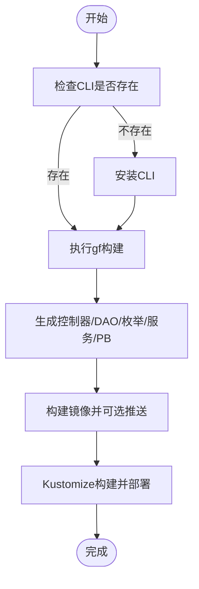
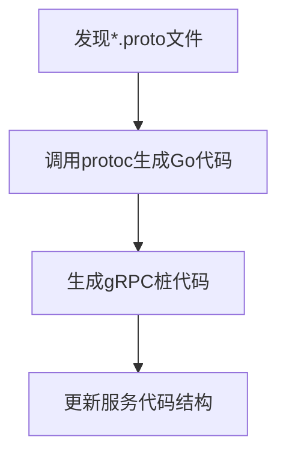
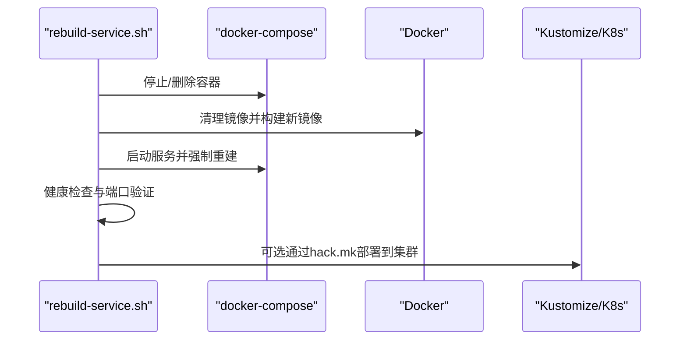
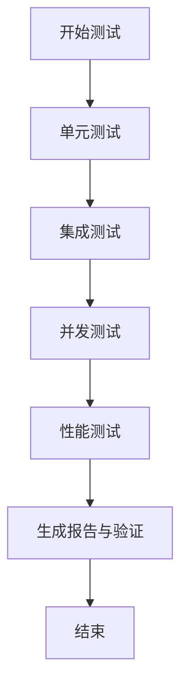
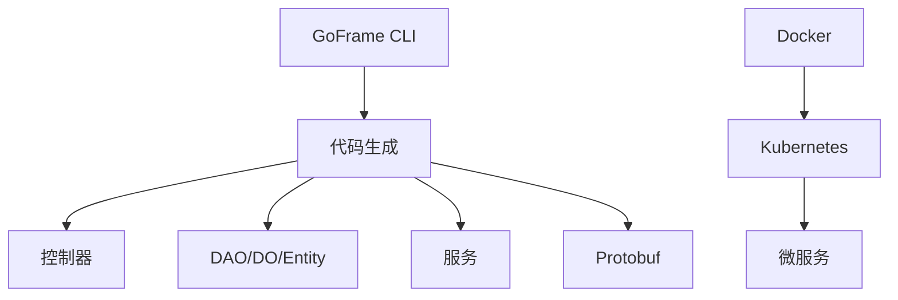

# 开发流程规范

<cite>
**本文引用的文件**
- [Makefile](file://Makefile)
- [README.MD](file://README.MD)
- [hack/hack.mk](file://hack/hack.mk)
- [hack/hack-cli.mk](file://hack/hack-cli.mk)
- [app/admin/Makefile](file://app/admin/Makefile)
- [app/admin/manifest/docker/Dockerfile](file://app/admin/manifest/docker/Dockerfile)
- [app/admin/manifest/docker/docker.sh](file://app/admin/manifest/docker/docker.sh)
- [generate-proto.sh](file://generate-proto.sh)
- [rebuild-all-servers.sh](file://rebuild-all-servers.sh)
- [rebuild-service.sh](file://rebuild-service.sh)
- [app/flash-sale/DEVELOPMENT_GUIDE.md](file://app/flash-sale/DEVELOPMENT_GUIDE.md)
- [app/flash-sale/DEPLOYMENT_TESTING_GUIDE.md](file://app/flash-sale/DEPLOYMENT_TESTING_GUIDE.md)
- [app/flash-sale/test/TEST_DOCUMENTATION.md](file://app/flash-sale/test/TEST_DOCUMENTATION.md)
</cite>

## 目录
1. [简介](#简介)
2. [项目结构](#项目结构)
3. [核心组件](#核心组件)
4. [架构概览](#架构概览)
5. [详细组件分析](#详细组件分析)
6. [依赖关系分析](#依赖关系分析)
7. [性能考虑](#性能考虑)
8. [故障排查指南](#故障排查指南)
9. [结论](#结论)
10. [附录](#附录)

## 简介
本规范面向GoFrame微服务电商项目，提供从代码编写、构建、测试到部署的全流程标准操作指南。重点涵盖：
- Makefile常用命令与构建规则
- Git工作流与分支管理策略
- 代码提交规范与commit message格式
- 本地开发调试技巧与常见问题解决方案
- 基于脚本的自动化构建与部署流程

## 项目结构
项目采用多服务微架构，每个服务独立包含内部结构、API、DAO、逻辑层、模型、打包与部署清单。根目录提供统一的构建与脚本入口，服务侧提供独立的Makefile与Dockerfile以支撑本地与CI/CD构建。

```mermaid
graph TB
Root["根目录<br/>Makefile / hack.mk / hack-cli.mk"] --> Admin["app/admin<br/>服务入口与部署清单"]
Root --> Goods["app/goods<br/>服务入口与部署清单"]
Root --> Order["app/order<br/>服务入口与部署清单"]
Root --> User["app/user<br/>服务入口与部署清单"]
Root --> Interaction["app/interaction<br/>服务入口与部署清单"]
Root --> Banner["app/banner<br/>服务入口与部署清单"]
Root --> Search["app/search<br/>服务入口与部署清单"]
Root --> FlashSale["app/flash-sale<br/>服务入口与部署清单"]
Root --> GatewayH5["app/gateway-h5<br/>服务入口与部署清单"]
Root --> GatewayAdmin["app/gateway-admin<br/>服务入口与部署清单"]
Root --> GatewayResource["app/gateway-resource<br/>服务入口与部署清单"]
Root --> Worker["app/worker<br/>服务入口与部署清单"]
Root --> Utility["utility<br/>通用工具与中间件"]
Root --> InitDB["init-db<br/>数据库初始化脚本"]
Root --> Doc["doc<br/>运维与技术文档"]
```

**图表来源**
- [README.MD](file://README.MD#L1-L41)
- [Makefile](file://Makefile#L1-L1)

**章节来源**
- [README.MD](file://README.MD#L1-L41)
- [Makefile](file://Makefile#L1-L1)

## 核心组件
- 构建与脚手架工具
  - GoFrame CLI自动安装与版本更新
  - 一键生成控制器、DAO、枚举、服务与Protobuf文件
  - Docker镜像构建与推送
  - Kustomize部署到Kubernetes
- 服务侧Makefile
  - 统一的命名空间、部署名与镜像名配置
  - 包含公共hack.mk与hack-cli.mk
- Protobuf与代码生成
  - 一键遍历并生成Go与gRPC代码
- 自动化部署与回滚
  - 一键重建所有服务与单个服务
  - 健康检查与端口监听验证

**章节来源**
- [hack/hack.mk](file://hack/hack.mk#L1-L77)
- [hack/hack-cli.mk](file://hack/hack-cli.mk#L1-L20)
- [app/admin/Makefile](file://app/admin/Makefile#L1-L7)
- [generate-proto.sh](file://generate-proto.sh#L1-L18)
- [rebuild-all-servers.sh](file://rebuild-all-servers.sh#L1-L129)
- [rebuild-service.sh](file://rebuild-service.sh#L1-L543)

## 架构概览
下图展示了从开发者本地到Kubernetes集群的整体流程：本地通过Makefile与脚本完成构建与打包，镜像推送到仓库后由Kustomize部署至集群。

**图表来源**
- [hack/hack.mk](file://hack/hack.mk#L3-L77)
- [hack/hack-cli.mk](file://hack/hack-cli.mk#L1-L20)
- [generate-proto.sh](file://generate-proto.sh#L1-L18)

## 详细组件分析

### Makefile与构建规则
- 默认目标与依赖
  - 默认目标为构建，依赖CLI安装
  - 通过include引入公共hack.mk与hack-cli.mk
- 常用命令
  - up：更新GoFrame CLI与框架
  - build：使用gf构建二进制
  - ctrl/dao/enums/service/pb/pbentity：代码生成
  - image/image.push：镜像构建与推送
  - deploy：Kustomize构建并部署到当前kubectl环境
- 服务侧Makefile
  - 设置命名空间、部署名与镜像名
  - 包含admin服务的hack.mk与hack-cli.mk

**图表来源**
- [hack/hack-cli.mk](file://hack/hack-cli.mk#L1-L20)
- [hack/hack.mk](file://hack/hack.mk#L1-L77)
- [app/admin/Makefile](file://app/admin/Makefile#L1-L7)

**章节来源**
- [hack/hack.mk](file://hack/hack.mk#L1-L77)
- [hack/hack-cli.mk](file://hack/hack-cli.mk#L1-L20)
- [app/admin/Makefile](file://app/admin/Makefile#L1-L7)

### Protobuf与代码生成
- 一键生成
  - 遍历项目中所有.proto文件，生成Go与gRPC代码
  - 依赖protoc安装
- 服务内集成
  - 服务侧Makefile可通过pb/pbentity命令生成对应代码

**图表来源**
- [generate-proto.sh](file://generate-proto.sh#L1-L18)
- [hack/hack.mk](file://hack/hack.mk#L69-L77)

**章节来源**
- [generate-proto.sh](file://generate-proto.sh#L1-L18)
- [hack/hack.mk](file://hack/hack.mk#L69-L77)

### Docker与Kubernetes部署
- Dockerfile
  - 基于精简镜像，复制二进制并设置入口命令
- 部署脚本
  - rebuild-all-servers.sh：一键停止、清理、重建并启动所有服务，输出日志与健康状态
  - rebuild-service.sh：支持单个或全部服务的停止、清理、构建、启动与健康检查
- Kustomize部署
  - hack.mk中的deploy目标使用kustomize构建并apply至当前环境，支持滚动更新标签

**图表来源**
- [rebuild-service.sh](file://rebuild-service.sh#L1-L543)
- [app/admin/manifest/docker/Dockerfile](file://app/admin/manifest/docker/Dockerfile#L1-L17)
- [hack/hack.mk](file://hack/hack.mk#L52-L67)

**章节来源**
- [rebuild-service.sh](file://rebuild-service.sh#L1-L543)
- [rebuild-all-servers.sh](file://rebuild-all-servers.sh#L1-L129)
- [app/admin/manifest/docker/Dockerfile](file://app/admin/manifest/docker/Dockerfile#L1-L17)
- [hack/hack.mk](file://hack/hack.mk#L52-L67)

### 测试与性能验证
- 开发与测试指南
  - 提供秒杀系统开发、部署与测试的完整流程
  - 包含功能测试、性能测试、并发测试与监控验证
- 测试文档
  - 定义单元测试、集成测试、并发测试、性能测试的用例与执行方法
  - 提供覆盖率生成与CI集成示例

**图表来源**
- [app/flash-sale/DEVELOPMENT_GUIDE.md](file://app/flash-sale/DEVELOPMENT_GUIDE.md#L1-L546)
- [app/flash-sale/DEPLOYMENT_TESTING_GUIDE.md](file://app/flash-sale/DEPLOYMENT_TESTING_GUIDE.md#L1-L437)
- [app/flash-sale/test/TEST_DOCUMENTATION.md](file://app/flash-sale/test/TEST_DOCUMENTATION.md#L1-L293)

**章节来源**
- [app/flash-sale/DEVELOPMENT_GUIDE.md](file://app/flash-sale/DEVELOPMENT_GUIDE.md#L1-L546)
- [app/flash-sale/DEPLOYMENT_TESTING_GUIDE.md](file://app/flash-sale/DEPLOYMENT_TESTING_GUIDE.md#L1-L437)
- [app/flash-sale/test/TEST_DOCUMENTATION.md](file://app/flash-sale/test/TEST_DOCUMENTATION.md#L1-L293)

## 依赖关系分析
- 组件耦合
  - 服务间通过网关与API交互，内部通过DAO与逻辑层解耦
  - 通用工具与中间件在utility中集中维护
- 外部依赖
  - GoFrame CLI用于代码生成与构建
  - Docker与Kustomize用于容器化与编排
  - Protobuf用于跨语言通信

**图表来源**
- [hack/hack.mk](file://hack/hack.mk#L3-L77)
- [generate-proto.sh](file://generate-proto.sh#L1-L18)

**章节来源**
- [hack/hack.mk](file://hack/hack.mk#L1-L77)
- [generate-proto.sh](file://generate-proto.sh#L1-L18)

## 性能考虑
- 缓存与限流
  - 使用Redis与令牌桶/计数器实现多级限流
  - 通过Lua脚本保证库存扣减的原子性
- 异步处理
  - 基于RabbitMQ的消息队列削峰填谷
- 监控与可观测性
  - pprof性能分析与日志轮转
  - Prometheus/Grafana指标与告警规则

[本节为通用指导，不直接分析具体文件]

## 故障排查指南
- 服务启动失败
  - 检查端口占用、配置文件与依赖服务状态
- 数据库连接失败
  - 校验MySQL服务、用户权限与网络连通
- Redis连接失败
  - 检查bind/port配置与内存使用
- 性能问题诊断
  - 使用pprof分析CPU与内存热点，检查慢查询与慢日志
- 业务问题定位
  - 核对库存与订单一致性，验证限流与防刷日志

**章节来源**
- [app/flash-sale/DEPLOYMENT_TESTING_GUIDE.md](file://app/flash-sale/DEPLOYMENT_TESTING_GUIDE.md#L256-L437)

## 结论
本规范以Makefile与脚本为核心，结合GoFrame CLI与Kustomize，形成从本地开发到生产部署的一体化流程。通过标准化的构建、测试与部署步骤，提升团队协作效率与系统稳定性。

[本节为总结性内容，不直接分析具体文件]

## 附录

### Git工作流与分支管理策略
- 分支策略
  - feature分支：从develop切出，完成后合并回develop并删除
  - develop分支：集成日常开发，定期合并至main
  - main分支：发布分支，打标签并部署
- 合并请求（MR）
  - 提交前确保通过本地测试与代码质量检查
  - MR需至少一名Reviewer批准，合并后自动触发CI流水线
- 代码审查要求
  - 代码风格统一，注释清晰
  - 关键逻辑提供测试用例，复杂变更附带设计文档

[本节为通用流程说明，不直接分析具体文件]

### 代码提交规范与commit message格式
- 规范
  - 使用动宾短语，首字母小写，结尾不加句号
  - 限制每行不超过100字符，正文简洁明确
- 示例格式
  - feat: 新增用户登录接口
  - fix: 修复库存扣减并发问题
  - docs: 更新部署指南
  - refactor: 重构订单服务逻辑
  - perf: 优化Redis缓存命中率

[本节为通用规范说明，不直接分析具体文件]

### 本地开发调试技巧
- 使用pprof定位性能瓶颈
- 启用详细日志并结合Grafana仪表盘观察指标
- 使用curl或Postman验证API接口
- 通过Docker Compose快速搭建本地联调环境

[本节为通用技巧说明，不直接分析具体文件]