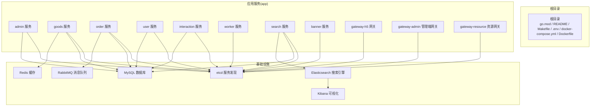
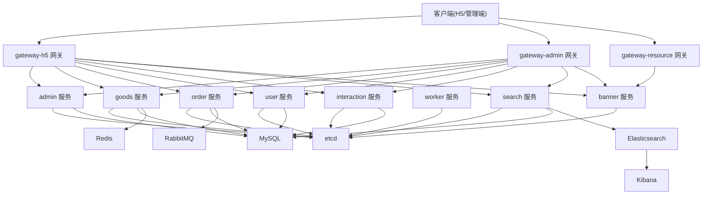
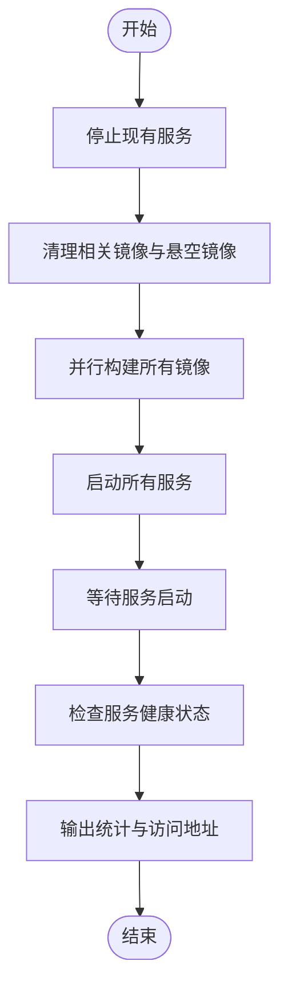
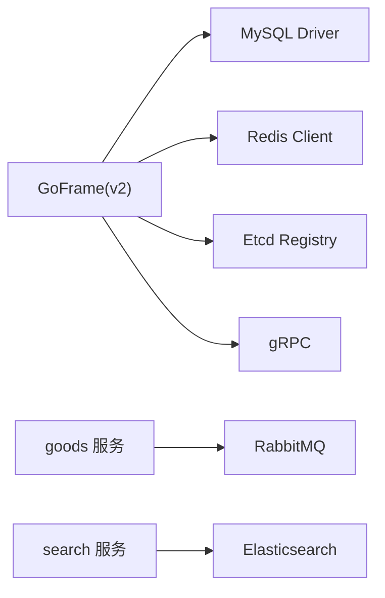

# 开发环境搭建

<cite>
**本文档引用的文件**
- [go.mod](file://go.mod)
- [README.MD](file://README.MD)
- [Makefile](file://Makefile)
- [.env](file://.env)
- [docker-compose.yml](file://docker-compose.yml)
- [Dockerfile](file://Dockerfile)
- [hack-cli.mk](file://hack/hack-cli.mk)
- [config.prod.yaml（admin）](file://app/admin/manifest/config/config.prod.yaml)
- [config.prod.yaml（goods）](file://app/goods/manifest/config/config.prod.yaml)
- [config.prod.yaml（gateway-h5）](file://app/gateway-h5/manifest/config/config.prod.yaml)
- [config.prod.yaml（user）](file://app/user/manifest/config/config.prod.yaml)
- [01_init.sql](file://init-db/01_init.sql)
- [generate-proto.sh](file://generate-proto.sh)
- [rebuild-all-servers.sh](file://rebuild-all-servers.sh)
- [DEVELOPMENT_GUIDE.md（flash-sale）](file://app/flash-sale/DEVELOPMENT_GUIDE.md)
</cite>

## 目录
1. [简介](#简介)
2. [项目结构](#项目结构)
3. [核心组件](#核心组件)
4. [架构概览](#架构概览)
5. [详细组件分析](#详细组件分析)
6. [依赖分析](#依赖分析)
7. [性能考虑](#性能考虑)
8. [故障排除指南](#故障排除指南)
9. [结论](#结论)
10. [附录](#附录)

## 简介
本指南面向使用 GoFrame 微服务架构的开发者，帮助您快速搭建本地开发环境，涵盖以下内容：
- Go 语言版本要求与开发工具安装
- 项目依赖安装与配置（GoFrame、MySQL、Redis、RabbitMQ、Etcd、Elasticsearch）
- Docker 环境配置与容器编排
- 环境变量与数据库初始化
- 本地开发服务器启动步骤
- 常见问题排查与解决方案

## 项目结构
该项目采用多服务微架构，每个服务独立运行并通过 etcd 进行服务发现与注册。整体结构如下：
- 根目录包含 go.mod、README、Makefile、.env、docker-compose.yml、Dockerfile 等基础设施文件
- app 目录下包含各微服务与网关，每个服务均带有 manifest/config 中的生产配置
- init-db 目录包含数据库初始化 SQL
- doc 目录包含运维与集成文档

**图表来源**
- [docker-compose.yml](file://docker-compose.yml#L1-L355)
- [config.prod.yaml（admin）](file://app/admin/manifest/config/config.prod.yaml#L1-L22)
- [config.prod.yaml（goods）](file://app/goods/manifest/config/config.prod.yaml#L1-L60)
- [config.prod.yaml（gateway-h5）](file://app/gateway-h5/manifest/config/config.prod.yaml#L1-L18)
- [config.prod.yaml（user）](file://app/user/manifest/config/config.prod.yaml#L1-L42)

**章节来源**
- [README.MD](file://README.MD#L1-L41)
- [docker-compose.yml](file://docker-compose.yml#L1-L355)

## 核心组件
- GoFrame 框架：项目统一使用 GoFrame v2，提供 RPC、ORM、缓存、注册中心、监控等能力
- 服务发现：Etcd 作为服务注册与发现中心
- 数据存储：MySQL 提供关系型数据存储；Redis 提供缓存与会话存储；Elasticsearch 提供全文检索
- 消息队列：RabbitMQ 用于异步解耦与削峰填谷
- 网关：多个网关服务负责路由与聚合调用

**章节来源**
- [go.mod](file://go.mod#L1-L107)
- [config.prod.yaml（goods）](file://app/goods/manifest/config/config.prod.yaml#L1-L60)
- [config.prod.yaml（gateway-h5）](file://app/gateway-h5/manifest/config/config.prod.yaml#L1-L18)

## 架构概览
微服务架构采用“多服务 + 网关 + 基础设施”的分层设计。服务间通过 gRPC/HTTP 网关进行通信，依赖 etcd 进行服务发现；数据层通过 MySQL、Redis、Elasticsearch 等支撑业务。

**图表来源**
- [docker-compose.yml](file://docker-compose.yml#L1-L355)
- [config.prod.yaml（admin）](file://app/admin/manifest/config/config.prod.yaml#L1-L22)
- [config.prod.yaml（goods）](file://app/goods/manifest/config/config.prod.yaml#L1-L60)
- [config.prod.yaml（gateway-h5）](file://app/gateway-h5/manifest/config/config.prod.yaml#L1-L18)
- [config.prod.yaml（user）](file://app/user/manifest/config/config.prod.yaml#L1-L42)

## 详细组件分析

### Go 语言与开发工具
- Go 版本要求：项目使用 Go 1.23.10（go.mod 中声明），建议本地开发环境保持一致
- GoFrame CLI：可通过 Makefile 的 hack-cli.mk 提供一键安装与检查
- Protobuf 工具：generate-proto.sh 脚本用于生成 gRPC/protobuf 代码

**章节来源**
- [go.mod](file://go.mod#L1-L107)
- [hack-cli.mk](file://hack/hack-cli.mk#L1-L20)
- [generate-proto.sh](file://generate-proto.sh#L1-L18)

### 数据库与缓存
- MySQL：提供用户、商品、订单、交互、资源、轮播等业务数据存储
- Redis：用于商品缓存、会话与限流等场景
- 初始化 SQL：init-db/01_init.sql 包含数据库与表结构初始化脚本

**章节来源**
- [docker-compose.yml](file://docker-compose.yml#L4-L24)
- [docker-compose.yml](file://docker-compose.yml#L39-L52)
- [01_init.sql](file://init-db/01_init.sql#L1-L120)

### 消息队列与搜索
- RabbitMQ：提供订单事件、用户事件等异步消息处理
- Elasticsearch + Kibana：提供全文检索与可视化

**章节来源**
- [docker-compose.yml](file://docker-compose.yml#L54-L81)
- [docker-compose.yml](file://docker-compose.yml#L84-L132)
- [config.prod.yaml（goods）](file://app/goods/manifest/config/config.prod.yaml#L33-L59)

### 网关与服务配置
- 网关配置：各网关通过 manifest/config 下的 config.prod.yaml 指定监听地址与 etcd 地址
- 服务配置：各服务通过 config.prod.yaml 指定 gRPC 地址、数据库连接、Redis/RabbitMQ/Elasticsearch 等

**章节来源**
- [config.prod.yaml（gateway-h5）](file://app/gateway-h5/manifest/config/config.prod.yaml#L1-L18)
- [config.prod.yaml（admin）](file://app/admin/manifest/config/config.prod.yaml#L1-L22)
- [config.prod.yaml（goods）](file://app/goods/manifest/config/config.prod.yaml#L1-L60)
- [config.prod.yaml（user）](file://app/user/manifest/config/config.prod.yaml#L1-L42)

### Docker 与容器编排
- Dockerfile：多阶段构建，先在 golang:1.24.5-alpine 构建二进制，再拷贝到 alpine 运行时
- docker-compose.yml：定义 MySQL、Redis、RabbitMQ、etcd、Elasticsearch/Kibana、各服务容器及其依赖与端口映射
- rebuild-all-servers.sh：一键停止、清理镜像、重建并启动所有服务，输出日志与健康检查统计

**图表来源**
- [rebuild-all-servers.sh](file://rebuild-all-servers.sh#L1-L129)

**章节来源**
- [Dockerfile](file://Dockerfile#L1-L49)
- [docker-compose.yml](file://docker-compose.yml#L1-L355)
- [rebuild-all-servers.sh](file://rebuild-all-servers.sh#L1-L129)

## 依赖分析
- GoFrame 生态：使用 gRPC、MySQL、Redis、Etcd、Elasticsearch 等生态组件
- 外部依赖：RabbitMQ、微信支付、七牛云 SDK 等
- 内部模块：各服务内部通过 DAO/Logic/Model 层组织业务逻辑

**图表来源**
- [go.mod](file://go.mod#L1-L107)
- [config.prod.yaml（goods）](file://app/goods/manifest/config/config.prod.yaml#L33-L59)
- [config.prod.yaml（gateway-h5）](file://app/gateway-h5/manifest/config/config.prod.yaml#L1-L18)

**章节来源**
- [go.mod](file://go.mod#L1-L107)

## 性能考虑
- 缓存策略：商品信息、用户信息等热点数据使用 Redis 缓存，降低数据库压力
- 异步处理：订单创建、用户注册等耗时操作通过 RabbitMQ 异步处理，提升响应速度
- 搜索优化：Elasticsearch 提供全文检索，结合 IK 分词器优化中文搜索
- 并发与限流：秒杀场景采用限流与防刷策略，保障系统稳定性

**章节来源**
- [DEVELOPMENT_GUIDE.md（flash-sale）](file://app/flash-sale/DEVELOPMENT_GUIDE.md#L1-L546)

## 故障排除指南
- 服务无法启动
  - 检查 docker-compose.yml 中各服务的 healthcheck 与 depends_on 配置
  - 使用 rebuild-all-servers.sh 脚本一键重建并查看日志
- 数据库连接失败
  - 确认 .env 中 DB_HOST/DB_PORT/DB_USER/DB_PASSWORD 与 docker-compose.yml 一致
  - 确认 init-db/01_init.sql 已正确初始化数据库
- 缓存/消息队列异常
  - 检查 Redis/RabbitMQ 容器状态与端口映射
  - 确认服务配置中的地址与端口与 docker-compose.yml 一致
- 网关无法访问服务
  - 确认 etcd 服务可用，且各服务已注册
  - 检查网关配置中的 etcd 地址与端口

**章节来源**
- [.env](file://.env#L1-L28)
- [docker-compose.yml](file://docker-compose.yml#L1-L355)
- [rebuild-all-servers.sh](file://rebuild-all-servers.sh#L1-L129)

## 结论
通过本指南，您可以基于 Docker 完成 GoFrame 微服务项目的本地环境搭建，理解各组件职责与依赖关系，并掌握一键重建与故障排查的方法。建议在开发过程中遵循统一的配置规范与日志策略，确保系统的可观测性与可维护性。

## 附录

### 环境变量配置
- 数据库：DB_HOST、DB_PORT、DB_USER、DB_PASSWORD
- Redis：REDIS_HOST、REDIS_PORT
- RabbitMQ：RABBITMQ_HOST、RABBITMQ_PORT、RABBITMQ_USER、RABBITMQ_PASS
- etcd：ETCD_HOST、ETCD_PORT
- Elasticsearch：ES_HOST、ES_PORT
- 七牛云：QINIU_ACCESS_KEY、QINIU_SECRET_KEY

**章节来源**
- [.env](file://.env#L1-L28)

### 数据库初始化
- 使用 init-db/01_init.sql 初始化数据库与表结构
- 确保 MySQL 容器启动后执行初始化脚本

**章节来源**
- [01_init.sql](file://init-db/01_init.sql#L1-L120)

### 本地开发服务器启动步骤
- 使用 Docker Compose 启动所有服务
- 通过 rebuild-all-servers.sh 一键停止、清理、重建并启动
- 访问各服务与网关的本地端口进行调试

**章节来源**
- [docker-compose.yml](file://docker-compose.yml#L1-L355)
- [rebuild-all-servers.sh](file://rebuild-all-servers.sh#L1-L129)