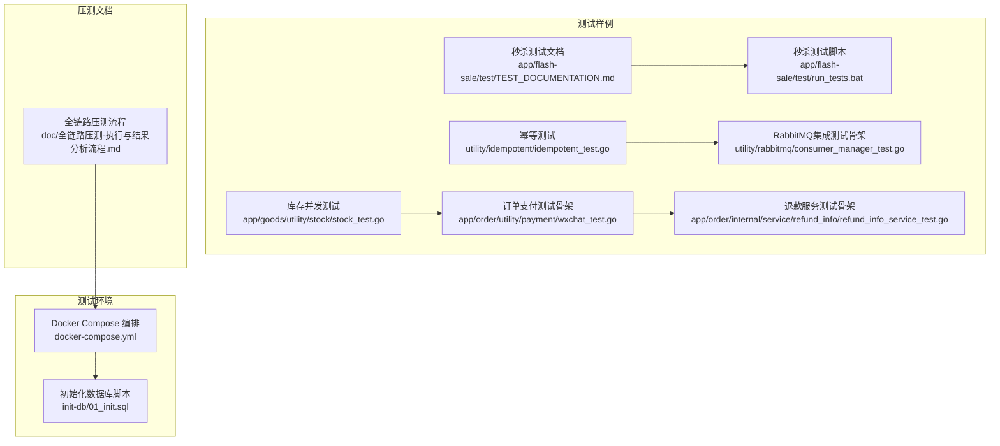
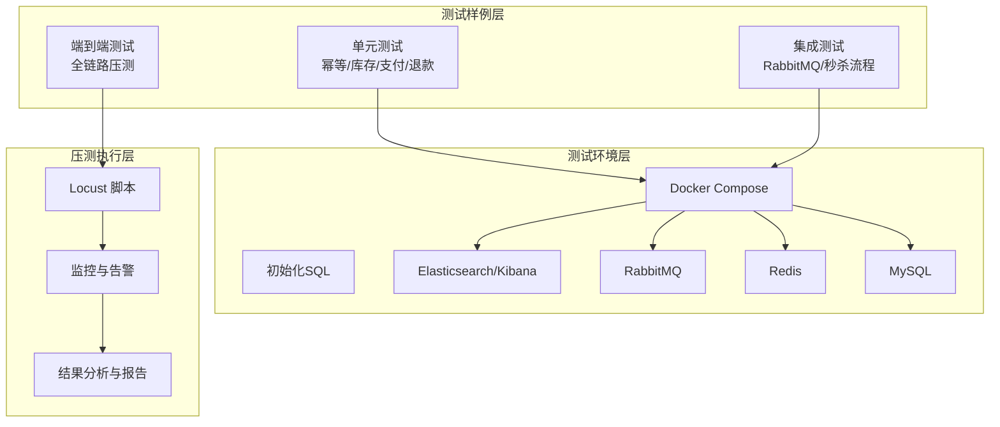
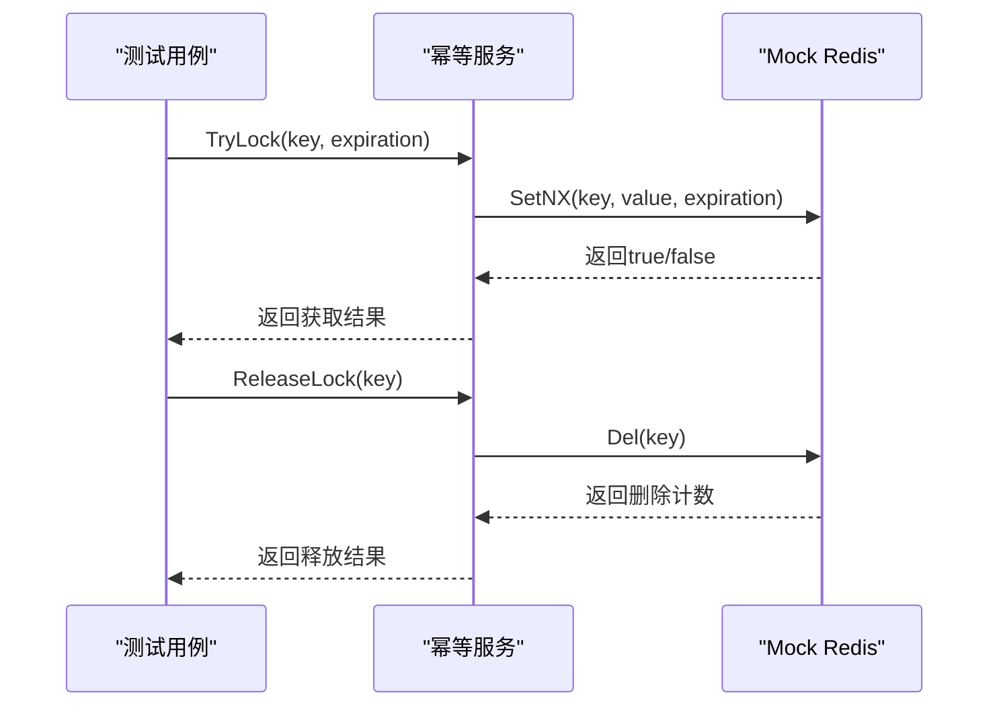
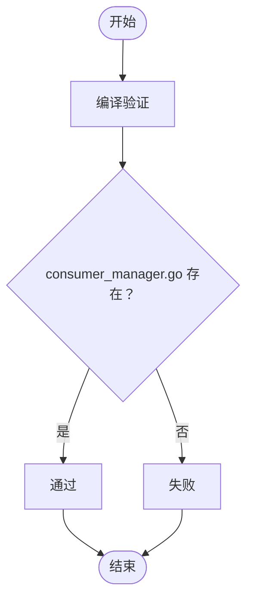
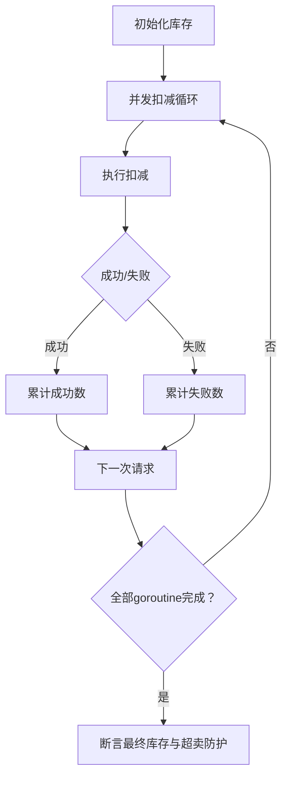
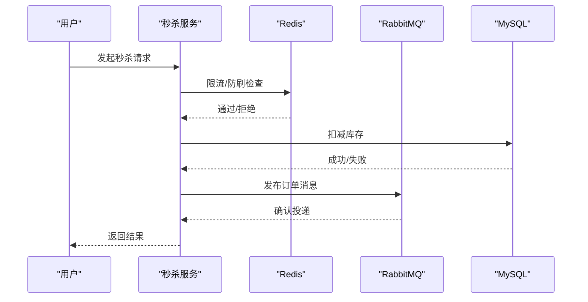
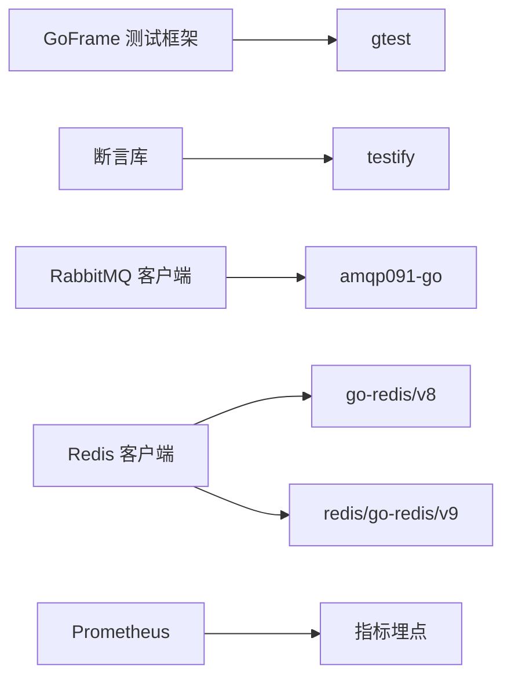

# 测试指南

<cite>
**本文引用的文件**
- [app/flash-sale/test/TEST_DOCUMENTATION.md](file://app/flash-sale/test/TEST_DOCUMENTATION.md)
- [app/flash-sale/test/run_tests.bat](file://app/flash-sale/test/run_tests.bat)
- [utility/idempotent/idempotent_test.go](file://utility/idempotent/idempotent_test.go)
- [utility/rabbitmq/consumer_manager_test.go](file://utility/rabbitmq/consumer_manager_test.go)
- [app/goods/utility/stock/stock_test.go](file://app/goods/utility/stock/stock_test.go)
- [app/order/utility/payment/wxchat_test.go](file://app/order/utility/payment/wxchat_test.go)
- [app/order/internal/service/refund_info/refund_info_service_test.go](file://app/order/internal/service/refund_info/refund_info_service_test.go)
- [doc/全链路压测-执行与结果分析流程.md](file://doc/全链路压测-执行与结果分析流程.md)
- [docker-compose.yml](file://docker-compose.yml)
- [init-db/01_init.sql](file://init-db/01_init.sql)
- [go.mod](file://go.mod)
</cite>

## 目录
1. [引言](#引言)
2. [项目结构](#项目结构)
3. [核心组件](#核心组件)
4. [架构总览](#架构总览)
5. [详细组件分析](#详细组件分析)
6. [依赖分析](#依赖分析)
7. [性能考虑](#性能考虑)
8. [故障排查指南](#故障排查指南)
9. [结论](#结论)
10. [附录](#附录)

## 引言
本测试指南面向GoFrame微服务项目，系统化阐述单元测试、集成测试、端到端测试与性能/压力测试的策略、规范与实施方法。文档结合仓库内现有测试样例与压测文档，给出可落地的测试编写规范、测试环境搭建与配置、覆盖率与报告生成、以及常见问题排查路径，帮助团队建立完善的测试体系，保障系统在高并发与复杂业务场景下的稳定性与性能。

## 项目结构
围绕测试相关的关键目录与文件如下：
- 各服务模块的测试样例与脚本：如秒杀服务的测试文档与Windows批处理脚本
- 通用工具包的测试：幂等、RabbitMQ消费者管理等
- 商品库存并发测试：展示并发扣减与Lua脚本方案对比
- 订单支付与退款服务的简单测试骨架
- 全链路压测流程文档：涵盖场景设计、执行流程、监控与结果分析
- 测试环境编排：Docker Compose定义MySQL、Redis、RabbitMQ、Elasticsearch/Kibana等基础设施
- 初始化数据库脚本：提供测试所需的基础表结构与示例数据

**图表来源**
- [app/flash-sale/test/TEST_DOCUMENTATION.md](file://app/flash-sale/test/TEST_DOCUMENTATION.md#L1-L293)
- [app/flash-sale/test/run_tests.bat](file://app/flash-sale/test/run_tests.bat#L1-L43)
- [utility/idempotent/idempotent_test.go](file://utility/idempotent/idempotent_test.go#L1-L214)
- [utility/rabbitmq/consumer_manager_test.go](file://utility/rabbitmq/consumer_manager_test.go#L1-L28)
- [app/goods/utility/stock/stock_test.go](file://app/goods/utility/stock/stock_test.go#L1-L276)
- [app/order/utility/payment/wxchat_test.go](file://app/order/utility/payment/wxchat_test.go#L1-L16)
- [app/order/internal/service/refund_info/refund_info_service_test.go](file://app/order/internal/service/refund_info/refund_info_service_test.go#L1-L19)
- [doc/全链路压测-执行与结果分析流程.md](file://doc/全链路压测-执行与结果分析流程.md#L1-L467)
- [docker-compose.yml](file://docker-compose.yml#L1-L355)
- [init-db/01_init.sql](file://init-db/01_init.sql#L1-L800)

**章节来源**
- [app/flash-sale/test/TEST_DOCUMENTATION.md](file://app/flash-sale/test/TEST_DOCUMENTATION.md#L1-L293)
- [app/flash-sale/test/run_tests.bat](file://app/flash-sale/test/run_tests.bat#L1-L43)
- [utility/idempotent/idempotent_test.go](file://utility/idempotent/idempotent_test.go#L1-L214)
- [utility/rabbitmq/consumer_manager_test.go](file://utility/rabbitmq/consumer_manager_test.go#L1-L28)
- [app/goods/utility/stock/stock_test.go](file://app/goods/utility/stock/stock_test.go#L1-L276)
- [app/order/utility/payment/wxchat_test.go](file://app/order/utility/payment/wxchat_test.go#L1-L16)
- [app/order/internal/service/refund_info/refund_info_service_test.go](file://app/order/internal/service/refund_info/refund_info_service_test.go#L1-L19)
- [doc/全链路压测-执行与结果分析流程.md](file://doc/全链路压测-执行与结果分析流程.md#L1-L467)
- [docker-compose.yml](file://docker-compose.yml#L1-L355)
- [init-db/01_init.sql](file://init-db/01_init.sql#L1-L800)

## 核心组件
- 幂等测试：通过模拟Redis客户端，验证TryLock、ReleaseLock、CheckAndLock与消息幂等键生成等关键逻辑，覆盖典型分布式场景。
- RabbitMQ集成测试骨架：提供编译验证与集成测试思路，便于后续补充真实RabbitMQ环境下的消息发布/消费验证。
- 库存并发测试：对比“分布式锁”与“Redis Lua脚本”两种扣减方案，验证并发一致性、超卖防护与性能差异。
- 支付与退款服务测试骨架：提供基础断言与上下文，便于扩展具体业务测试。
- 秒杀系统测试文档与脚本：定义测试分类、执行方法、覆盖率目标与CI集成建议，提供Windows批处理一键执行示例。
- 全链路压测流程：定义压测目标、场景设计、执行步骤、监控与结果分析方法，配套Locust脚本与数据采集模板。

**章节来源**
- [utility/idempotent/idempotent_test.go](file://utility/idempotent/idempotent_test.go#L1-L214)
- [utility/rabbitmq/consumer_manager_test.go](file://utility/rabbitmq/consumer_manager_test.go#L1-L28)
- [app/goods/utility/stock/stock_test.go](file://app/goods/utility/stock/stock_test.go#L1-L276)
- [app/order/utility/payment/wxchat_test.go](file://app/order/utility/payment/wxchat_test.go#L1-L16)
- [app/order/internal/service/refund_info/refund_info_service_test.go](file://app/order/internal/service/refund_info/refund_info_service_test.go#L1-L19)
- [app/flash-sale/test/TEST_DOCUMENTATION.md](file://app/flash-sale/test/TEST_DOCUMENTATION.md#L1-L293)
- [app/flash-sale/test/run_tests.bat](file://app/flash-sale/test/run_tests.bat#L1-L43)
- [doc/全链路压测-执行与结果分析流程.md](file://doc/全链路压测-执行与结果分析流程.md#L1-L467)

## 架构总览
测试架构由“测试样例层”、“测试环境层”和“压测执行层”组成：
- 测试样例层：各模块单元/集成测试，覆盖控制器、逻辑层、数据访问层与工具包。
- 测试环境层：Docker Compose统一编排MySQL、Redis、RabbitMQ、Elasticsearch/Kibana等依赖，配合初始化SQL快速就绪。
- 压测执行层：基于Locust的全链路压测流程，支持预热、逐步加压、稳定运行与极限测试阶段，配套监控与结果分析。

**图表来源**
- [docker-compose.yml](file://docker-compose.yml#L1-L355)
- [init-db/01_init.sql](file://init-db/01_init.sql#L1-L800)
- [doc/全链路压测-执行与结果分析流程.md](file://doc/全链路压测-执行与结果分析流程.md#L1-L467)

## 详细组件分析

### 幂等测试（utility/idempotent）
- 测试目标：验证Redis幂等控制（TryLock/ReleaseLock/CheckAndLock）、消息幂等键生成。
- 实现要点：通过模拟Redis客户端，记录SetNX/Del调用次数，断言不同场景下的行为。
- 最佳实践：
  - 使用Mock对象隔离外部依赖，确保测试可重复。
  - 覆盖“首次获取成功、重复获取失败、释放后再次获取成功、释放不存在键”的边界。
  - 与分布式锁/幂等中间件集成时，补充真实Redis环境下的集成测试。

**图表来源**
- [utility/idempotent/idempotent_test.go](file://utility/idempotent/idempotent_test.go#L1-L214)

**章节来源**
- [utility/idempotent/idempotent_test.go](file://utility/idempotent/idempotent_test.go#L1-L214)

### RabbitMQ集成测试（utility/rabbitmq）
- 测试目标：验证RabbitMQ消息处理优化实现的编译与基本可用性。
- 实施建议：当前为编译验证，建议在本地或CI中引入真实RabbitMQ容器，补充发布/消费、幂等、重试与错误处理的端到端验证。

**图表来源**
- [utility/rabbitmq/consumer_manager_test.go](file://utility/rabbitmq/consumer_manager_test.go#L1-L28)

**章节来源**
- [utility/rabbitmq/consumer_manager_test.go](file://utility/rabbitmq/consumer_manager_test.go#L1-L28)

### 库存并发测试（app/goods/utility/stock）
- 测试目标：对比分布式锁与Redis Lua脚本两种库存扣减方案的并发一致性与性能。
- 实施要点：
  - 初始化测试商品库存，设置并发数与请求次数。
  - 并发执行扣减，统计成功/失败数与总耗时。
  - 断言最终库存与预期一致，避免超卖。
  - 边界用例：库存为0扣减、负数扣减、返还库存等。
- 最佳实践：
  - 使用WaitGroup与互斥锁聚合结果，避免竞态。
  - 通过Redis键清理确保测试隔离。
  - 对比两种方案的平均响应时间与吞吐量。

**图表来源**
- [app/goods/utility/stock/stock_test.go](file://app/goods/utility/stock/stock_test.go#L1-L276)

**章节来源**
- [app/goods/utility/stock/stock_test.go](file://app/goods/utility/stock/stock_test.go#L1-L276)

### 支付与退款服务测试（app/order）
- 支付测试：提供基础断言与上下文，建议扩展微信支付等第三方回调与验签逻辑。
- 退款服务测试：提供基础断言，建议补充退款状态流转、异步处理与回滚逻辑验证。

**章节来源**
- [app/order/utility/payment/wxchat_test.go](file://app/order/utility/payment/wxchat_test.go#L1-L16)
- [app/order/internal/service/refund_info/refund_info_service_test.go](file://app/order/internal/service/refund_info/refund_info_service_test.go#L1-L19)

### 秒杀系统测试（app/flash-sale/test）
- 测试分类：单元测试（限流/防刷）、集成测试（基本流程/限流/防刷）、并发测试（超卖防护）、库存管理、消息队列、性能测试（基准）。
- 执行方法：提供Windows批处理一键执行多个测试类别；也支持go test命令行参数运行特定测试与生成覆盖率报告。
- 覆盖率目标：语句≥80%、分支≥70%、函数≥90%。
- CI建议：在GitHub Actions中使用Redis与RabbitMQ服务，执行测试并生成覆盖率报告。

**图表来源**
- [app/flash-sale/test/TEST_DOCUMENTATION.md](file://app/flash-sale/test/TEST_DOCUMENTATION.md#L1-L293)

**章节来源**
- [app/flash-sale/test/TEST_DOCUMENTATION.md](file://app/flash-sale/test/TEST_DOCUMENTATION.md#L1-L293)
- [app/flash-sale/test/run_tests.bat](file://app/flash-sale/test/run_tests.bat#L1-L43)

## 依赖分析
- 测试框架与工具：
  - GoFrame测试框架：gtest用于简化断言与上下文。
  - testify：断言库，广泛用于幂等测试。
  - RabbitMQ客户端：amqp091-go。
  - Redis客户端：go-redis/redis/v8 或 redis/go-redis/v9。
  - Prometheus：指标埋点与监控。
- 测试环境依赖：
  - MySQL 8.0+、Redis 6.0+、RabbitMQ 3.8+、Elasticsearch/Kibana。
  - Docker Compose一键编排，初始化SQL提供基础表结构与示例数据。

**图表来源**
- [go.mod](file://go.mod#L1-L107)

**章节来源**
- [go.mod](file://go.mod#L1-L107)

## 性能考虑
- 并发测试：通过高并发请求验证库存一致性与超卖防护，对比Lua脚本与分布式锁方案的性能差异。
- 基准测试：使用go test -bench=...生成基准性能数据，关注QPS、内存与CPU使用。
- 全链路压测：采用渐进式加压策略，监控响应时间、吞吐量、CPU/内存、数据库慢查询与连接池使用，识别瓶颈并输出性能报告。

**章节来源**
- [app/goods/utility/stock/stock_test.go](file://app/goods/utility/stock/stock_test.go#L1-L276)
- [app/flash-sale/test/TEST_DOCUMENTATION.md](file://app/flash-sale/test/TEST_DOCUMENTATION.md#L108-L150)
- [doc/全链路压测-执行与结果分析流程.md](file://doc/全链路压测-执行与结果分析流程.md#L121-L467)

## 故障排查指南
- 常见问题与定位：
  - 测试失败：检查Redis/RabbitMQ连接、服务状态与测试日志；验证测试数据初始化。
  - 限流不生效：核对限流配置、Redis缓存与限流算法实现，确认并发度合理。
  - 并发超卖：检查库存扣减逻辑、Redis Lua脚本、事务边界与并发控制机制。
  - 消息队列失败：检查RabbitMQ连接配置、交换机/队列配置、消息格式与日志。
- 调试技巧：启用详细日志、断点调试、pprof性能分析、逐步提升并发度观察系统表现。

**章节来源**
- [app/flash-sale/test/TEST_DOCUMENTATION.md](file://app/flash-sale/test/TEST_DOCUMENTATION.md#L192-L234)

## 结论
通过单元测试、集成测试与全链路压测的协同，结合覆盖率与性能基线，能够系统性地保障GoFrame微服务在高并发与复杂业务场景下的正确性、稳定性与性能。建议在CI中集成测试与覆盖率检查，并持续完善端到端压测流程与监控告警，形成闭环的质量保障体系。

## 附录

### 测试环境搭建与配置
- 使用Docker Compose一键启动MySQL、Redis、RabbitMQ、Elasticsearch/Kibana等依赖服务。
- 通过init-db/01_init.sql初始化数据库与基础表结构。
- 在本地或CI中挂载配置文件与日志目录，确保服务健康检查与资源限制符合预期。

**章节来源**
- [docker-compose.yml](file://docker-compose.yml#L1-L355)
- [init-db/01_init.sql](file://init-db/01_init.sql#L1-L800)

### 测试覆盖率与报告
- 生成覆盖率文件：go test -coverprofile=coverage.out ./test/...
- 生成HTML报告：go tool cover -html=coverage.out -o coverage.html
- 覆盖率目标：语句≥80%、分支≥70%、函数≥90%（参考秒杀测试文档）

**章节来源**
- [app/flash-sale/test/TEST_DOCUMENTATION.md](file://app/flash-sale/test/TEST_DOCUMENTATION.md#L235-L240)

### 全链路压测实施要点
- 压测目标：基准测试、负载测试、容量测试、稳定性测试、异常测试。
- 场景设计：商品浏览、下单购买、退款处理等核心业务流程。
- 执行流程：预热、逐步加压、稳定运行、极限测试；实时监控CPU/内存/数据库/业务指标。
- 结果分析：响应时间分布、吞吐量趋势、资源使用率、错误根因分析与优化建议。

**章节来源**
- [doc/全链路压测-执行与结果分析流程.md](file://doc/全链路压测-执行与结果分析流程.md#L1-L467)