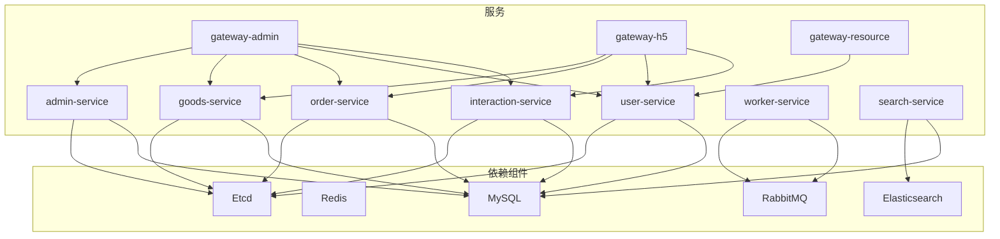
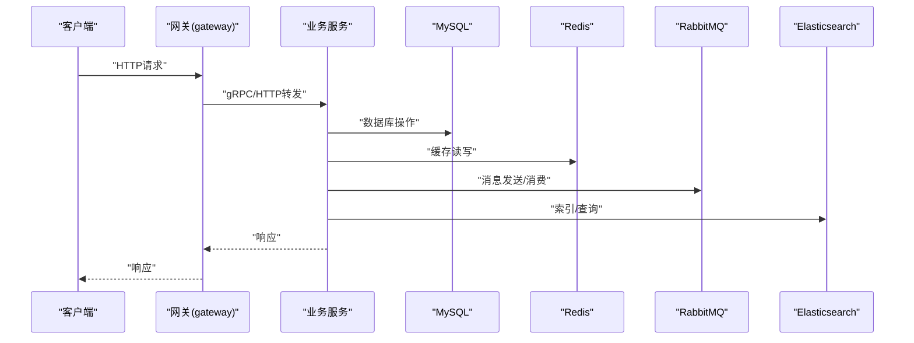
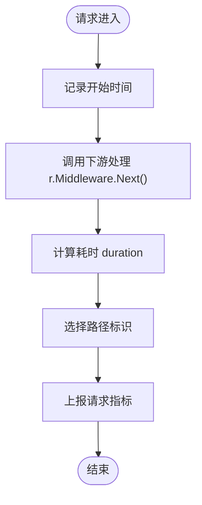
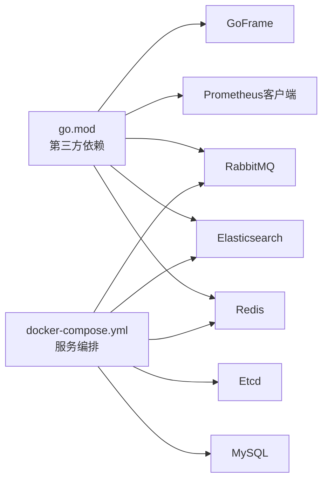

# 调试工具与技巧

<cite>
**本文引用的文件**
- [go.mod](file://go.mod)
- [README.MD](file://README.MD)
- [docker-compose.yml](file://docker-compose.yml)
- [utility/metrics/middleware.go](file://utility/metrics/middleware.go)
- [utility/metrics/metrics.go](file://utility/metrics/metrics.go)
- [utility/middleware/middleware.go](file://utility/middleware/middleware.go)
- [utility/idempotent/idempotent.go](file://utility/idempotent/idempotent.go)
- [utility/consts/consts.go](file://utility/consts/consts.go)
- [app/admin/main.go](file://app/admin/main.go)
- [app/admin/manifest/config/config.prod.yaml](file://app/admin/manifest/config/config.prod.yaml)
- [app/flash-sale/utility/rate_limit.go](file://app/flash-sale/utility/rate_limit.go)
- [app/goods/utility/stock/stock.go](file://app/goods/utility/stock/stock.go)
- [app/goods/utility/consumer/order_created_consumer.go](file://app/goods/utility/consumer/order_created_consumer.go)
- [app/order/utility/consumer/order_timeout_consumer.go](file://app/order/utility/consumer/order_timeout_consumer.go)
- [app/order/utility/payment/wxchat.go](file://app/order/utility/payment/wxchat.go)
- [app/order/utility/rabbitmq/client.go](file://app/order/utility/rabbitmq/client.go)
- [app/goods/utility/goodsRedis/goods.go](file://app/goods/utility/goodsRedis/goods.go)
- [app/goods/utility/goodsRedis/redis.go](file://app/goods/utility/goodsRedis/redis.go)
- [app/search/utility/elasticsearch/client.go](file://app/search/utility/elasticsearch/client.go)
- [app/search/utility/binlog/client.go](file://app/search/utility/binlog/client.go)
- [doc/grafana/使用说明.md](file://doc/grafana/使用说明.md)
- [doc/Prometheus指标埋点设计与实现方案.md](file://doc/Prometheus指标埋点设计与实现方案.md)
</cite>

## 目录
1. [简介](#简介)
2. [项目结构](#项目结构)
3. [核心组件](#核心组件)
4. [架构总览](#架构总览)
5. [详细组件分析](#详细组件分析)
6. [依赖关系分析](#依赖关系分析)
7. [性能考量](#性能考量)
8. [故障排查指南](#故障排查指南)
9. [结论](#结论)
10. [附录](#附录)

## 简介
本文件面向GoFrame微服务电商项目，系统化梳理调试工具与技巧，覆盖以下主题：
- 使用Go官方调试工具dlv进行断点调试
- 中间件调试与日志记录最佳实践
- 性能分析与内存泄漏检测方法
- 利用监控与指标数据进行问题定位
- 常见问题的调试思路与排查方法
- 开发环境与生产环境的调试差异说明

## 项目结构
该项目采用多模块微服务架构，每个业务域独立服务，配合网关层统一接入，并通过容器编排快速拉起依赖组件（数据库、缓存、消息队列、搜索引擎等）。核心调试相关能力包括：
- 日志与指标：服务侧日志配置、Prometheus指标采集与暴露
- 中间件：CORS跨域、gRPC客户端超时、HTTP请求指标中间件
- 幂等与限流：基于Redis的幂等控制与多维度限流
- MQ与消费者：RabbitMQ客户端与消费者示例
- 搜索与Binlog：Elasticsearch客户端与Binlog同步客户端

图示来源
- [docker-compose.yml](file://docker-compose.yml#L1-L355)

章节来源
- [README.MD](file://README.MD#L1-L41)
- [docker-compose.yml](file://docker-compose.yml#L1-L355)

## 核心组件
- 指标中间件与指标导出：在HTTP请求处理链中记录请求次数、延迟与错误，并通过/metrics端点暴露给Prometheus抓取。
- CORS与gRPC超时中间件：统一处理跨域与gRPC客户端超时，便于联调与定位网络问题。
- 幂等服务：基于Redis实现分布式幂等控制，避免重复消费与重复执行。
- 限流器：支持全局、用户、IP、购买行为等多维限流，结合缓存实现低开销限流。
- 日志配置：服务侧日志路径、级别、轮转等配置，便于问题回溯。

章节来源
- [utility/metrics/middleware.go](file://utility/metrics/middleware.go#L1-L62)
- [utility/metrics/metrics.go](file://utility/metrics/metrics.go#L1-L71)
- [utility/middleware/middleware.go](file://utility/middleware/middleware.go#L1-L35)
- [utility/idempotent/idempotent.go](file://utility/idempotent/idempotent.go#L1-L153)
- [app/admin/manifest/config/config.prod.yaml](file://app/admin/manifest/config/config.prod.yaml#L1-L22)

## 架构总览
下图展示了服务启动与请求处理的关键路径，以及与外部依赖的交互。调试时可围绕这些节点设置断点与观察指标。

图示来源
- [docker-compose.yml](file://docker-compose.yml#L134-L326)
- [app/admin/main.go](file://app/admin/main.go#L1-L25)

## 详细组件分析

### 指标中间件与Prometheus导出
- 功能要点
  - 在HTTP请求处理前记录开始时间，在Next后计算耗时并上报指标。
  - 统一记录请求方法、路径、状态码；错误中间件根据状态码分类统计错误类型。
  - 在ghttp服务器上注册/metrics端点，使用promhttp处理器输出指标。
- 调试建议
  - 在MetricsMiddleware与ErrorMetricsMiddleware中设置断点，观察标签值与异常分支。
  - 通过PromQL查询请求延迟分位、错误率与请求量趋势，定位异常时段与异常接口。
  - 生产环境建议开启/metrics端点并配置防火墙/鉴权，避免泄露敏感信息。

图示来源
- [utility/metrics/middleware.go](file://utility/metrics/middleware.go#L10-L34)

章节来源
- [utility/metrics/middleware.go](file://utility/metrics/middleware.go#L1-L62)
- [utility/metrics/metrics.go](file://utility/metrics/metrics.go#L1-L71)

### CORS与gRPC超时中间件
- 功能要点
  - CORS中间件设置允许的源、方法与头，并对OPTIONS预检请求直接返回。
  - gRPC客户端拦截器设置统一超时，避免下游慢调用拖垮上游。
- 调试建议
  - 跨域失败时检查OPTIONS请求是否被正确短路与返回状态码。
  - gRPC超时导致的错误可通过拦截器日志与指标定位慢下游。

章节来源
- [utility/middleware/middleware.go](file://utility/middleware/middleware.go#L1-L35)

### 幂等服务（Redis）
- 功能要点
  - 基于Redis SETNX实现分布式幂等锁，支持尝试加锁、释放与检查加锁。
  - 提供消息幂等键生成规则，便于消息系统去重。
- 调试建议
  - 在TryLock/ReleaseLock处设置断点，观察键值与过期时间。
  - 结合Redis可视化工具检查键是否存在、TTL是否合理。
  - 幂等失败时核对业务ID与消息ID组合是否唯一且稳定。

章节来源
- [utility/idempotent/idempotent.go](file://utility/idempotent/idempotent.go#L1-L153)

### 限流器（gcache）
- 功能要点
  - 支持全局、用户、IP、购买行为等多维限流，基于gcache实现计数与过期。
  - 提供IP解析辅助函数，兼容代理场景。
- 调试建议
  - 在CheckLimit与计数更新处设置断点，观察阈值与过期策略。
  - 限流触发时核对key命名空间与限流粒度是否符合预期。

章节来源
- [app/flash-sale/utility/rate_limit.go](file://app/flash-sale/utility/rate_limit.go#L1-L161)

### 日志配置与上下文键
- 功能要点
  - 服务侧日志配置包含路径、文件名模板、前缀、级别、stdout、轮转大小与备份数、上下文键等。
  - 上下文键用于在日志中携带traceId等上下文信息，便于链路追踪。
- 调试建议
  - 在关键业务入口设置traceId并写入上下文，确保日志可关联。
  - 生产环境注意日志轮转与磁盘占用，避免因日志写满导致服务异常。

章节来源
- [app/admin/manifest/config/config.prod.yaml](file://app/admin/manifest/config/config.prod.yaml#L1-L22)

### gRPC服务注册与Etcd发现
- 功能要点
  - 服务启动时从配置读取Etcd地址，注册自定义Resolver，使gRPC客户端可基于服务名发现目标实例。
- 调试建议
  - 检查Etcd连通性与服务注册表，确认服务名与地址映射正确。
  - gRPC调用失败时优先排查服务发现与负载均衡。

章节来源
- [app/admin/main.go](file://app/admin/main.go#L1-L25)
- [go.mod](file://go.mod#L9-L11)

### MQ与消费者示例
- 功能要点
  - RabbitMQ客户端封装与消费者管理，示例包含订单创建与超时等消费者。
- 调试建议
  - 在消费者回调中设置断点，观察消息体、重试与死信处理。
  - 关注队列积压与消费者并发，结合指标与告警定位瓶颈。

章节来源
- [app/order/utility/rabbitmq/client.go](file://app/order/utility/rabbitmq/client.go)
- [app/order/utility/consumer/order_timeout_consumer.go](file://app/order/utility/consumer/order_timeout_consumer.go)
- [app/goods/utility/consumer/order_created_consumer.go](file://app/goods/utility/consumer/order_created_consumer.go)

### 缓存与库存
- 功能要点
  - 商品缓存与库存管理接口抽象，便于实现分布式锁与Lua脚本优化。
- 调试建议
  - 在库存扣减与返还处设置断点，核对并发安全与事务一致性。
  - 缓存不一致时检查失效策略与双写一致性。

章节来源
- [app/goods/utility/stock/stock.go](file://app/goods/utility/stock/stock.go#L1-L32)
- [app/goods/utility/goodsRedis/goods.go](file://app/goods/utility/goodsRedis/goods.go)
- [app/goods/utility/goodsRedis/redis.go](file://app/goods/utility/goodsRedis/redis.go)

### 搜索与Binlog
- 功能要点
  - Elasticsearch客户端封装与Binlog客户端，支撑搜索与数据同步。
- 调试建议
  - 在索引写入与查询处设置断点，核对字段映射与分词效果。
  - Binlog同步异常时检查位点与DDL变更处理。

章节来源
- [app/search/utility/elasticsearch/client.go](file://app/search/utility/elasticsearch/client.go)
- [app/search/utility/binlog/client.go](file://app/search/utility/binlog/client.go)

## 依赖关系分析
- 语言与框架
  - Go版本与第三方库由go.mod声明，包含GoFrame、Prometheus、RabbitMQ、Elasticsearch、Redis等。
- 服务与依赖
  - 服务通过docker-compose编排，依赖Etcd、MySQL、Redis、RabbitMQ、Elasticsearch等。
- 调试相关依赖
  - Prometheus客户端用于指标采集；Gin风格的ghttp中间件用于指标与日志；Redis与RabbitMQ用于幂等与消息处理。

图示来源
- [go.mod](file://go.mod#L1-L107)
- [docker-compose.yml](file://docker-compose.yml#L1-L355)

章节来源
- [go.mod](file://go.mod#L1-L107)
- [docker-compose.yml](file://docker-compose.yml#L1-L355)

## 性能考量
- 指标采集
  - 使用请求计数、延迟直方图与错误计数三大类指标，结合路径与方法标签，便于按接口与状态聚合分析。
- 慢调用定位
  - 通过延迟直方图分位数识别慢接口；结合错误指标定位异常类型分布。
- 资源与并发
  - 关注数据库连接池、缓存命中率、MQ消费并发与索引写入压力。
- 内存与GC
  - 使用pprof进行CPU、内存、阻塞与Goroutine采样，定位热点函数与内存分配路径。

[本节为通用指导，无需列出章节来源]

## 故障排查指南
- 启动与发现
  - 确认Etcd可达且服务已注册；检查服务监听地址与端口映射。
- 网络与跨域
  - OPTIONS预检失败时检查CORS中间件配置与白名单；gRPC超时失败时检查拦截器与下游健康。
- 日志与上下文
  - 确认日志路径、级别与轮转配置；在关键路径写入traceId并贯穿所有调用链。
- 幂等与重复
  - 幂等失败时核对幂等键生成规则与Redis键值；重复消费时检查消息确认与死信队列。
- 限流与抖动
  - 限流触发时核对限流粒度与阈值；突发流量时评估滑动窗口与令牌桶参数。
- MQ与消费者
  - 消费积压时提升并发或拆分队列；异常消息进入死信后检查死信路由与重试上限。
- 缓存与库存
  - 库存不一致时检查双写顺序与事务；缓存穿透时增加空值缓存与布隆过滤。
- 搜索与同步
  - 索引延迟时检查刷新策略与批量写入；Binlog不同步时核对位点与DDL处理。

章节来源
- [utility/metrics/middleware.go](file://utility/metrics/middleware.go#L1-L62)
- [utility/metrics/metrics.go](file://utility/metrics/metrics.go#L1-L71)
- [utility/middleware/middleware.go](file://utility/middleware/middleware.go#L1-L35)
- [utility/idempotent/idempotent.go](file://utility/idempotent/idempotent.go#L1-L153)
- [app/flash-sale/utility/rate_limit.go](file://app/flash-sale/utility/rate_limit.go#L1-L161)
- [app/order/utility/rabbitmq/client.go](file://app/order/utility/rabbitmq/client.go)
- [app/order/utility/consumer/order_timeout_consumer.go](file://app/order/utility/consumer/order_timeout_consumer.go)
- [app/goods/utility/consumer/order_created_consumer.go](file://app/goods/utility/consumer/order_created_consumer.go)
- [app/goods/utility/stock/stock.go](file://app/goods/utility/stock/stock.go#L1-L32)
- [app/search/utility/elasticsearch/client.go](file://app/search/utility/elasticsearch/client.go)
- [app/search/utility/binlog/client.go](file://app/search/utility/binlog/client.go)

## 结论
本项目在日志、指标、中间件与幂等/限流等方面提供了完善的调试基础。结合dlv断点调试、Prometheus/Grafana观测、pprof性能分析与生产环境差异化配置，可高效定位与解决各类问题。建议在开发与生产环境中分别启用不同日志级别与指标粒度，并建立标准化的告警与排障流程。

[本节为总结性内容，无需列出章节来源]

## 附录

### dlv断点调试步骤（以admin服务为例）
- 启动服务（开发环境）
  - 进入服务目录，使用dlv调试运行服务主程序，以便在断点处暂停。
- 设置断点
  - 在关键业务逻辑、DAO层、消费者回调、限流与幂等处理处设置断点。
- 观察上下文
  - 通过断点查看请求上下文、traceId、用户信息与业务参数。
- 单步与变量
  - 单步执行观察变量变化，结合日志与指标确认调用链与耗时。
- 常见断点位置
  - 服务入口与路由处理
  - DAO/Model层
  - MQ消费者回调
  - 幂等与限流逻辑
  - gRPC拦截器与中间件

[本节为通用指导，无需列出章节来源]

### 开发环境与生产环境调试差异
- 日志级别
  - 开发：建议开启更详细的日志与stdout输出，便于本地调试。
  - 生产：降低日志级别，启用文件轮转与大小限制，避免IO压力。
- 指标与监控
  - 开发：可临时关闭/metrics或仅在本地访问。
  - 生产：严格控制/metrics访问权限，结合Grafana/Alertmanager建立告警。
- 依赖连通性
  - 开发：可在本地直连依赖或使用容器编排。
  - 生产：通过服务发现与内网访问，避免暴露公网。
- 超时与重试
  - 开发：适当放宽超时与重试，便于联调。
  - 生产：严格配置超时与退避策略，防止级联故障。

章节来源
- [app/admin/manifest/config/config.prod.yaml](file://app/admin/manifest/config/config.prod.yaml#L1-L22)
- [docker-compose.yml](file://docker-compose.yml#L1-L355)
- [doc/grafana/使用说明.md](file://doc/grafana/使用说明.md)
- [doc/Prometheus指标埋点设计与实现方案.md](file://doc/Prometheus指标埋点设计与实现方案.md)