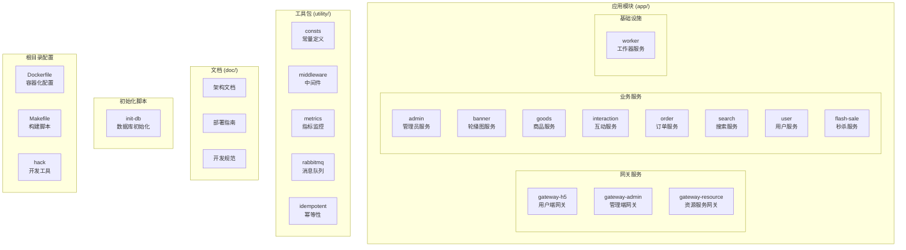
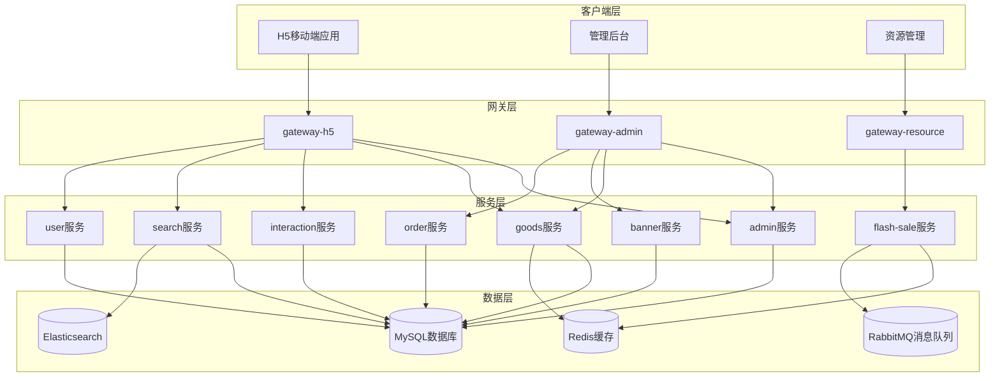
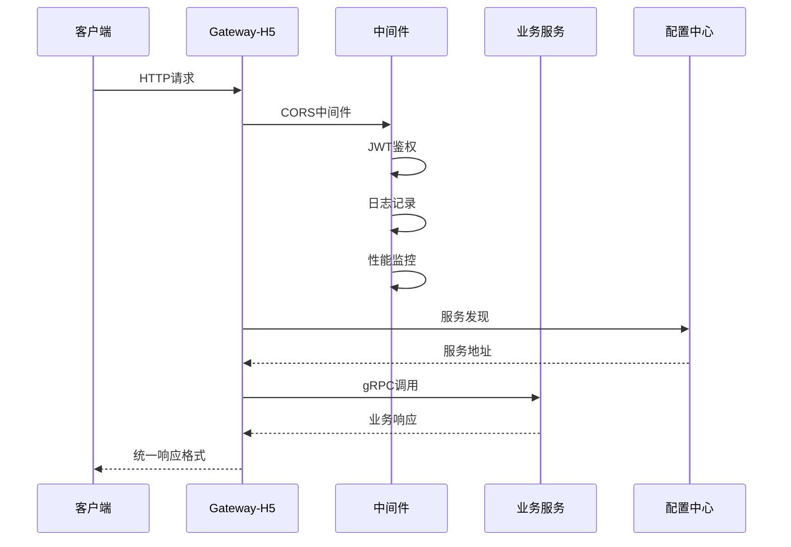
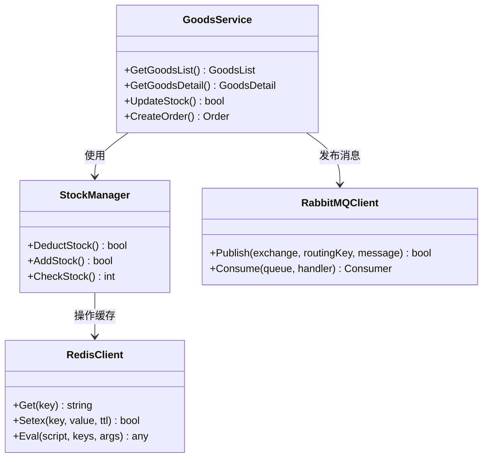
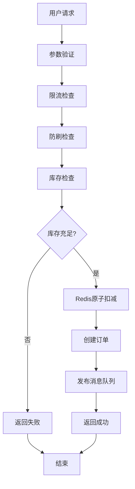

# 项目结构说明

<cite>
**本文档引用的文件**
- [README.MD](file://README.MD)
- [Makefile](file://Makefile)
- [Dockerfile](file://Dockerfile)
- [go.mod](file://go.mod)
- [project.config.json](file://project.config.json)
- [app/gateway-h5/main.go](file://app/gateway-h5/main.go)
- [app/goods/main.go](file://app/goods/main.go)
- [app/flash-sale/main.go](file://app/flash-sale/main.go)
- [utility/consts/consts.go](file://utility/consts/consts.go)
- [hack/hack-cli.mk](file://hack/hack-cli.mk)
- [app/gateway-h5/manifest/config/config.prod.yaml](file://app/gateway-h5/manifest/config/config.prod.yaml)
- [app/goods/manifest/config/config.prod.yaml](file://app/goods/manifest/config/config.prod.yaml)
- [init-db/01_init.sql](file://init-db/01_init.sql)
- [app/flash-sale/DEVELOPMENT_GUIDE.md](file://app/flash-sale/DEVELOPMENT_GUIDE.md)
</cite>

## 目录
1. [简介](#简介)
2. [项目结构](#项目结构)
3. [核心组件](#核心组件)
4. [架构概览](#架构概览)
5. [详细组件分析](#详细组件分析)
6. [依赖关系分析](#依赖关系分析)
7. [性能考虑](#性能考虑)
8. [故障排除指南](#故障排除指南)
9. [结论](#结论)
10. [附录](#附录)

## 简介

这是一个基于GoFrame框架构建的微服务电商项目。项目采用分层架构设计，包含多个独立的服务模块，通过网关统一对外提供服务。项目支持高并发场景，特别是秒杀系统的高性能需求。

## 项目结构

项目采用模块化的目录结构，主要分为以下几个部分：

**图表来源**
- [README.MD](file://README.MD#L1-L41)
- [Dockerfile](file://Dockerfile#L21-L31)

### 服务模块组织原则

项目中的app目录按照业务领域进行模块划分：

1. **网关服务层**：负责统一入口、路由转发、负载均衡
2. **业务服务层**：按业务域划分，每个服务独立部署
3. **基础设施层**：提供共享的基础设施服务

**章节来源**
- [README.MD](file://README.MD#L3-L34)

## 核心组件

### 网关服务

项目包含三个网关服务，分别服务于不同的客户端：

- **Gateway-H5**：用户端网关，提供用户相关的API接口
- **Gateway-Admin**：管理端网关，提供后台管理功能
- **Gateway-Resource**：资源服务网关，专门处理文件上传等资源操作

### 业务服务

核心业务服务包括：
- **Admin**：管理员相关功能
- **Banner**：轮播图和位置管理
- **Goods**：商品管理、库存、价格等
- **Interaction**：点赞、评论、收藏等互动功能
- **Order**：订单管理、退款处理
- **Search**：商品搜索功能
- **User**：用户信息管理
- **Flash-sale**：高并发秒杀系统

### 基础设施服务

- **Worker**：后台任务处理服务

**章节来源**
- [README.MD](file://README.MD#L1-L41)

## 架构概览

**图表来源**
- [README.MD](file://README.MD#L3-L34)
- [app/goods/manifest/config/config.prod.yaml](file://app/goods/manifest/config/config.prod.yaml#L15-L60)

## 详细组件分析

### 网关服务分析

#### Gateway-H5 网关

Gateway-H5作为用户端的主要入口，集成了多种中间件和服务：

**图表来源**
- [app/gateway-h5/main.go](file://app/gateway-h5/main.go#L13-L37)

#### Gateway-Admin 网关

管理端网关专注于后台管理功能，提供管理员认证和权限控制。

#### Gateway-Resource 网关

专门处理文件上传和资源管理，集成七牛云等存储服务。

**章节来源**
- [app/gateway-h5/main.go](file://app/gateway-h5/main.go#L1-L38)

### 业务服务分析

#### Goods 商品服务

商品服务是电商系统的核心，负责商品信息管理、库存控制、价格计算等功能。

**图表来源**
- [app/goods/main.go](file://app/goods/main.go#L15-L34)

#### Flash-Sale 秒杀服务

秒杀服务是项目的技术亮点，采用多种高并发优化技术：

**图表来源**
- [app/flash-sale/main.go](file://app/flash-sale/main.go#L18-L37)

**章节来源**
- [app/flash-sale/main.go](file://app/flash-sale/main.go#L1-L38)
- [app/flash-sale/DEVELOPMENT_GUIDE.md](file://app/flash-sale/DEVELOPMENT_GUIDE.md#L250-L299)

### 基础设施服务分析

#### Worker 工作器服务

Worker服务负责处理后台异步任务，如订单超时处理、数据统计等。

#### Utility 通用工具包

Utility包提供了项目共享的工具类：

- **consts**：全局常量定义
- **middleware**：HTTP中间件
- **metrics**：Prometheus指标监控
- **rabbitmq**：消息队列客户端
- **idempotent**：幂等性处理

**章节来源**
- [utility/consts/consts.go](file://utility/consts/consts.go#L1-L47)

## 依赖关系分析

```mermaid
graph TB
subgraph "外部依赖"
GOGF[GoFrame框架 v2.9.4]
MYSQL[MySQL驱动]
REDIS[Redis客户端]
ETCD[Etcd注册中心]
GRPC[gRPC框架]
JWT[JWT认证]
ELASTIC[Elasticsearch]
RABBIT[RabbitMQ]
end
subgraph "内部模块"
APP_ADMIN[admin服务]
APP_GOODS[goods服务]
APP_FLASH_SALE[flash-sale服务]
UTIL_CONSTS[consts工具]
UTIL_MIDDLEWARE[middleware工具]
UTIL_METRICS[metrics工具]
end
GOGF --> APP_ADMIN
GOGF --> APP_GOODS
GOGF --> APP_FLASH_SALE
MYSQL --> APP_ADMIN
MYSQL --> APP_GOODS
MYSQL --> APP_FLASH_SALE
REDIS --> APP_GOODS
REDIS --> APP_FLASH_SALE
ETCD --> APP_ADMIN
ETCD --> APP_GOODS
ETCD --> APP_FLASH_SALE
GRPC --> APP_ADMIN
GRPC --> APP_GOODS
GRPC --> APP_FLASH_SALE
JWT --> APP_ADMIN
JWT --> APP_FLASH_SALE
ELASTIC --> APP_FLASH_SALE
RABBIT --> APP_FLASH_SALE
UTIL_CONSTS --> APP_ADMIN
UTIL_CONSTS --> APP_GOODS
UTIL_CONSTS --> APP_FLASH_SALE
UTIL_MIDDLEWARE --> APP_ADMIN
UTIL_MIDDLEWARE --> APP_FLASH_SALE
UTIL_METRICS --> APP_ADMIN
UTIL_METRICS --> APP_FLASH_SALE
```

**图表来源**
- [go.mod](file://go.mod#L5-L22)

**章节来源**
- [go.mod](file://go.mod#L1-L107)

## 性能考虑

### 缓存策略

项目采用了多层次的缓存策略：

1. **Redis缓存**：商品信息、用户信息等热点数据
2. **本地缓存**：高频访问数据的本地缓存
3. **浏览器缓存**：静态资源缓存

### 异步处理

通过消息队列实现异步处理：
- 订单创建后的库存扣减
- 用户注册后的欢迎邮件
- 支付完成后的订单处理

### 限流和熔断

- **多级限流**：用户级、IP级、全局级限流
- **熔断机制**：服务异常时的快速失败
- **降级策略**：关键功能的降级处理

## 故障排除指南

### 常见问题

1. **服务启动失败**
   - 检查数据库连接配置
   - 验证Redis服务状态
   - 确认消息队列可用性

2. **网关无法访问服务**
   - 检查Etcd注册中心
   - 验证服务健康状态
   - 确认服务端口开放

3. **性能问题**
   - 监控Redis命中率
   - 检查数据库慢查询
   - 分析消息队列积压情况

### 调试工具

- **Prometheus指标**：监控系统性能指标
- **日志分析**：统一的日志收集和分析
- **分布式追踪**：全链路请求追踪

**章节来源**
- [app/goods/manifest/config/config.prod.yaml](file://app/goods/manifest/config/config.prod.yaml#L1-L60)

## 结论

该项目采用GoFrame框架构建的微服务架构，具有以下特点：

1. **模块化设计**：清晰的业务模块划分，便于维护和扩展
2. **高并发支持**：通过Redis、消息队列等技术实现高并发处理
3. **监控完善**：完整的指标监控和日志系统
4. **部署灵活**：支持容器化部署和Kubernetes编排

项目为电商系统提供了完整的技术解决方案，特别是在高并发场景下的秒杀功能实现方面具有重要参考价值。

## 附录

### 配置文件说明

#### 根目录配置

- **Makefile**：项目构建脚本，包含开发工具安装
- **Dockerfile**：多阶段构建配置，支持Alpine镜像优化
- **go.mod**：Go模块依赖管理
- **project.config.json**：小程序项目配置

#### 服务配置

每个服务都有独立的配置文件，包含：
- 服务器监听地址
- 数据库连接配置
- 缓存配置
- 消息队列配置
- 日志配置

### 初始化脚本

**init-db**目录包含数据库初始化脚本：
- **01_init.sql**：基础数据库和表结构初始化
- **goods_info.sql**：商品相关数据初始化

这些脚本确保新环境能够快速搭建完整的数据库结构。

**章节来源**
- [init-db/01_init.sql](file://init-db/01_init.sql#L1-L50)
- [hack/hack-cli.mk](file://hack/hack-cli.mk#L1-L20)