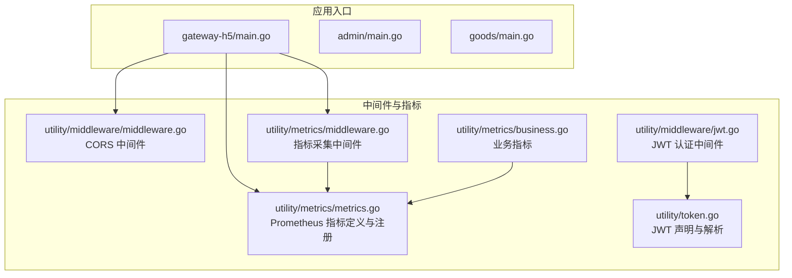
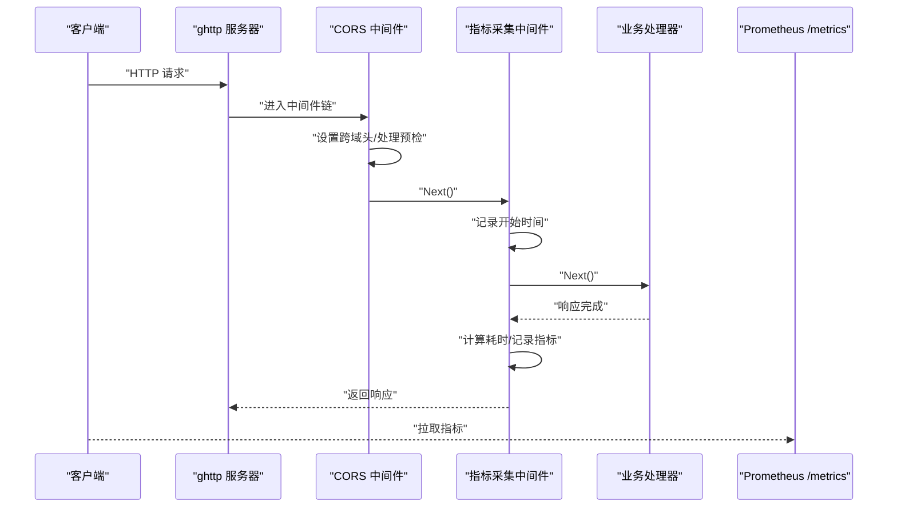
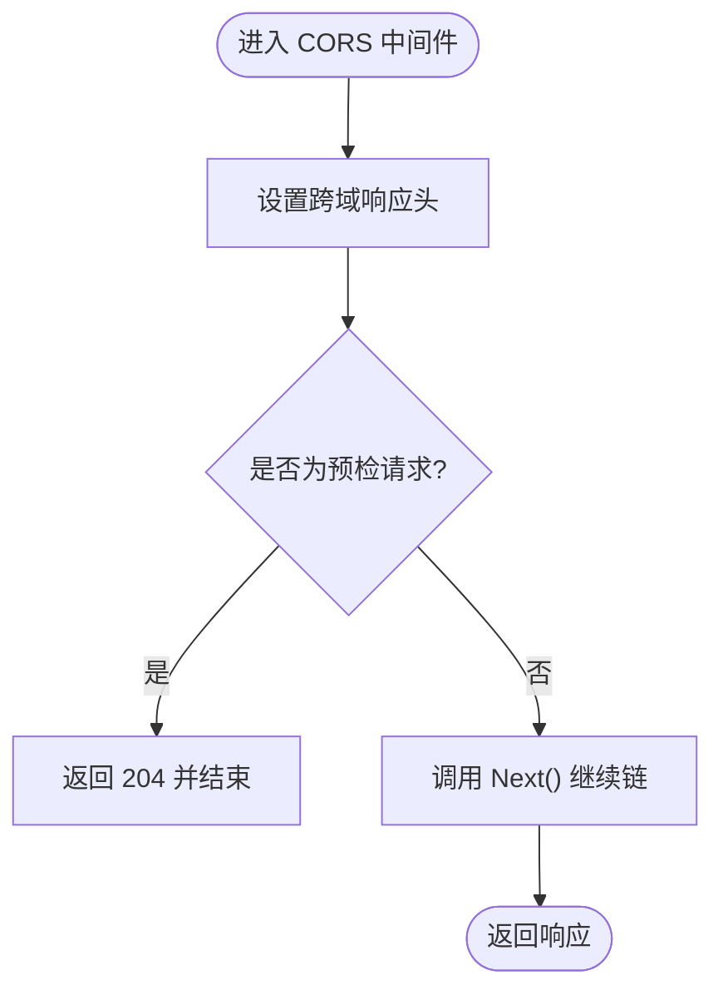
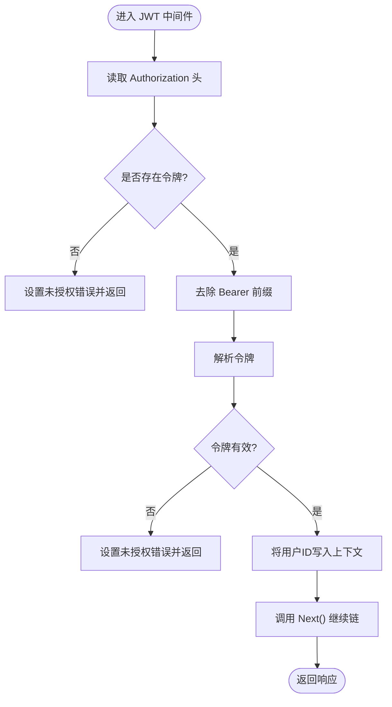
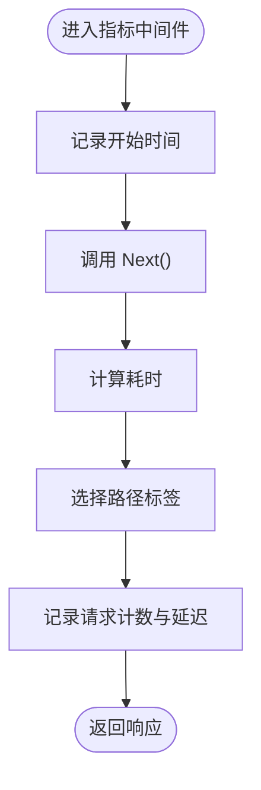
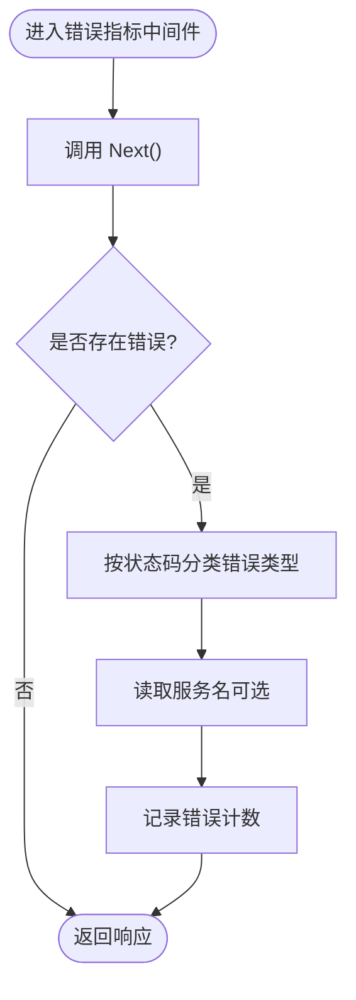
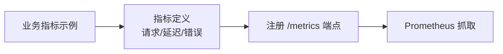
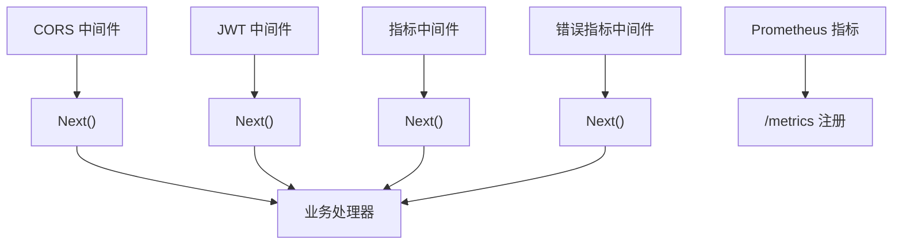

# 中间件链设计

<cite>
**本文引用的文件**
- [utility/middleware/middleware.go](file://utility/middleware/middleware.go)
- [utility/middleware/jwt.go](file://utility/middleware/jwt.go)
- [utility/metrics/middleware.go](file://utility/metrics/middleware.go)
- [utility/metrics/metrics.go](file://utility/metrics/metrics.go)
- [utility/token.go](file://utility/token.go)
- [app/gateway-h5/main.go](file://app/gateway-h5/main.go)
- [app/admin/main.go](file://app/admin/main.go)
- [app/goods/main.go](file://app/goods/main.go)
- [utility/metrics/business.go](file://utility/metrics/business.go)
</cite>

## 目录
1. [简介](#简介)
2. [项目结构](#项目结构)
3. [核心组件](#核心组件)
4. [架构总览](#架构总览)
5. [详细组件分析](#详细组件分析)
6. [依赖关系分析](#依赖关系分析)
7. [性能考量](#性能考量)
8. [故障排查指南](#故障排查指南)
9. [结论](#结论)
10. [附录](#附录)

## 简介
本文件系统化阐述本仓库的中间件链设计，重点覆盖以下内容：
- 中间件在请求处理流程中的作用与执行顺序
- CORS 跨域中间件、JWT 认证中间件、日志记录中间件（指标采集）、指标收集中间件的功能与实现
- 中间件的链式调用机制：如何添加、移除与调整顺序
- 自定义中间件的开发指南：接口约定、错误处理与性能考虑
- 实际配置示例与最佳实践

## 项目结构
中间件与指标采集相关代码主要位于 utility 子目录，HTTP 服务入口位于各应用模块的 main.go 文件中。下图展示了与中间件链相关的核心文件与调用关系。

**图表来源**
- [app/gateway-h5/main.go](file://app/gateway-h5/main.go#L27-L35)
- [utility/middleware/middleware.go](file://utility/middleware/middleware.go#L10-L23)
- [utility/middleware/jwt.go](file://utility/middleware/jwt.go#L16-L38)
- [utility/metrics/middleware.go](file://utility/metrics/middleware.go#L9-L34)
- [utility/metrics/metrics.go](file://utility/metrics/metrics.go#L45-L55)
- [utility/token.go](file://utility/token.go#L52-L64)
- [utility/metrics/business.go](file://utility/metrics/business.go#L10-L37)

**章节来源**
- [app/gateway-h5/main.go](file://app/gateway-h5/main.go#L27-L35)
- [utility/middleware/middleware.go](file://utility/middleware/middleware.go#L10-L23)
- [utility/metrics/middleware.go](file://utility/metrics/middleware.go#L9-L34)
- [utility/metrics/metrics.go](file://utility/metrics/metrics.go#L45-L55)

## 核心组件
- CORS 跨域中间件：统一设置跨域响应头，并对预检请求快速返回
- JWT 认证中间件：从请求头提取并校验令牌，注入用户上下文后放行
- 指标采集中间件：记录请求耗时、状态码与路径，供 Prometheus 汇总
- 错误指标中间件：在请求完成后根据错误与状态码分类统计
- Prometheus 指标定义与注册：定义计数器与直方图，注册 /metrics 端点
- 业务指标：示例性业务指标（订单、库存等），便于扩展

**章节来源**
- [utility/middleware/middleware.go](file://utility/middleware/middleware.go#L10-L23)
- [utility/middleware/jwt.go](file://utility/middleware/jwt.go#L16-L38)
- [utility/metrics/middleware.go](file://utility/metrics/middleware.go#L9-L34)
- [utility/metrics/middleware.go](file://utility/metrics/middleware.go#L36-L61)
- [utility/metrics/metrics.go](file://utility/metrics/metrics.go#L14-L43)
- [utility/metrics/metrics.go](file://utility/metrics/metrics.go#L45-L55)
- [utility/metrics/business.go](file://utility/metrics/business.go#L10-L37)

## 架构总览
下图展示一次典型请求在中间件链中的流转过程，以及指标采集与注册的交互。

**图表来源**
- [app/gateway-h5/main.go](file://app/gateway-h5/main.go#L27-L35)
- [utility/middleware/middleware.go](file://utility/middleware/middleware.go#L10-L23)
- [utility/metrics/middleware.go](file://utility/metrics/middleware.go#L9-L34)
- [utility/metrics/metrics.go](file://utility/metrics/metrics.go#L45-L55)

## 详细组件分析

### CORS 跨域中间件
- 功能要点
  - 统一设置允许跨域访问的来源、方法与头部
  - 对 OPTIONS 预检请求直接返回 204，避免重复处理
  - 通过 Next() 放行至后续中间件或处理器
- 关键行为
  - 预检短路：若请求方法为 OPTIONS，立即返回
  - 透传：否则继续链式调用
- 适用场景
  - 前后端分离、H5 网关等需要跨域访问的服务

**图表来源**
- [utility/middleware/middleware.go](file://utility/middleware/middleware.go#L10-L23)

**章节来源**
- [utility/middleware/middleware.go](file://utility/middleware/middleware.go#L10-L23)

### JWT 认证中间件
- 功能要点
  - 从请求头读取 Authorization 字段
  - 去除 Bearer 前缀后进行令牌解析
  - 校验失败时设置错误并终止链
  - 成功则将用户 ID 写入上下文，继续链
- 关键行为
  - 错误处理：未提供或无效令牌均返回未授权
  - 上下文注入：将用户标识放入请求上下文
- 依赖
  - 令牌解析依赖工具模块提供的解析函数

**图表来源**
- [utility/middleware/jwt.go](file://utility/middleware/jwt.go#L16-L38)
- [utility/token.go](file://utility/token.go#L52-L64)

**章节来源**
- [utility/middleware/jwt.go](file://utility/middleware/jwt.go#L16-L38)
- [utility/token.go](file://utility/token.go#L52-L64)

### 指标采集中间件（请求级）
- 功能要点
  - 记录请求开始时间
  - 调用 Next() 执行后续处理
  - 计算耗时并记录请求计数与延迟直方图
  - 路径选择：优先使用路由模板，回退到原始路径
- 关键行为
  - 仅在 Next() 之后计算耗时，确保包含业务处理时间
  - 指标维度：方法、路径、状态码

**图表来源**
- [utility/metrics/middleware.go](file://utility/metrics/middleware.go#L9-L34)

**章节来源**
- [utility/metrics/middleware.go](file://utility/metrics/middleware.go#L9-L34)

### 错误指标中间件（错误级）
- 功能要点
  - 先执行 Next()，再检查请求是否产生错误
  - 根据响应状态码将错误分类为客户端/服务端/一般错误
  - 从上下文中读取服务名，记录错误计数
- 关键行为
  - 仅在出现错误时触发，避免误报
  - 通过状态码范围进行错误类型判定

**图表来源**
- [utility/metrics/middleware.go](file://utility/metrics/middleware.go#L36-L61)

**章节来源**
- [utility/metrics/middleware.go](file://utility/metrics/middleware.go#L36-L61)

### Prometheus 指标定义与注册
- 指标定义
  - 请求计数：按方法、路径、状态码聚合
  - 请求延迟：按方法、路径、状态码的直方图
  - 错误计数：按错误类型、服务名聚合
- 注册方式
  - 在 ghttp 服务器上注册 /metrics 路由，使用标准 Prometheus HTTP 处理器输出指标
- 业务指标
  - 提供订单、成功率、库存等示例指标，便于按需扩展

**图表来源**
- [utility/metrics/metrics.go](file://utility/metrics/metrics.go#L14-L43)
- [utility/metrics/metrics.go](file://utility/metrics/metrics.go#L45-L55)
- [utility/metrics/business.go](file://utility/metrics/business.go#L10-L37)

**章节来源**
- [utility/metrics/metrics.go](file://utility/metrics/metrics.go#L14-L43)
- [utility/metrics/metrics.go](file://utility/metrics/metrics.go#L45-L55)
- [utility/metrics/business.go](file://utility/metrics/business.go#L10-L37)

## 依赖关系分析
- 中间件链的耦合与内聚
  - CORS 与指标中间件均为前置中间件，不依赖业务逻辑
  - JWT 中间件依赖令牌解析模块，耦合度较低
  - 指标中间件依赖 Prometheus 客户端，但通过封装降低对上层影响
- 外部依赖
  - GoFrame HTTP 服务器与 ghttp.RouterGroup
  - Prometheus 客户端库
  - JWT 解析库

**图表来源**
- [utility/middleware/middleware.go](file://utility/middleware/middleware.go#L10-L23)
- [utility/middleware/jwt.go](file://utility/middleware/jwt.go#L16-L38)
- [utility/metrics/middleware.go](file://utility/metrics/middleware.go#L9-L34)
- [utility/metrics/middleware.go](file://utility/metrics/middleware.go#L36-L61)
- [utility/metrics/metrics.go](file://utility/metrics/metrics.go#L45-L55)

**章节来源**
- [utility/middleware/middleware.go](file://utility/middleware/middleware.go#L10-L23)
- [utility/middleware/jwt.go](file://utility/middleware/jwt.go#L16-L38)
- [utility/metrics/middleware.go](file://utility/metrics/middleware.go#L9-L34)
- [utility/metrics/middleware.go](file://utility/metrics/middleware.go#L36-L61)
- [utility/metrics/metrics.go](file://utility/metrics/metrics.go#L45-L55)

## 性能考量
- 中间件顺序
  - 跨域与鉴权类中间件应尽量靠前，尽早失败与短路
  - 指标中间件应放在链尾或靠近尾部，以覆盖完整处理时间
- 指标维度
  - 路径标签建议使用路由模板而非具体 ID，避免高基数导致指标膨胀
  - 状态码文本作为标签可提升可读性，但需注意标签数量控制
- 资源开销
  - 指标采集为轻量操作，但应避免在高频路径中做昂贵计算
  - 预检请求直接返回可减少不必要的链路开销

[本节为通用指导，无需特定文件引用]

## 故障排查指南
- CORS 不生效
  - 检查是否正确设置跨域头与预检处理
  - 确认中间件顺序是否在业务处理器之前
- JWT 认证失败
  - 确认请求头格式是否为 Bearer Token
  - 检查令牌签名密钥与过期时间
  - 查看上下文是否正确注入用户 ID
- 指标未上报
  - 确认 /metrics 路由已注册
  - 检查 Prometheus 抓取目标与端口
  - 核对标签维度与指标命名是否一致

**章节来源**
- [utility/middleware/middleware.go](file://utility/middleware/middleware.go#L10-L23)
- [utility/middleware/jwt.go](file://utility/middleware/jwt.go#L16-L38)
- [utility/metrics/metrics.go](file://utility/metrics/metrics.go#L45-L55)

## 结论
本仓库采用清晰的中间件链设计：前置 CORS 与指标中间件负责跨域与可观测性，JWT 中间件负责安全鉴权，链式调用保证了职责分离与可维护性。通过 Prometheus 指标与业务指标的结合，实现了对请求与错误的全面观测。建议在新增中间件时遵循“越早失败越好”的原则，并合理选择指标维度以平衡可观测性与性能。

[本节为总结性内容，无需特定文件引用]

## 附录

### 中间件链式调用机制与最佳实践
- 添加中间件
  - 在 HTTP 服务启动时通过 Use() 方法注册
  - 注意中间件的先后顺序，通常为：CORS → 鉴权 → 业务 → 指标
- 移除中间件
  - 通过取消注册对应中间件函数即可移除
- 调整顺序
  - 通过重新排列 Use() 的调用顺序实现
- 最佳实践
  - 预检请求短路与错误短路
  - 指标维度控制与标签规范化
  - 将通用逻辑下沉为中间件，保持控制器简洁

**章节来源**
- [app/gateway-h5/main.go](file://app/gateway-h5/main.go#L27-L35)

### 自定义中间件开发指南
- 接口约定
  - 形参为 ghttp.Request，返回无
  - 必须在合适时机调用 r.Middleware.Next()，否则链会中断
- 错误处理
  - 使用 r.SetError() 设置错误，配合错误指标中间件统一统计
  - 对于可恢复错误，可在 Next() 后检查 r.GetError()
- 性能考虑
  - 避免在中间件中进行阻塞操作
  - 控制标签数量与指标维度，防止高基数
- 示例步骤
  - 定义函数：func MyMiddleware(r *ghttp.Request)
  - 在入口文件中 s.Use(MyMiddleware)
  - 如需指标，调用 RecordRequest/RecordError 或业务指标接口

**章节来源**
- [utility/metrics/middleware.go](file://utility/metrics/middleware.go#L9-L34)
- [utility/metrics/middleware.go](file://utility/metrics/middleware.go#L36-L61)
- [utility/metrics/metrics.go](file://utility/metrics/metrics.go#L62-L71)
- [utility/metrics/business.go](file://utility/metrics/business.go#L40-L58)