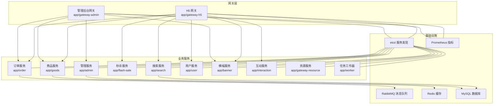
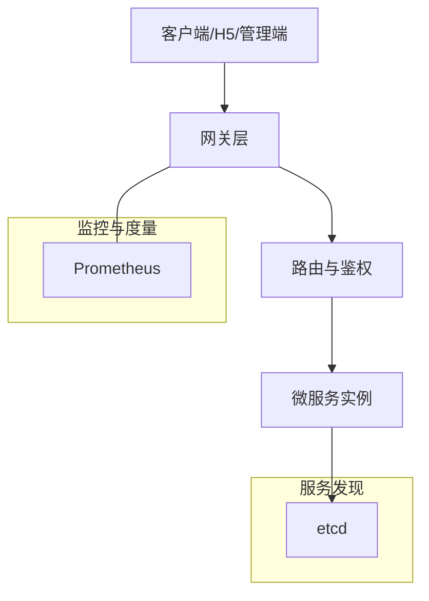
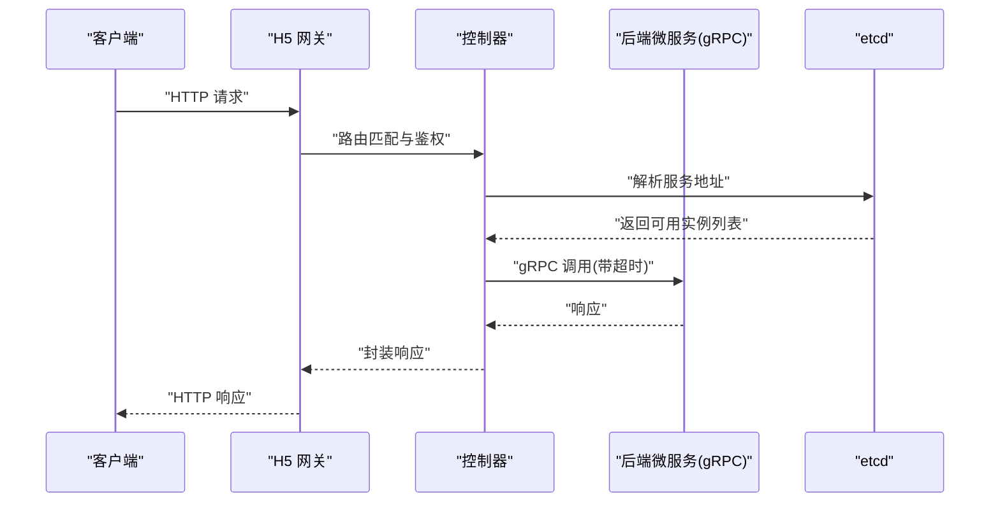
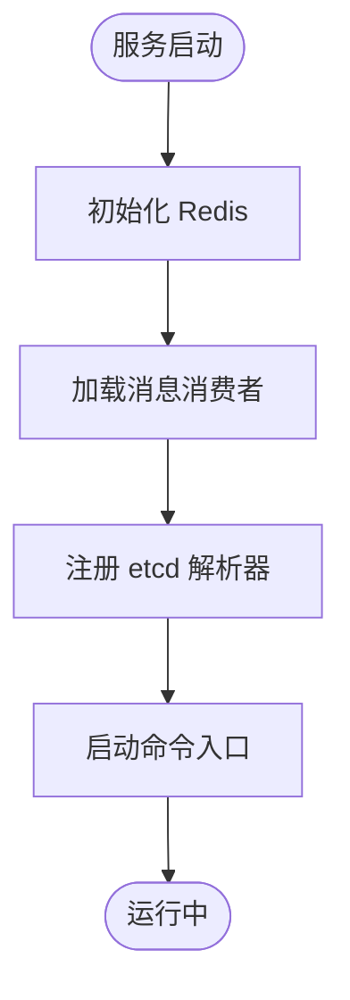
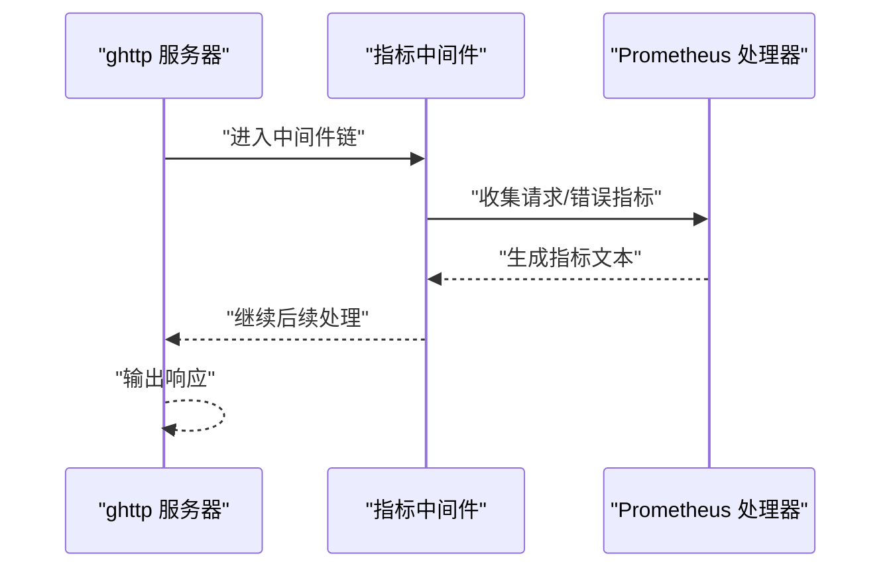
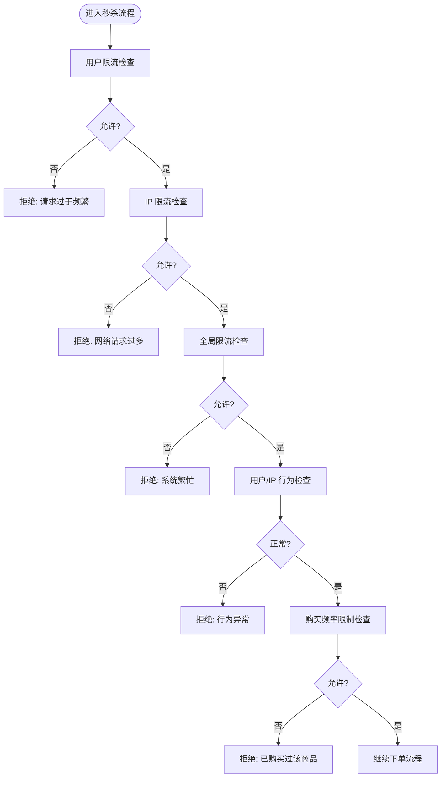
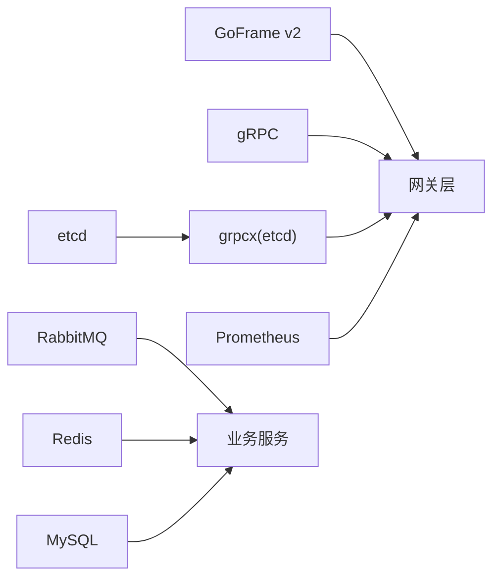

# 微服务架构设计

<cite>
**本文引用的文件**
- [app/gateway-h5/main.go](file://app/gateway-h5/main.go)
- [app/gateway-admin/main.go](file://app/gateway-admin/main.go)
- [app/admin/main.go](file://app/admin/main.go)
- [app/goods/main.go](file://app/goods/main.go)
- [app/order/main.go](file://app/order/main.go)
- [app/gateway-h5/internal/cmd/cmd.go](file://app/gateway-h5/internal/cmd/cmd.go)
- [app/gateway-admin/internal/cmd/cmd.go](file://app/gateway-admin/internal/cmd/cmd.go)
- [utility/middleware/middleware.go](file://utility/middleware/middleware.go)
- [utility/metrics/metrics.go](file://utility/metrics/metrics.go)
- [app/gateway-h5/manifest/config/config.prod.yaml](file://app/gateway-h5/manifest/config/config.prod.yaml)
- [app/gateway-admin/manifest/config/config.prod.yaml](file://app/gateway-admin/manifest/config/config.prod.yaml)
- [go.mod](file://go.mod)
- [app/flash-sale/utility/rate_limit.go](file://app/flash-sale/utility/rate_limit.go)
- [app/flash-sale/utility/anti_brush.go](file://app/flash-sale/utility/anti_brush.go)
- [app/goods/utility/stock/stock.go](file://app/goods/utility/stock/stock.go)
</cite>

## 目录
1. [引言](#引言)
2. [项目结构](#项目结构)
3. [核心组件](#核心组件)
4. [架构总览](#架构总览)
5. [详细组件分析](#详细组件分析)
6. [依赖关系分析](#依赖关系分析)
7. [性能考量](#性能考量)
8. [故障排查指南](#故障排查指南)
9. [结论](#结论)
10. [附录](#附录)

## 引言
本设计文档面向一个基于 GoFrame 的微服务架构，系统采用双网关（H5 网关与管理后台网关）统一接入，后端按业务域拆分为多个独立微服务，并通过 gRPC 实现服务间通信，结合 etcd 进行服务发现与负载均衡。同时，系统在网关层引入 Prometheus 指标采集与中间件，以支撑可观测性与治理能力。本文将从服务拆分原则、职责边界、通信机制、治理策略、技术选型与权衡、可扩展性与容错性等方面进行系统化阐述。

## 项目结构
项目采用“按业务域”划分的微服务组织方式，每个服务包含独立的 API 定义、控制器、DAO、逻辑层、模型与部署清单。双网关负责对外暴露统一入口，并对内路由至对应微服务。

图表来源
- [app/gateway-h5/main.go](file://app/gateway-h5/main.go#L1-L38)
- [app/gateway-admin/main.go](file://app/gateway-admin/main.go#L1-L30)
- [app/admin/main.go](file://app/admin/main.go#L1-L25)
- [app/goods/main.go](file://app/goods/main.go#L1-L35)
- [app/order/main.go](file://app/order/main.go#L1-L23)

章节来源
- [app/gateway-h5/main.go](file://app/gateway-h5/main.go#L1-L38)
- [app/gateway-admin/main.go](file://app/gateway-admin/main.go#L1-L30)
- [app/gateway-h5/internal/cmd/cmd.go](file://app/gateway-h5/internal/cmd/cmd.go#L1-L100)
- [app/gateway-admin/internal/cmd/cmd.go](file://app/gateway-admin/internal/cmd/cmd.go#L1-L46)

## 核心组件
- 双网关：H5 网关与管理后台网关分别承载前端与后台管理的统一入口，内置 CORS 与 JWT 认证中间件，提供路由绑定与鉴权控制。
- 业务服务：admin、goods、order、flash-sale、search、user、banner、interaction、gateway-resource、worker 等，各自聚焦单一业务域。
- 服务发现与通信：基于 etcd 的 gRPC 解析器，实现服务注册与发现；服务间通过 gRPC 进行高性能通信。
- 指标与可观测性：网关侧集成 Prometheus 指标采集与中间件，统一暴露 /metrics 接口。
- 基础设施：etcd、Prometheus、RabbitMQ、Redis、MySQL 等。

章节来源
- [utility/middleware/middleware.go](file://utility/middleware/middleware.go#L1-L35)
- [utility/metrics/metrics.go](file://utility/metrics/metrics.go#L1-L71)
- [go.mod](file://go.mod#L1-L107)

## 架构总览
系统采用“网关 + 微服务 + 基础设施”的三层架构。网关负责统一接入、鉴权与路由；微服务按领域拆分，内部遵循控制器-逻辑-DAO-模型的分层；基础设施为各服务提供注册中心、消息队列、缓存与数据库支持。

图表来源
- [app/gateway-h5/main.go](file://app/gateway-h5/main.go#L13-L36)
- [app/gateway-admin/main.go](file://app/gateway-admin/main.go#L13-L21)

## 详细组件分析

### 网关层（H5 网关）
- 职责与功能
  - 提供 /frontend 分组路由，区分无需认证与需要 JWT 认证的接口。
  - 绑定用户、商品、订单、互动、横幅等控制器，统一对外暴露 REST API。
  - 内置 CORS 中间件与 JWT 鉴权中间件，保障跨域与安全。
- 关键实现要点
  - 在启动时注册 etcd 作为 gRPC 解析器，用于服务发现。
  - 初始化 Prometheus 指标并注册 /metrics 端点，便于监控。
  - 通过 ghttp.RouterGroup 组织路由，减少控制器实例化次数，提升性能。
- 通信机制
  - 对外使用 HTTP REST API；对内通过 gRPC 调用后端微服务。
  - gRPC 客户端设置统一超时拦截器，避免长阻塞。
- 安全与治理
  - CORS 放通常见方法与头字段；预检请求返回 204。
  - JWT 中间件保护需认证接口；错误指标与请求指标统一采集。

图表来源
- [app/gateway-h5/main.go](file://app/gateway-h5/main.go#L13-L36)
- [app/gateway-h5/internal/cmd/cmd.go](file://app/gateway-h5/internal/cmd/cmd.go#L22-L91)
- [utility/middleware/middleware.go](file://utility/middleware/middleware.go#L10-L34)

章节来源
- [app/gateway-h5/main.go](file://app/gateway-h5/main.go#L1-L38)
- [app/gateway-h5/internal/cmd/cmd.go](file://app/gateway-h5/internal/cmd/cmd.go#L1-L100)
- [utility/middleware/middleware.go](file://utility/middleware/middleware.go#L1-L35)
- [utility/metrics/metrics.go](file://utility/metrics/metrics.go#L1-L71)

### 网关层（管理后台网关）
- 职责与功能
  - 提供 /backend 分组路由，绑定管理域控制器与受 JWT 保护的接口。
  - 与 H5 网关类似，具备 CORS 与鉴权能力。
- 通信机制
  - 同样注册 etcd 解析器，实现服务发现与负载均衡。

章节来源
- [app/gateway-admin/main.go](file://app/gateway-admin/main.go#L1-L30)
- [app/gateway-admin/internal/cmd/cmd.go](file://app/gateway-admin/internal/cmd/cmd.go#L1-L46)

### 业务服务（示例：商品服务）
- 职责与功能
  - 商品域相关接口与领域逻辑，如商品信息、分类、购物车、优惠券、砍价等。
  - 启动时初始化 Redis，确保缓存可用。
  - 通过 gRPC 暴露领域实体与业务操作。
- 通信机制
  - 服务内通过 gRPC 与其他服务交互；消费者订阅消息队列事件。
- 治理与可靠性
  - 与网关一致，注册 etcd 解析器，启用 gRPC 超时控制。

图表来源
- [app/goods/main.go](file://app/goods/main.go#L15-L34)

章节来源
- [app/goods/main.go](file://app/goods/main.go#L1-L35)

### 业务服务（示例：订单服务）
- 职责与功能
  - 订单域相关接口与退款逻辑，对接支付与消息队列。
- 通信机制
  - 通过 etcd 解析器进行服务发现与调用。

章节来源
- [app/order/main.go](file://app/order/main.go#L1-L23)

### 业务服务（示例：管理服务）
- 职责与功能
  - 管理后台所需的基础管理接口。
- 通信机制
  - 通过 etcd 解析器进行服务发现与调用。

章节来源
- [app/admin/main.go](file://app/admin/main.go#L1-L25)

### 治理与监控（Prometheus 与中间件）
- 指标体系
  - 请求总量、请求延迟直方图、错误计数等基础指标。
  - 提供 /metrics 端点，由网关统一暴露。
- 中间件
  - CORS 中间件放通常用方法与头字段，处理预检请求。
  - gRPC 客户端超时拦截器，统一 3 秒超时，避免阻塞扩散。

图表来源
- [utility/metrics/metrics.go](file://utility/metrics/metrics.go#L45-L71)
- [utility/middleware/middleware.go](file://utility/middleware/middleware.go#L10-L34)

章节来源
- [utility/metrics/metrics.go](file://utility/metrics/metrics.go#L1-L71)
- [utility/middleware/middleware.go](file://utility/middleware/middleware.go#L1-L35)

### 服务发现与负载均衡
- 服务发现
  - 网关与各服务在启动时注册 etcd 作为 gRPC 解析器，实现服务注册与发现。
- 负载均衡
  - 通过 etcd 解析器与 gRPC 客户端的连接池实现轮询式负载均衡。
- 配置位置
  - etcd 地址在各服务的配置文件中定义。

章节来源
- [app/gateway-h5/main.go](file://app/gateway-h5/main.go#L15-L21)
- [app/gateway-admin/main.go](file://app/gateway-admin/main.go#L15-L21)
- [app/admin/main.go](file://app/admin/main.go#L15-L21)
- [app/goods/main.go](file://app/goods/main.go#L17-L31)
- [app/order/main.go](file://app/order/main.go#L14-L19)
- [app/gateway-h5/manifest/config/config.prod.yaml](file://app/gateway-h5/manifest/config/config.prod.yaml#L16-L17)
- [app/gateway-admin/manifest/config/config.prod.yaml](file://app/gateway-admin/manifest/config/config.prod.yaml#L16-L17)

### 通信机制：HTTP REST 与 gRPC
- HTTP REST
  - 网关层提供 REST API，路由分组与鉴权在网关完成，降低服务间耦合。
- gRPC
  - 服务间调用采用 gRPC，结合 etcd 解析器与超时拦截器，保证低延迟与高吞吐。
- 使用场景
  - 网关对外：REST API。
  - 服务间内调用：gRPC。
  - Protobuf 定义与生成代码在各服务的 api 目录下维护。

章节来源
- [app/gateway-h5/internal/cmd/cmd.go](file://app/gateway-h5/internal/cmd/cmd.go#L33-L91)
- [app/gateway-admin/internal/cmd/cmd.go](file://app/gateway-admin/internal/cmd/cmd.go#L22-L39)
- [utility/middleware/middleware.go](file://utility/middleware/middleware.go#L25-L34)
- [go.mod](file://go.mod#L1-L107)

### 容错与限流（秒杀场景）
- 全局限流与用户/IP 限流
  - 基于内存缓存实现每秒级限流，防止突发流量冲击。
- 行为防刷
  - 基于用户与 IP 的行为频率检测，配合缓存计数与过期策略。
- 购买限制
  - 对用户在特定商品上的购买频率进行限制，防止恶意刷单。
- 库存管理
  - 定义库存管理器接口，抽象扣减、返还、查询与初始化库存等能力。

图表来源
- [app/flash-sale/utility/rate_limit.go](file://app/flash-sale/utility/rate_limit.go#L52-L141)
- [app/flash-sale/utility/anti_brush.go](file://app/flash-sale/utility/anti_brush.go#L24-L80)
- [app/goods/utility/stock/stock.go](file://app/goods/utility/stock/stock.go#L7-L31)

章节来源
- [app/flash-sale/utility/rate_limit.go](file://app/flash-sale/utility/rate_limit.go#L1-L161)
- [app/flash-sale/utility/anti_brush.go](file://app/flash-sale/utility/anti_brush.go#L1-L81)
- [app/goods/utility/stock/stock.go](file://app/goods/utility/stock/stock.go#L1-L32)

## 依赖关系分析
- 技术栈
  - Web 框架：GoFrame v2。
  - RPC：gRPC + grpcx（基于 etcd）。
  - 注册中心：etcd。
  - 监控：Prometheus。
  - 消息队列：RabbitMQ。
  - 缓存：Redis。
  - 搜索：Elasticsearch。
  - 支付：微信支付 SDK。
- 依赖关系可视化

图表来源
- [go.mod](file://go.mod#L5-L22)

章节来源
- [go.mod](file://go.mod#L1-L107)

## 性能考量
- 网关层
  - 路由分组与中间件链路尽量前置，减少不必要的处理。
  - gRPC 超时控制避免下游慢调用拖垮上游。
  - Prometheus 指标采集与 /metrics 端点仅在必要时开启，避免额外开销。
- 服务层
  - Redis 缓存命中率与热点数据预热，降低数据库压力。
  - 消息队列异步化处理，削峰填谷。
  - 限流与防刷策略在入口处生效，保护后端服务。
- 可扩展性
  - 服务按领域拆分，独立演进与扩容。
  - etcd 与 gRPC 的组合便于水平扩展与弹性伸缩。

## 故障排查指南
- 网关无法访问后端服务
  - 检查 etcd 地址配置与连通性。
  - 查看 gRPC 调用日志与超时错误。
- CORS 或鉴权问题
  - 确认网关 CORS 中间件与 JWT 中间件是否正确挂载。
  - 核对请求头与预检请求处理。
- 指标未上报
  - 确认 /metrics 端点已注册且无中间件冲突。
  - 检查 Prometheus 抓取配置与目标可达性。
- 秒杀限流不生效
  - 检查缓存键空间与过期策略。
  - 核对用户/IP 限流阈值与时间窗口。

章节来源
- [utility/middleware/middleware.go](file://utility/middleware/middleware.go#L10-L34)
- [utility/metrics/metrics.go](file://utility/metrics/metrics.go#L45-L71)
- [app/flash-sale/utility/rate_limit.go](file://app/flash-sale/utility/rate_limit.go#L25-L49)
- [app/flash-sale/utility/anti_brush.go](file://app/flash-sale/utility/anti_brush.go#L24-L80)

## 结论
本架构以双网关为核心，结合 etcd 与 gRPC 实现服务发现与高效通信，辅以 Prometheus 指标与中间件形成可观测与治理闭环。通过按领域拆分的微服务与限流/防刷策略，系统在可扩展性、容错性与性能方面均具备良好基础。后续可在网关层引入熔断器、重试与灰度发布等能力，进一步增强稳定性与交付效率。

## 附录
- 配置文件位置
  - H5 网关配置：app/gateway-h5/manifest/config/config.prod.yaml
  - 管理后台网关配置：app/gateway-admin/manifest/config/config.prod.yaml
- 关键实现路径
  - 网关路由绑定：app/gateway-h5/internal/cmd/cmd.go、app/gateway-admin/internal/cmd/cmd.go
  - gRPC 超时拦截器：utility/middleware/middleware.go
  - 指标采集与暴露：utility/metrics/metrics.go
  - 秒杀限流与防刷：app/flash-sale/utility/rate_limit.go、app/flash-sale/utility/anti_brush.go
  - 库存管理接口：app/goods/utility/stock/stock.go