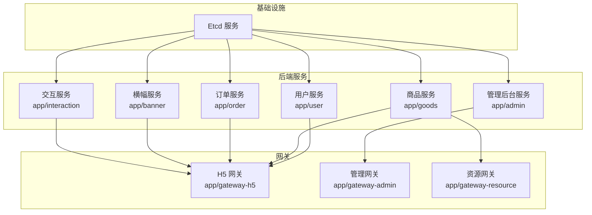
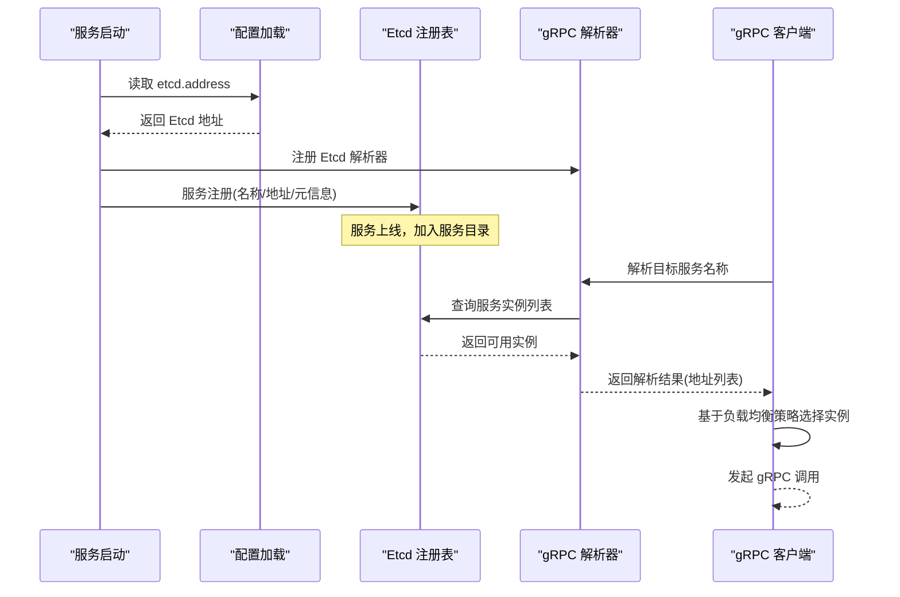
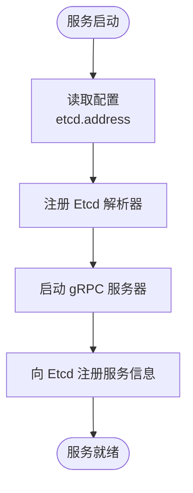
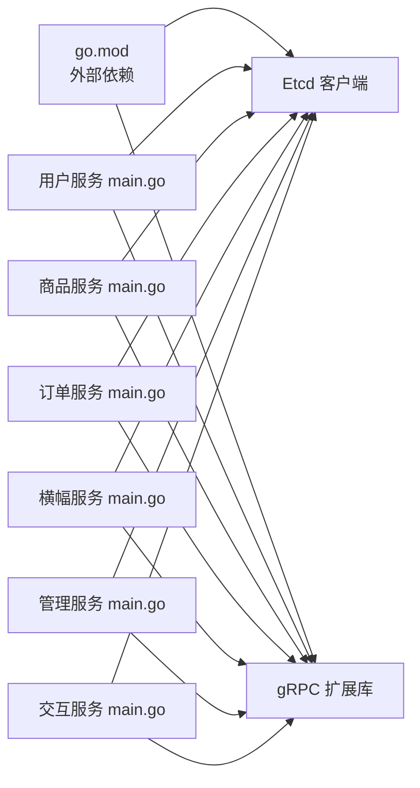

# 服务发现与注册

<cite>
**本文引用的文件**
- [go.mod](file://go.mod)
- [docker-compose.prod.yml](file://docker-compose.prod.yml)
- [app/user/main.go](file://app/user/main.go)
- [app/banner/main.go](file://app/banner/main.go)
- [app/admin/main.go](file://app/admin/main.go)
- [app/order/main.go](file://app/order/main.go)
- [app/interaction/main.go](file://app/interaction/main.go)
- [app/gateway-admin/main.go](file://app/gateway-admin/main.go)
- [app/gateway-resource/main.go](file://app/gateway-resource/main.go)
- [app/user/manifest/config/config.prod.yaml](file://app/user/manifest/config/config.prod.yaml)
- [app/goods/manifest/config/config.prod.yaml](file://app/goods/manifest/config/config.prod.yaml)
- [app/order/manifest/config/config.prod.yaml](file://app/order/manifest/config/config.prod.yaml)
- [app/user/internal/cmd/cmd.go](file://app/user/internal/cmd/cmd.go)
- [app/goods/internal/cmd/cmd.go](file://app/goods/internal/cmd/cmd.go)
</cite>

## 目录
1. [简介](#简介)
2. [项目结构](#项目结构)
3. [核心组件](#核心组件)
4. [架构总览](#架构总览)
5. [组件详细分析](#组件详细分析)
6. [依赖关系分析](#依赖关系分析)
7. [性能考量](#性能考量)
8. [故障排查指南](#故障排查指南)
9. [结论](#结论)
10. [附录](#附录)

## 简介
本文件系统化阐述该微服务仓库中的服务发现与注册机制，重点围绕基于 Etcd 的 gRPC 服务注册与发现展开。内容涵盖：
- 基于 Etcd 的服务注册与发现原理
- gRPC 客户端如何通过 Etcd 进行服务解析
- 服务注册流程、健康检查机制与故障转移策略
- 配置参数、超时设置与重试机制
- 实际代码示例路径：服务启动时完成注册、服务下线与网络分区处理
- 服务发现对微服务架构可用性的关键作用

## 项目结构
该项目采用多模块微服务架构，每个服务独立运行并共享统一的基础设施（如 Etcd）。服务通过 gRPC 提供接口，使用 GoFrame 框架承载服务生命周期与配置管理。

图表来源
- [docker-compose.prod.yml](file://docker-compose.prod.yml#L240-L399)
- [app/user/main.go](file://app/user/main.go#L13-L24)
- [app/goods/main.go](file://app/goods/main.go#L1-L22)
- [app/order/main.go](file://app/order/main.go#L1-L22)
- [app/banner/main.go](file://app/banner/main.go#L1-L24)
- [app/admin/main.go](file://app/admin/main.go#L1-L24)
- [app/interaction/main.go](file://app/interaction/main.go#L1-L25)
- [app/gateway-admin/main.go](file://app/gateway-admin/main.go#L1-L29)
- [app/gateway-resource/main.go](file://app/gateway-resource/main.go#L1-L29)

章节来源
- [docker-compose.prod.yml](file://docker-compose.prod.yml#L240-L399)

## 核心组件
- Etcd 客户端与 gRPC 解析器
  - 通过引入 Etcd 注册表与 gRPC 扩展库，在服务启动时注册解析器，使 gRPC 客户端能基于 Etcd 进行服务发现。
- 服务配置
  - 各服务在配置中声明 gRPC 名称、监听地址与 Etcd 地址，确保注册与发现的一致性。
- 健康检查与容器编排
  - Compose 中为各服务定义健康检查策略，保障服务可用性与故障转移。

章节来源
- [go.mod](file://go.mod#L9-L11)
- [app/user/main.go](file://app/user/main.go#L13-L24)
- [app/goods/main.go](file://app/goods/main.go#L1-L22)
- [app/order/main.go](file://app/order/main.go#L1-L22)
- [app/banner/main.go](file://app/banner/main.go#L1-L24)
- [app/admin/main.go](file://app/admin/main.go#L1-L24)
- [app/interaction/main.go](file://app/interaction/main.go#L1-L25)
- [app/user/manifest/config/config.prod.yaml](file://app/user/manifest/config/config.prod.yaml#L1-L22)
- [app/goods/manifest/config/config.prod.yaml](file://app/goods/manifest/config/config.prod.yaml#L1-L60)
- [app/order/manifest/config/config.prod.yaml](file://app/order/manifest/config/config.prod.yaml#L1-L86)
- [docker-compose.prod.yml](file://docker-compose.prod.yml#L240-L399)

## 架构总览
下图展示了服务启动与注册、客户端解析与调用的关键步骤：

图表来源
- [app/user/main.go](file://app/user/main.go#L13-L24)
- [app/goods/main.go](file://app/goods/main.go#L1-L22)
- [app/order/main.go](file://app/order/main.go#L1-L22)
- [app/banner/main.go](file://app/banner/main.go#L1-L24)
- [app/admin/main.go](file://app/admin/main.go#L1-L24)
- [app/interaction/main.go](file://app/interaction/main.go#L1-L25)
- [app/user/manifest/config/config.prod.yaml](file://app/user/manifest/config/config.prod.yaml#L20-L22)
- [app/goods/manifest/config/config.prod.yaml](file://app/goods/manifest/config/config.prod.yaml#L20-L22)
- [app/order/manifest/config/config.prod.yaml](file://app/order/manifest/config/config.prod.yaml#L20-L22)

## 组件详细分析

### Etcd 服务注册与发现原理
- 服务启动时，从配置中读取 Etcd 地址并注册 gRPC 解析器，使后续 gRPC 客户端可通过服务名解析到具体实例。
- 服务注册通常包含服务名、实例地址、健康状态与元信息；客户端通过解析器查询 Etcd 获取当前可用实例列表，实现动态路由与故障转移。

章节来源
- [app/user/main.go](file://app/user/main.go#L13-L24)
- [app/goods/main.go](file://app/goods/main.go#L1-L22)
- [app/order/main.go](file://app/order/main.go#L1-L22)
- [app/banner/main.go](file://app/banner/main.go#L1-L24)
- [app/admin/main.go](file://app/admin/main.go#L1-L24)
- [app/interaction/main.go](file://app/interaction/main.go#L1-L25)
- [app/user/manifest/config/config.prod.yaml](file://app/user/manifest/config/config.prod.yaml#L20-L22)
- [app/goods/manifest/config/config.prod.yaml](file://app/goods/manifest/config/config.prod.yaml#L20-L22)
- [app/order/manifest/config/config.prod.yaml](file://app/order/manifest/config/config.prod.yaml#L20-L22)

### gRPC 客户端通过 Etcd 进行服务解析
- 客户端在创建连接时使用服务名作为目标，解析器会向 Etcd 查询对应服务的所有实例，返回可用地址列表。
- 客户端结合负载均衡策略（如轮询或最少连接）选择实例发起请求；当某实例不可用时，解析器返回的列表会剔除故障实例，从而实现故障转移。

章节来源
- [app/user/main.go](file://app/user/main.go#L13-L24)
- [app/goods/main.go](file://app/goods/main.go#L1-L22)
- [app/order/main.go](file://app/order/main.go#L1-L22)
- [app/banner/main.go](file://app/banner/main.go#L1-L24)
- [app/admin/main.go](file://app/admin/main.go#L1-L24)
- [app/interaction/main.go](file://app/interaction/main.go#L1-L25)

### 服务注册流程
- 服务启动时，读取配置中的 Etcd 地址，注册 gRPC 解析器。
- 服务在本地启动 gRPC 服务器并暴露接口；随后将自身服务名与监听地址写入 Etcd，完成注册。
- 注册信息通常包含服务名、实例地址、健康状态与 TTL 心跳，用于自动剔除失效实例。

图表来源
- [app/user/main.go](file://app/user/main.go#L13-L24)
- [app/goods/main.go](file://app/goods/main.go#L1-L22)
- [app/order/main.go](file://app/order/main.go#L1-L22)
- [app/banner/main.go](file://app/banner/main.go#L1-L24)
- [app/admin/main.go](file://app/admin/main.go#L1-L24)
- [app/interaction/main.go](file://app/interaction/main.go#L1-L25)

### 健康检查机制与故障转移策略
- 健康检查
  - Compose 为各服务定义健康检查策略，包括检测命令、间隔、超时与重试次数，确保容器层面的可用性。
  - 服务内部可结合业务逻辑实现更细粒度的健康/就绪检查（例如数据库、缓存连通性）。
- 故障转移
  - 当 Etcd 中某实例被标记为不健康或心跳中断时，解析器返回的实例列表会剔除该实例，客户端自动切换到其他可用实例。
  - 客户端侧可结合指数退避与重试策略提升稳定性。

章节来源
- [docker-compose.prod.yml](file://docker-compose.prod.yml#L240-L399)

### 配置参数、超时设置与重试机制
- 配置参数
  - etcd.address：Etcd 服务地址，用于注册解析器与服务注册。
  - grpc.name：服务名称，客户端通过该名称解析实例。
  - grpc.address：服务监听地址，注册到 Etcd 的实例地址。
- 超时与重试
  - Compose 层面：健康检查的 interval、timeout、retries 控制探测频率与容忍度。
  - gRPC 客户端侧：可通过连接选项设置超时、重试与背压策略（需在客户端代码中配置）。

章节来源
- [app/user/manifest/config/config.prod.yaml](file://app/user/manifest/config/config.prod.yaml#L1-L22)
- [app/goods/manifest/config/config.prod.yaml](file://app/goods/manifest/config/config.prod.yaml#L1-L60)
- [app/order/manifest/config/config.prod.yaml](file://app/order/manifest/config/config.prod.yaml#L1-L86)
- [docker-compose.prod.yml](file://docker-compose.prod.yml#L240-L399)

### 实际代码示例（路径）
- 在服务启动时完成注册
  - 读取配置并注册 Etcd 解析器：[app/user/main.go](file://app/user/main.go#L13-L24)
  - 读取配置并注册 Etcd 解析器：[app/goods/main.go](file://app/goods/main.go#L1-L22)
  - 读取配置并注册 Etcd 解析器：[app/order/main.go](file://app/order/main.go#L1-L22)
  - 读取配置并注册 Etcd 解析器：[app/banner/main.go](file://app/banner/main.go#L1-L24)
  - 读取配置并注册 Etcd 解析器：[app/admin/main.go](file://app/admin/main.go#L1-L24)
  - 读取配置并注册 Etcd 解析器：[app/interaction/main.go](file://app/interaction/main.go#L1-L25)
- 服务端 gRPC 服务器启动与接口注册
  - 用户服务：[app/user/internal/cmd/cmd.go](file://app/user/internal/cmd/cmd.go#L17-L30)
  - 商品服务：[app/goods/internal/cmd/cmd.go](file://app/goods/internal/cmd/cmd.go#L27-L79)

### 服务下线与网络分区处理
- 服务下线
  - 正常关闭时应主动注销 Etcd 中的注册信息，避免客户端继续请求已下线实例。
- 网络分区
  - 客户端侧可启用指数退避与最大重试次数，避免雪崩效应。
  - 解析器返回的实例列表应优先选择同机房/同可用区实例，降低跨区域延迟。

章节来源
- [app/user/main.go](file://app/user/main.go#L13-L24)
- [app/goods/main.go](file://app/goods/main.go#L1-L22)
- [app/order/main.go](file://app/order/main.go#L1-L22)
- [app/banner/main.go](file://app/banner/main.go#L1-L24)
- [app/admin/main.go](file://app/admin/main.go#L1-L24)
- [app/interaction/main.go](file://app/interaction/main.go#L1-L25)

## 依赖关系分析
- 外部依赖
  - Etcd 客户端与 gRPC 扩展库：用于服务注册与解析。
- 内部依赖
  - 各服务在启动时依赖配置模块读取 etcd.address 并注册解析器。
  - 服务端 gRPC 服务器依赖框架提供的 Server.NewConfig 与注册接口。

图表来源
- [go.mod](file://go.mod#L9-L11)
- [app/user/main.go](file://app/user/main.go#L13-L24)
- [app/goods/main.go](file://app/goods/main.go#L1-L22)
- [app/order/main.go](file://app/order/main.go#L1-L22)
- [app/banner/main.go](file://app/banner/main.go#L1-L24)
- [app/admin/main.go](file://app/admin/main.go#L1-L24)
- [app/interaction/main.go](file://app/interaction/main.go#L1-L25)

章节来源
- [go.mod](file://go.mod#L9-L11)

## 性能考量
- 解析器缓存与刷新
  - 客户端可缓存解析结果并在后台定期刷新，减少频繁查询 Etcd 的开销。
- 负载均衡策略
  - 结合实例权重与健康状态选择实例，避免热点与故障实例。
- 超时与背压
  - 合理设置 gRPC 调用超时与最大并发，防止级联故障。
- 网络分区下的降级
  - 在分区期间启用本地缓存与短路熔断，保证核心功能可用。

## 故障排查指南
- 服务无法解析
  - 检查 etcd.address 是否正确，确认解析器已注册。
  - 确认服务已在 Etcd 中注册且健康状态正常。
- 健康检查失败
  - 查看 Compose 健康检查配置与日志，定位容器层问题。
  - 在服务内部增加业务健康检查（数据库、缓存等）。
- 网络分区
  - 客户端启用指数退避与最大重试，避免放大抖动。
  - 适当提高解析缓存时间与实例剔除阈值。

章节来源
- [docker-compose.prod.yml](file://docker-compose.prod.yml#L240-L399)

## 结论
该仓库通过在各服务启动时注册 Etcd 解析器，实现了基于 Etcd 的服务发现与动态路由。配合 Compose 的健康检查与客户端侧的超时/重试策略，整体具备良好的可用性与弹性。建议在生产环境中进一步完善服务下线注销、网络分区降级与更细粒度的健康检查，以提升系统的鲁棒性与可观测性。

## 附录
- 关键配置位置
  - 用户服务配置：[app/user/manifest/config/config.prod.yaml](file://app/user/manifest/config/config.prod.yaml#L1-L22)
  - 商品服务配置：[app/goods/manifest/config/config.prod.yaml](file://app/goods/manifest/config/config.prod.yaml#L1-L60)
  - 订单服务配置：[app/order/manifest/config/config.prod.yaml](file://app/order/manifest/config/config.prod.yaml#L1-L86)
- 启动入口示例
  - 用户服务入口：[app/user/main.go](file://app/user/main.go#L13-L24)
  - 商品服务入口：[app/goods/main.go](file://app/goods/main.go#L1-L22)
  - 订单服务入口：[app/order/main.go](file://app/order/main.go#L1-L22)
  - 横幅服务入口：[app/banner/main.go](file://app/banner/main.go#L1-L24)
  - 管理服务入口：[app/admin/main.go](file://app/admin/main.go#L1-L24)
  - 交互服务入口：[app/interaction/main.go](file://app/interaction/main.go#L1-L25)
- 网关入口示例
  - 管理网关入口：[app/gateway-admin/main.go](file://app/gateway-admin/main.go#L1-L29)
  - 资源网关入口：[app/gateway-resource/main.go](file://app/gateway-resource/main.go#L1-L29)
- 服务端 gRPC 服务器启动
  - 用户服务：[app/user/internal/cmd/cmd.go](file://app/user/internal/cmd/cmd.go#L17-L30)
  - 商品服务：[app/goods/internal/cmd/cmd.go](file://app/goods/internal/cmd/cmd.go#L27-L79)