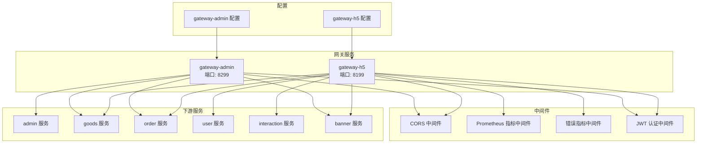
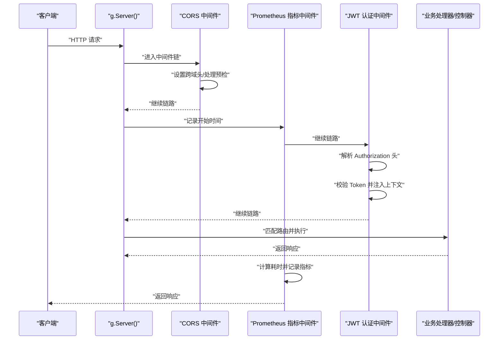
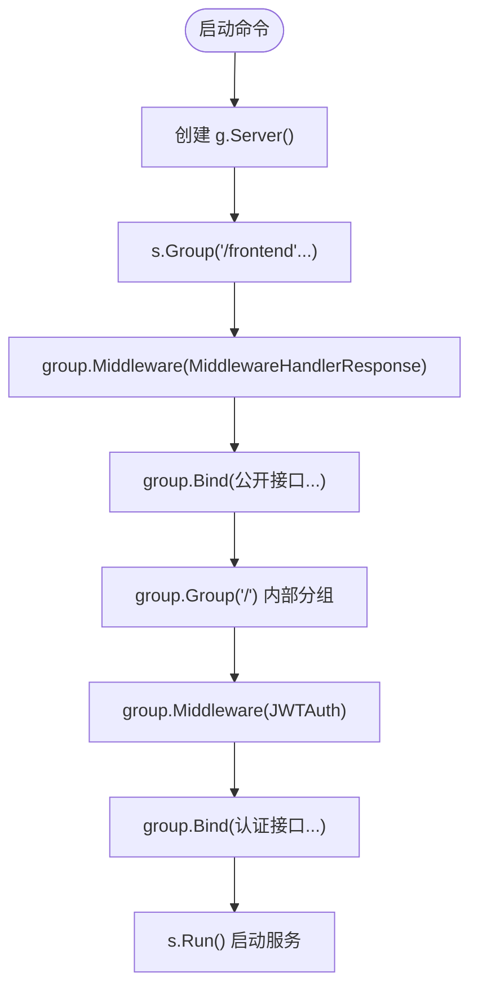
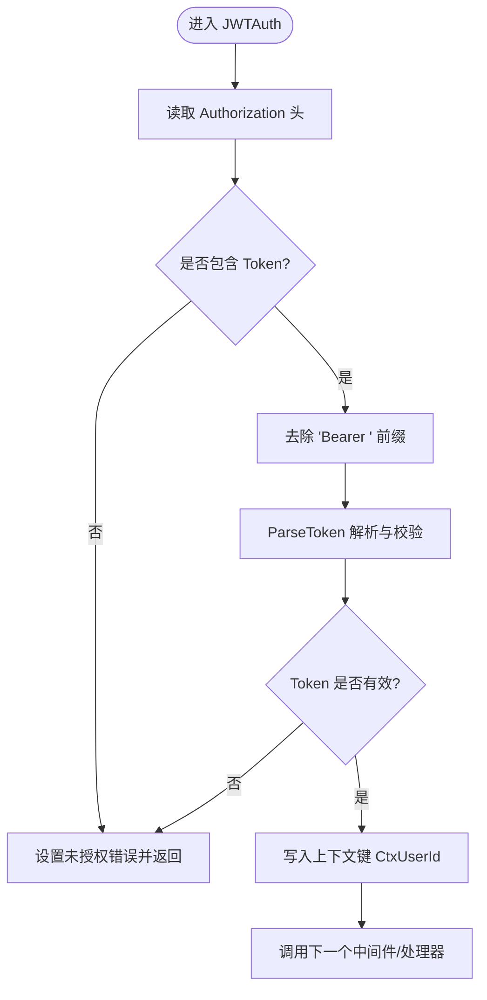
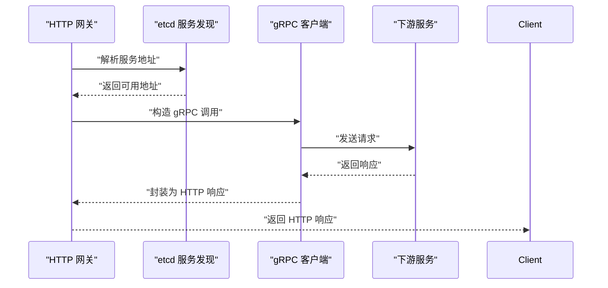
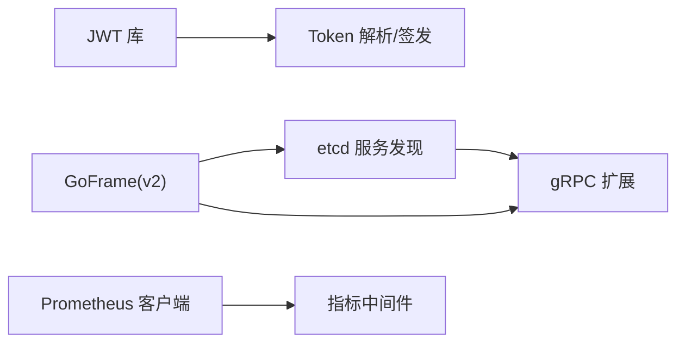

# HTTP REST API通信

<cite>
**本文引用的文件**
- [app/gateway-admin/main.go](file://app/gateway-admin/main.go)
- [app/gateway-h5/main.go](file://app/gateway-h5/main.go)
- [app/gateway-admin/internal/cmd/cmd.go](file://app/gateway-admin/internal/cmd/cmd.go)
- [app/gateway-h5/internal/cmd/cmd.go](file://app/gateway-h5/internal/cmd/cmd.go)
- [utility/middleware/middleware.go](file://utility/middleware/middleware.go)
- [utility/middleware/jwt.go](file://utility/middleware/jwt.go)
- [utility/token.go](file://utility/token.go)
- [utility/metrics/middleware.go](file://utility/metrics/middleware.go)
- [app/gateway-admin/manifest/config/config.prod.yaml](file://app/gateway-admin/manifest/config/config.prod.yaml)
- [app/gateway-h5/manifest/config/config.prod.yaml](file://app/gateway-h5/manifest/config/config.prod.yaml)
- [go.mod](file://go.mod)
</cite>

## 目录
1. [简介](#简介)
2. [项目结构](#项目结构)
3. [核心组件](#核心组件)
4. [架构总览](#架构总览)
5. [详细组件分析](#详细组件分析)
6. [依赖关系分析](#依赖关系分析)
7. [性能考虑](#性能考虑)
8. [故障排查指南](#故障排查指南)
9. [结论](#结论)
10. [附录](#附录)

## 简介
本文件面向基于 GoFrame 框架的 HTTP REST API 通信实现，聚焦以下主题：
- HTTP 服务器初始化、路由注册与分组
- 中间件体系：CORS、Prometheus 指标采集、JWT 认证
- 请求处理流程与 ghttp.RouterGroup 的使用
- HTTP 网关如何将请求转发至下游服务（通过 gRPC 客户端与 etcd 服务发现）
- Bind 方法的绑定机制与典型路由配置示例

## 项目结构
本仓库采用多模块微服务结构，其中网关模块（gateway-admin、gateway-h5）负责对外暴露统一入口，内部通过 etcd 进行服务发现，并使用 gRPC 客户端调用后端服务。

图表来源
- [app/gateway-admin/main.go](file://app/gateway-admin/main.go#L13-L29)
- [app/gateway-h5/main.go](file://app/gateway-h5/main.go#L13-L37)
- [app/gateway-admin/internal/cmd/cmd.go](file://app/gateway-admin/internal/cmd/cmd.go#L20-L42)
- [app/gateway-h5/internal/cmd/cmd.go](file://app/gateway-h5/internal/cmd/cmd.go#L22-L96)
- [utility/middleware/middleware.go](file://utility/middleware/middleware.go#L10-L23)
- [utility/metrics/middleware.go](file://utility/metrics/middleware.go#L9-L34)
- [app/gateway-admin/manifest/config/config.prod.yaml](file://app/gateway-admin/manifest/config/config.prod.yaml#L1-L18)
- [app/gateway-h5/manifest/config/config.prod.yaml](file://app/gateway-h5/manifest/config/config.prod.yaml#L1-L18)

章节来源
- [app/gateway-admin/main.go](file://app/gateway-admin/main.go#L1-L30)
- [app/gateway-h5/main.go](file://app/gateway-h5/main.go#L1-L38)
- [app/gateway-admin/internal/cmd/cmd.go](file://app/gateway-admin/internal/cmd/cmd.go#L1-L46)
- [app/gateway-h5/internal/cmd/cmd.go](file://app/gateway-h5/internal/cmd/cmd.go#L1-L100)
- [app/gateway-admin/manifest/config/config.prod.yaml](file://app/gateway-admin/manifest/config/config.prod.yaml#L1-L18)
- [app/gateway-h5/manifest/config/config.prod.yaml](file://app/gateway-h5/manifest/config/config.prod.yaml#L1-L18)

## 核心组件
- HTTP 服务器与中间件
  - CORS 中间件：设置跨域头并处理预检请求
  - Prometheus 指标中间件：记录请求耗时、状态码等
  - 错误指标中间件：根据响应状态分类统计错误
  - JWT 认证中间件：解析 Authorization 头中的 Bearer Token，校验并注入用户上下文
- 路由注册与分组
  - 使用 ghttp.RouterGroup 对路由进行分组与中间件绑定
  - 使用 Bind 方法批量绑定控制器或方法
- 服务发现与网关转发
  - 通过 etcd 注册 gRPC 服务解析器
  - 网关内部使用 gRPC 客户端调用下游服务（见下节“详细组件分析”）

章节来源
- [utility/middleware/middleware.go](file://utility/middleware/middleware.go#L10-L23)
- [utility/metrics/middleware.go](file://utility/metrics/middleware.go#L9-L34)
- [utility/middleware/jwt.go](file://utility/middleware/jwt.go#L16-L38)
- [app/gateway-admin/internal/cmd/cmd.go](file://app/gateway-admin/internal/cmd/cmd.go#L20-L42)
- [app/gateway-h5/internal/cmd/cmd.go](file://app/gateway-h5/internal/cmd/cmd.go#L22-L96)

## 架构总览
下图展示了 HTTP 网关的启动、中间件链路与路由分组的整体流程：

图表来源
- [app/gateway-h5/main.go](file://app/gateway-h5/main.go#L23-L37)
- [utility/middleware/middleware.go](file://utility/middleware/middleware.go#L10-L23)
- [utility/metrics/middleware.go](file://utility/metrics/middleware.go#L9-L34)
- [utility/middleware/jwt.go](file://utility/middleware/jwt.go#L16-L38)
- [app/gateway-h5/internal/cmd/cmd.go](file://app/gateway-h5/internal/cmd/cmd.go#L33-L91)

## 详细组件分析

### HTTP 服务器与中间件初始化
- 网关启动时读取 etcd 地址并注册 gRPC 解析器，用于服务发现
- 创建 g.Server() 实例并启用 CORS 中间件
- H5 网关额外启用 Prometheus 指标与错误指标中间件，并注册 /metrics 端点

章节来源
- [app/gateway-admin/main.go](file://app/gateway-admin/main.go#L13-L29)
- [app/gateway-h5/main.go](file://app/gateway-h5/main.go#L13-L37)

### ghttp.RouterGroup 使用与 Bind 绑定机制
- 使用 s.Group(prefix, handler) 创建路由分组
- 在分组内通过 group.Middleware(...) 绑定中间件（如 ghttp.MiddlewareHandlerResponse、JWTAuth）
- 使用 group.Bind(...) 将控制器或方法批量绑定到当前分组下的根路径
- 分组支持嵌套，便于区分公开路由与认证路由

图表来源
- [app/gateway-h5/internal/cmd/cmd.go](file://app/gateway-h5/internal/cmd/cmd.go#L22-L96)
- [app/gateway-admin/internal/cmd/cmd.go](file://app/gateway-admin/internal/cmd/cmd.go#L20-L42)

章节来源
- [app/gateway-h5/internal/cmd/cmd.go](file://app/gateway-h5/internal/cmd/cmd.go#L17-L96)
- [app/gateway-admin/internal/cmd/cmd.go](file://app/gateway-admin/internal/cmd/cmd.go#L15-L46)

### JWT 认证中间件工作原理与配置
- 输入：请求头 Authorization: Bearer <token>
- 步骤：
  1) 读取 Authorization 头，若为空则返回未授权错误
  2) 去除 "Bearer " 前缀
  3) 使用 ParseToken 解析并校验签名
  4) 成功后将用户 ID 写入请求上下文键 CtxUserId，并放行
- 配置要点：
  - 令牌签名密钥在 utility/token.go 中定义
  - 网关侧仅负责解析与注入，不包含签发逻辑

图表来源
- [utility/middleware/jwt.go](file://utility/middleware/jwt.go#L16-L38)
- [utility/token.go](file://utility/token.go#L52-L64)

章节来源
- [utility/middleware/jwt.go](file://utility/middleware/jwt.go#L12-L38)
- [utility/token.go](file://utility/token.go#L16-L18)
- [utility/token.go](file://utility/token.go#L52-L64)

### HTTP 网关到下游服务的转发
- 服务发现：通过 etcd 注册 gRPC 解析器，使 gRPC 客户端能解析服务名
- 调用链：网关接收 HTTP 请求 -> 解析参数 -> 调用下游 gRPC 服务 -> 返回响应
- 本仓库中，网关启动时注册 etcd 解析器；实际 gRPC 客户端调用位于各服务内部（例如 user、goods、order 等模块），网关通过控制器层间接调用这些服务

图表来源
- [app/gateway-admin/main.go](file://app/gateway-admin/main.go#L15-L21)
- [app/gateway-h5/main.go](file://app/gateway-h5/main.go#L15-L21)
- [go.mod](file://go.mod#L9-L11)

章节来源
- [app/gateway-admin/main.go](file://app/gateway-admin/main.go#L15-L21)
- [app/gateway-h5/main.go](file://app/gateway-h5/main.go#L15-L21)
- [go.mod](file://go.mod#L9-L11)

### 公共路由与认证路由配置示例
- H5 网关示例
  - 公开路由：用户注册/登录、商品列表/详情、轮播图等
  - 认证路由：收货地址、购物车、订单、互动、优惠券等
  - 认证路由通过 group.Middleware(JWTAuth) 统一保护
- 管理后台网关示例
  - 后台管理公开接口与认证接口分别置于 /backend 下的不同分组
  - 认证接口同样通过 JWTAuth 保护

章节来源
- [app/gateway-h5/internal/cmd/cmd.go](file://app/gateway-h5/internal/cmd/cmd.go#L33-L91)
- [app/gateway-admin/internal/cmd/cmd.go](file://app/gateway-admin/internal/cmd/cmd.go#L20-L42)

### 不同类型 HTTP 请求的处理
- GET/POST/DELETE/PUT/Options：CORS 中间件统一允许并处理预检
- Prometheus 指标中间件记录请求方法、路径、状态码与耗时
- 错误指标中间件根据状态码范围分类统计错误

章节来源
- [utility/middleware/middleware.go](file://utility/middleware/middleware.go#L10-L23)
- [utility/metrics/middleware.go](file://utility/metrics/middleware.go#L9-L34)
- [utility/metrics/middleware.go](file://utility/metrics/middleware.go#L36-L61)

## 依赖关系分析
- 网关依赖
  - etcd 服务发现：用于 gRPC 服务解析
  - Prometheus 客户端：用于指标采集与导出
  - JWT 库：用于 Token 解析与校验
- 关键依赖版本
  - github.com/gogf/gf/v2
  - github.com/gogf/gf/contrib/registry/etcd/v2
  - github.com/gogf/gf/contrib/rpc/grpcx/v2
  - github.com/golang-jwt/jwt/v4
  - github.com/prometheus/client_golang

图表来源
- [go.mod](file://go.mod#L5-L22)

章节来源
- [go.mod](file://go.mod#L5-L22)

## 性能考虑
- 中间件顺序影响性能：CORS 与指标中间件应尽量前置，避免对后续处理造成不必要的负担
- 指标维度选择：路径使用 r.Router.Uri 或 r.URL.Path，避免高基数导致指标膨胀
- 超时控制：gRPC 调用可通过拦截器设置超时，防止下游慢请求拖垮网关
- 日志与上下文：合理使用 traceId 等上下文键，便于链路追踪与问题定位

## 故障排查指南
- CORS 相关问题
  - 确认已启用 CORS 中间件且预检请求返回 204
- JWT 认证失败
  - 检查 Authorization 头格式是否为 Bearer <token>
  - 核对签名密钥与 Token 有效期
- 指标无法收集
  - 确认 Prometheus 中间件已启用且 /metrics 端点已注册
- 服务发现异常
  - 检查 etcd 地址配置与可达性

章节来源
- [utility/middleware/middleware.go](file://utility/middleware/middleware.go#L10-L23)
- [utility/middleware/jwt.go](file://utility/middleware/jwt.go#L16-L38)
- [utility/metrics/middleware.go](file://utility/metrics/middleware.go#L9-L34)
- [app/gateway-h5/main.go](file://app/gateway-h5/main.go#L23-L37)
- [app/gateway-admin/manifest/config/config.prod.yaml](file://app/gateway-admin/manifest/config/config.prod.yaml#L16-L18)
- [app/gateway-h5/manifest/config/config.prod.yaml](file://app/gateway-h5/manifest/config/config.prod.yaml#L16-L18)

## 结论
本项目基于 GoFrame 提供了清晰的 HTTP 网关实现：通过 ghttp.RouterGroup 实现路由分组与中间件链式处理，结合 etcd 服务发现与 gRPC 客户端完成对下游服务的统一接入。JWT 认证中间件提供了统一的鉴权能力，Prometheus 中间件完善了可观测性。通过合理的中间件顺序与指标维度选择，可在保证性能的同时提升系统的可维护性与可观察性。

## 附录
- 端口与配置
  - gateway-admin：监听端口见配置文件
  - gateway-h5：监听端口见配置文件
- 关键路径参考
  - 管理后台路由注册：[app/gateway-admin/internal/cmd/cmd.go](file://app/gateway-admin/internal/cmd/cmd.go#L20-L42)
  - H5 网关路由注册：[app/gateway-h5/internal/cmd/cmd.go](file://app/gateway-h5/internal/cmd/cmd.go#L22-L96)
  - CORS 中间件：[utility/middleware/middleware.go](file://utility/middleware/middleware.go#L10-L23)
  - Prometheus 指标中间件：[utility/metrics/middleware.go](file://utility/metrics/middleware.go#L9-L34)
  - JWT 认证中间件：[utility/middleware/jwt.go](file://utility/middleware/jwt.go#L16-L38)
  - Token 工具：[utility/token.go](file://utility/token.go#L52-L64)
  - etcd 注册与 gRPC 客户端：[app/gateway-h5/main.go](file://app/gateway-h5/main.go#L15-L21)