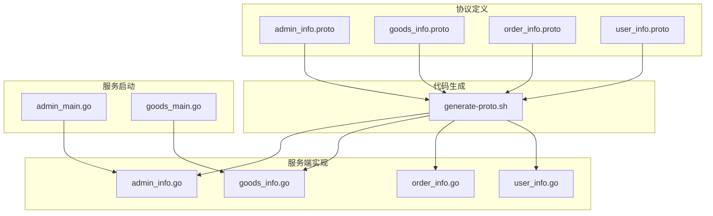
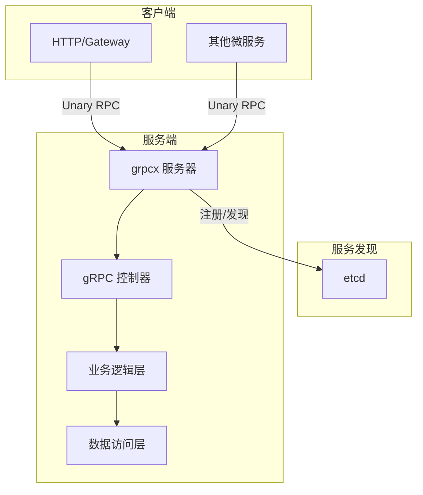
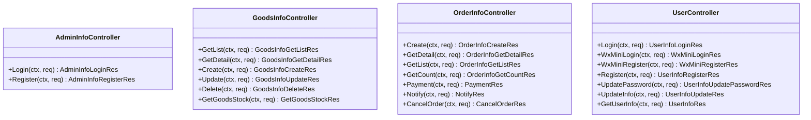
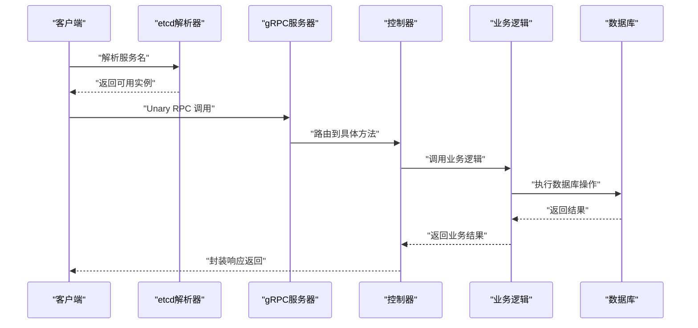
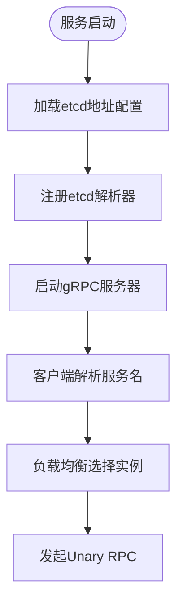
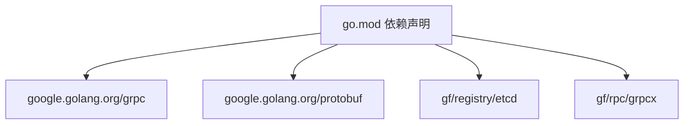

# gRPC通信机制

<cite>
**本文引用的文件**
- [admin_info.proto](file://app/admin/manifest/protobuf/admin_info/v1/admin_info.proto)
- [goods_info.proto](file://app/goods/manifest/protobuf/goods_info/v1/goods_info.proto)
- [order_info.proto](file://app/order/manifest/protobuf/order_info/v1/order_info.proto)
- [user_info.proto](file://app/user/manifest/protobuf/user_info/v1/user_info.proto)
- [generate-proto.sh](file://generate-proto.sh)
- [admin_info.go](file://app/admin/internal/controller/admin_info/admin_info.go)
- [goods_info.go](file://app/goods/internal/controller/goods_info/goods_info.go)
- [order_info.go](file://app/order/internal/controller/order_info/order_info.go)
- [user_info.go](file://app/user/internal/controller/user_info/user_info.go)
- [admin_main.go](file://app/admin/main.go)
- [goods_main.go](file://app/goods/main.go)
- [go.mod](file://go.mod)
- [admin_info_grpc.pb.go](file://app/admin/api/admin_info/v1/admin_info_grpc.pb.go)
- [goods_info_grpc.pb.go](file://app/goods/api/goods_info/v1/goods_info_grpc.pb.go)
- [order_info_grpc.pb.go](file://app/order/api/order_info/v1/order_info_grpc.pb.go)
- [user_info_grpc.pb.go](file://app/user/api/user_info/v1/user_info_grpc.pb.go)
</cite>

## 目录
1. [简介](#简介)
2. [项目结构](#项目结构)
3. [核心组件](#核心组件)
4. [架构总览](#架构总览)
5. [详细组件分析](#详细组件分析)
6. [依赖关系分析](#依赖关系分析)
7. [性能考虑](#性能考虑)
8. [故障排查指南](#故障排查指南)
9. [结论](#结论)
10. [附录](#附录)

## 简介
本文件系统性阐述本仓库的gRPC通信机制，涵盖Protocol Buffers定义与使用、服务端与客户端实现、双向通信与流式处理能力、连接复用与负载均衡、服务注册与发现（etcd）、错误处理与超时控制等主题。通过对多个业务服务（管理员、商品、订单、用户）的gRPC接口进行深入分析，帮助读者快速理解并正确使用本项目的gRPC通信体系。

## 项目结构
- Protocol Buffers定义集中在各业务模块的manifest/protobuf目录下，每个服务独立维护proto文件，便于版本管理与团队协作。
- 通过统一的生成脚本批量生成Go语言的pb与grpc代码，确保跨模块的一致性。
- 服务端控制器位于internal/controller目录，负责将gRPC请求转发至业务逻辑层并返回响应。
- 服务启动入口在各模块的main.go中，统一注册etcd服务发现与gRPC服务器。

**图表来源**
- [admin_info.proto](file://app/admin/manifest/protobuf/admin_info/v1/admin_info.proto#L1-L40)
- [goods_info.proto](file://app/goods/manifest/protobuf/goods_info/v1/goods_info.proto#L1-L108)
- [order_info.proto](file://app/order/manifest/protobuf/order_info/v1/order_info.proto#L1-L162)
- [user_info.proto](file://app/user/manifest/protobuf/user_info/v1/user_info.proto#L1-L123)
- [generate-proto.sh](file://generate-proto.sh#L1-L18)
- [admin_info.go](file://app/admin/internal/controller/admin_info/admin_info.go#L1-L73)
- [goods_info.go](file://app/goods/internal/controller/goods_info/goods_info.go#L1-L257)
- [order_info.go](file://app/order/internal/controller/order_info/order_info.go#L1-L188)
- [user_info.go](file://app/user/internal/controller/user_info/user_info.go#L1-L268)
- [admin_main.go](file://app/admin/main.go#L1-L25)
- [goods_main.go](file://app/goods/main.go#L1-L35)

**章节来源**
- [generate-proto.sh](file://generate-proto.sh#L1-L18)
- [admin_info.proto](file://app/admin/manifest/protobuf/admin_info/v1/admin_info.proto#L1-L40)
- [goods_info.proto](file://app/goods/manifest/protobuf/goods_info/v1/goods_info.proto#L1-L108)
- [order_info.proto](file://app/order/manifest/protobuf/order_info/v1/order_info.proto#L1-L162)
- [user_info.proto](file://app/user/manifest/protobuf/user_info/v1/user_info.proto#L1-L123)

## 核心组件
- Protocol Buffers消息与服务定义：每个业务模块在proto中定义服务方法与消息结构，采用清晰的命名空间与包组织，支持导入公共实体消息。
- gRPC服务端控制器：实现具体服务方法，负责参数校验、调用业务逻辑、错误包装与响应组装。
- 代码生成工具链：通过shell脚本遍历proto文件并生成pb与grpc代码，保证一致性与可重复性。
- etcd服务注册与发现：服务启动时注册etcd解析器，客户端通过服务名解析目标实例，实现动态发现与负载均衡。
- 客户端调用示例：通过生成的grpc客户端接口调用远程服务，遵循Unary RPC模式。

**章节来源**
- [admin_info.proto](file://app/admin/manifest/protobuf/admin_info/v1/admin_info.proto#L9-L15)
- [goods_info.proto](file://app/goods/manifest/protobuf/goods_info/v1/goods_info.proto#L9-L22)
- [order_info.proto](file://app/order/manifest/protobuf/order_info/v1/order_info.proto#L11-L19)
- [user_info.proto](file://app/user/manifest/protobuf/user_info/v1/user_info.proto#L8-L23)
- [admin_info.go](file://app/admin/internal/controller/admin_info/admin_info.go#L19-L21)
- [goods_info.go](file://app/goods/internal/controller/goods_info/goods_info.go#L27-L29)
- [order_info.go](file://app/order/internal/controller/order_info/order_info.go#L24-L26)
- [user_info.go](file://app/user/internal/controller/user_info/user_info.go#L33-L35)
- [generate-proto.sh](file://generate-proto.sh#L13-L16)
- [admin_main.go](file://app/admin/main.go#L21)
- [goods_main.go](file://app/goods/main.go#L31)

## 架构总览
本项目采用“服务端控制器 + 业务逻辑 + 数据访问”的分层架构，gRPC作为跨服务通信的统一协议。服务端通过grpcx框架注册服务，客户端通过etcd解析器进行服务发现与负载均衡。

**图表来源**
- [admin_main.go](file://app/admin/main.go#L21)
- [goods_main.go](file://app/goods/main.go#L31)
- [admin_info.go](file://app/admin/internal/controller/admin_info/admin_info.go#L19-L21)
- [goods_info.go](file://app/goods/internal/controller/goods_info/goods_info.go#L27-L29)

## 详细组件分析

### Protocol Buffers定义与使用
- 管理员服务：定义登录与注册两个Unary RPC方法，响应中包含JWT令牌与过期时间等字段。
- 商品服务：提供列表、详情、创建、更新、删除、批量库存查询等方法，使用公共实体消息与复杂嵌套结构。
- 订单服务：包含创建、详情、列表、计数、支付、回调、取消等方法，支持微信支付场景。
- 用户服务：提供用户名/密码登录、微信小程序登录与注册、修改密码、更新信息、获取用户信息等方法。

字段规则与约束：
- 字段编号需从1开始且保持递增，避免冲突。
- 使用google.protobuf.timestamp表示时间字段，确保跨语言一致性。
- 使用repeated与map表达集合与键值映射，满足批量查询与映射场景。
- 通过option go_package指定生成路径，确保模块化组织。

**章节来源**
- [admin_info.proto](file://app/admin/manifest/protobuf/admin_info/v1/admin_info.proto#L1-L40)
- [goods_info.proto](file://app/goods/manifest/protobuf/goods_info/v1/goods_info.proto#L1-L108)
- [order_info.proto](file://app/order/manifest/protobuf/order_info/v1/order_info.proto#L1-L162)
- [user_info.proto](file://app/user/manifest/protobuf/user_info/v1/user_info.proto#L1-L123)

### gRPC服务端控制器实现
- 控制器结构体继承Unimplemented*Server以确保兼容性，通过Register函数在grpcx服务器上注册服务。
- 每个方法均接收context.Context与请求消息，返回响应消息与错误；错误通过gerror与gcode进行封装，便于上层统一处理。
- 时间字段转换：使用timestamppb.New与CheckValid进行时间转换与校验。
- 数据转换：通过gconv.Struct在数据库实体与pb消息间进行转换，注意特殊字段（如时间）的手工转换。

**图表来源**
- [admin_info.go](file://app/admin/internal/controller/admin_info/admin_info.go#L15-L73)
- [goods_info.go](file://app/goods/internal/controller/goods_info/goods_info.go#L23-L257)
- [order_info.go](file://app/order/internal/controller/order_info/order_info.go#L20-L188)
- [user_info.go](file://app/user/internal/controller/user_info/user_info.go#L29-L268)

**章节来源**
- [admin_info.go](file://app/admin/internal/controller/admin_info/admin_info.go#L19-L73)
- [goods_info.go](file://app/goods/internal/controller/goods_info/goods_info.go#L27-L257)
- [order_info.go](file://app/order/internal/controller/order_info/order_info.go#L24-L188)
- [user_info.go](file://app/user/internal/controller/user_info/user_info.go#L33-L268)

### 代码生成与客户端调用
- 生成脚本：遍历项目中所有proto文件，使用protoc生成pb与grpc代码，输出到原位置，便于版本控制与一致性。
- 客户端接口：生成的grpc.pb.go文件包含服务描述与客户端接口，客户端可通过NewXxxClient创建连接并调用方法。
- 调用示例路径：可在生成的grpc.pb.go中查看服务常量与客户端接口定义，例如GetList、Create、Update、Delete等方法的完整方法名与接口签名。

**图表来源**
- [admin_main.go](file://app/admin/main.go#L21)
- [goods_main.go](file://app/goods/main.go#L31)
- [admin_info_grpc.pb.go](file://app/admin/api/admin_info/v1/admin_info_grpc.pb.go#L100-L135)
- [goods_info_grpc.pb.go](file://app/goods/api/goods_info/v1/goods_info_grpc.pb.go#L118-L149)

**章节来源**
- [generate-proto.sh](file://generate-proto.sh#L13-L16)
- [admin_info_grpc.pb.go](file://app/admin/api/admin_info/v1/admin_info_grpc.pb.go#L22-L27)
- [goods_info_grpc.pb.go](file://app/goods/api/goods_info/v1/goods_info_grpc.pb.go#L22-L27)

### 服务注册与发现（etcd）
- 服务端：在main.go中读取etcd地址配置，注册grpcx解析器，使服务可通过服务名被发现。
- 客户端：通过相同解析器实现服务名到实例IP:Port的解析，结合gRPC内置负载均衡策略实现多实例间的流量分发。
- 配置依赖：go.mod中引入etcd注册中心与grpcx扩展，确保运行时可用。

**图表来源**
- [admin_main.go](file://app/admin/main.go#L15-L21)
- [goods_main.go](file://app/goods/main.go#L17-L31)
- [go.mod](file://go.mod#L9-L10)

**章节来源**
- [admin_main.go](file://app/admin/main.go#L15-L21)
- [goods_main.go](file://app/goods/main.go#L17-L31)
- [go.mod](file://go.mod#L9-L10)

### 错误处理、超时控制与重试机制
- 错误处理：统一使用gerror与gcode对业务错误进行封装，区分数据库操作错误、内部错误、未授权、未找到等场景，便于客户端识别与处理。
- 超时控制：在商品详情缓存场景中，使用context.WithTimeout为Redis写入设置短超时，避免阻塞主流程。
- 重试机制：项目中未直接实现gRPC重试，但可基于backoff库与上下文超时策略在客户端侧实现指数退避重试；对于幂等性要求高的场景（如订单取消），建议在业务层增加幂等键与状态检查。

**章节来源**
- [goods_info.go](file://app/goods/internal/controller/goods_info/goods_info.go#L151-L157)
- [order_info.go](file://app/order/internal/controller/order_info/order_info.go#L130-L187)
- [user_info.go](file://app/user/internal/controller/user_info/user_info.go#L95-L110)
- [go.mod](file://go.mod#L6)

## 依赖关系分析
- gRPC与Protobuf：google.golang.org/grpc与google.golang.org/protobuf提供核心通信与消息编解码能力。
- etcd注册中心：github.com/gogf/gf/contrib/registry/etcd/v2提供服务注册与发现。
- grpcx扩展：github.com/gogf/gf/contrib/rpc/grpcx/v2提供便捷的gRPC服务器与解析器集成。
- 工具库：gogf/gf/v2提供日志、配置、错误处理等基础设施。

**图表来源**
- [go.mod](file://go.mod#L5-L22)

**章节来源**
- [go.mod](file://go.mod#L5-L22)

## 性能考虑
- 连接复用：gRPC默认使用HTTP/2与连接复用，建议在高并发场景下合理设置连接池大小与超时参数。
- 序列化开销：使用proto3的紧凑二进制编码，减少网络传输与CPU消耗。
- 缓存策略：商品详情与库存查询中采用Redis缓存，降低数据库压力；注意空缓存标记与异步更新策略。
- 负载均衡：结合etcd解析器与gRPC内置LB策略，实现多实例间的流量分摊与故障隔离。

## 故障排查指南
- 服务无法发现：检查etcd地址配置与解析器注册是否正确，确认服务端已启动并注册到etcd。
- Unary RPC失败：查看控制器日志与错误封装，定位数据库操作错误或参数校验失败。
- 时间字段异常：确认使用timestamppb.New与CheckValid进行转换与校验。
- 缓存穿透：关注空缓存标记与Redis写入失败的告警，必要时回退到数据库查询。

**章节来源**
- [admin_info.go](file://app/admin/internal/controller/admin_info/admin_info.go#L23-L44)
- [goods_info.go](file://app/goods/internal/controller/goods_info/goods_info.go#L95-L158)
- [order_info.go](file://app/order/internal/controller/order_info/order_info.go#L39-L62)
- [user_info.go](file://app/user/internal/controller/user_info/user_info.go#L136-L187)

## 结论
本项目通过规范化的Protocol Buffers定义、统一的gRPC服务端控制器实现、完善的etcd服务发现与负载均衡、以及一致的错误处理与超时控制策略，构建了稳定高效的微服务通信体系。建议在客户端侧结合backoff与上下文超时实现重试机制，并持续优化缓存与数据库访问策略以提升整体性能。

## 附录
- 生成pb与grpc代码：执行generate-proto.sh，确保protoc已安装。
- 服务启动：在各模块main.go中完成etcd解析器注册与服务启动。
- 客户端调用：参考生成的grpc.pb.go中的服务常量与客户端接口定义进行调用。

**章节来源**
- [generate-proto.sh](file://generate-proto.sh#L1-L18)
- [admin_main.go](file://app/admin/main.go#L13-L24)
- [goods_main.go](file://app/goods/main.go#L15-L34)
- [admin_info_grpc.pb.go](file://app/admin/api/admin_info/v1/admin_info_grpc.pb.go#L22-L27)
- [goods_info_grpc.pb.go](file://app/goods/api/goods_info/v1/goods_info_grpc.pb.go#L22-L27)