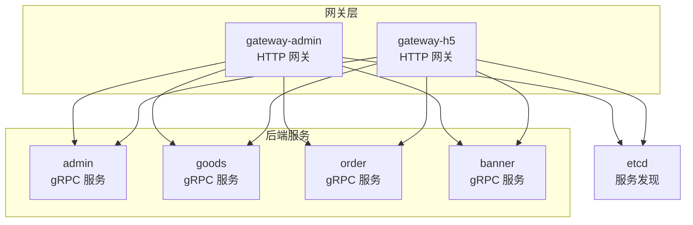
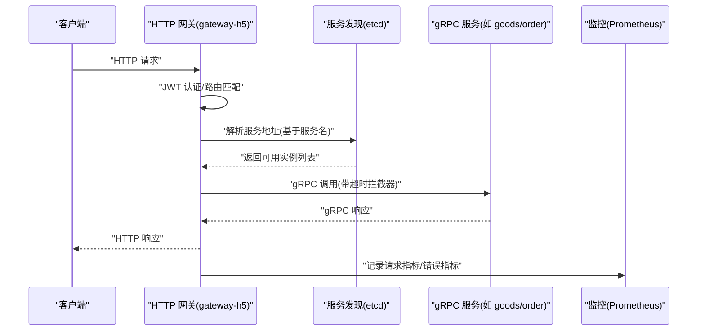
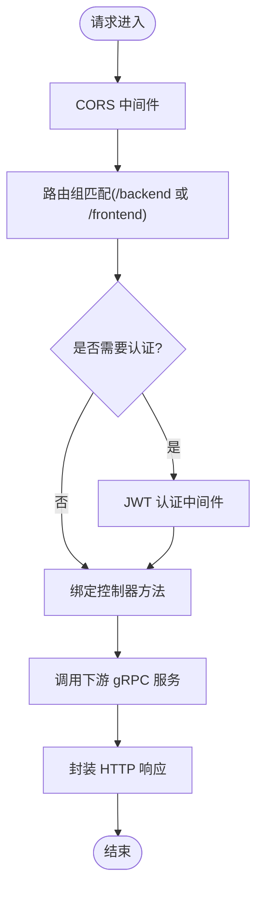
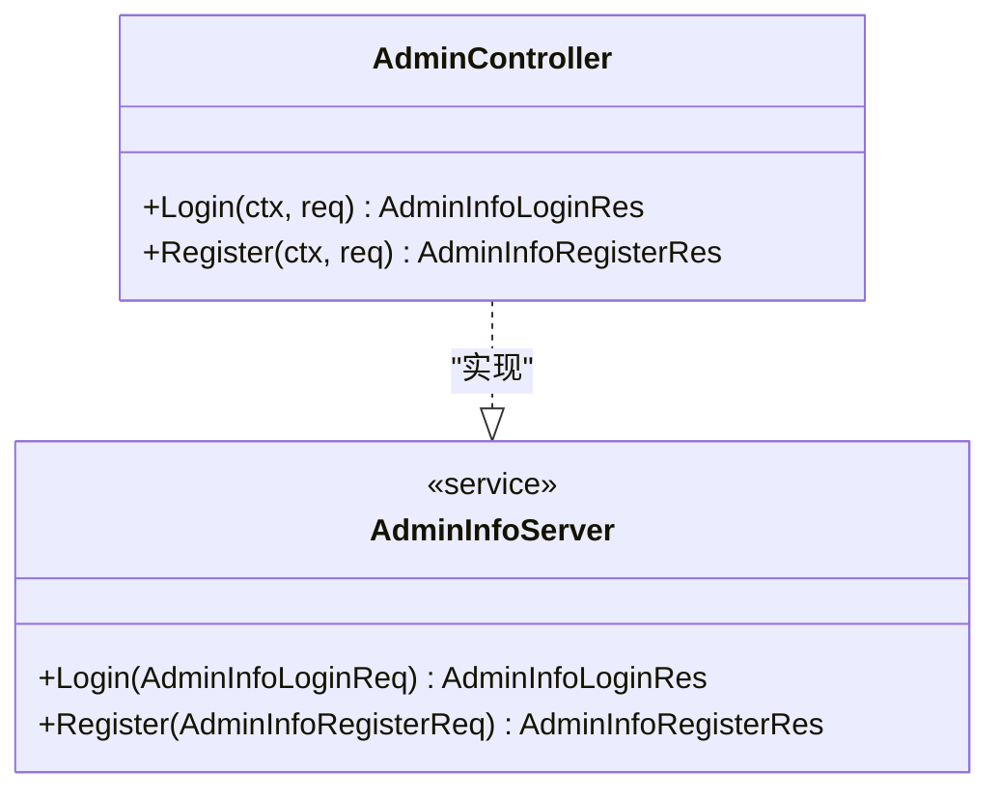
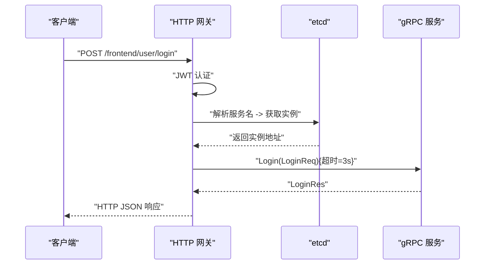
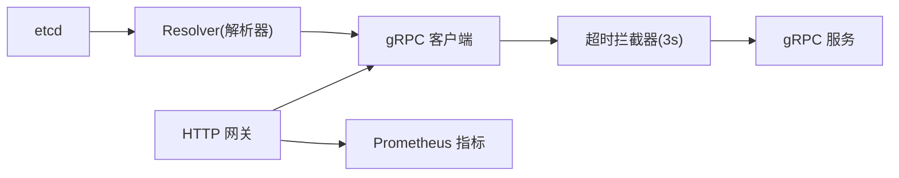

# 服务间通信机制

<cite>
**本文引用的文件**
- [app/gateway-admin/main.go](file://app/gateway-admin/main.go)
- [app/gateway-h5/main.go](file://app/gateway-h5/main.go)
- [app/admin/main.go](file://app/admin/main.go)
- [app/goods/main.go](file://app/goods/main.go)
- [app/order/main.go](file://app/order/main.go)
- [app/gateway-admin/internal/cmd/cmd.go](file://app/gateway-admin/internal/cmd/cmd.go)
- [app/gateway-h5/internal/cmd/cmd.go](file://app/gateway-h5/internal/cmd/cmd.go)
- [utility/middleware/middleware.go](file://utility/middleware/middleware.go)
- [utility/metrics/metrics.go](file://utility/metrics/metrics.go)
- [app/admin/internal/controller/admin_info/admin_info.go](file://app/admin/internal/controller/admin_info/admin_info.go)
- [app/admin/api/admin_info/v1/admin_info_grpc.pb.go](file://app/admin/api/admin_info/v1/admin_info_grpc.pb.go)
- [app/goods/api/coupon_info\v1/coupon_info_grpc.pb.go](file://app/goods/api/coupon_info\v1/coupon_info_grpc.pb.go)
- [app/banner/api/rotation_info\v1/rotation_info_grpc.pb.go](file://app/banner/api/rotation_info\v1/rotation_info_grpc.pb.go)
</cite>

## 目录
1. [引言](#引言)
2. [项目结构](#项目结构)
3. [核心组件](#核心组件)
4. [架构总览](#架构总览)
5. [详细组件分析](#详细组件分析)
6. [依赖分析](#依赖分析)
7. [性能考虑](#性能考虑)
8. [故障排查指南](#故障排查指南)
9. [结论](#结论)
10. [附录](#附录)

## 引言
本文件系统性梳理该微服务仓库的服务间通信机制，重点覆盖两类通信方式：HTTP REST API 与 gRPC。内容涵盖：
- HTTP 网关如何接收请求、进行路由分发、参数传递与响应处理；
- gRPC 的服务注册、拦截器与客户端调用模式；
- 负载均衡（基于 etcd 服务发现）、连接池管理与超时控制；
- 实战示例路径与协议选择建议。

## 项目结构
该项目采用多模块微服务架构，每个业务域独立为一个服务进程，统一通过 GoFrame 框架启动 HTTP 服务，并在需要时暴露 gRPC 服务。网关服务负责对外 HTTP 接口聚合与路由，内部通过 gRPC 调用后端服务。

图表来源
- [app/gateway-admin/main.go](file://app/gateway-admin/main.go#L13-L29)
- [app/gateway-h5/main.go](file://app/gateway-h5/main.go#L13-L37)
- [app/admin/main.go](file://app/admin/main.go#L13-L24)
- [app/goods/main.go](file://app/goods/main.go#L15-L34)
- [app/order/main.go](file://app/order/main.go#L12-L22)

章节来源
- [app/gateway-admin/main.go](file://app/gateway-admin/main.go#L1-L30)
- [app/gateway-h5/main.go](file://app/gateway-h5/main.go#L1-L38)
- [app/admin/main.go](file://app/admin/main.go#L1-L25)
- [app/goods/main.go](file://app/goods/main.go#L1-L35)
- [app/order/main.go](file://app/order/main.go#L1-L23)

## 核心组件
- HTTP 网关
  - gateway-admin：后台管理网关，绑定后台路由组与 JWT 认证中间件。
  - gateway-h5：前台 H5 网关，绑定用户、商品、订单、互动、横幅等接口，内置 Prometheus 指标与 CORS 支持。
- gRPC 服务
  - admin：提供管理员登录、注册等 RPC 方法。
  - goods：提供优惠券、商品等 RPC 方法。
  - order：提供订单、退款等 RPC 方法。
  - banner：提供轮播图等 RPC 方法。
- 通用中间件与监控
  - CORS 中间件：统一设置跨域头与预检处理。
  - gRPC 客户端超时拦截器：统一设置 3 秒超时。
  - Prometheus 指标：HTTP 请求总量、延迟直方图、错误计数。

章节来源
- [app/gateway-admin/internal/cmd/cmd.go](file://app/gateway-admin/internal/cmd/cmd.go#L16-L44)
- [app/gateway-h5/internal/cmd/cmd.go](file://app/gateway-h5/internal/cmd/cmd.go#L18-L99)
- [utility/middleware/middleware.go](file://utility/middleware/middleware.go#L10-L34)
- [utility/metrics/metrics.go](file://utility/metrics/metrics.go#L14-L71)

## 架构总览
下图展示了 HTTP 网关与后端 gRPC 服务之间的交互流程，以及服务发现与监控的关键节点。

图表来源
- [app/gateway-h5/main.go](file://app/gateway-h5/main.go#L13-L37)
- [utility/middleware/middleware.go](file://utility/middleware/middleware.go#L26-L34)
- [utility/metrics/metrics.go](file://utility/metrics/metrics.go#L45-L71)

## 详细组件分析

### HTTP 网关：路由与中间件
- 路由组织
  - gateway-admin：后台路由组绑定控制器，部分接口需 JWT 认证。
  - gateway-h5：前端路由组分别绑定公开与认证接口，支持微信登录、支付回调、购物车、订单等。
- 中间件
  - CORS：允许跨域访问与预检处理。
  - JWTAuth：对认证路由进行鉴权。
  - Prometheus 指标中间件：统计请求量、延迟与错误。
- 参数与响应
  - 网关负责参数校验与错误包装，再转发至下游 gRPC 服务；响应由下游服务生成，网关按需转换或透传。

图表来源
- [app/gateway-admin/internal/cmd/cmd.go](file://app/gateway-admin/internal/cmd/cmd.go#L20-L39)
- [app/gateway-h5/internal/cmd/cmd.go](file://app/gateway-h5/internal/cmd/cmd.go#L22-L91)
- [utility/middleware/middleware.go](file://utility/middleware/middleware.go#L10-L23)

章节来源
- [app/gateway-admin/internal/cmd/cmd.go](file://app/gateway-admin/internal/cmd/cmd.go#L16-L44)
- [app/gateway-h5/internal/cmd/cmd.go](file://app/gateway-h5/internal/cmd/cmd.go#L18-L99)
- [utility/middleware/middleware.go](file://utility/middleware/middleware.go#L10-L34)
- [utility/metrics/metrics.go](file://utility/metrics/metrics.go#L45-L71)

### gRPC 服务：服务注册与拦截器
- 服务注册
  - 后端服务在 main 中注册 etcd 服务发现解析器，使客户端可通过服务名解析到具体实例。
  - 控制器实现对应 gRPC 服务接口，并通过框架提供的注册函数完成注册。
- 客户端拦截器
  - 统一设置 3 秒超时，避免请求阻塞。
- 协议缓冲区
  - 使用 .proto 生成的 pb 文件承载请求/响应结构，保证前后端序列化一致。

图表来源
- [app/admin/internal/controller/admin_info/admin_info.go](file://app/admin/internal/controller/admin_info/admin_info.go#L15-L73)
- [app/admin/api/admin_info/v1/admin_info_grpc.pb.go](file://app/admin/api/admin_info/v1/admin_info_grpc.pb.go#L100-L135)

章节来源
- [app/admin/main.go](file://app/admin/main.go#L13-L24)
- [app/admin/internal/controller/admin_info/admin_info.go](file://app/admin/internal/controller/admin_info/admin_info.go#L19-L21)
- [app/admin/api/admin_info/v1/admin_info_grpc.pb.go](file://app/admin/api/admin_info/v1/admin_info_grpc.pb.go#L100-L135)
- [utility/middleware/middleware.go](file://utility/middleware/middleware.go#L26-L34)

### gRPC 客户端调用示例（路径）
以下为常见调用路径示例，便于快速定位实现位置：
- 商品优惠券列表查询
  - 服务端处理器：[coupon_info_grpc.pb.go](file://app/goods/api/coupon_info\v1/coupon_info_grpc.pb.go#L138-L152)
- 轮播图列表查询
  - 服务端处理器：[rotation_info_grpc.pb.go](file://app/banner/api/rotation_info\v1/rotation_info_grpc.pb.go#L138-L149)

章节来源
- [app/goods/api/coupon_info\v1/coupon_info_grpc.pb.go](file://app/goods/api/coupon_info\v1/coupon_info_grpc.pb.go#L138-L152)
- [app/banner/api/rotation_info\v1/rotation_info_grpc.pb.go](file://app/banner/api/rotation_info\v1/rotation_info_grpc.pb.go#L138-L149)

### HTTP 网关到下游服务的调用序列

图表来源
- [app/gateway-h5/internal/cmd/cmd.go](file://app/gateway-h5/internal/cmd/cmd.go#L56-L89)
- [utility/middleware/middleware.go](file://utility/middleware/middleware.go#L26-L34)

## 依赖分析
- 服务发现与负载均衡
  - 所有服务在启动时注册 etcd 解析器，HTTP 网关通过服务名解析下游实例，实现基于 etcd 的服务发现与负载均衡。
- 连接池与超时
  - gRPC 客户端统一注入超时拦截器，默认 3 秒；连接池由底层 gRPC 管理。
- 监控与可观测性
  - 网关侧启用 Prometheus 指标中间件，暴露 /metrics 端点，记录请求总量、延迟与错误。

图表来源
- [app/gateway-admin/main.go](file://app/gateway-admin/main.go#L20-L21)
- [app/gateway-h5/main.go](file://app/gateway-h5/main.go#L20-L21)
- [utility/middleware/middleware.go](file://utility/middleware/middleware.go#L26-L34)
- [utility/metrics/metrics.go](file://utility/metrics/metrics.go#L45-L71)

章节来源
- [app/gateway-admin/main.go](file://app/gateway-admin/main.go#L13-L29)
- [app/gateway-h5/main.go](file://app/gateway-h5/main.go#L13-L37)
- [utility/middleware/middleware.go](file://utility/middleware/middleware.go#L26-L34)
- [utility/metrics/metrics.go](file://utility/metrics/metrics.go#L45-L71)

## 性能考虑
- 超时控制
  - 建议根据接口 SLA 调整超时时间，避免长尾请求拖垮网关。
- 连接池
  - 合理配置 gRPC 客户端连接复用，减少握手开销；在高并发场景下评估连接上限。
- 负载均衡
  - 结合 etcd 服务发现，确保实例健康检查与权重策略满足流量分布需求。
- 监控
  - 通过 Prometheus 指标持续观察延迟、错误率与吞吐，及时发现异常。

## 故障排查指南
- CORS 问题
  - 确认网关已启用 CORS 中间件，且允许的源、方法、头正确配置。
- 认证失败
  - 检查 JWT 中间件是否正确挂载到目标路由组，Token 是否过期或格式错误。
- gRPC 调用超时
  - 检查超时拦截器是否生效，必要时调整超时阈值；确认下游服务处理耗时。
- 指标不可见
  - 确认 Prometheus 中间件已注册，/metrics 端点可达，标签维度完整。

章节来源
- [utility/middleware/middleware.go](file://utility/middleware/middleware.go#L10-L34)
- [utility/metrics/metrics.go](file://utility/metrics/metrics.go#L45-L71)

## 结论
本项目通过 HTTP 网关聚合对外接口，内部以 gRPC 实现服务间高效通信，并结合 etcd 服务发现与 Prometheus 监控，形成清晰、可扩展的服务间通信体系。HTTP 适合面向浏览器/移动端的 REST 场景，gRPC 则适用于高性能、强类型约束的微服务内调用。实践中应依据接口特性、SLA 与团队技术栈选择合适的通信协议。

## 附录
- 代码示例路径（不展示具体代码内容）
  - 管理员登录 RPC 实现：[app/admin/internal/controller/admin_info/admin_info.go](file://app/admin/internal/controller/admin_info/admin_info.go#L23-L44)
  - 服务端 gRPC 登录处理器：[app/admin/api/admin_info/v1/admin_info_grpc.pb.go](file://app/admin/api/admin_info/v1/admin_info_grpc.pb.go#L110-L126)
  - 商品优惠券列表处理器：[app/goods/api/coupon_info\v1/coupon_info_grpc.pb.go](file://app/goods/api/coupon_info\v1/coupon_info_grpc.pb.go#L138-L152)
  - 轮播图列表处理器：[app/banner/api/rotation_info\v1/rotation_info_grpc.pb.go](file://app/banner/api/rotation_info\v1/rotation_info_grpc.pb.go#L138-L149)
  - 网关路由绑定（H5）：[app/gateway-h5/internal/cmd/cmd.go](file://app/gateway-h5/internal/cmd/cmd.go#L33-L91)
  - 网关路由绑定（管理）：[app/gateway-admin/internal/cmd/cmd.go](file://app/gateway-admin/internal/cmd/cmd.go#L20-L39)
  - CORS 与 gRPC 超时中间件：[utility/middleware/middleware.go](file://utility/middleware/middleware.go#L10-L34)
  - Prometheus 指标注册与中间件：[utility/metrics/metrics.go](file://utility/metrics/metrics.go#L45-L71)