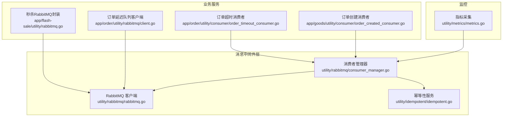
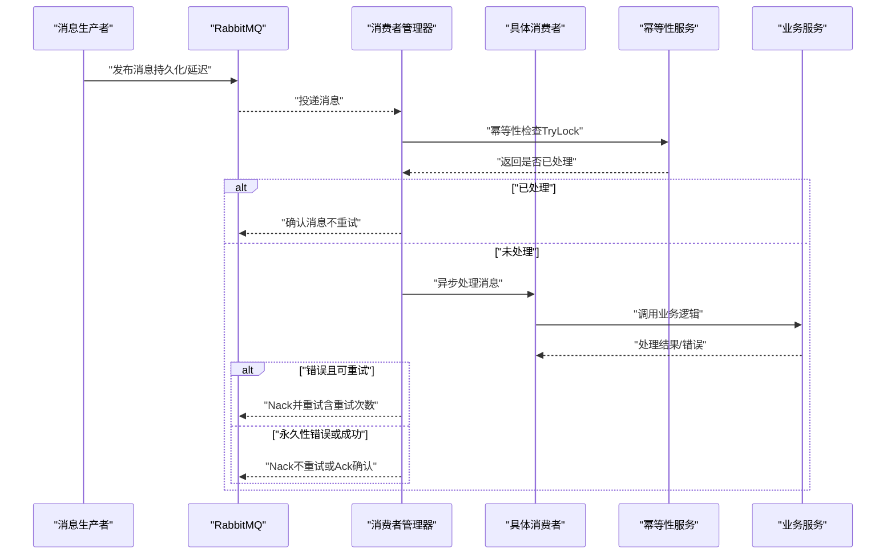
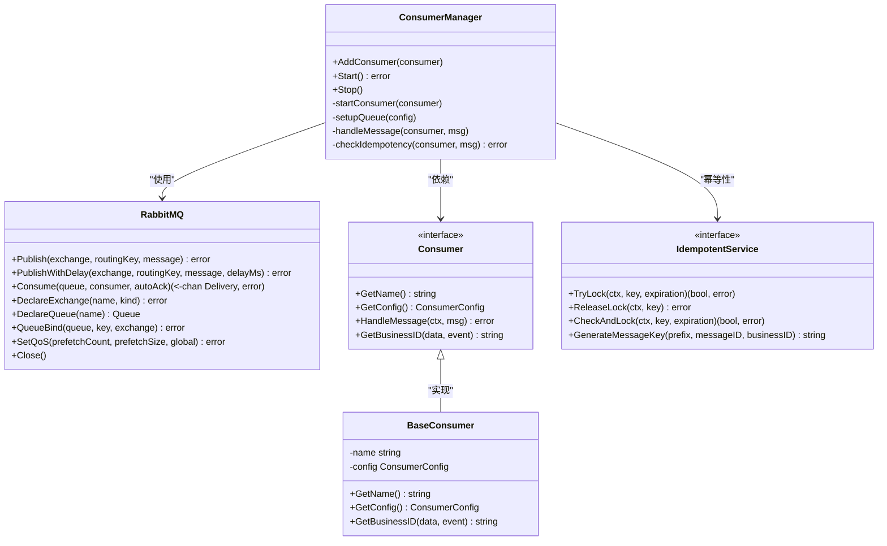
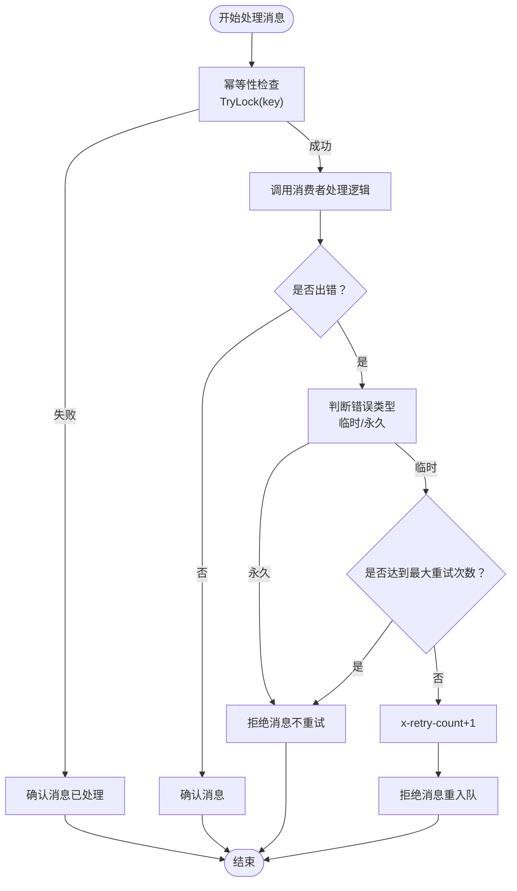
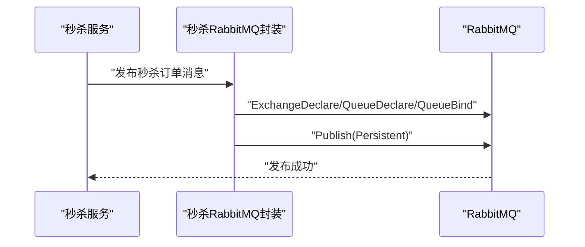
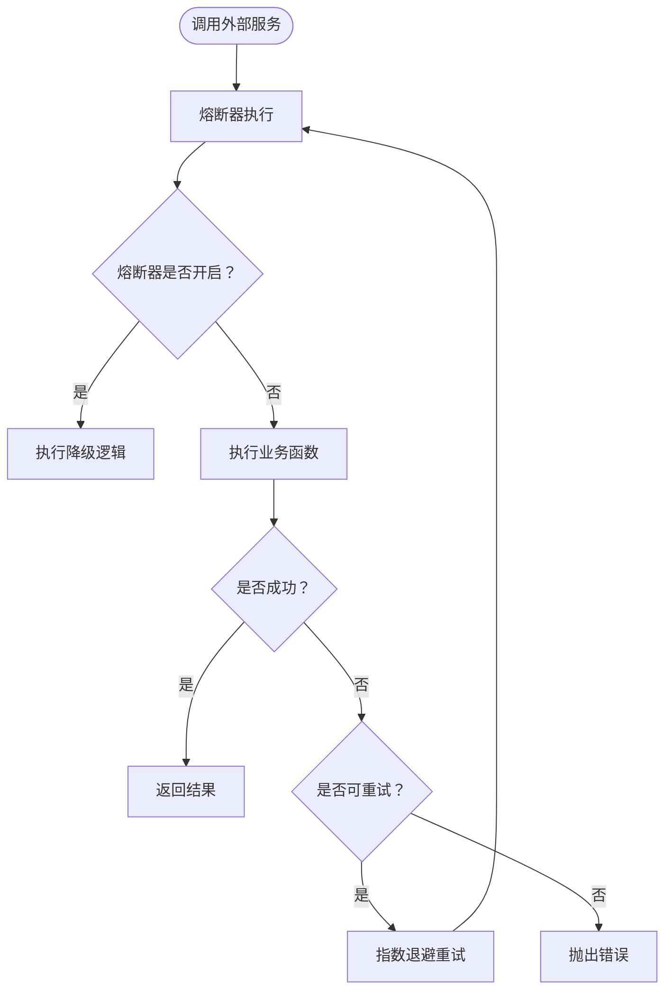
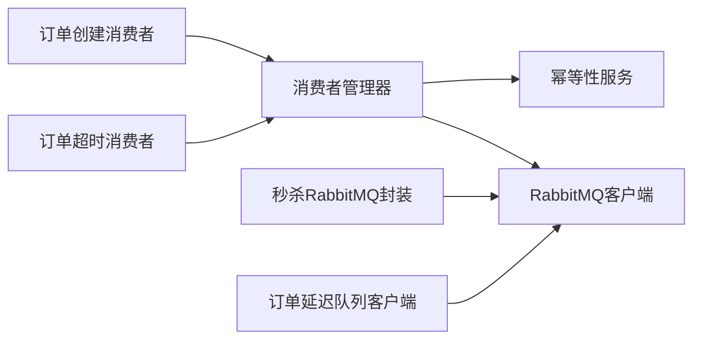

# 熔断器与容错机制

<cite>
**本文引用的文件**
- [熔断器与容错机制.md](file://doc/秒杀系统设计方案.md)
- [RabbitMQ消息处理优化实战-幂等性与重试策略.md](file://doc/RabbitMQ消息处理优化实战-幂等性与重试策略.md)
- [rabbitmq.go](file://utility/rabbitmq/rabbitmq.go)
- [consumer_manager.go](file://utility/rabbitmq/consumer_manager.go)
- [idempotent.go](file://utility/idempotent/idempotent.go)
- [rabbitmq.go](file://app/flash-sale/utility/rabbitmq.go)
- [client.go](file://app/order/utility/rabbitmq/client.go)
- [order_created_consumer.go](file://app/goods/utility/consumer/order_created_consumer.go)
- [order_timeout_consumer.go](file://app/order/utility/consumer/order_timeout_consumer.go)
- [metrics.go](file://utility/metrics/metrics.go)
</cite>

## 目录
1. [引言](#引言)
2. [项目结构](#项目结构)
3. [核心组件](#核心组件)
4. [架构总览](#架构总览)
5. [详细组件分析](#详细组件分析)
6. [依赖关系分析](#依赖关系分析)
7. [性能考量](#性能考量)
8. [故障排查指南](#故障排查指南)
9. [结论](#结论)
10. [附录](#附录)

## 引言
本文件聚焦于微服务架构中的熔断器与容错机制，结合仓库现有实现，系统阐述熔断器模式的作用、RabbitMQ消息队列的容错策略（幂等性、重试、死信/延迟队列），并提供配置参数、阈值设置与恢复机制说明。同时给出在服务调用中集成熔断器的参考路径与监控调试方法，帮助读者在不直接阅读源码的情况下理解并落地实施。

## 项目结构
围绕熔断器与容错，项目主要涉及以下模块：
- 通用RabbitMQ客户端与消费者管理器：提供连接、声明交换机/队列、消费、幂等与重试控制
- 幂等性服务：基于Redis的分布式幂等控制
- 秒杀与订单相关RabbitMQ封装：延迟队列、持久化消息
- 熔断器与重试策略：熔断器服务与重试工具
- 指标监控：HTTP请求、错误计数等指标采集

**图表来源**
- [rabbitmq.go](file://utility/rabbitmq/rabbitmq.go#L1-L196)
- [consumer_manager.go](file://utility/rabbitmq/consumer_manager.go#L1-L446)
- [idempotent.go](file://utility/idempotent/idempotent.go#L1-L153)
- [rabbitmq.go](file://app/flash-sale/utility/rabbitmq.go#L1-L132)
- [client.go](file://app/order/utility/rabbitmq/client.go#L1-L253)
- [order_created_consumer.go](file://app/goods/utility/consumer/order_created_consumer.go#L1-L65)
- [order_timeout_consumer.go](file://app/order/utility/consumer/order_timeout_consumer.go#L1-L87)
- [metrics.go](file://utility/metrics/metrics.go#L1-L71)

**章节来源**
- [rabbitmq.go](file://utility/rabbitmq/rabbitmq.go#L1-L196)
- [consumer_manager.go](file://utility/rabbitmq/consumer_manager.go#L1-L446)
- [idempotent.go](file://utility/idempotent/idempotent.go#L1-L153)
- [rabbitmq.go](file://app/flash-sale/utility/rabbitmq.go#L1-L132)
- [client.go](file://app/order/utility/rabbitmq/client.go#L1-L253)
- [order_created_consumer.go](file://app/goods/utility/consumer/order_created_consumer.go#L1-L65)
- [order_timeout_consumer.go](file://app/order/utility/consumer/order_timeout_consumer.go#L1-L87)
- [metrics.go](file://utility/metrics/metrics.go#L1-L71)

## 核心组件
- 通用RabbitMQ客户端：连接建立、声明交换机/队列、发布/消费、QoS设置、延迟消息
- 消费者管理器：统一注册、启动、停止消费者；内置幂等性检查、重试控制、错误分类
- 幂等性服务：基于Redis的TryLock/ReleaseLock，生成消息幂等键
- 秒杀RabbitMQ封装：声明秒杀交换机/队列，发布持久化消息
- 订单延迟队列客户端：声明延迟交换机与队列，支持延迟消息
- 熔断器与重试：熔断器服务与重试工具，用于服务调用侧的容错
- 指标监控：HTTP请求/延迟/错误指标，便于观测与告警

**章节来源**
- [rabbitmq.go](file://utility/rabbitmq/rabbitmq.go#L1-L196)
- [consumer_manager.go](file://utility/rabbitmq/consumer_manager.go#L1-L446)
- [idempotent.go](file://utility/idempotent/idempotent.go#L1-L153)
- [rabbitmq.go](file://app/flash-sale/utility/rabbitmq.go#L1-L132)
- [client.go](file://app/order/utility/rabbitmq/client.go#L1-L253)
- [熔断器与容错机制.md](file://doc/秒杀系统设计方案.md#L2399-L2496)
- [RabbitMQ消息处理优化实战-幂等性与重试策略.md](file://doc/RabbitMQ消息处理优化实战-幂等性与重试策略.md#L215-L288)
- [metrics.go](file://utility/metrics/metrics.go#L1-L71)

## 架构总览
下图展示了消息驱动的容错架构：消费者管理器统一接入RabbitMQ，结合幂等性与重试策略，保障消息处理的可靠性；延迟队列用于订单超时等场景；熔断器与重试工具用于服务调用侧的容错。

**图表来源**
- [consumer_manager.go](file://utility/rabbitmq/consumer_manager.go#L196-L263)
- [idempotent.go](file://utility/idempotent/idempotent.go#L35-L73)
- [order_timeout_consumer.go](file://app/order/utility/consumer/order_timeout_consumer.go#L39-L86)
- [order_created_consumer.go](file://app/goods/utility/consumer/order_created_consumer.go#L32-L64)

## 详细组件分析

### 通用RabbitMQ客户端与消费者管理器
- 连接与声明：支持指数退避重试连接、声明交换机/队列、持久化消息、延迟消息、QoS设置
- 消费流程：统一Consume入口，启动协程处理消息；内置幂等性检查与重试控制
- 幂等性：基于消息ID与业务ID生成幂等键，使用Redis分布式锁；支持TTL与业务ID提取
- 重试策略：区分临时性/永久性错误；按最大重试次数与消息头x-retry-count控制重试；支持自动确认/手动确认
- 错误分类：提供TemporaryError/PermanentError类型与shouldRequeue判断

**图表来源**
- [rabbitmq.go](file://utility/rabbitmq/rabbitmq.go#L13-L195)
- [consumer_manager.go](file://utility/rabbitmq/consumer_manager.go#L19-L446)
- [idempotent.go](file://utility/idempotent/idempotent.go#L11-L153)

**章节来源**
- [rabbitmq.go](file://utility/rabbitmq/rabbitmq.go#L19-L195)
- [consumer_manager.go](file://utility/rabbitmq/consumer_manager.go#L48-L194)
- [idempotent.go](file://utility/idempotent/idempotent.go#L23-L85)

### 幂等性与重试控制流程
- 幂等性：消费者管理器在handleMessage前调用checkIdempotency，生成key（含consumer名、messageId、businessId），尝试Redis SetNX；若失败则直接确认消息，避免重复处理
- 重试：根据shouldRequeue判断错误类型；若可重试且未达最大重试次数，则增加x-retry-count并Nack重入队；否则Nack不重入队
- 业务ID：优先使用消费者提供的GetBusinessID，其次从消息头business_id提取，最后从消息体解析

**图表来源**
- [consumer_manager.go](file://utility/rabbitmq/consumer_manager.go#L196-L263)
- [consumer_manager.go](file://utility/rabbitmq/consumer_manager.go#L265-L320)
- [consumer_manager.go](file://utility/rabbitmq/consumer_manager.go#L377-L406)

**章节来源**
- [consumer_manager.go](file://utility/rabbitmq/consumer_manager.go#L196-L263)
- [consumer_manager.go](file://utility/rabbitmq/consumer_manager.go#L265-L320)
- [consumer_manager.go](file://utility/rabbitmq/consumer_manager.go#L377-L406)

### 秒杀与订单相关RabbitMQ封装
- 秒杀封装：声明direct交换机与队列，发布持久化消息，供秒杀流程使用
- 订单延迟队列：声明x-delayed-message延迟交换机与队列，支持延迟消息；消费者按事件时间与配置的超时阈值判断是否处理

**图表来源**
- [rabbitmq.go](file://app/flash-sale/utility/rabbitmq.go#L57-L96)
- [rabbitmq.go](file://app/flash-sale/utility/rabbitmq.go#L103-L120)

**章节来源**
- [rabbitmq.go](file://app/flash-sale/utility/rabbitmq.go#L57-L96)
- [client.go](file://app/order/utility/rabbitmq/client.go#L125-L188)
- [order_timeout_consumer.go](file://app/order/utility/consumer/order_timeout_consumer.go#L52-L67)

### 熔断器与重试策略（服务调用侧）
- 熔断器：基于gobreaker，支持配置MaxRequests、Interval、Timeout、FailureThreshold；状态变更回调；ExecuteWithCircuitBreaker在熔断开启时执行降级逻辑
- 重试：指数退避、最大重试次数、可重试错误类型判断；适用于网络波动等临时性故障

**图表来源**
- [熔断器与容错机制.md](file://doc/秒杀系统设计方案.md#L2413-L2496)
- [RabbitMQ消息处理优化实战-幂等性与重试策略.md](file://doc/RabbitMQ消息处理优化实战-幂等性与重试策略.md#L215-L288)

**章节来源**
- [熔断器与容错机制.md](file://doc/秒杀系统设计方案.md#L2413-L2496)
- [RabbitMQ消息处理优化实战-幂等性与重试策略.md](file://doc/RabbitMQ消息处理优化实战-幂等性与重试策略.md#L215-L288)

### 监控与调试
- 指标：HTTP请求总量、延迟直方图、服务错误计数；通过/metrics端点暴露
- 日志：消费者管理器记录消息接收、处理耗时、重试次数、幂等性检查结果、错误类型
- 建议：结合Prometheus/Grafana进行可视化；为熔断器状态、消息重试次数、幂等性冲突率设置告警

**章节来源**
- [metrics.go](file://utility/metrics/metrics.go#L14-L71)
- [consumer_manager.go](file://utility/rabbitmq/consumer_manager.go#L196-L263)

## 依赖关系分析
- 消费者管理器依赖通用RabbitMQ客户端与幂等性服务，形成“声明—消费—幂等—重试”的闭环
- 秒杀与订单模块分别提供独立的RabbitMQ封装，复用通用能力
- 熔断器与重试工具位于文档中，建议在服务调用侧引入，与消息处理形成互补

**图表来源**
- [consumer_manager.go](file://utility/rabbitmq/consumer_manager.go#L1-L446)
- [rabbitmq.go](file://utility/rabbitmq/rabbitmq.go#L1-L196)
- [idempotent.go](file://utility/idempotent/idempotent.go#L1-L153)
- [rabbitmq.go](file://app/flash-sale/utility/rabbitmq.go#L1-L132)
- [client.go](file://app/order/utility/rabbitmq/client.go#L1-L253)
- [order_created_consumer.go](file://app/goods/utility/consumer/order_created_consumer.go#L1-L65)
- [order_timeout_consumer.go](file://app/order/utility/consumer/order_timeout_consumer.go#L1-L87)

**章节来源**
- [consumer_manager.go](file://utility/rabbitmq/consumer_manager.go#L1-L446)
- [rabbitmq.go](file://utility/rabbitmq/rabbitmq.go#L1-L196)
- [idempotent.go](file://utility/idempotent/idempotent.go#L1-L153)
- [rabbitmq.go](file://app/flash-sale/utility/rabbitmq.go#L1-L132)
- [client.go](file://app/order/utility/rabbitmq/client.go#L1-L253)
- [order_created_consumer.go](file://app/goods/utility/consumer/order_created_consumer.go#L1-L65)
- [order_timeout_consumer.go](file://app/order/utility/consumer/order_timeout_consumer.go#L1-L87)

## 性能考量
- QoS与预取：通过SetQoS控制prefetchCount，避免消费者过载
- 幂等性：Redis SetNX开销较低，注意合理TTL与键空间规划
- 重试退避：指数退避降低雪崩风险，需结合最大重试时间上限
- 指标观测：通过直方图定位慢请求，结合错误率与重试次数识别异常

[本节为通用指导，无需列出具体文件来源]

## 故障排查指南
- 消息重复：检查幂等键生成逻辑与Redis可用性；确认消息头business_id与消息体字段
- 无限重试：核对MaxRetries与shouldRequeue规则；检查错误类型包装
- 连接失败：查看指数退避日志与最大重试时间；确认RabbitMQ地址与凭证
- 指标缺失：确认/metrics端点已注册；检查Prometheus抓取配置

**章节来源**
- [consumer_manager.go](file://utility/rabbitmq/consumer_manager.go#L196-L263)
- [consumer_manager.go](file://utility/rabbitmq/consumer_manager.go#L265-L320)
- [consumer_manager.go](file://utility/rabbitmq/consumer_manager.go#L377-L406)
- [rabbitmq.go](file://utility/rabbitmq/rabbitmq.go#L19-L54)
- [metrics.go](file://utility/metrics/metrics.go#L45-L55)

## 结论
本项目在消息层通过幂等性与重试策略构建了稳健的容错体系，并在延迟队列与持久化消息基础上实现可靠投递。服务调用侧可通过熔断器与重试工具进一步增强弹性。配合指标监控与告警，可有效提升系统的稳定性与可观测性。

[本节为总结性内容，无需列出具体文件来源]

## 附录

### 熔断器配置参数与阈值
- 名称：熔断器标识
- 最大请求数：滑动窗口内最小请求数
- 时间窗：统计周期
- 超时：半开状态探测超时
- 失败阈值：失败比例阈值
- 状态变更回调：日志记录与告警

**章节来源**
- [熔断器与容错机制.md](file://doc/秒杀系统设计方案.md#L2413-L2474)

### 服务降级、快速失败与优雅降级
- 降级：熔断器开启时执行降级逻辑（如返回兜底数据）
- 快速失败：永久性错误直接Nack不重试
- 优雅降级：在降级过程中记录日志与指标，保证用户体验与系统稳定

**章节来源**
- [熔断器与容错机制.md](file://doc/秒杀系统设计方案.md#L2476-L2496)
- [consumer_manager.go](file://utility/rabbitmq/consumer_manager.go#L249-L254)

### RabbitMQ容错要点
- 持久化：消息DeliveryMode=Persistent
- 确认机制：AutoAck=false时显式Ack/Nack
- 死信/延迟：x-delayed-message交换机与延迟时间
- 幂等性：消息ID+业务ID生成幂等键，Redis SetNX

**章节来源**
- [rabbitmq.go](file://utility/rabbitmq/rabbitmq.go#L91-L124)
- [consumer_manager.go](file://utility/rabbitmq/consumer_manager.go#L265-L320)
- [client.go](file://app/order/utility/rabbitmq/client.go#L125-L188)

### 监控与调试清单
- 指标端点：/metrics
- 关键指标：HTTP请求总量、延迟、错误计数
- 日志关注：消息接收、处理耗时、重试次数、幂等性冲突、熔断器状态

**章节来源**
- [metrics.go](file://utility/metrics/metrics.go#L45-L71)
- [consumer_manager.go](file://utility/rabbitmq/consumer_manager.go#L196-L263)
- [熔断器与容错机制.md](file://doc/秒杀系统设计方案.md#L2460-L2467)