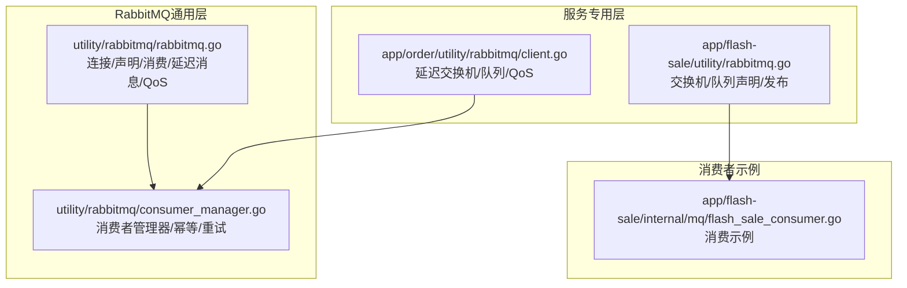
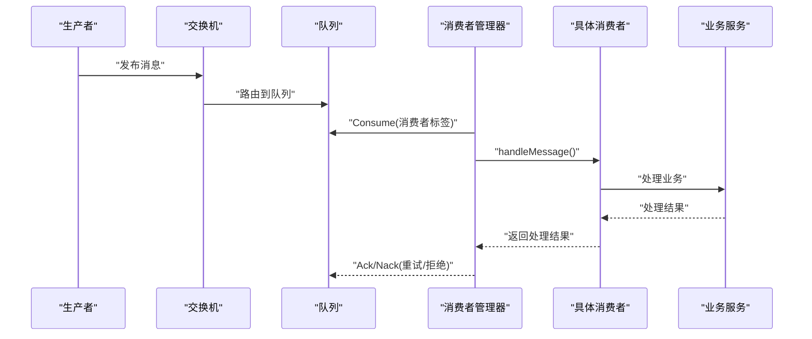
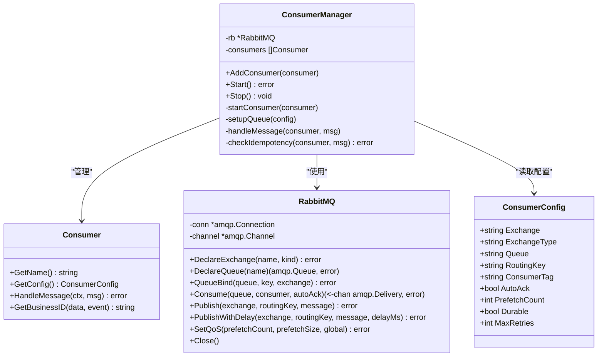
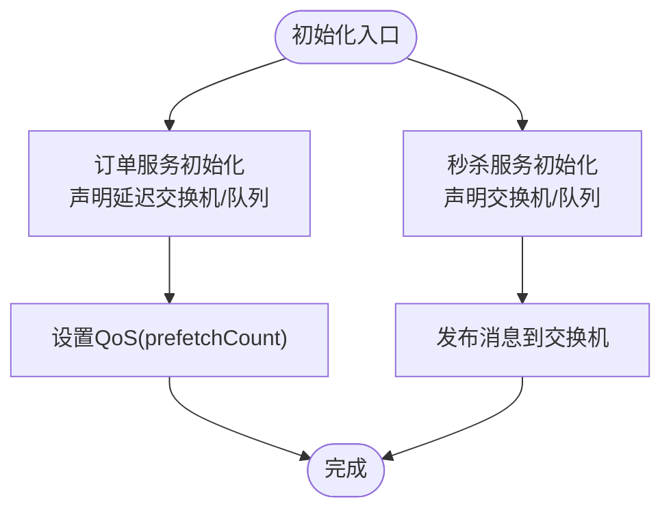
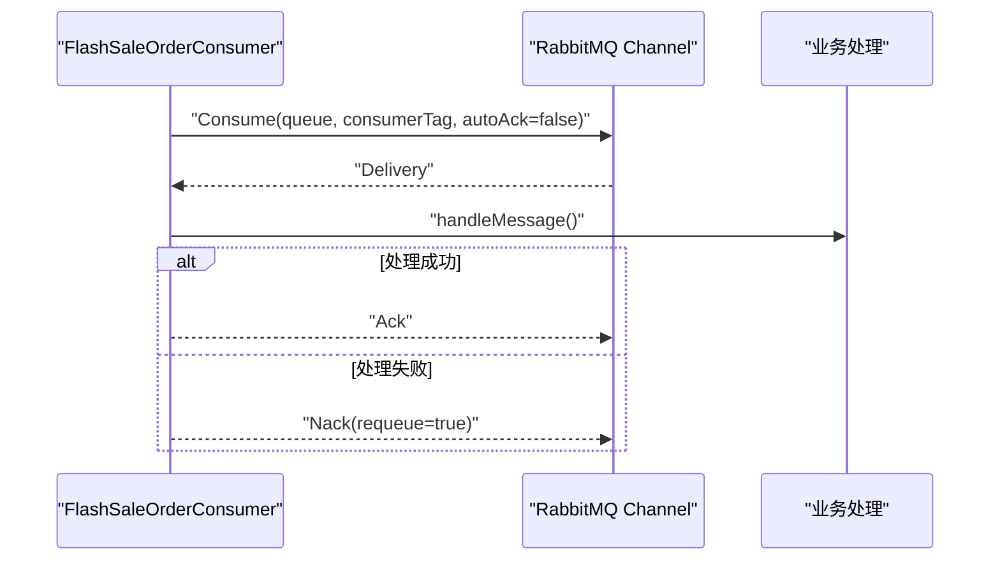
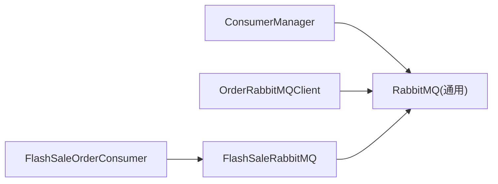

# 负载均衡策略

<cite>
**本文引用的文件**
- [app/flash-sale/utility/rabbitmq.go](file://app/flash-sale/utility/rabbitmq.go)
- [app/order/utility/rabbitmq/client.go](file://app/order/utility/rabbitmq/client.go)
- [utility/rabbitmq/consumer_manager.go](file://utility/rabbitmq/consumer_manager.go)
- [utility/rabbitmq/rabbitmq.go](file://utility/rabbitmq/rabbitmq.go)
- [app/flash-sale/internal/mq/flash_sale_consumer.go](file://app/flash-sale/internal/mq/flash_sale_consumer.go)
- [doc/RabbitMQ消息处理优化实战-幂等性与重试策略.md](file://doc/RabbitMQ消息处理优化实战-幂等性与重试策略.md)
- [doc/Kubernetes编排实战与HPA自动扩缩容最佳实践指南.md](file://doc/Kubernetes编排实战与HPA自动扩缩容最佳实践指南.md)
- [utility/metrics/metrics.go](file://utility/metrics/metrics.go)
</cite>

## 目录
1. [引言](#引言)
2. [项目结构](#项目结构)
3. [核心组件](#核心组件)
4. [架构总览](#架构总览)
5. [详细组件分析](#详细组件分析)
6. [依赖分析](#依赖分析)
7. [性能考量](#性能考量)
8. [故障排查指南](#故障排查指南)
9. [结论](#结论)
10. [附录](#附录)

## 引言
本文件聚焦于微服务架构中的负载均衡策略，结合仓库现有实现，系统阐述以下主题：
- gRPC客户端侧的负载均衡与故障转移（轮询、最少连接、IP哈希等策略的配置与使用）
- RabbitMQ消息队列的负载均衡机制（消费者组、消息分发策略、幂等性与重试）
- 负载均衡的监控指标与性能优化建议
- 具体配置示例与故障转移处理机制

说明：仓库中未发现显式的gRPC客户端侧负载均衡配置代码，因此本节将基于通用实践与项目现状给出可落地的配置思路与实现建议。

## 项目结构
围绕负载均衡的关键模块分布如下：
- RabbitMQ通用客户端与消费者管理器：位于 utility/rabbitmq，提供统一的连接、声明、消费与重试机制
- 服务内RabbitMQ专用客户端：位于 app/order/utility/rabbitmq 与 app/flash-sale/utility，提供延迟队列与QoS等特性
- 消费者示例：位于 app/flash-sale/internal/mq，演示消息消费流程
- 文档：doc 下包含 RabbitMQ 优化与 Kubernetes HPA 自动扩缩容的最佳实践
- 指标采集：utility/metrics 提供 HTTP 请求与错误指标

**图表来源**
- [utility/rabbitmq/rabbitmq.go](file://utility/rabbitmq/rabbitmq.go#L1-L196)
- [utility/rabbitmq/consumer_manager.go](file://utility/rabbitmq/consumer_manager.go#L1-L446)
- [app/order/utility/rabbitmq/client.go](file://app/order/utility/rabbitmq/client.go#L1-L253)
- [app/flash-sale/utility/rabbitmq.go](file://app/flash-sale/utility/rabbitmq.go#L1-L132)
- [app/flash-sale/internal/mq/flash_sale_consumer.go](file://app/flash-sale/internal/mq/flash_sale_consumer.go#L1-L134)

**章节来源**
- [utility/rabbitmq/rabbitmq.go](file://utility/rabbitmq/rabbitmq.go#L1-L196)
- [utility/rabbitmq/consumer_manager.go](file://utility/rabbitmq/consumer_manager.go#L1-L446)
- [app/order/utility/rabbitmq/client.go](file://app/order/utility/rabbitmq/client.go#L1-L253)
- [app/flash-sale/utility/rabbitmq.go](file://app/flash-sale/utility/rabbitmq.go#L1-L132)
- [app/flash-sale/internal/mq/flash_sale_consumer.go](file://app/flash-sale/internal/mq/flash_sale_consumer.go#L1-L134)

## 核心组件
- 通用RabbitMQ客户端：封装连接、声明交换机/队列、发布/消费、延迟消息、QoS设置
- 通用消费者管理器：统一管理消费者生命周期、队列声明、QoS、幂等性检查、智能重试与最大重试次数
- 服务专用RabbitMQ客户端：订单服务的延迟交换机与队列初始化，以及QoS设置
- 秒杀服务RabbitMQ客户端：声明交换机/队列并发布消息
- 消费者示例：演示消费流程与消息处理

**章节来源**
- [utility/rabbitmq/rabbitmq.go](file://utility/rabbitmq/rabbitmq.go#L1-L196)
- [utility/rabbitmq/consumer_manager.go](file://utility/rabbitmq/consumer_manager.go#L1-L446)
- [app/order/utility/rabbitmq/client.go](file://app/order/utility/rabbitmq/client.go#L1-L253)
- [app/flash-sale/utility/rabbitmq.go](file://app/flash-sale/utility/rabbitmq.go#L1-L132)
- [app/flash-sale/internal/mq/flash_sale_consumer.go](file://app/flash-sale/internal/mq/flash_sale_consumer.go#L1-L134)

## 架构总览
下图展示了消息从生产到消费的整体路径，以及消费者管理器如何实现负载均衡与高可用：

**图表来源**
- [utility/rabbitmq/consumer_manager.go](file://utility/rabbitmq/consumer_manager.go#L113-L171)
- [utility/rabbitmq/consumer_manager.go](file://utility/rabbitmq/consumer_manager.go#L196-L263)
- [utility/rabbitmq/rabbitmq.go](file://utility/rabbitmq/rabbitmq.go#L84-L137)

## 详细组件分析

### RabbitMQ通用消费者管理器
- 功能要点
  - 统一连接与声明：按配置声明交换机、队列并绑定
  - QoS设置：通过prefetchCount控制并发度，避免过载
  - 幂等性：基于消息ID与业务ID生成幂等键，防止重复处理
  - 智能重试：区分临时性与永久性错误，支持最大重试次数
  - 生命周期：优雅启动/停止，关闭连接与通道

**图表来源**
- [utility/rabbitmq/consumer_manager.go](file://utility/rabbitmq/consumer_manager.go#L19-L71)
- [utility/rabbitmq/rabbitmq.go](file://utility/rabbitmq/rabbitmq.go#L13-L196)

**章节来源**
- [utility/rabbitmq/consumer_manager.go](file://utility/rabbitmq/consumer_manager.go#L1-L446)
- [utility/rabbitmq/rabbitmq.go](file://utility/rabbitmq/rabbitmq.go#L1-L196)

### 服务专用RabbitMQ客户端（订单/秒杀）
- 订单服务延迟交换机与队列初始化，设置QoS
- 秒杀服务交换机/队列声明与消息发布

**图表来源**
- [app/order/utility/rabbitmq/client.go](file://app/order/utility/rabbitmq/client.go#L125-L188)
- [app/flash-sale/utility/rabbitmq.go](file://app/flash-sale/utility/rabbitmq.go#L57-L96)

**章节来源**
- [app/order/utility/rabbitmq/client.go](file://app/order/utility/rabbitmq/client.go#L1-L253)
- [app/flash-sale/utility/rabbitmq.go](file://app/flash-sale/utility/rabbitmq.go#L1-L132)

### 消息消费流程（秒杀示例）
- 消费者启动后从指定队列拉取消息
- 处理失败时 Nack 重新入队，成功时 Ack 确认

**图表来源**
- [app/flash-sale/internal/mq/flash_sale_consumer.go](file://app/flash-sale/internal/mq/flash_sale_consumer.go#L28-L68)

**章节来源**
- [app/flash-sale/internal/mq/flash_sale_consumer.go](file://app/flash-sale/internal/mq/flash_sale_consumer.go#L1-L134)

## 依赖分析
- 通用消费者管理器依赖通用RabbitMQ客户端进行连接、声明与消费
- 服务专用客户端独立于通用管理器，但同样依赖通用RabbitMQ客户端
- 消费者示例依赖服务专用RabbitMQ客户端或通用客户端

**图表来源**
- [utility/rabbitmq/consumer_manager.go](file://utility/rabbitmq/consumer_manager.go#L58-L71)
- [utility/rabbitmq/rabbitmq.go](file://utility/rabbitmq/rabbitmq.go#L1-L196)
- [app/order/utility/rabbitmq/client.go](file://app/order/utility/rabbitmq/client.go#L1-L253)
- [app/flash-sale/utility/rabbitmq.go](file://app/flash-sale/utility/rabbitmq.go#L1-L132)
- [app/flash-sale/internal/mq/flash_sale_consumer.go](file://app/flash-sale/internal/mq/flash_sale_consumer.go#L1-L134)

**章节来源**
- [utility/rabbitmq/consumer_manager.go](file://utility/rabbitmq/consumer_manager.go#L1-L446)
- [utility/rabbitmq/rabbitmq.go](file://utility/rabbitmq/rabbitmq.go#L1-L196)
- [app/order/utility/rabbitmq/client.go](file://app/order/utility/rabbitmq/client.go#L1-L253)
- [app/flash-sale/utility/rabbitmq.go](file://app/flash-sale/utility/rabbitmq.go#L1-L132)
- [app/flash-sale/internal/mq/flash_sale_consumer.go](file://app/flash-sale/internal/mq/flash_sale_consumer.go#L1-L134)

## 性能考量
- 并发与背压
  - 使用 QoS 的 prefetchCount 控制每连接/每通道的未确认消息数，避免消费者过载
  - 通用消费者管理器在启动消费者时设置 QoS，服务专用客户端同样设置 QoS
- 幂等性与重试
  - 通过幂等键避免重复处理，减少无效重试
  - 智能重试区分临时性与永久性错误，配合最大重试次数避免无限重试
- 指标与可观测性
  - 通过 HTTP 指标端点暴露请求计数、延迟与错误指标，便于定位性能瓶颈

**章节来源**
- [utility/rabbitmq/consumer_manager.go](file://utility/rabbitmq/consumer_manager.go#L142-L147)
- [app/order/utility/rabbitmq/client.go](file://app/order/utility/rabbitmq/client.go#L76-L89)
- [utility/metrics/metrics.go](file://utility/metrics/metrics.go#L1-L71)

## 故障排查指南
- 连接失败与重试
  - 通用RabbitMQ客户端使用指数退避重试策略，建议检查连接URL、凭证与网络连通性
- 消费异常与重试
  - 消费者管理器根据错误类型与重试次数决定是否重新入队；若达到最大重试次数则拒绝并记录
- 幂等性检查失败
  - 若幂等性服务不可用，系统会允许继续处理以保证业务可用性，但需关注潜在重复处理风险
- 指标与告警
  - 通过指标端点查看请求延迟与错误趋势，结合日志定位问题

**章节来源**
- [utility/rabbitmq/rabbitmq.go](file://utility/rabbitmq/rabbitmq.go#L19-L54)
- [utility/rabbitmq/consumer_manager.go](file://utility/rabbitmq/consumer_manager.go#L224-L262)
- [utility/metrics/metrics.go](file://utility/metrics/metrics.go#L45-L71)

## 结论
本项目在消息队列层面通过通用消费者管理器实现了统一的负载均衡与高可用机制：基于消费者组与QoS实现并发控制，结合幂等性与智能重试保障可靠性。对于gRPC客户端侧的负载均衡，项目未提供直接配置代码，建议参考通用实践在客户端侧启用适当的负载均衡策略与故障转移配置，以实现跨实例的流量分摊与容错。

## 附录

### RabbitMQ负载均衡与消费者组
- 消费者组
  - 通过同一消费者标签或共享队列实现消费者组，RabbitMQ将消息分发给组内不同消费者
  - 通用消费者管理器在 Consume 时设置消费者标签，支持多消费者并行处理
- QoS与并发控制
  - 通过 prefetchCount 控制每连接的未确认消息上限，避免单消费者过载
- 幂等性与重试
  - 基于消息ID与业务ID生成幂等键，防止重复处理
  - 智能重试区分临时性与永久性错误，支持最大重试次数

**章节来源**
- [utility/rabbitmq/consumer_manager.go](file://utility/rabbitmq/consumer_manager.go#L113-L171)
- [utility/rabbitmq/consumer_manager.go](file://utility/rabbitmq/consumer_manager.go#L196-L320)

### gRPC客户端负载均衡（通用实践与配置建议）
- 策略类型
  - 轮询：按顺序分配请求，适合均匀分布
  - 最少连接：优先分配到活跃连接数较少的实例
  - IP哈希：基于客户端IP的哈希值选择实例，适合粘性会话
- 配置要点
  - 在 gRPC 客户端侧启用负载均衡插件与故障转移策略
  - 结合服务发现（如Kubernetes Service）实现动态实例列表更新
  - 设置合理的超时与重试策略，避免雪崩效应
- 与Kubernetes联动
  - 通过 Service 暴露gRPC端口，HPA根据CPU/内存等指标自动扩缩容，间接提升负载均衡效果

**章节来源**
- [doc/Kubernetes编排实战与HPA自动扩缩容最佳实践指南.md](file://doc/Kubernetes编排实战与HPA自动扩缩容最佳实践指南.md#L142-L210)

### 监控指标与性能优化建议
- 指标
  - HTTP请求计数、延迟直方图、错误计数
  - RabbitMQ相关：消息吞吐、重试次数、拒绝次数
- 优化建议
  - 调整QoS与消费者数量，避免过载
  - 合理设置幂等TTL与重试上限，降低重复处理成本
  - 结合HPA与资源配额，实现弹性扩缩容

**章节来源**
- [utility/metrics/metrics.go](file://utility/metrics/metrics.go#L14-L71)
- [doc/Kubernetes编排实战与HPA自动扩缩容最佳实践指南.md](file://doc/Kubernetes编排实战与HPA自动扩缩容最佳实践指南.md#L142-L210)