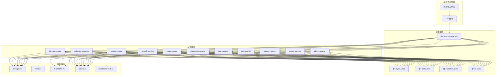
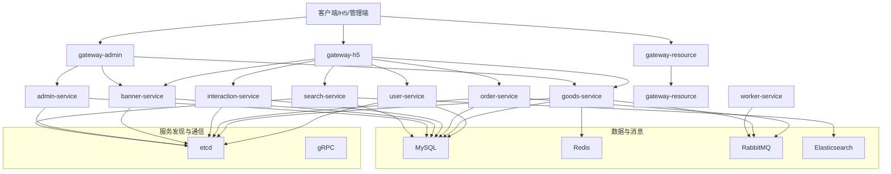
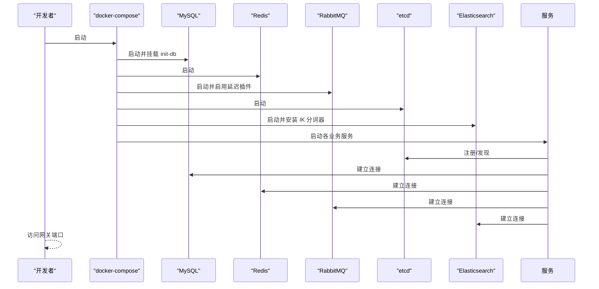
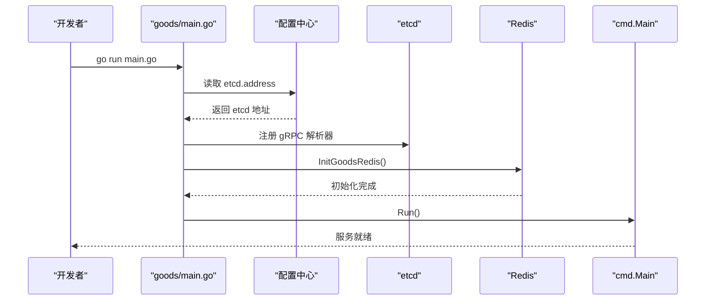

# 快速开始

<cite>
**本文引用的文件**
- [README.MD](file://README.MD)
- [go.mod](file://go.mod)
- [.env](file://.env)
- [Makefile](file://Makefile)
- [docker-compose.yml](file://docker-compose.yml)
- [hack-cli.mk](file://hack/hack-cli.mk)
- [admin/main.go](file://app/admin/main.go)
- [goods/main.go](file://app/goods/main.go)
- [01_init.sql](file://init-db/01_init.sql)
- [admin/config.prod.yaml](file://app/admin/manifest/config/config.prod.yaml)
- [goods/config.prod.yaml](file://app/goods/manifest/config/config.prod.yaml)
- [user/config.prod.yaml](file://app/user/manifest/config/config.prod.yaml)
- [interaction/config.prod.yaml](file://app/interaction/manifest/config/config.prod.yaml)
- [order/config.prod.yaml](file://app/order/manifest/config/config.prod.yaml)
- [banner/config.prod.yaml](file://app/banner/manifest/config/config.prod.yaml)
</cite>

## 目录
1. [简介](#简介)
2. [项目结构](#项目结构)
3. [核心组件](#核心组件)
4. [架构总览](#架构总览)
5. [详细组件分析](#详细组件分析)
6. [依赖关系分析](#依赖关系分析)
7. [性能考虑](#性能考虑)
8. [故障排查指南](#故障排查指南)
9. [结论](#结论)
10. [附录](#附录)

## 简介
本指南面向首次接触该微服务电商项目的开发者，目标是在本地或容器环境中快速完成环境准备、依赖安装、数据库初始化与配置，并成功启动所有服务或按需启动单个服务。项目基于 GoFrame 框架，采用 gRPC 通信与 etcd 服务发现，结合 MySQL、Redis、RabbitMQ、etcd、Elasticsearch 等中间件，提供用户、商品、订单、交互、轮播、资源上传等业务模块。

## 项目结构
项目采用“多服务一仓库”的组织方式，每个业务模块（如 user、goods、order、gateway-* 等）均包含独立的 main.go、配置、协议定义、DAO/逻辑层与部署清单。根目录提供统一的 Docker Compose 编排与一键启动脚本。

图表来源
- [docker-compose.yml](file://docker-compose.yml#L1-L355)

章节来源
- [README.MD](file://README.MD#L1-L41)
- [docker-compose.yml](file://docker-compose.yml#L1-L355)

## 核心组件
- 网关服务
  - gateway-h5：面向移动端用户的网关，聚合商品、交互、订单、用户等能力。
  - gateway-admin：面向管理端的网关，聚合商品管理、管理员能力等。
  - gateway-resource：文件上传与资源管理网关。
- 业务服务
  - admin：管理员相关能力。
  - user：用户登录、注册、信息管理。
  - goods：商品信息、购物车、优惠券、库存与分布式锁、Redis 缓存策略。
  - order：订单生命周期、退款、微信支付对接、延迟队列处理超时。
  - interaction：点赞、评论、收藏。
  - banner：轮播图与广告位。
  - search：商品搜索与同步（Elasticsearch）。
  - worker：消息消费者（RabbitMQ）。
- 基础设施
  - MySQL、Redis、RabbitMQ、etcd、Elasticsearch/Kibana。

章节来源
- [README.MD](file://README.MD#L3-L34)

## 架构总览
系统采用微服务 + 网关模式，服务间通过 gRPC 通信，服务发现使用 etcd。消息通过 RabbitMQ 异步解耦，缓存使用 Redis，搜索引擎使用 Elasticsearch，持久化使用 MySQL。

图表来源
- [docker-compose.yml](file://docker-compose.yml#L134-L355)
- [README.MD](file://README.MD#L3-L34)

## 详细组件分析

### 环境要求
- Go 版本：项目 go.mod 指定为 1.23.10，建议使用该版本或兼容版本。
- Docker 与 Docker Compose：用于一键启动所有依赖与服务。
- 开发工具：任意支持 Go 的 IDE 或 VS Code + Go 插件。
- 可选：本地直接运行各服务（非容器）时，需自行准备 etcd、MySQL、Redis、RabbitMQ、Elasticsearch。

章节来源
- [go.mod](file://go.mod#L3-L3)

### 依赖安装与工具准备
- 安装 GoFrame CLI 工具（可选）
  - 执行 make cli 或 make cli.install 自动检测并安装最新 gf CLI。
- 项目依赖
  - 通过 go mod 自动下载，无需手动安装第三方库。

章节来源
- [hack-cli.mk](file://hack/hack-cli.mk#L1-L20)
- [go.mod](file://go.mod#L5-L22)

### 环境变量与配置
- 全局环境变量（.env）
  - 包含数据库、Redis、RabbitMQ、etcd、Elasticsearch 的主机与端口，以及七牛云访问凭据。
- 各服务配置
  - admin/goods/user/interaction/order/banner 等服务在各自 manifest/config 下提供 config.prod.yaml，定义 gRPC 地址、数据库连接、etcd 地址、Redis/RabbitMQ 等参数。
  - 示例路径：
    - [admin/config.prod.yaml](file://app/admin/manifest/config/config.prod.yaml#L1-L22)
    - [goods/config.prod.yaml](file://app/goods/manifest/config/config.prod.yaml#L1-L60)
    - [user/config.prod.yaml](file://app/user/manifest/config/config.prod.yaml#L1-L42)
    - [interaction/config.prod.yaml](file://app/interaction/manifest/config/config.prod.yaml#L1-L22)
    - [order/config.prod.yaml](file://app/order/manifest/config/config.prod.yaml#L1-L86)
    - [banner/config.prod.yaml](file://app/banner/manifest/config/config.prod.yaml#L1-L22)

章节来源
- [.env](file://.env#L1-L28)
- [admin/config.prod.yaml](file://app/admin/manifest/config/config.prod.yaml#L1-L22)
- [goods/config.prod.yaml](file://app/goods/manifest/config/config.prod.yaml#L1-L60)
- [user/config.prod.yaml](file://app/user/manifest/config/config.prod.yaml#L1-L42)
- [interaction/config.prod.yaml](file://app/interaction/manifest/config/config.prod.yaml#L1-L22)
- [order/config.prod.yaml](file://app/order/manifest/config/config.prod.yaml#L1-L86)
- [banner/config.prod.yaml](file://app/banner/manifest/config/config.prod.yaml#L1-L22)

### 数据库初始化
- 初始化 SQL 脚本位于 init-db/01_init.sql，包含多个业务库（goods、admin、user、interaction、order、resource、banner）及基础表与示例数据。
- Docker Compose 在启动时会挂载 init-db 到 MySQL 容器，自动执行初始化脚本。
- 如需手动初始化，可在 MySQL 容器内执行该 SQL 文件。

章节来源
- [01_init.sql](file://init-db/01_init.sql#L1-L120)
- [docker-compose.yml](file://docker-compose.yml#L14-L16)

### 项目启动流程

#### 全量启动（推荐）
- 使用 Docker Compose 一键启动所有服务与依赖：
  - docker-compose up -d
  - 等待各服务健康检查通过（compose 中已配置 healthcheck）。
- 访问网关
  - 管理端网关：http://localhost:8299
  - 用户端网关：http://localhost:8199
  - 资源网关：http://localhost:8399
- 日志
  - 各服务日志输出至 ./log 目录（容器内映射）。

章节来源
- [docker-compose.yml](file://docker-compose.yml#L1-L355)

#### 单服务启动
- 以 goods 服务为例，进入 app/goods 目录，执行：
  - go run main.go
  - 该服务会：
    - 读取 etcd 地址并注册 gRPC 解析器。
    - 初始化 Redis 连接。
    - 启动命令入口 cmd.Main.Run。
- 其他服务启动方式相同，分别进入对应 app/*/main.go 执行。

章节来源
- [goods/main.go](file://app/goods/main.go#L1-L35)
- [admin/main.go](file://app/admin/main.go#L1-L25)

#### 服务端口与依赖关系
- 端口映射参考 docker-compose.yml 中各服务的 ports 字段。
- 依赖关系（部分）：
  - goods 依赖 MySQL、Redis、etcd、RabbitMQ。
  - order 依赖 MySQL、etcd、RabbitMQ。
  - search 依赖 MySQL、etcd、Elasticsearch。
  - gateway-* 依赖 etcd。
  - worker 依赖 RabbitMQ。

章节来源
- [docker-compose.yml](file://docker-compose.yml#L134-L355)

### 关键启动流程时序

#### 容器编排启动时序

图表来源
- [docker-compose.yml](file://docker-compose.yml#L1-L355)

#### 服务进程启动时序（以 goods 为例）

图表来源
- [goods/main.go](file://app/goods/main.go#L15-L34)

## 依赖关系分析
- 语言与框架
  - Go 1.23.10，GoFrame v2，gRPC、etcd 注册中心、MySQL/Redis 驱动、RabbitMQ 客户端、Elasticsearch 客户端、七牛云 SDK 等。
- 服务间依赖
  - 服务通过 etcd 发现与调用；消息通过 RabbitMQ 异步传递；缓存通过 Redis 提升性能；搜索通过 Elasticsearch 实现。
- 外部依赖与集成
  - 微信支付（order 服务配置包含微信支付相关参数）。
  - 七牛云（gateway-resource 服务通过环境变量注入凭据）。

章节来源
- [go.mod](file://go.mod#L5-L22)
- [order/config.prod.yaml](file://app/order/manifest/config/config.prod.yaml#L49-L86)
- [docker-compose.yml](file://docker-compose.yml#L313-L314)

## 性能考虑
- 缓存策略：goods 服务使用 Redis 缓存与分布式锁，降低数据库压力。
- 消息异步：订单超时、优惠券核销、用户注册等事件通过 RabbitMQ 异步处理，提升响应速度。
- 搜索优化：Elasticsearch 提供全文检索与聚合分析，配合 binlog 同步。
- 并发与限流：项目内置限流与幂等组件，建议结合实际流量压测进行参数调优。

[本节为通用指导，无需列出具体文件来源]

## 故障排查指南

### 常见启动问题与解决
- 依赖服务未就绪
  - 现象：服务启动后立即退出或报连接错误。
  - 排查：查看 docker-compose 健康检查与日志，确认 etcd、MySQL、Redis、RabbitMQ、Elasticsearch 是否健康。
  - 解决：等待健康检查通过后再启动业务服务；必要时重建卷与容器。
- 数据库初始化失败
  - 现象：MySQL 启动后无业务库或表。
  - 排查：确认 init-db 是否正确挂载，SQL 文件是否存在语法错误。
  - 解决：修正 SQL 或重新执行初始化。
- Redis 连接失败
  - 现象：goods 服务启动时报 Redis 初始化失败。
  - 排查：确认 Redis 容器健康、网络连通、密码与端口配置一致。
  - 解决：调整 config.prod.yaml 中的 Redis 地址与认证信息。
- RabbitMQ 插件未启用
  - 现象：消息无法发送或延迟队列不可用。
  - 排查：确认 RabbitMQ 容器启动日志中插件启用成功。
  - 解决：检查 plugins 目录与插件文件，确保路径正确。
- gRPC 服务发现异常
  - 现象：服务间调用失败，解析不到目标地址。
  - 排查：确认 etcd 地址与端口配置一致，服务已注册。
  - 解决：修正 config.prod.yaml 中 etcd 地址，重启服务。
- 网关端口冲突
  - 现象：网关启动失败或端口占用。
  - 排查：检查 docker-compose 端口映射是否与宿主冲突。
  - 解决：修改映射端口或释放宿主端口。

章节来源
- [docker-compose.yml](file://docker-compose.yml#L19-L24)
- [docker-compose.yml](file://docker-compose.yml#L101-L106)
- [goods/config.prod.yaml](file://app/goods/manifest/config/config.prod.yaml#L23-L32)
- [goods/main.go](file://app/goods/main.go#L22-L26)
- [order/config.prod.yaml](file://app/order/manifest/config/config.prod.yaml#L23-L44)

## 结论
通过本指南，您可以在本地快速完成环境准备、依赖安装、数据库初始化与配置，并成功启动全量或单个服务。建议先使用 Docker Compose 全量启动验证链路，再按需单独调试某个服务。遇到问题时，优先检查依赖服务健康状态与配置文件中的连接参数。

[本节为总结性内容，无需列出具体文件来源]

## 附录

### 环境变量清单（.env）
- DB_HOST/DB_PORT/DB_USER/DB_PASSWORD：MySQL 连接参数。
- REDIS_HOST/REDIS_PORT：Redis 连接参数。
- RABBITMQ_HOST/RABBITMQ_PORT/RABBITMQ_USER/RABBITMQ_PASS：RabbitMQ 连接参数。
- ETCD_HOST/ETCD_PORT：etcd 连接参数。
- ES_HOST/ES_PORT：Elasticsearch 连接参数。
- QINIU_ACCESS_KEY/QINIU_SECRET_KEY：七牛云凭据（用于资源服务）。

章节来源
- [.env](file://.env#L1-L28)

### 一键安装 GoFrame CLI（可选）
- make cli 或 make cli.install 将自动检测并安装最新 gf CLI。

章节来源
- [hack-cli.mk](file://hack/hack-cli.mk#L1-L20)