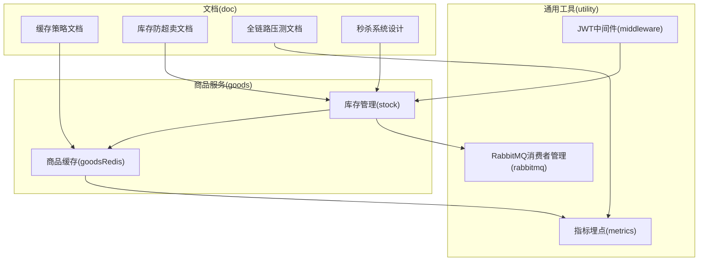
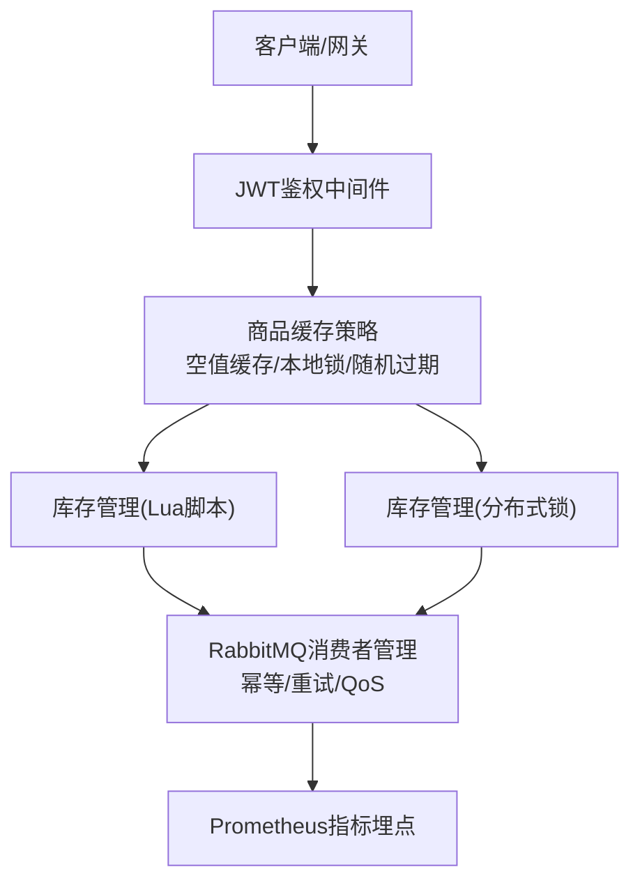
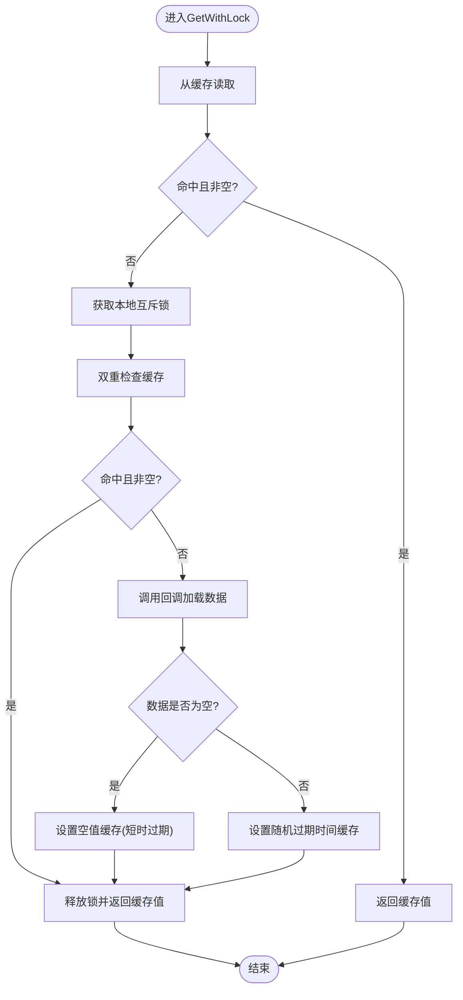
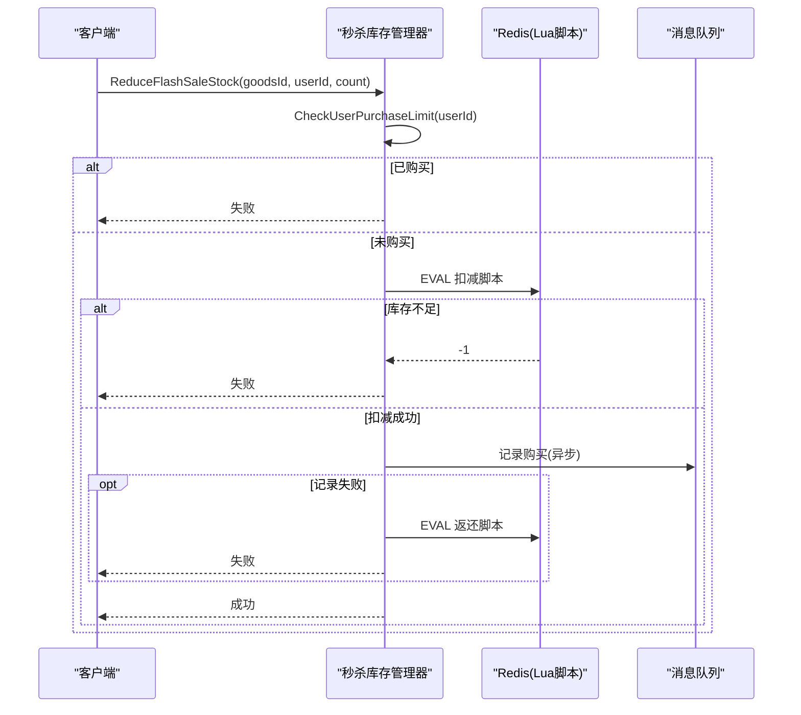
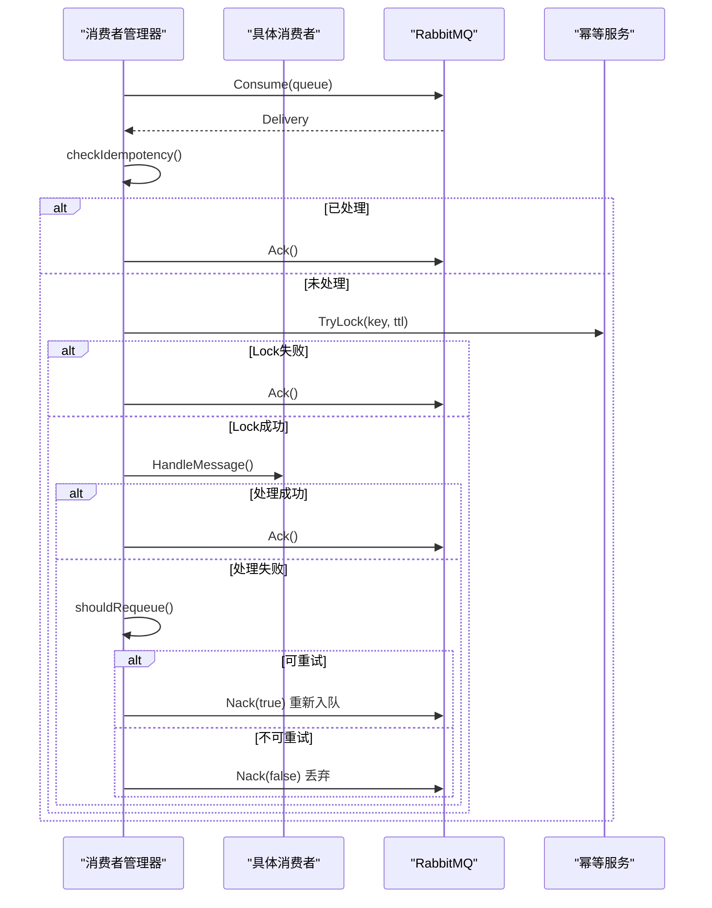
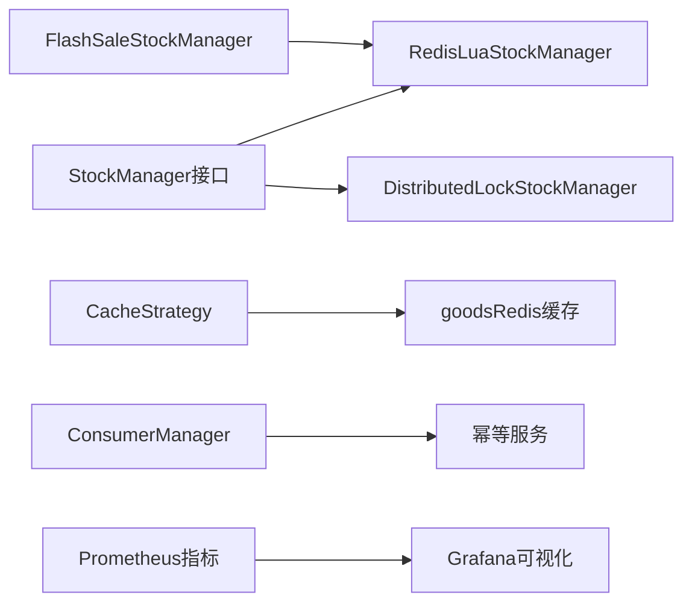

# 性能优化

<cite>
**本文引用的文件**
- [app/goods/utility/stock/redis_lua.go](file://app/goods/utility/stock/redis_lua.go)
- [app/goods/utility/stock/distributed_lock.go](file://app/goods/utility/stock/distributed_lock.go)
- [app/goods/utility/stock/flash_sale_stock.go](file://app/goods/utility/stock/flash_sale_stock.go)
- [app/goods/utility/stock/stock.go](file://app/goods/utility/stock/stock.go)
- [app/goods/utility/goodsRedis/cache_strategy.go](file://app/goods/utility/goodsRedis/cache_strategy.go)
- [app/goods/utility/goodsRedis/redis.go](file://app/goods/utility/goodsRedis/redis.go)
- [utility/rabbitmq/consumer_manager.go](file://utility/rabbitmq/consumer_manager.go)
- [utility/metrics/metrics.go](file://utility/metrics/metrics.go)
- [utility/middleware/jwt.go](file://utility/middleware/jwt.go)
- [doc/Redis缓存策略-穿透-击穿-雪崩全解决方案.md](file://doc/Redis缓存策略-穿透-击穿-雪崩全解决方案.md)
- [doc/库存防超卖（Redis Lua+分布式锁对比实践）.md](file://doc/库存防超卖（Redis Lua+分布式锁对比实践）.md)
- [doc/全链路压测-执行与结果分析流程.md](file://doc/全链路压测-执行与结果分析流程.md)
- [doc/全链路压测-环境部署与监控方案.md](file://doc/全链路压测-环境部署与监控方案.md)
- [doc/秒杀系统设计方案.md](file://doc/秒杀系统设计方案.md)
</cite>

## 目录
1. [简介](#简介)
2. [项目结构](#项目结构)
3. [核心组件](#核心组件)
4. [架构总览](#架构总览)
5. [详细组件分析](#详细组件分析)
6. [依赖分析](#依赖分析)
7. [性能考量](#性能考量)
8. [故障排查指南](#故障排查指南)
9. [结论](#结论)
10. [附录](#附录)

## 简介
本文件聚焦于本仓库在高并发场景下的性能优化实践，围绕“缓存策略（穿透/击穿/雪崩）”、“库存管理（Redis Lua脚本与分布式锁）”、“数据库查询与连接池优化”、“高并发保护（限流/降级/熔断）”以及“性能测试与调优”五个维度展开。文档既提供代码级实现细节，也给出系统级优化建议与可视化图示，帮助读者快速落地高性能、高可用的微服务架构。

## 项目结构
本项目采用多模块微服务架构，性能优化相关的关键实现集中在以下模块：
- 商品服务（goods）：库存管理（Lua脚本与分布式锁）、商品缓存策略（空值缓存、本地锁、随机过期）
- 通用中间件与工具（utility）：指标埋点（Prometheus）、JWT鉴权中间件、RabbitMQ消费者管理（幂等、重试、QoS）
- 文档（doc）：缓存策略、库存防超卖、全链路压测、秒杀系统设计等专题文档

**章节来源**
- [app/goods/utility/stock/redis_lua.go](file://app/goods/utility/stock/redis_lua.go#L1-L166)
- [app/goods/utility/stock/distributed_lock.go](file://app/goods/utility/stock/distributed_lock.go#L1-L266)
- [app/goods/utility/goodsRedis/cache_strategy.go](file://app/goods/utility/goodsRedis/cache_strategy.go#L1-L96)
- [utility/rabbitmq/consumer_manager.go](file://utility/rabbitmq/consumer_manager.go#L1-L446)
- [utility/metrics/metrics.go](file://utility/metrics/metrics.go#L1-L71)

## 核心组件
- 库存管理接口与实现
  - 接口定义：统一的库存管理接口，包含扣减、返还、查询、初始化库存等方法
  - 实现一：基于Redis Lua脚本的库存管理器，原子性执行库存检查与扣减
  - 实现二：基于分布式锁的库存管理器，通过NX+EX获取锁，Lua脚本释放锁，避免误删
  - 秒杀库存管理器：继承Lua库存管理器，增加用户购买限制与缓存记录
- 商品缓存策略
  - 带本地锁的缓存获取：双重检查+本地互斥锁，防止缓存击穿
  - 随机过期时间：为每个缓存项添加5%~15%抖动，防止缓存雪崩
  - 空值缓存：对不存在的数据设置短时空值，防止缓存穿透
- 消息队列消费者管理
  - 幂等性：基于消息ID与业务ID生成幂等键，结合TTL与TryLock实现幂等
  - 重试策略：根据错误类型与重试次数决定是否重新入队
  - QoS：PrefetchCount与AutoAck配置，平衡吞吐与稳定性
- 指标埋点与中间件
  - Prometheus指标：请求总量、延迟直方图、错误计数
  - JWT中间件：鉴权失败快速返回，减少无效处理

**章节来源**
- [app/goods/utility/stock/stock.go](file://app/goods/utility/stock/stock.go#L1-L32)
- [app/goods/utility/stock/redis_lua.go](file://app/goods/utility/stock/redis_lua.go#L1-L166)
- [app/goods/utility/stock/distributed_lock.go](file://app/goods/utility/stock/distributed_lock.go#L1-L266)
- [app/goods/utility/stock/flash_sale_stock.go](file://app/goods/utility/stock/flash_sale_stock.go#L1-L152)
- [app/goods/utility/goodsRedis/cache_strategy.go](file://app/goods/utility/goodsRedis/cache_strategy.go#L1-L96)
- [utility/rabbitmq/consumer_manager.go](file://utility/rabbitmq/consumer_manager.go#L1-L446)
- [utility/metrics/metrics.go](file://utility/metrics/metrics.go#L1-L71)
- [utility/middleware/jwt.go](file://utility/middleware/jwt.go#L1-L39)

## 架构总览
下图展示了高并发场景下的关键路径：前端/网关 → 鉴权中间件 → 商品缓存策略 → 库存管理（Lua脚本或分布式锁）→ 消息队列异步处理（订单、退款等）→ 指标埋点与监控。

**图表来源**
- [utility/middleware/jwt.go](file://utility/middleware/jwt.go#L1-L39)
- [app/goods/utility/goodsRedis/cache_strategy.go](file://app/goods/utility/goodsRedis/cache_strategy.go#L1-L96)
- [app/goods/utility/stock/redis_lua.go](file://app/goods/utility/stock/redis_lua.go#L1-L166)
- [app/goods/utility/stock/distributed_lock.go](file://app/goods/utility/stock/distributed_lock.go#L1-L266)
- [utility/rabbitmq/consumer_manager.go](file://utility/rabbitmq/consumer_manager.go#L1-L446)
- [utility/metrics/metrics.go](file://utility/metrics/metrics.go#L1-L71)

## 详细组件分析

### 缓存策略：穿透/击穿/雪崩全方案
- 缓存穿透
  - 空值缓存：对不存在的数据写入特殊空值并设置短时过期，拦截重复请求
  - 本地锁：双重检查+本地互斥锁，避免热点键过期时的“击穿风暴”
- 缓存击穿
  - 本地锁：在缓存失效瞬间，仅允许一个请求重建缓存，其余请求等待
  - 双重检查：锁内再次检查缓存，避免重复拉取
- 缓存雪崩
  - 随机过期时间：为每个缓存项增加5%~15%抖动，避免集中过期
  - 缓存预热：在低峰期将热点数据加载到缓存
- 实现要点
  - 本地锁使用sync.Map按key存储互斥锁，避免锁对象膨胀
  - JSON序列化缓存值，设置带抖动的过期时间

**图表来源**
- [app/goods/utility/goodsRedis/cache_strategy.go](file://app/goods/utility/goodsRedis/cache_strategy.go#L32-L78)

**章节来源**
- [app/goods/utility/goodsRedis/cache_strategy.go](file://app/goods/utility/goodsRedis/cache_strategy.go#L1-L96)
- [app/goods/utility/goodsRedis/redis.go](file://app/goods/utility/goodsRedis/redis.go#L1-L49)
- [doc/Redis缓存策略-穿透-击穿-雪崩全解决方案.md](file://doc/Redis缓存策略-穿透-击穿-雪崩全解决方案.md#L1-L587)

### 库存管理：Redis Lua脚本 vs 分布式锁
- Lua脚本方案
  - 原子性：在Redis端执行“获取库存→判断→扣减”的完整流程，避免竞态
  - 性能：单次EVAL调用，网络往返少，吞吐高
  - 复杂度：脚本逻辑需精简，避免复杂分支与循环
- 分布式锁方案
  - 原子性：通过SET NX EX + Lua释放锁，确保锁的获取与释放原子
  - 复杂度：需要处理锁超时、重试、异常释放等问题
  - 适用：复杂业务（需要跨资源协调）或Lua脚本难以表达的流程
- 秒杀场景增强
  - 用户购买限制：使用本地缓存记录用户购买状态，避免重复购买
  - 记录失败回滚：扣减成功后记录购买，失败则返还库存

**图表来源**
- [app/goods/utility/stock/flash_sale_stock.go](file://app/goods/utility/stock/flash_sale_stock.go#L52-L99)
- [app/goods/utility/stock/redis_lua.go](file://app/goods/utility/stock/redis_lua.go#L75-L102)

**章节来源**
- [app/goods/utility/stock/stock.go](file://app/goods/utility/stock/stock.go#L1-L32)
- [app/goods/utility/stock/redis_lua.go](file://app/goods/utility/stock/redis_lua.go#L1-L166)
- [app/goods/utility/stock/distributed_lock.go](file://app/goods/utility/stock/distributed_lock.go#L1-L266)
- [app/goods/utility/stock/flash_sale_stock.go](file://app/goods/utility/stock/flash_sale_stock.go#L1-L152)
- [doc/库存防超卖（Redis Lua+分布式锁对比实践）.md](file://doc/库存防超卖（Redis Lua+分布式锁对比实践）.md#L1-L630)

### 消息队列消费者管理：幂等、重试与QoS
- 幂等性
  - 生成幂等键：rabbitmq:消费者名:消息ID:业务ID
  - TTL控制：支持从消息头读取idempotent_ttl，避免重复处理
  - TryLock：幂等服务错误时允许继续处理，避免阻塞业务
- 重试策略
  - 临时性错误：根据错误类型与重试次数决定是否重新入队
  - 永久性错误：直接拒绝并丢弃
- QoS与并发
  - PrefetchCount：限制单消费者未确认消息数，平衡吞吐与稳定性
  - AutoAck：可配置，建议异步处理完成后确认

**图表来源**
- [utility/rabbitmq/consumer_manager.go](file://utility/rabbitmq/consumer_manager.go#L196-L263)

**章节来源**
- [utility/rabbitmq/consumer_manager.go](file://utility/rabbitmq/consumer_manager.go#L1-L446)

### 指标埋点与中间件
- 指标埋点
  - HTTP请求总量、延迟直方图、错误计数，支持按方法、路径、状态聚合
  - 在ghttp服务器上注册/metrics端点，便于Prometheus抓取
- JWT中间件
  - 快速鉴权失败返回，减少无效处理与下游压力

**章节来源**
- [utility/metrics/metrics.go](file://utility/metrics/metrics.go#L1-L71)
- [utility/middleware/jwt.go](file://utility/middleware/jwt.go#L1-L39)

## 依赖分析
- 组件耦合
  - 库存管理器通过接口解耦Lua与分布式锁实现，便于按场景切换
  - 商品缓存策略依赖gcache与Redis适配器，提供统一缓存入口
  - RabbitMQ消费者管理器依赖幂等服务与gcache，保证消息处理的正确性
- 外部依赖
  - Redis：库存原子操作、缓存、幂等键存储
  - Prometheus/Grafana：指标采集与可视化
  - RabbitMQ：异步解耦与削峰填谷

**图表来源**
- [app/goods/utility/stock/stock.go](file://app/goods/utility/stock/stock.go#L7-L31)
- [app/goods/utility/stock/redis_lua.go](file://app/goods/utility/stock/redis_lua.go#L12-L23)
- [app/goods/utility/stock/distributed_lock.go](file://app/goods/utility/stock/distributed_lock.go#L13-L29)
- [app/goods/utility/stock/flash_sale_stock.go](file://app/goods/utility/stock/flash_sale_stock.go#L14-L40)
- [app/goods/utility/goodsRedis/cache_strategy.go](file://app/goods/utility/goodsRedis/cache_strategy.go#L18-L30)
- [utility/rabbitmq/consumer_manager.go](file://utility/rabbitmq/consumer_manager.go#L48-L71)
- [utility/metrics/metrics.go](file://utility/metrics/metrics.go#L45-L55)

**章节来源**
- [app/goods/utility/stock/stock.go](file://app/goods/utility/stock/stock.go#L1-L32)
- [app/goods/utility/goodsRedis/cache_strategy.go](file://app/goods/utility/goodsRedis/cache_strategy.go#L1-L96)
- [utility/rabbitmq/consumer_manager.go](file://utility/rabbitmq/consumer_manager.go#L1-L446)

## 性能考量
- 缓存策略
  - 空值缓存+本地锁+随机过期，三者协同抵御穿透、击穿与雪崩
  - 建议热点数据设置更短基础过期时间并启用随机抖动
- 库存管理
  - 高并发场景优先Lua脚本方案，减少网络往返与锁竞争
  - 分布式锁适用于复杂业务流程，注意锁超时与重试策略
- 消息队列
  - 合理设置PrefetchCount，避免消费者堆积导致延迟放大
  - 幂等与重试策略降低异常对业务的影响
- 指标与监控
  - 通过Prometheus采集关键指标，结合Grafana建立SLA看板
  - 关注CPU、内存、Redis内存使用率、数据库连接池使用率

[本节为通用指导，无需列出具体文件来源]

## 故障排查指南
- 缓存相关
  - 缓存命中率低：检查键设计、过期时间、是否频繁空值缓存
  - 缓存击穿：确认本地锁是否生效、双重检查是否遗漏
  - 缓存雪崩：检查是否统一设置随机抖动、是否进行缓存预热
- 库存相关
  - 超卖：确认是否使用Lua脚本或分布式锁，脚本/锁逻辑是否正确
  - 性能瓶颈：对比Lua与分布式锁方案，评估锁竞争与网络往返
- 消息队列
  - 重复消费：检查幂等键生成与TTL设置
  - 消息堆积：检查PrefetchCount与消费者处理耗时
- 指标与监控
  - 指标缺失：确认/metrics端点是否暴露、抓取间隔是否合理
  - 告警不生效：检查Alertmanager规则与通知渠道

**章节来源**
- [app/goods/utility/goodsRedis/cache_strategy.go](file://app/goods/utility/goodsRedis/cache_strategy.go#L1-L96)
- [app/goods/utility/stock/redis_lua.go](file://app/goods/utility/stock/redis_lua.go#L1-L166)
- [app/goods/utility/stock/distributed_lock.go](file://app/goods/utility/stock/distributed_lock.go#L1-L266)
- [utility/rabbitmq/consumer_manager.go](file://utility/rabbitmq/consumer_manager.go#L265-L320)
- [utility/metrics/metrics.go](file://utility/metrics/metrics.go#L45-L71)

## 结论
本项目在缓存、库存、消息与监控四个层面形成了完整的性能优化闭环：以缓存策略抵御穿透/击穿/雪崩，以Lua脚本或分布式锁保障库存一致性，以幂等与重试提升消息处理可靠性，并通过Prometheus/Grafana实现可观测性与告警。建议在高并发场景优先采用Lua脚本库存方案，配合缓存随机过期与预热策略，结合压测与持续监控，持续迭代优化。

[本节为总结性内容，无需列出具体文件来源]

## 附录

### 数据库查询与连接池优化（参考文档）
- 主从分离与读写分离：通过配置多个数据库实例，SELECT走从库，写操作走主库，降低主库压力
- 健康检查与故障转移：定期检查从库健康状态，动态切换可用从库，保障读取可用性
- 连接池参数：合理设置最大空闲连接、最大打开连接、最大生命周期，避免连接泄漏与抖动

**章节来源**
- [doc/秒杀系统设计方案.md](file://doc/秒杀系统设计方案.md#L2813-L2896)
- [doc/秒杀系统设计方案.md](file://doc/秒杀系统设计方案.md#L2899-L3055)

### 高并发保护机制（限流/降级/熔断）
- 限流：在网关或服务入口设置令牌桶/漏桶，区分普通流量与压测流量
- 降级：Redis不可用时降级为数据库直连，保证核心功能可用
- 熔断：对下游依赖设置熔断器，异常比例过高时快速失败并快速恢复

**章节来源**
- [doc/全链路压测-环境部署与监控方案.md](file://doc/全链路压测-环境部署与监控方案.md#L350-L396)

### 性能测试方法与压测方案
- 场景设计：商品浏览、下单购买、退款处理等核心流程组合
- 执行流程：预热→逐步加压→稳定运行→极限测试，实时监控关键指标
- 结果分析：响应时间分布、吞吐量拐点、资源使用率、错误根因分析
- 报告模板：包含测试概述、场景描述、性能结果、问题分析与优化建议

**章节来源**
- [doc/全链路压测-执行与结果分析流程.md](file://doc/全链路压测-执行与结果分析流程.md#L1-L467)
- [doc/全链路压测-环境部署与监控方案.md](file://doc/全链路压测-环境部署与监控方案.md#L1-L502)